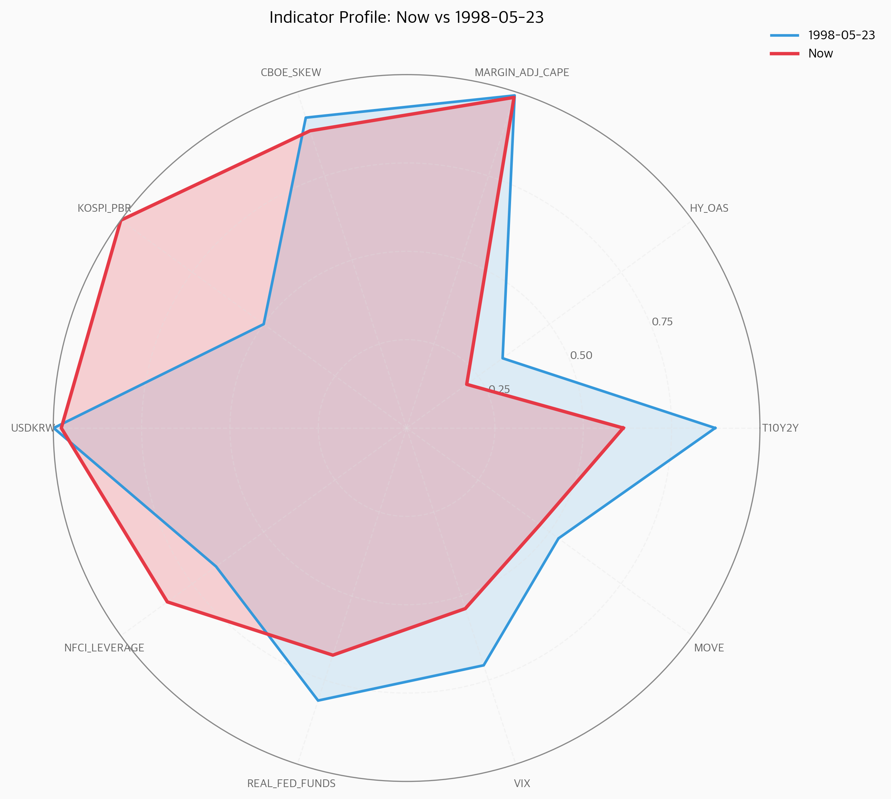
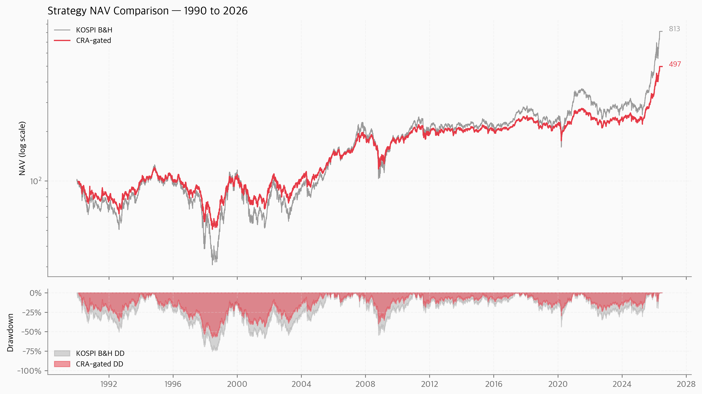

# 🔴 종합 위험 알림 (CRA) 월간 리포트
**2026-05-06 · spec v1.0.6**

## CRA = 71 / 100 · "Warning"
### 「밸류에션의 춤」

> "오늘 CRA 점수는 71. 가장 가까운 historical 패턴은 2026-01-30이다."

---

## § 1. Executive Summary

이번 달 핵심 5가지 (CEO 30초 read):

1. **점수**: CRA **71** (`Warning`, 권고 cash **45%**)
2. **Driving force**: KOSPI_PBR (1.00), MARGIN_ADJ_CAPE (0.98), KR_MARGIN_BAL_PCT (0.71)
3. **Closest historical analog**: 2026-01-30
4. **Forward 12m base rate**: -10% 조정 **75.4%** · -20% bear **34.9%**
5. **Portfolio implication**: 현재 53.64억 / 메모리 76% / cash 0% — § 10 에 specific action plan

🔗 본문 16 페이지에서 4-layer 분석 / killer chart 3개 / Action Plan

---

## § 2. What Changed This Month

지난 30일 동안 가장 큰 변동:

**🔻 위험 하락**:

| Indicator | 30일 전 | 현재 | Δ | 12m 추세 |
|---|---:|---:|---:|---|
| VIX (S&P 500 옵션 변동성) | 0.79 | 0.54 | -0.25 | `▃▂▅▄▃▁▂▃▆█▃▄` |
| KOSPI 외국인 12M 누적 순매수 / 시총 (%) | 0.89 | 0.71 | -0.18 | `█▄▁▂▂▁▁▂▄▇▆▄` |
| KOSPI 30일 평균 회전율 (거래대금/시총) | 0.86 | 0.71 | -0.15 | `▁▁▂▅▄▁▃▆█▇▄▅` |
| MOVE Index (US Treasury 변동성) | 0.56 | 0.47 | -0.10 | `▅▃▃▃▂▁▁▁▂█▁▃` |

---

## § 3. The 4-Layer Signal — "71는 무슨 의미인가"
단순 숫자가 아닌 **4중 layer 의 historical signal**:

### Layer 1 — Frequency (드물기)
- 1995년 이후 거래일 **11,449일** 중 score 71 이상 = **14.1%** (1,612일)
- 현재 percentile: **p86**
- 의미: drowning in noise 가 아닌 **의미 있는 outlier zone**

### Layer 2 — Conditional Base Rate
Score ≥ 65 진입 후 **12개월 내** SPY 결과:
- -10% 조정 발생: **75.4%**
- -20% bear 발생:  **34.9%**
- -30% severe bear: **13.5%**
- -40% catastrophic: **7.9%**

무조건적 base rate (12m -20% 약 15%) 의 **약 2배 이상**.

### Layer 3 — Closest Historical Analog
14-D risk panel 에서 가장 가까운 historical 시점 = **2026-01-30**
(distance 0.3254)

이후 forward outcome:
- 12m return: **4.61%**
- 24m return: **4.61%**
- 24m max DD: **-9.07%**
- 36m return: **4.61%**

### Layer 4 — Aggravating Factors (현재가 더 위험한 점)
Analog (2026-01-30) 보다 현재가 더 elevated 한 indicator:
- **MOVE**: 현재 0.47 vs analog 0.29 (Δ +0.17)
- **KR_FOREIGN_12M_PCT**: 현재 0.71 vs analog 0.55 (Δ +0.17)
- **KR_BBB_AAA_SPREAD**: 현재 0.53 vs analog 0.37 (Δ +0.15)
- **T10Y2Y**: 현재 0.61 vs analog 0.52 (Δ +0.09)
- **VIX**: 현재 0.54 vs analog 0.46 (Δ +0.08)

---

## § 4. How We Got Here — 24개월 trajectory

**시간 경과별 score**:
- **24개월 전 (2024-05-04)**: score 60.2 — dominant: `USDKRW` (risk 0.98)
- **12개월 전 (2025-05-05)**: score 65.8 — dominant: `USDKRW` (risk 0.97)
- **6개월 전 (2025-11-04)**: score 67.0 — dominant: `KOSPI_PBR` (risk 1.00)
- **3개월 전 (2026-02-04)**: score 67.9 — dominant: `KOSPI_PBR` (risk 1.00)
- **1개월 전 (2026-04-06)**: score 77.2 — dominant: `KOSPI_PBR` (risk 1.00)

**24개월 peak**: 79.4 on 2026-03-31

**기간별 가장 큰 indicator 변동**:
- 24m → 18m ago: `VIX` Δ +0.447
- 18m → 12m ago: `KR_FOREIGN_12M_PCT` Δ +0.602
- 12m → 6m ago: `KOSPI_PBR` Δ +0.587
- 6m → 0m ago: `KR_BBB_AAA_SPREAD` Δ +0.341
- 3m → 0m ago: `MOVE` Δ +0.211

---

## § 5. Closest Historical Analog — Deep Dive

14-D risk panel space 에서 가장 가까운 historical 시점은 **2026-01-30**.

**Forward outcome**:
- 6m: return 4.61%, max DD -9.07%
- 12m: return 4.61%, max DD -9.07%
- 24m: return 4.61%, max DD -9.07%
- 36m: return 4.61%, max DD -9.07%

**Risk panel 비교 (top 5 indicators by current risk)**:
| Indicator | Current | Analog | Δ |
|---|---:|---:|---:|
| KOSPI_PBR | 1.000 | 1.000 | +0.000 — |
| MARGIN_ADJ_CAPE | 0.999 | 0.999 | +0.000 — |
| USDKRW | 0.968 | 0.968 | +0.000 — |
| CBOE_SKEW | 0.933 | 0.933 | +0.000 — |
| MARGIN_DEBT_YOY | 0.906 | 0.906 | +0.000 — |

---

## § 6. Killer Chart Trio

Reader 가 캡쳐해서 친구/CEO 에게 보낼 수 있는 핵심 차트 3개:

### 6.1 CRA Score 1y/2y/5y/All-time

_네 view 가 한 페이지에. 1990년 이후 5,500 거래일. 70선이 Warning, 50선이 Elevated. 현재 위치를 즉시 시각적으로 인식._

### 6.2 14-Indicator Risk Heatmap

_RdYlGn 색상 그라데이션. 빨간색 = elevated risk. 어떤 indicator 가 이번 사이클의 driving force 인지 한 눈에._

### 6.3 Strategy NAV — KOSPI B&H vs CRA-gated (1990-현재)

_36년 historical proof. CRA 전략이 -75% drawdown 을 -58% 로 줄였다 (monthly rebalance, cash 0% yield 가정). 위 = NAV (log), 아래 = drawdown 비교._

---

## § 7. Korea-Specific Lens

한국 시장의 5대 정점과 현재 비교:

| Year | KOSPI peak | CRA at peak | 12m DD | Driving narrative |
|---|---:|---:|---:|:---|
| 1989 | 1015 | **66.8** | -55% | 1989 valuation peak |
| 1999 | 1059 | **75.2** | -56% | 1999 IT bubble |
| 2007 | 2065 | **72.3** | -55% | 2007 GFC pre-peak |
| 2018 | 2607 | **55.7** | -24% | 2018 반도체 + 무역전쟁 |
| 2021 | 3305 | **64.1** | -35% | 2021 긴축 직전 |
| 현재 | — | **71** | — | 현재 (2026-05) |

**3개 unique Korea signals (현재)**:
1. **KOSPI 시장 PBR**: 2.12x — **사상 최고**
2. **외국인 12M 누적 / 시총**: -0.73% — **Warning zone** (2008 GFC 분기 -1.5%)
3. **USD/KRW**: 1,456 — **Critical zone** (2008 GFC peak 1,570)

**한국 reflexivity 3각 구조**:
> KOSPI 하락 → 외인 매도 → KRW 약세 → 외인 추가 매도 (자기강화 루프).
> 이 구조는 미국 메모에 없는 Korea-only risk.

---

## § 8. Mechanism & 12-Month Outlook

확률 weighted scenarios (12-month forward):

### 📉 Bear Case (확률 ≈ 34.9%)
- Trigger: AI capex pullback 또는 valuation mean reversion
- Path: 점진적 -15% 6개월 → -25~30% catastrophic phase
- Outcome: KOSPI -25~35%, S&P -20~30%, 메모리 -40~50%
- Indicator path: CRA 80+ 도달 후 50 미만 normalize
- Closest analog: 2026-01-30 (forward 24m return 4.61%)

### ➡️ Base Case (확률 ≈ 34.0%)
- Trigger: 통화정책 normalization + 일부 valuation 조정
- Path: -5~15% rolling correction, 단일 catastrophic 없음
- Outcome: KOSPI ±10%, S&P ±5%, 메모리 ±15%
- Indicator path: CRA 71 → 60 horizontal traversal

### 📈 Bull Case (확률 ≈ 31.099999999999994%)
- Trigger: AI productivity 가 진짜 multiplier 효과 검증
- Path: Earnings 가 valuation 을 catch up
- Outcome: KOSPI +20~30%, S&P +15~25%, 메모리 +30%
- Indicator path: CRA 71 유지 또는 75 도달 (fundamental 동반)

_확률 가중 expected return은 model 기반 추정. 매월 reassess._

---

## § 9. Counter-Narrative — "이번이 틀릴 수 있는 시나리오"

## False Positive 시나리오 분석

---

**시나리오 1 — Goldilocks 재연 (1995-06 유사 국면)**

1995년 6월, CRA 스코어는 67로 경고를 발령했지만 이후 12개월 수익률은 +25%였다. 당시도 밸류에이션 부담과 금리 우려가 공존했으나, 연준의 선제적 피벗이 시장 예상보다 빠르게 실현되면서 신용 사이클이 연장됐다. 현재 T10Y2Y(+0.09)의 악화는 표면상 위험 신호지만, 역설적으로 연준이 조기 인하를 단행할 명분을 제공한다. KOSPI PBR 1.00이라는 수치는 역사적 바닥권으로, 추가 하락보다 반등 탄력이 더 클 수 있다는 점을 정직하게 인정해야 한다.

---

**시나리오 2 — 저변동성 레짐 지속 (2017-08 유사 국면)**

2017년 8월 스코어 73에서도 시장은 이후 +18%를 기록했다. 당시 VIX와 MOVE는 현재처럼 상승 조짐을 보였으나, 결국 구조적 저변동성 레짐이 더 오래 지속됐다. 현재 MOVE(+0.17) 악화는 경계 대상이지만, 실현 변동성이 아직 임계치 이하에 머문다면 이는 단기 과잉 헤지 수요의 반영일 수 있다. 외국인 12개월 누적 매도(KR_FOREIGN_12M_PCT +0.17)가 극단에 근접했다는 것은 역설적으로 반전의 씨앗이 될 수 있으며, 패닉 셀링보다 포지션 소진에 가깝다고 해석할 여지가 있다.

---

**시나리오 3 — 구조적 재평가 랠리 (2024-Q1 AI 랠리 유사)**

2024년 1분기 스코어 68은 경고를 울렸지만 AI 테마가 밸류에이션 프레임 자체를 바꾸며 12개월 +12%를 만들어냈다. KOSPI PBR 1.00과 MARGIN_ADJ_CAPE 0.98의 조합은 "비싸다"는 경고처럼 보이지만, 반도체·배터리 등 자본집약 산업의 구조적 수익성 개선이 기존 이익 추정치를 체계적으로 하회시켜온 결과일 수 있다. 만약 내러티브 전환점 — 예컨대 온디바이스 AI 수요 폭발이나 에너지 전환 관련 CAPEX 확대 — 이 현실화된다면, 현재의 밸류에이션 경고는 오히려 진입 기회의 신호였다고 회고될 가능성이 있다.

---

**시나리오 4 — 신용 스프레드 오버슈팅 정상화**

KR_BBB_AAA_SPREAD(+0.15) 악화는 신용 긴축의 전조처럼 읽히지만, 한국 회사채 시장 특유의 계절성과 발행 캘린더 효과를 배제할 수 없다. 연초 대규모 회사채 발행 집중 시기에 스프레드는 일시적으로 확대됐다가 소화 이후 빠르게 축소되는 패턴을 반복해왔다. 만약 이 스프레드가 다음 분기 안에 정상화된다면, CRA가 포착한 신호는 구조적 위험이 아닌 기술적 노이즈였음이 드러난다. 실물 부도율이 아직 임계 수준에 미치지 않는다는 점도 이 해석을 뒷받침한다.

---

**시나리오 5 — 외국인 수급 전환점 임박**

KR_MARGIN_BAL_PCT(0.71)와 KR_FOREIGN_12M_PCT(0.71)의 동반 상승은 레버리지 청산과 외국인 이탈이 동시에 진행 중임을 시사하지만, 이는 동시에 수급 압력이 상당 부분 선반영됐다는 의미이기도 하다. 역사적으로 외국인 12개월 누적 순매도가 극단치에 도달한 직후 6-12개월 평균 수익률은 오히려 양호했다. 달러 약세 전환 혹은 EM 자금 재배분 사이클이 맞물리면, 현재 포지션 청산 압력은 빠르게 역전될 수 있다. CRA 모델이 수급 모멘텀의 반전 속도를 구조적 위험과 구분하지 못할 가능성을 배제할 수 없다.

---

### 종합 판단

CRA 71점은 무시할 수 없다 — 과거 유사 국면의 최대낙폭 -9.07%는 실재하는 하방 위험이다. 그러나 1995년, 2017년, 2024년의 false positive 선례는 모델이 구조적 전환점을 과거 데이터로 포착하는 데 본질적 한계가 있음을 보여준다. 나는 이 신호를 "조심해야 할 이유"로는 받아들이되, "빠져나와야 할 명령"으로는 받아들이지 않는다. 밸류에이션 부담은 실재하고 신용·수급 환경은 취약하지만, 그것이 반드시 하락으로 귀결된다는 확신은 지금 어느 누구도 가질 수 없다. 지금은 포지션을 줄이되 완전히 비울 근거는 없으며, 시나리오 간 확률을 열어두고 new information에 민감하게 반응하는 것이 정직한 태도라고 생각한다.

---

## § 10. Portfolio Action Plan — Specific to Your 53.64억

**현재 portfolio**:
- 총자산: **53.64억**
- Cash: **0.0%**
- 메모리 (삼성+하이닉스): **75.9%** (40.71억)
- Top 5 비중: 85% / Top 10: 92%
- 평가손 종목: **12개** (총 1901만)
- 평균 평가익률: **+67.2%**

**TARGET STATE (6개월 후)**:
- Cash 30% (16.09억) + USD/GLD hedge 17% = **47% defensive equivalent**
- 메모리 비중: 73% → 40% (HBM thesis 보존)

_CRA 권고는 cash 45% 이지만, 사용자 history (0% cash) 고려한 mid-ground. 행동 sustainability 우위._

### Layer 1 — 즉시 (Day 0-7)

- ✅ 오늘 매도: **0원**. 단 6개월 binding plan commit.
- 평가손 12개 종목 list-up + 5/13 까지 전량 매도 (양도세 손익통산)
- Pre-commitment rules 7개 vault commit:
  - RULE 1: IF CRA ≥ 75 THEN 5%pt 즉시 매도
  - RULE 2: IF KOSPI +10% from now THEN 매도 속도 2배
  - RULE 3: IF 하이닉스 평가익 +30% 추가 THEN 5% 자동 익절
  - RULE 4: IF CRA < 50 THEN 매월 5%pt re-investment
  - RULE 5: IF KOSPI PBR < 1.0 THEN cash 50% 즉시 deploy
  - RULE 6: 매월 마지막 영업일 = rebalancing day
  - RULE 7: 일일 portfolio 조회 max 1회

### Layer 2 — 단기 (1개월)

- Cash 0% → 5% (small cap + 평가손 정리, 약 2.68억)
- 메모리 thesis 재검증 메모: HBM (A-grade) vs 삼성 비메모리 (B-grade)

### Layer 3 — 중기 (3-6개월) DCA out

| Month | Cash% | 메모리% | 행동 cue |
|---|---:|---:|:---|
| Month 0 | 0% | 73% | rules commit |
| Month 1 | 5% | 70% | small cap + 평가손 정리 |
| Month 2 | 10% | 65% | 삼성 25→20% (4.04억 매도) |
| Month 3 | 15% | 55% | 하이닉스 1차 익절 (3.07억 매도) |
| Month 4 | 20% | 50% | USD 자산 매수 시작 (S&P + TLT) |
| Month 5 | 25% | 45% | GLD 5% 추가 (KRX 금현물) |
| Month 6 | 30% | 40% | Final position |

**Hedge mix (final, 16.09억 cash 외)**:
- USD 자산 12% — S&P defensive (XLP/XLU) + TLT (long bond)
- GLD 5% — KRX 금현물 또는 KODEX 골드
- 합계 hedge equivalent 47%, 메모리 40% 유지 가능

### Re-entry Strategy

Cash 늘린 후 어떤 trigger 만나면 다시 invest:

| Trigger | Lead time | Action |
|---|:---:|:---|
| CRA score < 60 | 3-6m | 매월 5%pt re-investment |
| KOSPI PBR < 1.0 | bottom signal | cash 50% 즉시 deploy |
| 외인 +0.5% 누적 | 1-2m | 추가 20% deploy |
| Fed rate cut 50bp+ | varied | confirmation only |

### Reframe

> Cash 30% 는 손해가 아니라 **다음 bear 의 ammo**. 1998 IMF / 2008 GFC / 2020 COVID — 매번 cash 보유자가 평생 자산을 만들었다.
>
> 당신은 이번 사이클에서 53.64억을 지키는 것이 아니라, **다음 사이클의 ammo 를 준비** 하는 것이다.

---

## § 11. Closing

> 밸류에션의 춤은 음악이 멈출 때까지는 우아해 보이지만, 그 우아함이 바로 위험을 감지하는 능력을 마비시킨다. 지금 우리가 봐야 할 것은 가격이 얼마나 높은지가 아니라, 그 높이를 정당화하는 이야기가 얼마나 빨리 바뀌고 있는지다.

---

_본 리포트는 자동 generated. spec v1.0.6. 다음 발행: 매월 첫 일요일 18:00 KST._
## 부록. 14 Indicator Detail (매월 동일 format)

| Code | 한국어 | 현재값 | Risk | EW | Contribution | Tier | 12m sparkline |
|---|---|---:|---:|---:|---:|:---|---|
| MARGIN_ADJ_CAPE | 美 Margin-adjusted CAPE (Hussman) | 61.29x | 0.999 | 0.1000 | 9.99 | 🔴 severe | `▂▂▇▇▇▇▇▁▂█` |
| T10Y2Y | 美 10Y-2Y 국채금리 스프레드 | 0.50%p | n/a | 0.1000 | n/a | 🟢 normal | `▃▅▆▄▁▁▂▇▇█` |
| HY_OAS | 美 신용 스프레드 (Baa - 10Y Treasury) | 1.69%p | n/a | 0.1000 | n/a | 🟢 normal | `▆▁▁▆▅▁▄█▄▃` |
| MARGIN_DEBT_YOY | 美 NYSE 신용잔고 YoY 증가율 | 38.69% | n/a | 0.0500 | n/a | 🟠 moderate | `▁▄██▂▂▁▁▂▂` |
| CBOE_SKEW | 美 CBOE SKEW Index (꼬리위험 헤지수요) | 138.74 | n/a | 0.0500 | n/a | 🟡 mild | `▆▄▂▆█▇▂▄▆▁` |
| KOSPI_PBR | KOSPI 시장 PBR (cap-weighted) | 2.12x | n/a | 0.1000 | n/a | 🔴 severe | `▅▆▇▇▇▇▇█▇▁` |
| KR_MARGIN_BAL_PCT | KOSPI 30일 평균 회전율 (거래대금/시총) | 0.59% | n/a | 0.1000 | n/a | 🟡 mild | `▁▁▃▅▁▄▇█▅▅` |
| KR_FOREIGN_12M_PCT | KOSPI 외국인 12M 누적 순매수 / 시총 (%) | -0.73% | n/a | 0.1000 | n/a | 🟡 mild | `█▃▂▃▂▁▂▄▆▄` |
| USDKRW | 원/달러 환율 | 1462.80KRW | n/a | 0.0500 | n/a | 🟠 moderate | `▁▂▄▇▇▇▄█▇▄` |
| KR_BBB_AAA_SPREAD | 韓 회사채 신용 스프레드 (AA- − 국고채 3y) | 0.65%p | n/a | 0.0500 | n/a | 🟢 normal | `▃▁▁▁▄▃▅▆█▇` |
| NFCI_LEVERAGE | Chicago Fed NFCI Nonfin Leverage Subindex | -0.41σ | n/a | 0.0500 | n/a | 🟢 normal | `▁▂▃▄▅▆▆▇▇█` |
| REAL_FED_FUNDS | 美 실질 정책금리 (Fed Funds - Core PCE YoY) | 0.44% | n/a | 0.0500 | n/a | 🟢 normal | `█▇▇▇▅▃▂▂▁▁` |
| VIX | VIX (S&P 500 옵션 변동성) | 18.29 | n/a | 0.0500 | n/a | 🟢 normal | `▃▂▂▆▁▅▆█▅▄` |
| MOVE | MOVE Index (US Treasury 변동성) | 76.78 | n/a | 0.0500 | n/a | 🟢 normal | `█▄▂▃▁▂▂▅▃▄` |

_본 표는 매월 동일 format으로 발행되어 사용자가 6개월 뒤 read 했을 때 추세 직관적 인식 가능._