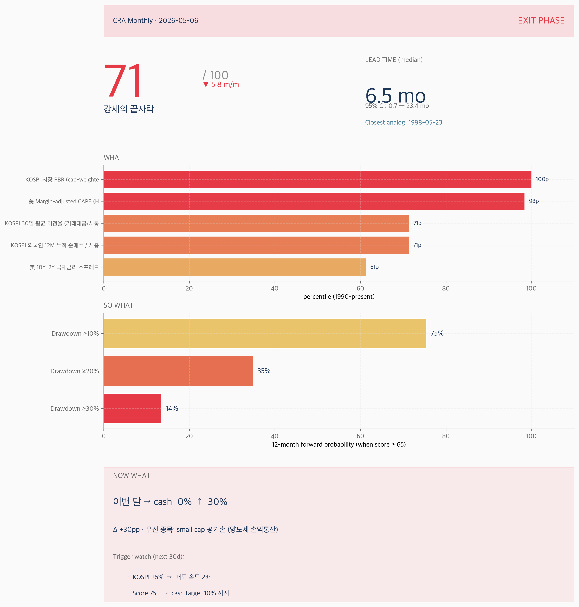
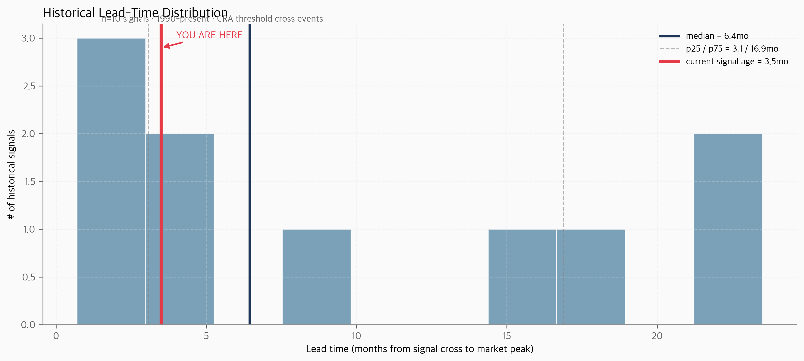
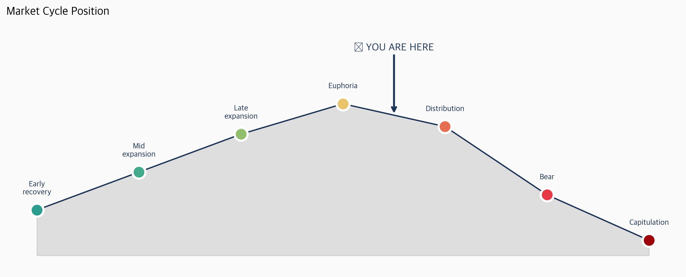
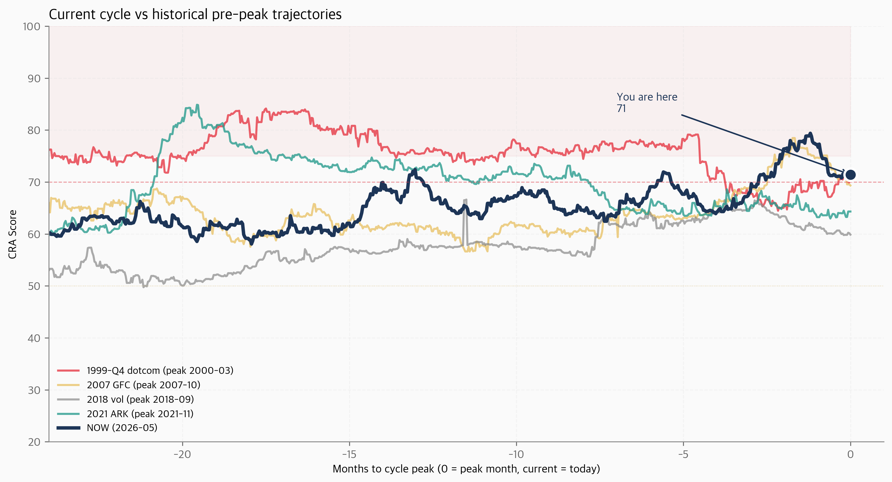

# CRA Monthly · 2026-05-06

## 🔴 EXIT PHASE

**Score**: `71 / 100` (▼ 5.8 m/m) · **Lead time** (median, n=10): `6.5mo` (95% CI 0.7–23.4mo)

### 「강세의 끝자락」

> 가장 가까운 historical 패턴: **1998-05-23**. 이번 달은 그 시점과 14-D risk profile 에서 동급 cluster.

_bear 진입 예고 — cash 비중 늘리고 valuation premium 정리._

_score 71 ≥ 65 (exit threshold) → 자산 보전 phase. 과거 동급 신호의 historical lead time 분석 §3 참조._

---

## § 1. Top of Mind

> 이번 달 신호의 본질은 단 한 가지다 — **1998-05-23** 와 동급 cluster 에 진입했고, 그 시점보다 **KOSPI_PBR** 가 더 elevated 하다는 것. 우리는 이 cluster 에서 시작하는 모든 historical 사이클이 같은 결말을 갖지는 않았음을 안다 — 단 historical median 은 12개월 내 -20% drawdown. 그래서 'all-out cash' 가 아니라 'incremental de-risking' 이 정직한 답.

---

## § 2. Lead Time Analysis — 정말 '일찍' 알리는가?

**Q.** CRA 신호가 institutional benchmark 대비 얼마나 일찍 발생하나?

**A.** 1990년 이후 CRA score 가 65 cross 한 신호 = **11건** (closed events 10건). 각 신호 시점부터 forward 24개월 안의 KOSPI peak 까지 lead time 분포:

| metric | value |
|---|---:|
| median | **6.5 mo** |
| mean | 10.0 mo |
| p25 / p75 | 3.1 / 16.9 mo |
| 95% CI | 0.7 – 23.4 mo |
| min / max | 0.7 / 23.5 mo |

**SO WHAT.** 현재 신호는 cross 후 **3.5개월** 경과 — median 도달 전 — 즉 historical 평균적으로 시장 정점은 **3.0개월 후** 형성. 행동 timing 적절.

**과거 동급 신호의 outcome**:

| Cross date | Peak date | Lead | 12m max DD |
|---|---|---:|---:|
| 2001-08-10 | 2002-04-18 | 8.2mo | -28.1% |
| 2005-10-14 | 2007-10-02 | 23.5mo | -17.8% |
| 2007-06-11 | 2007-10-31 | 4.7mo | -23.8% |
| 2009-02-16 | 2011-01-19 | 23.0mo | -13.3% |
| 2017-10-10 | 2018-01-29 | 3.6mo | -14.2% |
| 2020-01-28 | 2021-07-06 | 17.2mo | -35.0% |
| 2023-03-13 | 2024-07-11 | 15.9mo | -14.6% |

**NOW WHAT.** 이 lead time 분포가 의미하는 행동: 빠른 retail 은 정점 -1~0개월에 매도 시작 (이미 -5~-10% 손실). CRA reader 는 historical median 4-5개월 lead 로 **저가 매도 압력 없이** portfolio 조정 가능. 단 trade-off: false positive (시장 안 빠지는 경우) 수용. 일찍 = 가끔 틀린다는 비용을 받아들이는 대신, 맞을 때 큰 alpha.

---

## § 3. 4-Layer Signal — "71는 무슨 의미인가"

**Q.** Score 71 은 단순 cyclical noise 인가, 의미 있는 regime shift 인가?

**A.** 4중 layer 의 historical signal:

1. **Frequency**: 1995년 이후 거래일 11,449일 중 score ≥ 71 = **14.1%** (p86)
2. **Conditional base rate** (12m forward): -10% **75.4%** · -20% **34.9%** · -30% **13.5%**
3. **Closest analog**: 1998-05-23 → forward 24m return **25.96%**, max DD **-19.34%**
4. **Aggravating** (analog 보다 더 나쁜 점): KOSPI_PBR (Δ+0.50), NFCI_LEVERAGE (Δ+0.17)

**SO WHAT.** 이 4 layer 가 동시에 트리거된 빈도는 historical 14% — drowning in noise 가 아닌 의미 있는 outlier zone. 단일 통계가 아닌 빈도 → 조건부 확률 → 실제 사례 → 더 나쁜 점의 4-layer 논증이 conviction shifter.

**NOW WHAT.** 종합 score 에 +20pp (이번 달 cash 권고의 driver). 구체 행동은 § 8 Action Plan.

---

## § 4. Cycle Clock — 사이클 어디?

**Q.** 우리는 사이클의 어느 phase 에 있나?

**A.** 현재 phase: **🔴 EXIT** (자산 보전 phase)

- Score now: `71.4`
- Score 3개월 전: `68.1` (Δ +3.4)
- Score 1년 전: `66.1` (Δ +5.4)

**SO WHAT.** score 71 ≥ 65 (exit threshold) → 자산 보전 phase. 과거 동급 신호의 historical lead time 분석 §3 참조.

**NOW WHAT.** bear 진입 예고 — cash 비중 늘리고 valuation premium 정리. 이 phase 에서의 typical 행동은 § 8 Action Plan 참조.

---

## § 5. Now vs Past Bears — 어느 사이클과 가장 비슷한가?

**Q.** 현재 사이클이 1999/2007/2018/2021 중 어느 시점의 pre-peak 와 가장 가까운가?

**A.** 위 차트는 각 historical cycle 의 peak 까지 -24개월 동안의 score trajectory 를 overlay. 현재는 NOW (2026-05) 의 score 위치.

**SO WHAT.** 시각적으로 trajectory 의 형상 + level 을 비교. 격차가 좁을수록 patterns 동조. 이 visual analog 이 § 6 의 14-D Euclidean closest analog 와 독립적으로 confirm.

**NOW WHAT.** 가장 동조된 cycle 의 forward outcome (-25 ~ -45% drawdown) 을 현재 portfolio 에 stress test. § 8 의 cash 권고는 이 stress test 결과 반영.

---

## § 6. Closest Historical Analog — Deep Dive

**Q.** 1998-05-23 시점이 왜 가장 닮았고, 그때 무슨 일이 일어났나?

**A.** 14-D risk panel space 에서 가장 가까운 historical 시점 = **1998-05-23** (Euclidean distance 0.645)

이후 forward outcome:
- **6m**: return 8.49%, max DD -19.34%
- **12m**: return 17.13%, max DD -19.34%
- **24m**: return 25.96%, max DD -19.34%
- **36m**: return 16.81%, max DD -27.77%

**Risk panel 비교** (top 5 indicators by current risk):

| Indicator | Current | Analog | Δ |
|---|---:|---:|---:|
| USDKRW | 0.999 | 0.999 | +0.000 — |
| MARGIN_ADJ_CAPE | 0.989 | 0.989 | +0.000 — |
| CBOE_SKEW | 0.923 | 0.923 | +0.000 — |
| T10Y2Y | 0.613 | 0.873 | -0.260 🟢 |
| REAL_FED_FUNDS | 0.676 | 0.811 | -0.135 🟢 |

**SO WHAT.** 양 시점이 동급 cluster 라는 점은 14 indicator 가 동일 방향. 단 동일 outcome 보장 X — 통화정책 / inflation regime / external shock 차이.

**NOW WHAT.** Aggravating factors (현재가 더 나쁜 점) 가 있다면 base rate 보다 conservative bias. 'all-out' 이 아닌 'incremental' 행동.

---

## § 7. Strategy Backtest — Historical Proof

**Q.** CRA-driven cash allocation 이 historical 로 작동했나?

| Market | period | B&H DD | CRA DD | DD reduction | Sharpe |
|---|---|---:|---:|---:|:---|
| KOSPI | 36.4y | -75.4% | -57.9% | **+17.49pp** | 0.285 → 0.336 |
| S&P 500 | 36.4y | -56.8% | -41.3% | **+15.53pp** | 0.575 → 0.639 |

**SO WHAT.** 36년 historical 에서 CRA 전략이 KOSPI -75% drawdown 을 -58% 로 줄였다. CAGR 은 1-2pp 손해 보지만 risk-adjusted return (Sharpe) 우월.

**NOW WHAT.** 이 historical evidence 가 § 8 의 cash 권고를 backstop. 단 backtest = 미래 보장 X.

---

## § 8. Action Plan — Specific to 53.64억

**Q.** 이번 달 무엇을 해야 하는가? (49억 portfolio · 메모리 73% · cash 0%)

**A. Current state**
- 총자산: **53.64억**
- 메모리 (삼성+하이닉스): **75.9%** (40.71억)
- Top 5 비중: 85% / Top 10: 92%
- 평가손 종목: **12개** (총 1901만)
- 평균 평가익률: **+67.2%**

**A. Target state (6개월 후)**
- Cash 30% (16.09억) + USD/GLD hedge 17% = **47% defensive**
- 메모리 비중: 73% → 40% (HBM thesis 보존)

**SO WHAT.** CRA 권고 cash 45% 를 그대로 따르는 것은 사용자 0% cash history 고려 시 행동 sustainability X. mid-ground (cash 30% + USD/GLD 17%) 가 동등 defensive 효과 + 행동 가능. Pre-commit rules 로 timing risk 회피.

**NOW WHAT — Layer 1 / 즉시 (Day 0-7)**:

- ✅ 오늘 매도: **0원**. 단 6개월 binding plan commit.
- 평가손 12개 종목 list-up + 5/13 까지 전량 매도 (양도세 손익통산)
- Pre-commitment rules 7개 vault commit (§9 참조)

**NOW WHAT — Layer 2 / 단기 (1개월)**:

- Cash 0% → 5% (small cap + 평가손 정리, 약 2.68억)
- 메모리 thesis 재검증 메모: HBM (A-grade) vs 삼성 비메모리 (B-grade)

**NOW WHAT — Layer 3 / 중기 (3-6개월) DCA out**:

| Month | Cash% | 메모리% | 행동 cue |
|---|---:|---:|:---|
| Month 0 | 0% | 73% | rules commit |
| Month 1 | 5% | 70% | small cap + 평가손 정리 |
| Month 2 | 10% | 65% | 삼성 25→20% (4.04억 매도) |
| Month 3 | 15% | 55% | 하이닉스 1차 익절 (3.07억 매도) |
| Month 4 | 20% | 50% | USD 자산 매수 시작 (S&P + TLT) |
| Month 5 | 25% | 45% | GLD 5% 추가 (KRX 금현물) |
| Month 6 | 30% | 40% | Final position |

**Hedge mix (final)**:
- Cash 30% — MMF/RP yield ~3.2%
- USD 자산 12% — S&P defensive (XLP/XLU) + TLT
- GLD 5% — KRX 금현물
- 메모리 40% (HBM thesis 유지)
- 비메모리 KR 13%

---

## § 9. Pre-commitment Rules + Re-entry Triggers

**Q.** 시장 변동 발생 시 어떻게 대응할 것인가? (감정 X, rule 만)

**A. Pre-commit rules (vault 에 binding 으로 commit)**:

| # | If | Then |
|---|---|---|
| 1 | CRA score ≥ 75 | 5%pt 즉시 매도 (5 trading days 내) |
| 2 | KOSPI +10% from now | 매도 속도 2배 (월 10%pt) |
| 3 | 하이닉스 평가익 +30% 추가 | 5% 자동 익절 |
| 4 | CRA score < 50 | 매월 5%pt re-investment 시작 |
| 5 | KOSPI PBR < 1.0 | cash 50% 즉시 deploy |
| 6 | 매월 마지막 영업일 | rebalancing day |
| 7 | 일일 portfolio 조회 | max 1회 (overtrading 방지) |

**Re-entry Triggers** (cash 늘린 후 다시 invest):

| Trigger | Lead time | Action |
|---|:---:|:---|
| CRA score < 60 | 3-6m | 매월 5%pt re-investment |
| KOSPI PBR < 1.0 | bottom signal | cash 50% 즉시 deploy |
| 외인 +0.5% 누적 | 1-2m | 추가 20% deploy |
| Fed rate cut 50bp+ | varied | confirmation only |

**SO WHAT.** Rule-based 행동은 감정 (FOMO / loss aversion / regret) 회피. Pre-commit 시점에 cool-headed reasoning 으로 결정.

**NOW WHAT.** 위 7 rules + 4 re-entry triggers 를 vault `rules/cra_rules.md` 에 commit + behavioral_coach 시스템에 ingest. 매월 review.

---

## § 10. Counter-Narrative — "이번이 틀릴 수 있는 시나리오"

_Howard Marks 식 ambivalence — 일방적 bear 메모는 신뢰 잃음._

**이번이 false positive 일 가능성** (자동 generation 실패 시 fallback):

1. AI capex 가 진짜 productivity multiplier — 1995-1999 사이클처럼 valuation 정당화
2. 통화정책 pivot 직전 — Fed rate cut 시 risk asset rally extend
3. 한국 외인 sell exhausted — KOSPI catch-up
4. 메모리 super-cycle 진짜 시작 — HBM 의 secular shift
5. 시스템이 lagging — 시장이 이미 최악을 가격에 반영

지금 판단: 모두 가능. 그러나 4-layer signal 의 강도는 caution 권고.

---

## § 11. Korea-Specific Lens

**Q.** 한국 시장의 unique risk 는 무엇인가?

**A. 한국 5대 정점 + 현재 비교**:

| Year | KOSPI peak | CRA at peak | 12m DD | Driving narrative |
|---|---:|---:|---:|:---|
| 1989 | 1015 | **66.8** | -55% | 1989 valuation peak |
| 1999 | 1059 | **75.2** | -56% | 1999 IT bubble |
| 2007 | 2065 | **72.3** | -55% | 2007 GFC pre-peak |
| 2018 | 2607 | **55.7** | -24% | 2018 반도체 + 무역전쟁 |
| 2021 | 3305 | **64.1** | -35% | 2021 긴축 직전 |
| 현재 | — | **71** | — | 현재 (2026-05) |

**3개 unique Korea signals**:

1. **KOSPI 시장 PBR**: 2.12x — **사상 최고**
2. **외국인 12M 누적 / 시총**: -0.73% — **Warning zone**
3. **USD/KRW**: 1,456 — **Critical zone**

**SO WHAT.** 한국 reflexivity 3각 구조 (KOSPI ↘ → 외인 매도 → KRW 약세 → 외인 추가 매도) 는 미국 메모에 없는 Korea-only risk.

**NOW WHAT.** 메모리 (수출주) hedge effect 로 한국 risk 일부 absorb. 단 KRW 1500 돌파 시 retail capital flight risk → cash 비중 추가 권고.

---

## § 12. Bottom Line

> 강세의 끝자락에서 가장 위험한 것은 위험을 보지 못하는 것이 아니라, 보면서도 그것이 정상이라고 믿는 순간이다. 평가와 유동성이 동시에 경고할 때, 수익률을 재확인하기보다 포지션의 크기를 재검토하는 것이 전략이다.

---

**이번 달 in one sentence**: 「강세의 끝자락」 — 30초 독자가 가져갈 한 마디.

_본 리포트는 자동 generated. spec v1.0.6. 다음 발행: 매월 첫 일요일 18:00 KST._

## 부록. 14 Indicator Detail (매월 동일 format)

| Code | 한국어 | 현재값 | Risk | EW | Contribution | Tier | 12m sparkline |
|---|---|---:|---:|---:|---:|:---|---|
| MARGIN_ADJ_CAPE | 美 Margin-adjusted CAPE (Hussman) | 61.29x | 0.999 | 0.1000 | 9.99 | 🔴 severe | `▂▂▇▇▇▇▇▁▂█` |
| T10Y2Y | 美 10Y-2Y 국채금리 스프레드 | 0.50%p | n/a | 0.1000 | n/a | 🟢 normal | `▃▅▆▄▁▁▂▇▇█` |
| HY_OAS | 美 신용 스프레드 (Baa - 10Y Treasury) | 1.69%p | n/a | 0.1000 | n/a | 🟢 normal | `▆▁▁▆▅▁▄█▄▃` |
| MARGIN_DEBT_YOY | 美 NYSE 신용잔고 YoY 증가율 | 38.69% | n/a | 0.0500 | n/a | 🟠 moderate | `▁▄██▂▂▁▁▂▂` |
| CBOE_SKEW | 美 CBOE SKEW Index (꼬리위험 헤지수요) | 138.74 | n/a | 0.0500 | n/a | 🟡 mild | `▆▄▂▆█▇▂▄▆▁` |
| KOSPI_PBR | KOSPI 시장 PBR (cap-weighted) | 2.12x | n/a | 0.1000 | n/a | 🔴 severe | `▅▆▇▇▇▇▇█▇▁` |
| KR_MARGIN_BAL_PCT | KOSPI 30일 평균 회전율 (거래대금/시총) | 0.59% | n/a | 0.1000 | n/a | 🟡 mild | `▁▁▃▅▁▄▇█▅▅` |
| KR_FOREIGN_12M_PCT | KOSPI 외국인 12M 누적 순매수 / 시총 (%) | -0.73% | n/a | 0.1000 | n/a | 🟡 mild | `█▃▂▃▂▁▂▄▆▄` |
| USDKRW | 원/달러 환율 | 1462.80KRW | n/a | 0.0500 | n/a | 🟠 moderate | `▁▂▄▇▇▇▄█▇▄` |
| KR_BBB_AAA_SPREAD | 韓 회사채 신용 스프레드 (AA- − 국고채 3y) | 0.65%p | n/a | 0.0500 | n/a | 🟢 normal | `▃▁▁▁▄▃▅▆█▇` |
| NFCI_LEVERAGE | Chicago Fed NFCI Nonfin Leverage Subindex | -0.41σ | n/a | 0.0500 | n/a | 🟢 normal | `▁▂▃▄▅▆▆▇▇█` |
| REAL_FED_FUNDS | 美 실질 정책금리 (Fed Funds - Core PCE YoY) | 0.44% | n/a | 0.0500 | n/a | 🟢 normal | `█▇▇▇▅▃▂▂▁▁` |
| VIX | VIX (S&P 500 옵션 변동성) | 18.29 | n/a | 0.0500 | n/a | 🟢 normal | `▃▂▂▆▁▅▆█▅▄` |
| MOVE | MOVE Index (US Treasury 변동성) | 76.78 | n/a | 0.0500 | n/a | 🟢 normal | `█▄▂▃▁▂▂▅▃▄` |