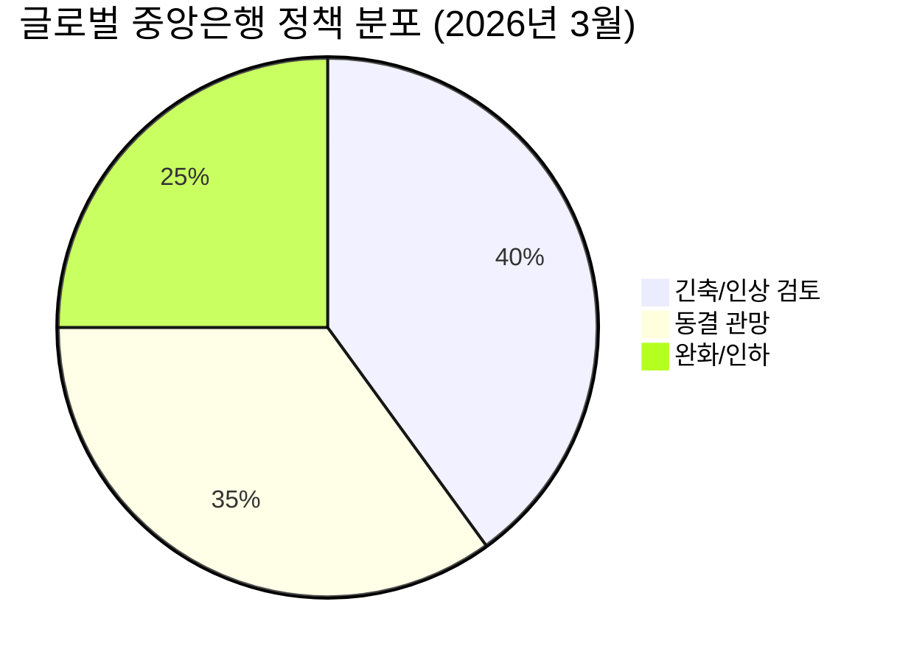

# 시장 스냅샷

> **하루를 한 문장으로:** 중동 종전 기대감이 유가를 끌어내리며 글로벌 증시를 반등시켰지만, 이란의 협상 부인과 Fed의 인플레이션 경계로 "안도 랠리의 수명"이 시험대에 오른 하루.

### 주요 지수
| 지수 | 종가 | 등락 | 52주 맥락 |
|------|------|------|----------|
| S&P 500 | 6,591.90 | +35.53 (+0.5%) | 🟢 ████░ 고점 대비 -5.5% |
| 나스닥 | 21,929.83 | +167.94 (+0.8%) | 🟢 ████░ 고점 대비 -8.5% — 중간 구간 |
| 다우존스 | 46,429.49 | +305.43 (+0.7%) | 🟢 ████░ 고점 대비 -7.5% — 중간 구간 |
| 코스피 | 5,460.46 | -181.75 (-3.2%) | 🔴⬇ ████░ 고점 대비 -13.4% — 중간 구간 |
| 코스닥 | 1,136.64 | -22.91 (-2.0%) | 🔴⬇ ████░ 고점 대비 -4.7% |
| 닛케이 225 | 53,603.65 | -145.97 (-0.3%) | ⚪ ████░ 고점 대비 -8.9% |

### 매크로/원자재/크립토
| 항목 | 값 | 변동 | 해석 |
|------|-----|------|------|
| 미국 10Y | 4.33% | -0.06%p | 🔴 ███░░ 높은 수준 유지 |
| 미국 2Y | 3.62% | +0.00%p | ⚪ █░░░░ 점진적 완화 기대 |
| DXY | 99.65 | +0.05 (+0.1%) | ⚪ ██░░░ 달러 약세 — 위험자산 우호적 |
| USD/KRW | 1,506.05 | +8.74 (+0.6%) | 🟢 █████ 17년래 고점 구간 — 극단적 원화 약세 |
| USD/JPY | 159.47 | +0.75 (+0.5%) | 🟢 █████ 엔저 극단 — BOJ 개입 경계 |
| WTI 원유 | $93.41 | +3.4% | 🟢⬆ ████░ 높은 수준 — 지정학 프리미엄 |
| 금 (Gold) | $4,423.20 | -2.8% | 🔴⬇ ███░░ 조정 구간 |
| 은 (Silver) | $68.21 | -5.7% | 🔴⬇ ██░░░ 조정 구간 |
| BTC | $69,871 | -2.0% | 🔴⬇ █░░░░ 약세 구간 — 리스크오프 |
| VIX | 27.05 | +1.72 (+6.8%) | 🟢⬆ ██░░░ 경계 구간 — 리스크 관리 강화 |
| 10Y-2Y 스프레드 | 0.71%p | -0.06%p | 🟢 정상화 진행 중 |

---

하루를 한 문장으로: 중동 종전 기대감이 유가를 끌어내리며 글로벌 증시를 반등시켰지만, 이란의 협상 부인과 Fed의 인플레이션 경계로 "안도 랠리의 수명"이 시험대에 오른 하루.

---

# 오버나이트 핵심 이벤트 (Top 5)

> [!abstract] 섹션 요약
> 지정학 리스크 일시 완화 + 유가 급락이 증시 반등을 이끌었으나, 협상 불확실성과 Fed 매파 기조가 상충하며 방향성 탐색 국면 지속.

---

### 1. 미국-이란 종전 협상: 기대와 부인의 엇갈림

- **요약**: 종전 협상 기대감으로 브렌트유 2.2% 급락(배럴당 $102.22), S&P 500 0.54% 반등. 그러나 이란 측은 공개적으로 협상 사실을 부인하며 불확실성 재점화.
- **So What**: 유가 하락 → 인플레이션 기대치 완화 → 금리 인하 기대 소폭 회복의 1차 효과. 그러나 협상 무산 시 유가 재급등 → 연준 금리 인상 시나리오 재부상의 2차 역전 효과 경계 필요.
- **크로스 임팩트**: 중동 지정학 → 유가 → 에너지 섹터 → 인플레이션 → 채권 수익률 → 성장주 밸류에이션

> [!warning] 리스크 경고
> 유가 $100선 위에서의 '협상 노이즈' 플레이는 양방향 변동성을 극대화. 에너지 섹터 단기 트레이딩 시 뉴스 노출에 각별히 주의.

> **Bull/Bear 센티먼트**: Bull 50% / Bear 50% — 핵심 변수: **이란 공식 협상 테이블 복귀 여부**

---

### 2. Fed 금리 동결 + 인플레이션 전망 상향 (2.7%)

- **요약**: 연준은 기준금리를 동결했으나 2026년 인플레이션 전망치를 2.7%로 상향. 10년물 국채 수익률 4.32%(-4bp), 2년물 3.89%(-5bp)로 소폭 하락했으나 고금리 장기화 경로는 유효.
- **So What**: "동결=비둘기"라는 단순 해석은 위험. 인플레이션 전망 상향은 인하 사이클 지연 시그널 — 고PER 성장주와 부동산 리츠(REITs)에 직접적 밸류에이션 압박.
- **크로스 임팩트**: Fed 매파 → 달러 강세 → 원/달러 환율 상승 → 외국인 한국 증시 이탈 → 코스피 하방 압력

🟢 인하 25%

🟡 동결 유지 55%

🔴 인상 20%

> **Bull/Bear 센티먼트**: Bull 35% / Bear 65% — 핵심 변수: **PCE 물가 및 유가 경로**

---

### 3. AI CapEx 슈퍼사이클: 2026년 $6,000억 돌파 전망

- **요약**: 빅테크(Amazon, Google, Meta, Microsoft) 2026년 합산 AI 인프라 투자 $6,000억+ 예상, YoY +36%. 데이터센터 및 특수 컴퓨팅 클러스터 중심의 역사적 수준 CapEx 붐.
- **So What**: 수요 가시성이 높아 [[NVIDIA]], [[SK하이닉스]], [[삼성전자]] HBM, TSMC 파운드리 수주 확대의 직접 수혜. 2차 효과로 전력 인프라, 냉각 시스템, 광통신 장비 기업 수혜 연쇄.
- **크로스 임팩트**: AI CapEx → 반도체 수요 → HBM/파운드리 → 전력·냉각·PCB → 데이터센터 REIT

> [!tip] 핵심 인사이트
> AI CapEx는 이제 "성장 테마"가 아닌 **인프라 필수재** 수준의 지출로 전환. VC 투자의 60%가 AI 집중 → 투자 쏠림 리스크도 동시에 모니터링.

> **Bull/Bear 센티먼트**: Bull 75% / Bear 25% — 핵심 변수: **빅테크 1Q26 실적 발표 및 CapEx 가이던스 유지 여부**

---

### 4. TSMC 관세 부과 이슈 + 반도체 공급망 재편

- **요약**: 미국 정부의 대만산 반도체(TSMC) 관세 부과 움직임이 구체화되며 공급망 재편 압박 가속. 동시에 AI 수요 급증으로 TSMC 파운드리 캐파(Capacity)도 사실상 품절 상태.
- **So What**: 관세는 TSMC 수익 구조와 고객사 비용에 직격. 단기 혼란이지만 중장기적으로는 미국 내 팹 확장(애리조나) 가속화 → 삼성 파운드리의 반사 수혜 가능성. 동시에 한국 소재·부품·장비(소부장) 기업의 지정학적 위상 재평가.
- **크로스 임팩트**: TSMC 관세 → 파운드리 가격 상승 → 팹리스 마진 압박 → 삼성/인텔 파운드리 기회 → 한국 소부장

> **Bull/Bear 센티먼트**: Bull 45% / Bear 55% — 핵심 변수: **관세율 확정 수준 및 TSMC 아리조나 팹 확장 속도**

---

### 5. 코스피 -3.22% 급락 vs. 코스닥 +3.4% 급등 — 양극화 심화

- **요약**: 코스피가 5,460.46(-3.22%)으로 급락한 반면, 코스닥은 바이오 섹터 주도로 +3.4% 급등. 외국인은 3월 중 코스피에서 22조 원 순매도, 개인 투자자가 방어.
- **So What**: 외국인 이탈 + 원/달러 1,507원대의 고환율 → 코스피 대형주(수출 대기업) 단기 비선호. 반면 코스닥 바이오는 내수 자금과 테마 수급이 맞물려 독자적 상승. 이 탈동조화가 지속될지 여부가 국내 전략의 핵심.
- **크로스 임팩트**: 외국인 이탈 → 원화 약세 → 수입 물가 상승 → 내수 소비 위축 → 바이오/내수주 상대적 선호

> [!warning] 리스크 경고
> 코스닥 +3.4%는 기초체력(Fundamental) 개선보다 수급 쏠림 성격이 강함. 바이오 섹터의 임상 실패 리스크에 각별히 주의.

> **Bull/Bear 센티먼트**: Bull 40% / Bear 60% — 핵심 변수: **외국인 매도세 진정 여부 + 원/달러 방향성**

---

# 테마 딥다이브: 중앙은행 정책 분화 — "동기화 시대의 종말"

> [!abstract] 테마 요약
> 2026년 글로벌 중앙은행들은 10년 만에 가장 뚜렷한 '정책 분화' 국면에 진입. 이란 분쟁발 에너지 가격 급등이 분화를 촉발했고, 이제 시장은 "인하 횟수" 논쟁에서 "인상 가능성"까지 아우르는 훨씬 넓은 불확실성 스펙트럼과 마주하고 있다.

### 배경: 왜 지금 분화인가

2023~2024년 글로벌 중앙은행들은 역사적으로 유례없는 '동기화 긴축'을 단행했다. 팬데믹 이후 공급 충격과 수요 과열이 전 세계적으로 동시 발현되었기 때문이다. 그러나 2026년 현재 각국이 직면한 경제 현실은 근본적으로 다르다.

| 중앙은행 | 현재 기조 | 핵심 변수 | 방향성 |
|---------|---------|---------|------|
| 🇺🇸 Fed | 동결 (매파적) | PCE 2.7% + 고용 견조 | 🟡 인하 지연 |
| 🇪🇺 ECB | 동결 → 인상 검토 | 유가발 에너지 인플레 | 🔴 인상 가능성 |
| 🇯🇵 BOJ | 정상화 지속 | 엔화 약세 + 임금 상승 | 🔴 추가 인상 |
| 🇨🇳 PBOC | 완화 기조 | 부동산 디플레이션 | 🟢 추가 인하 |
| 🇰🇷 BOK | 동결 관망 | 환율 1,507원 + 성장 둔화 | 🟡 인하 명분 vs. 환율 제약 |

### 핵심 논점: 이란 분쟁이 "게임 체인저"인 이유

단순한 지정학 이벤트가 아니다. 호르무즈 해협 리스크가 4주째 지속되며 에너지 가격의 '구조적 바닥'이 상향되고 있다. 이는 두 가지 채널로 중앙은행 정책에 영향을 미친다.

**1차 충격 (공급 충격)**: 유가 급등 → CPI 에너지 항목 직접 상승. Fed와 ECB는 "공급 충격은 일시적"이라는 기존 논리가 더 이상 통하지 않는 상황.

**2차 충격 (인플레이션 기대 재앙커링)**: 인플레이션 손익분기점(Breakeven) 금리 상승 → 실질 금리 하락 → 중앙은행이 명목 금리를 더 올려야 하는 딜레마. Barclays는 ECB와 BOJ가 가장 먼저 금리 인상에 나설 가능성을 제시했다.

### 컨센서스 vs. Variant Perception

<strong>컨센서스 뷰</strong>: "에너지 충격은 일시적, 하반기 인하 재개" — 시장은 여전히 Fed의 연내 1~2회 인하를 기본 시나리오로 반영 중.

<strong>Variant Perception (역발상)</strong>: "중앙은행 동기화 시대의 구조적 종말" — ECB·BOJ 인상과 PBOC 완화가 동시에 진행되는 환경은 달러/유로/엔 간 극단적 환율 변동성을 유발. 이는 단순한 금리 사이클 문제가 아니라 글로벌 자본 흐름의 재편을 의미한다.

> [!tip] 핵심 인사이트
> BOK의 딜레마가 핵심: 성장 둔화는 인하를 요구하지만, 원/달러 1,500원대 + 외국인 이탈 + 미-일 금리 역전 확대는 인하를 억제. 한국은 "인하도 동결도 모두 리스크"인 최악의 정책 트랩에 빠져 있다.

### 투자 함의 — 분화 국면의 포트폴리오 전략

**수혜 자산**: 달러 강세 수혜주(수출주) / 금·원자재(인플레이션 헤지) / 단기채(금리 불확실성 헤지)

**피해 자산**: 장기 성장주(고PER 할인율 상승) / 부동산 리츠 / 신흥국 채권(자본 이탈)

**한국 특수 상황**: 원/달러 1,500원대는 수출 대기업(반도체·자동차·조선)에는 이론적 호재이나, 외국인 이탈과 수입 원자재 비용 상승이 상쇄. 수출 매출 + 수입 비용 동시 분석이 필수.

### 모니터링 포인트 (우선순위)

1. **이란-미국 협상 진전**: 유가 $90 이하 안착 시 → ECB 인상 논의 후퇴, 인하 재개 기대 복원
2. **4월 FOMC 전 PCE 발표 (3/28)**: Fed의 인플레이션 경로 확인 최우선 데이터
3. **BOJ 4월 통화정책회의**: 추가 인상 여부 → 엔 강세 전환 시 글로벌 캐리 트레이드 청산 위험
4. **ECB 드라기 라인**: "필요하다면 무엇이든(Whatever it takes)" 반대 시나리오 — "인플레이션이라면 무엇이든 막는다"

> [!warning] 리스크 경고
> BOJ 추가 인상 + ECB 긴축 동시 발생 시 → 2022년식 글로벌 동기화 긴축 재현 가능. 이 경우 신흥국(한국 포함) 자본 이탈 2차 파동 주의.

---

# 오늘의 Must-Read 3선

### 📖 1. [Agents Over Bubbles](https://stratechery.com/2026/agents-over-bubbles/)
**Reading Horizon**: 🔴 긴급 (오늘)

**왜 읽어야 하는가?**
AI 투자 테마를 "버블인가 아닌가"로 접근하는 것 자체가 잘못된 프레임이라고 주장. GPU·데이터센터 투자가 아닌 "에이전트(Agent)" 레이어가 다음 가치 창출의 핵심이라는 구조적 논증을 제시한다. AI CapEx $6,000억 시대에 진짜 수혜 레이어가 어디인지 프레임을 바꿔준다.

**핵심 프레임워크**: 인프라 투자 붐의 수혜는 삽(shovel) 판매자(반도체)보다 그 위에 올라타는 플랫폼(에이전트)에게 귀결된다.

**출처:** Stratechery (Ben Thompson)

---

### 📖 2. [The AI Chip Split - And Why Amazon Is On The Right Side](https://seekingalpha.com/article/4682029-ai-chip-split-amazon-right-side)
**Reading Horizon**: 🟡 이번 주

**왜 읽어야 하는가?**
AI 반도체 시장이 "NVIDIA 독점"에서 "자체 칩(Custom Silicon) vs. 범용 GPU"의 구조적 분열로 전환되고 있다는 논증. Amazon Trainium/Inferentia의 경쟁력을 심층 분석하며, TSMC 관세 이슈와 맞물려 AI 칩 공급망의 다음 판도를 선점하는 플레이어가 누구인지 구체적으로 제시한다.

**핵심 프레임워크**: AI 칩 전쟁의 승자는 가장 빠른 GPU가 아니라 가장 낮은 추론(Inference) 비용을 제공하는 자다.

**출처:** Seeking Alpha

---

### 📖 3. [삼전닉스, 장기계약으로 반도체 사이클 흔든다 — '슈퍼을의 반란'](https://vertexaisearch.cloud.google.com/grounding-api-redirect/AUZIYQHN2SCgW1sPcphIKJLjjRvCgCUCl_gnN3z939kBjCp7S5ldpms57xwGkOP1a9wOqx-H3GKZWXmeGGD1XJiqbW9Ee_q1B9asRzIXVOVPrDkse-acBccX3PKk3ecJ-qYRqVhMERnjk1ZV1yEMbI9EIxx1o4EfrEjrH6Qzmg==)
**Reading Horizon**: 🔴 긴급 (오늘)

**왜 읽어야 하는가?**
[[삼성전자]]와 [[SK하이닉스]]가 과거 "을(乙)"의 위치에서 벗어나 장기 공급 계약으로 반도체 가격 사이클 자체를 구조적으로 바꾸고 있다는 분석. HBM 수요 폭증과 TSMC 품절 사태가 맞물린 현재 시점에서, 한국 메모리 기업의 협상력 변화가 실적과 밸류에이션에 어떻게 반영될지 핵심 투자 논리를 제공한다.

**핵심 프레임워크**: 공급자 협상력(Supplier Power) 강화 = 수익성 구조 개선의 지속 가능성 → 메모리 사이클의 전통적 고점 매도 전략을 재검토해야 할 시점.

**출처:** 한국 증권 리포트

---

# 오늘의 일정

> [!note] 참고
> 3월 26일(화)은 시장 전반을 흔들 대형 이벤트는 없으나, **3월 28일(금) PCE 발표**를 앞둔 포지션 조정 관망이 예상된다.

### 경제 지표

| 시간 | 지표 | 컨센서스 | 의미 |
|------|------|---------|------|
| 🔴 3/28 (금) 예정 | **미국 PCE 물가 (2월)** | YoY ~2.5% | Fed의 실질적 인플레이션 체온계. 2.7% 초과 시 인하 기대 추가 후퇴 |
| 🟡 금주 목요일 | 신규 실업수당 청구 건수 | 22만건 내외 | 노동시장 강도 확인 — 강할수록 Fed 매파 명분 강화 |

### 실적 및 이벤트

| 구분 | 내용 | 관련 섹터 |
|------|------|---------|
| 🟡 참고 | 미국 주택 관련 지표 (케이스-실러 등) | 리츠/건설 |
| 🟡 참고 | 유럽 에너지 관련 정책 발언 모니터링 | 에너지/환율 |
| 🟡 참고 | 이란-미국 채널 협상 뉴스 플로우 | 유가/방산/항공 |

> [!tip] 핵심 인사이트
> 오늘은 "큰 이벤트 없음 = 리스크 없음"이 아니다. PCE 발표 전 불확실성 구간에서 포지션 축소(De-risking)와 관망이 혼재하며 코스피 추가 변동성 가능성에 대비 필요.

---

# 투자 레슨

> [!abstract] 오늘의 레슨
> **"공급 충격의 시대, 인플레이션을 '일시적'이라 부르는 비용"**

### 교훈: 시장이 반복하는 실수 — "이번엔 일시적이다"

2021년 Fed는 팬데믹발 인플레이션을 "일시적(Transitory)"이라 규정하며 대응이 늦었고, 결과적으로 역사상 가장 가파른 긴축 사이클을 감수해야 했다. 2026년 현재, 이란 분쟁발 에너지 충격을 두고 다시 "일시적 공급 충격"이라는 논리가 등장하고 있다.

**역사적 유사 사례**: 1973년 오일쇼크 당시 Fed는 충격의 일시성을 과신하며 대응이 늦었고, 스태그플레이션(Stagflation) 10년을 초래했다. 반면 1979년 폴 볼커는 "무엇이든 필요한 것을 한다"는 원칙으로 단기 고통을 감수해 구조적 인플레이션을 잡았다.

### 투자 원칙 연결 — 하워드 막스(Howard Marks)의 "2차 사고(Second-Level Thinking)"

> *"1차 사고: 유가 하락 → 증시 상승. 2차 사고: 유가 하락이 협상 기대감 때문이라면, 협상 실패 시 유가 재급등 + 시장 패닉의 비대칭 리스크가 존재한다."*

오늘 시장의 안도 랠리는 1차 사고의 산물이다. 투자자는 항상 "이 반응이 맞다면, 틀렸을 때 무슨 일이 벌어지는가?"를 먼저 물어야 한다.

현재 시장 불확실성 65/100 — 주의 구간

> [!success] 오늘 하나만 기억한다면
> **"안도 랠리를 즐기되, 협상 실패 시나리오의 반대급부를 미리 계산해 두는 것 — 그것이 2차 사고다."**

---
*본 브리핑은 투자 참고용 시장 분석 자료이며, 특정 종목의 매수·매도를 권유하지 않습니다. 투자 결정은 투자자 본인의 판단과 책임 하에 이루어져야 합니다.*