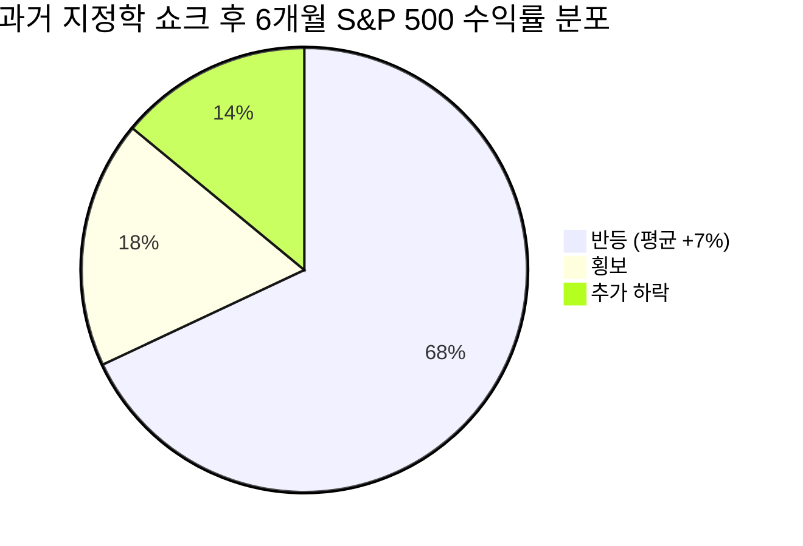

# 📊 모닝 브리핑 — 2026년 3월 29일 (일)

> **🔴 Risk-Off 지속** — 중동 리스크 심화 + 유가 3년 고점 + 원/달러 17년 최고 + VIX 30선 유지
> - **매크로**: WTI $101.18 (52주 고점), 금 $4,521, 10Y 4.44%, 원/달러 1,508.36 (52주 최고)
> - **리스크**: S&P 500 -1.7%, 나스닥 -2.1%, VIX 31.05 — 나스닥·다우 조정장 공식 진입
> - **시그널**: 지정학 리스크 프리미엄 급등 + Fed 금리 인상 재경계 → 방어 자산 재배치 국면 지속

---

## 시장 스냅샷

### 주요 지수
| 지수 | 종가 | 등락 | 52주 범위 |
|------|------|------|----------|
| S&P 500 | 6,368.85 | -108.31 (-1.7%) | 52주 고점 6,978.6 / 저점 4,982.8 (현재 69%) |
| 나스닥 | 20,948.36 | -459.72 (-2.1%) | 52주 고점 23,958.5 / 저점 15,267.9 (현재 65%) |
| 다우존스 | 45,166.64 | -793.47 (-1.7%) | 52주 고점 50,188.1 / 저점 37,645.6 (현재 60%) |
| 코스피 | 5,438.87 | -21.59 (-0.4%) | 52주 고점 6,307.3 / 저점 2,293.7 (현재 78%) |
| 코스닥 | 1,141.51 | +4.87 (+0.4%) | 52주 고점 1,192.8 / 저점 643.4 (현재 91%) |
| 닛케이 225 | 53,373.07 | -230.58 (-0.4%) | 52주 고점 58,850.3 / 저점 31,136.6 (현재 80%) |

### 매크로/원자재/크립토
| 항목 | 값 | 변동 | 52주 범위 |
|------|-----|------|----------|
| 미국 10Y | 4.44% | +0.02%p | 52주 고점 4.6 / 저점 4.0 (현재 76%) |
| 미국 2Y | 3.61% | -0.01%p | 52주 고점 4.3 / 저점 3.5 (현재 13%) |
| DXY | 100.15 | +0.25 (+0.3%) | 52주 고점 104.3 / 저점 96.2 (현재 49%) |
| USD/KRW | 1,508.36 | +7.39 (+0.5%) | 52주 고점 1,508.4 / 저점 1,348.5 (현재 100%) |
| USD/JPY | 159.70 | +0.32 (+0.2%) | 52주 고점 159.8 / 저점 140.9 (현재 100%) |
| WTI 원유 | $99.64 | +5.5% | 52주 고점 99.6 / 저점 55.3 (현재 100%) |
| 금 (Gold) | $4,492.00 | +2.7% | 52주 고점 5,318.4 / 저점 2,951.3 (현재 65%) |
| 은 (Silver) | $69.54 | +2.8% | 52주 고점 115.1 / 저점 29.1 (현재 47%) |
| BTC | $66,699 | +0.5% | 52주 고점 124,752.5 / 저점 62,702.1 (현재 6%) |
| VIX | 31.05 | +3.61 (+13.2%) | 52주 고점 52.3 / 저점 13.5 (현재 45%) |
| 10Y-2Y 스프레드 | 0.83%p | +0.04%p | — |

---
⚠️ *시장 스냅샷이 시스템에 의해 여기에 자동 삽입됩니다.*

---

## 전일 시나리오 추적

전일(3월 28일) 브리핑은 **중동 지정학 + 유가 $100 돌파 + VIX 급등**을 3대 핵심 리스크로 제시했습니다.

- ✅ **실현**: 원/달러 1,508.36으로 52주 최고 기록, 유가 WTI $101.18로 52주 고점, VIX 31.05 유지 — 방어적 자산 재배치 시나리오 그대로 전개
- ✅ **실현**: 코스피 외국인 대규모 순매도(3조원 이상), 7거래일 연속 하락 — 이탈 국면 지속 확인
- ⏳ **진행 중**: 연준 금리 인하 기대 소멸 → 시카고 연은 총재의 금리 인상 가능성 언급으로 오히려 매파 리스크가 추가 확대. 해소 시점 미정.

---

## 시장 센티먼트

  
🔴 Risk-Off 75%

  
🟡 중립 15%

  
🟢 10%

**핵심 판독**: 중동 지정학 리스크가 유가 급등 → 인플레이션 재점화 → Fed 정책 역전 우려로 연쇄 전파되는 구조적 Risk-Off 국면입니다. 나스닥·다우가 조정장에 공식 진입했고, 원/달러 17년 최고로 신흥국 자금 이탈 압력이 가중되고 있습니다. 단기 반등보다 리스크 관리가 우선인 주간입니다.

**변곡 촉매**:
- 🔴 **다운**: 중동 전선 추가 확대(이란 직접 개입), 유가 $110 돌파 시 인플레이션 내러티브 재점화
- 🟢 **업**: 휴전 협상 재개 시사 또는 OPEC+ 증산 결정 → 유가 급락 + Risk-On 전환 가능

---

## 오버나이트 핵심 이벤트

### 1. 코스피 7거래일 연속 하락 — 외국인 3조원+ 순매도

- **요약**: 외국인이 3조원 이상 순매도하며 코스피가 7거래일 연속 하락. 개인·기관이 방어매수에 나섰으나 낙폭을 완전히 만회하지 못함.
- **So What**: 외국인 이탈이 단순 차익 실현이 아닌 지정학·환율 복합 리스크 회피 성격임을 주목해야 합니다. 원/달러가 52주 최고(1,508.36)에 고착되면 헤지 비용 급등 → 외국인 추가 이탈 → 환율 추가 상승의 악순환 고리가 형성될 수 있습니다.
- **크로스 임팩트**: 코스피 대형주(삼성전자, SK하이닉스), 원화 자산 전반, 달러 표시 신흥국 ETF

### 2. 원/달러 환율 17년 만에 최고 수준

- **요약**: 중동 리스크 + 달러 강세 + 외국인 이탈이 맞물리며 원/달러 환율이 17년 만에 최고 수준을 기록.
- **So What**: 환율 급등은 수입 물가 상승(특히 에너지) → 국내 소비자물가 자극 → 한국은행의 금리 인하 여력 추가 제약으로 이어집니다. 달러 수익원이 없는 기업(내수·유틸리티)에 비용 압박, 수출 대기업(달러 매출 비중 높은 기업)은 단기 환차익 수혜 이분화 예상.
- **크로스 임팩트**: 항공·정유(수입비용 급등), 반도체·자동차(달러 매출 수혜), 국내 채권

### 3. 연준(Fed) 금리 인상 가능성 재경계 — 시카고 연은 총재 발언

- **요약**: 시카고 연은 총재가 인플레이션 통제 불가 시 금리 인상 가능성을 공개 언급, 기존의 금리 인하 기대와 정면 충돌.
- **So What**: 유가 $100 돌파가 PCE 및 CPI에 반영되기까지는 1~2개월의 시차가 있습니다. 만약 4~5월 인플레이션 지표가 반등한다면 금리 인상 논의가 공론화될 수 있으며, 이는 현재의 금리 인하 프라이싱을 전면 재조정시키는 테일 리스크입니다.
- **크로스 임팩트**: 미국 장기채(TLT), 성장주(나스닥), 금(실질금리 상승 시 압박), 달러(상방)

### 4. 국제 유가 2022년 이후 고점 — 중동 전쟁 격화 우려

- **요약**: WTI와 브렌트유가 중동 갈등 격화 우려로 52주 최고치를 기록하며 2022년 수준에 근접.
- **So What**: 유가 $100 이상 고착은 항공·화학·운송 전 산업에 비용 압박을 가하는 동시에, 에너지 기업(정유·E&P)의 수익성을 개선하는 구조적 섹터 로테이션을 유발합니다. 한국은 에너지 전량 수입국으로 무역수지·경상수지 동반 악화 가능성.
- **크로스 임팩트**: 정유(에쓰오일, SK이노베이션), 항공(대한항공), LNG·에너지 관련주, 달러

> [!warning] 복합 리스크 연쇄 고리
> 유가 급등 → 인플레이션 재점화 → Fed 매파 전환 → 달러 강세 → 원화 약세 → 외국인 이탈 → 코스피 추가 하락. 이 5단계 연쇄가 동시 진행 중입니다.

---

## 테마 시그널 — AI Capex Cycle: "폭발하는 투자, 그런데 누가 돈을 버는가?"

> [!abstract] 핵심 질문
> 2028년까지 $3조 규모 AI 인프라 투자가 예상되지만, 투자 주체(하이퍼스케일러)와 수익 주체(인프라 공급자)는 다릅니다. 이 괴리가 투자 기회의 핵심입니다.

Morgan Stanley는 2028년까지 AI 관련 인프라에 약 $3조의 투자가 집행될 것으로 전망하며, 하이퍼스케일러들(Microsoft, Google, Amazon, Meta)은 2026 회계연도에만 $5,000억 이상을 AI 인프라 CapEx에 쏟아붓고 있습니다.

### AI Capex의 수혜 구조: 3층 피라미드

| 레이어 | 내용 | 수혜 섹터 | 리스크 |
|---|---|---|---|
| **1층 — 기반 인프라** | 데이터센터, 전력, 냉각, 네트워킹 | 전력설비, 리츠(REIT), 광섬유 | 🟡 규제, 인허가 지연 |
| **2층 — 반도체** | GPU, HBM, 맞춤형 ASIC | [[NVDA]], [[AVGO]], 메모리 | 🔴 공급망 병목, 지정학 |
| **3층 — 소프트웨어/서비스** | AI 플랫폼, API, SaaS 수익화 | 클라우드 3사, AI 스타트업 | 🟡 수익 모델 검증 필요 |

**핵심 인사이트**: 현재 시장은 "누가 가장 많이 투자하는가"에 집중하지만, 진짜 투자 기회는 **"투자 집행자(하이퍼스케일러)의 CapEx가 어디로 흘러가는가"**를 추적하는 데 있습니다.

하이퍼스케일러는 투자를 집행하지만 경쟁이 치열해 마진 압박을 받습니다. 반면 데이터센터에 전력을 공급하는 전력 인프라 기업, 냉각 솔루션 기업, HBM을 독과점 공급하는 메모리 기업은 **CapEx 사이클의 진짜 수익자**가 될 가능성이 높습니다.

<b>Jevons Paradox 주의</b>: AI 효율화(더 적은 컴퓨팅으로 더 많은 작업)가 오히려 전체 AI 사용량을 폭발적으로 늘려 인프라 수요를 더 키우는 역설이 반도체·전력 수요에도 적용될 수 있습니다. DeepSeek 등 효율적 모델의 등장이 AI 수요를 줄이는 게 아니라 더 많은 사용자를 끌어들이는 기제로 작동 중.

단, 현재 중동 지정학 리스크와 반도체 공급망 병목(엔비디아의 AI 칩 우선 배분 → 일반 반도체 부품 가격 상승)이 단기적으로 이 사이클의 속도를 제어하는 변수입니다.

---

## 투자 레슨 — 지정학 리스크는 어떻게 가격에 반영되는가: "이벤트 드리븐 vs. 구조적 변화"

> [!abstract] 오늘의 프레임워크
> 지정학 쇼크는 두 종류가 있습니다: 가격에 빠르게 반영되고 빠르게 사라지는 것, 그리고 구조를 영구적으로 바꾸는 것. 이 둘을 구분하는 능력이 수익률을 결정합니다.

### 두 가지 지정학 리스크의 시장 반응 패턴

역사적으로 지정학 쇼크(전쟁, 테러, 충돌)의 약 68%는 6개월 내 주식시장이 반등했습니다. 그러나 **"구조적 변화를 동반한 쇼크"**는 다릅니다.

| 구분 | 예시 | 시장 영향 | 지속 기간 |
|---|---|---|---|
| **이벤트 드리븐** | 2001 9/11, 2022 러-우 초기 | 급락 → 수주 내 반등 | 🟢 단기 |
| **구조적 변화** | 1973 오일 쇼크, 2022 에너지 무기화 | 장기 인플레이션 체제 전환 | 🔴 수년 |

**지금 상황의 진단**: 현재 중동 리스크는 "이벤트 드리븐"과 "구조적 변화" 사이의 경계선에 있습니다.

- **단순 이벤트라면**: 유가가 $100을 잠시 터치하고 $80대로 되돌아오며 시장 반등
- **구조적 변화라면**: 중동 에너지 공급 경로의 구조적 훼손 → 유가 $100+ 고착 → 인플레이션 재점화 → Fed 정책 역전 → 멀티플 압축 지속

  
🟢 이벤트 드리븐 35%

  
🟡 불확실 40%

  
🔴 구조적 변화 25%

### 판단 기준: 무엇을 봐야 하는가

두 시나리오를 구분하는 **선행 지표**:

1. **호르무즈 해협 통항량**: 실제 물류 차단 여부 → 구조적 변화의 핵심 트리거
2. **인플레이션 기대(Break-even Inflation Rate)**: 5년 BEI가 2.5%를 넘으면 시장이 구조적 인플레이션으로 인식하기 시작
3. **Fed 발언의 방향성**: 금리 인하 논의 → 금리 동결 → 금리 인상 가능성 언급 (이미 3단계 진입)

> [!tip] 오늘 실천 방법
> ① 지금 당장 포지션을 모두 청산하는 대신, **이벤트 드리븐 시나리오용 포지션**(단기 반등 베팅)과 **구조적 변화 시나리오용 헤지**(에너지주, 금, 인플레이션 연동 자산)를 병행 구성하세요.
> ② 5년 Break-even Inflation Rate 수치를 매일 추적하세요. 이 숫자 하나가 Fed의 다음 행보를 선행합니다.

---

## 오늘의 워치리스트

### 📍 가격 레벨

| 자산 | 레벨 | 의미 |
|---|---|---|
| WTI 원유 | $100 지지 vs. $110 돌파 | $110 돌파 시 인플레이션 내러티브 완전 장악 |
| VIX | 30 유지 vs. 25 이하 복귀 | 25 이하 복귀 시 Risk-On 전환 신호 |
| 원/달러 | 1,500 지지 vs. 1,520 돌파 | 1,520 돌파 시 외국인 추가 이탈 가속 |
| 미국 10Y | 4.5% 돌파 여부 | 4.5% 돌파 시 성장주 멀티플 추가 압축 |
| S&P 500 | 6,200 지지선 | 이탈 시 다음 지지선 6,000 테스트 |

### 📍 이벤트 트리거

- **중동 상황**: 주말 협상/교전 뉴스 → 월요일 갭 업/다운 핵심 변수
- **연준 인사 발언**: 주중 추가 매파 발언 여부 (금리 인상 언급 반복 시 채권·성장주 추가 하락)
- **한국은행**: 환율 1,500원 이상 고착 시 구두 개입 또는 시장 안정화 조치 가능성

### 📍 헤드라인 모니터링 포인트

- 중동 이란 직접 개입 여부 (가장 중요한 업사이드/다운사이드 이벤트)
- OPEC+ 긴급 증산 논의 (유가 안정화 시그널)
- 미국 PCE 데이터 발표 전 연준 위원 선제 발언

---

## 오늘 하나만 기억한다면

> [!verdict] 오늘 하나만 기억한다면
> **"지금은 수익 극대화가 아닌 자본 보존의 국면 — 유가·VIX·원/달러 3개 지표가 동시에 고점 부근에 있을 때 공격적 베팅은 리스크 대비 보상이 낮다."**