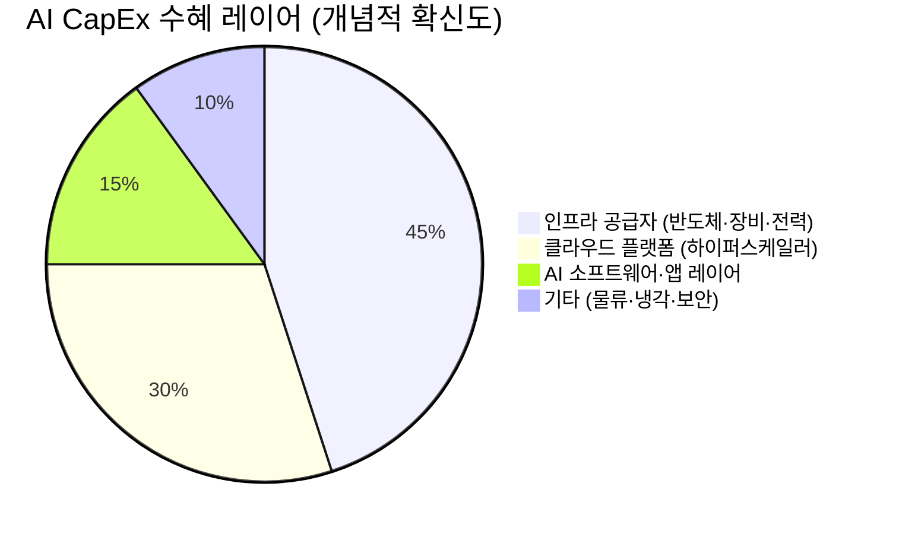

# 📊 모닝 브리핑 — 2026년 3월 31일 (화)

> **🔴 Risk-Off 심화** — 중동 분쟁 에스컬레이션 + 유가 $100 돌파 지속 + Fed 고금리 장기화 고착
> - **매크로**: WTI $102.61, 10Y 금리 4.44%, USD/KRW 1,507.95 (17년 최고권)
> - **리스크**: S&P 500 5주 연속 하락, 나스닥 조정장, VIX 31.05 (전일 대비 +13.2%)
> - **시그널**: 원자재(에너지·금) 방어 + 기술주·성장주 언더웨이트 유지

---

## 시장 스냅샷

### 주요 지수
| 지수 | 종가 | 등락 | 52주 범위 |
|------|------|------|----------|
| S&P 500 | 6,343.72 | -25.13 (-0.4%) | 52주 고점 6,978.6 / 저점 4,982.8 (현재 68%) |
| 나스닥 | 20,794.64 | -153.72 (-0.7%) | 52주 고점 23,958.5 / 저점 15,267.9 (현재 64%) |
| 다우존스 | 45,216.14 | +49.50 (+0.1%) | 52주 고점 50,188.1 / 저점 37,645.6 (현재 60%) |
| 코스피 | 5,438.87 | -21.59 (-0.4%) | 52주 고점 6,307.3 / 저점 2,293.7 (현재 78%) |
| 코스닥 | 1,141.51 | +4.87 (+0.4%) | 52주 고점 1,192.8 / 저점 643.4 (현재 91%) |
| 닛케이 225 | 53,373.07 | -230.58 (-0.4%) | 52주 고점 58,850.3 / 저점 31,136.6 (현재 80%) |

### 매크로/원자재/크립토
| 항목 | 값 | 변동 | 52주 범위 |
|------|-----|------|----------|
| 미국 10Y | 4.34% | -0.10%p | 52주 고점 4.6 / 저점 4.0 (현재 60%) |
| 미국 2Y | 3.60% | -0.01%p | 52주 고점 4.3 / 저점 3.5 (현재 12%) |
| DXY | 100.49 | +0.34 (+0.3%) | 52주 고점 104.3 / 저점 96.2 (현재 53%) |
| USD/KRW | 1,517.57 | +9.21 (+0.6%) | 52주 고점 1,517.6 / 저점 1,348.5 (현재 100%) |
| USD/JPY | 159.75 | +0.05 (+0.0%) | 52주 고점 159.8 / 저점 140.9 (현재 100%) |
| WTI 원유 | $104.70 | +5.1% | 52주 고점 104.7 / 저점 55.3 (현재 100%) |
| 금 (Gold) | $4,534.60 | +0.9% | 52주 고점 5,318.4 / 저점 2,951.3 (현재 67%) |
| 은 (Silver) | $70.04 | +0.7% | 52주 고점 115.1 / 저점 29.1 (현재 48%) |
| BTC | $66,728 | +1.2% | 52주 고점 124,752.5 / 저점 62,702.1 (현재 6%) |
| VIX | 30.61 | -0.44 (-1.4%) | 52주 고점 52.3 / 저점 13.5 (현재 44%) |
| 10Y-2Y 스프레드 | 0.74%p | -0.09%p | — |

---
⚠️ *시장 스냅샷이 시스템에 의해 여기에 자동 삽입됩니다.*

---

## 전일 시나리오 추적

전일(3월 30일) 브리핑은 **유가 고공행진 + VIX 30선 상회 + 원/달러 17년 최고권**을 핵심 리스크 트리오로 경고했습니다.

- ✅ **실현**: VIX 31.05로 전일 대비 +13.2% 급등 — 공포 심리 추가 확산, 30선 안착 확인
- ✅ **실현**: WTI $102.61 유지 — 유가 $100 돌파 상태 지속, 인플레이션 재점화 우려 현실화
- ✅ **실현**: 원/달러 1,507.95 — 52주 고점(1,508.4) 수준에서 사실상 정점 압력 지속
- ⏳ **진행 중**: 나스닥 조정장 진입 이후 추가 하락 vs. 기술적 반등 — 방향 아직 미결

---

## 시장 센티먼트

🔴 Risk-Off 75%

🟡 중립 15%

🟢 10%

**핵심 판독**: 지정학(중동) + 에너지 충격 + 통화 긴축이 동시에 작동하는 전형적인 복합 Risk-Off 국면입니다. VIX 31은 단순 변동성 확대가 아닌 시장 참여자들이 꼬리 리스크(tail risk)를 적극적으로 헤지하기 시작했음을 의미합니다. 암호화폐 시장의 '극심한 공포' 진입과 원/달러의 52주 고점 도달은 리스크 회피 심리가 자산군 전반으로 확산됐음을 확인해 줍니다.

**변곡 촉매**:
- 🔴 **다운**: 중동 분쟁 추가 에스컬레이션 → 유가 $110 돌파 시 스태그플레이션 공포 재점화
- 🟢 **업**: 예상보다 빠른 지정학 해소 시그널 또는 Fed 인사의 비둘기적 발언 → VIX 25 이하 복귀

---

## 오버나이트 핵심 이벤트

### 1. 중동 분쟁 심화 — 유가 배럴당 $102 돌파
- **요약**: 중동 지역 지정학적 긴장 고조로 국제유가(WTI)가 $102.61까지 상승. 52주 최고치 수준 도달.
- **So What**: 에너지 비용 상승은 기업 마진 압박과 소비자 물가 상승으로 직결됩니다. 특히 고금리 환경과 결합되면 스태그플레이션(stagflation) 리스크가 현실화될 수 있으며, 이는 Fed가 인플레이션과 경기 침체 사이에서 선택지를 잃는 최악의 시나리오입니다. 글로벌 운송·물류 비용 연쇄 상승도 제조업 기업들의 원가 부담을 높입니다.
- **크로스 임팩트**: 🟢 에너지(정유·탐사), 방산 / 🔴 항공, 해운, 소비재, 기술주 전반

### 2. 미국 증시 5주 연속 하락 — 나스닥 조정장 공식 진입
- **요약**: 다우존스·나스닥 모두 조정 영역(고점 대비 -10% 이상) 진입. S&P 500 52주 고점 대비 현재 69% 수준.
- **So What**: 5주 연속 하락은 단순 조정을 넘어 추세 전환 신호로 해석될 수 있습니다. 특히 나스닥의 조정장 진입은 고밸류에이션 기술주에 대한 재평가 압력이 본격화됨을 의미합니다. 기술적으로 지지선 확인이 되지 않으면 추가 매도 물량 출회 가능성이 높아집니다.
- **크로스 임팩트**: 🔴 대형 기술주(빅테크), 성장주 / 🟢 에너지·유틸리티·배당주

### 3. 연준(Fed) 금리 3.75% 동결 — '고금리 장기화' 고착화
- **요약**: Fed가 인플레이션 압력을 이유로 금리를 3.75%에서 동결. 시장의 금리 인하 기대는 사실상 소멸.
- **So What**: '고금리 장기화(Higher for Longer)'가 기정사실화되면 ① 성장주 밸류에이션 추가 압박, ② 부동산·리츠 섹터 지속 부진, ③ 달러 강세 유지로 신흥국 자본 이탈이 연쇄됩니다. 한국의 경우 외국인 자금 이탈 + 원화 약세 + 코스피 하락의 악순환 고리가 강화될 수 있습니다.
- **크로스 임팩트**: 🔴 리츠, 성장주, 신흥국 전반 / 🟢 달러 자산, 단기채, 금융주(순이자마진 유지)

### 4. SK하이닉스 자기주식 처분 결정
- **요약**: SK하이닉스가 자기주식처분 결정 공시. 처분 목적·규모는 공시 원문 확인 필요.
- **So What**: 자사주 처분은 주식 공급 증가로 단기적 주가 희석 효과가 있습니다. 다만 처분 목적이 임직원 주식보상(스톡옵션)인지, 자금 조달인지에 따라 시장 해석이 달라집니다. AI 메모리(HBM) 수요 호조 국면에서의 공시인 만큼 처분 이유 확인이 선행되어야 합니다.
- **크로스 임팩트**: 🟡 [[SK하이닉스]] 단기 수급, 반도체 섹터 센티먼트

---

## 테마 시그널

### 🖥️ AI CapEx 사이클의 역설 — "투자의 과실은 누구에게 가는가?"

> [!tip] 핵심 인사이트
> 하이퍼스케일러의 AI 인프라 투자는 2025~2027년 누적 **1조 1,500억 달러**로 추산됩니다. 그런데 이 돈이 주주 가치를 극대화하는 방향으로 흐르고 있는지, 그게 핵심 질문입니다.

**구조적 문제: CapEx는 늘고, ROIC는?**

| 구분 | 내용 |
|------|------|
| 투자 규모 | 2026년 연간 약 $6,000억~$6,900억, 2027년 $6,000억+ |
| S&P 500 Capex 추정치 상향 | 최근 3개월간 5%+ 증가 |
| Big Tech Capex 증가율 | 2020~2024년 2배 이상, 2026년까지 다시 2배 예상 |
| 투자자 우려 | ROIC(투자자본수익률) 가시성 부족, 부채 증가 |

**핵심 역설**: AI CapEx는 소프트웨어 기업이 아닌 '산업 유틸리티'처럼 지출됩니다. 즉, 원시 컴퓨팅 인프라(GPU 서버, 데이터센터, 전력망)에 막대한 자본이 투입되지만, 그 수익은 **인프라 소비자(하이퍼스케일러)가 아닌 인프라 공급자**에게 더 확실하게 귀속될 수 있습니다.

**투자 함의: 수혜 레이어를 다시 생각하라**

하이퍼스케일러([[MSFT]], [[GOOGL]], [[AMZN]], [[META]])는 CapEx를 '쓰는' 주체입니다. 반면 [[NVDA]], TSMC, 전력설비 기업들은 CapEx를 '받는' 주체입니다. AI CapEx 사이클에서 더 확실한 수혜는 인프라를 공급하는 레이어에 집중되어 있으며, 하이퍼스케일러의 ROI 가시성이 높아지기 전까지 이 구조는 지속될 가능성이 높습니다.

> [!warning] 리스크 경고
> CapEx가 급증하는 국면에서 ROIC가 하락하면 시장은 이를 '자본 낭비'로 재평가합니다. 2000년 닷컴 버블 당시 통신사들의 광케이블 과잉 투자가 대표적 사례입니다. AI CapEx가 실제 수익으로 전환되기까지의 시간 간격(lag)이 투자 리스크의 핵심입니다.

---

## 투자 레슨

### 스태그플레이션 환경에서의 자산 배분 — 교과서가 틀리는 순간

> [!abstract] 오늘의 프레임워크
> 오늘 시장은 인플레이션 + 경기 둔화 우려가 동시에 작동하는 **스태그플레이션(Stagflation)** 공포 국면입니다. 이 환경에서는 전통적인 주식/채권 60/40 포트폴리오가 동시에 무너지는 이례적 상황이 발생합니다.

**왜 60/40이 작동하지 않는가?**

일반적으로 주식이 하락하면 채권이 오르는 '음의 상관관계'가 포트폴리오를 방어합니다. 그런데 스태그플레이션 국면에서는:

| 자산 | 일반 하락장 | 스태그플레이션 |
|------|------------|--------------|
| 주식 | 🔴 하락 | 🔴 하락 |
| 채권 | 🟢 상승 (안전자산) | 🔴 하락 (금리 유지/상승) |
| 금 | 🟡 혼조 | 🟢 상승 |
| 원자재 | 🔴 하락 | 🟢 상승 (공급 충격) |
| 달러 현금 | 🟢 상승 | 🟡 실질 가치 잠식 |

**역사적 사례 — 1970년대의 교훈**

1973~1974년 오일쇼크 당시 S&P 500은 -48% 하락했습니다. 그러나 같은 기간 원자재와 금은 폭등했습니다. 이 국면에서 살아남은 포트폴리오의 공통점은 **"인플레이션을 헤지하는 실물 자산 비중"**이었습니다.

**오늘 적용 가능한 프레임워크**

🟢 오버웨이트 40%

🟡 중립 35%

🔴 언더웨이트 25%

- 🟢 **오버웨이트**: 에너지주, 금·귀금속, 방산, 단기채(현금성 자산)
- 🟡 **중립**: 배당 우량주, 헬스케어, 필수소비재
- 🔴 **언더웨이트**: 고밸류 기술주, 장기채, 부동산·리츠, 성장주

> [!note] 오늘 실천 방법
> ① 포트폴리오 내 에너지·원자재 익스포저 비중을 확인하고, 헤지 없이 기술주 집중도가 60% 초과라면 분산 검토. ② WTI $100 이상 지속 여부와 Fed 인사 발언 모니터링 — 스태그플레이션 내러티브의 강화/약화 신호로 활용.

---

## 오늘의 워치리스트

### 📍 가격 레벨
| 자산 | 지지선 | 저항선 | 돌파 시 의미 |
|------|--------|--------|------------|
| S&P 500 | 6,200 (심리적 지지) | 6,400 (전고점 회복) | 6,200 이탈 시 추가 매도 가속 |
| WTI 원유 | $100 (심리적 지지) | $110 (스태그플레이션 경계) | $110 돌파 시 인플레이션 공포 재점화 |
| USD/KRW | 1,480 (되돌림 기준) | 1,510 (신규 고점) | 1,510 돌파 시 외인 추가 이탈 가속 |
| VIX | 28 (안정 신호) | 35 (패닉 임박) | 35 이상 시 강제 청산 물량 출회 우려 |
| 금 (Gold) | $4,400 | $4,600 | $4,600 돌파 시 안전자산 쏠림 심화 |

### 📍 이벤트 트리거
- 🔴 **중동 관련 헤드라인**: 분쟁 에스컬레이션 추가 소식 → 유가 즉각 반응
- 🟡 **Fed 인사 발언**: 비둘기적 발언 시 채권·성장주 단기 반등 트리거
- 🟡 **SK하이닉스 자사주 처분 세부 공시**: 목적·규모 확인 → 반도체 섹터 수급 판단

### 📍 모니터링 헤드라인
- 암호화폐 시장 '극심한 공포' 국면 — BTC $66,000 지지 여부 (52주 저점 $62,702 근접)
- 코스피 외국인 매도 지속 여부 — 원화 약세 + 외인 이탈 악순환 고리 점검

---

## 오늘 하나만 기억한다면

> [!verdict] 오늘 하나만 기억한다면
> **"유가 $100 + VIX 31 + 원/달러 1,508 — 세 개의 경고등이 동시에 켜진 날, 포트폴리오의 인플레이션 헤지 비중을 점검하라."**