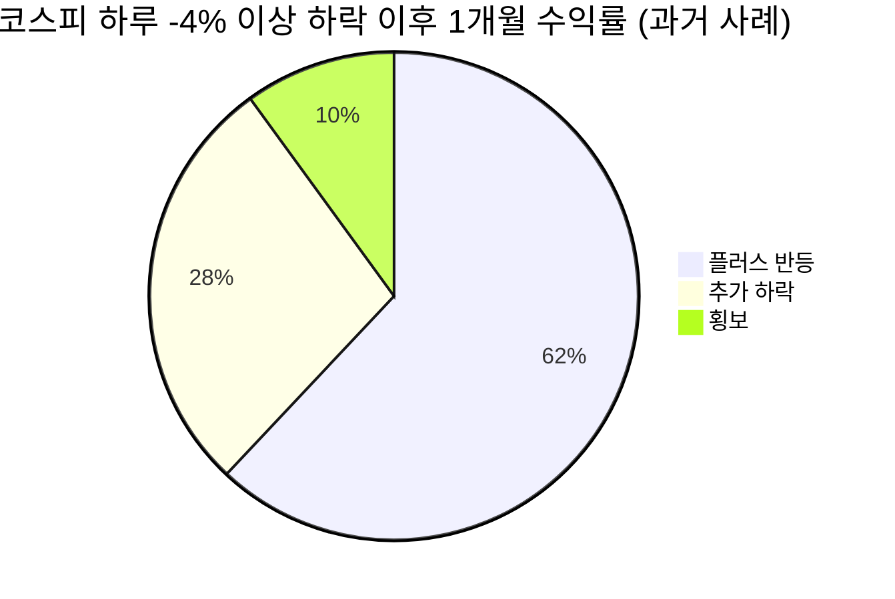

# 📊 모닝 브리핑 — 2026년 4월 3일 (금)

> **🔴 Risk-Off** — 중동 지정학 + 유가 급등 + 한국 증시 급락의 복합 충격
> - **매크로**: 유가 WTI 배럴당 111달러 (2022년 이후 최고치), IMF 미 금리 인하 연 1회 전망
> - **리스크**: 코스피 -4.47%, 코스닥 -5.36% 급락, 사모신용 시장 환매 제한 불안
> - **시그널**: 호르무즈 해협 리스크 가격화 중 — 에너지 섹터 단기 수혜, 성장주 압박

---

## 시장 스냅샷

### 주요 지수
| 지수 | 종가 | 등락 | 52주 위치 |
|------|------|------|----------|
| S&P 500 | 6,582.69 | +7.37 (+0.1%) | ▓▓▓▓▓▓▓▓░░ 80% (4,983–6,979) |
| 나스닥 | 21,879.18 | +38.23 (+0.2%) | ▓▓▓▓▓▓▓▓░░ 76% (15,268–23,958) |
| 다우존스 | 46,504.67 | -61.07 (-0.1%) | ▓▓▓▓▓▓▓░░░ 71% (37,646–50,188) |
| 코스피 | 5,478.70 | +426.24 (+8.4%) | ▓▓▓▓▓▓▓▓░░ 79% (2,294–6,307) |
| 코스닥 | 1,116.18 | +63.79 (+6.1%) | ▓▓▓▓▓▓▓▓▓░ 86% (643–1,193) |
| 닛케이 225 | 53,739.68 | +2675.96 (+5.2%) | ▓▓▓▓▓▓▓▓░░ 82% (31,137–58,850) |

### 매크로/원자재/크립토
| 항목 | 값 | 변동 | 52주 위치 |
|------|-----|------|----------|
| 미국 10Y | 4.31% | -0.01%p | ▓▓▓▓▓▓░░░░ 56% (4–5) |
| 미국 2Y | 3.61% | +0.00%p | ▓░░░░░░░░░ 13% (4–4) |
| DXY | 100.02 | +0.37 (+0.4%) | ▓▓▓▓▓░░░░░ 50% (96–104) |
| USD/KRW | 1,509.86 | +6.53 (+0.4%) | ▓▓▓▓▓▓▓▓▓▓ 96% (1,348–1,516) |
| USD/JPY | 159.52 | +0.95 (+0.6%) | ▓▓▓▓▓▓▓▓▓▓ 96% (141–160) |
| WTI 원유 | $112.06 | +11.9% | ▓▓▓▓▓▓▓▓▓▓ 100% (55–112) |
| 금 (Gold) | $4,702.70 | -1.7% | ▓▓▓▓▓▓▓░░░ 74% (2,951–5,318) |
| 은 (Silver) | $73.17 | -3.6% | ▓▓▓▓▓░░░░░ 51% (29–115) |
| BTC | $66,889 | -1.7% | ▓░░░░░░░░░ 7% (62,702–124,753) |
| VIX | 23.87 | -0.67 (-2.7%) | ▓▓▓░░░░░░░ 27% (13–52) |
| 10Y-2Y 스프레드 | 0.71%p | -0.01%p | — |

---
⚠️ 시장 스냅샷은 시스템에 의해 자동 삽입됩니다.

---

## 시장 센티먼트

<div style="display:flex;border-radius:8px;overflow:hidden;margin:8px 0;font-size:0.85em"><div style="background:#F44336;width:75%;padding:6px 8px;color:white">🔴 Risk-Off 75%</div><div style="background:#FF9800;width:15%;padding:6px 8px;color:white">🟡 중립 15%</div><div style="background:#4CAF50;width:10%;padding:6px 8px;color:white;white-space:nowrap">🟢 On 10%</div></div>

**핵심 판독**: 트럼프의 이란 강경 발언이 도화선이 됐고, 호르무즈 해협 통행 리스크가 유가를 2022년 이후 최고점으로 끌어올렸다. 한국 증시는 외국인 이탈과 지정학 공포가 겹치며 단 하루에 코스피 -4.47%, 코스닥 -5.36%라는 패닉 수준의 낙폭을 기록했다. 사모신용 시장의 환매 제한 이슈까지 가세하며 신용 경색 우려가 수면 위로 올라오고 있다.

**변곡 촉매**:
- 🔴 **다운**: 이란-미국 갈등 군사적 국면 전환 → 호르무즈 해협 통행 차질 현실화
- 🟢 **업**: 중동 외교적 타결 + 트럼프 발언 완화 → 유가 급락 전환 + 위험자산 반등

---

## 섹터별 센티먼트

| 섹터 | 센티먼트 | 한줄 평가 |
|------|---------|----------|
| 에너지/정유 | 🟢 강세 | 유가 111달러 급등, 단기 수혜 명확 — 단, 수요 파괴 시 역전 리스크 |
| 방산 | 🟢 강세 | 중동 지정학 긴장 고조 → 글로벌 방산 수요 재점화 기대 |
| 해운/물류 | 🟡 혼조 | 호르무즈 우회 수요↑ vs. 글로벌 경기 둔화 우려 상충 |
| 반도체/IT | 🔴 약세 | 코스닥 급락 주도, 고금리 장기화 우려로 성장주 밸류에이션 압박 |
| 금융/사모신용 | 🔴 주의 | 블루아울 캐피털 환매 제한 → 사모신용 시장 자금 이탈 불안 확산 |
| 소비재/내수 | 🔴 약세 | 유가 급등 = 가처분소득 압박, 소비 심리 위축 선행 |
| 금/귀금속 | 🟢 강세 | Risk-Off 복합 환경에서 안전자산 수요 집중 |

---

## 오버나이트 핵심 이벤트

### 1. 트럼프 이란 강경 발언 — 유가 2022년 이후 최고치

- **요약**: 트럼프 대통령의 이란에 대한 강경 발언이 시장에 충격을 주었고, WTI 유가가 배럴당 111달러까지 급등하며 2022년 이후 최고치를 기록.
- **So What**: 유가 급등은 단순 에너지 비용 상승을 넘어 글로벌 인플레이션 재점화 우려를 불러온다. 이미 IMF가 미국 금리 인하를 연 1회로 제한적으로 전망하는 상황에서, 유가발 인플레이션은 Fed의 정책 유연성을 더욱 옥죄는 2차 효과를 낳는다. 이란이 호르무즈 해협 통행 규약을 마련했다는 소식에 낙폭 일부가 회복됐지만 불확실성은 지속.
- **크로스 임팩트**: 에너지 섹터 단기 수혜, 항공·해운·화학 원가 압박, 금리 인하 기대 후퇴로 성장주 전반 약세

---

### 2. 한국 증시 코스피 -4.47%, 코스닥 -5.36% 급락

- **요약**: 4월 2일 코스피와 코스닥이 각각 4.47%, 5.36% 급락하며 투자심리가 극도로 위축.
- **So What**: 단일 거래일 5% 수준의 낙폭은 외국인 급매도와 개인 투매가 동시에 발생했음을 시사한다. 중동 지정학 리스크가 트리거였지만, 이미 취약했던 수급 구조(외국인 지분 축소 추세)가 낙폭을 증폭시켰다. 공포 국면에서의 급락은 단기 기술적 반등 조건을 형성하지만, 지정학 불확실성이 해소되지 않으면 반등 지속성이 낮다.
- **크로스 임팩트**: [[코스피]] [[코스닥]] 전반, 특히 외국인 비중 높은 [[삼성전자]] [[SK하이닉스]] 등 대형주

---

### 3. IMF — 미국 금리 인하 연 1회 전망

- **요약**: IMF가 올해 미국의 금리 인하 여지가 제한적이며 단 1회 인하에 그칠 것으로 공식 전망.
- **So What**: IMF의 보수적 전망은 시장의 금리 인하 기대를 추가로 낮추는 기준점으로 작용한다. 유가 급등이 인플레이션 압력을 가중하는 상황에서 Fed의 조기 피벗 기대는 더욱 후퇴할 가능성이 높다. '고금리 장기화(Higher for Longer)'가 현실화될 경우 밸류에이션 부담이 높은 성장주와 부채 의존도가 높은 기업들의 조정 압력이 지속된다.
- **크로스 임팩트**: 성장주/기술주 밸류에이션 압박, 달러 강세 지속, 신흥국 자본 유출 리스크

---

### 4. 사모신용(Private Credit) 시장 환매 제한 불안 재부각

- **요약**: 블루아울 캐피털(Blue Owl Capital)의 대형 사모신용 펀드가 환매 제한 조치를 취하면서 사모신용 시장 자금 이탈 우려가 재부각.
- **So What**: 사모신용 시장은 저금리 시대에 급성장한 대안투자 시장이다. 고금리 장기화 환경에서 편입 자산의 부실화가 진행되면, 환매 제한 → 투자자 신뢰 훼손 → 연쇄 자금 이탈이라는 유동성 위기 경로가 열릴 수 있다. 2022년 영국 LDI 펀드 사태나 2023년 미국 지역은행 사태처럼 비가시적 리스크가 갑자기 시스템 전반에 전파되는 패턴을 주의해야 한다.
- **크로스 임팩트**: 글로벌 금융주, 대안투자 운용사([[블랙스톤]] 등), 신용 스프레드 전반

---

## 오늘의 일정

| 시간(한국) | 이벤트 | 중요도 | 관련 종목 |
|-----------|--------|--------|----------|
| 오후 (장중) | 한국 증시 — 전일 급락 이후 기술적 반등 여부 | ⭐⭐⭐⭐ | [[코스피]] [[코스닥]] 전반 |
| 밤 (미정) | 중동 지정학 상황 업데이트 (이란-미국) | ⭐⭐⭐⭐⭐ | [[에너지]] 섹터, 전 시장 |
| 이번 주 내 | IMF 추가 경제 전망 코멘트 모니터링 | ⭐⭐⭐ | 채권, 달러, 금리 민감주 |
| 이번 주 내 | 사모신용 시장 추가 환매 제한 여부 | ⭐⭐⭐⭐ | 글로벌 금융주, 대안투자 |

> [!warning] ⭐⭐⭐⭐⭐ 중동 지정학 이벤트 시나리오 분기
> - **완화 시나리오**: 미-이란 외교 채널 가동, 호르무즈 통행 안전 확인 → 유가 급락, 위험자산 강한 반등
> - **악화 시나리오**: 트럼프 추가 강경 발언 또는 군사적 긴장 고조 → 유가 120달러+ 돌파, 글로벌 증시 추가 급락

---

## 테마 시그널

## 호르무즈 해협: 세계 원유의 '병목'이 다시 뜨거워졌다

> [!abstract] 오늘의 테마
> 유가가 111달러까지 치솟은 배경엔 단순한 수급 불균형이 아닌, 세계 원유 무역의 핵심 병목인 호르무즈 해협의 봉쇄 리스크가 있다. 이 지점이 막히면 글로벌 에너지 시장에 어떤 일이 벌어지는가?

### 호르무즈 해협이 왜 중요한가

호르무즈 해협은 페르시아만과 오만만을 연결하는 폭 약 33km의 좁은 수로다. 이 좁은 통로를 통해 **전 세계 원유 해상 수송량의 약 20%, LNG 수송량의 약 25%** 가 통과한다. 사우디아라비아, UAE, 이라크, 쿠웨이트의 원유 수출은 대부분 이 해협을 통해서만 이루어진다.

### 봉쇄 시 가격 전파 메커니즘

```
호르무즈 봉쇄
    ↓
중동 원유 수출 차질 (일 약 2,000만 배럴)
    ↓
WTI/브렌트 스파이크 → 에너지 비용 급등
    ↓
① 인플레이션 재점화 → Fed 금리 인하 불가
② 항공·해운·화학·소비재 원가 급등
③ 성장주 할인율 상승 → 밸류에이션 압박
    ↓
글로벌 경기침체 리스크 확대
```

### 역사적 사례와 가격 반응

| 사건 | 연도 | 유가 반응 | 지속 기간 |
|------|------|----------|----------|
| 이란 혁명 | 1979 | 2배 이상 급등 | 2년 이상 |
| 이란-이라크 전쟁(탱커 전쟁) | 1984-88 | 변동성 극대화 | 4년 |
| 걸프전 | 1990 | 단기 2배 | 6개월 |
| 이란 핵 협상 위기 | 2012 | 110달러대 | 1년 이상 |
| **현재 (2026)** | **2026** | **111달러** | **진행 중** |

### 투자자가 주목해야 할 핵심 구분

> [!tip] 핵심 인사이트
> **"지정학 리스크 프리미엄"과 "실제 공급 차질"은 완전히 다른 투자 반응을 부른다.**
> - **리스크 프리미엄 단계**: 유가 상승 → 정유/에너지주 수혜, 그러나 실제 공급은 정상 → 수 주~수 개월 내 가격 정상화
> - **실제 공급 차질 단계**: 유가 폭등 + 글로벌 경기침체 → 에너지주도 결국 수요 파괴로 조정

현재 시장은 **리스크 프리미엄 단계**에 있다. 이란이 호르무즈 통행 규약을 마련했다는 소식은 실제 봉쇄로 가지 않겠다는 신호를 보낸 것이다. 이 간극을 이해하면, 패닉 매도와 냉철한 포지셔닝을 구분할 수 있다.

**오늘 실천 방법**: 유가 관련 뉴스를 볼 때 "실제 선적 차질이 보고되고 있는가?"를 확인하라. 수사적 긴장과 실물 공급 차질을 혼동하지 않는 것이 지정학 국면 투자의 핵심이다.

---

## 대가의 시선

> "The market can stay irrational longer than you can stay solvent."
> (시장은 당신이 버틸 수 있는 것보다 더 오래 비이성적으로 머물 수 있다.)
> — **John Maynard Keynes** [클래식]

**맥락**: 케인즈는 자신도 투자자였고, 합리적으로 옳은 포지션을 잡고도 단기 유동성 압박으로 청산을 강요당하는 상황을 직접 경험했다. 이 발언은 그 경험에서 나온 생생한 경고다.

**투자 함의**: 오늘처럼 코스피 -4.47%, 코스닥 -5.36%가 나오는 날, 많은 투자자가 "이건 분명히 과매도"라고 판단한다. 그 판단이 맞을 수도 있다. 그러나 중동 지정학이 추가로 악화된다면 시장은 더 비이성적으로 하락할 수 있다. 지금 필요한 것은 방향의 확신이 아니라, **그 확신이 틀렸을 때도 버틸 수 있는 유동성과 포지션 사이즈**다. 레버리지를 줄이고, 현금 비중을 확보하는 것이 패닉 장세에서의 생존 전략이다.

---

## 투자 레슨

## 패닉 장세에서의 "공포 vs. 진짜 위기" 구분 프레임워크

> [!abstract] 오늘의 레슨
> 하루에 코스피가 4% 넘게 빠지면 투자자는 두 가지 본능 중 하나를 선택한다: 던진다 vs. 줍는다. 둘 다 틀릴 수 있다. 중요한 것은 **어떤 종류의 하락인지 먼저 진단**하는 것이다.

### 하락의 두 가지 종류

| 구분 | 공포발 하락 (Fear-Driven) | 펀더멘털 하락 (Fundamental) |
|------|--------------------------|---------------------------|
| **원인** | 지정학, 루머, 패닉 심리 | 실적 악화, 신용 위기, 구조적 수요 감소 |
| **속도** | 빠름 (1-3일 내 급락) | 느림 (수개월 하강) |
| **회복** | 빠른 V자 반등 가능 | 장기 U자 또는 L자 |
| **대응** | 유동성 확보 후 선별 매수 관심 | 손절 or 장기 홀딩 재검토 |
| **오늘 해당?** | 🟡 부분 해당 | 🟡 사모신용·고금리는 펀더멘털 |

### 진단 체크리스트

오늘 같은 날, 투자자가 스스로 물어봐야 할 질문:

<div style="border-left:4px solid #FF9800;padding-left:12px;margin:8px 0">

**① 이 하락의 트리거가 해소 가능한가?**
트럼프 발언 → 외교 협상으로 완화 가능 (공포발 성격)
고금리 장기화 → 구조적, 단기 해소 어려움 (펀더멘털 성격)

**② 신용 시장이 같이 무너지고 있는가?**
사모신용 환매 제한 이슈 → 신용 시장 동반 스트레스 = 위험도 상승

**③ 내가 지금 팔면, 무엇을 살 것인가?**
명확한 답이 없다면 → 패닉 매도일 가능성

</div>

### 역사가 알려주는 패턴



> [!warning] 중요한 전제
> 위 패턴은 **신용 위기 없는 공포발 하락**에서 유효하다. 사모신용 시장의 구조적 스트레스가 확산되는 시나리오에서는 통계가 달라진다. 오늘은 두 가지 성격이 혼재되어 있어 단순한 저점 매수 접근은 위험하다.

**오늘 실천 방법**: 
1. 지정학 뉴스(이란-미국)는 **하루 2회** 업데이트만 확인 — 실시간 뉴스 과몰입은 판단력을 흐린다.
2. 사모신용 시장의 추가 환매 제한 여부를 **주 단위**로 모니터링 — 이것이 진짜 시스템 리스크로 번지는지가 핵심 판단 기준이다.

---

## 오늘 하나만 기억한다면

> [!verdict] 오늘 하나만 기억한다면
> **"유가 111달러는 '지정학 공포 프리미엄'이다 — 실제 공급이 막혔는지를 확인하기 전까지, 패닉도 탐욕도 금물."**