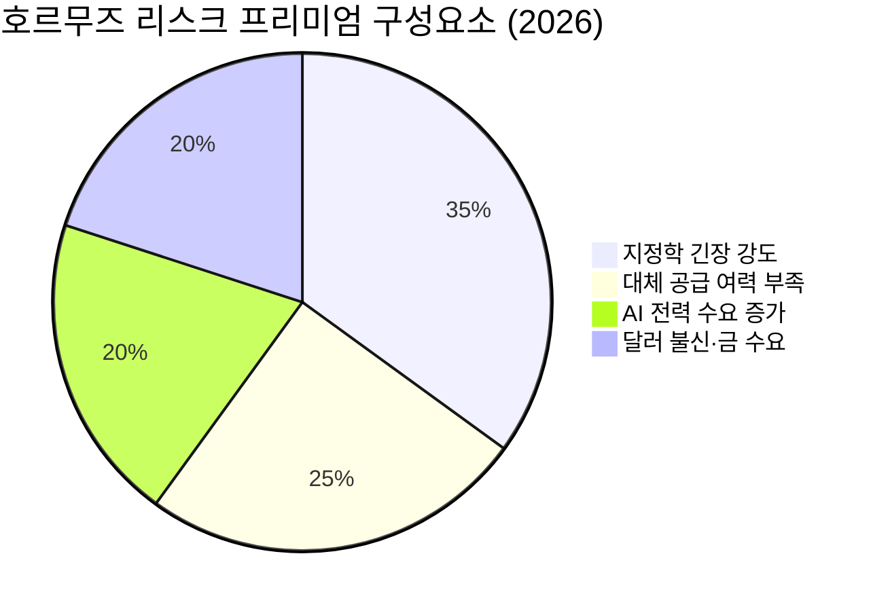

# 📊 모닝 브리핑 — 2026년 4월 4일 (토)

> **🔴 Risk-Off** — 중동 리스크·유가 급등·연준 매파 기조 3중 압박
> - **매크로**: 국제유가 급등, 10년물 금리 상승 압력 지속
> - **리스크**: 다우 선물 하락 마감, VIX 상승 경계 국면
> - **시그널**: ① 호르무즈 리스크 → 에너지·방산 강세 / ② 금리 인하 기대 후퇴 → 성장주 밸류에이션 압박

---

## 시장 스냅샷

### 주요 지수
| 지수 | 종가 | 등락 | 52주 위치 |
|------|------|------|----------|
| S&P 500 | 6,582.69 | +7.37 (+0.1%) | ▓▓▓▓▓▓▓▓░░ 80% (4,983–6,979) |
| 나스닥 | 21,879.18 | +38.23 (+0.2%) | ▓▓▓▓▓▓▓▓░░ 76% (15,268–23,958) |
| 다우존스 | 46,504.67 | -61.07 (-0.1%) | ▓▓▓▓▓▓▓░░░ 71% (37,646–50,188) |
| 닛케이 225 | 52,463.27 | -1276.41 (-2.4%) | ▓▓▓▓▓▓▓▓░░ 77% (31,137–58,850) |

### 매크로/원자재/크립토
| 항목 | 값 | 변동 | 52주 위치 |
|------|-----|------|----------|
| 미국 10Y | 4.31% | -0.01%p | ▓▓▓▓▓▓░░░░ 56% (4–5) |
| 미국 2Y | 3.61% | +0.00%p | ▓░░░░░░░░░ 13% (4–4) |
| DXY | 100.19 | +0.16 (+0.2%) | ▓▓▓▓▓▓░░░░ 56% (96–103) |
| USD/KRW | 1,510.54 | +1.32 (+0.1%) | ▓▓▓▓▓▓▓▓▓▓ 97% (1,348–1,516) |
| USD/JPY | 159.63 | +0.94 (+0.6%) | ▓▓▓▓▓▓▓▓▓▓ 97% (141–160) |
| WTI 원유 | $111.54 | +11.4% | ▓▓▓▓▓▓▓▓▓▓ 100% (55–112) |
| 금 (Gold) | $4,651.50 | -2.8% | ▓▓▓▓▓▓▓░░░ 72% (2,951–5,318) |
| 은 (Silver) | $72.74 | -4.1% | ▓▓▓▓▓░░░░░ 51% (29–115) |
| BTC | $66,917 | +0.0% | ▓░░░░░░░░░ 7% (62,702–124,753) |
| VIX | 23.87 | -0.67 (-2.7%) | ▓▓▓░░░░░░░ 27% (13–52) |
| 10Y-2Y 스프레드 | 0.71%p | -0.01%p | — |

---
⚠️ 시장 스냅샷은 시스템에 의해 자동 삽입됩니다.

---

## 시장 센티먼트

<div style="display:flex;border-radius:8px;overflow:hidden;margin:8px 0;font-size:0.85em">
  <div style="background:#F44336;width:70%;padding:6px 8px;color:white">🔴 Risk-Off 70%</div>
  <div style="background:#FF9800;width:20%;padding:6px 8px;color:white">🟡 Neutral 20%</div>
  <div style="background:#4CAF50;width:10%;padding:6px 8px;color:white;white-space:nowrap">🟢 On 10%</div>
</div>

**핵심 판독**: 중동 지정학 리스크가 재점화되며 호르무즈 해협 통항 차질 우려가 유가를 끌어올렸고, 이는 곧바로 인플레이션 재점화 → 연준 매파 신호 강화 → 금리 인하 기대 후퇴의 연쇄 반응을 촉발했습니다. 미국 3월 고용지표가 예상을 상회한 것은 경제 체력 측면에서는 긍정적이나, 현 국면에서는 오히려 연준에 더 오래 기다릴 여유를 줘 Risk-Off 심리를 강화하는 역설이 됐습니다. 성금요일 미국 시장 휴장으로 유동성이 낮아진 환경에서 코스피는 급등락을 반복하는 고변동성 장세를 연출했습니다.

**변곡 촉매**:
- 🔴 트럼프 중동 강경 발언 추가 → 호르무즈 통항 차단 리스크 현실화, 유가 추가 급등
- 🟢 이란-오만 중재 협상 진전 → 지정학 긴장 완화, 유가 안정·위험자산 반등

---

## 섹터별 센티먼트

| 섹터 | 센티먼트 | 한줄 평가 |
|------|---------|----------|
| 에너지/정유 | 🟢 강세 | 호르무즈 리스크·유가 급등 직접 수혜, 단기 모멘텀 강하나 외교 해결 시 되돌림 주의 |
| 방산/안보 | 🟢 강세 | 중동 리스크 재확대로 지정학 프리미엄 재부각, 수출 규제 변수 병존 |
| 금/귀금속 | 🟢 강세 | 달러 헤지·인플레 대안·중앙은행 매수 구조적 강세, 과열 경계 구간 진입 가능 |
| 반도체 | 🔴 약세 | 금리 인하 기대 후퇴로 밸류에이션 부담 재점화, 미중 갈등·공급망 불확실성 지속 |
| 성장주/빅테크 | 🔴 약세 | 장기금리 상승 압력이 할인율 확대 → 고PER 종목 취약, Risk-Off 직격 |
| 유틸리티/원전 | 🟡 중립 | AI 전력 수요 구조적 강세이나 금리 상승기 배당주 밸류에이션 희석 상충 |
| 소비재(필수) | 🟡 중립 | 방어주 선호 심리로 상대적 강세, 유가 상승에 따른 원가 압박 리스크 병존 |
| 해운/물류 | 🟡 중립 | 호르무즈 우회 항로 수요 증가 잠재력, 불확실성 장기화 시 수혜 vs 단기 과잉 변동성 |

---

## 오버나이트 핵심 이벤트

### 1. 트럼프 중동 강경 발언 재부각 → 유가 급등

- **요약**: 이란·오만 간 호르무즈 해협 통항 논의로 일시 공포 완화 기대가 있었으나, 트럼프 대통령의 중동 관련 강경 발언이 재부각되며 국제유가가 급등 마감했습니다.
- **So What**: 유가 급등은 즉각적인 인플레이션 기대 재점화로 이어지며 연준의 금리 인하 시계를 더 뒤로 밀었습니다. 중동 리스크가 '일시적 공포'가 아닌 '구조적 불확실성'으로 인식되기 시작하면 에너지 가격의 구조적 상단이 높아지고 글로벌 성장 전망에 하방 압력이 가중됩니다.
- **크로스 임팩트**: 에너지·방산 수혜 / 항공·소비재·운송 비용 부담 / 신흥국 달러 부채국 압박

### 2. 미국 3월 고용보고서 서프라이즈

- **요약**: 비농업 고용이 예상치를 크게 상회하고 실업률이 하락하며 미국 노동시장의 견조함을 재확인했습니다.
- **So What**: 표면적으로 긍정적인 고용 지표지만, 현 국면에서는 '좋은 뉴스가 나쁜 뉴스'로 작동합니다. 연준이 서두를 이유가 없어지며 금리 인하 기대가 추가로 후퇴했고, 이는 장기금리 상승 → 성장주 밸류에이션 압박 → 신흥시장 자금 이탈 우려의 연쇄로 이어집니다. 고용이 강한 동안은 경기 침체 공포가 억제되는 것이 유일한 완충 요소입니다.
- **크로스 임팩트**: 달러 강세 / 국채금리 상승 / 금리 민감 섹터(리츠·성장주) 부정적

### 3. 연준 내 매파 신호 확산 및 채권시장 부진

- **요약**: 중동발 유가 상승에 따른 인플레이션 우려로 연준 내 매파적 신호가 강화되며 글로벌 채권시장이 부진을 심화했습니다.
- **So What**: 채권 매도(금리 상승) 압력이 지속되면 '무위험 수익률'이 높아져 주식 전체의 상대적 매력이 낮아집니다. 특히 한국 코스피처럼 외국인 비중이 높은 시장은 달러 강세·금리 상승 국면에서 이중 압박을 받게 됩니다. 외국인이 오늘 순매수로 전환했더라도 이 구조가 반전되지 않으면 지속성이 낮습니다.
- **크로스 임팩트**: 전 자산군 할인율 상승 / 달러 강세 / 금은 인플레 헤지 수요로 이례적 강세 지속

### 4. 코스피 고변동성 — 외국인 순매수 전환 후 재하락

- **요약**: 코스피는 중동 리스크 완화 기대와 외국인·기관 순매수에 힘입어 장중 상승했으나, 트럼프 발언 이후 하락 전환하며 극단적인 변동성을 보였습니다.
- **So What**: 장중 방향이 수차례 뒤바뀐 것은 시장 참여자들이 '지정학 리스크 완화 vs 재확대'를 실시간으로 반복 재평가하고 있다는 신호입니다. 이런 환경에서는 단기 방향성 베팅보다 변동성 자체를 관리하는 전략이 유효합니다. 외국인 순매수 전환 신호 하나만으로 추세 전환을 단정 짓기 이릅니다.
- **크로스 임팩트**: [[삼성전자]] [[SK하이닉스]] 등 외국인 비중 상위 대형주 / 코스피 ETF 변동성 확대

---

## 오늘의 일정

| 시간(한국) | 이벤트 | 중요도 | 관련 자산/섹터 |
|-----------|--------|--------|--------------|
| 종일 | 미국 성금요일 — 채권시장 단축 운영, 주요 발표 없음 | ⭐⭐ | 전 자산군 유동성 주의 |
| 주말 | 중동 외교 협상 동향 모니터링 | ⭐⭐⭐⭐ | [[에너지]] [[방산]] 유가 |
| 다음 주 | 미국 3월 CPI 발표 (일자 확인 필요) | ⭐⭐⭐⭐⭐ | 전 종목·채권·환율 |
| 다음 주 | 연준 위원 발언 일정 다수 예정 | ⭐⭐⭐⭐ | 금리 민감 섹터 전반 |

> [!warning] ⭐⭐⭐⭐⭐ 다음 주 CPI — 분기점 시나리오
> - **🟢 CPI 하회 시**: 금리 인하 기대 복원 → 성장주 반등, 달러 약세
> - **🔴 CPI 상회 시**: 유가 상승 + 고용 강세 + 인플레 3중 악재 → 연준 동결 장기화 공식화, 채권·주식 동반 약세
> - 현재 시장은 후자에 더 무게를 두고 있어 CPI 하회 시 반등 탄력이 클 수 있음

---

## 테마 시그널

## 호르무즈 해협 — 글로벌 에너지 시스템의 '단일 실패 지점'

> [!abstract] 오늘의 테마
> 중동 리스크가 재부각될 때마다 시장이 유독 민감하게 반응하는 이유는 하나입니다. 글로벌 에너지 흐름의 결정적 '병목'이 존재하기 때문입니다.

### 왜 호르무즈인가?

전 세계 원유 해상 운송의 약 20%, LNG 교역의 약 30%가 호르무즈 해협을 통과합니다. 폭이 가장 좁은 구간은 약 33km에 불과합니다. 단일 지리적 지점이 글로벌 에너지 가격 전체에 영향을 미칠 수 있는 구조입니다.

| 요소 | 수치/내용 |
|------|----------|
| 일일 통과 원유량 | 글로벌 해상 원유 교역의 ~20% |
| 대체 경로 | 사우디 East-West Pipeline (용량 제한적), 오만 우회 (비용·시간 대폭 증가) |
| 주요 통과국 | 사우디, UAE, 쿠웨이트, 이라크, 이란 수출 전량 |
| 차단 시 유가 영향 | 역사적 긴장 고조 때마다 단기 $10~30/barrel 스파이크 사례 |

### 지정학적 '병목(Chokepoint)'의 투자 논리

> [!tip] 핵심 인사이트
> 호르무즈 같은 물리적 병목은 **위험이 현실화될 확률**보다 **위험 프리미엄 자체**가 자산 가격에 영향을 미칩니다. 실제 차단이 일어나지 않아도, '차단 가능성'이 높아지는 것만으로 유가에 리스크 프리미엄이 붙습니다.

이것이 트럼프 발언 하나에 유가가 급등하는 메커니즘입니다. 시장은 실제 결과가 아닌 **결과의 분포(distribution of outcomes)**에 반응합니다. 꼬리 리스크(tail risk)가 커지면 기대값이 올라가고, 에너지 관련 자산의 변동성 프리미엄이 확대됩니다.

### 2026년 구조적 변화: 왜 이번엔 다른가?



1. **공급 여력 감소**: 주요 산유국의 예비 생산 용량이 과거 수준보다 낮아진 상황에서 공급 차질은 과거보다 더 큰 가격 충격을 만들 수 있습니다.
2. **AI 전력 수요 구조적 증가**: 데이터센터 급증으로 전력 수요가 폭발적으로 늘고 있는데, 전력 생산의 상당 부분이 여전히 화석연료에 의존합니다. 에너지 수요의 구조적 하단이 높아진 것입니다.
3. **대체 에너지 전환의 공백기**: 재생에너지 비중이 늘고 있지만 저장·그리드 인프라가 따라가지 못해 단기적으로 화석연료 의존도가 유지됩니다.

### 투자자가 취할 수 있는 포지셔닝

<div style="border-left:4px solid #FF9800;padding-left:12px;margin:8px 0">

**중동 리스크 프리미엄이 높을 때 역사적으로 유효했던 포지션:**
- 🟢 에너지 현물/ETF, 정유 주식 (직접 수혜)
- 🟢 금 (인플레 헤지 + 안전자산 동시 수혜)
- 🟢 방산 (지정학 프리미엄 확대)
- 🔴 장거리 해운 의존 소비재 (비용 상승)
- 🔴 금리 민감 성장주 (유가 → 인플레 → 금리 상승 연쇄)

</div>

> [!question] 검토 필요
> 외교 협상이 빠르게 진전될 경우 '매수 루머, 매도 뉴스' 패턴으로 에너지·방산 급반락 가능성. 리스크 프리미엄 포지션은 헤지와 함께 운용해야 합니다.

---

## 대가의 시선

> "지정학적 사건은 시장을 일시적으로 교란하지만, 장기 투자자에게 지정학은 소음이지 시그널이 아니다. 단, 구조적 변화를 수반할 때는 예외다."
> — **워런 버핏**, 버크셔 해서웨이 CEO [클래식]

**맥락**: 버핏은 걸프전, 9·11, 이라크전 등 수차례의 중동 위기를 겪으면서도 일관되게 "지정학을 이유로 주식을 팔지 않겠다"고 발언해왔습니다. 다만 그는 동시에 에너지 전환이나 공급망 재편 같은 '구조적 변화'는 철저히 추적했습니다.

**투자 함의**: 오늘 중동 리스크가 '단기 이벤트'인지 '구조적 재편의 시작'인지를 구분하는 것이 핵심입니다. 트럼프 발언 하나에 반응하는 것과, 호르무즈 해협의 지정학적 위상이 영구적으로 바뀌는 것은 전혀 다른 투자 문제입니다. 현재 시장은 전자를 후자처럼 반응하고 있을 가능성이 있어, 공포가 극대화될 때 역방향 포지셔닝 기회를 냉정하게 탐색해야 합니다.

---

## 투자 레슨

## "좋은 뉴스가 나쁜 뉴스" — 비선형 시장 해석의 함정

> [!abstract] 오늘의 레슨
> 오늘 미국 3월 고용 서프라이즈는 주가를 올리지 않았습니다. 왜 같은 종류의 데이터가 어떤 날은 호재고 어떤 날은 악재일까요?

### 시장 반응 함수는 '맥락 의존적'이다

경제학 교과서에서 고용 증가는 항상 긍정적입니다. 그러나 시장은 지표 자체가 아니라 **지표가 연준 반응 함수(Fed Reaction Function)에 미치는 영향**을 삽니다.

```
고용 강세 → [맥락 A: 경기 침체 공포 시] → 침체 우려 완화 → 🟢 주가 상승
고용 강세 → [맥락 B: 인플레 우려 시]  → 금리 인하 후퇴 → 🔴 주가 하락
```

지금은 맥락 B입니다. 유가 급등으로 인플레이션이 재점화되는 환경에서 강한 고용은 연준이 서두를 이유가 없다는 신호로 읽힙니다.

### 비선형 시장 해석 프레임워크

| 지표 | 맥락 A (침체 공포 우세) | 맥락 B (인플레 공포 우세) |
|------|----------------------|------------------------|
| 고용 강세 | 🟢 호재 (침체 회피) | 🔴 악재 (금리 인하 지연) |
| 소비 증가 | 🟢 호재 (경제 활력) | 🔴 악재 (수요 인플레) |
| 유가 상승 | 🟡 혼조 (성장 신호) | 🔴 악재 (비용 인플레) |
| 달러 강세 | 🟡 혼조 | 🔴 악재 (신흥국·원자재) |

**핵심**: 어떤 '맥락 국면'에 있는지를 먼저 파악해야 개별 지표의 방향성을 올바르게 해석할 수 있습니다.

### 맥락 국면 전환의 신호는?

<div style="background:#e0e0e0;border-radius:8px;overflow:hidden;margin:4px 0"><div style="background:#F44336;width:70%;padding:4px 8px;color:white;font-size:0.9em;white-space:nowrap">현재: 인플레 공포 70%</div></div>

<div style="background:#e0e0e0;border-radius:8px;overflow:hidden;margin:4px 0"><div style="background:#FF9800;width:30%;padding:4px 8px;color:white;font-size:0.9em;white-space:nowrap;min-width:60px">침체 공포 30%</div></div>

맥락이 B(인플레)에서 A(침체)로 전환될 신호:
- 고용 지표가 급격히 악화되는 시점
- 유가가 외교 해결로 급락하는 시점
- 연준이 성장 우려를 공식 언급하는 시점

> [!tip] 오늘 실천 방법
> 이번 주 발표될 CPI를 볼 때, 숫자 자체보다 "이 숫자가 연준의 다음 행동을 어떻게 바꾸는가"를 먼저 생각하세요. 지금은 인플레 맥락(B)이므로, CPI 하회 = 금리 인하 기대 복원 = 위험자산 반등의 연쇄가 작동할 수 있습니다.

---

## 오늘 하나만 기억한다면

> [!verdict] 오늘 하나만 기억한다면
> **"지금 시장은 '좋은 경제 지표조차 악재'로 읽는 인플레 공포 국면이다 — 다음 주 CPI가 이 맥락을 바꿀 유일한 열쇠다."**