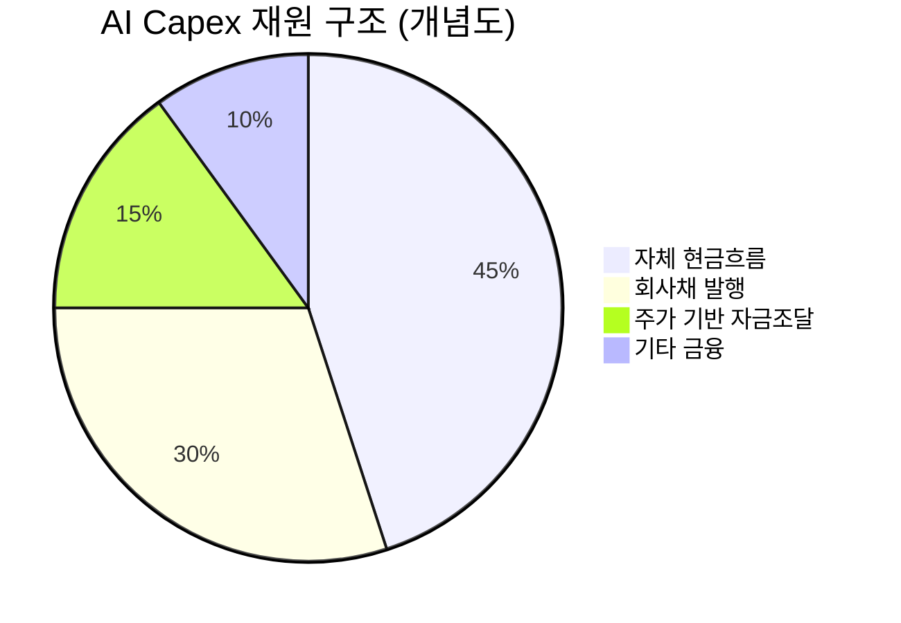

# 📊 모닝 브리핑 — 2026년 4월 5일 (일)

> **🔴 Risk-Off** — 지정학 + 고용발 금리 우려 + 유가 급등이 동시 작동하는 삼중 압박 국면
> - **매크로**: 유가 급등, 원/달러 환율 1,500원대 상승 압력 지속
> - **리스크**: 나스닥·다우존스 조정 국면 진입, VIX 경계 수준
> - **시그널**: ① 강한 고용 = 금리 인하 지연 재확인 ② 지정학 변동성 = 에너지 섹터 수혜 + 위험자산 전반 압박

---

## 시장 스냅샷

### 주요 지수
| 지수 | 종가 | 등락 | 52주 위치 |
|------|------|------|----------|
| S&P 500 | 6,582.69 | +7.37 (+0.1%) | ▓▓▓▓▓▓▓▓░░ 80% (4,983–6,979) |
| 나스닥 | 21,879.18 | +38.23 (+0.2%) | ▓▓▓▓▓▓▓▓░░ 76% (15,268–23,958) |
| 다우존스 | 46,504.67 | -61.07 (-0.1%) | ▓▓▓▓▓▓▓░░░ 71% (37,646–50,188) |
| 코스피 | 5,377.30 | +143.25 (+2.7%) | ▓▓▓▓▓▓▓▓░░ 77% (2,294–6,307) |
| 코스닥 | 1,063.75 | +7.41 (+0.7%) | ▓▓▓▓▓▓▓▓░░ 77% (643–1,193) |
| 닛케이 225 | 53,123.49 | +660.22 (+1.3%) | ▓▓▓▓▓▓▓▓░░ 79% (31,137–58,850) |

### 매크로/원자재/크립토
| 항목 | 값 | 변동 | 52주 위치 |
|------|-----|------|----------|
| 미국 10Y | 4.31% | -0.01%p | ▓▓▓▓▓▓░░░░ 56% (4–5) |
| 미국 2Y | 3.61% | +0.00%p | ▓░░░░░░░░░ 13% (4–4) |
| DXY | 100.19 | +0.16 (+0.2%) | ▓▓▓▓▓▓░░░░ 56% (96–103) |
| USD/KRW | 1,510.54 | +1.32 (+0.1%) | ▓▓▓▓▓▓▓▓▓▓ 97% (1,348–1,516) |
| USD/JPY | 159.63 | +0.94 (+0.6%) | ▓▓▓▓▓▓▓▓▓▓ 97% (141–160) |
| WTI 원유 | $111.54 | +11.4% | ▓▓▓▓▓▓▓▓▓▓ 100% (55–112) |
| 금 (Gold) | $4,651.50 | -2.8% | ▓▓▓▓▓▓▓░░░ 72% (2,951–5,318) |
| 은 (Silver) | $72.74 | -4.1% | ▓▓▓▓▓░░░░░ 51% (29–115) |
| BTC | $67,420 | +0.7% | ▓░░░░░░░░░ 8% (62,702–124,753) |
| VIX | 23.87 | -0.67 (-2.7%) | ▓▓▓░░░░░░░ 27% (13–52) |
| 10Y-2Y 스프레드 | 0.71%p | -0.01%p | — |

---
⚠️ 시장 스냅샷은 시스템에 의해 자동 삽입됩니다.

---

## 시장 센티먼트

🔴 Risk-Off 70%

🟡 중립 20%

🟢 On 10%

**핵심 판독**: 나스닥·다우존스가 모두 조정 국면에 진입하며 기술적 매도 압력이 구조화되고 있다. 강한 고용 지표가 연준의 금리 인하 기대를 추가로 후퇴시키는 동시에, 중동발 지정학 리스크와 유가 급등이 스태그플레이션 우려를 자극하고 있다. 소비자 심리까지 2026년 최저 수준으로 떨어져 수요 측면 불안도 가중 중.

> [!warning] 변곡 촉매
> - 🔴 **다운사이드**: 이란-이스라엘 긴장 재확대 → 유가 추가 급등 → 인플레 재점화 → 연준 매파 전환 재부각
> - 🟢 **업사이드**: 중동 외교 협상 진전 or 연준 인사 '금리 인하 유지' 발언 → 위험자산 반등 트리거

---

## 섹터별 센티먼트

| 섹터 | 센티먼트 | 한줄 평가 |
|------|---------|----------|
| 에너지 | 🟢 강세 | 유가 급등으로 직접 수혜, 지정학 불안 지속 시 추가 상승 여력 |
| 방산/안보 | 🟢 강세 | 중동 리스크 재확산 → 글로벌 방산 수요 재부각 |
| 반도체/AI 인프라 | 🔴 약세 | 나스닥 조정+AI capex 거품 경고 동시 압박, 기술적 지지선 훼손 |
| 소비재(경기민감) | 🔴 약세 | 소비자 심리 2026년 최저 → 수요 둔화 선반영 리스크 |
| 금융 | 🟡 혼조 | 강한 고용 = 금리 고착 = NIM 유지, 그러나 신용 리스크 점증 |
| 유틸리티/리츠 | 🔴 약세 | 금리 인하 지연 확정 시 고배당주 매력 희석, 채권 대비 상대 약세 |
| 한국 수출주(원화약세) | 🟡 혼조 | 원/달러 1,500원대 = 수출 채산성 긍정, 그러나 외국인 이탈 우려 병존 |

---

## 오버나이트 핵심 이벤트

### 1. 미국 3월 고용 보고서 — 예상 상회, 그러나 시장은 하락
- **요약**: 3월 비농업 고용이 예상치(178,000명)를 상회했으나, 발표 직후 미국 선물 시장은 소폭 하락으로 반응했다.
- **So What**: '좋은 고용 = 나쁜 시장'의 전형적인 역설이 재연됐다. 강한 노동시장은 연준의 조기 금리 인하 기대를 차단하고, 이미 조정 국면에 진입한 기술주에 추가 밸류에이션 압박을 가한다. 소비자 심리 지표와의 괴리(고용 강세 vs. 심리 최저)는 '일은 있지만 지갑은 닫는' 소비 위축 시나리오를 암시한다.
- **크로스 임팩트**: 채권 수익률 상승 압력 → [[기술주]], [[리츠]], [[성장주]] 전반 밸류에이션 압박

### 2. 유가 급등 — 지정학 변동성이 에너지 시장 장악
- **요약**: 이란 분쟁 완화 기대로 시장이 일시 반등했으나, 우려 재확산으로 유가가 배럴당 111달러대까지 급등했다.
- **So What**: 유가 100달러 돌파는 단순 에너지 비용 상승을 넘어 인플레이션 기대 재점화→연준 긴축 장기화→성장주 할인율 상승의 연쇄 효과를 유발한다. 동시에 원화 약세(원/달러 1,500원대) 압력을 강화해 한국 수입물가를 자극할 수 있다.
- **크로스 임팩트**: [[에너지 섹터]] 수혜, [[항공]], [[해운]], [[화학]] 비용 부담 확대, [[원/달러]] 추가 약세 촉매

### 3. 나스닥·다우존스 동시 조정 국면 진입
- **요약**: 나스닥과 다우존스가 각각 4월 2일, 3일에 조정 국면(고점 대비 -10% 이상)에 공식 진입했다.
- **So What**: 단순 일시적 조정이 아닌 '구조적 조정' 진입 선언의 의미를 가진다. 조정 국면 진입은 패시브 펀드의 자동 리밸런싱, 레버리지 해소 매물, 스톱로스 작동을 연쇄적으로 유발해 하락을 자기강화(self-reinforcing)시킬 수 있다. 한국 코스피에도 외국인 매도 → 지수 하방 압력으로 전이될 가능성이 높다.
- **크로스 임팩트**: [[코스피]], [[코스닥]] 외국인 수급 악화 우려, [[VIX]] 추가 상승 시 안전자산([[금]], [[달러]])으로 자금 이동 가속

### 4. 한국 코스피 5,300선 회복 — 외국인·기관 순매수 전환
- **요약**: 지정학 리스크 완화 기대감에 코스피는 4월 3일 외국인과 기관의 순매수로 5,300선을 회복했다.
- **So What**: 기술적 반등이나, 근본 원인(지정학 + 금리)이 해소되지 않은 상황에서의 순매수 전환은 지속성이 취약하다. 유가 재급등 및 글로벌 조정 국면 확산이 계속되면, 이번 반등은 단기 베어마켓 랠리(dead cat bounce)에 그칠 수 있다.
- **크로스 임팩트**: [[삼성전자]], [[SK하이닉스]] 등 대형주 단기 수급 개선, 그러나 원/달러 1,500원대 고착 시 재이탈 리스크

---

## 오늘의 일정

| 시간(한국) | 이벤트 | 중요도 | 관련 종목 |
|-----------|--------|--------|----------|
| 오늘(4/5) | 미국 증시 휴장 없음 — 주말, 아시아 시장 반응 선행 | ⭐⭐⭐ | [[코스피]], [[코스닥]] |
| 이번 주 중 | 미국 3월 CPI 발표 (예정) | ⭐⭐⭐⭐⭐ | 전 종목 |
| 이번 주 중 | 연준 주요 인사 발언 일정 | ⭐⭐⭐⭐ | [[채권]], [[성장주]], [[금융]] |
| 이번 주 중 | 중동 외교 협상 동향 모니터링 | ⭐⭐⭐⭐ | [[에너지]], [[방산]], [[항공]] |

> [!warning] ⭐⭐⭐⭐⭐ 이번 주 미국 3월 CPI — 시나리오 분기
> - **예상 상회(인플레 재가속)**: 연준 금리 인하 기대 완전 소멸 → 나스닥 추가 하락, 달러 강세, 원화 추가 약세
> - **예상 부합(안도)**: 단기 반등 가능, 그러나 조정 국면 완전 탈출은 지정학 해소가 선행 조건
> - **예상 하회**: 일시 랠리 가능, 그러나 고용과의 괴리 해석 혼재 → 변동성 지속

---

## 테마 시그널

## AI Capex Cycle의 역설 — '분기 주기'와 '1년 생산 주기'의 충돌

> [!abstract] 핵심 질문
> 빅테크가 분기마다 AI 인프라 요구사항을 바꾸는 시대에, 1년 단위로 움직이는 기존 반도체·장비 제조사는 어디에 서 있는가?

### AI Capex의 두 얼굴

AI 투자 붐은 크게 두 가지 상반된 힘을 동시에 작동시킨다.

| 힘 | 방향 | 수혜자 | 피해자 |
|----|------|--------|--------|
| **수요 폭발** | 데이터센터, HBM, 전력, 냉각 인프라 투자 급증 | 엔비디아, TSMC, 전력 설비 | 레거시 DRAM, 범용 파운드리 |
| **주기 단축** | AI 모델 세대교체 속도 = 분기 단위 | 팹리스(설계), 소프트웨어 플랫폼 | 수직계열 대형 제조사 |

### 삼성전자가 처한 구조적 딜레마

AI 시대 제품 주기: **분기(3개월)** 단위 요구사항 변경
삼성 기존 생산 리드타임: **약 12개월**
→ 갭(Gap): **9개월의 구조적 지연**

이 갭이 의미하는 것은 단순한 납기 문제가 아니다. 엔비디아·AMD가 차세대 아키텍처를 확정하는 시점에 삼성이 제공할 수 있는 제품은 이미 '전전 세대' 사양일 수 있다. 결과는 고객 이탈이고, 역할의 재편이다: **플랫폼 파트너 → 위탁 제조업체(contract manufacturer)**.

### AI Capex 거품 경고 — '밸류에이션 + 신용 동시 붕괴' 리스크

더 큰 구조적 문제는 AI 투자 자체의 재원 조달 방식이다.

AI 인프라 투자는 **미래 수익에 대한 기대**를 담보로 현재 신용을 확장하는 구조다. 이 때:
- 금리가 '더 높은 수준에서 더 오래(higher for longer)' 유지되면 → 신용 비용 상승
- AI 수익화 속도가 capex 속도를 따라가지 못하면 → 이익 추정치 하향
- 두 가지가 동시에 발생하면 → **밸류에이션 붕괴(분자 감소) + 신용 붕괴(분모 확대)**의 이중 타격

> [!warning] 투자 함의
> AI capex 수혜주를 고를 때 핵심 질문은 두 가지다: ① 이 기업은 '주기 단축'의 수혜자(팹리스·소프트웨어)인가, 아니면 피해자(레거시 제조)인가? ② AI 투자 수익화 타임라인이 금리 상환 타임라인보다 짧은가? 지금처럼 금리 인하가 지연되는 국면에서는 후자의 질문이 더 중요해진다.

---

## 대가의 시선

> "시장은 단기적으로는 투표기계이지만, 장기적으로는 저울이다."
> — **벤저민 그레이엄(Benjamin Graham)**, *The Intelligent Investor* [클래식]

**맥락**: 이 말은 단기 주가 움직임이 군중의 감정(투표)을 반영하지만, 결국 장기적으로는 기업의 실질 가치(무게)로 수렴한다는 원칙을 담고 있다.

**투자 함의**: 오늘처럼 나스닥·다우존스가 동시에 조정 국면에 진입하고 지정학 뉴스에 시장이 시간 단위로 방향을 바꾸는 국면에서, 지금 시장은 완전히 '투표기계' 모드로 작동 중이다. 이럴 때 할 일은 뉴스 흐름을 쫓아 매매를 늘리는 것이 아니라, 저울이 다시 작동하기 시작할 때 어떤 기업이 실질 가치를 증명할지를 연구하는 것이다. 공포가 극대화된 조정 국면은 역설적으로 '저울'이 싸게 살 기회를 만들어주는 시기이기도 하다.

---

## 투자 레슨

## 조정 국면의 구조학 — '기술적 조정'이 '자기강화 하락'으로 전이되는 메커니즘

> [!abstract] 오늘의 핵심 프레임
> 조정(-10%)과 약세장(-20%)의 차이는 숫자가 아니라, **피드백 루프가 작동하는가**에 달려 있다.

### Step 1. 조정 진입의 3가지 트리거 (오늘 현재 3개 모두 작동 중)

| 트리거 | 오늘 상황 | 작동 여부 |
|--------|----------|----------|
| **펀더멘털 충격** | 고용 강세 → 금리 인하 지연 | 🔴 작동 |
| **외부 충격** | 중동 지정학 + 유가 급등 | 🔴 작동 |
| **심리 악화** | 소비자 심리 2026년 최저 | 🔴 작동 |

세 트리거가 동시에 작동하는 것은 단순 조정을 넘어설 가능성을 높인다.

### Step 2. 조정 → 자기강화 하락으로의 전이 경로

**1단계**: 지수 -10% 돌파 → 언론의 '조정 국면 공식 진입' 보도
↓
**2단계**: 패시브 펀드 자동 리밸런싱(주식 비중 축소) + 레버리지 ETF 강제 청산
↓
**3단계**: 개인 투자자 스톱로스 + 공포 매도 가속화
↓
**4단계**: 기관 포트폴리오 리스크 한도 초과 → 추가 매도 강제
↓
**5단계**: 주가 하락 → 담보가치 감소 → 마진콜 → 추가 매도 (신용 채널)

이 다섯 단계 중 **3단계 이후**부터는 펀더멘털과 무관한 '수급 주도 하락'이 된다. 즉, 뉴스를 읽어서 방어할 수 없는 구간이다.

### Step 3. 역사적으로 조정이 약세장으로 전이된 조건

| 조건 | 2001년 | 2008년 | 2020년 | 현재(2026) |
|------|--------|--------|--------|-----------|
| 금리 인하 여력 | 🟢 충분 | 🟢 충분 | 🟢 충분 | 🔴 제한적 |
| 지정학 리스크 | 🟡 중간 | 🟡 중간 | 🟡 중간 | 🔴 고조 |
| 신용 레버리지 | 🟡 중간 | 🔴 극대 | 🟡 중간 | 🟡 주의 |
| AI capex 거품 경고 | — | — | — | 🟡 초기 |

> [!tip] 핵심 인사이트
> 현재 가장 큰 구조적 취약점은 **"연준의 정책 여력이 제한된 상태에서 복합 충격이 동시 발생"** 한다는 점이다. 과거 조정은 연준이 금리를 내려 피드백 루프를 끊을 수 있었지만, 지금은 강한 고용과 유가 급등으로 그 카드를 쓰기 어렵다.

### 오늘 실천 방법
1. **수급 주도 하락 구간(3단계 이후)에서는 뉴스 반응 매매를 자제**하고, 현금 비중을 먼저 점검하라.
2. **피드백 루프가 끊기는 신호**(VIX 급등 후 안정, 유가 상승 멈춤, 연준 비둘기 발언)를 확인한 뒤 진입 타이밍을 고려하라.

---

> [!verdict] 오늘 하나만 기억한다면
> **"고용·유가·지정학 삼중 압박 + 연준 여력 제한 = 조정이 자기강화로 전이될 조건이 역사상 가장 많이 갖춰진 국면. 지금은 수익을 내는 게 아니라 잃지 않는 것이 알파(alpha)다."**