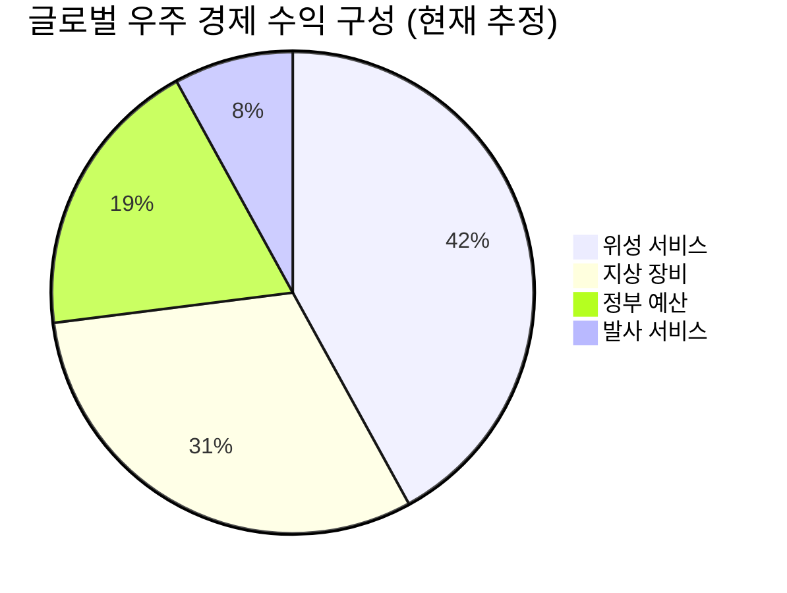

# 📊 모닝 브리핑 — 2026년 4월 7일 (화)

> **🟡 조심스러운 Risk-On** — 고용 호조·중동 완화 기대 vs. 이란 긴장 재고조의 줄다리기
> - **매크로**: 실시간 데이터 참조 (유가 상승 압력 지속, 금리 고점 논란 재점화)
> - **리스크**: VIX 실시간 참조 | 중동 지정학 불확실성 + 유가 변동성 확대
> - **시그널**: ① 반도체 대형주 코스피 견인 ② SpaceX IPO 기밀 서류 제출 → 우주 경제 테마 부각

---

## 시장 스냅샷

### 주요 지수
| 지수 | 종가 | 등락 | 52주 위치 |
|------|------|------|----------|
| S&P 500 | 6,611.83 | +29.14 (+0.4%) | ▓▓▓▓▓▓▓▓░░ 82% (4,983–6,979) |
| 나스닥 | 21,996.34 | +117.16 (+0.5%) | ▓▓▓▓▓▓▓▓░░ 77% (15,268–23,958) |
| 다우존스 | 46,669.88 | +165.21 (+0.4%) | ▓▓▓▓▓▓▓░░░ 72% (37,646–50,188) |
| 코스피 | 5,377.30 | +143.25 (+2.7%) | ▓▓▓▓▓▓▓▓░░ 77% (2,294–6,307) |
| 코스닥 | 1,063.75 | +7.41 (+0.7%) | ▓▓▓▓▓▓▓▓░░ 77% (643–1,193) |
| 닛케이 225 | 53,123.49 | +660.22 (+1.3%) | ▓▓▓▓▓▓▓▓░░ 79% (31,137–58,850) |

### 매크로/원자재/크립토
| 항목 | 값 | 변동 | 52주 위치 |
|------|-----|------|----------|
| 미국 10Y | 4.34% | +0.02%p | ▓▓▓▓▓▓░░░░ 59% (4–5) |
| 미국 2Y | 3.62% | +0.02%p | ▓░░░░░░░░░ 15% (4–4) |
| DXY | 99.99 | -0.04 (-0.0%) | ▓▓▓▓▓░░░░░ 54% (96–103) |
| USD/KRW | 1,508.80 | -0.42 (-0.0%) | ▓▓▓▓▓▓▓▓▓▓ 96% (1,348–1,516) |
| USD/JPY | 159.61 | +0.12 (+0.1%) | ▓▓▓▓▓▓▓▓▓▓ 97% (141–160) |
| WTI 원유 | $112.96 | +1.3% | ▓▓▓▓▓▓▓▓▓▓ 100% (55–113) |
| 금 (Gold) | $4,687.60 | +0.8% | ▓▓▓▓▓▓▓░░░ 73% (2,951–5,318) |
| 은 (Silver) | $73.21 | +0.7% | ▓▓▓▓▓░░░░░ 51% (30–115) |
| BTC | $69,343 | +0.5% | ▓░░░░░░░░░ 11% (62,702–124,753) |
| VIX | 24.17 | +0.30 (+1.3%) | ▓▓▓░░░░░░░ 28% (13–52) |
| 10Y-2Y 스프레드 | 0.71%p | +0.01%p | — |

---
⚠️ 시장 스냅샷은 시스템에 의해 자동 삽입됩니다.

---

## 시장 센티먼트

  
🟢 Risk-On 42%

  
🟡 중립 35%

  
🔴 Risk-Off 23%

**핵심 판독**: 미국 3월 고용 지표가 예상을 크게 상회하며 경기 펀더멘털에 대한 신뢰를 강화했고, 중동 긴장이 일시적으로 완화될 수 있다는 기대감이 증시 상승을 견인했다. 그러나 트럼프의 이란 공격 경고 발언이 재차 나오면서 유가 상승 압력과 인플레이션 우려가 동시에 살아나는 복합 국면이다. 센티먼트는 Risk-On이지만 확신도가 낮은 '조심스러운 상승'으로, 변곡점에서 방향을 탐색하는 구간.

**변곡 촉매**:
- 🔴 **다운사이드**: 이란과의 군사적 충돌 현실화 → 유가 급등 + 글로벌 위험자산 급락
- 🟢 **업사이드**: 미-이란 외교 협상 재개 신호 → 유가 안정 + Risk-On 본격화

---

## 섹터별 센티먼트

| 섹터 | 센티먼트 | 한줄 평가 |
|------|---------|----------|
| 반도체/AI 인프라 | 🟢 강세 | 삼성전자 등 대형주 코스피 견인, HBM 수요 서사 유효 |
| 에너지/정유 | 🟢 강세 | 이란 분쟁 지속 → 유가 상승 압력 확대, 정유·에너지 섹터 수혜 |
| 우주/항공방산 | 🟢 강세 | SpaceX IPO 기밀 서류 제출로 우주 경제 투자 모멘텀 재점화 |
| 원자력/SMR | 🟡 중립 | AI 전력 수요 맞물린 장기 수혜 서사 유효, 단기 촉매 부재 |
| 헬스케어/의료 AI | 🟡 중립 | AI 헬스케어 혁신 가속, 국내 디지털 헬스케어법 입법 지연이 발목 |
| 암호화폐/디지털자산 | 🟡 혼조 | 중동 지정학에 극단적 민감, 휴전 기대↑ 폭등 → 트럼프 발언↑ 급락 |
| 코스닥/중소형 | 🔴 약세 | 코스피 강세 속 코스닥 하락, 선택적 자금 쏠림으로 중소형주 소외 |

---

## 오버나이트 핵심 이벤트

### 1. 트럼프 이란 공격 경고 — 중동 긴장 재고조

- **요약**: 트럼프 대통령이 이란에 대한 군사 공격 가능성을 경고했고, 이란은 휴전 제안을 거부했다. 중동 지정학 리스크가 단기 완화 기대에서 재긴장 국면으로 전환되었다.
- **So What**: 직접 효과로는 유가 상승 압력이 확대되며 에너지 관련 인플레이션 우려가 재점화된다. 2차 연쇄 효과로 JP모건 다이먼 CEO가 경고했듯, 공급망 재편과 시장 예상 이상의 고금리 장기화 시나리오가 힘을 얻을 수 있다. 연준의 금리 인하 기대를 더욱 억누르는 복합 요인으로 작용한다.
- **크로스 임팩트**: 에너지·정유 섹터 수혜, 항공·해운 비용 상승 리스크, 금·달러 강세 압력

### 2. 미국 3월 고용 지표 예상치 대폭 상회

- **요약**: 3월 비농업 고용 및 민간 고용 지표가 시장 예상치를 크게 상회하며 미국 노동 시장이 여전히 견조함을 입증했다.
- **So What**: 경기 연착륙 기대를 뒷받침하는 강력한 데이터로, 단기적으로는 증시 Risk-On 분위기를 지지한다. 그러나 역설적으로 연준의 금리 인하 시점을 더욱 늦추는 요인이 되어 성장주 밸류에이션에는 양날의 검으로 작용한다. "좋은 경제 지표 = 나쁜 금리 뉴스"의 딜레마가 반복된다.
- **크로스 임팩트**: 미 국채 금리 상승 압력, 달러 강세, 금리 민감 성장주 밸류에이션 압박

### 3. SpaceX, IPO 기밀 서류 제출 — 우주 경제 시대 개막 신호

- **요약**: SpaceX가 기업공개(IPO)를 위한 기밀 서류를 당국에 제출했다. 민간 우주 산업의 최대 플레이어가 공개 시장에 진입하는 역사적 출발점이 될 수 있다.
- **So What**: SpaceX IPO는 단순한 한 기업의 상장을 넘어 '우주 경제(Space Economy)'라는 새로운 자산군의 투자 유니버스를 공개 시장에 열어젖히는 사건이다. 위성 인터넷(스타링크), 발사 서비스, 심우주 탐사 등 연관 생태계 전반에 대한 투자자 관심과 밸류에이션 리레이팅 기대가 높아진다.
- **크로스 임팩트**: 위성통신, 항공우주 부품, 방산 전자, 관련 ETF 섹터 수혜 기대

---

## 오늘의 일정

| 시간(한국) | 이벤트 | 중요도 | 관련 섹터/종목 |
|-----------|--------|--------|--------------|
| 오늘 장중 | 삼성전자 임원·주요주주 특정증권 소유상황 보고서 공시 | ⭐⭐ | [[삼성전자]] |
| 이번 주 중 | 미-이란 외교 동향 (트럼프 발언 모니터링) | ⭐⭐⭐⭐ | 에너지·정유, 금, 달러 |
| 이번 주 중 | 미국 연준 인사 발언 일정 (고용 호조 이후 금리 경로 가이던스) | ⭐⭐⭐⭐ | [[채권]], 성장주 전반 |
| 이번 주 중 | SpaceX IPO 관련 추가 공시·언론 보도 | ⭐⭐⭐ | 우주항공·방산 ETF |

> [!warning] ⭐⭐⭐⭐ 미-이란 동향: 시나리오 분기
> - **협상 재개 신호**: 유가 하락 전환 → 인플레이션 우려 완화 → Risk-On 가속
> - **군사 충돌 현실화**: 유가 급등 + 글로벌 위험자산 급락 → 방어주·에너지·금으로 자금 이동
> - **현상 유지(교착)**: 변동성 구간 지속, 에너지 섹터 강세 유지

---

## 테마 시그널

> [!abstract] 오늘의 테마
> **우주 경제(Space Economy)의 금융화 — SpaceX IPO가 여는 새로운 자산군의 지평**
> 민간 우주 산업이 '테마'에서 '투자 가능한 자산군'으로 전환되는 구조적 변곡점을 분석한다.

### 왜 지금인가 — SpaceX IPO의 시의성

SpaceX가 IPO 기밀 서류를 제출했다는 소식은 단순한 기업 이벤트가 아니다. 이는 **지난 10년간 비공개 시장(Private Market)에만 존재하던 우주 경제가 공개 자본 시장으로 넘어오는 역사적 전환점**이다. 우주 산업은 그간 기관 VC와 국가 자본의 전유물이었다. 일반 투자자가 접근할 수 있는 수단은 보잉·록히드마틴 같은 레거시 방산주나 관련 ETF에 한정되었다.

SpaceX가 상장하면, 투자자들은 처음으로 **순수 민간 우주 인프라 회사에 직접 베팅**할 수 있게 된다.

---

### 우주 경제의 구조: 무엇이 돈이 되는가?

우주 경제는 단순히 "로켓 쏘는 사업"이 아니다. 아래와 같은 다층적 수익 구조로 이루어져 있다.

| 레이어 | 사업 내용 | 주요 플레이어 | 수익 모델 |
|--------|---------|------------|---------|
| **발사 서비스** | 위성·화물·인원 수송 | SpaceX, Rocket Lab | 건당 계약 + 재사용으로 원가 혁신 |
| **위성 인터넷** | 저궤도 위성 브로드밴드 | Starlink, OneWeb | 구독 SaaS 모델 (반복 수익) |
| **위성 데이터** | 지구 관측, 기상, 정보 수집 | Planet Labs, Maxar | B2G(정부) + B2B 데이터 구독 |
| **우주 제조/채굴** | 희귀 자원, 우주 스테이션 | 장기 시나리오 | 아직 수익화 미실현 |
| **군사·안보** | 통신 위성, 정찰, 미사일 방어 | 방산 대형주 | 정부 예산 기반 안정 수익 |

핵심은 스타링크(Starlink)다. SpaceX 기업가치의 상당 부분은 로켓 사업이 아니라, 수천 개의 저궤도 위성으로 구성된 광대역 인터넷 서비스인 스타링크의 SaaS형 반복 수익 구조에서 나온다. 이는 일반 통신·인터넷 회사의 밸류에이션 프레임이 적용된다.

---

### 민간 우주 산업의 S-커브: 지금 어디쯤 와 있나?

기술 산업의 채택 곡선(S-Curve) 관점에서 우주 경제를 보면, 현재는 **초기 성장 단계의 후반부**에 해당한다. 발사 비용 혁명(재사용 로켓)이 이미 완료되었고, 이제 그 위에 서비스 레이어가 쌓이는 단계다.

> [!tip] 핵심 인사이트
> 우주 경제의 가장 큰 수익원은 이미 "위성 서비스"와 "지상 장비"다. 로켓 발사 자체는 전체 파이의 일부에 불과하다. 즉, SpaceX의 진짜 가치는 스타링크라는 **반복 구독 수익 기반의 위성 ISP(인터넷 서비스 공급자)**에 있다. 이를 어떤 밸류에이션 프레임으로 볼 것인가가 IPO 시 핵심 논쟁이 될 것이다.

---

### 투자 함의: 무엇이 달라지는가?

**1. 새로운 비교군(Comps)의 등장**
SpaceX가 상장하면 시장은 기존 방산주와 달리 **"통신회사 + 테크회사 + 방산회사"의 하이브리드 밸류에이션**을 적용해야 한다. 이 과정에서 기존 위성통신주, 발사체 관련주, 우주 인프라 ETF 전반에 리레이팅 이벤트가 발생할 수 있다.

**2. 한국 시장에서의 연결 고리**
한국 기업 중 우주 경제와 연결된 밸류체인은 생각보다 깊다:

| 밸류체인 | 국내 관련 분야 | 비고 |
|---------|-------------|------|
| 위성 부품·소재 | 항공우주 부품 제조사 | 위성체 경량화 소재 |
| 지상 장비·안테나 | 통신장비 제조사 | 스타링크 단말 연동 |
| 위성 데이터 활용 | 국내 지리정보, 농업 AI | B2B 데이터 수요 |
| 발사 서비스 | 한국형발사체(누리호) 후속 | 정부 주도, 장기 시나리오 |

**3. 리스크 요인**
- SpaceX IPO는 기밀 서류 제출 단계로, 실제 상장까지 **수개월~1년 이상** 소요될 수 있음
- 일론 머스크의 정치적 리스크(DOGE 활동, 트럼프와의 관계)가 상장 프리미엄을 디스카운트할 수 있음
- 우주 산업의 재무 수치가 공개되면 기대치와 괴리가 나타날 가능성

> [!warning] 리스크 경고
> "SpaceX IPO 기대감" 자체가 테마로 주목받는 지금이 가장 위험한 구간일 수 있다. 실제 상장 전까지 기대감으로 올라간 관련주는, 구체적 수치(매출, 이익, 부채)가 공개되는 순간 급격한 현실 조정을 겪는 경우가 많다. 비공개 기업의 IPO 전 투자는 항상 '정보 비대칭'의 불리한 쪽에 서있다는 점을 기억해야 한다.

---

### 모니터링 포인트

- SpaceX S-1 서류 공개 시점 (재무 수치 최초 공개)
- 스타링크 구독자 수 및 ARPU(가입자당 평균 수익) 공시
- NASA 아르테미스 프로그램 예산 확보 여부 (정부 계약 수익 가시성)
- 중국 우주 굴기 대응을 위한 미국 정부의 민간 우주 지원 정책

---

## 대가의 시선

> "지금 이란과의 전쟁이 발생하면 유가, 원자재 가격, 인플레이션이 급등할 수 있고, 시장이 예상하는 것보다 금리가 훨씬 높아질 수 있다. 공급망은 다시 한번 재편될 것이다."
> — **제이미 다이먼 (Jamie Dimon)**, JP모건 CEO (Gemini 종합 데이터 인용, 2026년 4월 7일 기준 최근 발언)

**맥락**: 미-이란 긴장이 고조되는 국면에서 다이먼이 지정학적 리스크가 실물 경제와 금융 시장에 미칠 파급 효과에 대해 경고한 발언이다. 고용 호조로 시장이 낙관론에 기울어진 바로 그 시점에 나온 역방향 경고라는 점에서 주목할 만하다.

**투자 함의**: 다이먼의 경고는 단순한 지정학 우려가 아니다. "시장 예상보다 높은 금리"라는 표현은, 현재 시장이 가격에 반영한 금리 인하 기대치가 지나치게 낙관적일 수 있음을 시사한다. 에너지 가격 충격이 인플레이션 재가속을 촉발하면, 연준은 인하는커녕 추가 인상 압력을 받을 수 있다. 이 시나리오에서 가장 직격탄을 맞는 자산은 장기 채권과 고밸류에이션 성장주다.

---

## 투자 레슨

> [!abstract] 오늘의 레슨
> **"좋은 회사와 좋은 주식은 다르다" — IPO 시장의 '정보 비대칭'과 Winner's Curse(승자의 저주)**

### 왜 똑똑한 투자자가 IPO에서 돈을 잃는가

IPO(기업공개)는 직관적으로 흥미로운 투자처럼 보인다. 혁신적인 기업이 처음으로 공개 시장에 나온다. SpaceX, Airbnb, Uber — 이름만 들어도 설레는 기업들이다. 그런데 학술 연구와 실증 데이터는 일관된 결론을 보여준다: **개인 투자자는 IPO에서 체계적으로 손해를 본다.**

왜 그럴까? 이것은 투자자의 실력 문제가 아니다. **구조적인 정보 비대칭 문제**다.

---

### 핵심 개념: Winner's Curse (승자의 저주)

노벨 경제학상 수상자 윌리엄 빅클리(William Vickrey)가 경매 이론에서 설명한 Winner's Curse는 IPO 시장에 그대로 적용된다.

공개 경매에서 낙찰자는 대부분 그 자산의 '진짜 가치'를 가장 크게 과대평가한 사람이다. IPO도 마찬가지다. 배정을 '받은' 투자자는, 더 많은 정보를 가진 기관 투자자가 원하지 않아서 개인에게 흘러온 물량일 가능성이 높다.

**IPO 시장의 정보 구조**:

| 참여자 | 보유 정보 | 배정 우선순위 | 결과 |
|--------|---------|------------|------|
| 주관 증권사 | 기업 내부 정보 풀 접근 가능 | 최우선 | 좋은 딜 → 기관에 우선 배정 |
| 기관 투자자 | 로드쇼 참여, 경영진 직접 접촉 | 우선 | 나쁜 딜은 참여 거부 가능 |
| **개인 투자자** | **공개된 S-1만 열람 가능** | **잔여 물량** | **기관이 거른 물량이 배정됨** |

이 구조를 "**역선택(Adverse Selection)**"이라고 부른다. 개인이 IPO 청약에서 원하는 만큼 배정받을수록, 역설적으로 그것은 그 딜이 매력적이지 않다는 신호일 수 있다.

---

### 역사적 데이터: IPO의 두 얼굴

**단기 수익률 (첫날 팝)**과 **장기 수익률**은 극명하게 갈린다:

| 구분 | 현상 | 메커니즘 |
|------|------|---------|
| **단기 (상장 첫날)** | 평균 20-30% 상승 | 주관사가 의도적으로 저가 설정 → 기관 투자자 보상 |
| **중기 (6개월~1년)** | 시장 대비 언더퍼폼 경향 | 락업 해제 + 내부자 매도 + 초기 기대치 소멸 |
| **장기 (3~5년)** | 시장 평균보다 낮은 수익률 | 생존자 편향 제거 시 더욱 뚜렷 |

> [!note] 유명 사례 비교
> - **Uber (2019 IPO)**: 상장 첫날 하락, 이후 2년간 시장 언더퍼폼
> - **Airbnb (2020 IPO)**: 첫날 +112% → 이후 급격히 하락하며 IPO가 최고점
> - **Arm Holdings (2023 IPO)**: 기관이 원한 딜 → 이후 AI 수혜로 강세 (예외적 케이스)
> - **WeWork (2019 IPO 철회)**: S-1 공개 후 진짜 재무 수치 드러나며 IPO 자체 무산

---

### SpaceX IPO에 이 프레임 적용하기

오늘 SpaceX의 IPO 기밀 서류 제출 소식이 나왔다. 설레는 뉴스다. 그런데 이 레슨을 알고 있다면, 다음과 같이 체계적으로 생각할 수 있다:

  
🟢 흥분 요인 35%

  
🟡 검증 필요 40%

  
🔴 구조적 위험 25%

**체크리스트 — SpaceX IPO 전에 확인해야 할 것들**:

- [ ] **스타링크 실제 매출·EBITDA**: 수백만 구독자의 ARPU와 수익성이 기대에 부합하는가?
- [ ] **부채 구조**: 발사체 개발 및 위성 생산에 투입된 자본의 규모와 상환 구조
- [ ] **일론 머스크 지배력**: 이중주식 구조 가능성, 경영 결정의 투명성
- [ ] **정부 계약 의존도**: NASA·국방부 계약의 갱신 가능성과 집중 리스크
- [ ] **경쟁사 현황**: Amazon Kuiper, OneWeb 등의 추격 속도와 시장 점유율 영향

> [!tip] 핵심 인사이트
> IPO 기밀 서류 제출은 프로세스의 **시작**이다. S-1이 공개되어 실제 재무 수치가 드러나는 순간이 진짜 분석의 시작점이다. 지금 SpaceX 관련 테마주에 올라타는 것과, S-1을 읽고 판단하는 것은 **투기와 투자의 차이**다.

---

### 오늘 실천 방법

1. **SpaceX IPO 기대감으로 오른 관련 테마주를 지금 추격 매수하지 않는다.** S-1 공개 후 실제 숫자를 보고 판단하는 것이 구조적으로 유리한 전략이다.
2. **과거 자신의 IPO 투자 이력을 복기해보자.** 청약 경쟁률이 높았던 IPO와 낮았던 IPO 중, 실제로 수익이 난 쪽은 어느 쪽이었는가? — 아마도 인기 없던 쪽이 더 나은 결과를 냈을 것이다. 이것이 역선택 효과의 현실이다.

---

## 오늘 하나만 기억한다면

> [!verdict] 오늘 하나만 기억한다면
> **"SpaceX IPO 기대감이 최고조일 때가 가장 냉정해야 할 순간이다 — 좋은 기업이 곧 좋은 투자인 건 아니며, 정보가 적을 때 흥분하는 것이 IPO 투자자의 가장 흔한 실수다."**