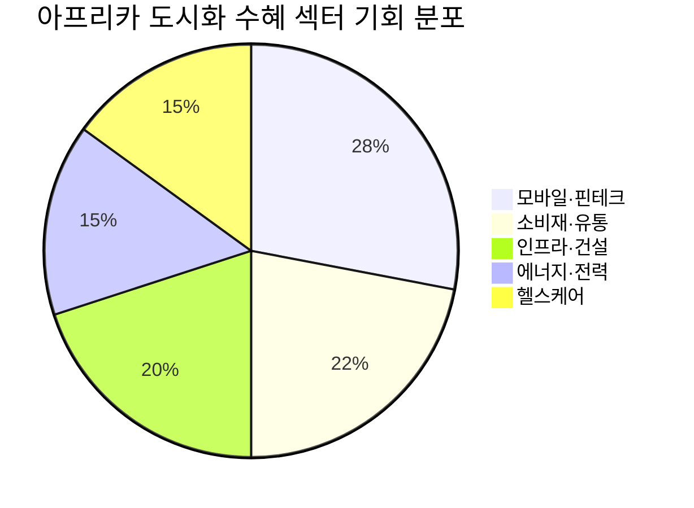

# 📊 모닝 브리핑 — 2026년 4월 13일 (월)

> **🟡 Risk-Off 우세 혼조** — 지정학 불확실성 속 기술주 강세가 견인하는 양방향 시장
> - **매크로**: 중동 휴전 협상 진행 중, 3월 CPI 헤드라인 가속·근원 안정화 혼조
> - **리스크**: 나스닥 100 6주 최고치 vs 소비자 심리 기록적 위축 · 고물가 지속
> - **시그널**: TSMC 기록적 분기 매출 → AI 칩 수요 실질 확인 / 한은 금리 동결 후 코스피 반등

---

## 시장 스냅샷

### 주요 지수
| 지수 | 종가 | 등락 | 52주 위치 |
|------|------|------|----------|
| S&P 500 | 6,816.89 | -7.77 (-0.1%) | ██████████████████▎░ 91% (5,158–6,979) |
| 나스닥 | 22,902.89 | +80.47 (+0.4%) | █████████████████▍░░ 87% (15,871–23,958) |
| 다우존스 | 47,916.57 | -269.23 (-0.6%) | ████████████████▎░░░ 81% (38,170–50,188) |
| 코스피 | 5,858.87 | +80.86 (+1.4%) | █████████████████▋░░ 88% (2,433–6,307) |
| 코스닥 | 1,093.63 | +17.63 (+1.6%) | ████████████████▏░░░ 81% (682–1,193) |
| 닛케이 225 | 56,924.11 | +1028.79 (+1.8%) | ██████████████████▌░ 92% (33,586–58,850) |

### 매크로/원자재/크립토
| 항목 | 값 | 변동 | 52주 위치 |
|------|-----|------|----------|
| 미국 10Y | 4.32% | +0.02%p | ███████████▍░░░░░░░░ 57% (4–5) |
| 미국 2Y | 3.59% | +0.00%p | ██▎░░░░░░░░░░░░░░░░░ 11% (4–4) |
| DXY | 99.13 | +0.48 (+0.5%) | ██████████▌░░░░░░░░░ 52% (96–102) |
| USD/KRW | 1,483.09 | +9.81 (+0.7%) | ████████████████░░░░ 80% (1,348–1,516) |
| USD/JPY | 159.83 | +0.72 (+0.5%) | ███████████████████▋ 98% (141–160) |
| WTI 원유 | $104.45 | +8.2% | █████████████████░░░ 85% (55–113) |
| 금 (Gold) | $4,685.80 | -1.6% | ██████████████▏░░░░░ 70% (3,181–5,318) |
| 은 (Silver) | $73.05 | -4.3% | █████████▉░░░░░░░░░░ 49% (32–115) |
| BTC | $70,646 | -3.3% | ██▌░░░░░░░░░░░░░░░░░ 13% (62,702–124,753) |
| VIX | 19.23 | -0.26 (-1.3%) | ████▎░░░░░░░░░░░░░░░ 21% (13–41) |
| 10Y-2Y 스프레드 | 0.72%p | +0.02%p | — |

---
⚠️ 시장 스냅샷은 시스템에 의해 자동 삽입됩니다.

---

## 시장 센티먼트

🔴 Risk-Off 55%

🟡 혼조 30%

🟢 On 15%

> [!abstract] 핵심 판독
> 나스닥 100이 6주 최고치를 기록하며 기술주는 선전하고 있으나, 이는 AI 수요 내러티브에 기댄 섹터 집중 현상에 가깝다. 헤드라인 CPI 가속 + 소비자 심리 위축 + 중동 협상 불확실성이라는 삼중 역풍 속에서 광범위한 Risk-On 전환보다는 **섹터 선별적 강세**가 지배적인 국면이다.

**변곡 촉매**
- 🔴 **다운**: 미·이란 협상 결렬 → 유가 급등 → 인플레이션 재가속 우려 강화
- 🟢 **업**: 근원 인플레이션 연속 둔화 확인 → 연준 금리 인하 기대 복원

---

## 섹터별 센티먼트

| 섹터 | 센티먼트 | 한줄 평가 |
|------|---------|----------|
| 반도체·AI 칩 | 🟢 강세 | TSMC 기록적 분기 매출로 AI 수요 실질 확인, 단기 과열 경계 필요 |
| 기술주 (나스닥 중심) | 🟢 강세 | 나스닥 100 6주 최고치, AI 테마 집중 수급이 지수 견인 |
| 에너지 | 🟡 혼조 | 중동 휴전 협상 진행 중 유가 변동성 확대, 방향성 결정 전 관망 |
| 방산·지정학 | 🟡 혼조 | 중동 불확실성 지속으로 방산 수요 구조적 유지, 협상 결과에 단기 민감 |
| 국내 소비재 | 🟡 혼조 | 한은 금리 동결로 가계 부담 완화 기대, 그러나 글로벌 경기 둔화 압박 상존 |
| 금·귀금속 | 🟢 긍정 | 지정학 리스크 + 포트폴리오 다각화 수요 → 대체자산 선호 지속 |
| 한국 증시 (코스피·코스닥) | 🟡 혼조 | 한은 동결 후 반등 흐름, 글로벌 매크로 불확실성에 상승 폭 제한 |

---

## 오버나이트 핵심 이벤트

### 1. TSMC, AI 칩 수요에 힘입어 기록적 분기 매출 달성

- **요약**: TSMC가 AI 관련 칩 수요 급증을 배경으로 역대 최고 수준의 분기 매출을 기록했다고 발표했다.
- **So What**: 그동안 "AI 수요가 실제 매출로 이어지는가"에 대한 시장의 의구심을 TSMC의 숫자가 직접 반박한 셈이다. 엔비디아·AMD 등 팹리스 기업의 주문이 실제 생산·출하로 연결되고 있음을 확인하며 반도체 업사이클 논거가 강화된다. 다만 단일 고객(엔비디아) 집중도가 높은 구조는 수요 변동 시 리스크 요인으로 남는다.
- **크로스 임팩트**: [[반도체]], [[HBM]], [[AI 인프라]], [[나스닥 기술주]] 전반 긍정

### 2. 미·이란 2주 휴전 합의 — 협상 진전 불확실성 지속

- **요약**: 미국과 이란 간 2주 휴전 합의로 주 초반 시장이 강세를 보였으나, 이후 협상 진전에 대한 불확실성으로 주 후반에는 혼조세로 전환됐다.
- **So What**: 유가는 협상 타결 기대와 결렬 리스크 사이에서 양방향 변동성이 확대되고 있다. JP모건 CEO가 유가 및 원자재 가격 충격 가능성을 경고한 점은, 시장이 "낙관적 시나리오"를 너무 빠르게 가격에 반영하지 않도록 경계해야 함을 시사한다. 휴전이 깨지면 에너지 가격 급등 → 헤드라인 인플레이션 재가속 → 금리 인하 기대 후퇴의 연쇄 반응이 가능하다.
- **크로스 임팩트**: [[에너지]], [[원유]], [[인플레이션 연동 자산]], [[방산]] 직접 영향

### 3. 3월 미국 CPI — 헤드라인 가속, 근원 안도

- **요약**: 3월 CPI는 에너지 가격 급등으로 헤드라인 인플레이션이 가속화되었으나, 근원 CPI(에너지·식품 제외)는 예상보다 낮은 상승률을 기록해 시장에 부분적 안도감을 제공했다.
- **So What**: 연준 입장에서는 "헤드라인은 걱정, 근원은 진정"이라는 엇갈린 신호다. 단기적으로 금리 인하 속도를 제한하는 요인이 되지만, 근원 인플레이션의 안정화 추세가 이어진다면 하반기 인하 경로가 살아있다. 시장은 "에너지가 빠지면 헤드라인도 안정된다"는 베이스 시나리오를 유지하며 기술주 매수를 지속 중이다.
- **크로스 임팩트**: [[채권 (미국 국채)]], [[달러]], [[금리 민감 성장주]], [[배당주]] 전반

### 4. 한국은행 기준금리 동결 — 코스피·코스닥 반등

- **요약**: 한국은행이 4월 10일 기준금리를 동결하였으며, 이후 코스피와 코스닥이 상승 흐름을 보였다.
- **So What**: 동결은 시장 컨센서스에 부합하며 추가 충격은 없었다. 다만 금리 인하 기대가 후퇴한 상황에서 동결은 국내 성장 동력이 여전히 제한적임을 방증한다. 미-이란 휴전 소식과 맞물린 외국인 수급 개선이 단기 반등을 이끌었으나, 글로벌 불확실성이 해소되지 않은 상태에서 지속성은 불확실하다.
- **크로스 임팩트**: [[코스피]], [[코스닥]], [[국내 리츠]], [[금리 민감 중소형주]]

---

## 오늘의 일정

| 시간(한국) | 이벤트 | 중요도 | 관련 자산 |
|-----------|--------|--------|----------|
| 장중 | 미·이란 협상 뉴스 플로우 모니터링 | ⭐⭐⭐⭐ | [[에너지]], [[원유]], [[금]] |
| 이번 주 중 | 미국 주요 빅테크·반도체 실적 발표 시즌 본격화 | ⭐⭐⭐⭐⭐ | [[나스닥]], [[반도체]], [[AI 인프라]] |
| 이번 주 중 | 미국 연준 위원 발언 스케줄 (인플레이션 판단) | ⭐⭐⭐⭐ | [[미국 국채]], [[달러]], [[성장주]] |
| 이번 주 중 | 한국 수출입 데이터 및 무역수지 발표 | ⭐⭐⭐ | [[코스피]], [[반도체 수출주]] |

> [!warning] ⭐⭐⭐⭐⭐ 이번 주 빅테크·반도체 실적 — 시나리오 분기
> - **강세 시나리오**: AI 수요 가이던스 상향 → TSMC 매출 확인과 맞물려 반도체 섹터 추가 랠리
> - **약세 시나리오**: 실적 미스 또는 가이던스 하향 → "AI 버블" 내러티브 재부상, 나스닥 급락
> - **기준 시나리오**: 실적 인라인 + 보수적 가이던스 → 단기 차익실현 후 방향 재탐색

---

## 테마 시그널

> [!abstract] 오늘의 테마
> **"아프리카 도시화 — 세계에서 가장 빠르게 열리는 미개척 소비 시장"**
> 연 3.5% 도시화율, 2050년 도시 인구 두 배. 숫자 뒤에 숨어있는 투자 기회와 함정을 해부한다.

### 왜 지금인가?

중동 지정학 리스크가 부각되면서 글로벌 자본이 대체 투자처를 탐색하는 흐름이 강해지고 있다. 동시에 BlueBay Asset Management는 신흥 시장이 2035년까지 세계 경제 성장의 약 65%를 차지할 것으로 전망한다. 그 안에서 가장 과소평가된 지역이 아프리카다. 선진국 자산이 밸류에이션 고점에 근접하고, 중국 성장 둔화로 아시아 이머징 수익률이 압박받는 지금, 아프리카는 구조적 성장의 '마지막 프런티어'로 주목받기 시작했다.

### 구조적 분석 — 왜 아프리카 도시화가 다른가

**도시화 = 소비 폭발의 알고리즘**

도시로 이주한 인구는 농촌 거주자 대비 소득이 평균 2~3배 높고, 금융 서비스·통신·소비재 지출이 기하급수적으로 늘어난다. 아프리카는 이 사이클의 초입에 있다.

| 지표 | 아프리카 | 아시아 (1980년대 기준) | 비고 |
|------|---------|---------------------|------|
| 연평균 도시화율 | 3.5% | ~3.0% | 아프리카가 더 빠름 |
| 2050년 예상 도시 인구 비중 | 현재의 2배 | — | 세계 최대 규모로 성장 |
| 중위 연령 | ~19세 | 당시 ~22세 | 인구 배당 효과 극대 |
| 인터넷 침투율 | 40% 미만 | — | 폭발적 성장 여지 |

아시아 신흥국이 1980~2000년대에 걸쳐 도시화 → 제조업 → 소비 성장 → 자산 가격 상승의 사이클을 밟았다면, 아프리카는 지금 그 출발선에 서있다. 다만 결정적 차이가 하나 있다.

> [!tip] 아프리카 도시화의 핵심 차별점 — "레이프로그(Leapfrog) 효과"
> 아프리카는 **유선 인터넷 → 모바일 인터넷**, **은행 계좌 → 모바일 머니(M-Pesa)**처럼 중간 단계를 건너뛴다. 이는 기존 선진국 인프라 기업이 아닌, 모바일·핀테크·디지털 플랫폼 기업이 가장 큰 수혜를 입는 구조를 만든다.

### 섹터별 투자 기회 지도

**1. 모바일 금융 (최대 수혜)**
케냐의 M-Pesa가 증명했듯, 은행 계좌 없이도 스마트폰 하나로 송금·결제·대출이 가능한 생태계가 대륙 전체로 확산 중이다. 전통 금융이 진입하지 못한 공백을 핀테크가 선점하고 있다.

**2. 소비재·소매 유통**
도시 중산층 형성은 브랜드 소비재, 현대적 유통 채널(슈퍼마켓, e-커머스)에 대한 수요를 만든다. 아프리카 로컬 소비재 기업과 글로벌 FMCG(생활용품) 기업의 현지화 전략이 핵심이다.

**3. 인프라·건설**
2050년까지 도시 인구가 두 배로 늘어나면 주택, 도로, 전력망, 수도가 모두 부족해진다. 중국 자본이 이 공간을 빠르게 채워왔으나, 서방 자본의 대안 인프라 투자(미국 PGII, EU 글로벌 게이트웨이)가 경쟁적으로 진입 중이다.

**4. 에너지 — 재생에너지 직행**
아프리카는 석탄→화력발전을 거치지 않고 태양광·풍력으로 직행할 가능성이 높다. 일조량 세계 최고 수준의 사하라 이남 지역은 태양광 발전 비용 경쟁력이 극대화되는 구조다.

### 투자 함의 — 어떻게 접근할 것인가

> [!warning] 프런티어 마켓의 함정 — 기회와 위험은 한 몸
> - **통화 리스크**: 아프리카 통화는 달러 대비 변동성이 크다. USD 표시 자산 또는 헤지 전략 필수.
> - **유동성 리스크**: 현지 주식 시장의 거래량이 적어 진입·탈출이 어렵다.
> - **정치·거버넌스 리스크**: 정권 교체, 자원 국유화, 부패 지수가 여전히 투자 장벽.
> - **인프라 과부하**: 빠른 도시화가 오히려 도시 기능 마비(교통, 위생)를 야기할 수 있다.

**실용적 접근 3단계**

| 접근 방식 | 수단 | 리스크 수준 |
|----------|------|-----------|
| 간접 노출 | 아프리카 매출 비중 높은 글로벌 FMCG·통신주 | 🟡 중간 |
| ETF 활용 | 아프리카 프런티어 ETF (예: AFK 등) | 🟡 중간 |
| 직접 투자 | 현지 상장 주식, 사모펀드 | 🔴 높음 |

가장 현실적인 진입로는 **글로벌 기업의 아프리카 노출도를 레버리지로 활용하는 것**이다. 유니레버, 네슬레, MTN그룹 등은 아프리카 사업 비중이 크면서도 선진국 거래소에 상장되어 유동성 리스크가 낮다.

### 모니터링 포인트

- **나이지리아·케냐·남아공** 3개국 GDP 성장률 — 아프리카 경제의 바로미터
- **모바일 머니 거래량** — 중산층 형성 속도의 선행 지표
- **중국의 아프리카 인프라 투자 동향** — 서방 자본과의 경쟁 구도 변화
- **달러 강세/약세 사이클** — 달러 약세 시 아프리카 자산 상대적 매력 상승

---

## 대가의 시선

> "The biggest investing errors come not from factors that are informational or analytical, but from those that are psychological."
> ("가장 큰 투자 실수는 정보나 분석의 부족이 아니라, 심리적 요인에서 비롯된다.")
> — **Howard Marks**, Oaktree Capital 공동 창업자 [클래식]

**맥락**: 마크스가 반복적으로 강조해온 투자 철학의 핵심으로, 시장이 혼조세를 보이며 투자자들이 "AI 강세" vs "지정학 리스크" 사이에서 방향을 잡기 어려운 시기에 특히 유효하다.

**투자 함의**: 지금처럼 나스닥은 6주 최고치인데 소비자 심리는 역대 최저, 헤드라인 CPI는 오르는데 근원은 안정되는 **엇갈린 신호의 시장**에서 가장 큰 실수는 특정 내러티브에 과도하게 확신을 갖는 것이다. 데이터가 일관되지 않을 때일수록, 포지션 크기를 줄이고 "내가 틀릴 수 있다"는 가능성을 포트폴리오에 내장하는 심리적 겸손이 알파의 원천이 된다.

---

## 투자 레슨

> [!abstract] 오늘의 레슨
> **"평균회귀(Mean Reversion) — 시장은 왜 항상 '제자리'로 돌아오려 하는가"**
> 가장 강력하면서도 가장 오해받는 투자 원리. 오늘 나스닥 6주 최고치가 보여주는 바로 그 역학.

### 평균회귀란 무엇인가 — 본질부터

평균회귀는 단순히 "오르면 내려온다"는 격언이 아니다. 이것은 **경제 시스템이 가진 자기교정 메커니즘(self-correcting mechanism)**이다. 초과 이익은 경쟁자를 끌어들여 마진을 정상화시키고, 과도하게 오른 밸류에이션은 자본 배분을 왜곡해 결국 수정을 유발한다. 물리학의 엔트로피처럼, 시장도 극단에서는 평균을 향해 인력이 작동한다.

핵심은 **"무엇으로 회귀하는가"**다. 단순 주가 평균이 아니라, **펀더멘털이 정당화하는 적정 가치(fair value)**로 회귀한다. 따라서 평균회귀 투자는 결국 '적정가치 추정'이 전부다.

### 역사적 사례 — 숫자로 보는 평균회귀

**케이스 1: 닷컴 버블 (1999~2002)**

| 구분 | 피크 (2000년 3월) | 저점 (2002년 10월) | 회귀 목표 |
|------|-----------------|-----------------|----------|
| 나스닥 PER | ~200배 | ~20배 | 역사적 평균 ~25배 |
| 하락폭 | — | -78% | 밸류에이션 정상화 |
| 회귀 기간 | — | 약 2.5년 | — |

버블의 핵심은 "이번엔 다르다(This time is different)"는 내러티브였다. 인터넷이 세상을 바꾼다는 명제는 **옳았지만**, 밸류에이션이 그 변화를 수백 년 미리 반영한 것이 문제였다. 기술은 평균을 바꾸지 않았고, 주가만 일시적으로 평균에서 이탈했다가 폭력적으로 회귀했다.

**케이스 2: 워런 버핏 지표 (Buffett Indicator)**

버핏이 주목한 미국 주식 시장 시가총액/GDP 비율은 역사적으로 100% 근방이 '평균'이었다. 닷컴 버블 때 150%를 돌파했고, 2021년에는 200%를 넘었다. 이 지표가 높을수록 향후 10년 수익률이 낮아지는 통계적 패턴이 반복됐다.

> [!tip] 핵심 통찰 — 평균회귀는 "언제"가 아니라 "얼마나"의 문제
> 평균회귀가 실패하는 이유는 **타이밍을 예측하려 하기 때문**이다. 닷컴 버블도 1997년부터 "비싸다"는 분석이 넘쳤지만 2000년까지 3년을 더 올랐다. 올바른 접근은 "언제 떨어질 것인가"를 예측하는 게 아니라, "현재 밸류에이션 수준에서 기대수익률이 얼마인가"를 계산하는 것이다.

### 평균회귀가 작동하지 않는 경우 — 함정 주의

**"영구적 평균 변화(Permanent Shift in Mean)"** — 가장 위험한 함정

일부 자산은 진짜로 평균이 변한다. 예를 들어 인터넷 플랫폼 기업의 ROIC(투하자본수익률)는 전통 제조업 대비 구조적으로 높다. 이 경우 과거 평균 PER로 "저평가/고평가"를 판단하면 오류가 생긴다. 구글, 아마존이 "비싸다"고 팔았던 투자자들은 10년간 엄청난 기회비용을 치렀다.

**평균회귀 적용 체크리스트**:

| 질문 | 회귀 가능성 높음 | 회귀 가능성 낮음 |
|------|---------------|---------------|
| 비즈니스 모델이 변했는가? | ❌ 동일 | ✅ 구조적 변화 |
| 경쟁 구도가 변했는가? | ❌ 동일 | ✅ 해자 강화 |
| 이익의 질이 변했는가? | ❌ 일회성 이익 | ✅ 구조적 마진 개선 |
| 시장 내러티브가 과도한가? | ✅ 투기적 흥분 | ❌ 이익 성장 반영 |

### 오늘 시장 적용 — 나스닥 6주 최고치가 던지는 질문

나스닥 100이 6주 최고치를 기록한 지금, 평균회귀 렌즈로 보면 두 가지 질문이 생긴다.

**Q1. TSMC 매출 급증이 AI 칩의 "새로운 평균"을 정당화하는가?**
TSMC의 기록적 매출은 AI 수요가 실제 주문으로 이어지고 있음을 확인했다. 이는 "AI는 단순 내러티브"라는 의구심을 줄여주며 **반도체 업사이클의 지속 가능성 논거**를 강화한다. 그러나 AI 인프라 투자가 언제 수요 포화(demand saturation)에 도달하는지는 여전히 미지수다.

**Q2. 소비자 심리 기록적 위축 vs 주가 반등 — 어느 쪽이 평균에서 이탈해 있는가?**
역사적으로 소비자 심리와 주가는 방향이 맞지 않는 시기가 생기지만, 결국 수렴한다. 현재처럼 주가는 오르고 심리는 역대 최저를 기록 중이라면, **둘 중 하나가 틀린 것**이다. 주가가 선행지표로서 소비 회복을 선반영하고 있거나, 아니면 주가가 과도하게 낙관적인 것이다.

🟢 주가 선행 (회복 선반영) 40%

🔴 주가 과낙관 (회귀 위험) 60%

역사적 빈도로 보면 소비자 심리가 이 정도 위축된 상황에서 주가가 지속 상승한 경우보다, 결국 주가가 심리 쪽으로 수렴(하락)한 경우가 더 많았다.

### 오늘 실천 방법

현재 보유 중인 기술주·성장주의 밸류에이션이 역사적 평균 대비 얼마나 이탈해 있는지 확인하고, "이 프리미엄이 구조적 변화로 정당화되는가, 아니면 내러티브 흥분인가"를 스스로 물어볼 것. 확신이 없다면 포지션의 일부를 평균회귀 가능성에 대한 헤지로 활용하는 것이 합리적이다.

---

## 오늘 하나만 기억한다면

> [!verdict] 오늘 하나만 기억한다면
> **"AI 수요는 TSMC 숫자로 확인됐지만, 나스닥 6주 최고치와 소비자 심리 역대 최저의 간극 — 둘 중 하나는 반드시 평균으로 돌아온다."**