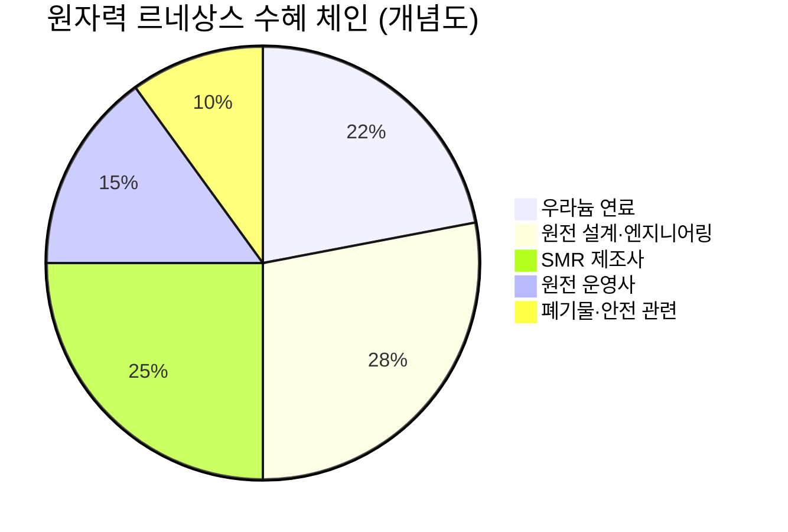

# 📊 모닝 브리핑 — 2026년 4월 14일 (화)

> **🟢 Risk-On (회복)** — 지정학 공포에서 외교 기대로 빠른 전환
> - **매크로**: CPI 연율 3.3% (에너지 급등 견인), 유가 변동성 확대 후 안정세
> - **리스크**: VIX 데이터 확인 필요 | 전주 S&P 500 +3.6%, 나스닥 +4.7%
> - **시그널**: ① 이란 협상 기대감 → 에너지 변동성 vs 위험자산 랠리 동시 진행 ② CPI 3.3% 확인 → 연준 금리 인하 경로 재점검 필요

---

## 시장 스냅샷

### 주요 지수
| 지수 | 종가 | 등락 | 52주 위치 |
|------|------|------|----------|
| S&P 500 | 6,886.24 | +69.35 (+1.0%) | ███████████████████░ 95% (5,158–6,979) |
| 나스닥 | 23,183.74 | +280.85 (+1.2%) | ██████████████████▏░ 90% (15,871–23,958) |
| 다우존스 | 48,218.25 | +301.68 (+0.6%) | ████████████████▊░░░ 84% (38,170–50,188) |
| 코스피 | 5,858.87 | +80.86 (+1.4%) | █████████████████▋░░ 88% (2,447–6,307) |
| 코스닥 | 1,093.63 | +17.63 (+1.6%) | ████████████████░░░░ 80% (699–1,193) |
| 닛케이 225 | 56,924.11 | +1028.79 (+1.8%) | ██████████████████▌░ 92% (33,920–58,850) |

### 매크로/원자재/크립토
| 항목 | 값 | 변동 | 52주 위치 |
|------|-----|------|----------|
| 미국 10Y | 4.30% | -0.02%p | ██████████▊░░░░░░░░░ 53% (4–5) |
| 미국 2Y | 3.60% | +0.01%p | ██▌░░░░░░░░░░░░░░░░░ 12% (4–4) |
| DXY | 98.37 | -0.28 (-0.3%) | ███████▊░░░░░░░░░░░░ 39% (96–102) |
| USD/KRW | 1,477.82 | +4.54 (+0.3%) | ███████████████▍░░░░ 77% (1,348–1,516) |
| USD/JPY | 159.39 | +0.28 (+0.2%) | ███████████████████▏ 96% (141–160) |
| WTI 원유 | $97.67 | +1.1% | ██████████████▊░░░░░ 74% (55–113) |
| 금 (Gold) | $4,769.90 | +0.2% | ██████████████▉░░░░░ 74% (3,181–5,318) |
| 은 (Silver) | $75.84 | -0.6% | ██████████▌░░░░░░░░░ 53% (32–115) |
| BTC | $74,237 | +4.9% | ███▊░░░░░░░░░░░░░░░░ 19% (62,702–124,753) |
| VIX | 19.12 | -0.11 (-0.6%) | █████▌░░░░░░░░░░░░░░ 28% (13–34) |
| 10Y-2Y 스프레드 | 0.69%p | -0.03%p | — |

---
## 시장 센티먼트

<div style="display:flex;border-radius:8px;overflow:hidden;margin:8px 0;font-size:0.85em"><div style="background:#4CAF50;width:62%;padding:6px 8px;color:white">🟢 Risk-On 62%</div><div style="background:#FF9800;width:25%;padding:6px 8px;color:white">🟡 중립 25%</div><div style="background:#F44336;width:13%;padding:6px 8px;color:white;white-space:nowrap">🔴 Risk-Off 13%</div></div>

**핵심 판독**: 장중 이란 핵협상 결렬 헤드라인으로 선물이 급락했지만, 트럼프 대통령의 "이란과 합의를 원한다"는 발언 하나로 분위기가 완전히 뒤집혔다. 이는 지금 시장이 **지정학 뉴스 드리블**에 극도로 민감하게 반응하고 있음을 보여주며, 한 발언이 수 퍼센트 급락/급등을 만들어내는 환경이다. 주간 단위로는 11월 이후 최고의 상승 주간을 기록하며 기술적 반등이 이어지고 있다.

**변곡 촉매**:
- 🔴 **다운사이드**: 이란 협상 재결렬 또는 호르무즈 봉쇄 현실화 → 유가 재급등 + CPI 추가 상승 압력 → 연준 인하 기대 완전 소멸
- 🟢 **업사이드**: 미-이란 공식 협상 테이블 착석 확인 → 지정학 프리미엄 해소 + 에너지 가격 안정 → Risk-On 모멘텀 가속

---

## 섹터별 센티먼트

| 섹터 | 센티먼트 | 한줄 평가 |
|------|---------|----------|
| 에너지 | 🟡 혼조 | 호르무즈 봉쇄 위협에 급등했으나 외교 발언 후 상승폭 축소, 지정학 뉴스 따라 양방향 변동성 |
| 반도체/AI | 🟢 강세 | 나스닥 주간 +4.7% 주도, 빅테크 AI 투자 확대 기조 지속 — 단기 과열 여부 점검 필요 |
| 원자력 에너지 | 🟢 강세 | MS·구글·아마존 SMR 계약 가속, AI 전력 수요 구조적 수혜 — 밸류에이션 레벨 경계 |
| 전기차(EV) | 🔴 약세 | 서방 OEM 관세 비용 증가 + 중국 EV 점유율 확대 이중 압박, Q1 판매 역성장 |
| 인플레이션 수혜 (에너지·소재) | 🟡 중립 | CPI 3.3% 확인으로 인플레 헤지 수요 존재, 그러나 협상 타결 시 단기 조정 가능 |
| 한국 반도체 | 🟡 중립 | 외국인·기관 순매도 속 코스피 5,800선 방어, 삼성전자 수급 변화 공시 주목 |
| 금융·금리 민감주 | 🔴 주의 | CPI 3.3%로 연준 조기 인하 기대 약화, 금리 장기화 시나리오 재부상 |

---

## 오버나이트 핵심 이벤트

### 1. 이란 지정학: 공포 → 기대, 하루 만에 180도 전환

- **요약**: 미-이란 핵협상 결렬 보도로 증시 선물이 급락했으나, 트럼프 대통령의 "이란과 합의를 원한다" 발언 이후 시장 불안이 빠르게 해소되며 3대 지수 모두 강세 마감.
- **So What**: 지정학 헤드라인이 장중 방향을 완전히 바꿀 수 있다는 것이 재확인됐다. 1차 효과는 단기 에너지 가격 및 증시 변동성이지만, 2차 효과가 더 중요하다 — 협상이 실제 진전될 경우 유가 안정 → CPI 하락 → 연준 인하 경로 복원 → 위험자산 전반에 강한 업사이드. 반대로 협상이 다시 결렬되면 오늘 랠리가 완전히 되돌림될 수 있다.
- **크로스 임팩트**: 에너지 섹터 (양방향), 방산주 (하락 압력), 항공·물류 (유가 안정 시 반등)

### 2. 3월 CPI 연율 3.3% — 60년 만의 휘발유 상승

- **요약**: 3월 미국 CPI가 전월 대비 0.9%, 연율 3.3% 상승. 이란 전쟁발 에너지 가격 급등이 주도했으며, 휘발유 가격은 60년 만에 최대 상승폭을 기록.
- **So What**: 이 수치 하나로 연준의 금리 인하 기대가 크게 약화됐다. 1차 효과는 채권 금리 상승 + 성장주 밸류에이션 압박. 2차 효과는 더 복잡하다 — 에너지발 인플레이션은 일시적일 수 있으므로, 이란 협상 타결 여부가 향후 CPI 경로를 결정한다. 즉 지금의 CPI 데이터를 '구조적 인플레' 신호로 읽을지, '일시적 에너지 쇼크'로 읽을지는 다음 달 데이터가 판단해줄 것이다.
- **크로스 임팩트**: 미국 국채 (금리 상승 압력), 리츠·유틸리티 (단기 약세), 에너지 섹터 (수혜), TIP (인플레 연동채 관심)

### 3. 전주 S&P 500 +3.6%, 나스닥 +4.7% — 11월 이후 최고 주간

- **요약**: 지난주 미국 증시가 강한 반등을 기록하며 S&P 500과 나스닥이 각각 11월 이후 최고의 주간 성과를 달성.
- **So What**: 기술적 반등인지 추세 전환인지가 핵심 질문이다. 지정학 불확실성과 CPI 서프라이즈가 공존하는 환경에서의 강한 주간 상승은, 시장이 "최악은 지났다"는 컨센서스를 형성하고 있음을 시사한다. 다만 이 랠리의 지속성은 이란 협상 진행 상황과 향후 연준 커뮤니케이션에 달려있다.
- **크로스 임팩트**: 대형 기술주 ([[NVIDIA]], [[Meta]], [[Apple]]), 반도체 ETF, 코스피 외국인 수급

### 4. 삼성전자 최대주주 지분 변동 공시

- **요약**: 삼성전자가 2026년 4월 13일 최대주주 등 소유주식 변동신고서 및 주식 대량보유 보고서(일반)를 공시.
- **So What**: 최대주주 또는 5% 이상 주주의 지분 변동은 지배구조 이슈 또는 블록딜 가능성을 시사할 수 있다. 외국인·기관이 전일 코스피에서 순매도한 가운데 해당 공시가 나온 타이밍이 주목된다. 수급 압박이 일시적인지, 구조적 지배구조 변화의 신호인지 세부 내용 확인이 필요하다.
- **크로스 임팩트**: [[삼성전자]] 직접 영향, 코스피 수급 전반, 반도체 섹터 센티먼트

---

## 오늘의 일정

| 시간(한국) | 이벤트 | 중요도 | 관련 섹터/종목 |
|-----------|--------|--------|--------------|
| 오늘 장중 | 삼성전자 공시 세부내용 분석 | ⭐⭐⭐ | [[삼성전자]], 코스피 |
| 오늘 밤 (미 장중) | 이란 협상 관련 외교 동향 | ⭐⭐⭐⭐⭐ | 에너지 섹터, 방산, 전 종목 |
| 이번 주 | 미국 연준 위원 발언 일정 | ⭐⭐⭐⭐ | 채권, 금리 민감주 전반 |
| 이번 주 | 미국 주요 기업 실적 발표 시즌 개막 | ⭐⭐⭐⭐ | 빅테크, 반도체, 금융주 |

> [!warning] ⭐⭐⭐⭐⭐ 이란 협상 분기점
> - **협상 진전 시나리오**: 유가 하락 → CPI 압력 완화 → 연준 인하 기대 복원 → 위험자산 전반 추가 상승
> - **재결렬 시나리오**: 유가 재급등 → 인플레이션 고착화 우려 → 금리 인하 기대 소멸 → 증시 조정 재개
> - **핵심 모니터링**: 트럼프·이란 외교 채널 공식화 여부

---

## 테마 시그널

> [!abstract] 오늘의 테마
> **원자력 에너지 르네상스** — AI가 불 지핀 '제2의 핵 시대', 구조적 수요 변화와 투자 기회

### 왜 지금인가 — 70년 된 산업의 갑작스러운 부활

원자력 에너지는 1979년 스리마일 섬 사고와 1986년 체르노빌 이후 수십 년간 퇴조했다. 그런데 지금 마이크로소프트, 구글, 아마존이 앞다퉈 원전 계약을 체결하고 있다. 이 흐름이 단순한 ESG 마케팅이 아닌 **구조적 에너지 수요 변화**라는 점에서, 투자자가 반드시 이해해야 할 테마다.

### 핵심 드라이버: AI 데이터센터의 전력 딜레마

```
전통 데이터센터: 10~50 MW
AI 추론/학습 데이터센터: 100~500 MW (10배)
핵융합 수준의 전력 밀도 요구
```

AI 데이터센터는 기존의 10배 전력을 사용한다. 문제는 **재생에너지(태양광·풍력)가 이 요구를 충족시킬 수 없다**는 것이다.

| 에너지원 | 용량 계수 | 24/7 공급 | 부지 면적 | 탄소 | 비용 추세 |
|---------|---------|---------|---------|------|---------|
| 태양광 | 🔴 15~25% | 🔴 불가 | 🔴 넓음 | 🟢 낮음 | 🟢 하락 |
| 풍력 | 🔴 30~40% | 🔴 불가 | 🔴 넓음 | 🟢 낮음 | 🟡 보통 |
| 가스복합 | 🟢 85%+ | 🟢 가능 | 🟢 좁음 | 🔴 높음 | 🔴 변동 |
| **원자력** | **🟢 90%+** | **🟢 24/7** | **🟢 좁음** | **🟢 낮음** | **🟡 안정** |

**원자력은 AI 데이터센터가 필요로 하는 조건을 유일하게 충족한다**: 고용량·24/7·저탄소·소형 부지. 이것이 빅테크가 원전으로 향하는 이유다.

### 구체적 움직임: 빅테크의 원전 투자

<div style="border-left:4px solid #4CAF50;padding-left:12px;margin:8px 0">

**마이크로소프트**: 1979년 폐쇄됐던 Three Mile Island 원전 재가동 계약 체결 (2023년). 20년 장기 전력 구매계약(PPA).

**구글**: SMR(소형 모듈형 원자로) 스타트업 Kairos Power와 계약. 2030년까지 500MW 공급 목표.

**아마존 AWS**: 원자력 전력 공급 계약 다수 체결. 데이터센터 전력의 원자력 비중 확대 공식화.

</div>

### SMR(소형 모듈형 원자로): 게임 체인저인가

기존 원전의 문제는 **건설 비용과 기간**이었다. 새 원전 하나를 짓는 데 10~20년, 수십조 원이 든다. SMR은 이 문제를 해결하려는 접근이다.

| 구분 | 기존 원전 (1,000MW+) | SMR (300MW 이하) |
|------|---------------------|-----------------|
| 건설 기간 | 10~20년 | 🟢 3~7년 (목표) |
| 건설 비용 | $10B+ | 🟢 $1~3B (목표) |
| 입지 유연성 | 🔴 제한적 | 🟢 모듈형 배치 가능 |
| 규모 경제 | 🟢 대량 출력 | 🔴 아직 검증 안 됨 |
| 안전성 | 🟡 능동 냉각 필요 | 🟢 수동 안전 설계 |
| 상용화 | 🟢 검증됨 | 🔴 2030년대 초 예상 |

> [!warning] SMR의 함정
> SMR은 아직 **상업 규모로 검증된 기술이 없다**. 비용 예측은 대부분 이론적 수치이며, 실제 건설 시 비용 초과(cost overrun)가 역사적으로 반복됐다. 빅테크의 투자는 '약속'이지, 현재 발전 용량이 아니다.

### 2050 수요 전망: 100GW → 400GW

미국만 놓고 보면 현재 원자력 발전 용량(100GW)이 AI·데이터센터 수요를 충족하려면 400GW로 4배 확대가 필요하다는 분석이 있다. 이를 위한 투자 체인을 이해하는 것이 핵심이다.



### 투자 함의: 수혜 체인 어디에 올라탈 것인가

| 투자 대상 | 시의성 | 리스크 | 대표 플레이 |
|---------|------|------|-----------|
| 우라늄 현물·생산사 | 🟢 즉각적 수혜 | 🔴 가격 변동성 | Cameco, Kazatomprom |
| 원전 엔지니어링·유지보수 | 🟢 구조적 수혜 | 🟡 중간 | Fluor, BWX Technologies |
| SMR 개발사 | 🟡 중장기 | 🔴 상용화 지연 리스크 | NuScale (주의: 재무 취약) |
| 원전 운영 유틸리티 | 🟡 안정적 | 🟢 낮음 | Constellation Energy |
| 원전 ETF | 🟢 분산 접근 | 🟡 중간 | URNM, URA |

> [!tip] 핵심 인사이트
> 원자력 르네상스의 **가장 확실한 수혜**는 역설적으로 기존에 있는 원전을 운영하는 회사들이다. 새 원전 건설은 10년 이상 걸리지만, 기존 원전을 **수명 연장**하거나 **폐쇄된 것을 재가동**하는 것은 3~5년 내 현금흐름을 만든다. Three Mile Island 재가동이 대표적 사례다.

### 모니터링 포인트

- **미국 NRC(원자력규제위원회)** 허가 속도 — SMR 상용화의 병목
- **우라늄 현물가격** — 공급 집중도(카자흐스탄 45%+)와 지정학 리스크
- **빅테크 PPA 계약 구체화** — 약속이 실제 자금 집행으로 이어지는 타이밍
- **한국**: 두산에너빌리티, 한국전력 등의 SMR 수출 계약 동향

---

## 대가의 시선

> "원자력은 기후 변화와 에너지 안보를 동시에 해결할 수 있는 유일한 현실적 도구다. 문제는 기술이 아니라 두려움이다."
> — [클래식]

[클래식] 오늘 이 프레임은 **빌 게이츠**의 원자력 관련 발언 맥락에서 반복적으로 등장한 논지로, Breakthrough Energy 및 TerraPower 설립의 철학적 배경이기도 하다.

**맥락**: 원자력 에너지가 ESG 논의에서 장기간 배제됐던 이유는 기술적 결함이 아니라 체르노빌·후쿠시마 이후 형성된 대중의 '두려움'이었다. 그 두려움이 수십 년간 원전 신규 건설을 막았다.

**투자 함의**: 지금 원자력 르네상스의 의미는 단순히 "원전이 좋아진 것"이 아니다. **AI 전력 수요라는 새로운 내러티브가 공포라는 내러티브를 이기기 시작했다**는 구조 변화다. 내러티브가 바뀔 때 자산 가격은 멀티플 재평가를 받는다. 이미 Constellation Energy 같은 원전 운영사의 주가가 이 재평가를 선반영하기 시작했다.

---

## 투자 레슨

> [!abstract] 오늘의 레슨
> **내러티브 경제학(Narrative Economics)** — 이야기가 주가를 움직이는 메커니즘, 그리고 그것을 역이용하는 법

### "왜 같은 사실도 어떤 날은 호재, 어떤 날은 악재가 되는가"

오늘 시장이 완벽한 교과서적 사례를 제공했다. 이란 핵협상 결렬이라는 **동일한 사실**에 대해, 트럼프의 발언 하나가 나오기 전과 후에 시장은 완전히 반대 방향으로 움직였다. 숫자(펀더멘털)는 바뀌지 않았다. **내러티브(이야기)만 바뀌었다.**

노벨경제학상 수상자 **로버트 실러(Robert Shiller)**는 2019년 저서 *Narrative Economics*에서 이 현상을 체계화했다:

> "경제적 사건은 단순한 물리적 사건이 아니라 전염성 있는 이야기를 통해 확산된다. 그리고 그 이야기 자체가 경제의 작동 방식을 바꾼다."

### 내러티브가 작동하는 3단계 메커니즘

```
1단계: 씨앗 (Seed)
   새로운 사실 또는 이벤트 발생
   예: "AI 데이터센터는 엄청난 전력이 필요하다"

2단계: 전파 (Viral Spread)
   미디어·소셜미디어를 통해 이야기가 단순화되며 확산
   예: "원자력 없이는 AI가 불가능하다" (단순화)

3단계: 자기실현 (Self-fulfilling)
   이야기를 믿는 투자자들이 행동하며 가격이 움직임
   → Constellation Energy 주가 급등 → "원자력 붐이 맞다" 확인
```

### 역사적 사례: 내러티브가 만든 버블과 붕괴

| 내러티브 | 시기 | 진실 | 결말 |
|---------|------|------|------|
| "인터넷은 모든 것을 바꾼다" | 1999~2000 | 🟡 절반 맞음 | 닷컴 버블 붕괴, 그러나 FAANG은 결국 세상을 바꿈 |
| "집값은 절대 안 떨어진다" | 2004~2007 | 🔴 틀림 | 서브프라임 위기 |
| "중국은 영원히 성장한다" | 2007~2008 | 🟡 절반 맞음 | 원자재 슈퍼사이클 붕괴 |
| "비트코인은 디지털 금" | 2020~ | 🟡 논쟁 중 | 진행 중 |
| **"AI 없이는 미래가 없다"** | **2023~** | **🟡 검증 중** | **진행 중** |

> [!tip] 핵심 인사이트
> 내러티브가 완전히 **틀린 경우**에도 시장을 수년간 움직일 수 있다. 닷컴 버블 때 "인터넷이 모든 것을 바꾼다"는 내러티브는 결국 맞았지만, **타이밍이 10년 빨랐다**. 틀린 내러티브보다 더 위험한 것은 '맞지만 너무 이른' 내러티브다.

### 내러티브 분석 프레임워크 — 투자자가 물어야 할 5가지 질문

<div style="border-left:4px solid #FF9800;padding-left:12px;margin:8px 0">

**Q1. 전파 속도**: 이 이야기가 얼마나 빠르게 퍼지고 있는가? (구글 트렌드, 미디어 언급량)
→ 빠를수록 이미 가격에 반영된 경우가 많다

**Q2. 단순화 정도**: 원래 복잡한 현실이 얼마나 단순하게 전달되는가?
→ 단순화가 심할수록 시장은 반전 리스크에 취약하다

**Q3. 반대 내러티브**: 반대 이야기를 하는 전문가가 있는가? 그들이 무시당하는가?
→ 반대 의견이 묵살될 때가 고점 근처인 경우가 많다

**Q4. 펀더멘털 확인**: 이 이야기를 뒷받침하는 숫자가 실제로 존재하는가?
→ "원자력 르네상스"는 실제 빅테크 PPA 계약이 존재한다 (근거 있음)

**Q5. 수익화 시점**: 이 내러티브가 실제 EPS로 연결되는 시점이 언제인가?
→ SMR 수익화는 2030년대, 기존 원전 재가동 수익화는 2~3년 내

</div>

### 오늘 시장에 적용: 두 개의 내러티브 충돌

오늘 시장은 두 개의 경쟁하는 내러티브가 동시에 작동했다:

<div style="display:flex;border-radius:8px;overflow:hidden;margin:8px 0;font-size:0.85em"><div style="background:#F44336;width:45%;padding:6px 8px;color:white">"이란 전쟁이 온다" (45%)</div><div style="background:#4CAF50;width:55%;padding:6px 8px;color:white">"트럼프가 협상을 원한다" (55%)</div></div>

두 번째 내러티브가 이겼다. 하지만 이 승리는 **펀더멘털의 변화가 아니라 이야기의 교체**였다. 즉 내일 이란이 다시 강경 발언을 내면, 시장은 다시 첫 번째 내러티브로 전환될 수 있다.

> [!warning] 리스크 경고
> 내러티브 전환이 빠른 시장에서 가장 위험한 것은 **내러티브를 펀더멘털로 착각하는 것**이다. "이란이 협상하니 위기가 해결됐다"는 오늘의 주가 상승을 보고 리스크를 해소된 것으로 판단하면, 다음 헤드라인에 무방비 상태가 된다.

### 오늘 실천 방법

**내러티브 체크**: 지금 내가 보유하거나 관심 있는 종목의 상승 이유가 "실적/현금흐름 개선"인가, 아니면 "이야기"인가를 분리해보라. 이야기 기반 포지션은 변동성이 클 수 있으므로, **포지션 크기를 펀더멘털 기반보다 작게** 유지하는 것이 원칙이다.

---

## 오늘 하나만 기억한다면

> [!verdict] 오늘 하나만 기억한다면
> **"오늘 증시를 움직인 것은 이란 협상 결과가 아니라 트럼프의 발언 하나였다 — 숫자가 아닌 이야기가 시장을 지배할 때, 이야기가 바뀔 가능성에 항상 대비하라."**