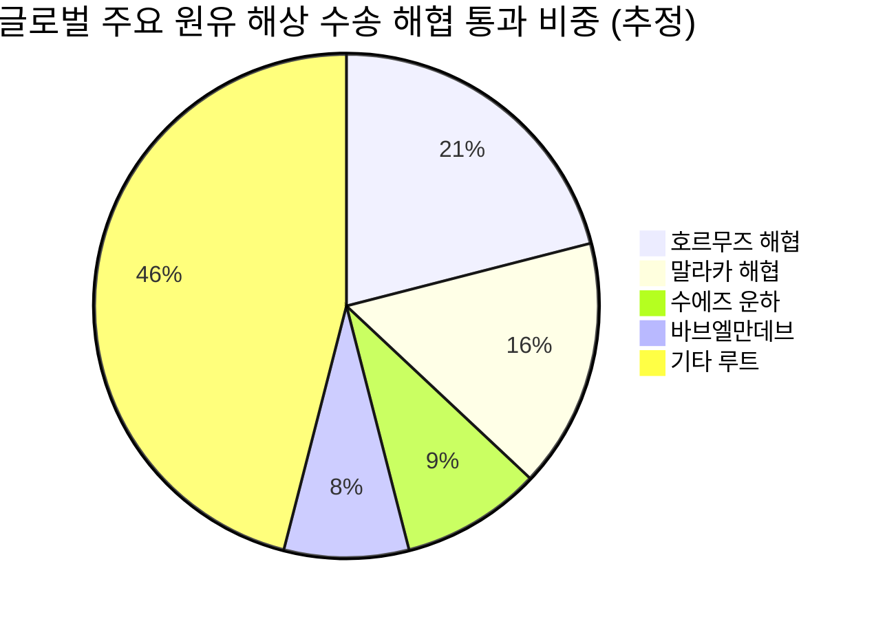

# 📊 모닝 브리핑 — 2026년 4월 20일 (월)

> **🟡 Risk-Mixed** — 호르무즈 재봉쇄 시사 + AI 강세의 동시 충돌
> - **매크로**: 중동 지정학 리스크 재점화, 러시아 석유 제재 면제 5월 16일까지 연장
> - **리스크**: S&P 500·나스닥 전 거래일 사상 최고치 경신 vs. 이란 재봉쇄 시사로 변동성 재확대
> - **시그널**: ① 호르무즈 불확실성 → 유가·해운 변동성 주시 ② AI 빅테크 강세 지속 → 기술주 모멘텀 유효

---

## 시장 스냅샷

### 주요 지수
| 지수 | 종가 | 등락 | 52주 위치 |
|------|------|------|----------|
| S&P 500 | 7,126.06 | +84.78 (+1.2%) | ████████████████████ 100% (5,158–7,126) |
| 나스닥 | 24,468.48 | +365.78 (+1.5%) | ████████████████████ 100% (15,871–24,468) |
| 다우존스 | 49,447.43 | +868.71 (+1.8%) | ██████████████████▊░ 94% (38,170–50,188) |
| 코스피 | 6,191.92 | -34.13 (-0.5%) | ███████████████████▍ 97% (2,470–6,307) |
| 코스닥 | 1,170.04 | +7.07 (+0.6%) | ███████████████████░ 95% (712–1,193) |
| 닛케이 225 | 58,475.90 | -1042.44 (-1.8%) | ███████████████████▏ 96% (34,221–59,518) |

### 매크로/원자재/크립토
| 항목 | 값 | 변동 | 52주 위치 |
|------|-----|------|----------|
| 미국 10Y | 4.25% | -0.06%p | █████████▏░░░░░░░░░░ 46% (4–5) |
| 미국 2Y | 3.60% | -0.01%p | ██▍░░░░░░░░░░░░░░░░░ 12% (4–4) |
| DXY | 98.29 | +0.19 (+0.2%) | ███████▍░░░░░░░░░░░░ 37% (96–102) |
| USD/KRW | 1,465.99 | -11.93 (-0.8%) | ██████████████░░░░░░ 70% (1,348–1,516) |
| USD/JPY | 158.98 | -0.22 (-0.1%) | ██████████████████▊░ 94% (141–160) |
| WTI 원유 | $82.59 | -12.8% | █████████▌░░░░░░░░░░ 47% (55–113) |
| 금 (Gold) | $4,804.80 | -1.1% | ███████████████▎░░░░ 76% (3,181–5,318) |
| 은 (Silver) | $79.72 | -2.5% | ███████████▌░░░░░░░░ 57% (32–115) |
| BTC | $74,050 | -2.2% | ███▋░░░░░░░░░░░░░░░░ 18% (62,702–124,753) |
| VIX | 17.48 | -0.46 (-2.6%) | ████░░░░░░░░░░░░░░░░ 20% (13–34) |
| 10Y-2Y 스프레드 | 0.65%p | -0.05%p | — |

---
## 시장 센티먼트

  

    
🟢 Risk-On 42%

    
🟡 혼조 33%

    
🔴 Risk-Off 25%

  

**핵심 판독**: 전 거래일 S&P 500·나스닥 사상 최고치 경신이라는 강력한 긍정 신호가 존재하지만, 이란의 호르무즈 재봉쇄 시사로 지정학 리스크가 하루 만에 되살아났다. AI 빅테크 중심의 선택적 강세장(narrow leadership)이 지속되는 가운데, 에너지·해운 섹터는 유가 변동성에 노출된 상태다.

**변곡 촉매**:
- 🔴 **다운**: 이란 호르무즈 재봉쇄 공식화 → 유가 급등 → 인플레이션 재점화 우려, 위험자산 이탈
- 🟢 **업**: 미-이란 협상 타결 또는 해협 완전 개방 재확인 → 에너지 비용 하락, 소비·제조 섹터 반등

---

## 섹터별 센티먼트

| 섹터 | 센티먼트 | 한줄 평가 |
|------|---------|----------|
| AI·빅테크 | 🟢 강세 | 아마존·MS·엔비디아 상승 지속, 선택적 강세장 핵심 축 |
| 에너지 | 🟡 혼조 | 호르무즈 재봉쇄 시사로 유가 변동성 확대, 방향성 불확실 |
| 해운·물류 | 🔴 주의 | 호르무즈 불확실성 → 우회항로 비용 급등 리스크 재부각 |
| OTT·미디어 | 🔴 약세 | 넷플릭스 실적 실망, 스트리밍 수익화 한계 우려 |
| 반도체 | 🟢 강세 | AI 수요 견조, 엔비디아 강세 이어 HBM 수요 모멘텀 유지 |
| 인도·EM 제조 | 🟡 관망 | 한-인도 CEPA 개선 기대, 단기 투자 급감 vs. 중장기 성장 기대 공존 |
| 방산·지정학 수혜 | 🟢 강세 | 호르무즈 리스크 재부각, 중동 긴장 고조로 방산 수요 재조명 |

---

## 오버나이트 핵심 이벤트

### 1. 호르무즈 해협 — 개방 후 하루 만에 재봉쇄 시사
- **요약**: 이란이 호르무즈 해협 전면 개방을 발표한 지 하루 만에 재봉쇄를 시사하는 상반된 입장을 내놓으며 시장 불확실성이 재점화되었다.
- **So What**: 일차적으로 유가 및 LNG 가격 변동성 확대로 에너지 비용에 민감한 항공·화학·해운 업종이 직접 타격을 받는다. 이차적으로는 "지정학 리스크 해소→위험선호" 내러티브가 단 하루 만에 뒤집히면서 투자자들이 빠른 포지션 전환을 반복하는 피로감 누적, 변동성 지수 상승 압력으로 연결될 수 있다.
- **크로스 임팩트**: 에너지(원유·LNG), 해운, 방산, 국내 정유·항공 섹터

### 2. 미국 증시 사상 최고치 경신 — AI 주도 선택적 강세
- **요약**: 전 거래일 호르무즈 개방 초기 소식에 따른 유가 하락을 촉매로 S&P 500과 나스닥이 사상 최고치를 경신했다. 아마존, 마이크로소프트, 엔비디아 등 AI 관련 빅테크가 상승을 주도한 반면 넷플릭스는 실망스러운 실적으로 하락했다.
- **So What**: 지수 고점 경신에도 불구하고 상승이 AI 소수 종목에 집중된 '좁은 강세장(narrow market)'은 고평가 리스크와 동시에 진행된다. 넷플릭스 하락은 구독 모델 성장 한계에 대한 시장의 민감도를 보여준다. 지수 레벨보다 breadth(시장 폭)가 관건이다.
- **크로스 임팩트**: [[엔비디아]], [[마이크로소프트]], [[아마존]], 반도체·AI 인프라 전반, OTT·미디어 섹터

### 3. 미국, 러시아 석유 제재 면제 5월 16일까지 연장
- **요약**: 미국이 글로벌 에너지 공급 부족 상황을 고려해 러시아 석유에 대한 제재 면제를 5월 16일까지 한시적으로 연장했다.
- **So What**: 단기적으로는 에너지 공급 측면에서 완충 역할을 하며 유가 급등 압력을 억제한다. 그러나 호르무즈 불안과 맞물리면 "공급 제재 면제 → 공급 여유"와 "해협 봉쇄 → 공급 차질"이라는 상반된 힘이 동시에 작용해 유가 방향성 예측이 어려워진다. 5월 16일 이후 연장 여부가 다음 촉매.
- **크로스 임팩트**: 국제유가([[WTI]]·[[브렌트]]), 정유·에너지 섹터, 인플레이션 지표

---

## 오늘의 일정

| 시간(한국) | 이벤트 | 중요도 | 관련 종목 |
|-----------|--------|--------|----------|
| 장중 | 이재명 대통령 인도 국빈 방문 시작 (4/19~24) | ⭐⭐⭐ | [[한-인도 CEPA]], [[방산]], [[조선]], [[AI 협력주]] |
| 화(21일) 미정 | 미 연준 위원 발언 스케줄 점검 | ⭐⭐⭐ | 금리 민감 전 섹터 |
| 이번 주 중 | 러시아 제재 면제 후속 협상 동향 | ⭐⭐⭐ | [[에너지]], [[정유]], [[해운]] |
| 5월 16일 | 미국 러시아 석유 제재 면제 만료 | ⭐⭐⭐⭐ | [[에너지]], [[정유]], 글로벌 인플레이션 |

> [!warning] ⭐⭐⭐⭐ 5월 16일 러시아 제재 면제 만료
> - **연장 시나리오**: 유가 안정 지속, 에너지 비용 완충 유지 → 인플레이션 압력 제한
> - **종료 시나리오**: 러시아산 공급 차단 + 호르무즈 불안 중첩 시 유가 급등, 스태그플레이션 우려 재점화
> - 이번 주 중동 협상 동향과 함께 반드시 병행 모니터링 필요

---

## 테마 시그널

> [!abstract] 오늘의 테마
> **호르무즈 해협 리스크와 '대체 에너지 루트' 경제학**: 지정학이 물류 인프라 투자 수요를 어떻게 바꾸는가

### 왜 지금 이 테마인가

오늘 가장 중요한 시장 이벤트는 호르무즈 해협 재봉쇄 시사다. 하지만 단순히 "유가 올랐다/내렸다"로 읽으면 표면만 본 것이다. 더 구조적인 질문은 이것이다: **"전 세계 원유 해상 운송의 약 20%가 지나는 단일 해협에 대한 의존도가 2026년에도 이렇게 높은 이유는 무엇이며, 투자자는 이 구조적 취약성에서 어떤 기회를 읽어야 하는가?"**

### 호르무즈 의존도: 세계 에너지 지도의 병목

호르무즈 해협은 이란과 오만 사이에 위치한 너비 약 33km의 좁은 수로다. 사우디아라비아, UAE, 쿠웨이트, 이라크, 이란산 원유의 대부분이 이 길목을 통과한다. 문제는 **대안 루트의 한계**다:

| 대안 루트 | 운영 주체 | 수용 용량 | 한계 |
|---------|---------|---------|------|
| 사우디 얀부 파이프라인 (동→홍해) | 아람코 | 일 500만 배럴 | 사우디 물량만 처리 가능 |
| UAE 하브샨-후자이라 파이프라인 | ADNOC | 일 150만 배럴 | UAE 물량 일부 |
| 이라크 터키 파이프라인 (키르쿠크-세이한) | 이라크 | 일 45만 배럴 | 쿠르드 분쟁으로 불안정 |

세 대안 루트를 모두 합쳐도 호르무즈 통과량의 **약 20~25%** 수준밖에 되지 않는다. 나머지 75%는 대안이 없다.

### 봉쇄 시나리오의 실제 비용

> [!tip] 핵심 인사이트
> 호르무즈 완전 봉쇄는 "유가 상승"이 아니라 **"글로벌 공급망 물리적 차단"**에 가깝다. 1990년 걸프전 당시 원유 공급 충격이 전 세계 GDP를 약 1~1.5%p 끌어내렸다는 추정이 있으며, 현재 에너지 수입 의존도가 높은 한국·일본·인도는 훨씬 큰 충격을 받는다.

| 봉쇄 강도 | 유가 예상 반응 | 글로벌 GDP 충격 | 한국 영향 |
|---------|------------|--------------|---------|
| 위협·교란 (현 국면) | +5~15% | -0.1~0.3%p | 정유·항공 비용 상승 |
| 부분 봉쇄 (민간선 통제) | +20~40% | -0.5~1%p | 무역수지 악화, 원화 약세 |
| 완전 봉쇄 (30일 이상) | +60~100%+ | -2~3%p | 에너지 위기 수준 |

### 구조적 투자 함의: 위기에서 탄생하는 인프라 투자

역사적으로 지정학 리스크가 고조될 때마다 글로벌 에너지 물류 다각화 투자가 급증했다:

- **2012년 이란 제재 강화** → 사우디 얀부 파이프라인 용량 확장 프로젝트 발주
- **2019년 호르무즈 긴장 고조** → UAE 후자이라 항구 확장, VLCC 대체 루트 개발 가속
- **2022년 러시아-우크라이나 전쟁** → 유럽 LNG 터미널 긴급 건설, 카타르·미국 LNG 수출 인프라 급증

**지금 2026년 시점에서 주목할 구조적 변화**:

**① 사우디 얀부 우회 루트 확장**: 아람코와 사우디 정부가 얀부항 처리 용량을 현재 500만 배럴/일에서 700만 배럴/일 수준으로 확장하는 투자를 검토 중. 국내 조선·플랜트 엔지니어링 기업에 잠재적 수혜.

**② LNG 해상 루트 다변화**: 카타르·호주·미국발 LNG가 호르무즈를 거치지 않는 대안 공급원으로 부상. 한국은 미국 LNG 장기 계약 비중 확대 중.

**③ 전략비축유(SPR) 국제 공조**: 미국 IEA 회원국들의 비축유 방출 메커니즘이 단기 충격 완충 역할. 그러나 비축유는 90일 내외 → 장기 봉쇄 대응 불가.

### 투자 프레임: 지정학 리스크를 3단계로 읽어라

  
🟢 위협 단계: 방어주·에너지 비중 확대

  
🟡 교란 단계: 해운·물류 변동성 트레이딩

  
🔴 봉쇄 단계: 전면 방어, 에너지 인프라 장기 보유

현재 시장은 **"위협→교란" 경계**에 위치해 있다. 하루 만에 개방→재봉쇄 시사가 반복되는 패턴은 이란이 호르무즈 카드를 외교적 레버리지로 사용하고 있음을 시사한다. 완전 봉쇄보다는 **"애매한 위협의 장기화"** 시나리오가 가장 가능성 높으며, 이는 유가 변동성의 구조적 상승(Contango 구조 강화)을 의미한다.

**모니터링 포인트**:
- 얀부-홍해 우회 파이프라인 가동률 주간 데이터
- VLCC 운임 지수(Baltic Dirty Tanker Index) 방향성
- IEA 비축유 방출 여부 발표
- 미-이란 핵협상 재개 여부 (최대 상방 촉매)

---

## 대가의 시선

> "Uncertainty is not the same as risk. Risk is when you don't know the outcome but you know the odds. Uncertainty is when you don't even know the odds."
> ("불확실성은 리스크와 다르다. 리스크는 결과를 모르지만 확률은 아는 것이다. 불확실성은 확률조차 모르는 것이다.")
> — **Frank Knight**, 시카고대 경제학자, *Risk, Uncertainty and Profit* (1921) [클래식]

**맥락**: 1921년 경제학자 프랭크 나이트가 리스크(Risk)와 불확실성(Uncertainty)을 학문적으로 최초 구분하며 제시한 개념. '측정 가능한 리스크'와 '측정 불가능한 불확실성'의 차이가 경제적 의사결정의 핵심이라고 주장했다.

**투자 함의**: 오늘 호르무즈 상황이 정확히 이 구분의 교과서적 사례다. 이란이 하루 만에 개방→봉쇄를 번갈아 시사하는 상황에서 시장이 두려워하는 것은 유가가 얼마나 오를지(계산 가능한 리스크)가 아니라, 이란의 다음 행동 자체를 예측할 수 없다는 '나이트적 불확실성'이다. 측정 불가능한 불확실성 국면에서는 복잡한 모델보다 **단순한 원칙**(포지션 축소, 유동성 확보, 시나리오별 트리거 설정)이 더 강력한 방어 수단이 된다.

---

## 투자 레슨

> [!abstract] 오늘의 레슨
> **"왜 유가는 호르무즈 뉴스에 즉각 반응하는데, 주식은 다음 날 반대로 움직이는가"** — 시장 미시구조와 유동성 프리미엄

### 핵심 개념: 자산마다 '정보 반영 속도'가 다르다

금융시장에는 보이지 않는 규칙이 하나 있다: **모든 자산이 같은 뉴스를 같은 속도로 반영하지 않는다.** 이것은 시장이 비효율적이기 때문이 아니라, 각 자산 시장의 **미시구조(Market Microstructure)**—거래 주체, 유동성 깊이, 마켓메이킹 메커니즘, 파생상품 구조—가 근본적으로 다르기 때문이다.

### 왜 원유선물은 지정학 뉴스에 즉각 반응하는가

원유 선물시장은 24시간 거래, 고레버리지 트레이더, 알고리즘 헤지펀드가 지배하는 시장이다. 뉴스 헤드라인이 나오는 순간 다음 메커니즘이 작동한다:

**알고리즘 트리거 → 즉각 포지션 변경 → 유동성 프리미엄 확장 → 가격 갭**

원유 선물의 일평균 거래대금은 수천억 달러 수준이지만, 뉴스 직후 수분 간 호가창(order book)이 얇아지는 **"유동성 공백(Liquidity Gap)"** 현상이 발생한다. 이 공백을 채우는 것이 마켓메이커인데, 이들은 불확실성이 높을수록 **스프레드를 확대**하여 리스크를 보상받는다.

### 주식시장이 다음 날 반대로 움직이는 이유: 3단계 프로세스

| 단계 | 시점 | 메커니즘 | 사례 (오늘) |
|------|------|---------|-----------|
| **1단계: 즉각 반응** | 뉴스 발표 후 수분 | 알고 트레이딩, 선물 헤지, 옵션 델타 헤지 | 이란 재봉쇄 시사 → 원유 선물 즉각 반등 |
| **2단계: 재평가** | 수시간~다음 날 개장 전 | 애널리스트 분석, 기관 리서치, 기업 실적 맥락 재검토 | "부분 봉쇄 or 협상 카드일 뿐" 해석 → 과도 반응 되돌림 |
| **3단계: 구조 반영** | 수일~수주 | 실제 공급 차질 데이터, 기업 실적 수정, 매크로 지표 변화 | 실제 봉쇄 지속 시 항공·화학 원가 상승 실적 반영 |

### 유동성 프리미엄: 시장이 불확실성에 부과하는 '보험료'

> [!tip] 핵심 인사이트
> 유동성 프리미엄(Liquidity Premium)이란 **"덜 유동적인 자산, 또는 불확실성이 높은 상황에서 투자자가 요구하는 추가 수익률"**이다. 이것이 높아지면 자산 가격은 내려간다(같은 미래 현금흐름에 더 높은 할인율 적용).

오늘처럼 호르무즈 뉴스가 하루 만에 뒤집히는 상황에서 유동성 프리미엄은 두 가지 방향으로 동시에 작동한다:

  
🔴 에너지·해운: 유동성 프리미엄 급등 → 가격 변동성 확대

  
🟢 AI 빅테크: 지정학 무관 → 유동성 프리미엄 유지, 상승 지속

이것이 "S&P 500 신고가 + 호르무즈 위기"가 동시에 존재하는 역설적 상황의 구조적 설명이다. 지수 내에서도 섹터별로 유동성 프리미엄이 극단적으로 차별화되고 있는 것이다.

### 역사적 사례: 2019년 호르무즈 긴장

2019년 6~7월 이란이 영국 유조선을 나포하고 호르무즈 긴장이 고조되었을 때:
- 원유 선물: 발표 당일 +3~5% 급등
- S&P 500: 같은 날 혼조, 다음 날 소폭 상승 (AI 섹터 없던 시기)
- **결과**: 실제 봉쇄 미발생 → 원유 가격 2주 내 원위치

**패턴**: 지정학 '위협'은 원자재 시장에서 과도하게 반영되고, 주식 시장에서는 과소 반영되는 경향이 있다. 실제 '공급 차질'이 수치로 확인될 때 주식에 반영된다.

### 오늘 실천 방법

> [!note] 오늘 실천 방법
> **1.** 호르무즈 뉴스를 접할 때, "원유 선물이 즉각 반응했다" = "이미 단기 리스크는 가격에 반영됐다"로 해석하라. 추격 매도/매수보다 **3단계 프로세스 중 어느 단계인지** 먼저 판단하라.
> **2.** 에너지 관련 포지션이 있다면 오늘 **발틱 더티 탱커 지수(BDTI)**와 **IEA 비축유 동향**을 실제 공급 차질의 선행 지표로 모니터링하라.

---

## 오늘 하나만 기억한다면

> [!verdict] 오늘 하나만 기억한다면
> **"호르무즈는 하루 만에 두 번 뒤집혔다 — 이건 '리스크'가 아니라 '나이트적 불확실성'이다. 지금 필요한 것은 정확한 예측이 아니라, 시나리오별 트리거를 사전에 세팅해두는 것이다."**