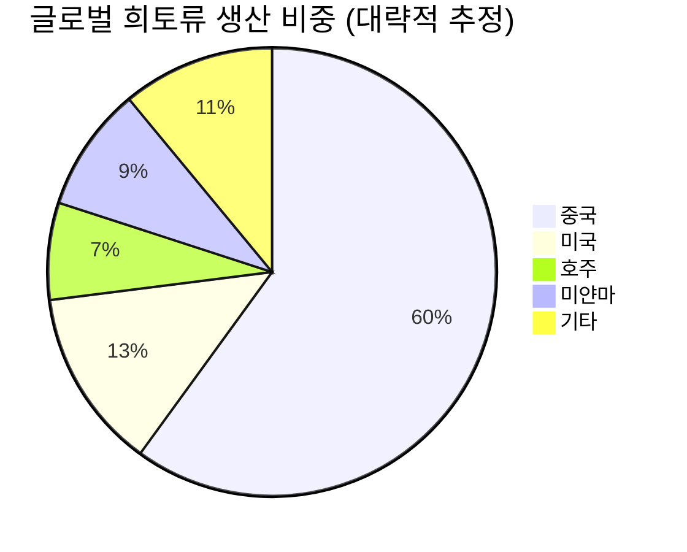

# 📊 모닝 브리핑 — 2026년 4월 24일 (금)

> **🔴 Risk-Off (단기 조정 국면)** — 사상 최고치 이후 차익 실현 + 중동 긴장 재고조
> - **매크로**: 국제유가 배럴당 $100 돌파, 인플레이션 압력 재부상
> - **리스크**: 미국 3대 지수 동반 하락, 중동 호르무즈 해협 긴장 지속
> - **시그널**: 한국 1Q GDP 깜짝 성장(+1.7%) + 코스피 사상 최고치 디커플링 주목

---

## 시장 스냅샷

### 주요 지수
| 지수 | 종가 | 등락 | 52주 위치 |
|------|------|------|----------|
| S&P 500 | 7,108.40 | -29.50 (-0.4%) | ███████████████████▋ 98% (5,485–7,138) |
| 나스닥 | 24,438.50 | -219.07 (-0.9%) | ███████████████████▍ 97% (17,166–24,658) |
| 다우존스 | 49,310.32 | -179.71 (-0.4%) | ██████████████████▎░ 91% (40,093–50,188) |
| 코스피 | 6,417.93 | +29.46 (+0.5%) | ████████████████████ 100% (2,522–6,418) |
| 코스닥 | 1,181.12 | +2.09 (+0.2%) | ███████████████████▌ 98% (714–1,193) |
| 닛케이 225 | 59,585.86 | +236.69 (+0.4%) | ████████████████████ 100% (34,869–59,586) |

### 매크로/원자재/크립토
| 항목 | 값 | 변동 | 52주 위치 |
|------|-----|------|----------|
| 미국 10Y | 4.32% | +0.03%p | ███████████▌░░░░░░░░ 58% (4–5) |
| 미국 2Y | 3.60% | +0.00%p | ██▎░░░░░░░░░░░░░░░░░ 11% (4–4) |
| DXY | 98.80 | +0.21 (+0.2%) | █████████▎░░░░░░░░░░ 46% (96–102) |
| USD/KRW | 1,481.33 | -4.47 (-0.3%) | ███████████████▉░░░░ 79% (1,348–1,516) |
| USD/JPY | 159.66 | +0.29 (+0.2%) | ███████████████████▍ 97% (142–160) |
| WTI 원유 | $96.72 | +4.0% | ██████████████▍░░░░░ 72% (55–113) |
| 금 (Gold) | $4,708.60 | -0.5% | ██████████████▎░░░░░ 71% (3,181–5,318) |
| 은 (Silver) | $75.39 | -3.2% | ██████████▌░░░░░░░░░ 52% (32–115) |
| BTC | $78,234 | +0.0% | █████░░░░░░░░░░░░░░░ 25% (62,702–124,753) |
| VIX | 19.31 | +0.39 (+2.1%) | ██████▋░░░░░░░░░░░░░ 33% (13–31) |
| 10Y-2Y 스프레드 | 0.73%p | +0.03%p | — |

---
## 시장 센티먼트

<div style="display:flex;border-radius:8px;overflow:hidden;margin:8px 0;font-size:0.85em"><div style="background:#F44336;width:60%;padding:6px 8px;color:white">🔴 Risk-Off 60%</div><div style="background:#FF9800;width:25%;padding:6px 8px;color:white">🟡 중립 25%</div><div style="background:#4CAF50;width:15%;padding:6px 8px;color:white;white-space:nowrap">🟢 On 15%</div></div>

**핵심 판독**: 전일 미국 증시는 사상 최고치 경신 이후 중동 긴장 재고조와 유가 $100 돌파라는 이중 악재에 차익 실현 매물이 가세하며 3대 지수 동반 하락. 단기 급등 이후의 기술적 소화 과정으로 볼 수 있으나, 호르무즈 해협 리스크가 인플레이션 경로에 영향을 줄 경우 연준의 금리 경로 불확실성이 재부상할 수 있어 경계심이 높다.

**변곡 촉매**:
- 🔴 **다운**: 호르무즈 해협 봉쇄/상선 피격 사태 격화 → 유가 추가 급등 → 연준 금리 인상 재론
- 🟢 **업**: 중동 협상 전격 타결 + 미 빅테크 어닝 서프라이즈 → 위험선호 재점화

---

## 섹터별 센티먼트

| 섹터 | 센티먼트 | 한줄 평가 |
|------|---------|----------|
| 반도체/AI | 🟢 강세 | SK하이닉스 잠정실적 공시 + AI 투자 열풍 지속, 단기 조정은 매집 기회로 해석 |
| 에너지 | 🟢 강세 | 유가 $100 돌파로 정유·E&P 실적 수혜, 다만 수요 둔화 시 되돌림 리스크 |
| 방산/우주 | 🟢 강세 | 중동 긴장 장기화 + 호르무즈 리스크 → 방산 수요 증가 내러티브 강화 |
| 해운/물류 | 🟡 혼조 | 호르무즈 우회 항로 비용 증가 우려 vs 운임 상승 수혜, 방향성 불투명 |
| 소비재/유통 | 🔴 주의 | 유가발 인플레이션 재점화 시 실질 구매력 압박, 내수 소비 심리 위축 가능 |
| 한국 IT/수출 | 🟢 강세 | 코스피 사상 최고·1Q GDP 서프라이즈 배경, 원화 강세 여부가 추가 변수 |
| 금융/은행 | 🟡 중립 | 주요국 금리 동결 기조 유지, 유가 인플레이션 반영 시 인상 재론 가능성 상존 |

---

## 오버나이트 핵심 이벤트

### 1. 미국 증시 사상 최고치 후 하락 전환
- **요약**: 4월 22일 S&P 500·나스닥이 사상 최고치를 경신한 직후, 23일에는 중동 긴장 재고조와 단기 급등 부담으로 다우·S&P 500·나스닥 3대 지수 동반 하락 마감.
- **So What**: 사상 최고치 경신 다음 날의 하락은 전형적인 기술적 소화 패턴이나, 유가 $100 돌파라는 실물 악재가 겹쳤다는 점이 단순 차익 실현과 다르다. 인플레이션 우려가 연준의 금리 동결 기조를 흔들 경우, 밸류에이션 부담이 높은 기술주 중심으로 멀티플 압축 리스크가 발생할 수 있다.
- **크로스 임팩트**: 미국 빅테크([[엔비디아]], [[마이크로소프트]]), 국내 수출주, 달러·원 환율

### 2. 중동 긴장 재고조 및 유가 $100 돌파
- **요약**: 이란 휴전 연장 발표에도 호르무즈 해협에서의 상선 나포·발포 명령 등 긴장이 완전히 해소되지 않았으며, 국제유가가 배럴당 $100을 넘어섰다.
- **So What**: 유가 $100은 단순 에너지 비용 문제를 넘어 글로벌 인플레이션 경로에 직접적인 영향을 미친다. 지난 40년간 유가 급등이 선행한 경기침체 사례(1973, 1979, 1990, 2008)를 감안하면, 공급 차질의 장기화 여부가 2026년 하반기 매크로의 가장 중요한 변수로 부상했다. 에너지 수입 의존도가 높은 한국은 경상수지 악화 압력도 주목해야 한다.
- **크로스 임팩트**: 정유([[SK이노베이션]], [[S-Oil]]), 항공·운송(비용 증가), 원/달러 환율(달러 강세)

### 3. 한국 코스피 사상 최고치 + 1Q GDP 깜짝 성장
- **요약**: 미국 기술주 강세 훈풍과 한국의 1분기 GDP 성장률 1.7% 깜짝 발표에 힘입어 코스피가 사상 최고치를 경신하며 장중 6,500을 돌파했다.
- **So What**: 한국 GDP 서프라이즈는 반도체·AI 수출 호조가 핵심 동인으로, 글로벌 AI 투자 사이클이 한국 제조업 수출에 직접적으로 연결되고 있음을 확인시켜준다. 다만 SK하이닉스 잠정실적 공시 이후 '기대→실적 이전'이 완료되면 단기 차익 실현 압력이 나타날 수 있다. 코스피가 미국 증시 하락에도 디커플링을 유지할 수 있을지가 관건.
- **크로스 임팩트**: [[삼성전자]], [[SK하이닉스]], 코스피 ETF([[KODEX 200]])

### 4. 주요 중앙은행 금리 동결 기조 유지
- **요약**: 미국 연준, ECB, 일본은행, 한국은행 등 주요국 중앙은행들이 높은 인플레이션과 불확실성에도 불구하고 기준금리를 동결했으나, 유가 상승으로 향후 인상 가능성이 다시 논의되고 있다.
- **So What**: 유가 $100 돌파는 중앙은행들이 '일시적 인플레이션'으로 처리하기 어려운 공급 충격이다. 동결 기조가 흔들릴 경우 채권 금리 상승 → 성장주 밸류에이션 압축 → 부동산 시장 재압박의 연쇄 경로가 활성화된다.
- **크로스 임팩트**: 미국 국채([[TLT]]), 달러 인덱스, 성장주 전반

---

## 오늘의 일정

| 시간(한국) | 이벤트 | 중요도 | 관련 종목 |
|-----------|--------|--------|----------|
| 오전 장중 | SK하이닉스 1Q26 실적 발표(잠정 공시 후속 컨콜 예상) | ⭐⭐⭐⭐⭐ | [[SK하이닉스]], [[삼성전자]], [[한미반도체]] |
| 미정 | 중동 외교 협상 동향 (호르무즈 해협 긴장 지속 모니터링) | ⭐⭐⭐⭐ | [[S-Oil]], [[SK이노베이션]], 항공주 |
| 이번 주 | 미국 빅테크 어닝 시즌 진행 중 | ⭐⭐⭐⭐ | [[엔비디아]], [[마이크로소프트]], [[알파벳]] |
| 상시 | 연준 위원 발언 (유가 인플레이션 관련 스탠스 주목) | ⭐⭐⭐ | 전 종목, [[TLT]] |

> [!warning] ⭐⭐⭐⭐⭐ SK하이닉스 실적 — 시나리오 분기
> - **서프라이즈**: HBM3E 수요 가시성 확인 → 반도체 섹터 전반 추가 상승, 코스피 6,500 안착 시도
> - **인라인**: 이미 주가에 선반영된 기대치 → 단기 "소문에 사고 뉴스에 팔자" 차익 실현 가능
> - **미스**: 하이엔드 AI 메모리 마진 압박 우려 → 반도체 섹터 급격한 되돌림 경계

---

## 테마 시그널

> [!abstract] 오늘의 테마
> **희토류 공급망 전쟁** — 지정학적 무역 재편의 최전선에 선 17개 원소가 반도체·방산·에너지 전환의 판도를 바꾼다

### 왜 지금 이 테마인가?

이번 주 USA Rare Earth의 브라질 Serra Verde 광산 $28억 인수, 미국 국무부의 'Pax Silica 기금' $2.5억 할당, 중국의 '산업 및 공급망 안보 규정' 발표가 동시에 터졌다. 단일 뉴스가 아니라 **미·중 희토류 전쟁의 구조적 전환점**이 한꺼번에 가시화된 것이다. 여기에 호르무즈 해협 리스크까지 더해지며 공급망 지역화의 필요성은 이제 이론이 아닌 현실 비용 문제가 됐다.

---

### 희토류란 무엇이고 왜 중요한가

희토류(Rare Earth Elements, REE)는 란타넘족 15개 원소 + 스칸듐 + 이트륨, 총 17개 원소의 집합이다. "희귀하다"는 이름과 달리 지구상에 비교적 풍부하게 존재하지만, **경제성 있는 농도로 매장된 곳이 극히 제한적**이고, 채굴-분리-정제-가공의 전 공정이 기술 집약적이고 환경 부담이 크다.



| 분류 | 대표 원소 | 핵심 용도 |
|------|---------|---------|
| 경희토류(LREE) | 세륨, 란타넘, 네오디뮴 | 영구자석, 형광체, 연마재 |
| **중희토류(HREE)** | **디스프로슘, 테르븀, 이트륨** | **EV 모터 고온 자석, HBM 일부 소재, 레이저** |
| 특수 희토류 | 유로퓸, 루테튬 | OLED 디스플레이, PET 스캐너 |

> [!tip] 핵심 인사이트
> 중희토류(HREE)가 진짜 문제다. 경희토류는 미국·호주에서 대체 공급이 가능하지만, 중희토류의 80% 이상이 중국 남부 이온 흡착 점토에서 나온다. 테르븀과 디스프로슘이 없으면 EV용 고성능 영구자석 NdFeB가 고온에서 자성을 잃는다 — 이것이 중국이 쥔 진짜 카드다.

---

### 공급망 전쟁의 3막 구조

**1막 (2010~2020): 중국의 독점 확립**

2010년 중국이 일본과의 영토 분쟁 중 희토류 수출을 97% 삭감한 사건은 서방에 경고등이 됐다. 그러나 가격 안정화 이후 서방은 다시 안이해졌다. 결과적으로 중국은 채굴-정제-가공-자석 제조에 이르는 **완전한 수직 통합 공급망**을 완성했다.

**2막 (2020~2024): 분산 시도, 그러나 한계**

미국 Mountain Pass 광산(MP Materials 운영), 호주 Lynas의 부상으로 채굴 단계는 다변화됐다. 그러나 핵심 병목인 **분리·정제 공정**은 여전히 중국 의존도 85% 이상. 광석을 캐도 정제할 곳이 없다는 구조적 문제는 해결되지 않았다.

**3막 (2025~현재): 통합 공급망 구축 경쟁**

이번 USA Rare Earth의 브라질 인수가 중요한 이유는 단순한 광산 확보가 아니라 **채굴-정제-야금-자석 제조**를 한 기업이 연결하는 첫 비중국 통합 밸류체인 시도이기 때문이다.

<div style="border-left:4px solid #2196F3;padding-left:12px;margin:8px 0">

**2027 목표**: 비중국 중희토류 공급의 50% 이상 — 현재 약 20% 수준에서 2.5배 도약이 필요한 야심찬 목표. 실현 가능성은 자금 조달, 브라질 정치 리스크, 가공 기술력에 달려 있다.

</div>

---

### 중국의 반격: '산업 및 공급망 안보 규정'

중국이 2026년 4월 발표한 이 규정은 기존의 분산된 수출 통제 조항들을 **통합된 경제적 국가 통제 프레임워크**로 격상시킨 것이다. 쉽게 말하면, 희토류·반도체 소재를 언제든지 무기화할 수 있는 법적 근거를 일원화한 것.

> [!warning] 리스크 경고
> 이 규정은 미국 기업만 겨냥하지 않는다. **유럽 기술·소비재 생산자에게도 직접 적용**된다. ASML(네덜란드), 지멘스(독일) 등이 중국 내 사업을 영위하는 기업들은 이 규정에 의해 공급망 정보 제출 의무, 사전 심사 등의 부담을 질 수 있다.

---

### 투자 함의: 어디서 기회가 생기는가

<div style="display:flex;border-radius:8px;overflow:hidden;margin:8px 0;font-size:0.85em"><div style="background:#4CAF50;width:40%;padding:6px 8px;color:white">🟢 수혜 40%</div><div style="background:#FF9800;width:35%;padding:6px 8px;color:white">🟡 관망 35%</div><div style="background:#F44336;width:25%;padding:6px 8px;color:white">🔴 리스크 25%</div></div>

| 투자 테마 | 수혜 기업/섹터 | 시계 | 리스크 |
|---------|------------|------|--------|
| 비중국 광산 개발 | MP Materials, Lynas, USA Rare Earth | 중장기(3-5년) | 정치 리스크, 가격 변동성 |
| 분리·정제 기술 | 희토류 정제 스타트업, 화학 소재 기업 | 중기(2-3년) | 기술 성숙도 불확실 |
| 대체 자석 기술 | 희토류 저감형 영구자석, 전자석 모터 | 장기(5년+) | 물리적 성능 한계 |
| 관련 인프라 건설 | 특수 화학 공장, 에너지 인프라 | 중기 | 건설 비용 급등 |
| EV/방산 수직 통합 | 테슬라, 방산 OEM | 중장기 | 공급 확보 실패 시 비용 급등 |

---

### 모니터링 포인트

1. **USA Rare Earth $28억 인수 딜 클로징 여부** — 브라질 정부 승인이 변수
2. **중국 중희토류 수출 규제 강화 시그널** — 테르븀·디스프로슘 수출 허가 데이터
3. **Pax Silica 기금 집행 방향** — 어느 나라·기업에 $2.5억이 흘러가는가
4. **미 MATCH Act 입법 진행** — 반도체 제조장비 수출 통제 법안, 동맹국 동참 여부
5. **한국 소재 기업 수혜 여부** — 국내 희토류 가공·자석 소재 기업들의 글로벌 공급망 편입 가능성

---

## 대가의 시선

> "The single biggest shift in the global economy over the next decade will not be AI — it will be the deglobalization of supply chains."
> *(향후 10년 세계 경제의 가장 큰 변화는 AI가 아니라 공급망의 탈세계화가 될 것이다.)*
> — **Ray Dalio**, Bridgewater Associates 창업자 [클래식]

**맥락**: 달리오는 수십 년간 글로벌 부채 사이클과 제국 흥망을 분석해온 매크로 투자자다. 그가 반복적으로 강조해온 핵심 주제 중 하나가 "세계 질서의 변화는 금융 시장보다 훨씬 느리지만, 일단 전환되면 훨씬 크게 온다"는 것이다.

**투자 함의**: 오늘 희토류 공급망 재편 뉴스들은 단기 트레이딩 이슈가 아니다. 60년간 작동해온 자유무역 기반의 글로벌 공급망 모델이 지정학적 블록화로 교체되는 **구조적 전환**의 일부다. 이 전환은 에너지·원자재·반도체·제약에 이르기까지 모든 산업의 비용 구조와 수익성을 재편한다. "지역화 비용"은 인플레이션의 구조적 바닥을 높이고, 이는 장기 금리의 평균 수준을 과거 대비 높게 유지하는 힘으로 작용한다.

---

## 투자 레슨

> [!abstract] 오늘의 레슨
> **소로스의 재귀성 이론(Theory of Reflexivity)** — 시장이 현실을 반영하는 것이 아니라, 시장이 현실을 만든다

### "왜 주가는 펀더멘털로 수렴하지 않는가?" — 재귀성의 역설

교과서적 효율시장가설(EMH)은 "투자자들의 합리적 기대가 자산 가격을 내재가치에 수렴시킨다"고 말한다. 그런데 현실에서는 왜 닷컴 버블, 2008년 부동산 버블, 2021년 밈 주식 광풍이 반복적으로 발생하는가?

조지 소로스(George Soros)는 이에 대해 1987년 저서 *The Alchemy of Finance*에서 근본적으로 다른 답을 제시했다.

<div style="border-left:4px solid #9C27B0;padding-left:12px;margin:8px 0">

**재귀성의 핵심 명제**: 투자자의 인식은 현실을 반영하지 않는다. 인식 자체가 현실에 개입하여 현실을 바꾼다. 그리고 바뀐 현실이 다시 인식에 영향을 준다 — 이 양방향 피드백이 **재귀적 루프**를 만든다.

</div>

---

### 재귀성의 작동 메커니즘

```
[인식 함수] 현실 → 투자자의 인식 (불완전하고 편향된)
[참여 함수] 투자자의 인식 → 투자 행동 → 현실 변화
```

이 두 함수가 **동시에** 작동한다. 주가가 오르면 → 투자자는 그 기업이 더 좋아졌다고 인식 → 더 많이 사고 → 주가가 더 오르고 → 실제로 그 기업의 자금 조달 능력, 인재 유치, 고객 신뢰도가 개선된다 → 펀더멘털이 진짜로 좋아진다.

반대 방향도 동일하게 작동한다. 이것이 버블과 붕괴가 자기 강화적인 이유다.

---

### 역사적 사례: 1992년 파운드 공매도

소로스 본인이 이 이론을 $10억 수익으로 실증했다. 1992년 유럽 환율 메커니즘(ERM) 위기 당시:

| 단계 | 재귀적 루프 |
|------|-----------|
| 초기 인식 | 파운드가 ERM 내에서 과대평가, 영국 경제가 독일 금리를 감당 못 함 |
| 참여 | 소로스 퀀텀 펀드, 파운드 $100억 규모 공매도 개시 |
| 현실 변화 | 공매도 압력으로 파운드 실제 하락 시작 → 영국 정부 방어 비용 급증 |
| 재귀 루프 | 시장이 "영국이 버티지 못할 것"이라고 인식 → 추가 공매도 → 실제로 영국 정부가 ERM 탈퇴 결정 |
| 결과 | 소로스 단 하루 만에 $10억 수익 — "영란은행을 무너뜨린 남자" |

> [!tip] 핵심 인사이트
> 파운드가 하락한 것은 소로스가 옳았기 때문만이 아니다. 소로스의 **베팅 자체가 하락을 만들었다**. 이것이 재귀성이다. 시장에서 충분히 큰 플레이어의 인식은 현실이 된다.

---

### 재귀성의 3단계 사이클

<div style="display:flex;border-radius:8px;overflow:hidden;margin:8px 0;font-size:0.85em"><div style="background:#4CAF50;width:33%;padding:6px 8px;color:white">🟢 1. 초기 트렌드 형성</div><div style="background:#FF9800;width:34%;padding:6px 8px;color:white">🟡 2. 자기 강화 가속</div><div style="background:#F44336;width:33%;padding:6px 8px;color:white">🔴 3. 역전과 붕괴</div></div>

**1단계 (초기 트렌드)**: 실제 펀더멘털 변화 + 투자자 인식 형성. 이 단계는 건강하고 지속 가능하다.

**2단계 (자기 강화)**: 인식이 현실을 바꾸고, 바뀐 현실이 인식을 강화한다. 주가는 펀더멘털에서 이탈하기 시작하지만, 이탈 자체가 새로운 "현실"을 만든다. **이 단계가 가장 오래 지속되고, 가장 위험하다.**

**3단계 (역전)**: 현실과 인식의 괴리가 임계점을 넘는 순간 방향이 급격히 바뀐다. 소로스는 이 역전 시점을 "실험 불가능한 예술"이라 불렀다.

---

### 오늘 시장에서 재귀성이 작동하는 사례

**코스피 6,500 돌파와 재귀적 루프**

코스피가 사상 최고치를 경신하면서 실제 재귀적 피드백이 진행 중이다:

1. AI 수요 → SK하이닉스 HBM 수출 증가 → GDP 서프라이즈 (펀더멘털 변화 ✓)
2. 코스피 사상 최고 뉴스 → 외국인 자금 유입 증가 → 주가 추가 상승
3. 주가 상승 → 기업 자금 조달 비용 감소 → 실제 투자 확대 → 펀더멘털 개선
4. 이 사이클이 재귀적으로 강화 중

> [!question] 검토 필요
> 그렇다면 지금 어느 단계인가? 1단계(건강한 초기 트렌드)인가, 2단계(자기 강화 버블 초입)인가? 소로스의 프레임에서 핵심 질문은 "지금 주가 상승이 실제 펀더멘털 개선을 만들고 있는가, 아니면 인식만 앞서나가고 있는가"다.

---

### 재귀성 프레임으로 투자하는 방법

| 상황 | 재귀성 신호 | 투자 전략 |
|------|-----------|---------|
| 자기 강화 초기 | 주가 상승 → 실제 펀더멘털 개선 확인 | 트렌드 추종, 포지션 확대 |
| 자기 강화 후기 | 주가 상승에도 실적 가이던스 하향 | 포지션 축소, 헤지 검토 |
| 역전 임박 | 인식과 현실의 극단적 괴리 + 촉매 등장 | 역발상 포지션 검토 |
| 역전 진행 | 하락 → 펀더멘털 실제 악화 확인 | 손절/회피, 반등 시 매도 |

---

### 오늘 실천 방법

오늘 SK하이닉스 실적 발표를 볼 때, 단순히 "어닝 비트/미스"를 확인하는 것이 아니라 **재귀적 루프가 강화되고 있는지**를 확인하라. HBM 수주 증가가 실제로 NVIDIA와의 관계를 더 강화하고 있는지(인식→현실), 그리고 그 현실이 다시 투자자들의 추가 베팅을 불러오는지(현실→인식). 그 루프가 살아있다면 트렌드는 아직 유효하다.

---

## 오늘 하나만 기억한다면

> [!verdict] 오늘 하나만 기억한다면
> **"유가 $100 돌파는 에너지 이슈가 아니라 인플레이션 경로 이슈다 — 중앙은행의 다음 수가 바뀌면 모든 자산의 밸류에이션 공식이 바뀐다."**