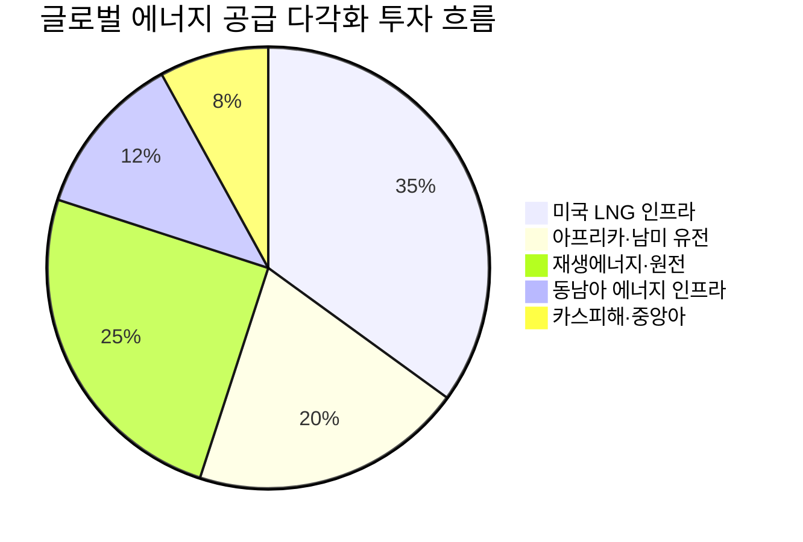

---

created: 2026-04-27 09:12
date: 2026-04-27 09:12
listing: public
tags:
- morning
- daily
- briefing
- public
title: Morning Brief 2026-04-27 09:12
type: briefing
publish: true
---

# 📊 모닝 브리핑 — 2026년 4월 27일 (월)

> **🟡 혼조 (Risk-On/Off 교차)** — 주말 미-이란 협상 무산으로 지정학 리스크 재점화, 빅테크 실적 시즌 돌입
> - **매크로**: 미국 10Y 4.31%, DXY 98.64, WTI 원유 $96.14
> - **리스크**: S&P 500 52주 최고(+0.8%), VIX 18.71(-3.1%) — 지수는 강세지만 유가 급등이 변수
> - **시그널**: ① 빅테크 실적 슈퍼위크 개막 (Meta/MSFT/Amazon/Alphabet/Apple) ② 이란 협상 무산→유가 +1.8% → 에너지 섹터 재주목

---

## 시장 스냅샷

### 주요 지수
| 지수 | 종가 | 등락 | 52주 위치 |
|------|------|------|----------|
| S&P 500 | 7,165.08 | +56.68 (+0.8%) | ████████████████████ 100% (5,525–7,165) |
| 나스닥 | 24,836.60 | +398.10 (+1.6%) | ████████████████████ 100% (17,366–24,837) |
| 다우존스 | 49,230.71 | -79.61 (-0.2%) | ██████████████████▏░ 90% (40,114–50,188) |
| 코스피 | 6,475.63 | -0.18 (-0.0%) | ████████████████████ 100% (2,549–6,476) |
| 코스닥 | 1,203.84 | +29.53 (+2.5%) | ████████████████████ 100% (714–1,204) |
| 닛케이 225 | 59,716.18 | +575.95 (+1.0%) | ████████████████████ 100% (35,840–59,716) |

### 매크로/원자재/크립토
| 항목 | 값 | 변동 | 52주 위치 |
|------|-----|------|----------|
| 미국 10Y | 4.31% | -0.01%p | ███████████▏░░░░░░░░ 56% (4–5) |
| 미국 2Y | 3.59% | -0.00%p | ██▎░░░░░░░░░░░░░░░░░ 11% (4–4) |
| DXY | 98.64 | +0.13 (+0.1%) | ████████▊░░░░░░░░░░░ 43% (96–102) |
| USD/KRW | 1,476.41 | -3.54 (-0.2%) | ███████████████▎░░░░ 76% (1,348–1,516) |
| USD/JPY | 159.53 | -0.21 (-0.1%) | ███████████████████▎ 96% (142–160) |
| WTI 원유 | $96.14 | +1.8% | ██████████████▏░░░░░ 71% (55–113) |
| 금 (Gold) | $4,695.60 | -0.6% | ██████████████▏░░░░░ 71% (3,181–5,318) |
| 은 (Silver) | $74.86 | -2.0% | ██████████▍░░░░░░░░░ 52% (32–115) |
| BTC | $78,753 | +1.5% | █████▏░░░░░░░░░░░░░░ 26% (62,702–124,753) |
| VIX | 18.71 | -0.60 (-3.1%) | ██████░░░░░░░░░░░░░░ 30% (13–31) |
| 10Y-2Y 스프레드 | 0.72%p | -0.01%p | — |

---
## 시장 센티먼트

  

    
🟢 Risk-On 40%

    
🟡 혼조 35%

    
🔴 Risk-Off 25%

  

**핵심 판독**: 금요일 S&P 500과 나스닥이 52주 신고점으로 마감하며 강한 Risk-On으로 한 주를 마쳤으나, 주말 미-이란 협상 무산 소식이 유가를 끌어올리며 월요일 오프닝에 찬물을 끼얹었습니다. VIX 18.71은 공포 영역(25 이상)과는 거리가 있어 패닉보다는 경계 국면이며, 이번 주 빅테크 실적이 센티먼트 방향을 결정짓는 핵심 변수입니다.

**변곡 촉매**:
- 🔴 **다운**: 미-이란 협상 추가 결렬 + WTI $100 돌파 시 인플레이션 재점화 우려
- 🟢 **업**: 빅테크 실적 서프라이즈 + FOMC 비둘기파 신호 (4월 28-29일)

---

## 섹터별 센티먼트

| 섹터 | 센티먼트 | 한줄 평가 |
|------|---------|----------|
| 반도체/AI | 🟢 강세 | 인텔 실적 호조가 섹터 신뢰 회복, 엔비디아 동반 강세 — HBM 수요 서사 유효 |
| 빅테크 | 🟡 관망 | 실적 발표 전 고점 부담 vs 어닝 서프라이즈 기대 교차 |
| 에너지 | 🟢 강세 | 미-이란 협상 무산 + WTI $96, 단기 유가 강세 지속 가능성 |
| 항공/운송 | 🔴 약세 | 유가 급등 직격탄, 연료비 부담 증가로 마진 압박 |
| 금/귀금속 | 🟡 혼조 | 금 $4,695 고점권, 단기 차익실현 압력(-0.6%) 속 지정학 헤지 수요 상존 |
| 방산/지정학 | 🟢 강세 | 중동 긴장 재고조, 방산 수요 확대 내러티브 강화 |
| 소비재/항공 | 🔴 주의 | 고유가 → 소비자 체감 물가 상승 → 소비심리 위축 경로 |

---

## 오버나이트 핵심 이벤트

### 1. 미-이란 협상 무산 + 유가 급등

- **요약**: 4월 26일(토) 미국과 이란 간 예정된 협상이 결렬되며 WTI 원유 가격이 +1.8% 급등, 미국 주가지수 선물은 하락 출발.
- **So What**: 호르무즈 해협 긴장이 재고조되면 글로벌 원유 물동량의 약 20%가 영향권에 들어오며, 공급 차질이 인플레이션 재점화로 이어지는 2차 효과가 발생합니다. Fed가 금리 인하를 서두르기 어려워지는 구조적 압박입니다.
- **크로스 임팩트**: 에너지 섹터 🟢 수혜 / 항공·화학·운송 🔴 비용 급증 / 채권 시장 금리 상승 압력

### 2. 인텔 실적 호조 + 반도체 섹터 강세

- **요약**: [[인텔]]의 견조한 분기 실적 및 긍정적 가이던스 발표로 주가가 급등, [[엔비디아]] 등 반도체 섹터 전반에 동반 강세가 나타났습니다.
- **So What**: 인텔의 실적 개선은 PC·서버 수요 저점 통과를 시사하며, AI 인프라 투자 사이클이 데이터센터뿐 아니라 엣지 컴퓨팅까지 확산 중임을 확인시켜 줍니다. 이번 주 빅테크 실적의 선행 지표로서 시장 기대치를 높이는 역할을 했습니다.
- **크로스 임팩트**: 반도체 장비·소재 🟢 / 클라우드·AI 인프라 🟢 / 빅테크 실적 기대치 상향

### 3. 빅테크 실적 슈퍼위크 개막

- **요약**: 이번 주 [[메타]], [[마이크로소프트]], [[아마존]], [[알파벳]], [[애플]] 등 시가총액 상위 빅테크 5개사의 실적이 집중 발표됩니다.
- **So What**: S&P 500에서 이들 5개사가 차지하는 시가총액 비중은 막대하기 때문에, 실적 결과에 따라 지수 전체의 방향성이 결정됩니다. 특히 AI 투자 집행 규모(CapEx)와 클라우드 성장률이 시장의 핵심 관전 포인트로, 어닝 서프라이즈 여부가 이번 주 지수 등락을 지배할 것입니다.
- **크로스 임팩트**: 광고 시장(Meta/Alphabet) 🟡 / 클라우드 인프라(MSFT/Amazon) 🟢 / 소비자 플랫폼(Apple) 🟡

### 4. FOMC 회의 (4월 28-29일) — 금리 동결 전망

- **요약**: 미 연준이 이번 주 FOMC 회의를 개최하며, 시장은 만장일치 금리 동결을 예상하고 있습니다.
- **So What**: 금리 동결 자체보다 파월 의장의 기자회견 발언이 핵심입니다. 유가 급등으로 인플레이션 재점화 우려가 생긴 상황에서, Fed가 금리 인하 경로에 대해 얼마나 신중한 태도를 취하는지가 채권·달러·주식 밸류에이션 전반에 영향을 미칩니다.
- **크로스 임팩트**: 채권 금리 🟡 (동결 기정사실화) / 달러 🟡 / 성장주 밸류에이션 🟢 (비둘기 시) 또는 🔴 (매파 시)

---

## 오늘의 일정

| 시간(한국) | 이벤트 | 중요도 | 관련 종목 |
|-----------|--------|--------|----------|
| 장중 | 빅테크 실적 발표 시작 (이번 주 집중) | ⭐⭐⭐⭐⭐ | [[메타]], [[알파벳]], [[마이크로소프트]], [[아마존]], [[애플]] |
| 화(28일) 밤 | [[알파벳]] / [[마이크로소프트]] 실적 발표 | ⭐⭐⭐⭐⭐ | 클라우드·AI 섹터 전반 |
| 수(29일) 새벽 | FOMC 금리 결정 발표 + 파월 기자회견 | ⭐⭐⭐⭐⭐ | 전 종목, 채권, 달러 |
| 수(29일) 밤 | [[메타]] / [[아마존]] 실적 발표 | ⭐⭐⭐⭐ | 광고·클라우드·이커머스 |
| 목(30일) 밤 | [[애플]] 실적 발표 | ⭐⭐⭐⭐ | 소비자 전자·서비스 |

> [!warning] ⭐⭐⭐⭐⭐ FOMC + 빅테크 동시 주간 — 시나리오 분기
> - **비둘기 + 어닝 서프라이즈**: 성장주 추가 랠리, S&P 500 신고점 재경신 가능
> - **매파 + 실적 실망**: VIX 급등, 고밸류에이션 기술주 급락 — 20% 조정 위험 구간 진입
> - **혼조 (가장 유력)**: 실적별 종목 차별화, 지수는 박스권 — 선택적 매수 기회 탐색

---

## 테마 시그널

> [!abstract] 오늘의 테마
> **지정학 리스크가 만든 새로운 투자 지형: 에너지 공급 다각화 (Energy Supply Diversification)**
> — 중동 의존도 탈피의 구조적 흐름이 글로벌 에너지 지도를 다시 그리고 있다

### 왜 지금인가? — 호르무즈 해협의 취약성이 다시 불거지다

오늘 브리핑의 핵심 이벤트인 **미-이란 협상 무산**은 단순한 외교 실패가 아닙니다. 세계 원유 해상 운송의 약 20%가 통과하는 호르무즈 해협이 분쟁 지역이 되는 시나리오는 글로벌 에너지 시스템의 아킬레스건을 정확히 겨냥합니다.

시타델 CEO 켄 그리핀은 최근 "호르무즈 해협이 6~12개월 폐쇄되면 글로벌 경기침체가 불가피하다"고 경고했습니다. 이는 단순한 유가 상승을 넘어 공급망 붕괴, 인플레이션 재점화, 금리 인하 지연의 복합 충격을 내포한 발언입니다.

### 구조적 분석 — 누가 어디로 이동하고 있나?

에너지 다각화는 단기 투기적 트레이드가 아니라, 10년 이상의 인프라 투자 사이클을 동반하는 구조적 테마입니다.

현재 세 축의 다각화가 동시에 진행 중입니다:

| 주체 | 현재 움직임 | 대안 경로/지역 |
|------|-----------|--------------|
| **EU** | 중동 우회 에너지 인프라 자금 지원 검토 | 미국 LNG, 북아프리카, 카스피해 |
| **아시아 국가** (IMF 권고) | 특정 공급원 의존도 축소 | 호주, 미국, 동남아 |
| **엑손모빌·셰브론** | 중동 외 투자 확대 | 나이지리아, 베네수엘라, 브라질 심해 |
| **한국** | 에너지 안보 다변화 가속 | 미국 LNG 계약 확대, 원전 르네상스 |

### 투자 함의 — 세 개의 수혜 레이어

**레이어 1: 단기 트레이드 (1~3개월)**
유가 상승 직접 수혜 — 미국 셰일 생산업체([[EOG Resources]], [[Pioneer Natural Resources]]), 정제업체. 단, 유가 변동성이 높아 포지션 크기 관리가 핵심.

**레이어 2: 중기 구조 (1~3년)**
LNG 인프라 투자 — [[Cheniere Energy]], 미국 LNG 터미널 확장 수혜. EU와 아시아의 미국산 LNG 장기 계약이 가속화되는 추세. 또한 파이프라인·운송 인프라([[Kinder Morgan]] 등) 수혜.

**레이어 3: 장기 헤지 (3년+)**
에너지 다각화의 궁극적 목적지는 **재생에너지 + 원전**. 중동 리스크가 클수록 에너지 자립 투자의 정치적 당위성이 강화됩니다. 태양광, 풍력, SMR(소형모듈원전) 섹터의 정책 지원 모멘텀이 함께 상승합니다.

### 베트남 전자 허브와의 연결고리

흥미롭게도 에너지 다각화 테마는 **베트남 전자 허브 부상**과 깊이 연결됩니다. SKT가 베트남 하노이에 AI 데이터센터 구축을 위한 MOU를 체결한 것은 단순한 IT 투자가 아닙니다. 1.5GW 규모 가스복합화력발전소와 연계하여 전력 인프라를 확보한다는 계획은, 동남아 지역이 에너지와 디지털 인프라를 동시에 구축하는 새로운 투자 허브로 진화하고 있음을 보여줍니다.

### 모니터링 포인트

> [!tip] 핵심 모니터링 지표 3가지
> 1. **WTI $100 돌파 여부**: 심리적 저항선 돌파 시 인플레이션 재점화 내러티브 급부상
> 2. **미-이란 협상 재개 신호**: 호르무즈 리스크 완화 여부가 에너지 섹터 단기 방향 결정
> 3. **미국 LNG 수출 계약 증가 속도**: EU·아시아의 미국산 LNG 장기 계약 체결 뉴스 = 구조적 수혜 확인

---

## 대가의 시선

> "the world is looking at a global recession if the Strait of Hormuz remains closed for the next six to 12 months."
> *(호르무즈 해협이 향후 6개월에서 12개월 동안 폐쇄된 채로 유지된다면, 세계는 글로벌 경기침체를 맞이하게 될 것이다.)*
> — **켄 그리핀 (Ken Griffin)**, 시타델(Citadel) CEO (The Motley Fool, 2026년 4월 15일)

**맥락**: 지정학적 리스크가 세계 경제에 미치는 파급 효과에 대한 질문에서 나온 발언입니다. 단순한 유가 상승 경고를 넘어, 글로벌 공급망과 에너지 시스템의 구조적 취약성을 직접 지적한 것입니다.

**투자 함의**: 그리핀의 경고는 오늘 브리핑의 핵심 이벤트(미-이란 협상 무산)와 정확히 맞물립니다. 시장은 현재 "협상이 재개될 것"이라는 낙관론을 상당 부분 가격에 반영하고 있지만, 협상 결렬이 장기화될 경우 에너지 공급 차질 → 인플레이션 재점화 → Fed 금리 인하 지연 → 밸류에이션 압박의 연쇄가 현실화됩니다. 헤지 없이 순수 성장주 비중이 높은 포트폴리오라면, 에너지/원자재 익스포저로 테일리스크를 일부 상쇄하는 것이 합리적입니다.

---

## 투자 레슨

> [!abstract] 오늘의 레슨
> **테일리스크(Tail Risk)란 무엇인가 — 그리고 왜 똑똑한 투자자들은 항상 그것을 과소평가하는가**

### "99%의 날에 맞는 전략이 1%의 날에 전부를 잃는다"

투자에서 **테일리스크(Tail Risk)**란 정규분포의 양쪽 극단, 즉 "꼬리(tail)" 부분에 해당하는 극단적 사건이 발생할 위험을 말합니다. 문제는 이 사건들이 정규분포가 예측하는 것보다 **훨씬 자주, 훨씬 크게** 발생한다는 점입니다.

금융 시장의 수익률 분포는 정규분포가 아니라 **팻테일(Fat Tail)** 분포를 따릅니다. 즉, 극단적 사건이 통계적으로 예상되는 것보다 수십 배 자주 일어납니다. S&P 500에서 -3% 이상의 단일일 하락은 정규분포 기준으로는 수십 년에 한 번 일어나야 하지만, 실제로는 수년에 한 번씩 발생합니다.

### 역사적 사례: LTCM이 가르쳐 준 것

1998년 롱텀캐피털매니지먼트(LTCM)의 붕괴는 테일리스크를 무시한 투자의 교과서적 사례입니다.

| 항목 | LTCM의 판단 | 현실 |
|------|-----------|------|
| 러시아 국채 위기 가능성 | "거의 불가능" | 실제 발생 |
| 상관관계 가정 | 각 포지션은 독립적 | 위기 시 모든 자산 동시 하락 |
| 레버리지 | 25:1 (안전하다고 판단) | 위기 시 청산 불능 |
| 노벨경제학상 수상자 2명 포함 | 모델이 완벽하다는 과잉확신 | 모델이 예측 못한 사건 발생 |

LTCM은 "10σ(시그마) 사건은 우주의 나이 동안 한 번도 일어나지 않는다"고 계산했습니다. 그런데 그 사건이 일어났고, 25:1의 레버리지는 순식간에 40억 달러 이상의 손실을 만들었습니다.

### 테일리스크가 위험한 이유: 상관관계의 배신

테일리스크의 가장 치명적인 특성은 **위기 시 자산 간 상관관계가 1로 수렴**한다는 점입니다.

평상시에는 분산투자가 효과적으로 작동합니다. 그러나 극단적 위기 상황에서는 주식·채권·원자재·부동산이 동시에 폭락하면서 분산의 효과가 사라집니다. 2008년 금융위기, 2020년 코로나 쇼크 초기가 정확히 이 패턴이었습니다.

### 오늘 시장이 보여주는 테일리스크의 교훈

지금 시장은 흥미로운 이중성을 보이고 있습니다:

  
🟢 S&P 500 신고점, VIX 18.71 — 시장의 낙관

  
🔴 호르무즈 리스크, 유가 $96 — 무시된 꼬리

- S&P 500이 52주 신고점이고 VIX가 18.71에 불과하다는 것은 **시장이 테일시나리오(호르무즈 장기 폐쇄)를 사실상 가격에 미반영**하고 있다는 의미입니다.
- 켄 그리핀의 경고처럼, 6~12개월 봉쇄라는 테일시나리오는 발생 확률이 낮더라도 **발생 시 충격이 너무 커서** 무시할 수 없습니다.
- 이것이 바로 안티프래질(Antifragile) 접근이 필요한 순간입니다 — 상승장에 소액을 지불하고 테일 헤지(put 옵션, 원자재 포지션, 금)를 유지하는 전략.

### 테일리스크 관리 프레임워크

| 방법 | 작동 원리 | 오늘 적용 예시 |
|------|---------|--------------|
| **풋 옵션 매수** | 소액 프리미엄으로 극단적 하락 방어 | S&P 500 OTM 풋, 에너지 급등 시 지수 헤지 |
| **금/원자재 익스포저** | 지정학·인플레이션 테일에 양(+) 상관 | 금 $4,695, WTI $96 — 이미 헤지가 작동 중 |
| **레버리지 제한** | 테일 충격 시 강제 청산 방지 | LTCM의 교훈: 레버리지가 생존을 결정 |
| **현금 보유** | 위기 시 기회 매수 여력 확보 | 버핏의 '곰 공격 준비' 원칙 |

### 오늘 실천 방법

> [!tip] 오늘 당장 할 수 있는 것
> 1. **포트폴리오 테일리스크 점검**: 에너지 가격 +30%, 지수 -20% 시나리오에서 내 포트폴리오가 어떻게 반응하는지 간단히 시뮬레이션해보세요. 생각보다 취약한 지점이 발견될 것입니다.
> 2. **헤지 비용을 보험료로 인식**: 테일 헤지는 수익을 갉아먹는 비용이 아니라, 생존을 보장하는 보험료입니다. LTCM은 보험료를 아끼다가 전부를 잃었습니다.

---

## 오늘 하나만 기억한다면

> [!verdict] 오늘 하나만 기억한다면
> **"S&P 500이 신고점을 찍는 날, VIX가 낮을수록 테일리스크 헤지는 더 저렴하다 — 시장이 태평할 때 보험을 사두는 것이 투자 생존의 기술이다."**