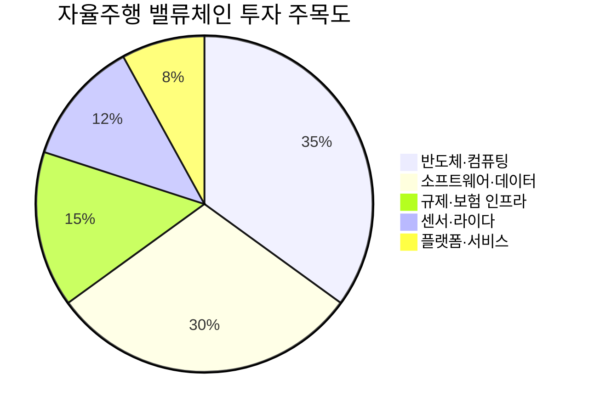

# 📊 모닝 브리핑 — 2026년 5월 5일 (화)

> **🔴 Risk-Off (미국) / 🟢 Risk-On (한국) — 지정학 충격과 한국 외국인 자금 유입의 디커플링**
> - **매크로**: WTI +4.39% 급등 (지정학), 원/달러 1,462.8원 (-20.5원 급락)
> - **리스크**: 미국 3대 지수 하락, VIX 상승 / 코스피 +5.12% 사상 최고치 경신
> - **시그널**: ① 호르무즈 리스크 → 에너지·방산 재편 ② 外人 3조 순매수 → 코리아 디스카운트 해소 모멘텀

---

## 시장 스냅샷

### 주요 지수
| 지수 | 종가 | 등락 | 52주 위치 |
|------|------|------|----------|
| S&P 500 | 7,200.75 | -29.37 (-0.4%) | ███████████████████▋ 98% (5,607–7,230) |
| 나스닥 | 25,067.80 | -46.64 (-0.2%) | ███████████████████▉ 99% (17,690–25,114) |
| 다우존스 | 48,941.90 | -557.37 (-1.1%) | █████████████████▍░░ 87% (40,829–50,188) |
| 코스닥 | 1,192.35 | -27.91 (-2.3%) | ██████████████████▋░ 93% (714–1,226) |
| 닛케이 225 | 59,513.12 | +228.20 (+0.4%) | ███████████████████▏ 96% (36,452–60,537) |

### 매크로/원자재/크립토
| 항목 | 값 | 변동 | 52주 위치 |
|------|-----|------|----------|
| 미국 10Y | 4.45% | +0.07%p | ███████████████▍░░░░ 77% (4–5) |
| 미국 2Y | 3.59% | +0.02%p | ██▏░░░░░░░░░░░░░░░░░ 11% (4–4) |
| DXY | 98.48 | +0.27 (+0.3%) | ████████▏░░░░░░░░░░░ 41% (96–102) |
| USD/KRW | 1,476.15 | +2.14 (+0.1%) | ███████████████▎░░░░ 76% (1,348–1,516) |
| USD/JPY | 157.21 | +0.24 (+0.2%) | ████████████████▋░░░ 83% (142–160) |
| WTI 원유 | $105.05 | +3.1% | █████████████████▎░░ 86% (55–113) |
| 금 (Gold) | $4,529.90 | -2.2% | ████████████▋░░░░░░░ 63% (3,181–5,318) |
| 은 (Silver) | $73.26 | -3.5% | █████████▉░░░░░░░░░░ 50% (32–115) |
| BTC | $80,189 | +2.1% | █████▋░░░░░░░░░░░░░░ 28% (62,702–124,753) |
| VIX | 18.29 | +1.30 (+7.7%) | █████▌░░░░░░░░░░░░░░ 27% (13–31) |
| 10Y-2Y 스프레드 | 0.86%p | +0.05%p | — |

---
## 시장 센티먼트

<div style="background:#e0e0e0;border-radius:8px;overflow:hidden;margin:8px 0;font-size:0.9em">
<div style="display:flex;border-radius:8px;overflow:hidden">
<div style="background:#F44336;width:60%;padding:6px 10px;color:white;white-space:nowrap">🔴 Risk-Off (미국) 60%</div>
<div style="background:#4CAF50;width:40%;padding:6px 10px;color:white;white-space:nowrap;text-align:right">🟢 Risk-On (한국) 40%</div>
</div>
</div>

**핵심 판독**: UAE 미사일 피격 발표와 호르무즈 해협 무력 충돌 보도로 중동 지정학 리스크가 단숨에 재점화됐습니다. 미국 증시는 애플 호실적에도 불구하고 지정학 충격과 연준 매파 신호에 눌려 하락 마감하며 전형적인 Risk-Off 패턴을 보였습니다. 반면 한국 시장은 외국인 통합계좌 규제 폐지 기대감이라는 구조적 이벤트가 겹치며 글로벌 Risk-Off와 완전히 반대 방향으로 움직이는 이례적 디커플링을 연출했습니다.

**변곡 촉매**:
- 🔴 **다운**: 이란의 추가 군사 행동 또는 호르무즈 해협 봉쇄 위협 → 유가 $90 돌파, 글로벌 인플레 우려 재점화
- 🟢 **업**: 외국인 통합계좌 규제 폐지 공식 확정 발표 → 코스피 외국인 자금 유입 가속화

---

## 섹터별 센티먼트

| 섹터 | 센티먼트 | 한줄 평가 |
|------|---------|----------|
| 에너지·정유 | 🟢 강세 | 호르무즈 리스크로 WTI +4.39% 급등, 단기 수혜 집중 |
| 방산·안보 | 🟢 강세 | 중동 긴장 재고조 → 글로벌 방산 예산 확대 논의 재부상 |
| 반도체·IT | 🟡 혼조 | 애플 호실적 긍정적이나 연준 매파 기조 + 지정학 리스크가 밸류에이션 압박 |
| 한국 증시 전반 | 🟢 강세 | 외국인 3조 순매수·코스피 사상 최고치, 규제 완화 기대감이 단기 촉매 |
| 자율주행·모빌리티 | 🟡 관망 | 캘리포니아 자율주행 트럭 허용 등 규제 완화 진전, 상용화 속도는 여전히 미지수 |
| 항공·물류 | 🔴 주의 | 유가 급등 → 연료비 부담 확대, 중동 노선 리스크 가시화 |
| 금융·은행 | 🔴 주의 | 연준 금리 인상 가능성 논의 재등장 → 크레딧 스프레드 확대 압력 |

---

## 오버나이트 핵심 이벤트

### 1. 중동 지정학 리스크 재점화 — 호르무즈 해협 무력 충돌

- **요약**: UAE가 이란으로부터 미사일 공격을 받았다고 발표했으며, 미국과 이란이 호르무즈 해협 인근에서 무력을 행사했습니다.
- **So What**: 호르무즈 해협은 전 세계 원유 수출의 약 20%가 통과하는 '에너지 대동맥'으로, 이 지역의 불안정은 즉각적인 공급 차질 우려로 이어집니다. WTI 선물이 4.39% 급등한 것이 이를 반영하며, 고금리 + 고유가 조합은 연준의 인플레이션 제어를 더욱 복잡하게 만드는 2차 효과를 유발합니다.
- **크로스 임팩트**: 에너지 섹터 강세, 항공·물류·화학 비용 압박, 안전자산(금·달러) 선호 강화

### 2. 연준 매파 기조 — 금리 인상 가능성 재등장

- **요약**: 연준은 기준금리를 동결했지만, 인플레이션 우려를 이유로 금리 인상 가능성까지 논의가 전환되고 있다는 매파적 신호를 발신했습니다.
- **So What**: 시장이 기대했던 금리 인하 경로가 불투명해지며 장기 국채 금리 상승 압력이 높아졌습니다. 성장주·기술주의 밸류에이션 할인율이 재차 올라가는 환경이 되며, 여기에 유가 급등까지 더해지면 스태그플레이션 우려가 수면 위로 올라올 수 있습니다.
- **크로스 임팩트**: 성장주 밸류에이션 압박, 금리 민감 섹터(리츠·유틸리티) 하락, 달러 강세 지속

### 3. 코스피 사상 최고치 경신 — 外人 3조 순매수·환율 급락

- **요약**: 5월 4일 코스피는 외국인의 3조 원 순매수(기관도 동반 매수)에 힘입어 +5.12% 급등, 사상 최고치를 경신하며 7,000 돌파를 목전에 두었습니다. 원/달러 환율은 1,462.8원으로 하루 20.5원 급락했습니다.
- **So What**: 외국인 통합계좌 규제 폐지 기대감이 구조적 수급 변화를 이끌었습니다. 단순한 단기 모멘텀을 넘어, 외국인 접근성 개선이 한국 증시의 장기 디스카운트 해소로 이어지는지 여부가 관건입니다. 환율 급락은 외국인의 원화 자산 환차손 부담을 줄여 추가 유입의 선순환 구조를 형성합니다.
- **크로스 임팩트**: 코스피 대형주(삼성전자·SK하이닉스) 직접 수혜, 원화 강세로 수출주 역풍 일부 발생 가능

### 4. 애플 2분기 실적 — 예상치 상회, 시장 하락 방어 실패

- **요약**: 애플이 예상치를 상회하는 2분기 실적과 매출을 발표했으나, 지정학 리스크 확대로 나스닥·S&P 500 전반의 하락을 막지 못했습니다.
- **So What**: 빅테크의 견조한 실적이 시장 하락을 막지 못했다는 사실은 현재 시장의 하락 드라이버가 '펀더멘털'이 아닌 '매크로·지정학'임을 명확히 보여줍니다. 즉, 실적으로 방어되지 않는 국면이라는 뜻이며, 리스크 프리미엄의 주도권이 실적에서 매크로로 넘어간 신호입니다.
- **크로스 임팩트**: 나스닥 기술주 단기 방어 심리, 다만 지정학 악재에 실적 프리미엄 희석

---

## 오늘의 일정

| 시간(한국) | 이벤트 | 중요도 | 관련 섹터/종목 |
|-----------|--------|--------|--------------|
| 장중 | 코스피 추가 상승 모멘텀 확인 (7,000선 돌파 여부) | ⭐⭐⭐⭐ | [[삼성전자]], [[SK하이닉스]], 코스피 대형주 |
| 장중 | 외국인 통합계좌 규제 폐지 관련 공식 발표 여부 | ⭐⭐⭐⭐⭐ | 코스피 전반, [[삼성전자]] |
| 미정 | 중동 지정학 상황 업데이트 (UAE·이란 추가 교전 여부) | ⭐⭐⭐⭐⭐ | 에너지, 방산, 항공 |
| 이번 주 | 미국 FOMC 관련 추가 연준 위원 발언 | ⭐⭐⭐⭐ | 기술주, 채권, 달러 |
| 이번 주 | 삼성전자 주식 대량보유 변동 후속 공시 확인 | ⭐⭐⭐ | [[삼성전자]] |

> [!warning] ⭐⭐⭐⭐⭐ 외국인 통합계좌 규제 폐지 — 시나리오 분기
> - **확정 발표**: 외국인 접근성 개선 → 코스피 추가 외국인 자금 유입, 7,000선 안착 시도
> - **발표 지연/불발**: 단기 차익 실현 매물 출회 → 상승분 일부 반납 가능성
> - **중동 악재 동시 발생**: 글로벌 Risk-Off와 충돌 → 외국인 자금 이탈 전환 여부 주목

---

## 테마 시그널

> [!abstract] 오늘의 테마: **자율주행의 진짜 게임체인저는 "기술"이 아니라 "법적 책임 소재"다**

### 왜 지금 이 테마가 중요한가?

지난 한 주 사이 자율주행 산업에 세 가지 사건이 동시에 터졌습니다.

1. **캘리포니아 DMV**: 운전자 없는 자율주행 대형 트럭의 도로 운행을 공식 허용
2. **테슬라 FSD**: 누적 주행거리 100억 마일 돌파 발표
3. **현대차**: 딥엑스·텔레칩스와 1조 원 규모 자율주행 반도체 'K-온디바이스 AI' 개발 논의

표면적으로는 기술이 빠르게 진보하고 있는 것처럼 보입니다. 그런데 전문가들은 냉담합니다. 테슬라 FSD 100억 마일이 레벨 4 무인 자율주행을 보장하지 않는다는 것입니다. 왜일까요?

---

### 자율주행 레벨 체계 — 투자자가 반드시 아는 기준

| 레벨 | 명칭 | 운전 주체 | 현황 |
|------|------|---------|------|
| L2 | 부분 자동화 | **인간** (시스템 보조) | 테슬라 오토파일럿, 현재 대부분 양산차 |
| L3 | 조건부 자동화 | **시스템** (인간 대기) | 벤츠 Drive Pilot 일부 허용, 상용화 초기 |
| L4 | 고도 자동화 | **시스템** (특정 구역 한정) | 웨이모 로보택시, 제한적 운영 중 |
| L5 | 완전 자동화 | **시스템** (모든 조건) | 아직 존재하지 않음 |

테슬라 FSD는 현재 **L2+** 수준입니다. 100억 마일의 데이터는 L2 시스템을 더 잘 훈련시키지, L4로의 도약을 자동으로 만들어주지 않습니다. 레벨 간 벽은 기술 문제이기도 하지만, 더 근본적으로는 **"사고 났을 때 누가 책임지는가"** 의 문제입니다.

---

### 진짜 병목: 기술이 아닌 '법적 책임의 이전'

<div style="border-left:4px solid #FF9800;padding-left:12px;margin:8px 0">
L2에서 L3로 넘어가는 순간 책임의 주체가 인간에서 시스템(제조사)으로 이동합니다. 이 임계점이 자율주행 상용화의 진짜 방벽입니다.
</div>

**L2와 L3의 결정적 차이:**

- **L2**: 사고 나면 → 운전자 책임. 제조사는 "운전자가 감시 의무를 소홀히 했다"고 주장 가능
- **L3**: 사고 나면 → 제조사 책임. 시스템이 운전 주체이므로 결함 제조물 책임 발생 가능

이것이 왜 테슬라가 FSD를 L2라고 고집하는지 설명합니다. 법적·보험적 책임을 운전자에게 유지하는 한, 아무리 뛰어난 시스템이어도 제조사 리스크는 제한됩니다.

**캘리포니아의 자율주행 트럭 허용**이 혁명적인 이유도 여기 있습니다. 이 규정은 명시적으로 "운전자 없는 트럭"을 허용했다는 뜻이며, 이는 사고 발생 시 법적 책임이 소프트웨어/하드웨어 제조사에게 귀속되는 구조를 주 정부가 공식 인정했다는 의미입니다.

---

### 국내 규제 현실: 85건의 FSD 불법 활성화가 말해주는 것

국내에서 미국산 테슬라 일부 모델을 제외하면 FSD 사용이 불법이라는 사실, 그리고 이를 무단으로 활성화하려는 시도가 85건이나 발생했다는 것은 두 가지를 시사합니다:

1. **수요는 존재한다** — 소비자는 더 높은 레벨의 자율주행을 원한다
2. **규제가 기술보다 느리다** — 한국의 자율주행 규제 프레임워크는 미국·유럽 대비 뒤처져 있으며, 이 격차가 시장 개화를 지연시키고 있다

---

### 투자 프레임: 자율주행 밸류체인 어디에 베팅할 것인가



| 세그먼트 | 투자 매력 | 핵심 근거 | 리스크 |
|---------|---------|---------|------|
| 🟢 차량용 반도체 | 높음 | L3+ 진입 시 컴퓨팅 파워 수요 폭증, 현대차-딥엑스 국산화 시도 | 개발 일정 지연 |
| 🟢 데이터·소프트웨어 | 높음 | 주행 데이터 축적 = 경쟁 해자, 테슬라 100억 마일의 진짜 자산 | 프라이버시 규제 |
| 🟡 라이다·센서 | 중간 | L4 필수 부품이나 카메라-only 진영과 경쟁 중 | 기술 표준 미확정 |
| 🟡 완성차 OEM | 중간 | 플랫폼 소유 강점, 법적 책임 부담이 L3 상용화 발목 | 제조물 책임 리스크 |
| 🔴 로보택시 서비스 | 관망 | 웨이모 시위 등 사회적 수용성 아직 낮음, 수익화 불투명 | 네오 러다이트 리스크 |

---

### 모니터링 포인트

> [!tip] 자율주행 투자의 진짜 트리거는 이것을 확인하세요
> 1. **주요국 L3 책임법 입법 진행 상황** — 독일·미국·한국 순으로 입법이 완성될 때마다 산업 임계점 돌파 신호
> 2. **보험사의 자율주행 전용 상품 출시** — 보험 산업이 리스크를 인수한다는 것 = 사고 확률 통계가 보험계리적으로 허용 가능해진 시점
> 3. **테슬라의 FSD 레벨 공식 재분류** — L2→L3 선언은 법적 책임 수용의 선언, 기업 리스크의 구조적 변화
> 4. **현대차-딥엑스 K-온디바이스 AI 성과** — 국산 자율주행 반도체 양산 시 밸류체인 재편 신호

---

## 대가의 시선

> [!note] [클래식]
> "투자에서 가장 위험한 네 단어는 '이번에는 다르다(This time is different)'이다."
> — **존 템플턴 경(Sir John Templeton)**, 템플턴 성장 펀드 창업자 [클래식]

**맥락**: 자율주행, 코스피 사상 최고치, 유가 급등이 동시에 벌어지는 오늘처럼 "모든 것이 전례 없이 빠르게 변하는 것 같은" 날, 시장 참여자들은 과거의 패턴이 더 이상 적용되지 않는다고 믿고 싶어 합니다.

**투자 함의**: 오늘 코스피 +5.12%라는 숫자는 분명 이례적이며 흥분을 자아냅니다. 그러나 외국인 통합계좌 규제 폐지 기대감이 아직 '공식 확정'이 아닌 상황에서, "이번에는 진짜 구조적 변화"라는 내러티브에 과도하게 올라타기 전에 한 번 더 물어볼 필요가 있습니다. 단기 모멘텀과 구조적 변화는 다릅니다. 규제 폐지가 확정되고 실제 외국인 자금이 지속적으로 유입되는 것이 확인될 때까지, 흥분을 이기는 규율이 더 중요합니다.

---

## 투자 레슨

> [!abstract] 오늘의 레슨: **내러티브 편향(Narrative Bias) — 우리는 숫자가 아니라 이야기를 믿는다, 그리고 그것이 시장을 움직인다**

### 왜 똑똑한 투자자가 "좋은 이야기"에 속는가

인간의 뇌는 데이터보다 이야기를 22배 더 잘 기억합니다(스탠퍼드대 연구). 투자 세계에서 이것은 단순한 심리적 약점이 아닙니다. **내러티브가 실제로 자산 가격을 움직이고, 가격이 움직이면 내러티브가 현실처럼 느껴지는 자기강화 루프**가 작동합니다.

노벨 경제학상 수상자 로버트 실러(Robert Shiller)는 그의 저서 *Narrative Economics*(2019)에서 이렇게 말합니다: "경제 내러티브는 바이러스처럼 전파되며, 때로는 실제 경제보다 경제를 더 많이 움직인다."

---

### 내러티브 편향의 작동 메커니즘

<div style="border-left:4px solid #2196F3;padding-left:12px;margin:8px 0">
내러티브 편향이란, 복잡한 현실을 단순한 인과 스토리로 환원하려는 인간의 본능입니다. 그 스토리가 매력적일수록, 반증 데이터를 무시하는 경향이 강해집니다.
</div>

**루프의 구조:**

```
매력적인 내러티브 등장
        ↓
투자자 자금 유입 → 가격 상승
        ↓
"봐라, 내러티브가 맞잖아" → 내러티브 강화
        ↓
더 많은 자금 유입 → 더 큰 상승
        ↓
(반증 이벤트 발생 시) 내러티브 붕괴 → 폭락
```

---

### 역사적 사례: 내러티브가 만든 버블과 폭락

| 시대 | 내러티브 | 현실 | 결과 |
|------|---------|------|------|
| 1999년 닷컴 버블 | "인터넷은 모든 것을 바꾼다, 이익은 나중에 나온다" | 대부분 수익 모델 없음 | 나스닥 -78% |
| 2006년 미국 부동산 | "집값은 절대 전국적으로 하락하지 않는다" | 모기지 부실 누적 | 2008 금융위기 |
| 2021년 밈 주식 | "개미가 월가를 이긴다, 쇼트 스퀴즈는 계속된다" | 기업 펀더멘털 무관 | 게임스탑 -90% |
| 2021년 크립토 | "디지털 금이다, 기관이 다 살 것이다" | 규제·유동성 변화 | BTC -75% |

공통점은 하나입니다: **각 내러티브는 당시에는 완전히 논리적으로 들렸습니다.**

---

### 오늘 시장이 바로 이 원칙의 살아있는 사례

오늘 코스피 +5.12%를 만든 내러티브를 해부해봅니다:

**"외국인 통합계좌 규제 폐지 → 글로벌 외국인 자금 본격 유입 → 코리아 디스카운트 해소 → 코스피 선진국 지수 편입 → 구조적 상승"**

이 내러티브는 매력적입니다. 논리적 연결고리도 있습니다. 그런데 내러티브 편향을 경계하는 투자자라면 반드시 물어야 할 질문이 있습니다:

<div style="display:flex;border-radius:8px;overflow:hidden;margin:8px 0;font-size:0.85em">
<div style="background:#4CAF50;width:50%;padding:6px 8px;color:white">🟢 내러티브를 지지하는 사실</div>
<div style="background:#F44336;width:50%;padding:6px 8px;color:white;text-align:right">🔴 내러티브를 의심해야 할 사실</div>
</div>

| 🟢 지지 요인 | 🔴 의심 요인 |
|------------|------------|
| 실제로 외국인 3조 순매수 발생 | 규제 폐지가 아직 공식 확정 아님 |
| 원/달러 환율 급락 (환차손 감소) | 글로벌 Risk-Off 환경 (미국 시장 하락 중) |
| 기관도 동반 매수 | 단 하루 +5%는 역사적으로 단기 과열 신호 |
| 코리아 디스카운트 구조적 문제 존재 | 지정학 리스크 (유가 급등) 동시 악재 |

---

### 내러티브 편향을 방어하는 3가지 실천법

> [!tip] 내러티브 편향 방어 체크리스트
> **1. "이 이야기가 없었다면 살 것인가?"** 테스트
> 내러티브를 제거하고 순수하게 밸류에이션·이익·현금흐름만 보았을 때 매력적인가?
>
> **2. 반증 데이터를 적극적으로 찾아라**
> 내러티브를 지지하는 근거 찾기는 뇌가 자동으로 한다. 의식적으로 반증 데이터를 수집해야 한다.
>
> **3. 포지션 사이징으로 '확신 비용'을 통제하라**
> 내러티브가 매력적일수록 포지션을 크게 잡고 싶어진다. 바로 그 충동이 경고 신호다. 확신이 클수록 포지션 한도를 더 엄격히 설정하라.

---

### 실러의 내러티브 전염 모델 — 투자에의 적용

실러는 내러티브의 전염을 역학(epidemiology) 모델로 분석했습니다. 내러티브도 바이러스처럼 **감염률 R₀**가 있습니다. SNS·유튜브·커뮤니티를 통해 내러티브가 빠르게 전파될수록 R₀가 높아지고, 단기 가격 상승이 가팔라집니다.

**그러나 R₀가 높을수록 내러티브 붕괴 속도도 빠릅니다.** 바이러스가 빠르게 퍼지면 빠르게 소멸하듯, 내러티브도 마찬가지입니다.

오늘 코스피 급등을 이끈 "외국인 통합계좌 규제 폐지" 내러티브는 현재 R₀가 매우 높은 상태입니다. 이것이 뜻하는 바: **확정 이벤트 전후로 'buy the rumor, sell the fact'의 전형적 패턴이 나타날 가능성**을 반드시 시나리오에 넣어두어야 합니다.

---

**오늘 실천 방법**: 오늘 포트폴리오에서 '좋은 이야기 때문에 보유하고 있는' 종목을 하나 꺼내어, 내러티브 없이 순수하게 현재 밸류에이션이 정당한지 5분간 검토해보세요. "이야기가 없어도 살 자산인가?"라는 질문 하나가 가장 강력한 내러티브 방어막입니다.

---

## 오늘 하나만 기억한다면

> [!verdict] 오늘 하나만 기억한다면
> **"코스피 사상 최고치의 이야기는 매력적이다 — 하지만 규제 폐지 '기대감'과 '확정'은 다르고, 좋은 내러티브는 나쁜 진입 타이밍을 정당화하지 않는다."**