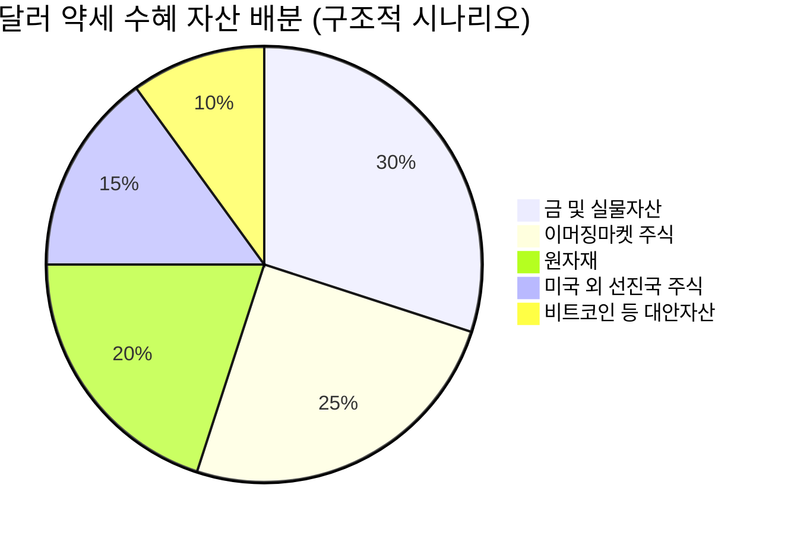

# 📊 모닝 브리핑 — 2026년 5월 7일 (목)

> **🟢 Risk-On** — 지정학 완화 + AI 어닝 서프라이즈의 이중 점화
> - **매크로**: 10Y 국채 금리 동결 국면 지속, 달러 강세 완화 기대, 유가 급락
> - **리스크**: S&P 500 · 나스닥 사상 최고치 경신, VIX 하락
> - **시그널**: AMD 데이터센터 어닝 서프라이즈 → AI 반도체 수요 재확인 / 코스피 7,000 돌파 → 외국인 순매수 사이클 진입

---

## 시장 스냅샷

### 주요 지수
| 지수 | 종가 | 등락 | 52주 위치 |
|------|------|------|----------|
| S&P 500 | 7,365.12 | +105.90 (+1.5%) | ████████████████████ 100% (5,631–7,365) |
| 나스닥 | 25,838.94 | +512.81 (+2.0%) | ████████████████████ 100% (17,738–25,839) |
| 다우존스 | 49,910.59 | +612.34 (+1.2%) | ███████████████████▍ 97% (41,114–50,188) |
| 코스피 | 6,936.99 | +338.12 (+5.1%) | ████████████████████ 100% (2,574–6,937) |
| 코스닥 | 1,213.74 | +21.39 (+1.8%) | ███████████████████▌ 98% (714–1,226) |
| 닛케이 225 | 59,513.12 | +228.20 (+0.4%) | ███████████████████▏ 96% (36,452–60,537) |

### 수급 동향
| 주체 | 코스피 | 코스닥 |
|------|--------|--------|
| 외국인 | 🟢 +31,085억 | 🔴 -615억 |
| 기관 | 🔴 -22,894억 | 🔴 -5,435억 |
| 개인 | 🔴 -5,715억 | 🟢 +6,105억 |

### 매크로/원자재/크립토
| 항목 | 값 | 변동 | 52주 위치 |
|------|-----|------|----------|
| 미국 10Y | 4.36% | -0.06%p | ████████████▌░░░░░░░ 63% (4–5) |
| 미국 2Y | 3.60% | +0.00%p | ██▍░░░░░░░░░░░░░░░░░ 12% (4–4) |
| DXY | 98.01 | -0.47 (-0.5%) | ██████▌░░░░░░░░░░░░░ 32% (96–102) |
| USD/KRW | 1,445.30 | -30.75 (-2.1%) | ███████████▌░░░░░░░░ 58% (1,348–1,516) |
| USD/JPY | 156.34 | -0.85 (-0.5%) | ███████████████▋░░░░ 78% (142–160) |
| WTI 원유 | $95.82 | -6.3% | ██████████████░░░░░░ 70% (55–113) |
| 금 (Gold) | $4,708.10 | +3.3% | ██████████████▎░░░░░ 71% (3,181–5,318) |
| 은 (Silver) | $77.93 | +6.6% | ███████████░░░░░░░░░ 55% (32–115) |
| BTC | $81,324 | +0.5% | ██████░░░░░░░░░░░░░░ 30% (62,702–124,753) |
| VIX | 17.39 | +0.01 (+0.1%) | ████▌░░░░░░░░░░░░░░░ 22% (13–31) |
| 10Y-2Y 스프레드 | 0.76%p | -0.06%p | — |

---
## 시장 센티먼트

<div style="background:#e0e0e0;border-radius:8px;overflow:hidden;margin:4px 0"><div style="background:#4CAF50;width:82%;padding:4px 8px;color:white;font-size:0.9em;white-space:nowrap">🟢 Risk-On 82%</div></div>
<div style="background:#e0e0e0;border-radius:8px;overflow:hidden;margin:4px 0"><div style="background:#F44336;width:18%;padding:4px 8px;color:white;font-size:0.9em;white-space:nowrap;min-width:60px">🔴 Risk-Off 18%</div></div>

> [!tip] 핵심 판독
> 미-이란 협상 기대로 유가가 급락하며 인플레이션 우려가 완화됐고, AMD 실적이 AI 수요 내러티브를 재점화했다. 코스피의 7,000선 돌파는 단순 기술적 이벤트가 아니라 외국인 자금의 구조적 재배치 신호로 읽힌다. 당분간 Risk-On 기조가 유지될 환경이나, 협상 결렬 시 유가의 반등 속도를 경계해야 한다.

**변곡 촉매**:
- 🔴 **다운**: 미-이란 협상 공식 결렬 → 유가 급반등 → 인플레 재점화 → 금리 인상 기대 재확산
- 🟢 **업**: 호르무즈 해협 공식 재개방 합의 + 이번 주 美 실업수당 청구건수 예상치 하회 → 연준 보험성 인하 기대 재부상

---

## 섹터별 센티먼트

| 섹터 | 센티먼트 | 한줄 평가 |
|------|---------|----------|
| 반도체 / AI | 🟢 강세 | AMD 데이터센터 매출 급증 → HBM·GPU 수요 재확인, 코스피 외국인 순매수 핵심 타깃 |
| 에너지 | 🔴 약세 | 유가 7% 급락, 미-이란 협상 기대 지속 시 공급 과잉 우려로 추가 하락 여지 |
| 빅테크 / 클라우드 | 🟢 강세 | AI 인프라 투자 확대 기대, 데이터센터 수요 강세로 수혜 지속 |
| 크립토 / 디지털자산 | 🟢 강세 | 비트코인 강세 + 현물 ETF 자금 유입, 지정학 완화가 위험선호 심리 뒷받침 |
| 방산 | 🟡 관망 | 지정학 완화 기대로 단기 조정 가능, 구조적 방산 예산 증가 기조는 유효 |
| 정유 / 화학 | 🔴 약세 | 원유 가격 급락 직격탄, 정제마진 압박 우려 |
| 내수 / 소비 (한국) | 🟡 관망 | 코스피 상승의 자산효과 기대 vs 한국은행 금리 인상 시그널로 소비 위축 리스크 병존 |

---

## 오버나이트 핵심 이벤트

### 1. 미국 증시 사상 최고치 경신 — AI 어닝과 유가 하락의 이중 엔진
- **요약**: S&P 500과 나스닥이 유가 급락 및 AI 기업 실적 호조에 힘입어 사상 최고치를 경신하며 마감했다.
- **So What**: 유가 하락은 기업 원가 부담 완화와 인플레이션 우려 후퇴를 동시에 의미한다. 여기에 AMD 어닝 서프라이즈가 AI 수요 내러티브를 재확인하면서 기술주 프리미엄이 재팽창했다. 두 재료가 동시에 점화된 것이 지수 상승의 질을 높인다.
- **크로스 임팩트**: 기술주 전반 🟢, 에너지 섹터 🔴, 달러 약세 압력으로 신흥국 자산 🟢

### 2. AMD 실적 어닝 서프라이즈 — 데이터센터 매출 급증으로 주가 16% 급등
- **요약**: [[AMD]]가 강력한 분기 실적을 발표하며 데이터센터 매출의 급증을 확인했고, 주가가 단일 세션에서 16% 급등했다.
- **So What**: AMD의 데이터센터 강세는 Nvidia 중심으로 해석되던 AI 반도체 수혜가 AMD로 확산됨을 입증한다. AI 가속기 시장의 경쟁 구도가 성숙 단계로 접어들고 있다는 신호이며, HBM을 공급하는 [[SK하이닉스]] 등 메모리 기업에 직접적 수요 재확인이 된다. 한국 반도체주 외국인 순매수의 이론적 배경을 강화한다.
- **크로스 임팩트**: [[삼성전자]], [[SK하이닉스]] 🟢, 클라우드 인프라 기업 🟢, AI 경쟁사 인텔 🔴

### 3. 미-이란 평화 협상 기대감 — 유가 7% 급락
- **요약**: 호르무즈 해협 재개방 합의 가능성이 부상하며 국제 유가가 약 7% 급락했다.
- **So What**: 유가 하락은 단기적으로 인플레이션 압력 완화 → 연준의 긴축 부담 경감 → 채권 금리 안정화의 경로를 만든다. 그러나 협상은 아직 기대 단계이며, 결렬 시 유가의 급반등은 오히려 현재보다 더 큰 인플레이션 쇼크로 작용할 수 있다. 에너지 섹터는 이 불확실성을 주가에 선반영 중이다.
- **크로스 임팩트**: 항공·물류·소비재 🟢, 정유·에너지 🔴, 방산 🟡

### 4. 코스피 7,000선 돌파 — 외국인 반도체 대형주 기록적 순매수
- **요약**: 코스피가 7,000선을 돌파하며 사상 최고치를 경신했다. 외국인 투자자들의 반도체 대형주 집중 매수가 주요 동력이었다.
- **So What**: 코스피 7,000선은 단순 심리적 저항이 아니다. 글로벌 AI 사이클에서 한국 반도체가 핵심 공급망으로 재평가받고 있다는 구조적 신호다. 외국인의 기록적 순매수는 패시브 자금(MSCI 리밸런싱 등)이 아닌 능동적 섹터 로테이션일 가능성이 높다. 코스피·코스닥 간 양극화(대형주 vs 소형주)가 심화되고 있는 점은 주목해야 할 리스크다.
- **크로스 임팩트**: [[삼성전자]], [[SK하이닉스]] 🟢, 코스닥 중소형주 🟡, 원화 강세 압력 🟢

---

## 오늘의 일정

| 시간(한국) | 이벤트 | 중요도 | 관련 종목 |
|-----------|--------|--------|----------|
| 오늘 밤 21:30 | 미국 주간 실업수당 청구건수 | ⭐⭐⭐⭐ | 전 종목, [[삼성전자]], [[SK하이닉스]] |
| 오늘 밤 중 | 美 연준 위원 발언 (연속 예정) | ⭐⭐⭐ | 채권, 달러, 기술주 전반 |
| 이번 주 내 | 미-이란 협상 관련 공식 발표 여부 | ⭐⭐⭐⭐⭐ | 에너지, 방산, 전 지수 |

> [!warning] ⭐⭐⭐⭐⭐ 미-이란 협상 결과 — 시나리오 분기
> - **🟢 합의 공식화**: 유가 추가 하락 → 인플레 우려 해소 → 기술주·소비주 추가 상승
> - **🟡 협상 지속**: 현 Risk-On 기조 유지, 변동성 제한적
> - **🔴 협상 결렬**: 유가 급반등 → 금리 인상 우려 재점화 → 기술주 밸류에이션 압박

---

## 테마 시그널

> [!abstract] 오늘의 테마: **달러 패권의 균열 — "탈달러화(De-dollarization)"는 과장인가, 구조적 현실인가**

### 왜 지금 이 테마인가

오늘 유가가 7% 급락하고 미-이란 협상이 부상했다. 표면적으로는 지정학 이슈지만, 그 이면에는 훨씬 더 큰 질문이 있다: *원자재 거래의 기축통화로서 달러의 지위는 얼마나 견고한가?*

최근 7일간 한국은행 금리 딜레마, 글로벌 중앙은행 통화정책 차별화가 집중 논의됐지만, 정작 이 모든 통화정책의 '닻' 역할을 하는 달러 패권의 구조적 변화는 아직 다루지 않았다.

---

### 달러 패권의 구조: 왜 세계는 달러를 써왔나

달러 패권(Dollar Hegemony)은 세 가지 자기강화 루프 위에 서 있다.

```
[오일달러 시스템]
원유 거래 → 달러 결제 → 산유국 달러 잉여 → 미국 국채 매입
         ↑                                            ↓
         ←←←←←← 달러 환류 (Petrodollar Recycling) ←←←←←
```

| 달러 패권의 기둥 | 내용 | 현재 상태 |
|----------------|------|----------|
| 기축통화 지위 | 전 세계 외환보유고 약 58% 달러 (2025년 IMF 기준) | 🟡 점진적 하락 중 (2000년 71%에서 감소) |
| 오일달러 시스템 | 원유 거래 달러 결제 관행 (1974년 사우디 합의) | 🟡 균열 진행 중 |
| SWIFT 네트워크 | 달러 결제망 지배 | 🔴 대안 결제망 부상 (CIPS 등) |
| 미국 국채 시장 | 전 세계 최대 안전자산 | 🟢 여전히 압도적 |

---

### 균열의 증거들: 과장인가 현실인가

**사례 1: 사우디아라비아의 위안화 원유 결제**
2023년 이후 사우디 아람코가 중국과의 거래 일부를 위안화로 결제하기 시작했다. 1974년 오일달러 합의 이후 최초의 균열이다. 비중은 아직 미미하지만, 50년 된 관행이 깨지기 시작했다는 상징성이 크다.

**사례 2: BRICS의 대안통화 논의**
러시아 제재 이후 BRICS 국가들의 달러 대안 모색이 가속화됐다. 러시아·중국 간 무역의 90% 이상이 이미 비달러 통화로 결제된다. 단, BRICS 공동통화는 아직 논의 단계다.

**사례 3: 중앙은행의 금 매입 급증**
2022~2025년 글로벌 중앙은행의 금 매입량이 사상 최고 수준을 지속했다. 이는 달러 자산에 대한 암묵적 헤지다.

> [!note] 그러나 달러를 대체할 단일 통화는 없다
> 탈달러화 논의의 가장 큰 함정은 "달러 대신 무엇을?"이라는 질문에 답이 없다는 점이다. 유로는 분절된 재정시스템, 위안화는 자본시장 폐쇄성, 금은 유동성 한계가 있다. 탈달러화는 달러의 붕괴가 아니라 **달러 지배력의 점진적 희석**에 가깝다.

---

### 오늘의 이벤트와 연결: 유가와 달러의 관계

오늘 미-이란 협상 기대로 유가가 7% 급락했다. 이것이 달러 패권 테마와 어떻게 연결되는가?

<div style="border-left:4px solid #FF9800;padding-left:12px;margin:8px 0">
이란 핵합의 복원 또는 호르무즈 재개방 시나리오에서, 이란은 원유 수출 대금의 일부를 유로나 위안화로 수취하는 구조를 선호한다. 미국의 제재 회피 목적이지만, 이것이 구조화되면 오일달러 시스템의 또 다른 예외 사례가 된다. 지정학 완화가 역설적으로 달러 패권 희석을 가속화하는 경로다.
</div>

---

### 투자 함의: 달러 약세 구조화 시 어떤 자산이 수혜를 보는가



| 자산 | 달러 약세 국면 반응 | 이유 |
|------|-------------------|------|
| 금([[GLD]]) | 🟢 강세 | 달러 가치 하락의 역수 관계 |
| 원자재 | 🟢 강세 | 달러 표시 원자재 가격 상승 효과 |
| 이머징마켓 주식 | 🟢 강세 | 외채 부담 완화, 자금 유입 |
| 한국 코스피 | 🟢 강세 | 원화 강세 + 외국인 자금 유입 (오늘의 7,000 돌파가 이 경로) |
| 미국 국채 (장기) | 🔴 약세 | 달러 약세 = 외국인 매력도 하락 |
| 비트코인 | 🟡 혼조 | 대안자산 서사 강화 vs 위험자산 성격 |

---

### 모니터링 포인트

> [!question] 달러 패권 테마를 추적하려면 무엇을 봐야 하나?
> 1. **DXY (달러 인덱스)**: 기술적으로 중요한 지지선 이탈 여부
> 2. **미국 국채 외국인 보유 비중**: 분기별 TIC 데이터 (재무부 발표)
> 3. **금 중앙은행 매입**: WGC(세계금협의회) 분기 보고서
> 4. **위안화 국제화 지수**: SWIFT RMB Tracker 월간 데이터
> 5. **오일달러 예외 사례 누적**: 비달러 원유 결제 건수/비중

---

## 대가의 시선

> "The dollar is our currency, but it's your problem."
> (달러는 우리의 통화지만, 그것은 당신들의 문제다.)
> — **존 코널리 (John Connally)**, 미국 재무장관, 1971년 브레턴우즈 붕괴 직후 G10 재무장관 회의에서 [클래식]

**맥락**: 닉슨 쇼크(1971년 금본위제 폐기) 직후, 유럽 각국이 달러화 가치 하락에 항의하자 코널리 재무장관이 유럽 파트너들에게 던진 발언이다. 달러 패권의 본질을 가장 솔직하게 드러낸 명언으로 역사에 남았다.

**투자 함의**: 이 발언은 55년이 지난 오늘도 유효하다. 달러가 약세로 전환될 때 미국 자산 투자자(달러로 사고파는 사람)는 문제를 느끼지 못하지만, 달러 외 통화를 가진 투자자에게는 환율이 수익률을 갈라놓는 결정적 변수가 된다. 코스피가 7,000을 돌파했지만, 달러 기준 수익률은 원화 강세·약세에 따라 전혀 다른 그림이 된다. 외국인 자금이 한국에 들어오는 것도, 달러 약세 환경에서 원화 자산의 실질 매력이 올라가기 때문이라는 렌즈로 읽어야 한다.

---

## 투자 레슨

> [!abstract] 오늘의 레슨: **앵커링 편향(Anchoring Bias) — "처음 본 숫자"가 당신의 판단을 지배하는 방식**

### 코스피 7,000은 '비싸다'는 느낌이 드는가?

오늘 코스피가 7,000선을 돌파했다. 많은 투자자들이 이 숫자를 보며 직관적으로 "너무 많이 올랐다", "지금 사기엔 늦었다"는 느낌을 받는다. 왜일까?

그것은 **앵커(Anchor)** 때문이다. 투자자마다 코스피에 대해 마음속에 새겨진 기준점이 있다. 2,000~3,000대 코스피를 '정상'으로 학습한 투자자에게 7,000은 이상하게 높아 보인다. 이것이 앵커링 편향의 핵심이다.

---

### 앵커링 편향이란 무엇인가

앵커링(Anchoring)은 행동경제학자 **다니엘 카너먼(Daniel Kahneman)과 아모스 트버스키(Amos Tversky)**가 1974년 논문에서 처음 체계화한 인지 편향이다.

> **핵심 메커니즘**: 인간은 어떤 결정을 내릴 때, 처음 접한 정보(닻, Anchor)에 과도하게 의존하고, 이후 정보를 그 닻에서 충분히 벗어나지 못한 채 조정한다.

카너먼의 원조 실험은 단순했다: 룰렛 휠을 돌려 무작위 숫자(10 또는 65)를 보여주고, 그 후 "UN 회원국 중 아프리카 국가의 비율은?"을 물었다. 룰렛 숫자가 65를 가리킨 그룹은 45%라 답했고, 10을 가리킨 그룹은 25%라 답했다. 완전히 무관한 숫자가 판단에 영향을 미친 것이다.

---

### 투자 세계에서 앵커링이 작동하는 세 가지 방식

**① 가격 앵커링 — "원래 이 주식은 얼마였어"**

| 상황 | 앵커 | 편향된 판단 |
|------|------|-----------|
| 삼성전자가 10만원에서 8만원으로 하락 | 10만원 (이전 고가) | "아직도 비싸다" / "더 떨어질 것이다" |
| 코스피 3,000 → 7,000 상승 | 3,000 (익숙한 레벨) | "너무 올랐다, 거품이다" |
| 신규 상장 공모가 5만원 | 5만원 (공모가) | 5만원 아래는 '싸다', 위는 '비싸다' |

**② 52주 최고/최저가 앵커링**

많은 투자자가 무의식적으로 52주 최고가를 '비쌈의 기준', 52주 최저가를 '쌈의 기준'으로 삼는다. 그러나 이것은 순전히 과거의 우연한 가격이 만든 닻이다. 기업의 본질가치와 무관하다.

실증 연구(George & Hwang, 2004)에 따르면 52주 최고가에 근접한 주식은 시장이 과소반응하는 경향이 있어, 오히려 52주 최고가 근처에 있는 주식이 이후 모멘텀이 더 강한 이상현상이 관찰됐다. 앵커링 때문에 투자자들이 '이미 많이 올랐다'며 추가 상승을 믿지 못하기 때문이다.

**③ 매입가 앵커링 — 처분효과의 뿌리**

<div style="border-left:4px solid #F44336;padding-left:12px;margin:8px 0">
투자자가 5만원에 산 주식이 3만원으로 떨어졌다. 이 투자자는 "5만원이 되면 팔겠다"고 생각한다. 그 5만원이 바로 앵커다. 그 주식의 적정가치가 2만원이든 10만원이든 관계없이, 오직 자신의 매입가가 판단 기준이 된다. 이것이 처분효과(Disposition Effect)의 인지적 뿌리다.
</div>

---

### 오늘 시장이 정확히 이 원리가 작동하는 사례다

코스피 7,000 돌파에서 앵커링을 걷어내고 생각해보자.

**질문 1**: 코스피 7,000이 비싼가, 싼가?
- 한국 대표기업들의 이익이 반도체 슈퍼사이클과 AI 수요로 구조적으로 상승했다면, PER 기준 적정 지수는 3,000대 시절과 달라진다.
- 7,000이라는 숫자 자체는 의미가 없다. **이익 대비 밸류에이션(PER, PBR)**이 기준이어야 한다.

**질문 2**: AMD 주가 16% 급등 — 이제 비싼가?
- 급등 이후 "이미 올랐다"는 앵커링이 발동한다. 그러나 데이터센터 매출 성장률과 AI 반도체 TAM(전체 가용 시장) 확장을 고려했을 때의 적정 가치는 어제의 주가 수준과 무관하다.

> [!tip] 핵심 인사이트
> 앵커링 편향을 극복하는 유일한 방법은 **가격이 아닌 가치(Value)로 판단하는 훈련**이다. "이 주식이 얼마였다"가 아니라 "이 기업이 향후 5년간 얼마를 벌 수 있는가"를 질문해야 한다.

---

### 앵커링 편향 자가 진단 체크리스트

<div style="background:#e0e0e0;border-radius:8px;overflow:hidden;margin:4px 0"><div style="background:#4CAF50;width:90%;padding:4px 8px;color:white;font-size:0.9em;white-space:nowrap">✅ "이 기업의 내재가치는 얼마인가?" 먼저 질문한다 90점</div></div>
<div style="background:#e0e0e0;border-radius:8px;overflow:hidden;margin:4px 0"><div style="background:#FF9800;width:55%;padding:4px 8px;color:white;font-size:0.9em;white-space:nowrap">⚠️ 52주 최고가/최저가를 판단 기준으로 자주 본다 55점</div></div>
<div style="background:#e0e0e0;border-radius:8px;overflow:hidden;margin:4px 0"><div style="background:#F44336;width:30%;padding:4px 8px;color:white;font-size:0.9em;white-space:nowrap;min-width:60px">🚨 "원래 이 주가가 얼마였는데..." 자주 말한다 30점</div></div>

---

### 오늘 실천 방법

오늘 코스피 7,000 또는 AMD 급등 뉴스를 보며 "너무 올랐다"는 생각이 들었다면, 딱 하나만 해보자:
**"내가 이 주식을 오늘 처음 본다면, 현재 이익 수준에서 이 가격이 타당한가?"**라고 다시 물어보는 것이다. 과거 가격 없이 오직 미래 이익으로만 평가했을 때 나오는 답이 앵커 없는 판단이다.

---

## 오늘 하나만 기억한다면

> [!verdict] 오늘 하나만 기억한다면
> **"코스피 7,000이 높아 보이는 건 지수가 비싸서가 아니라, 당신 머릿속 앵커가 3,000대이기 때문이다 — 가격이 아닌 가치로 판단하라."**