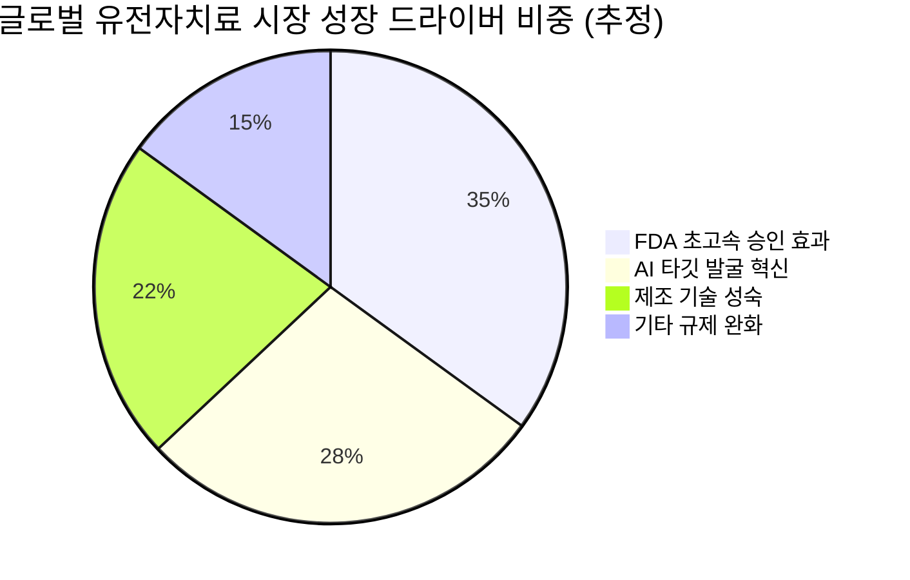
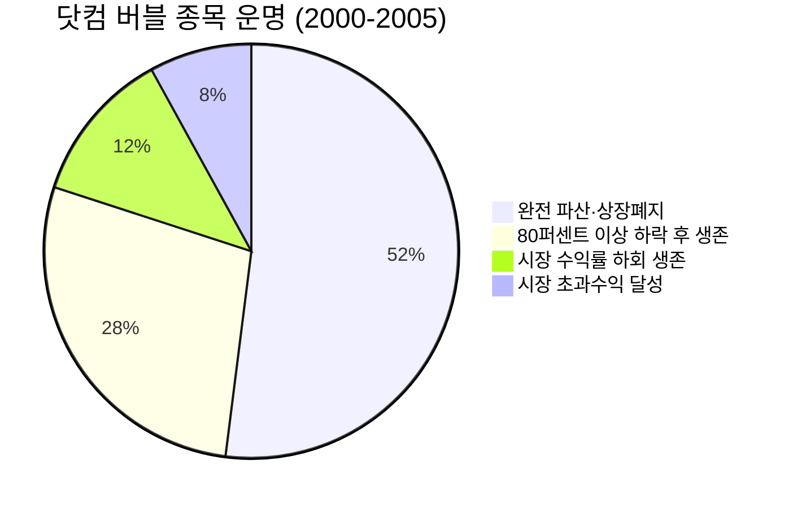

# 📊 모닝 브리핑 — 2026년 5월 12일 (화)

> **🔴 Risk-Off** — 중동 긴장 재고조 + 연준 매파 기조 복합 압박
> - **매크로**: 10년물 국채금리 · WTI유가 · 달러인덱스 → 📊 블록 참조
> - **리스크**: S&P500·나스닥 사상 최고치 근접 vs VIX 재반등 경계 → 📊 블록 참조
> - **시그널**: ① 유가 $100 회복 → 에너지·방산 재부각 ② 연준 매파 기조 → 금리 인하 기대 재후퇴

---

## 시장 스냅샷

### 주요 지수
| 지수 | 종가 | 등락 | 52주 위치 |
|------|------|------|----------|
| S&P 500 | 7,412.84 | +13.91 (+0.2%) | ████████████████████ 100% (5,803–7,413) |
| 나스닥 | 26,274.12 | +27.04 (+0.1%) | ████████████████████ 100% (18,708–26,274) |
| 다우존스 | 49,704.47 | +95.31 (+0.2%) | ██████████████████▉░ 94% (41,603–50,188) |
| 코스피 | 7,498.00 | +7.95 (+0.1%) | ████████████████████ 100% (2,592–7,498) |
| 코스닥 | 1,207.72 | +8.54 (+0.7%) | ███████████████████▎ 96% (714–1,226) |
| 닛케이 225 | 62,713.65 | -120.19 (-0.2%) | ███████████████████▉ 100% (36,986–62,834) |

### 수급 동향
| 주체 | 코스피 | 코스닥 |
|------|--------|--------|
| 외국인 | 🔴 -28,147억 | 🟢 +1,160억 |
| 기관 | 🔴 -458억 | 🔴 -1,630억 |
| 개인 | 🟢 +28,669억 | 🟢 +847억 |

### 매크로/원자재/크립토
| 항목 | 값 | 변동 | 52주 위치 |
|------|-----|------|----------|
| 미국 10Y | 4.41% | +0.05%p | ██████████████▎░░░░░ 71% (4–5) |
| 미국 2Y | 3.60% | +0.00%p | ██▍░░░░░░░░░░░░░░░░░ 12% (4–4) |
| DXY | 97.90 | +0.07 (+0.1%) | ██████░░░░░░░░░░░░░░ 30% (96–102) |
| USD/KRW | 1,475.45 | +20.66 (+1.4%) | ███████████████▏░░░░ 76% (1,348–1,516) |
| USD/JPY | 157.18 | +0.35 (+0.2%) | ████████████████▋░░░ 83% (142–160) |
| WTI 원유 | $98.15 | +2.9% | ██████████████▉░░░░░ 74% (55–113) |
| 금 (Gold) | $4,747.70 | +0.6% | ██████████████▋░░░░░ 73% (3,181–5,318) |
| 은 (Silver) | $87.03 | +8.3% | █████████████▎░░░░░░ 66% (32–115) |
| BTC | $81,757 | -0.5% | ██████▏░░░░░░░░░░░░░ 31% (62,702–124,753) |
| VIX | 18.38 | +1.19 (+6.9%) | █████▋░░░░░░░░░░░░░░ 28% (13–31) |
| 10Y-2Y 스프레드 | 0.81%p | +0.04%p | — |

---
## 시장 센티먼트

  

    
🔴 Risk-Off 60%

    
🟡 중립 25%

    
🟢 On 15%

  

**핵심 판독**: AI 랠리로 주요 지수가 사상 최고치를 경신했음에도, 중동 긴장 재고조(유가 $100 회복)와 FOMC 매파 기조가 맞물리며 시장은 고점 경계 모드에 진입했다. 기술주 강세와 매크로 리스크가 동시에 존재하는 **"좋은 뉴스가 나쁜 뉴스(Good News = Bad News)"** 국면으로, 투자 심리가 선택적으로 작동 중이다.

**변곡 촉매**:
- 🔴 다운: 이란 핵협상 완전 결렬 → 유가 추가 급등 → 인플레 재점화 시나리오
- 🟢 업: CPI·PPI 예상치 하회 발표 → 금리 인하 기대 재부활 + 리스크온 전환

---

## 섹터별 센티먼트

| 섹터 | 센티먼트 | 한줄 평가 |
|------|---------|----------|
| AI·반도체 | 🟢 강세 | S&P500·나스닥 최고치 주도, AI 수요 서사 지속 — 고밸류 부담이 유일한 꼬리리스크 |
| 에너지 | 🟢 강세 | WTI $100 회복, 중동 긴장 재고조로 단기 수혜 — 협상 재개 시 급반전 가능 |
| 방산·항공우주 | 🟢 강세 | 중동 긴장 → 방산 수요 증가 기대, 지정학 프리미엄 재부각 |
| 바이오·헬스케어 | 🟡 중립 | FDA 규제 혁신 + AI 신약개발 구조적 호재, 단기 모멘텀은 지정학에 묻힘 |
| 금융·은행 | 🟡 중립 | 매파 FOMC → 순이자마진 방어, 금리 인하 후퇴로 대출 수요 둔화 우려 혼재 |
| 소비재·리테일 | 🔴 주의 | 유가 상승 → 물가 재자극 우려, 고금리 지속 시 가처분소득 압박 |
| 채권·리츠 | 🔴 약세 | 금리 인하 기대 후퇴 + 유가발 인플레 재점화 → 장기채·리츠 듀레이션 리스크 확대 |

---

## 오버나이트 핵심 이벤트

### 1. AI 랠리 주도 — 미국 증시 사상 최고치 경신
- **요약**: 5월 10일 S&P500과 나스닥이 AI 붐을 동력으로 사상 최고치를 기록하며 마감. 빅테크 중심의 상승 흐름이 지수 전체를 견인.
- **So What**: 1차 효과 — AI 관련 대형주(빅테크, 반도체)로 자금 집중 현상 심화. 2차 효과 — 지수는 최고치이나 내부 섹터 간 양극화 확대, 유동성이 AI 테마 밖으로 흐르지 않는 "좁은 랠리(Narrow Rally)" 구조 경계.
- **크로스 임팩트**: [[NVDA]] [[MSFT]] [[AMD]] 직접 수혜 / 방어주·채권 상대 부진 지속

### 2. 중동 긴장 재고조 — 유가 $100 회복
- **요약**: 미-이란 핵협상 차질 및 트럼프 대통령 관련 발언으로 중동 지정학 리스크가 재점화, 브렌트유와 WTI가 $100선 복귀.
- **So What**: 1차 효과 — 에너지 섹터 단기 모멘텀 급등, 항공·물류·소비재는 비용 압박. 2차 효과 — 유가 $100 고착화 시 4월 CPI 둔화 흐름 역전 → 연준 금리 인하 시나리오 추가 후퇴, 시장 전반의 밸류에이션 재조정 압력.
- **크로스 임팩트**: [[XOM]] [[CVX]] 에너지주 수혜 / [[LUV]] [[AAL]] 항공주·소비재 비용 리스크

### 3. FOMC 매파 동결 + 4월 고용 서프라이즈 — "금리 인하는 멀었다"
- **요약**: 5월 4일 FOMC 금리 동결, 완화 관련 문구 삭제 및 연준 인사의 매파적 발언 지속. 이후 5월 8일 발표된 4월 비농업 고용이 시장 예상치를 상회하며 경제 견고함 재확인.
- **So What**: 1차 효과 — 금리 인하 시기 기대가 추가로 뒤로 밀림, 단기금리 상승 압력. 2차 효과 — 강한 고용 = 연준이 서두를 이유 없음 → "Higher for Longer" 내러티브 재강화. 성장주·리츠·채권에 지속적 부담, 달러 강세 편향 유지.
- **크로스 임팩트**: [[TLT]] [[IEF]] 장기채 약세 / 달러 강세 → 이머징 마켓 자금 유출 압력

---

## 오늘의 일정

| 시간(한국) | 이벤트 | 중요도 | 관련 종목 |
|-----------|--------|--------|----------|
| 오늘 밤 9:30 | 미국 4월 CPI 발표 | ⭐⭐⭐⭐⭐ | [[SPY]] [[QQQ]] [[TLT]] 전 종목 |
| 이번 주 목(15일) 밤 9:30 | 미국 4월 PPI 발표 | ⭐⭐⭐⭐ | [[XOM]] [[GLD]] 인플레 민감 자산 |
| 이번 주 목(15일) 밤 9:30 | 미국 주간 실업청구건수 | ⭐⭐⭐ | 경기 민감주 전반 |

> [!warning] ⭐⭐⭐⭐⭐ 오늘 밤 9:30 — 미국 4월 CPI, 시장 방향 결정타
> **시나리오 분기**:
> - 🟢 **예상 하회(디스인플레 확인)**: 금리 인하 기대 재부활 → 나스닥·리츠·채권 급등, 달러 약세
> - 🟡 **예상 부합**: 현 "Higher for Longer" 내러티브 유지, 변동성 제한적
> - 🔴 **예상 상회(인플레 재점화)**: 유가 $100 + 물가 서프라이즈 → 연준 추가 인상 우려 → 전 자산 급락 가능

---

## 테마 시그널

> [!abstract] 오늘의 테마: **FDA의 조용한 혁명 — AI·유전자치료·실시간 임상이 신약 개발의 시간축을 어떻게 바꾸고 있는가**

### 왜 지금인가 — 규제가 산업의 천장을 결정한다

제약·바이오 산업에서 규제는 단순한 허들이 아니다. **규제의 속도와 방향이 곧 산업의 성장 궤도**다. 지금 미국 FDA를 중심으로 글로벌 의약품 규제 체계가 수십 년 만에 가장 빠른 속도로 재편되고 있다. 이 변화는 단순히 "규제가 완화되었다"는 수준이 아니라, **신약 개발 패러다임 자체의 구조적 전환**을 의미한다.

### 구조 분석 — FDA 혁신의 3대 축

#### 1️⃣ AI 기반 실시간 임상시험(RTCT: Real-Time Clinical Trial)
기존 임상시험은 **단계별(Phase 1→2→3) 순차 진행** 구조로, 전체 신약 개발에 평균 10~15년, 수조 원이 소요됐다. RTCT는 이 패러다임을 깨는 시도다.

| 구분 | 기존 임상 | AI 기반 RTCT |
|------|----------|-------------|
| 데이터 수집 | 임상 종료 후 일괄 분석 | 실시간 스트리밍 분석 |
| 샘플 결정 | 사전 통계 설계 고정 | 베이지안 적응 설계로 유동 |
| 중간 종료 | 사전 계획된 중간분석만 | AI가 지속적으로 효능/부작용 모니터링 → 빠른 Go/No-Go |
| 개발 기간 단축 | 기준 | 30~50% 단축 가능 |

**투자 함의**: 임상 성공률이 올라가고 실패 비용이 줄면, 소형 바이오 벤처의 생존율이 올라간다. 임상 CRO(Contract Research Organization) 기업들이 AI 역량을 보유하느냐가 핵심 경쟁력이 된다.

#### 2️⃣ 동물실험 축소 → 오가노이드·인실리코 대체
FDA가 동물실험 의무를 단계적으로 완화하고 오가노이드(장기 유사체), 인실리코(컴퓨터 시뮬레이션) 모델을 대안으로 인정하기 시작했다. 이는 단순한 윤리적 진보가 아니다.

동물실험의 인간 예측 정확도는 약 60%. 오가노이드+AI 모델의 정확도는 빠르게 80~90%에 수렴 중이다. 정확도가 올라가면 임상 실패율이 낮아지고, 이는 곧 제약사의 R&D 효율 혁신으로 직결된다.

#### 3️⃣ 희귀질환 유전자 치료제 초고속 승인 트랙
희귀질환(Orphan Drug) + 유전자 치료제 조합에 대해 FDA는 소규모 임상 데이터만으로도 조건부 승인을 허용하는 방향으로 선회하고 있다. 이는 **"환자 수가 적어 임상 설계 자체가 불가능했던" 수천 개의 희귀질환 영역**을 투자 가능한 시장으로 만든다.

### 투자 함의 — 누가 이 변화의 수혜자인가

AI 신약개발 플랫폼 기업 — 수혜 강도 88/100

CRO(임상수탁) 기업 — 수혜 강도 76/100

대형 전통 제약사 — 수혜 강도 62/100

전통 CRO (AI 역량 없음) — 수혜 강도 38/100

**핵심 논리**: 규제가 빨라지면 **속도 경쟁에서 앞선 기업이 독점적으로 시장을 선점**한다. AI로 후보물질 발굴 시간을 수년에서 수개월로 줄이고, 실시간 임상으로 Phase 진입 속도를 높이는 기업이 이 변화의 최대 수혜자다.

> [!tip] 핵심 인사이트
> 규제 완화는 진입장벽을 낮추는 동시에, 속도 경쟁을 심화시킨다. AI 역량을 내재화한 바이오/신약 기업은 경쟁자가 기존 속도로 움직이는 동안 시장을 먼저 장악할 수 있다. 규제 혁신은 단순한 리스크 감소가 아니라, **속도라는 새로운 해자(Moat)**를 만들어내는 이벤트다.

### 모니터링 포인트

| 체크포인트 | 확인 방법 | 중요도 |
|-----------|----------|--------|
| FDA의 AI 임상 가이던스 업데이트 | FDA 공식 사이트, 업계 뉴스레터 | ⭐⭐⭐⭐⭐ |
| 소형 바이오 벤처의 조건부 승인 건수 추이 | 분기별 FDA 승인 리포트 | ⭐⭐⭐⭐ |
| 빅파마의 AI 스타트업 M&A 딜 | Bloomberg, BioPharma Dive | ⭐⭐⭐⭐ |
| CRO 기업 수주잔고 및 AI 역량 공시 | 각사 어닝콜 | ⭐⭐⭐ |
| 한국 식약처 패스트트랙 제도 변화 | 식약처 공시 | ⭐⭐⭐ |

---

## 대가의 시선

> "The most important thing in medicine is the pipeline — not the pipeline of drugs, but the pipeline of ideas."
> ("의학에서 가장 중요한 것은 파이프라인이다 — 약의 파이프라인이 아니라, 아이디어의 파이프라인.")
> — **Andy Grove**, 前 Intel CEO, *Only the Paranoid Survive* [클래식]

**맥락**: 앤디 그로브는 반도체 산업의 전략적 전환점을 다룬 저서에서, 혁신은 결국 "어떤 생각이 먼저 실현되느냐"의 속도 경쟁임을 강조했다. 이 발언은 원래 의료 분야를 대상으로 했지만, 실은 모든 기술 산업에 적용된다.

**투자 함의**: 오늘 FDA 혁신 테마와 정확히 맞닿아 있다. 현재 AI·바이오 융합 분야에서 벌어지는 경쟁의 본질은 "누가 더 좋은 분자를 가졌느냐"가 아니라 **"누가 더 빨리 아이디어를 검증하는 시스템을 가졌느냐"**다. FDA의 RTCT 도입과 초고속 승인 트랙은 이 '아이디어 파이프라인'의 속도를 결정적으로 바꾸는 구조적 변수다. 투자자는 개별 파이프라인 약물보다 **파이프라인을 빠르게 돌리는 플랫폼**에 주목해야 한다.

---

## 투자 레슨

> [!abstract] 오늘의 레슨: **생존자 편향(Survivorship Bias) — 우리가 보는 시장 역사는 살아남은 자들의 이야기뿐이다**

### 왜 이 레슨인가

오늘 시장에서 "AI 랠리로 나스닥이 사상 최고치"라는 뉴스를 보면서 많은 투자자는 자연스럽게 생각한다: *"AI 테마에 올라탄 사람들은 다 돈을 벌었겠구나."* 이 생각 자체가 생존자 편향의 교과서적 사례다. 우리는 살아남은 종목, 살아남은 테마, 살아남은 펀드만 본다. 망한 것들은 시야에서 사라졌기 때문에.

---

### 핵심 개념 — 본질부터

**생존자 편향(Survivorship Bias)**: 어떤 선택/과정을 통과해 살아남은 대상만 관찰하고, 탈락하거나 사라진 대상은 무시함으로써 발생하는 체계적 인식 오류.

이 개념을 투자에 처음 구조적으로 적용한 인물은 경제학자 **마이클 젠슨(Michael Jensen)**이다. 1968년 그는 펀드 성과 연구에서 지속적으로 시장을 이긴 액티브 펀드는 존재하지 않는다는 결론을 냈는데, 이 연구의 핵심 방법론적 기여가 바로 **"이미 청산된 펀드를 데이터에서 제외하면 안 된다"**는 것이었다.

---

### 역사적 사례 1: 2차 세계대전의 항공기

생존자 편향이라는 개념을 세상에 알린 가장 유명한 사례는 투자가 아닌 전쟁에서 나왔다.

2차 대전 당시 미군은 격추되지 않고 귀환한 폭격기에서 **총알 구멍이 많은 부위(날개, 동체)를 강화**하려 했다. 그러나 통계학자 **에이브러햄 월드(Abraham Wald)**는 반론을 제기했다:

"귀환한 비행기에 총알 구멍이 많은 곳은, 총에 맞아도 살아서 돌아올 수 있는 곳입니다. 우리가 봐야 할 것은 귀환하지 못한 비행기가 어디에 맞았는지입니다."

군은 **엔진 부위** — 귀환기에는 총알이 거의 없는 곳 — 를 강화했고 이후 생존율이 크게 올랐다. 살아남은 데이터만 보면 오히려 잘못된 결론을 내린다는 것을 보여준 결정적 사례다.

---

### 역사적 사례 2: 뮤추얼펀드의 성과 착시

| 연구 | 내용 | 핵심 발견 |
|------|------|----------|
| 젠슨(1968) | 미국 뮤추얼펀드 100개 분석 | 시장 초과수익을 지속적으로 낸 펀드 거의 없음 |
| Malkiel(1995) | 1982-1991년 생존 펀드 vs 전체 | 생존 펀드만 보면 연평균 +1.2%p 과대평가 |
| Elton et al.(1996) | 청산 펀드 포함 분석 | 투자자의 실제 평균 수익률은 지수보다 낮음 |

> [!warning] 리스크 경고
> "10년 수익률 최상위 펀드 목록"은 항상 생존자 편향을 내포한다. 그 10년 동안 청산된 수백 개의 펀드는 그 목록에 없다.

---

### 역사적 사례 3: AI 테마주의 생존자 편향

닷컴 버블(1999-2000)과 현재 AI 붐을 비교하면 생존자 편향이 더욱 선명해진다.

*추정 비율 — 실증 연구 기반 대략적 분포*

오늘 우리가 기억하는 닷컴 시대 종목은 Amazon, eBay, Google(2004 상장) 같은 극소수의 생존자다. **당시 "인터넷 기업에 투자했더니 수백 배 수익"이라는 내러티브는 정확히 생존자 편향이다.** 인터넷에 투자한 대부분의 투자자는 돈을 잃었다.

---

### 오늘 시장에 적용 — AI 랠리와 생존자 편향

현재 나스닥이 AI 붐으로 최고치를 경신하고 있다. 이 시점에 생존자 편향이 투자 판단을 왜곡하는 방식을 구체적으로 보자.

**Before(편향된 인식)**:
> "AI 관련 종목들이 다 올랐다. AI에 투자하면 성공한다."

**After(생존자 편향 제거 후)**:
> "AI 관련 종목 중 실제로 크게 오른 것은 극소수의 선도 기업들이다. 같은 시기 수많은 AI 스타트업, 테마 ETF, 소형 AI 관련주는 지수에 크게 못 미쳤거나 사라졌다."

| 인식 | 내용 |
|------|------|
| 우리가 보는 것 | NVDA, MSFT, META의 극적 주가 상승 |
| 우리가 못 보는 것 | 같은 기간 AI 테마로 상장폐지되거나 80% 하락한 수백 개 소형주 |
| 결론의 차이 | "AI 투자는 돈이 된다" vs "AI 생태계에서 극소수 승자가 대부분의 이익을 가져간다" |

---

### 생존자 편향을 제거하는 투자 프레임워크

**체크리스트 — 투자 전 반드시 물어야 할 질문들**:

- [ ] 이 테마에서 실패한 기업들은 왜 실패했는가?
- [ ] 내가 참고하는 성과 데이터에 청산된 펀드/종목이 제외되지 않았는가?
- [ ] "이 전략으로 성공한 투자자"가 언론에 나올 때, 같은 전략으로 실패한 사람은 몇 명인가?
- [ ] 이 기업이 살아남은 이유가 능력인가, 운인가? (역 질문: 망한 경쟁자들도 비슷한 능력을 갖고 있었는가?)
- [ ] AI 관련 테마 ETF의 **현재 구성 종목**이 3년 전 구성 종목과 얼마나 다른가? (교체된 것들이 어떻게 됐는가?)

---

### 오늘 실천 방법

> **1.** 오늘 AI 랠리 뉴스를 볼 때, "이 상승을 주도한 종목 외에 같은 기간 AI 테마로 하락하거나 사라진 종목들을 찾아보라." 그것이 실제 확률 분포다.
> **2.** 보유 중인 테마형 ETF의 설정 초기 대비 **편입·편출 종목 이력**을 확인하라. 살아남아 ETF에 남은 것들만 성과에 반영되어 있다.

---

## 오늘 하나만 기억한다면

> [!verdict] 오늘 하나만 기억한다면
> **"나스닥 최고치 뉴스 뒤에는 살아남은 자들의 이야기만 있다 — 오늘 밤 CPI가 이 랠리가 '진짜 생존자'인지를 가린다."**