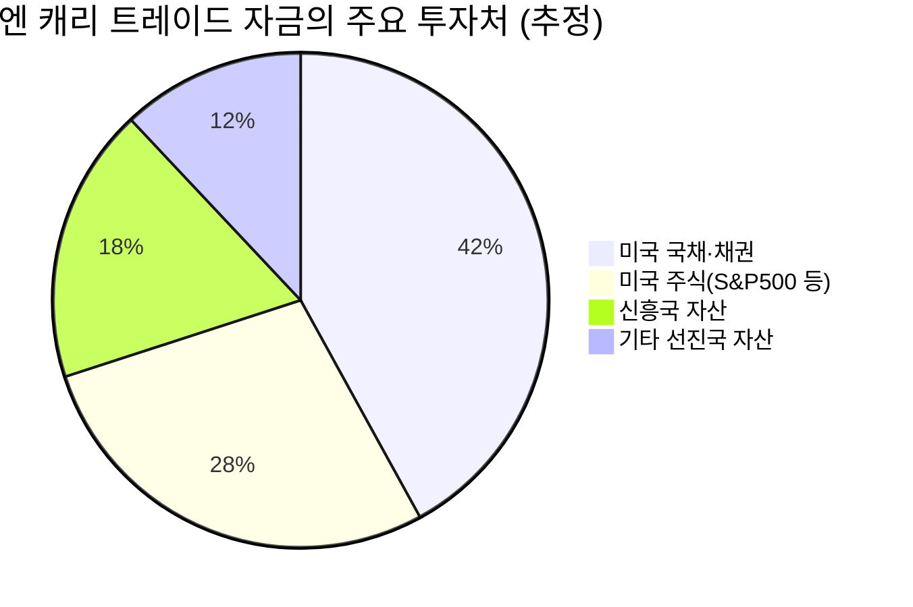

# 📊 모닝 브리핑 — 2026년 5월 14일 (목)

> **🔴 Risk-Off** — 인플레이션 재가속 + 유가 급등이 금리 인하 기대를 압살
> - **매크로**: 미 30년물 국채금리 5% 재돌파, 국제 유가 배럴당 $100 돌파
> - **리스크**: 필라델피아 반도체 지수 -3%, VIX 상승 (공포 구간)
> - **시그널**: ① Fed 금리 인하 기대 추가 약화 → 성장주 밸류에이션 압박 ② 엔 캐리 트레이드 해체 진행 → 글로벌 유동성 위축 경고

---

## 시장 스냅샷

### 주요 지수
| 지수 | 종가 | 등락 | 52주 위치 |
|------|------|------|----------|
| S&P 500 | 7,444.25 | +43.29 (+0.6%) | ████████████████████ 100% (5,803–7,444) |
| 나스닥 | 26,402.34 | +314.14 (+1.2%) | ████████████████████ 100% (18,737–26,402) |
| 다우존스 | 49,693.20 | -67.36 (-0.1%) | ██████████████████▉░ 94% (41,603–50,188) |
| 코스피 | 7,643.15 | -179.09 (-2.3%) | ███████████████████▍ 97% (2,592–7,822) |
| 코스닥 | 1,179.29 | -28.05 (-2.3%) | ██████████████████▏░ 91% (714–1,226) |
| 닛케이 225 | 62,742.57 | +324.69 (+0.5%) | ███████████████████▉ 100% (36,986–62,834) |

### 수급 동향
| 주체 | 코스피 | 코스닥 |
|------|--------|--------|
| 외국인 | 🔴 -37,227억 | 🔴 -6,016억 |
| 기관 | 🟢 +16,876억 | ⚪ — |
| 개인 | 🟢 +18,868억 | 🟢 +5,899억 |

### 매크로/원자재/크립토
| 항목 | 값 | 변동 | 52주 위치 |
|------|-----|------|----------|
| 미국 10Y | 4.48% | +0.02%p | ████████████████▍░░░ 82% (4–5) |
| 미국 2Y | 3.60% | -0.00%p | ██▍░░░░░░░░░░░░░░░░░ 12% (4–4) |
| DXY | 98.45 | +0.16 (+0.2%) | █████████▏░░░░░░░░░░ 46% (96–101) |
| USD/KRW | 1,489.42 | +14.97 (+1.0%) | ████████████████▉░░░ 84% (1,348–1,516) |
| USD/JPY | 157.77 | +0.54 (+0.3%) | █████████████████▎░░ 86% (142–160) |
| WTI 원유 | $100.85 | -1.3% | ███████████████▊░░░░ 79% (55–113) |
| 금 (Gold) | $4,701.60 | +0.5% | ██████████████▎░░░░░ 71% (3,181–5,318) |
| 은 (Silver) | $88.45 | +3.9% | █████████████▋░░░░░░ 68% (32–115) |
| BTC | $79,224 | -1.6% | █████▍░░░░░░░░░░░░░░ 27% (62,702–124,753) |
| VIX | 17.87 | -0.12 (-0.7%) | █████░░░░░░░░░░░░░░░ 25% (13–31) |
| 10Y-2Y 스프레드 | 0.88%p | +0.02%p | — |

---
## 시장 센티먼트

<div style="display:flex;border-radius:8px;overflow:hidden;margin:8px 0;font-size:0.85em">
  <div style="background:#F44336;width:72%;padding:6px 8px;color:white">🔴 Risk-Off 72%</div>
  <div style="background:#FF9800;width:18%;padding:6px 8px;color:white">🟡 중립 18%</div>
  <div style="background:#4CAF50;width:10%;padding:6px 8px;color:white">🟢 On 10%</div>
</div>

**핵심 판독**: 4월 CPI·PPI 동반 서프라이즈 + 유가 $100 돌파 + 미 30년물 금리 5% 재돌파라는 세 가지 악재가 동시에 터졌다. 이는 단순한 일시적 변동성이 아닌, "인플레이션이 구조적으로 끈적하다"는 시장의 재평가 신호다. 성장주와 장기채 두 자산 모두에 직격탄이 날아온 전형적인 스태그플레이션 우려 국면이다.

**변곡 촉매**:
- 🔴 **다운**: 이란 리스크 확대 또는 추가 유가 급등 → 30년물 금리 5.5% 돌파 시 시장 패닉 가속
- 🟢 **업**: Fed 주요 인사의 비둘기파 발언 또는 유가 급락 → 금리 인하 기대 회복으로 반등

---

## 섹터별 센티먼트

| 섹터 | 센티먼트 | 한줄 평가 |
|------|---------|----------|
| 반도체 | 🔴 약세 | 필라델피아 반도체 -3%, 금리 상승+밸류에이션 부담 → 단기 추가 조정 경계 |
| 에너지 | 🟢 강세 | 유가 $100 돌파로 에너지 기업 수익성 급등, 지정학 리스크 지속 시 추가 수혜 |
| 금융/은행 | 🟡 혼조 | 금리 상승 → 예대마진 확대 긍정, 그러나 신용 리스크 우려 동반 |
| 유틸리티/리츠 | 🔴 약세 | 30년물 5% 돌파 → 배당주 대체재 매력 급락, 자금 이탈 가속 |
| 소비재(필수) | 🟡 중립 | 인플레이션 전가력 높은 기업 선별적 강세, 전반적 소비 위축 우려 공존 |
| 방산/항공우주 | 🟢 강세 | 미·이란 긴장 고조 → 방산 수요 증가 기대, 지정학 리스크 수혜 |
| 장기채/TLT | 🔴 약세 | 금리 재상승 국면, 듀레이션 리스크 극대화 — 단기 보유 부담 |

---

## 오버나이트 핵심 이벤트

### 1. 미국 4월 CPI·PPI 동반 예상치 상회
- **요약**: 4월 소비자물가(CPI)와 생산자물가(PPI)가 시장 컨센서스를 동시에 상회하며 인플레이션 재가속 우려를 촉발했다.
- **So What**: 1차 효과 — Fed 2026년 금리 인하 기대가 추가 약화되며 연내 동결 가능성이 높아졌다. 2차 연쇄 효과 — 성장주의 할인율 재상승으로 밸류에이션 압박이 강화되고, 특히 고PER 기술주부터 순서대로 매물이 출회될 가능성이 높다.
- **크로스 임팩트**: [[나스닥]] 기술주 전반 약세, [[미국채10년물]] 수익률 상승, [[달러인덱스]] 강세

### 2. 국제 유가 배럴당 $100 돌파
- **요약**: 미국-이란 간 지정학적 긴장이 지속되며 국제 유가가 심리적 저항선인 배럴당 $100을 돌파했다.
- **So What**: 1차 효과 — 에너지 기업 수익성이 급격히 개선되며 에너지 섹터로의 자금 쏠림이 강화된다. 2차 연쇄 효과 — 에너지 가격 상승은 PPI·CPI에 재반영되는 2차 인플레이션 루프를 형성하여 Fed의 정책 딜레마를 심화시킨다. 항공, 물류, 화학 등 에너지 비용 민감 업종은 원가 압박 직격탄.
- **크로스 임팩트**: [[에너지 ETF(XLE)]] 강세, [[항공주]] 약세, [[정유/화학주]] 혼조

### 3. 미 30년물 국채금리 5% 재돌파
- **요약**: 인플레이션 지표 서프라이즈와 중동발 지정학 리스크가 겹치며 미국 30년 만기 국채금리가 5%대를 재돌파했다.
- **So What**: 1차 효과 — 리츠(REITs)와 유틸리티 등 배당 중심 자산에서 자금이 빠져나가는 전통적 "금리 상승 압박" 패턴이 재현된다. 2차 연쇄 효과 — 미국의 장기 조달 비용 상승은 연방정부 재정 부담을 가중시키고, 신흥국 자본 이탈 압력을 재점화한다. 한국 원화를 비롯한 EM 통화 약세 압력 주목 필요.
- **크로스 임팩트**: [[TLT]] 급락, [[리츠(VNQ)]] 약세, [[신흥국 채권(EMB)]] 매도 압력

### 4. 반도체·기술주 차익 실현 매물 집중
- **요약**: 가파른 상승 이후 누적된 차익 실현 수요와 인플레이션 충격이 겹치며 필라델피아 반도체 지수가 3% 하락했다.
- **So What**: 1차 효과 — 단기 고점 인식이 확산되며 [[NVDA]], [[AMD]], [[TSMC]] 등 대형 반도체주에 집중 매물 출회. 2차 연쇄 효과 — 반도체 지수 하락은 국내 [[삼성전자]], [[SK하이닉스]] 등 HBM 관련주에도 심리적 하방 압력으로 전이될 수 있다. 다만 AI 수요 펀더멘탈의 훼손이 아닌 단기 센티먼트 조정임을 구분해야 한다.
- **크로스 임팩트**: [[필라델피아 반도체지수(SOX)]] -3%, [[코스피 반도체 업종]] 약세 전이 경계

---

## 오늘의 일정

| 시간(한국) | 이벤트 | 중요도 | 관련 종목 |
|-----------|--------|--------|----------|
| 21:30 | 미국 4월 소매판매 발표 | ⭐⭐⭐⭐ | [[소비재]], [[유통주]] 전반 |
| 21:30 | 미국 주간 신규 실업수당 청구건수 | ⭐⭐⭐ | 전 종목 |
| 23:00 | 미국 5월 미시간대 소비자심리지수 (예비치) | ⭐⭐⭐⭐ | [[나스닥]], [[소비재]] |
| 금(15일) 밤 | 미국 4월 산업생산 발표 | ⭐⭐⭐ | [[소재]], [[산업재]] |

> [!warning] ⭐⭐⭐⭐ 핵심 이벤트 — 4월 소매판매 시나리오 분기
> - **예상 상회**: 소비 견조 확인 → "경제가 금리를 이길 수 있다"는 낙관론 vs. "인플레이션 더 끈적해진다"는 공포가 충돌하며 변동성 확대
> - **예상 하회**: 소비 둔화 확인 → 스태그플레이션 우려 본격화, 성장주·소비재 동반 약세 위험
> - **인라인**: 현 Risk-Off 분위기 유지, 유가·금리 동향이 시장 방향성 결정

---

## 테마 시그널

> [!abstract] 오늘의 테마: **엔 캐리 트레이드 해체 — $3.4조가 풀릴 때 글로벌 시장에 무슨 일이 벌어지는가**

### 왜 지금 이 테마가 중요한가

오늘 시장의 표면적 이슈는 "미국 인플레이션 재가속"이다. 그런데 그 배경에는 훨씬 더 구조적인 변화가 조용히 진행 중이다. 바로 **약 $3.4조(약 4,600조 원) 규모로 추정되는 엔 캐리 트레이드의 해체**다. 이 메커니즘을 이해하지 못하면 향후 글로벌 자산 시장의 움직임을 절반도 설명할 수 없다.

---

### 캐리 트레이드의 구조: 돈이 흐르는 방식

캐리 트레이드(Carry Trade)는 금리가 낮은 통화로 자금을 빌려 금리가 높은 자산에 투자하는 전략이다. 일본의 초저금리(장기간 0~0.1%)는 전 세계 투기자와 기관 투자자에게 사실상 무한정의 저비용 자금원을 제공했다.

```
[엔 캐리 트레이드 메커니즘]

① 일본에서 엔화 차입 (금리 ~0%)
        ↓
② 엔화 → 달러/원화 등으로 환전 (엔화 매도 = 엔 약세 압력)
        ↓
③ 미국 국채, S&P500, 나스닥, 신흥국 고금리 자산 등에 투자
        ↓
④ 이자 수익 + 환차익 (엔 약세 구간) = 복리 수익
```

이 구조가 작동하려면 세 가지 조건이 필요하다:
1. **일본의 금리가 낮을 것**
2. **엔화가 계속 약세일 것**
3. **투자 대상 자산의 가격이 유지될 것**

---

### 지금 무슨 일이 벌어지고 있는가

**BOJ의 금리 정상화**가 이 세 가지 조건을 모두 흔들고 있다.

| 구분 | 과거 (2013~2023) | 현재 (2024~2026) |
|------|----------------|----------------|
| BOJ 기준금리 | -0.1%~0% | 점진적 인상 중 |
| 엔화 방향 | 지속 약세 | 급격한 쌍방향 변동성 |
| 캐리 비용 | 거의 0 | 상승 중 |
| 시장 개입 | 드뭄 | BOJ "극심한 투기 경고" + 실제 개입 |

BOJ가 금리를 올리는 순간 캐리 트레이드의 경제학이 역전된다:
- **차입 비용 상승** → 스프레드 축소 → 수익률 하락
- **엔화 강세 전환** → 환차손 발생 → 강제 청산 압력
- **일본 국내 채권 매력 상승** → 일본 투자자들의 미국 자산 매도 → 미 국채 공급 과잉

> [!tip] 핵심 인사이트
> 엔 캐리 트레이드 해체는 단순히 "일본 자금이 빠져나간다"는 이야기가 아니다. **일본이 수십 년간 전 세계 자산 버블의 '조용한 공급자'였다는 사실이 드러나는 과정**이다. 그 해체는 단기 충격이 아닌, 수년에 걸친 글로벌 유동성 재편이다.

---

### 2024년 8월 5일: 우리는 이미 예고편을 봤다

2024년 8월 5일, 코스피는 하루에 -8.77% 폭락했다. 나스닥도 -3% 이상 빠졌다. 단기적으로는 BOJ의 깜짝 금리 인상 + 엔화 급등이 트리거였다. 이날 실제로 벌어진 일은 다음과 같다:

<div style="border-left:4px solid #F44336;padding-left:12px;margin:8px 0">
캐리 트레이드 포지션 보유자들이 손실을 피하기 위해 엔화를 사들이고(환전 역방향), 동시에 보유 중인 미국 주식·채권을 팔아 엔화로 상환하는 '강제 청산(Forced Unwinding)' 도미노가 발생했다. 전혀 관계없어 보이는 한국 주식이 폭락한 이유가 바로 이것이다 — 글로벌 포지션 청산 과정에서 유동성 좋은 자산부터 팔린 것.
</div>

그리고 지금? 그 해체가 아직 **완료되지 않았다**는 것이 시장의 판단이다.

---

### $3.4조의 해체가 미치는 경로별 영향



| 영향 경로 | 메커니즘 | 피해 자산 | 수혜 자산 |
|----------|---------|----------|----------|
| **미 국채 매도** | 일본 투자자 귀환 자금 회수 | 미 장기채 (금리 상승) | 엔화, 일본 국채 |
| **달러 약세** | 엔 매수=달러 매도 증가 | 달러 인덱스 | 금, 원자재, EM 통화 |
| **위험자산 청산** | 레버리지 포지션 강제 해소 | 나스닥, 고PER주 | 현금, 단기채 |
| **EM 자금 이탈** | 신흥국 캐리 자산 동반 청산 | 루피아, 루피, 원화 | — |

---

### 지금 당장 모니터링할 3가지 포인트

1. **USD/JPY 환율**: 140엔 이하 진입 시 캐리 청산 2라운드 가속 신호. 현재 움직임을 매일 체크하라.
2. **일본 10년물 국채금리 (JGB)**: JGB 금리가 미 국채와의 스프레드를 줄이는 속도가 빠를수록, 일본 자금의 귀환 속도도 빠르다.
3. **미 30년물 국채금리**: 일본계 자금 이탈로 공급이 늘면 장기금리가 오른다. 오늘 이미 5%를 돌파한 것이 우연이 아닐 수 있다.

> [!warning] 리스크 경고
> 캐리 트레이드 해체는 **비선형적으로(Non-linear)** 진행된다. 조용하다가 갑자기 폭발하는 특성이 있다. 2024년 8월이 그 예였고, 지금은 그 2막이 될 수 있다. 레버리지 포지션이 많은 투자자라면 포지션 크기를 재점검하라.

---

## 대가의 시선

> "The most dangerous words in investing are: 'This time it's different.'"
> ("투자에서 가장 위험한 말은 '이번엔 다르다'이다.")
> — **존 템플턴 경 (Sir John Templeton)**, 템플턴 펀드 창업자 [클래식]

**맥락**: 강세장이 오래 지속될 때, 혹은 새로운 패러다임이 등장했다고 느껴질 때 투자자들이 반복적으로 하는 말이 바로 "이번엔 다르다"이다. 닷컴 버블에서도, 2008년 직전에도, 그리고 지금 "AI는 진짜 패러다임 전환이라 밸류에이션 기준이 달라졌다"는 논리에서도 같은 패턴이 반복된다.

**투자 함의**: 오늘 인플레이션 재가속과 금리 5% 재돌파를 보며 "이번엔 Fed가 결국 인플레이션을 잡을 것이고 기술주는 계속 오를 것이다"라는 낙관론이 다시 "이번엔 다르다" 논리로 포장될 수 있다. 역사는 그런 낙관이 가장 위험한 순간에 가장 설득력 있게 들린다는 것을 반복적으로 증명했다. 지금은 낙관이 아닌 **시나리오 점검의 시간**이다.

---

## 투자 레슨

> [!abstract] 오늘의 레슨: **처분 효과(Disposition Effect) — "오른 주식은 너무 빨리 팔고, 내린 주식은 너무 오래 붙드는" 인간의 본능이 수익률을 파괴하는 방식**

### 당신의 뇌는 당신의 적이다 — 처분 효과의 해부

인간은 합리적인 투자자가 아니다. 우리 뇌는 수익 중인 주식을 보면 "지금 팔아서 이익을 확정하고 싶다"는 충동을 느끼고, 손실 중인 주식을 보면 "팔면 진짜 손실이 확정되니까 버텨야겠다"고 판단한다. 이것이 **처분 효과(Disposition Effect)**다.

노벨 경제학상 수상자 **허시 셰프린(Hersh Shefrin)**과 **메어 스태트만(Meir Statman)**이 1985년 처음 공식화한 이 개념은, **투자자가 이익 실현을 서두르고 손실 확정을 회피하는 비대칭적 행동 패턴**을 설명한다. 그리고 이 패턴은 거의 모든 투자자에게 공통적으로 나타난다.

---

### 왜 이런 행동이 발생하는가 — 심리학적 뿌리

처분 효과는 사실 손실회피 편향의 응용판이다. 그 구조를 더 깊이 들여다보면:

| 상황 | 뇌의 판단 | 행동 | 실제 결과 |
|------|---------|------|---------|
| 수익 중인 주식 | "이익을 확정해야 안심된다" (확실한 이익 선호) | 🔴 조기 매도 | 추가 상승 기회 박탈 |
| 손실 중인 주식 | "팔면 현실이 된다, 기다리면 돌아오겠지" (손실 회피) | 🔴 과도한 보유 | 손실 심화 방치 |

이를 **프로스펙트 이론(Prospect Theory)**으로 설명하면:

<div style="border-left:4px solid #FF9800;padding-left:12px;margin:8px 0">

인간은 이익과 손실을 **비대칭적으로** 느낀다. $100 이익의 기쁨보다 $100 손실의 고통이 약 2.5배 크다. 이 때문에 손실을 "아직 확정되지 않은 것"으로 인지하려는 심리적 방어 기제가 작동하고, 이것이 손실 종목 보유를 정당화하는 자기기만으로 이어진다.

</div>

---

### 실증 데이터: 얼마나 심각한가

테런스 오딘(Terrance Odean)의 1998년 연구는 충격적인 결과를 보여줬다:

<div style="background:#e0e0e0;border-radius:8px;overflow:hidden;margin:4px 0"><div style="background:#F44336;width:68%;padding:4px 8px;color:white;font-size:0.9em;white-space:nowrap">투자자들이 팔지 않고 보유한 손실 종목 68%</div></div>

<div style="background:#e0e0e0;border-radius:8px;overflow:hidden;margin:4px 0"><div style="background:#4CAF50;width:32%;padding:4px 8px;color:white;font-size:0.9em;white-space:nowrap">투자자들이 조기 매도한 수익 종목 32%</div></div>

그리고 그 결과는 다음과 같았다:
- 투자자들이 **팔아버린 수익 종목**은 이후 12개월간 평균 **+3.4%** 추가 상승
- 투자자들이 **계속 들고 있던 손실 종목**은 이후 12개월간 평균 **-1.06%** 추가 하락

즉, 처분 효과를 따라 행동하면 **"오를 것은 너무 빨리 팔고, 떨어질 것은 너무 오래 보유"**하는 최악의 조합이 완성된다.

---

### 오늘 시장이 정확히 이 원칙이 작동하는 사례

오늘 반도체·기술주에서 대규모 차익 실현 매물이 출회되었다. 이 매도의 상당 부분은 처분 효과가 작동한 결과다:

```
[지금 시장에서 처분 효과가 발현되는 두 가지 방향]

시나리오 A (수익 종목 조기 매도):
반도체주를 평단 이하에서 매수 → 최근 가파른 상승으로 수익 구간 진입
→ 인플레이션 쇼크 뉴스 나오자 "이익 실현하자" 충동 → 조기 매도
→ 만약 AI 수요 펀더멘탈이 건재하다면? 더 오를 주식을 바닥에서 팔게 되는 결과

시나리오 B (손실 종목 과도 보유):
리츠(REITs) 또는 장기채 보유 → 금리 상승으로 손실 구간 진입
→ "언젠간 금리가 내려올 것" 기대로 보유 지속
→ 30년물 5% 돌파로 손실 더 심화 → 그래도 팔지 못하는 상태
```

> [!tip] 처분 효과를 이기는 3가지 프레임워크
>
> **1. "내가 지금 현금을 가지고 있다면 이 종목을 살 것인가?"**
> 현재 보유 종목을 매수/매도 결정이 아닌, "지금 새로 투자할 것인가?"로 재프레이밍하면 편향이 줄어든다.
>
> **2. 매도 기준을 "가격"이 아닌 "펀더멘탈"로 설정하라**
> "X% 올랐으니 팔자"(가격 기준)가 아니라 "이 종목의 투자 thesis가 훼손되었는가?"(펀더멘탈 기준)로 판단하라. 오늘 반도체 하락이 AI 수요 붕괴 때문인가, 아니면 단순 센티먼트 조정인가?
>
> **3. 손실 종목에 "가상 매도 후 재매수" 테스트를 적용하라**
> 지금 손실 중인 종목을 일단 머릿속에서 팔았다고 상상하라. 그리고 "지금 이 가격에 다시 살 것인가?" 이 답이 "아니오"라면, 당신은 지금 처분 효과에 갇혀 있는 것이다.

---

### 처분 효과가 특히 위험한 이유: 세금과 복합 작용

처분 효과는 세금 측면에서도 최악의 행동이다. 합리적 투자자라면 세금 관점에서 정반대로 행동해야 한다:

| 구분 | 처분 효과 행동 | 세금 최적 행동 |
|------|-------------|-------------|
| 수익 종목 | 🔴 빨리 판다 | 🟢 오래 보유 (장기 보유세 혜택 + 복리 유지) |
| 손실 종목 | 🔴 오래 들고 있다 | 🟢 손실 확정 후 세금 공제(Tax-loss Harvesting) 활용 |

> [!warning] 리스크 경고
> 국내 투자자의 경우, 장기 보유에 따른 세제 혜택 구조가 미국과 다를 수 있으므로 개인 세무 상황을 반드시 별도로 확인하세요.

---

**오늘 실천 방법**:
지금 보유 중인 종목 중 가장 큰 손실 종목을 하나 꺼내라. 그리고 이렇게 자문하라: *"지금 내가 이 종목의 투자 thesis를 처음부터 다시 쓴다면, 지금 이 가격에 새로 살 것인가?"* 답이 "아니오"라면 — 처분 효과를 깨고 결단을 내려야 할 시점이다.

---

## 오늘 하나만 기억한다면

> [!verdict] 오늘 하나만 기억한다면
> **"인플레이션 재가속 + 유가 $100 + 금리 5% — 이 세 가지가 동시에 나온 날, 오른 주식을 팔고 싶은 충동이 가장 위험하고, 내린 주식을 들고 버티고 싶은 충동은 가장 치명적이다. 오늘은 가격이 아닌 펀더멘탈로만 판단하라."**