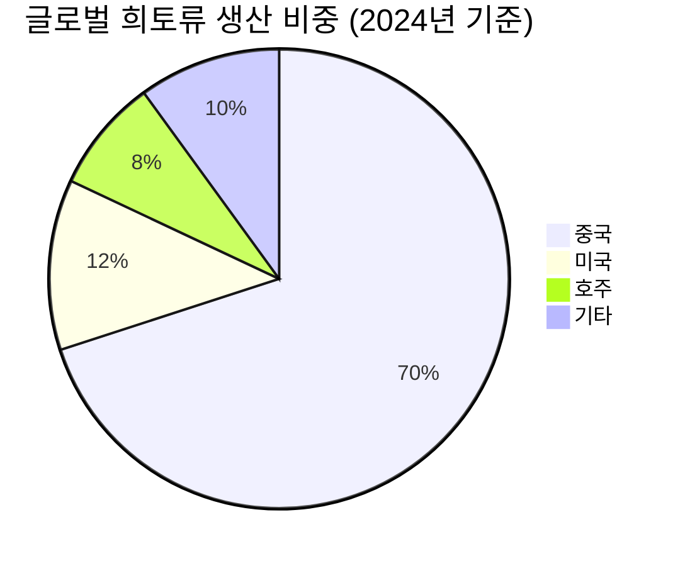

# 📊 모닝 브리핑 — 2026년 5월 15일 (금)

> **🟢 Risk-On** — AI·기술주 랠리가 매크로 역풍을 압도하는 국면
> - **매크로**: 중동 긴장으로 유가 3%대 급등, 인플레 재점화 우려로 금리 인하 기대 후퇴
> - **리스크**: VIX 안정 속 S&P 500·나스닥 사상 최고치 경신, 단 고금리 장기화 리스크 잔존
> - **시그널**: ① AI·반도체 모멘텀 지속 ② 희토류 공급망 재편 — 중국發 수출 통제가 新산업 지형도를 바꾸고 있다

---

## 시장 스냅샷

### 주요 지수
| 지수 | 종가 | 등락 | 52주 위치 |
|------|------|------|----------|
| S&P 500 | 7,500.07 | +55.82 (+0.7%) | ████████████████████ 100% (5,803–7,500) |
| 나스닥 | 26,637.46 | +235.12 (+0.9%) | ████████████████████ 100% (18,737–26,637) |
| 다우존스 | 50,052.81 | +359.61 (+0.7%) | ███████████████████▋ 98% (41,603–50,188) |
| 코스피 | 7,844.01 | +200.86 (+2.6%) | ████████████████████ 100% (2,592–7,844) |
| 코스닥 | 1,176.93 | -2.36 (-0.2%) | ██████████████████▏░ 90% (714–1,226) |
| 닛케이 225 | 63,272.11 | +529.54 (+0.8%) | ████████████████████ 100% (36,986–63,272) |

### 수급 동향
| 주체 | 코스피 | 코스닥 |
|------|--------|--------|
| 외국인 | 🔴 -21,450억 | 🔴 -1,349억 |
| 기관 | 🟢 +1,927억 | 🟢 +595억 |
| 개인 | 🟢 +18,499억 | 🟢 +911억 |

### 매크로/원자재/크립토
| 항목 | 값 | 변동 | 52주 위치 |
|------|-----|------|----------|
| 미국 10Y | 4.46% | -0.02%p | ███████████████▊░░░░ 79% (4–5) |
| 미국 2Y | 3.59% | -0.01%p | ██▏░░░░░░░░░░░░░░░░░ 10% (4–4) |
| DXY | 98.88 | +0.40 (+0.4%) | ██████████▉░░░░░░░░░ 55% (96–101) |
| USD/KRW | 1,492.71 | -0.28 (-0.0%) | █████████████████▎░░ 86% (1,348–1,516) |
| USD/JPY | 158.37 | +0.70 (+0.4%) | █████████████████▉░░ 90% (142–160) |
| WTI 원유 | $101.80 | +0.8% | ████████████████▏░░░ 81% (55–113) |
| 금 (Gold) | $4,659.50 | -0.8% | █████████████▉░░░░░░ 69% (3,181–5,318) |
| 은 (Silver) | $83.89 | -5.6% | ████████████▌░░░░░░░ 62% (32–115) |
| BTC | $81,429 | +2.7% | ██████░░░░░░░░░░░░░░ 30% (62,702–124,753) |
| VIX | 17.30 | -0.57 (-3.2%) | ████▍░░░░░░░░░░░░░░░ 22% (13–31) |
| 10Y-2Y 스프레드 | 0.87%p | -0.01%p | — |

---
## 시장 센티먼트

🟢 Risk-On 65%

🟡 중립 20%

🔴 Risk-Off 15%

**핵심 판독**: AI 붐이 만들어내는 기술주 랠리가 인플레이션 재점화와 중동 지정학 리스크를 눌러 Risk-On이 우세하다. S&P 500과 나스닥의 사상 최고치 경신은 어닝 기대와 AI 내러티브가 그만큼 강력함을 보여주는 신호다. 단, 소매판매·PPI·CPI 트리플 상승으로 연준의 금리 인하 카드는 사실상 단기 소멸했다.

**변곡 촉매**:
- 🔴 **다운**: 이란 핵협상 결렬 → 유가 추가 급등 → 인플레 재가속 → 연준 매파 전환 우려
- 🟢 **업**: 미중 정상회담 성사·관세 완화 시그널 → 공급망 안정 + 글로벌 리스크 프리미엄 축소

---

## 섹터별 센티먼트

| 섹터 | 센티먼트 | 한줄 평가 |
|------|---------|----------|
| 반도체·AI인프라 | 🟢 강세 | AI 붐 지속 + 시스코 실적 서프라이즈, 수요 가시성 상승 중 |
| 에너지 | 🟢 강세 | 중동 긴장 재점화로 유가 3%대 급등, 단기 트레이딩 기회 |
| 방산·희토류 대체 | 🟢 강세 | 미 국방부 2027년 중국산 희토류 금지 → 수혜 밸류체인 부각 |
| 항공·물류 | 🔴 주의 | 유가 급등 = 항공유 비용 상승 직격, 마진 압박 불가피 |
| 소비재·리테일 | 🟡 혼조 | 4월 소매판매 예상 상회는 긍정이나, 고금리 장기화 시 소비 둔화 우려 병존 |
| 금융·은행 | 🟡 관망 | 금리 인하 기대 후퇴 → NIM 유지되나 대출 수요 위축 가능성 |
| 한국 내수·부동산 | 🔴 주의 | 한은 7월 금리 인상 가능성 부상 — 레버리지 소비 및 부동산 심리에 부정적 |

---

## 오버나이트 핵심 이벤트

### 1. S&P 500·나스닥 사상 최고치 경신 — AI·반도체가 이끌다
- **요약**: AI 붐 지속과 시스코 실적 호조가 맞물리며 S&P 500과 나스닥이 사상 최고치를 동시 경신했다.
- **So What**: 시스코는 전통적 네트워크 장비 기업이지만 AI 데이터센터 인프라 수혜주로 재평가받으며 지수 전체를 끌어올렸다. AI 내러티브가 개별 기업의 실적 서프라이즈로 검증되기 시작했다는 점에서 단순 테마가 아닌 어닝 사이클로 진입 중이라는 시그널이다.
- **크로스 임팩트**: 반도체([[NVDA]]), AI 인프라([[CSCO]], [[MSFT]]), 전력·냉각 인프라 섹터 전반 수혜

### 2. 미국 인플레이션 트리플 서프라이즈 — 금리 인하 기대 소멸
- **요약**: 4월 소매판매가 예상을 상회한 가운데 PPI와 CPI도 동반 상승, 인플레이션 재가속 우려가 현실화됐다.
- **So What**: 세 지표가 동시에 상방 서프라이즈를 기록했다는 것은 수요가 여전히 견조하고 가격 압력이 꺾이지 않았음을 의미한다. 연준 입장에서는 인하 명분이 사라진 것이며, 시장이 기대하던 2026년 상반기 인하 시나리오가 후퇴하면서 장기금리에 상방 압력이 지속될 것이다.
- **크로스 임팩트**: 미국채 수익률 상승 → 성장주 밸류에이션 할인율 상승, 달러 강세, 금 약세

### 3. 중동 긴장 재고조 — 유가 3%대 급등
- **요약**: 트럼프 발언으로 이란과의 휴전 기대가 약화되며 중동 지정학 리스크가 재점화, 브렌트유·WTI가 3%대 급등했다.
- **So What**: 유가 급등은 인플레이션 재가속 우려를 한 층 더 끌어올리는 이중 악재로 작용한다. 연준 통화정책 정상화에 제동을 거는 동시에 항공·물류·소비재 기업의 비용 구조를 직격한다. 단기적으로는 에너지 섹터 트레이딩 기회이나, 장기화 시 스태그플레이션 우려로 전환될 수 있다.
- **크로스 임팩트**: 에너지([[XOM]], [[CVX]]) 수혜, 항공([[UAL]], [[DAL]])·해운 약세, 인플레 민감 채권 추가 하락

### 4. 한은 7월 금리 인상 가능성 — 한국 시장의 독자 변수
- **요약**: 1분기 GDP 호조로 한국은행 정책 초점이 성장 지원에서 물가 안정으로 이동, 7월 기준금리 인상 가능성이 제기됐다.
- **So What**: 한국이 미국과 달리 독자적 긴축 사이클에 진입할 경우 원화 강세 요인이지만, 동시에 국내 레버리지 기반 소비와 부동산 심리에 부담을 준다. 코스피 내 고배당·저PBR 금융주는 NIM 방어 측면에서 긍정적이나, 성장주 밸류에이션에는 부정적이다.
- **크로스 임팩트**: 한국 은행주([[KB금융]], [[신한지주]]) 단기 수혜, 부동산·리츠·레버리지 소비 섹터 주의

---

## 오늘의 일정

| 시간(한국) | 이벤트 | 중요도 | 관련 종목/섹터 |
|-----------|--------|--------|--------------|
| 오늘 장중 | 미중 정상회담 관련 추가 발언·성명 모니터링 | ⭐⭐⭐⭐ | [[삼성전자]], [[SK하이닉스]], 수출주 전반 |
| 오늘 장중 | 유가 추이 및 중동 지정학 업데이트 | ⭐⭐⭐ | 에너지, 항공, 소비재 |
| 이번 주 내 | 한국은행 금통위 관련 위원 발언 모니터링 | ⭐⭐⭐ | [[KB금융]], [[신한지주]], 리츠·부동산 |
| 이번 주 내 | 미 연준 인사 발언 (인플레 서프라이즈 후속 반응) | ⭐⭐⭐⭐ | 미국채, 달러, 성장주 전반 |

> [!warning] ⭐⭐⭐⭐ 주목: 미중 정상회담 시그널
> - **🟢 업 시나리오**: 관세 완화 또는 희토류 수출 통제 협의 시그널 → 반도체·소재·수출주 랠리
> - **🔴 다운 시나리오**: 회담 결렬 또는 추가 갈등 확인 → 리스크오프 전환, 방산·희토류 대체 섹터 부각

---

## 테마 시그널

> [!abstract] 오늘의 테마: **희토류 무기화 — 중국이 쥔 주기율표의 칼날, 그리고 세계가 10년 안에 탈출할 수 있는가**

### 왜 지금인가

이번 주 미중 정상회담의 핵심 의제 중 하나가 희토류다. 중국은 2025년 4월 희토류 수출 통제를 전격 발동했고, 그 여파로 이트륨·디스프로슘·테르븀 같은 중희토류(Heavy Rare Earths) 수출이 약 50% 급감했다. 가격은 단기에 4~5배 폭등했다. 이는 단순한 무역 분쟁이 아니다 — 반도체, 전기차, F-35 전투기, 풍력터빈, 미사일 유도 시스템까지 이어지는 **물리적 공급망 무기화**의 시작이다.

---

### 희토류란 무엇인가 — 왜 대체가 이렇게 어려운가

희토류(Rare Earth Elements, REE)는 란타넘족 17개 원소의 총칭이다. '희귀하다'는 이름과 달리 지각에 어느 정도 존재하지만, **경제성 있는 농도로 모여 있는 광상이 드물고, 채굴 후 분리·정제 공정이 극도로 복잡하며 환경 오염이 심각**하다. 수십 년간 규제를 완화하고 저가 노동력·인프라를 투자한 중국만이 이 공정을 산업 규모로 운영할 수 있게 된 것이다.

생산 비중보다 더 치명적인 것은 **정제·가공 능력**이다. 채굴한 원광을 실제 산업에 쓸 수 있는 산화물·금속·합금으로 만드는 능력의 약 85~90%가 중국에 집중되어 있다. 즉, 호주에서 광석을 캐도 중국에서 가공하지 않으면 쓸 수 없다.

---

### 중국의 전략적 선택 — 왜 지금 카드를 꺼냈나

| 시기 | 중국의 조치 | 서방의 반응 |
|------|-----------|-----------|
| 2010년 | 일본과 영토 분쟁 중 대일 희토류 수출 급감 | 일본·미국, 대체 공급원 투자 시작 |
| 2019~2023년 | 수출 쿼터 축소, 환경 규제 명목 생산 제한 | WTO 제소, 소극적 대응 |
| 2025년 4월 | 수출 허가제 전면 도입 — 중희토류·자석 포함 | 미·독·일 대체 공급 협상 가속 |
| 2027년 1월 | (예정) 미 국방부, 중국산 희토류 국방 계약 금지 | 서방 방위산업 구조 재편 촉발 |

중국이 이 카드를 꺼낸 타이밍은 미국의 반도체 수출 규제(엔비디아 칩 제한)에 대한 **비대칭 보복**의 성격이 강하다. 반도체 공급망은 미국이 우위에 있고, 희토류 공급망은 중국이 우위에 있다 — 서로가 서로의 급소를 쥐고 있는 구조적 상호 취약성(Mutual Vulnerability)이다.

---

### 투자 함의 — 누가 이기고 누가 잃는가

**직접 피해군**

전기차 모터용 네오디뮴 자석 수요가 급증하는 완성차·EV 업체, F-35·드론 등 정밀 유도 무기를 생산하는 방산업체, 풍력터빈 발전기를 납품하는 재생에너지 업체가 단기 비용 급등에 직격탄을 맞는다. 가격이 4~5배 뛴 상황에서 헤지 수단이 없기 때문이다.

**구조적 수혜군**

| 카테고리 | 수혜 이유 | 대표 플레이어 |
|---------|---------|------------|
| 非중국 희토류 광산 | 대체 공급원 프리미엄 | 호주 MP Materials, 라이나스 |
| 희토류 재활용 기술 | 전자폐기물 재자원화 수요 급증 | 어번마인 등 스타트업 |
| 영구자석 대체 소재 | NdFeB 자석 대체재 R&D 가속 | 소재 기업, 대학 스핀오프 |
| 브라질·아프리카 광업 | 트럼프-룰라 희토류 협력 협정 | 브라질 국영 광업 CPRM 연계 기업 |

> [!tip] 핵심 인사이트
> 브라질은 세계 2위의 희토류 매장량을 보유하지만, **환경 허가 지연·관료주의·자원 민족주의**가 수십 년간 개발을 막아왔다. 트럼프-룰라 협력이 단기 호재처럼 보이지만, 광산에서 정제 완제품까지 공급망을 구축하려면 현실적으로 7~15년이 필요하다. **지정학적 열정이 공급망 현실을 앞서가는 구간**에서는 광산 주가 과열 주의가 필요하다.

---

### 모니터링 포인트

🟢 완화 신호 40%

🟡 현상 유지 35%

🔴 확전 25%

1. **미중 정상회담 결과**: 희토류가 협상 테이블에 오르는가, 아니면 배제되는가
2. **중희토류 가격 지수**: 디스프로슘·테르븀 현물가 추이 — 가격이 안정되면 협상 진전, 폭등하면 갈등 심화
3. **미 국방부 대체 공급 계약**: 2027년 금지 전 얼마나 빠르게 비중국 소싱을 확보하는가
4. **호주 라이나스·MP Materials 생산량**: 실질적 대체 공급 능력의 현실 검증

---

## 대가의 시선

> "The person that turns over the most rocks wins the game." (가장 많은 돌을 뒤집어보는 사람이 이긴다.)
> — **피터 린치(Peter Lynch)**, 전 피델리티 마젤란 펀드 매니저, *One Up on Wall Street* [클래식]

**맥락**: 린치가 자신의 투자 철학을 설명하며 한 말이다. 남들이 보지 않는 곳, 복잡하고 지저분하고 섹시하지 않은 산업까지 직접 발로 뛰며 분석하라는 의미다.

**투자 함의**: 오늘 희토류 테마가 정확히 이 원칙의 시험대다. '희토류'라고 하면 대부분 중국 의존도와 광산주 투자를 먼저 떠올린다 — 이는 이미 시장이 아는 돌이다. 진짜 '뒤집지 않은 돌'은 희토류 재활용 기술 스타트업, 영구자석 대체 소재 연구 기업, 또는 중국산 희토류 의존도가 높아 주가가 과도하게 눌린 기업들이다. 지정학 이슈가 커질수록 표면에 드러난 테마주보다 **공급망 재편의 2차 수혜처**를 찾아내는 분석이 알파를 만든다.

---

## 투자 레슨

> [!abstract] 오늘의 레슨: **앵커링 편향(Anchoring Bias) — "처음 본 숫자가 당신의 판단을 영구히 감금한다"**

### 본질: 첫 번째 숫자가 뇌에 박히는 방식

앵커링(Anchoring)은 노벨경제학상을 받은 카너먼(Kahneman)과 트버스키(Tversky)가 1974년 발견한 인지 편향이다. 인간의 뇌는 **처음 접한 숫자나 정보를 기준점(앵커)**으로 삼고, 이후 모든 판단을 그 숫자에서 '조정(adjustment)'하는 방식으로 작동한다. 문제는 이 조정이 항상 불충분하다는 것 — 즉, 앵커가 틀렸어도 최종 판단은 앵커 근처에 머문다.

> [!note] 원래 실험
> 카너먼-트버스키는 피험자들에게 룰렛 바퀴(10 또는 65에서 멈추도록 조작됨)를 돌리게 한 후, "UN에서 아프리카 국가의 비율은 몇 퍼센트인가?"를 물었다. 룰렛이 10에 멈춘 그룹의 평균 답변은 25%, 65에 멈춘 그룹은 45%였다. 아무 관련 없는 무작위 숫자가 완전히 다른 판단을 만들어낸 것이다.

---

### 투자에서 앵커링이 작동하는 4가지 경로

| 상황 | 앵커 | 실제 함정 |
|------|------|---------|
| **52주 최고가** | "고점 대비 30% 빠졌으니 싸다" | 고점 자체가 거품이었을 수 있다 |
| **매입가** | "내가 산 가격에 오면 팔겠다" | 현재 펀더멘털과 매입가는 무관하다 |
| **애널리스트 목표가** | "목표가 10만원이니 지금 7만원은 저렴" | 목표가도 앵커에서 역산된 숫자일 수 있다 |
| **IPO 공모가** | "공모가 아래면 무조건 싸다" | 공모가 자체가 고평가됐을 수 있다 |

가장 위험한 앵커는 내가 직접 치른 가격이다. 매입가는 시장에게 아무런 의미가 없다. 그 주식이 5만원에서 3만원으로 내려올 때, 시장은 당신의 매입가를 모른다. 시장은 미래 현금흐름을 할인한다.

---

### 오늘 시장이 보여주는 앵커링의 실제 작동

**사례 1 — 희토류 가격 앵커**

중희토류 가격이 단기에 4~5배 폭등했다. 많은 투자자가 "원래 가격" — 즉 수출 통제 이전의 가격 — 을 앵커로 삼고 "언젠가 정상화될 것"이라 생각한다. 하지만 공급 구조가 바뀌면 앵커 자체를 버려야 한다. 과거 가격이 '정상'이라는 보장은 없다. 새로운 지정학 환경에서 희토류의 균형 가격은 완전히 다른 수준에서 형성될 수 있다.

**사례 2 — S&P 500 "사상 최고치" 앵커**

나스닥과 S&P 500이 사상 최고치를 경신했다. 이때 가장 흔한 앵커 오류는 두 가지다:
- "사상 최고치니 비싸다" → 최고치 자체가 앵커가 되어 추가 상승을 부정하는 오류
- "최고치를 뚫었으니 무조건 오른다" → 돌파 자체가 앵커가 되어 리스크를 무시하는 오류

실제로 S&P 500 사상 최고치 경신 이후 1년 수익률을 분석하면, 고점 갱신 후에도 평균적으로 양의 수익률을 기록한다는 연구(LPL Financial, 2023)가 있다. '사상 최고치 = 위험'이라는 직관 자체가 앵커에 의한 오류인 것이다.

---

### 앵커링에서 벗어나는 실전 프레임

**STEP 1 — 앵커를 의식적으로 제거한다**

> "이 주식을 오늘 처음 본다면, 지금 가격에 살 것인가?"

내가 이미 보유하고 있다는 사실, 내 매입가, 전 고점 — 이 모든 숫자를 머릿속에서 지우고 질문한다. 이것이 **제로-베이스 사고(Zero-Based Thinking)**다.

**STEP 2 — 앵커와 다른 출발점으로 역검증한다**

목표가가 10만원이라면, "왜 5만원이 아닌가?"를 먼저 논증한다. 목표가에서 시작해 근거를 찾는 것이 아니라, 반대 방향에서 논증해야 앵커의 영향을 줄일 수 있다.

**STEP 3 — 퍼센트가 아닌 절대값으로 생각한다**

"고점 대비 30% 하락"이라는 말은 고점을 앵커로 만든다. 대신 "현재 EV/EBITDA 기준으로 역사적 밴드 어디에 위치하는가?"처럼 앵커 독립적 지표로 판단한다.

---

### 오늘 실천 방법

지금 보유 중인 종목 하나를 골라서, **매입가와 현재 목표가를 모두 가린 채** "오늘 이 회사를 처음 분석한다면 지금 가격에 살 것인가?"를 30초간 자문해보자. 불편한 답이 나온다면, 그것이 바로 앵커가 당신의 판단을 붙들고 있다는 증거다.

---

## 오늘 하나만 기억한다면

> [!verdict] 오늘 하나만 기억한다면
> **"AI 랠리가 사상 최고치를 만들고 있지만, 희토류 무기화가 조용히 그 랠리의 공급망 밑바닥을 흔들고 있다 — 표면의 온기와 지하의 단층을 동시에 보는 눈이 필요한 장이다."**