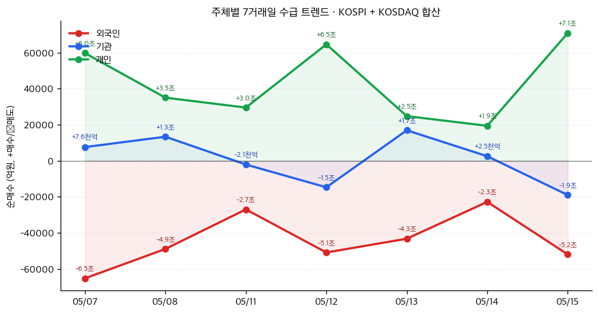

# 📊 모닝 브리핑 — 2026년 5월 16일 (토)

> **🔴 Risk-Off** — 인플레이션 공포가 금리를 밀어올리고, 고점 부담이 증시를 짓누르는 국면
> - **매크로**: 미국 30년물 국채 금리 5% 돌파, 원/달러 1,500원선 돌파
> - **리스크**: S&P 500·나스닥 사상 최고치 후 하락 전환, 코스피 8,000선 돌파 후 7,500선 급락 마감
> - **시그널**: ① 외국인 이탈 + 금리 급등의 이중 압박 → 한국 증시 단기 조정 경계 ② 구리 사상 최고치 — 실물 수요 vs 인플레이션 괴리 관찰 필요

---

## 시장 스냅샷

### 주요 지수
| 지수 | 종가 | 등락 | 52주 위치 |
|------|------|------|----------|
| S&P 500 | 7,408.50 | -92.74 (-1.2%) | ██████████████████▉░ 95% (5,803–7,501) |
| 나스닥 | 26,225.14 | -410.08 (-1.5%) | ███████████████████░ 95% (18,737–26,635) |
| 다우존스 | 49,526.17 | -537.29 (-1.1%) | ██████████████████▌░ 92% (41,603–50,188) |
| 닛케이 225 | 62,654.05 | -618.06 (-1.0%) | ███████████████████▌ 98% (36,986–63,272) |

### 매크로/원자재/크립토
| 항목 | 값 | 변동 | 52주 위치 |
|------|-----|------|----------|
| 미국 10Y | 4.60% | +0.13%p | ████████████████████ 100% (4–5) |
| 미국 2Y | 3.59% | +0.00%p | ██▏░░░░░░░░░░░░░░░░░ 11% (4–4) |
| DXY | 99.27 | +0.39 (+0.4%) | ████████████▌░░░░░░░ 63% (96–101) |
| USD/KRW | 1,497.76 | +7.92 (+0.5%) | █████████████████▊░░ 89% (1,348–1,516) |
| USD/JPY | 158.73 | +0.88 (+0.6%) | ██████████████████▎░ 92% (142–160) |
| WTI 원유 | $101.16 | -0.0% | ███████████████▉░░░░ 80% (55–113) |
| 금 (Gold) | $4,543.60 | -2.9% | ████████████▊░░░░░░░ 64% (3,182–5,318) |
| 은 (Silver) | $76.29 | -10.1% | ██████████▋░░░░░░░░░ 53% (32–115) |
| BTC | $79,025 | -2.5% | █████▎░░░░░░░░░░░░░░ 26% (62,702–124,753) |
| VIX | 18.43 | +1.17 (+6.8%) | █████▋░░░░░░░░░░░░░░ 28% (13–31) |
| 10Y-2Y 스프레드 | 1.01%p | +0.13%p | — |

### 수급 동향 (최근 7 거래일, 05/07 ~ 05/15, KOSPI+KOSDAQ 합산)



**7일 누적**: 외국인 -31.0조 · 기관 +4,546억 · 개인 +30.4조

---
## 시장 센티먼트

<div style="background:#e0e0e0;border-radius:8px;overflow:hidden;margin:8px 0">
<div style="display:flex;border-radius:8px;overflow:hidden;font-size:0.9em">
<div style="background:#F44336;width:65%;padding:6px 12px;color:white;white-space:nowrap">🔴 Risk-Off 65%</div>
<div style="background:#FF9800;width:20%;padding:6px 12px;color:white;white-space:nowrap">🟡 중립 20%</div>
<div style="background:#4CAF50;width:15%;padding:6px 12px;color:white;white-space:nowrap;min-width:60px">🟢 On 15%</div>
</div>
</div>

**핵심 판독**: 미국 국채 30년물이 5%를 돌파하며 "할인율 쇼크"가 위험자산 전반을 압박하고 있다. 코스피는 8,000선 터치 직후 급락해 심리적 저항선의 높이를 재확인시켰고, 외국인 자금이탈과 원화 약세가 동시에 진행되며 신흥국 특유의 이중 압박(twin squeeze)이 작동 중이다. 전고점 경신 직후의 하락 전환은 모멘텀 투자자들의 이익실현을 촉발할 수 있어 단기 변동성 확대에 유의해야 한다.

**변곡 촉매**:
- 🔴 다운: 미국 PPI·PCE에서 인플레이션 재가속 신호 확인 → 30년물 5.3%+ 돌파 시 증시 추가 매도
- 🟢 업: 연준 주요 인사의 금리 인하 재개 시그널 또는 중동 지정학 리스크 완화 → 외국인 자금 복귀

---

## 섹터별 센티먼트

| 섹터 | 센티먼트 | 한줄 평가 |
|------|---------|----------|
| 반도체·AI | 🟡 혼조 | 코스피 8,000선 견인 주역이나 외국인 이익실현·금리 상승 밸류에이션 압박이 상충 |
| 구리·비철금속 | 🟢 강세 | 사상 최고치 경신 — 중국 수요·공급 차질 모멘텀은 유효하나 인플레 연료 역할도 동시 |
| 장기 국채·채권 | 🔴 약세 | 30년물 5% 돌파, 추가 금리 상승 시 채권 가격 추가 하락 리스크 |
| 부동산·리츠(REIT) | 🔴 약세 | 고금리 지속 + 상업용 부동산 대출 기준 이분화(대형 완화 vs 소형 강화)로 구조적 불확실 |
| 에너지 | 🟡 중립 | 중동 지정학 리스크가 인플레 경로로 작용, 유가 방향성 주시 필요 |
| 방어주(유틸리티·헬스케어) | 🟡 중립 | Risk-Off 국면 수혜 기대 vs 금리 상승이 고배당주 매력 상쇄 |
| 사모 대출·그림자 금융 | 🔴 주의 | 부채 만기 압박(Maturity Wall) 가시화 + 시스템 불투명성 경고 부각 |

---

## 오버나이트 핵심 이벤트

### 1. 글로벌 국채 금리 급등 — 미국 30년물 5% 돌파

- **요약**: 중동 전쟁 발 인플레이션 우려와 재정 적자 확대 부담이 겹치면서 미국 30년물 국채 금리가 5%를 돌파하고, 10년물도 1년 내 최고치를 기록했다.
- **So What**: 장기금리 급등은 단순히 채권 가격 하락에 그치지 않는다. 모든 위험자산의 할인율(discount rate)이 높아지므로 PER 멀티플이 동시에 수축되고, 특히 미래 현금흐름 비중이 높은 성장주·AI 테마가 가장 먼저 압박을 받는다. 미국 정부의 이자 비용도 급증해 재정 부담이 가중되면 향후 국채 공급 확대 → 금리 추가 상승이라는 악순환 경로가 열릴 수 있다.
- **크로스 임팩트**: 성장주(나스닥), 리츠([[리츠 ETF]]), 장기채 ETF([[TLT]]), 달러 강세 → 원화·이머징 통화 약세

### 2. 코스피 8,000선 돌파 후 급락 — 7,500선 마감

- **요약**: AI·반도체 강세에 힘입어 코스피가 장중 8,000선을 처음 돌파했으나, 단기 고점 부담과 외국인 매도가 폭발하며 7,500선으로 급락 마감했다.
- **So What**: 역사적 심리 저항선(round number resistance)에서의 급등 후 급락은 전형적인 "돌파 실패 → 이익실현 물량 출회" 패턴이다. 외국인이 원화 약세(1,500원 돌파)와 글로벌 Risk-Off를 이유로 한국 증시 비중을 줄이는 상황에서, 개인 투자자가 공백을 메울 수 있을지가 단기 낙폭 결정 변수가 된다.
- **크로스 임팩트**: [[삼성전자]], [[SK하이닉스]] 등 외국인 비중 높은 대형 반도체주, 코스피200 ETF

### 3. 원/달러 환율 1,500원선 돌파

- **요약**: 미국 인플레이션 우려에 따른 달러 강세, 국내 증시 외국인 자금 이탈이 맞물리며 원/달러 환율이 약 한 달 만에 1,500원선을 다시 넘어섰다.
- **So What**: 원화 약세는 수출 대기업(삼성전자, 현대차 등)의 원화 환산 이익에는 긍정적이지만, 수입 물가 상승 → 국내 소비 위축이라는 반대급부가 있다. 외국인 입장에서는 주가 하락 + 환율 손실이 이중으로 겹쳐 한국 주식의 달러 표시 수익률이 더욱 악화되므로, 추가 자금 이탈 압력이 지속될 수 있다.
- **크로스 임팩트**: 수출주([[현대차]], [[삼성전자]]) 일부 수혜, 내수·항공·정유 원가 부담 증가, [[달러 ETF]] 수요 증가

### 4. 구리 가격 사상 최고치 경신

- **요약**: 중국 내 수요 증가와 공급 지연 우려로 구리 가격이 톤당 1만 4천 달러를 돌파하며 역대 최고치를 기록했다.
- **So What**: 구리는 AI 데이터센터·전력망·전기차 등 에너지 전환 인프라 모두에 핵심 소재로 쓰여 "새로운 석유"라 불린다. 사상 최고치 경신은 실물 수요의 구조적 강세를 반영하지만, 동시에 인플레이션 압력을 높이는 원자재 가격 상승의 일환이기도 하다. 제조업 투입 비용 증가 → 기업 마진 압박 경로도 모니터링이 필요하다.
- **크로스 임팩트**: 구리 채굴·제련주, 전력망 인프라 테마, 전기차 배터리 섹터

---

## 오늘의 일정

| 시간(한국) | 이벤트 | 중요도 | 관련 종목/섹터 |
|-----------|--------|--------|--------------|
| 주말 | 중동 지정학 뉴스 모니터링 | ⭐⭐⭐⭐ | 에너지, 방산, 전 종목 |
| 다음 주 중 | 미국 FOMC 의사록 공개 가능성 | ⭐⭐⭐⭐ | 금리 민감 섹터, [[나스닥 ETF]] |
| 다음 주 중 | 미국 PCE 물가 지표 발표 | ⭐⭐⭐⭐⭐ | 전 종목, [[TLT]], 원화 환율 |
| 다음 주 중 | 코스피 외국인 수급 동향 | ⭐⭐⭐⭐ | [[삼성전자]], [[SK하이닉스]], 코스피200 |

> [!warning] ⭐⭐⭐⭐⭐ — 미국 PCE 물가 시나리오 분기
> - 🔴 **PCE 예상 상회**: 연준 인하 기대 완전 소멸 → 30년물 5.3%+ 돌파, 나스닥 추가 조정, 원/달러 1,520원+ 가능
> - 🟡 **PCE 예상 부합**: 현 수준 금리 고착화, 증시 횡보 — 방향성 탐색 국면 지속
> - 🟢 **PCE 예상 하회**: 인하 기대 재점화 → 성장주 반등, 외국인 복귀 가능성

---

## 테마 시그널

> [!abstract] 오늘의 테마: **신용 주기의 전환점 — "부채 만기 장벽(Maturity Wall)"이 다가온다, 그리고 누가 가장 먼저 벽에 부딪히는가**

### 왜 지금 이 테마인가?

오늘 시장 데이터에서 가장 조용하지만 위험한 신호는 **30년물 금리 5% 돌파**와 함께 언급된 "기업 부채 만기 부담"과 "사모 대출·그림자 금융의 시스템 불투명성"이다. 국채 금리 급등은 단순히 채권 투자자의 손실로 끝나지 않는다. 저금리 시절 대거 발행된 기업 부채가 지금부터 2027년까지 순차적으로 만기를 맞이하는데, 이 "Maturity Wall(만기 장벽)"이 고금리 환경과 정면으로 충돌하면 어떤 일이 벌어지는가.

---

### Maturity Wall이란 무엇인가?

**Maturity Wall**이란 특정 시기에 대량의 회사채·레버리지드론이 동시에 만기 도래하는 현상이다. 기업들은 만기가 되면 두 가지 선택에 직면한다:

1. **차환 발행(Refinancing)**: 새 채권을 발행해 기존 부채를 갚는다 → 그러나 이제 쿠폰(이자율)은 훨씬 높다
2. **부채 상환**: 현금으로 갚는다 → 유동성이 부족한 기업은 자산 매각이나 투자 축소 불가피

저금리 시대(2020~2022년)에 기업들은 역대 최저 금리로 대규모 차입을 단행했다. 3~5년 만기로 발행된 이 채권들이 지금부터 2027년까지 집중적으로 만기 도래한다. 문제는 당시 2~3%였던 쿠폰을 지금은 6~8%로 차환해야 한다는 것이다.

---

### 누가 가장 취약한가? — 3개 단층선

| 단층선 | 위험 영역 | 현재 신호 |
|--------|---------|----------|
| **레버리지드 론·BSL CLO** | 변동금리 기반 저신용 기업 대출 | Fitch: 소프트웨어 섹터 CLO에 만기 도전 경고 |
| **상업용 부동산(CRE)** | 오피스, 리테일, 건설 개발 대출 | 소형 은행 대출 기준 강화, 수요 냉각 |
| **사모 대출(Private Credit)** | 비상장 레버리지드 바이아웃 | 시스템 불투명성 + 평가 지연으로 손실 은폐 가능 |

<div style="border-left:4px solid #F44336;padding-left:12px;margin:8px 0">
특히 주목할 것은 <strong>대형 은행 vs 소형 은행의 분열</strong>이다. Fed의 SLOOS 조사에 따르면 대형 은행은 CRE 대출 기준을 완화하고 있지만, 소형 국내 은행과 외국계 은행은 오히려 기준을 강화하고 수요도 냉각됐다고 보고했다. 이는 리스크가 시스템 전체가 아닌 <strong>특정 계층(소형 은행, 지역 부동산, 저신용 기업)에 집중</strong>되고 있음을 시사한다.
</div>

---

### 신용 주기의 4단계 프레임워크

```
팽창(Expansion) → 과열(Overheating) → [지금 여기] 전환(Inflection) → 수축(Contraction)
```

<div style="display:flex;border-radius:8px;overflow:hidden;margin:8px 0;font-size:0.85em">
<div style="background:#4CAF50;width:25%;padding:6px 8px;color:white">🟢 팽창<br>2020~2022</div>
<div style="background:#FF9800;width:25%;padding:6px 8px;color:white">🟡 과열<br>2022~2024</div>
<div style="background:#F44336;width:30%;padding:6px 8px;color:white">🔴 전환점<br>2025~현재</div>
<div style="background:#9E9E9E;width:20%;padding:6px 8px;color:white">⬛ 수축?<br>2026~?</div>
</div>

**팽창기(2020~2022)**: 제로금리 + 양적완화 → 역대급 회사채 발행 러시. 정크본드도 3% 쿠폰에 발행. 레버리지드 바이아웃(LBO) 폭증.

**과열기(2022~2024)**: 금리 급등에도 기업들은 단기적으로 버텼다. 만기가 아직 오지 않았기 때문이다. 표면상 부도율은 낮아보였다.

**전환점(2025~현재)**: 만기가 실제로 도래하기 시작. 차환 쿠폰이 2~3배 뛰고, 현금흐름이 이자 비용을 감당 못하는 기업들이 가시화된다. Delek Logistics 같은 기업들이 2028~2029년 만기 채권을 서둘러 2034년으로 연장하는 것은 **시간을 사고 있는 것**이지, 문제를 해결한 것이 아니다.

---

### 사모 대출(Private Credit)의 숨겨진 폭탄

> [!warning] 그림자 금융의 불투명성
> Private Credit 시장은 2024년 기준 약 1.7조 달러 규모로 성장했다. 공개 시장(채권)과 달리 시가 평가(mark-to-market)가 의무가 아니다. 즉, 부실 대출이 발생해도 즉각 드러나지 않는다. 2008년 CDO가 그랬듯, 시스템에 스트레스가 오기 전까지는 문제가 보이지 않는다.

---

### 투자 함의: 무엇을 봐야 하는가?

| 지표 | 의미 | 위험 임계점 |
|------|------|------------|
| 하이일드 스프레드 (HY Spread) | 정크본드 금리 - 국채 금리 차이 | 500bp+ 돌파 시 신용 수축 공식화 |
| 레버리지드론 부도율 | 변동금리 기업 대출 디폴트 비율 | 전년 대비 가속화 여부 |
| 지역 은행 NPA 비율 | 부실 여신 비율 | CRE 집중 소형 은행 모니터링 |
| CLO 트랜치 가격 | 구조화 대출 시장 건강도 | BBB 트랜치 스프레드 확대 여부 |

> [!tip] 핵심 인사이트
> Maturity Wall은 시한폭탄이 아니라 **느리게 타는 도화선**이다. 일시에 폭발하지 않고, 취약한 기업부터 순서대로 압박을 받는다. 투자자는 "내가 투자한 기업의 부채 만기 구조"와 "차환 시 쿠폰이 몇 배 뛰는가"를 직접 확인해야 한다. 이 작업을 지금 하지 않으면, 신용 수축 국면이 공식화되었을 때는 이미 스프레드가 벌어진 뒤다.

**모니터링 포인트**:
- Bloomberg HY Index 스프레드 주간 추이
- Fed SLOOS 분기 보고서 (소형 은행 기준 강화 속도)
- 사모 대출 펀드의 NAV 평가 방식 및 만기 구조 공시

---

## 대가의 시선

> "The time to buy is when there's blood in the streets."
> ("피가 거리에 흐를 때가 바로 살 때다.")
> — **Nathan Mayer Rothschild**, 19세기 유럽 금융가 [클래식]

**맥락**: 나폴레옹 전쟁 당시 워털루 전투의 결과를 남들보다 먼저 입수한 로스차일드가 공황에 빠진 런던 채권 시장에서 대규모 매수를 단행해 막대한 수익을 올렸다는 일화에서 비롯된 명언이다. 이후 170년간 수많은 투자 위기 국면에서 인용되어왔다.

**투자 함의**: 오늘 코스피가 8,000선을 돌파한 직후 7,500선으로 급락한 것, 그리고 30년물 국채 5% 돌파로 인한 공포 심리는 로스차일드의 명언이 작동하는 전형적인 "공포 극대화 국면"처럼 보인다. 그러나 이 명언에는 중요한 전제가 있다: 로스차일드는 **정보 우위**와 **유동성**을 모두 갖고 있었다. 공포만 있고 분석이 없다면 피가 흐르는 거리에서 본인도 피를 흘리게 된다. 지금 국면에서 "싸다"고 느끼기 전에, Maturity Wall과 금리 경로를 먼저 점검해야 한다.

---

## 투자 레슨

> [!abstract] 오늘의 레슨: **합성의 오류(Fallacy of Composition) — "개별 기업에는 합리적인 행동이, 시장 전체에는 재앙이 된다"**

### 핵심 개념: 부분의 합이 전체를 설명하지 못할 때

**합성의 오류(Fallacy of Composition)**란 "부분에서 참인 것이 전체에서도 참이다"라는 잘못된 논리 구조를 말한다. 경제학과 금융 시장에서 이 오류는 치명적인 결과를 낳는다. 왜냐하면 **각 경제 주체가 개별적으로는 완벽히 합리적인 결정을 내리지만, 모든 주체가 동시에 같은 결정을 내리면 집합적으로는 재앙이 되는** 상황이 반복되기 때문이다.

존 메이너드 케인스는 이를 "절약의 역설(Paradox of Thrift)"로 설명했다. 한 가계가 저축을 늘리는 것은 현명하지만, 모든 가계가 동시에 저축을 늘리면 소비가 줄어 경기 침체가 온다. 저축이라는 미덕이 집합적으로는 악덕이 되는 것이다.

---

### 오늘 시장이 정확히 이 원칙의 사례다

**장면 1 — 개별 기업의 합리적 선택**

Delek Logistics는 2028~2029년 만기 고쿠폰 채권을 갚고 2034년 만기 신규 채권으로 차환했다. 이 결정은 개별 기업 입장에서 완벽하게 합리적이다: 만기를 연장해 현금흐름 압박을 줄이고 유연성을 확보한 것이다.

**그런데 이 행동을 수백 개 기업이 동시에 한다면?**

<div style="display:flex;border-radius:8px;overflow:hidden;margin:8px 0;font-size:0.85em">
<div style="background:#4CAF50;width:50%;padding:8px;color:white">개별 기업 입장<br>✅ 만기 연장 = 숨통 트임<br>✅ 현금흐름 관리 가능<br>✅ 투자등급 유지</div>
<div style="background:#F44336;width:50%;padding:8px;color:white">시장 전체 입장<br>❌ 장기채 공급 폭증<br>❌ 투자자 흡수 한계<br>❌ 장기 금리 추가 상승</div>
</div>

모든 기업이 동시에 만기를 연장하려 하면 장기채 공급이 폭증하고, 이를 흡수할 투자자 수요에 한계가 오면서 장기금리가 더 올라간다. 장기금리가 오르면 다음 차환 비용이 더 비싸진다. **개별적으로 합리적인 탈출이 집합적으로는 출구를 막는 것**이다.

---

**장면 2 — 리스크 매니저들의 동시 매도**

코스피가 8,000선을 돌파했을 때, 각 기관의 리스크 관리자들은 "목표 주가 달성, 비중 축소"라는 합리적 판단을 내렸다. 외국인 투자자들은 "고점 + 원화 약세 + 글로벌 Risk-Off"라는 삼중 이유로 매도를 결정했다.

각각의 결정은 합리적이다. 그러나 모두가 동시에 매도 버튼을 누르자 7,500선으로 급락했다. **개별적으로 옳은 판단이 집합적으로는 과매도 패닉을 만든 것**이다.

---

### 역사적 사례: 합성의 오류가 낳은 3대 시장 재앙

| 사건 | 개별 행동 | 집합적 결과 |
|------|---------|-----------|
| **2008 금융위기** | 각 은행이 MBS 리스크 헤지를 위해 CDS 매수 | AIG 단독으로 전 세계 은행 CDS 부채 떠안음 → 파산 직전 |
| **1987 블랙먼데이** | 포트폴리오 인슈어런스 전략 — 하락 시 자동 매도 | 모든 펀드가 동시에 매도 → 22% 단일일 폭락 |
| **2020년 3월 코로나 충격** | 각 펀드가 유동성 확보를 위해 미국 국채 매도 | "안전자산" 국채마저 폭락 — 전통적 피난처 붕괴 |

> [!tip] 핵심 인사이트
> 2008년 금융위기 이후 규제당국이 각 은행에 "개별적으로 더 많은 자본을 보유하라"고 요구한 것은 합리적이었다. 그러나 모든 은행이 동시에 자본 적정성 비율을 높이려 대출을 축소하자, 전 세계적인 신용 수축이 발생해 실물경제가 무너졌다. 감독당국이 합성의 오류를 간과한 대가였다.

---

### 투자자를 위한 체크리스트

현재 내가 "합리적이지만 위험한" 군중의 일원이 되고 있는 것은 아닌지 점검하라:

| 질문 | 위험 신호 |
|------|---------|
| 지금 많은 투자자가 나와 같은 이유로 같은 방향에 있지는 않은가? | 동방향 포지션 과밀집 → 출구 혼잡 |
| 내가 리스크를 헤지하는 수단이 모두가 쓰는 수단은 아닌가? | 헤지 수단이 리스크가 되는 역설 |
| 기업이 발표하는 "보수적 전략"이 업계 전체에서 동시에 일어나는가? | 합성의 오류로 산업 구조 악화 |
| 지금 내가 파는 이유가 "남들도 팔기 때문"은 아닌가? | 군중심리와 합성의 오류의 결합 |

---

### 오늘 실천 방법

> **내가 투자하는 회사의 경쟁사들이 모두 같은 방식으로 부채를 차환하고 있는지, 혹은 같은 비용 절감 전략을 쓰고 있는지 확인하라.** 개별 기업 분석만으로는 산업 전체의 합성의 오류가 보이지 않는다. 경쟁사 5개의 부채 만기 구조를 함께 놓고 봐야 진짜 리스크가 보인다.

---

## 오늘 하나만 기억한다면

> [!verdict] 오늘 하나만 기억한다면
> **"개별 기업의 합리적 선택이 만들어낸 '부채 만기 장벽'이 고금리와 충돌하는 전환점에 있다 — 지금은 내 기업이 아니라 '시장 전체의 행동 방향'을 봐야 할 때다."**