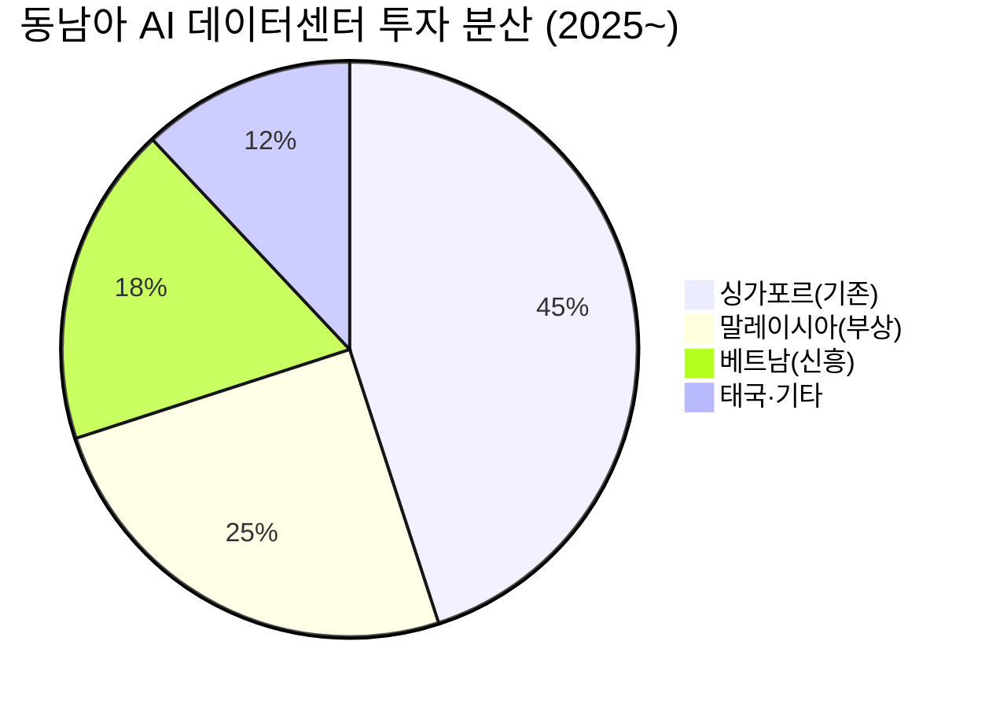

# 📊 모닝 브리핑 — 2026년 5월 18일 (월)

> **🔴 Risk-Off** — 인플레이션 재점화 + 지정학 불안으로 복합 충격
> - **매크로**: 미 10년물 국채 4.595%, 원/달러 1,500원 돌파, 유가 100달러 상회
> - **리스크**: 코스피 -6.12%, VIX 상승 압력, 기술주 전반 차익 실현
> - **시그널**: 외국인 코스피 ~5조 원 순매도 + 미·중 회담 실망감 → 위험자산 전반 약세

---

## 시장 스냅샷

### 주요 지수
| 지수 | 종가 | 등락 | 52주 위치 |
|------|------|------|----------|
| S&P 500 | 7,408.50 | -92.74 (-1.2%) | ██████████████████▉░ 95% (5,803–7,501) |
| 나스닥 | 26,225.14 | -410.08 (-1.5%) | ███████████████████░ 95% (18,737–26,635) |
| 다우존스 | 49,526.17 | -537.29 (-1.1%) | ██████████████████▌░ 92% (41,603–50,188) |
| 코스피 | 7,493.18 | -488.23 (-6.1%) | ██████████████████▎░ 91% (2,592–7,981) |
| 코스닥 | 1,129.82 | -61.27 (-5.1%) | ████████████████▎░░░ 81% (714–1,226) |
| 닛케이 225 | 61,409.29 | -1244.76 (-2.0%) | ██████████████████▋░ 93% (36,986–63,272) |

### 매크로/원자재/크립토
| 항목 | 값 | 변동 | 52주 위치 |
|------|-----|------|----------|
| 미국 10Y | 4.59% | +0.13%p | ████████████████████ 100% (4–5) |
| 미국 2Y | 3.59% | +0.00%p | ██▏░░░░░░░░░░░░░░░░░ 11% (4–4) |
| DXY | 99.27 | +0.39 (+0.4%) | ██████████████▎░░░░░ 71% (96–101) |
| USD/KRW | 1,497.76 | +4.42 (+0.3%) | █████████████████▊░░ 89% (1,348–1,516) |
| USD/JPY | 158.73 | +0.88 (+0.6%) | ██████████████████▎░ 92% (142–160) |
| WTI 원유 | $101.02 | -0.1% | ███████████████▉░░░░ 79% (55–113) |
| 금 (Gold) | $4,561.90 | -2.5% | ████████████▊░░░░░░░ 64% (3,229–5,318) |
| 은 (Silver) | $77.55 | -8.7% | ██████████▉░░░░░░░░░ 55% (32–115) |
| BTC | $77,994 | -0.2% | ████▉░░░░░░░░░░░░░░░ 25% (62,702–124,753) |
| VIX | 18.43 | +1.17 (+6.8%) | █████▋░░░░░░░░░░░░░░ 28% (13–31) |
| 10Y-2Y 스프레드 | 1.01%p | +0.13%p | — |

### 수급 동향 (최근 7 거래일, 05/07 ~ 05/15, KOSPI+KOSDAQ 합산)


**7일 누적**: 외국인 -31.0조 · 기관 +4,546억 · 개인 +30.4조

---
## 시장 센티먼트

<div style="background:#e0e0e0;border-radius:8px;overflow:hidden;margin:8px 0">
  <div style="background:#F44336;width:72%;padding:6px 12px;color:white;font-size:0.9em;white-space:nowrap">🔴 Risk-Off 72%</div>
</div>
<div style="background:#e0e0e0;border-radius:8px;overflow:hidden;margin:4px 0">
  <div style="background:#4CAF50;width:28%;padding:6px 12px;color:white;font-size:0.9em;white-space:nowrap;min-width:60px">🟢 Risk-On 28%</div>
</div>

**핵심 판독**: 유가 100달러 돌파와 미 10년물 금리 4.59%대는 "금리 인하 기대 → 인플레이션 재점화 우려"로의 내러티브 전환을 가속화하고 있습니다. 코스피가 8,000p 돌파 직후 6% 넘게 급락한 것은 단순 차익 실현이 아니라, 외국인의 리스크 재평가를 동반한 구조적 매도 신호로 읽어야 합니다. 당분간 매크로 데이터 하나하나가 시장 방향을 흔드는 데이터 디펜던트 장세가 지속될 가능성이 높습니다.

**변곡 촉매**:
- 🔴 **다운**: 이번 주 추가 물가 지표(PPI, PCE)에서 인플레이션 재가속 확인 시 → 연준 금리 인상 사이클 재개 공포로 증폭
- 🟢 **업**: 미·중 구체적 무역 합의 도출 또는 중동 지정학 완화 시그널 → 기술주·위험자산 되살림

---

## 섹터별 센티먼트

| 섹터 | 센티먼트 | 한줄 평가 |
|------|---------|----------|
| 반도체/AI | 🔴 약세 | 엔비디아·인텔 중심 대규모 차익 실현, 고점 이후 기술적 조정 구간 진입 |
| 에너지 | 🟢 강세 | 유가 100달러 돌파로 정유·E&P 실적 기대 상승, 단기 수혜 |
| 금융/은행 | 🟡 혼조 | 금리 상승 이자 마진 확대 vs 경기 둔화 대출 부실 우려 상충 |
| 소비재(내수) | 🔴 약세 | 원/달러 1,500원·유가 급등으로 가처분소득 압박, 소비 심리 위축 |
| 중국 관련주(IT·게임) | 🔴 약세 | 미·중 정상회담 실망감으로 협력 기대 선반영분 되돌림 |
| 인도·베트남 생산기지 수혜 | 🟢 강세 | ASML 인도 공장·삼성/LG 베트남 고도화 등 공급망 재편 구조적 수혜 지속 |
| 채권/달러 | 🟢 강세 | 달러 강세·국채 금리 상승으로 달러자산·단기채 선호 |

---

## 오버나이트 핵심 이벤트

### 1. 유가 100달러 돌파 + 미 10년물 4.59% — 인플레이션 내러티브 재점화

- **요약**: 중동 지정학 불안으로 국제유가가 배럴당 100달러를 상회했고, 4월 CPI·PPI가 동반 상승하면서 미 10년물 국채 금리가 4.595%까지 치솟았다.
- **So What**: 에너지발 인플레이션이 서비스 물가에 재전이될 경우, 연준이 연내 금리 인하 계획을 전면 철회하거나 최악의 경우 추가 인상을 고려해야 하는 시나리오로 전환된다. 이는 성장주·기술주의 할인율 상승으로 직결되어 밸류에이션 전반에 하방 압력을 가한다. 실질 금리 상승은 신흥국 자본 이탈도 가속화한다.
- **크로스 임팩트**: [[에너지 섹터]] 수혜, [[성장주/기술주]] 전반 압박, [[이머징마켓]] 환율·자본유출 리스크

### 2. 미·중 정상회담 실망감 — 기대 선반영분 급격 되돌림

- **요약**: 도널드 트럼프 대통령과 시진핑 주석의 정상회담이 시장이 기대하던 구체적 협력 성과 없이 마무리되며, 기술주와 중국 관련 주식에 실망 매물이 출회됐다.
- **So What**: 회담 기대감으로 사전에 상승했던 반도체·기술주가 결과 실망으로 "Buy the rumor, Sell the fact" 패턴을 그대로 재현했다. 미·중 무역 분쟁의 근본 구조가 해소되지 않은 상황에서 공급망 재편(탈중국) 테마는 오히려 강화 될 수 있으며, 인도·베트남 생산기지 수혜주의 중장기 모멘텀은 유지된다.
- **크로스 임팩트**: [[반도체/AI 기술주]] 단기 약세, [[인도·베트남 제조 수혜주]] 중장기 구조적 수혜

### 3. 코스피 8,000p 돌파 후 -6.12% 급락 + 원/달러 1,500원 재돌파

- **요약**: 코스피가 장중 사상 최초 8,000포인트를 돌파했으나, 외국인이 약 5조 원 규모의 대규모 순매도에 나서며 단일일 6.12% 급락으로 마감했고, 원/달러 환율은 1,500원을 재돌파했다.
- **So What**: 역사적 심리 저항선(8,000p)을 돌파한 직후 대규모 외국인 이탈은 **"이익 실현의 교과서적 사례"**이자, 글로벌 위험 회피 심리가 한국 시장에 집중적으로 표출된 결과다. 원화 약세 → 외국인 추가 자본 이탈의 악순환 가능성에 유의해야 한다. 수출주는 환율 수혜를 받지만, 원자재 수입 원가 상승이 마진을 상쇄할 수 있다.
- **크로스 임팩트**: [[코스피 대형주(삼성전자·SK하이닉스)]] 단기 수급 약세, 수출 대형주 환율 수혜 vs 원가 압박 상충

### 4. 마이크로소프트 — 빌 애크먼 지분 매입으로 하락장 속 차별화

- **요약**: 빌 애크먼의 펀드가 [[마이크로소프트(MSFT)]] 지분을 매입했다는 소식이 전해지며, 기술주 전반 하락 속에서도 마이크로소프트는 상대적 강세를 보였다.
- **So What**: 애크먼은 대형 퀄리티 성장주에 집중하는 투자자로, 이번 매입은 AI 클라우드·엔터프라이즈 소프트웨어의 장기 구조적 성장에 대한 확신 표명으로 해석된다. Risk-Off 장에서 "퀄리티 기업으로의 피난" 움직임이 나타날 수 있으며, 이는 FAANG 내에서도 종목 차별화가 심화될 것을 시사한다.
- **크로스 임팩트**: [[MSFT]] 상대 강세, [[AI 클라우드 인프라]] 섹터 투자 내러티브 유지

---

## 오늘의 일정

| 시간(한국) | 이벤트 | 중요도 | 관련 종목 |
|-----------|--------|--------|----------|
| 미국 시장 개장 전 | 주요 국채 금리 및 달러 인덱스 동향 확인 | ⭐⭐⭐⭐ | [[채권]], [[달러/원환율]] |
| 수~목 (주 중) | 미국 연준 위원 연설 일정 (인플레이션 스탠스 확인) | ⭐⭐⭐⭐ | [[금리 민감 성장주]], [[REITS]] |
| 목 (미국 시간) | 미국 4월 PCE 물가 발표 (예정) | ⭐⭐⭐⭐⭐ | [[전 종목]] |
| 이번 주 중 | 미국 원유 재고 주간 통계 발표 | ⭐⭐⭐ | [[에너지 섹터]], [[항공/운송]] |
| 이번 주 중 | 중동 지정학 상황 전개 모니터링 | ⭐⭐⭐⭐ | [[유가]], [[방산주]] |

> [!warning] ⭐⭐⭐⭐⭐ PCE 발표 시나리오 분기
> - **🟢 PCE 예상 하회 (디스인플레이션 재확인)**: 금리 인하 기대 회복 → 기술주·성장주 반등 가능, 코스피 외국인 매도 진정
> - **🔴 PCE 예상 상회 (인플레이션 재가속)**: 연준 인하 철회 공식화 → 미 국채 금리 추가 상승, 성장주 밸류에이션 추가 압박, 원화 약세 심화

---

## 테마 시그널

> [!abstract] 오늘의 테마: **공급망 재편의 2막 — "포스트 차이나 제조"는 인도와 베트남이 나눠 갖는가, 아니면 승자독식인가**

### 왜 지금 이 테마가 중요한가

미·중 정상회담이 실망으로 끝난 오늘, 역설적으로 이 이벤트가 가장 강하게 확인해주는 것은 하나다. **탈중국 공급망 재편은 일시적 트렌드가 아니라 10년짜리 구조적 흐름**이라는 것. ASML이 인도에 전 공정 반도체 공장을 세우고, 삼성·LG가 베트남을 단순 조립기지에서 기술·서비스 허브로 업그레이드하는 사건들은 이 흐름의 가속을 알리는 신호탄이다.

### 구조적 분석: 인도 vs 베트남 — 같은 방향, 다른 레이어

두 나라는 경쟁하는 것처럼 보이지만, 실제로는 글로벌 공급망의 **다른 층위**를 각자 차지하고 있다.

| 구분 | 인도 | 베트남 |
|------|------|--------|
| **강점** | 인구 14억, 영어 인력, 민주주의, 내수 시장 | 지리적 이점, 제조 숙련도, 빠른 인프라 구축 |
| **현재 포지션** | 반도체·첨단 제조 초기 진입, 소비재·스마트폰 | 전자·모바일 조립 완성형, AI 데이터센터 급부상 |
| **리스크** | 인프라 부족, 노동비 상승 압력, 관료주의 | 규모의 한계, 중국산 부품 의존도, 전력 공급 |
| **대표 수혜 기업** | ASML(장비 공급), 타타일렉트로닉스, Apple 생산 이전 | 삼성, LG, LS에코에너지, 비엣텔 |
| **투자 지평** | 5~15년 (인프라 구축 시간 필요) | 2~7년 (이미 진행 중) |

<div style="border-left:4px solid #FF9800;padding-left:12px;margin:8px 0">
<strong>핵심 비대칭:</strong> 베트남은 이미 과실을 수확하는 단계. 인도는 지금 심는 단계. 투자자는 타임 호라이즌에 따라 다른 베팅을 해야 한다.
</div>

### 인도 공급망 이전의 가장 큰 변수 — 노동 비용의 역설

ASML의 인도 진출 소식이 화려하지만, 오늘 데이터에서 동시에 포착된 불편한 진실이 있다. 인도 제조업 노동자들이 **고물가(특히 LPG 급등)를 감당하지 못해 도시를 떠나 귀향하고 있다**는 것. 이는 "메이크인 인디아"의 구조적 약점을 드러낸다.

```
[인도 제조업 성장의 모순]

글로벌 기업 진출 ────────────► 도시 제조업 일자리 수요 증가
                                        │
                                        ▼
                              에너지·식품 물가 급등 (이란발 LPG 충격)
                                        │
                                        ▼
                              실질 임금 하락 → 노동자 이탈 귀향
                                        │
                                        ▼
                         기업: 최저임금 인상 요구 압박 받음
                                        │
                              ┌─────────┴─────────┐
                              ▼                   ▼
                      인건비 상승 압력         생산 차질 리스크
```

이 모순이 해결되지 않으면, 인도는 "다음 중국"이 되기 전에 "다음 멕시코"(제조 포텐셜은 크지만 실현이 느린 나라)에 머물 수도 있다.

### 베트남의 다음 레벨업 — AI 데이터센터 허브 경쟁

LS에코에너지가 비엣텔의 초대형 AI 데이터센터에 전력 케이블을 공급하는 사례는 단순한 수출 수주가 아니다. **싱가포르의 전력·부지 제한이 동남아 데이터센터 투자를 말레이시아·태국·베트남으로 분산시키는 구조적 흐름**이 시작되었다는 신호다.



> [!tip] 핵심 인사이트
> 베트남은 이제 "값싼 조립 공장"이 아니다. AI 인프라 허브, 전자 제조 고도화, 재생에너지 투자가 동시에 진행되며 **고부가 제조·서비스 복합 거점**으로 진화하고 있다. 이 변화를 일찍 인지한 한국 기업들([[LS에코에너지]], [[삼성전자]], [[LG전자]])은 이미 포지셔닝 중이다.

### 투자 함의

<div style="display:flex;border-radius:8px;overflow:hidden;margin:8px 0;font-size:0.85em">
  <div style="background:#4CAF50;width:55%;padding:6px 8px;color:white">🟢 중장기 구조적 수혜 (인도·베트남 공급망)</div>
  <div style="background:#FF9800;width:30%;padding:6px 8px;color:white">🟡 중기 불확실성 (인도 노동·인프라)</div>
  <div style="background:#F44336;width:15%;padding:6px 8px;color:white;text-align:right">🔴 단기 변동성</div>
</div>

- **직접 수혜**: 베트남·인도 현지 제조 인프라 투자 기업 (전력, 케이블, 장비)
- **간접 수혜**: 탈중국 공급망 재편 수혜 EMS·ODM 기업, 현지 진출한 한국 대형 제조사
- **리스크 요인**: 인도 에너지 물가 불안, 미·중 관계 일시 개선 시 재편 속도 둔화 가능성

### 모니터링 포인트

| 지표 | 의미 | 주기 |
|------|------|------|
| 인도 WPI(도매물가) 추이 | 노동자 실질임금 압박 지속 여부 | 월간 |
| 베트남 FDI 유입액 | 제조·데이터센터 투자 가속 확인 | 분기 |
| ASML 인도 공장 착공 일정 | 인도 반도체 공급망 현실화 타임라인 | 수시 |
| 동남아 전력 인프라 투자 발표 | AI 데이터센터 입지 경쟁 심화 여부 | 수시 |
| 미·중 추가 무역 제재/완화 | 공급망 재편 속도 가속/감속 | 수시 |

---

## 대가의 시선

> "The stock market is filled with individuals who know the price of everything, but the value of nothing."
> ("주식 시장은 모든 것의 가격은 알지만 가치는 아무것도 모르는 사람들로 가득 차 있다.")
> — **필립 피셔(Philip Fisher)**, 『Common Stocks and Uncommon Profits』 [클래식]

**맥락**: 코스피가 사상 최초로 8,000포인트를 돌파하자마자 외국인의 5조 원 매도와 함께 6% 이상 급락한 오늘, 이 발언은 놀라운 정확도로 오늘 시장을 묘사한다.

**투자 함의**: 8,000포인트라는 숫자는 가격이지, 가치가 아니다. 오늘 시장 참여자의 상당수는 "8,000이 심리적 저항선이니 팔아야 한다"는 **가격 신호**에 반응했다. 반면 진정한 투자자라면 물어야 할 질문은 "코스피 구성 기업들의 이익 창출 능력이 이 가격 수준을 정당화하는가?"이다. 급락 후 반등 가능성을 타진할 때도 마찬가지다 — 8,000이 깨졌다는 가격 사실이 아니라, **기업 이익의 구조적 훼손 여부**가 재진입 판단의 기준이 되어야 한다.

---

## 투자 레슨

> [!abstract] 오늘의 레슨: **켈리 공식(Kelly Criterion) — "얼마나 베팅해야 하는가"가 "무엇에 베팅해야 하는가"만큼 중요한 이유**

### 왜 대부분의 투자자가 이 공식을 모르면 장기적으로 파산하는가

투자에서 가장 많이 논의되는 것은 "무엇을 사야 하나"이다. 그런데 정작 장기 수익을 결정하는 핵심 변수 중 하나는 **"얼마나 베팅해야 하나"**이다. 올바른 방향을 맞추고도 포지션 사이징을 잘못해서 파산하는 투자자들이 역사 속에 수없이 많다.

켈리 공식은 1956년 벨 연구소의 수학자 **존 L. 켈리 Jr.** 가 정보 이론에서 개발한 공식으로, 이후 클로드 섀넌, 에드 소프(블랙잭·카지노 천재, 이후 헤지펀드 운영)가 투자에 적용했다.

### 공식의 본질

**켈리 공식의 핵심**은 단순하다:

$$f^* = \frac{bp - q}{b}$$

- **f\*** = 투자해야 할 자본의 비율
- **b** = 순이익/투자금 비율 (1:2 베팅이면 b=2)
- **p** = 이길 확률
- **q** = 질 확률 (= 1 - p)

주식 투자에 맞게 다시 표현하면:

| 변수 | 주식 투자에서의 의미 |
|------|---------------------|
| p (이길 확률) | 내 분석이 맞을 확률 (승률) |
| b (수익 배율) | 이겼을 때 수익 / 졌을 때 손실 (손익비) |
| f* (최적 베팅 비율) | 포트폴리오에서 해당 종목에 배분할 최적 비중 |

### 직관적 예시 — 오늘 시장에 적용

오늘 코스피가 8,000p 돌파 후 6% 급락했다. 많은 투자자들이 직감적으로 "이제 저가 매수 기회다"라고 느낀다. 켈리 공식으로 이 상황을 구조화해보자.

**시나리오 설정 (예시)**:
- 내 분석: "코스피 반등 확률 = 60%, 추가 하락 확률 = 40%"
- 반등 시 예상 수익: +10%, 추가 하락 시 예상 손실: -8%

**계산**:
- b = 10/8 = 1.25 (수익이 손실의 1.25배)
- p = 0.60, q = 0.40

$$f^* = \frac{1.25 \times 0.60 - 0.40}{1.25} = \frac{0.75 - 0.40}{1.25} = \frac{0.35}{1.25} = 0.28$$

<div style="background:#e0e0e0;border-radius:8px;overflow:hidden;margin:8px 0">
  <div style="background:#FF9800;width:28%;padding:6px 12px;color:white;font-size:0.9em;white-space:nowrap;min-width:60px">최적 베팅 비율 28%</div>
</div>

켈리 공식이 제시하는 답: **포트폴리오의 28%를 이 베팅에 투입하라.** 100%를 몰아넣는 것도, 조심한다며 3%만 넣는 것도 최적이 아니다.

### 켈리 공식의 강력한 교훈 — "오버베팅은 언더베팅보다 훨씬 위험하다"

<div style="display:flex;border-radius:8px;overflow:hidden;margin:8px 0;font-size:0.85em">
  <div style="background:#4CAF50;width:40%;padding:6px 8px;color:white">🟢 적정 베팅: 장기 복리 성장 최대화</div>
  <div style="background:#FF9800;width:25%;padding:6px 8px;color:white">🟡 과소 베팅: 수익 기회 포기</div>
  <div style="background:#F44336;width:35%;padding:6px 8px;color:white;text-align:right">🔴 과도 베팅: 파산 위험</div>
</div>

**역설**: 방향을 맞춰도 오버베팅하면 파산한다. 연속으로 두 번의 절반짜리 손실이 발생하면 다시는 원금을 회복 못 하는 수학적 함정에 빠진다.

| 베팅 방식 | 결과 (10회 반복 후) |
|----------|---------------------|
| 켈리 × 0.5 (하프켈리) | 약 65% 수익, 파산 확률 거의 0 |
| 켈리 × 1.0 (풀켈리) | 약 100% 수익, 변동성 매우 큼 |
| 켈리 × 2.0 (더블켈리) | 장기적으로 거의 반드시 파산 |
| 올인 (켈리 무시) | 단기 대박 가능, 수열에서 파산 확정 |

> [!warning] 실전에서의 켈리 공식 함정
> 켈리 공식 자체가 위험한 이유: **p(승률)와 b(손익비)를 정확히 알 수 없다.** 내가 추정한 60% 승률이 실제로는 52%일 수 있다. 그래서 실전 투자자들은 **하프켈리(Half Kelly)** — 공식이 제시한 비율의 절반만 투자 — 를 쓴다. 수익은 75% 수준으로 줄지만, 드로우다운(낙폭)은 50%가 줄어든다.

### 전설적 사례 — 에드 소프의 켈리 적용

에드 소프는 블랙잭에서 카드 카운팅과 켈리 공식을 결합해 카지노를 체계적으로 이겼고, 이후 헤지펀드 **프린스턴/뉴포트 파트너스**에서 1969년~1988년 19년간 연평균 20%의 수익을 기록했다. 그의 핵심 원칙:

<div style="border-left:4px solid #4CAF50;padding-left:12px;margin:8px 0">
"승률이 있다고 확신할 때 충분히 크게 베팅하라. 하지만 파산할 수 있는 크기로는 절대 베팅하지 마라. 장기적으로 살아남는 것이 먼저다."
</div>

이와 대조적으로 **LTCM(Long-Term Capital Management)** 은 켈리 공식의 반대 사례다. 수학적으로 정교한 모델을 가졌지만, **레버리지를 과도하게 사용(오버베팅)** 했고, 모델이 틀린 단 한 번의 사건(1998년 러시아 디폴트·아시아 외환위기)으로 $4.6조 달러 규모의 포지션이 5주 만에 붕괴했다.

### 오늘 시장에의 적용

코스피가 8,000p 돌파 후 하루에 6% 급락하는 날, 많은 투자자들은 두 가지 극단 사이에서 흔들린다:

- **극단 1**: "지금이 기회다, 더 사야 해" → 공포를 느끼지 못하는 과잉확신
- **극단 2**: "더 떨어질 것 같다, 다 팔아야 해" → 공포에 완전히 지배됨

켈리 공식이 가르치는 것은 이 두 극단 모두 틀렸다는 것이다. **자신의 분석 근거(승률)와 손익비를 냉정하게 계산하고, 그에 따른 수학적 최적 비율만큼만 움직이는 것** — 이것이 감정이 아닌 확률적 사고다.

### 오늘 실천 방법

> [!tip] 오늘 실천
> 1. 지금 고민 중인 종목/자산이 있다면, 머릿속에서 **승률(p)과 손익비(b)를 명시적으로 숫자로 써보라**. "좋아 보인다"는 직관이 아니라, "내가 맞을 확률은 X%, 이길 때 Y% 수익/질 때 Z% 손실"로 구체화하는 것 자체가 강력한 리스크 관리다.
> 2. 계산된 최적 비율의 **절반(하프켈리)** 만 투입하라. 당신의 추정치가 틀렸을 때도 생존할 수 있는 여유를 확보하는 것이 장기 복리의 핵심이다.

---

## 오늘 하나만 기억한다면

> [!verdict] 오늘 하나만 기억한다면
> **"코스피 8,000 붕괴는 가격 이벤트다. 기업 이익의 구조적 훼손이 아니라면, 켈리 공식이 제시하는 수학적 비율만큼만 냉정하게 진입하라 — 감정으로 전부 팔거나, 흥분으로 전부 사거나, 둘 다 틀렸다."**