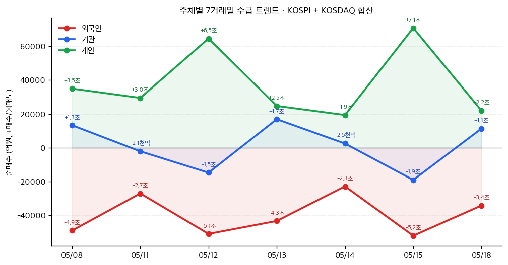

# 📊 모닝 브리핑 — 2026년 5월 19일 (화)

> **🔴 Risk-Off** — 국채금리 급등과 인플레이션 재점화 우려가 시장을 압박하는 국면
> - **매크로**: 미 10년물 국채금리 15개월 최고치 경신, 인플레이션 우려 재확산
> - **리스크**: 미 증시 전반 하락, 기술주 차익실현 + VIX 상승 압력 지속
> - **시그널**: ① 금리 인상 가능성 재부상 → 성장주 밸류에이션 재조정 압력 ② 중동 지정학 리스크 → 에너지 섹터 단기 수혜

---

## 시장 스냅샷

### 주요 지수
| 지수 | 종가 | 등락 | 52주 위치 |
|------|------|------|----------|
| S&P 500 | 7,384.92 | -23.58 (-0.3%) | ██████████████████▋░ 93% (5,803–7,501) |
| 나스닥 | 26,037.92 | -187.22 (-0.7%) | ██████████████████▌░ 92% (18,737–26,635) |
| 다우존스 | 49,523.05 | -3.12 (-0.0%) | ██████████████████▌░ 92% (41,603–50,188) |
| 닛케이 225 | 61,409.29 | -1244.76 (-2.0%) | ██████████████████▋░ 93% (36,986–63,272) |

### 매크로/원자재/크립토
| 항목 | 값 | 변동 | 52주 위치 |
|------|-----|------|----------|
| 미국 10Y | 4.60% | +0.01%p | ████████████████████ 100% (4–5) |
| 미국 2Y | 3.59% | +0.00%p | ██▏░░░░░░░░░░░░░░░░░ 11% (4–4) |
| DXY | 99.06 | -0.21 (-0.2%) | █████████████▎░░░░░░ 66% (96–101) |
| USD/KRW | 1,495.61 | +2.27 (+0.2%) | █████████████████▌░░ 88% (1,348–1,516) |
| USD/JPY | 158.85 | +0.47 (+0.3%) | ██████████████████▌░ 92% (142–160) |
| WTI 원유 | $102.87 | -2.4% | ████████████████▌░░░ 83% (55–113) |
| 금 (Gold) | $4,546.50 | -0.2% | ████████████▋░░░░░░░ 63% (3,229–5,318) |
| 은 (Silver) | $77.10 | -0.1% | ██████████▉░░░░░░░░░ 54% (32–115) |
| BTC | $76,275 | -1.5% | ████▍░░░░░░░░░░░░░░░ 22% (62,702–124,753) |
| VIX | 18.75 | +0.32 (+1.7%) | ██████░░░░░░░░░░░░░░ 30% (13–31) |
| 10Y-2Y 스프레드 | 1.01%p | +0.01%p | — |

### 수급 동향 (최근 7 거래일, 05/08 ~ 05/18, KOSPI+KOSDAQ 합산)



**7일 누적**: 외국인 -27.9조 · 기관 +8,316억 · 개인 +26.6조

---
## 시장 센티먼트

<div style="background:#e0e0e0;border-radius:8px;overflow:hidden;margin:8px 0;font-size:0.9em">
  <div style="display:flex;border-radius:8px;overflow:hidden">
    <div style="background:#F44336;width:68%;padding:6px 10px;color:white;font-size:0.9em">🔴 Risk-Off 68%</div>
    <div style="background:#4CAF50;width:32%;padding:6px 10px;color:white;font-size:0.9em">🟢 Risk-On 32%</div>
  </div>
</div>

**핵심 판독**: 미 국채 10년물 금리가 15개월 최고치를 기록하며 "금리 인상도 가능하다"는 시장 내러티브가 부활하고 있습니다. AI 랠리로 신고가를 경신했던 기술주는 차익실현 매물과 할인율 상승의 이중 압박을 받고 있으며, 중동 지정학 리스크까지 겹치며 위험회피 심리가 시장 전반을 지배하고 있습니다.

**변곡 촉매**:
- 🔴 **다운**: 추가 경제 지표 발표에서 인플레이션 지속 확인 → 연준 매파 전환 우려 심화
- 🟢 **업**: 미-이란 협상 진전 또는 에너지 가격 안정 → 인플레이션 기대 완화

---

## 섹터별 센티먼트

| 섹터 | 센티먼트 | 한줄 평가 |
|------|---------|----------|
| 대형 기술주 / AI | 🔴 약세 | AI 신고가 이후 차익실현 본격화 + 금리 상승 → 고밸류 성장주 재조정 국면 |
| 에너지 | 🟢 강세 | 중동 지정학 리스크 + 유가 급등 단기 수혜, 단 협상 재개 시 되돌림 주의 |
| 반도체 | 🟡 혼조 | AI 수요 펀더멘털 견고하나 매크로 역풍 + 차익실현 압력이 단기 상승 제한 |
| 국채 / 채권 | 🔴 약세 | 금리 15개월 최고치 → 기존 보유 채권 평가손 확대, 신규 매수 대기 |
| 금융 (은행/핀테크) | 🟡 혼조 | 고금리 NIM(순이자마진) 수혜 기대 vs. 신용 리스크 확대 우려 병존 |
| 우주 / 방산 | 🟢 강세 | 스페이스X IPO 기대감 + 지정학 리스크로 방산 수요 동반 부각 |
| 바이오 / CDMO | 🟡 관망 | 벤처투자 증가 긍정적, 그러나 고금리 환경이 장기 임상 비용 할인율 압박 |
| 에너지저장(ESS) | 🟢 강세 | EV 수요 둔화에 포드 등 ESS 전략 선회 → 배터리/ESS 관련 구조적 수요 재부각 |

---

## 오버나이트 핵심 이벤트

### 1. 미 국채 금리 15개월 최고치 — 인플레이션 재점화 우려
- **요약**: 미 10년물 국채 수익률이 15개월 최고치 수준으로 급등. 최근 발표된 CPI·PPI가 예상치를 상회하며 연준의 다음 스텝이 인하가 아닌 인상일 수 있다는 시장 관측이 강화됨.
- **So What**: 국채금리 급등은 단순히 채권시장의 문제가 아닙니다. 성장주 DCF 할인율이 올라가며 특히 AI·빅테크의 고밸류에이션을 직격합니다. 1차 효과는 기술주 멀티플 압축, 2차 효과는 기업 차입 비용 상승 → 설비투자 속도 조절 → AI 인프라 투자 모멘텀 둔화 가능성까지 이어집니다.
- **크로스 임팩트**: 🔴 나스닥/대형 기술주, 🔴 고배당 리츠, 🟢 단기 국채 및 MMF 수익률

### 2. 중동 지정학 리스크 재부상 — 유가 급등
- **요약**: 미-이란 협상 진전 부재와 트럼프 전 대통령의 강경 발언이 맞물리며 국제 유가가 급등. 에너지 시장이 다시 지정학적 리스크 프리미엄을 반영하기 시작.
- **So What**: 유가 급등은 이미 고공행진 중인 인플레이션 경로에 추가 연료를 공급하는 2중 악재입니다. 연준 입장에서는 "에너지發 인플레이션은 통제 불가능한 외생변수"라는 딜레마가 심화되고, 시장은 금리 인하 시점을 더욱 뒤로 미루게 됩니다.
- **크로스 임팩트**: 🟢 에너지 섹터·방산주, 🔴 항공·운송·소비재, 🔴 신흥국 경상수지 취약국

### 3. AI 랠리 신고가 후 기술주 차익실현 본격화
- **요약**: 주 중반 AI 기반 랠리로 미 증시가 신고가를 경신했으나, 이후 이틀 연속 대형 기술주를 중심으로 차익실현 매물이 출회되며 하락 전환. [[서비스나우(ServiceNow)]]는 AI 성장 전략에 힘입어 역방향 강세를 보이며 차별화.
- **So What**: 이번 차익실현은 단순 단기 조정인지, 아니면 "AI 기대 → 실적 현실" 격차 재인식의 시작인지가 핵심 관전 포인트입니다. 금리 역풍까지 겹친 현재 구도에서 AI 수혜주 중에서도 실제 매출이 발생하는 기업(서비스나우·마이크로소프트)과 기대치로만 올라간 기업 간 차별화가 가속될 가능성이 높습니다.
- **크로스 임팩트**: 🔴 밸류에이션 부담 높은 AI 플랫폼주, 🟢 실적 기반 B2B SaaS, 🟡 반도체 인프라주

### 4. EV에서 ESS로 — 포드 등 전략 선회 가시화
- **요약**: 전기차 수요 둔화가 지속되며 포드 등 주요 완성차 업체들이 EV 생산 일정을 조정하고 에너지저장시스템(ESS) 시장으로 전략 무게중심을 이동하는 신호가 포착됨.
- **So What**: EV 배터리와 ESS 배터리는 기술적으로 유사하나 시장 구조가 다릅니다. ESS는 전력망 안정화 수요가 AI 데이터센터 전력 수요와 맞물리며 구조적 성장이 기대됩니다. 배터리 업체들은 EV 수요 감소의 충격을 ESS로 헤지할 수 있는 포트폴리오 다변화 가능성이 높아집니다.
- **크로스 임팩트**: 🟢 ESS용 배터리 셀·팩, 🟡 EV 전용 완성차, 🟢 전력망 관련 인프라 기업

---

## 오늘의 일정

| 시간(한국) | 이벤트 | 중요도 | 관련 섹터/종목 |
|-----------|--------|--------|--------------|
| 장중 | 외국인 수급 동향 모니터링 (코스피·코스닥) | ⭐⭐⭐ | [[삼성전자]] [[SK하이닉스]] |
| 장중 | 국제 유가 (WTI/브렌트) 실시간 추이 | ⭐⭐⭐ | [[에너지 섹터]] [[항공주]] |
| 밤 (미 장중) | 미 국채 10년물 금리 방향성 확인 | ⭐⭐⭐⭐ | [[나스닥]] [[대형 기술주]] |
| 이번 주 | 미 연준 위원 발언 일정 (금리 경로 힌트) | ⭐⭐⭐⭐ | 전 종목 |
| 이번 주 | 미국 경기 선행 지표 및 주택시장 데이터 | ⭐⭐⭐ | [[금융주]] [[건설/소비재]] |

> [!warning] ⭐⭐⭐⭐ 미 국채금리 방향성 — 오늘 핵심 변수
> **시나리오 분기**: 금리가 추가 상승 시 → 기술주 멀티플 추가 압축, 방어주/에너지 상대 강세 / 금리가 안정 또는 하락 전환 시 → 낙폭 과대 기술주 반등 시도, AI 테마 재점화 가능. **오늘 미 국채 10년물이 재차 상승하느냐 안정화되느냐가 장 방향의 1번 변수입니다.**

---

## 테마 시그널

> [!abstract] 오늘의 테마: **우주 경제 3.0 — "발사체에서 데이터로" 산업 중심축 이동, 그리고 진짜 돈이 어디서 나는가**

### 왜 지금인가: 스페이스X IPO와 블랙록의 15조 원

세계 최대 자산운용사 블랙록이 스페이스X의 IPO에 최대 15조 원을 투자하는 방안을 검토하고 있다는 소식은 단순한 투자 뉴스가 아닙니다. 이는 기관투자자들이 "우주 산업은 이제 수익화 가능한 자산 클래스"라고 공식 인정하는 선언에 가깝습니다. 동시에 2030년 글로벌 우주 시장이 1조 달러를 넘어설 것으로 전망되는 시점에서, 국내 기업들(삼성전자, SK하이닉스, LG에너지솔루션)도 이 공급망에 진입하려는 움직임이 가시화되고 있습니다.

그렇다면 투자자가 알아야 할 핵심 구조적 변화는 무엇인가?

---

### 우주 경제의 세 단계 진화

```
우주 1.0 (1960~2000): 정부 독점
    → NASA, ESA 등 국가 기관이 탐사·군사 목적으로 운영
    → 비용: 1kg을 궤도에 올리는 데 $54,000 (스페이스셔틀 기준)
    → 수익 모델: 없음 (세금으로 운영)

우주 2.0 (2000~2020): 뉴스페이스 (민간 진입, 비용 혁신)
    → 스페이스X, 블루오리진 등 민간 기업 등장
    → 팰컨9 재사용으로 발사 비용 → $2,700/kg으로 급감
    → 수익 모델: 위성 발사 서비스, 상업적 화물 운송

우주 3.0 (2020~현재): 포스트 뉴스페이스 (수익화 산업)
    → 발사는 이제 "인프라", 진짜 경쟁은 데이터·서비스
    → 수익 모델: 위성 인터넷(스타링크), 지구 관측 데이터, 
                우주 보험, 정밀 농업, 국방 ISR
```

**이 전환이 왜 중요한가**: 발사체 산업은 스페이스X가 사실상 독점적 비용 우위를 확보한 "승자독식" 구조가 완성되었습니다. 그러나 다운스트림(서비스·데이터) 레이어는 아직 초기 경쟁 단계이고, 여기서 새로운 승자들이 탄생할 것입니다.

---

### 투자 관점: 업스트림 vs. 다운스트림의 수익 구조 비교

| 구분 | 업스트림 (발사체·위성 제조) | 다운스트림 (데이터·서비스) |
|------|--------------------------|--------------------------|
| 시장 성숙도 | 🟡 성숙 (스페이스X 지배적) | 🟢 초기 성장 |
| 진입 장벽 | 🔴 극히 높음 (수십조 CapEx) | 🟡 중간 (소프트웨어·분석 역량) |
| 마진 구조 | 🟡 규모의 경제 후 개선 | 🟢 높은 소프트웨어 마진 가능 |
| 한국 기업 접근성 | 🟡 부품·소재 공급망 진입 | 🟢 위성 반도체, 배터리, 통신 |
| 성장 드라이버 | 재사용 기술 고도화 | AI+위성 데이터 결합 |

> [!tip] 핵심 인사이트
> 우주 산업의 진짜 수익은 "로켓에서 나지 않는다". 로켓은 인터넷이 구축될 때 통신 케이블과 같은 인프라일 뿐이다. 진짜 돈은 그 위에서 돌아가는 **스타링크(위성 인터넷), 지구 관측 데이터, 우주 기반 AI 서비스**에서 나온다. 이는 마치 2000년대 초 통신 인프라보다 구글·아마존이 훨씬 큰 부를 창출한 것과 동일한 구조다.

---

### 한국 기업의 현실적 포지셔닝

국내 기업들이 스페이스X 직접 경쟁자가 될 수는 없습니다. 그러나 공급망 진입이라는 현실적 경로가 열리고 있습니다:

<div style="border-left:4px solid #4CAF50;padding-left:12px;margin:8px 0">
<b>우주용 반도체</b>: 방사선 내성(Radiation Hardening)을 갖춘 칩 수요 → 삼성전자·SK하이닉스의 HBM/저전력 반도체 기술이 응용 가능한 영역<br>
<b>우주용 배터리</b>: 극한 환경(-160°C~+120°C)에서 작동하는 배터리 → LG에너지솔루션 등의 기술 특화 가능 영역<br>
<b>탄소섬유·소재</b>: 발사체 경량화를 위한 효성첨단소재 등 첨단 소재<br>
<b>위성 통신</b>: 스타링크 경쟁 서비스 또는 지상국 인프라 → 통신 3사의 B2B 서비스 기회
</div>

---

### 모니터링 포인트

투자자가 지금부터 추적해야 할 신호들:

1. **스페이스X IPO 일정 구체화**: 블랙록의 15조 원 투자 검토는 IPO가 2026~2027년 실현 가능성이 높다는 신호. 상장 시 직접 투자 기회가 열리고, 국내 ETF로의 편입도 기대 가능
2. **스타링크 가입자 성장률**: 다운스트림 수익화의 핵심 지표. 분기별 가입자 데이터를 추적하면 우주 경제 수익화 속도를 가늠할 수 있음
3. **정부 우주 예산**: 미국 NASA 예산 + 한국항공우주청(KASA) 예산 집행 현황이 국내 관련 기업 수혜의 선행지표
4. **LEO(저궤도) 위성 충돌 리스크**: 스타링크 위성이 7,000개를 넘어서며 우주 교통 혼잡 문제 대두 → 규제 리스크이자 "우주 청소" 신산업 기회

> [!note] 참고
> 우주 산업은 AI처럼 "언제 수익이 나냐"는 질문을 받는 섹터입니다. 지금 단계에서는 순수 우주 플레이보다 **기존 사업과 우주가 교차하는 지점**(반도체·배터리·통신)에서 리스크 대비 수익이 더 유리할 수 있습니다.

---

## 대가의 시선

> "The stock market is a device for transferring money from the impatient to the patient."
> ("주식 시장은 조급한 자에게서 인내하는 자에게로 돈을 이전하는 장치다.")
> — **워런 버핏 (Warren Buffett)**, 버크셔 해서웨이 회장 [클래식]

**맥락**: 금리 급등, 지정학 리스크, 기술주 차익실현이 동시에 터지는 현재 장세처럼, 시장이 단기 악재에 흔들릴 때마다 반복적으로 소환되는 원칙입니다. 버핏이 1990년대 초부터 수십 년에 걸쳐 다양한 맥락에서 반복해온 표현으로, 그의 투자 철학의 핵심을 한 문장으로 담고 있습니다.

**투자 함의**: 오늘처럼 "금리가 인상될 수도 있다"는 내러티브가 지배하면 조급한 자들은 기술주를 팝니다. 그러나 AI의 구조적 성장 스토리가 훼손된 것이 아니라 단지 할인율이 바뀐 것이라면, 이 구간은 인내하는 자에게 기회가 될 수 있습니다. 핵심 질문은 "지금 팔아야 하는가"가 아니라 "내가 팔려는 이유가 실적 훼손인가, 아니면 단순 공포인가"를 구분하는 것입니다.

---

## 투자 레슨

> [!abstract] 오늘의 레슨: **평균회귀(Mean Reversion) — "모든 것은 평균으로 돌아온다, 그러나 그 타이밍은 아무도 모른다"**

### 왜 이 개념이 투자에서 가장 오해받는 법칙인가

"평균회귀"는 투자에서 가장 많이 언급되면서도 가장 잘못 사용되는 개념 중 하나입니다. 핵심은 간단합니다: **비정상적으로 높거나 낮은 값은 시간이 지나면 장기 평균으로 수렴하는 경향이 있다.** 그러나 여기서 치명적인 함정이 있습니다 — "경향이 있다"는 것과 "반드시, 그리고 곧 돌아온다"는 것은 완전히 다릅니다.

---

### 평균회귀가 실제로 작동하는 영역 vs. 작동하지 않는 영역

| 영역 | 평균회귀 작동? | 이유 |
|------|-------------|------|
| 기업 ROE (자기자본이익률) | 🟢 강하게 작동 | 경쟁 진입이 초과 이익을 침식 |
| P/E 밸류에이션 배수 | 🟢 작동 (단, 수년 단위) | 금리·성장 환경이 "정상" 상태 전제 |
| 단기 주가 모멘텀 | 🔴 반대로 작동 (모멘텀 지속) | 단기에는 추세 추종이 우세 |
| 주가 자체 수준 | 🔴 위험한 오류 | 평균이 바뀔 수 있음 (구조적 변화) |
| 섹터 마진율 | 🟡 부분적 작동 | 구조 변화 없으면 회귀, 있으면 새 평균 |
| 금리 수준 | 🟡 매우 긴 사이클 | 수십 년 단위 (1980~2020 = 하락 구조) |

> [!warning] 가장 위험한 오류: "많이 떨어졌으니 오를 것이다"
> 이것은 평균회귀가 아닙니다. 이것은 **평균회귀를 가장한 희망적 사고**입니다. 노키아가 스마트폰 출현 후 주가가 80% 하락했을 때 "평균으로 돌아올 것"이라고 매수한 투자자는 영구적 손실을 입었습니다. 기업의 이익 창출 능력 자체가 무너졌을 때는 평균이 아래로 재설정됩니다.

---

### 오늘 시장이 바로 이 원칙의 살아있는 사례

현재 시장에는 두 가지 평균회귀 내러티브가 충돌하고 있습니다:

**내러티브 A: "금리가 평균으로 돌아온다"**
2022~2023년 급격한 금리 인상 이후 "결국 금리는 다시 낮아질 것"이라는 기대. 그러나 이는 2010년대의 초저금리가 "정상"이고 현재 4~5%대 금리가 비정상이라는 전제를 깔고 있습니다. 역사적으로 보면 오히려 2010년대 제로금리가 비정상이었을 가능성이 있습니다.

**내러티브 B: "AI 버블이 평균으로 꺼진다"**
AI 관련 주식들의 급등 이후 "결국 밸류에이션은 평균으로 회귀할 것"이라는 베어 케이스. 이것이 맞으려면 AI가 실제로 기업 수익성을 구조적으로 높이지 못한다는 전제가 필요합니다. 만약 AI가 진짜로 생산성을 끌어올린다면, 높아진 P/E는 새로운 정상 범위가 됩니다.

<div style="display:flex;border-radius:8px;overflow:hidden;margin:8px 0;font-size:0.85em">
  <div style="background:#4CAF50;width:40%;padding:6px 8px;color:white">🟢 새 평균 안착 40%<br><small>AI 생산성 혁명 현실화</small></div>
  <div style="background:#FF9800;width:35%;padding:6px 8px;color:white">🟡 점진적 조정 35%<br><small>기대 과잉 일부 해소</small></div>
  <div style="background:#F44336;width:25%;padding:6px 8px;color:white">🔴 급격한 회귀 25%<br><small>실망스러운 AI 실적</small></div>
</div>

---

### 평균회귀를 올바르게 사용하는 프레임워크

**Step 1: 무엇의 평균인가를 특정하라**
막연히 "주가가 평균으로 회귀한다"가 아니라, "이 기업의 ROE가 역사적 평균 15%로 돌아간다"처럼 구체적인 펀더멘털 지표를 대상으로 삼아야 합니다.

**Step 2: 평균 자체가 변했는지 확인하라**
가장 중요한 질문: *왜 현재 값이 평균에서 이탈했는가?*
- 일시적 이유 (불황, 과잉 공포) → 평균회귀 기대 가능
- 구조적 이유 (기술 파괴, 경쟁 심화) → 새 평균으로 재설정 가능성

**Step 3: 타이밍이 아닌 포지션 사이징으로 대응하라**
평균회귀가 일어날 것이라 확신하더라도, "언제"는 알 수 없습니다. 케인스의 명언처럼 "시장은 당신이 상환 능력을 유지하는 것보다 더 오랫동안 비이성적으로 움직일 수 있습니다." 따라서 평균회귀 베팅은 타이밍 집중이 아니라 **작은 포지션, 장기 보유**로 접근해야 합니다.

---

**오늘 실천 방법**: 현재 하락 중인 기술주를 볼 때, "많이 떨어졌으니 산다"는 논리 대신 "이 기업의 ROE와 매출 성장률이 2년 후 역사적 평균 수준으로 회복될 근거가 있는가"를 먼저 확인하세요. 주가 수준이 아닌 **펀더멘털 지표의 평균회귀**를 기준으로 판단하는 것이 핵심입니다.

---

## 오늘 하나만 기억한다면

> [!verdict] 오늘 하나만 기억한다면
> **"국채금리 급등은 주가의 문제가 아니라 할인율의 문제다 — '실적이 망가졌는가'와 '할인율이 올라갔는가'를 구분하는 투자자가 이 구간에서 기회를 잡는다."**