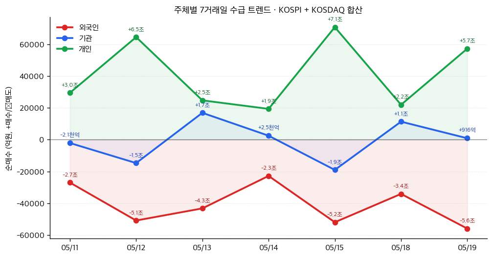

# 📊 모닝 브리핑 — 2026년 5월 20일 (수)

> **🔴 Risk-Off** — 고금리 + 기술주 관망 + 지정학 3중 압박
> - **매크로**: 미 10년물 국채금리 4.60% 돌파 (15개월 최고치), 중동 긴장 지속
> - **리스크**: S&P 500·나스닥 하락 / 다우 상승 혼조 마감, VIX 경계 수준
> - **시그널**: ① 오늘 밤 엔비디아 실적 발표 — 기술주 방향성 결정 분기점 ② 4월 FOMC 의사록 — 금리 경로 재확인

---

## 시장 스냅샷

### 주요 지수
| 지수 | 종가 | 등락 | 52주 위치 |
|------|------|------|----------|
| S&P 500 | 7,353.61 | -49.44 (-0.7%) | ██████████████████▎░ 91% (5,803–7,501) |
| 나스닥 | 25,870.71 | -220.02 (-0.8%) | ██████████████████▏░ 90% (18,737–26,635) |
| 다우존스 | 49,363.88 | -322.24 (-0.6%) | ██████████████████▏░ 90% (41,603–50,188) |
| 코스피 | 7,516.04 | +22.86 (+0.3%) | ██████████████████▎░ 91% (2,592–7,981) |
| 코스닥 | 1,111.09 | -18.73 (-1.7%) | ███████████████▌░░░░ 78% (714–1,226) |
| 닛케이 225 | 60,815.95 | -593.34 (-1.0%) | ██████████████████▏░ 91% (36,986–63,272) |

### 매크로/원자재/크립토
| 항목 | 값 | 변동 | 52주 위치 |
|------|-----|------|----------|
| 미국 10Y | 4.67% | +0.04%p | ████████████████████ 100% (4–5) |
| 미국 2Y | 3.58% | +0.01%p | █▊░░░░░░░░░░░░░░░░░░ 9% (4–4) |
| DXY | 99.31 | +0.34 (+0.3%) | ██████████████▍░░░░░ 72% (96–101) |
| USD/KRW | 1,506.83 | +9.68 (+0.6%) | ██████████████████▉░ 94% (1,348–1,516) |
| USD/JPY | 159.08 | +0.23 (+0.1%) | ██████████████████▊░ 93% (142–160) |
| WTI 원유 | $104.29 | -4.0% | █████████████████░░░ 85% (55–113) |
| 금 (Gold) | $4,482.90 | -1.5% | ████████████░░░░░░░░ 60% (3,229–5,318) |
| 은 (Silver) | $74.18 | -3.8% | ██████████▏░░░░░░░░░ 51% (32–115) |
| BTC | $76,684 | -0.4% | ████▌░░░░░░░░░░░░░░░ 23% (62,702–124,753) |
| VIX | 18.06 | +0.24 (+1.3%) | █████▎░░░░░░░░░░░░░░ 26% (13–31) |
| 10Y-2Y 스프레드 | 1.09%p | +0.04%p | — |

### 수급 동향 (최근 7 거래일, 05/11 ~ 05/19, KOSPI+KOSDAQ 합산)



**7일 누적**: 외국인 -28.6조 · 기관 -4,113억 · 개인 +28.8조

---
## 시장 센티먼트

<div style="background:#e0e0e0;border-radius:8px;overflow:hidden;margin:8px 0">
  <div style="display:flex;border-radius:8px;overflow:hidden;font-size:0.85em">
    <div style="background:#F44336;width:65%;padding:6px 10px;color:white">🔴 Risk-Off 65%</div>
    <div style="background:#FF9800;width:20%;padding:6px 10px;color:white">🟡 중립 20%</div>
    <div style="background:#4CAF50;width:15%;padding:6px 10px;color:white">🟢 15%</div>
  </div>
</div>

**핵심 판독**: 미 10년물 금리가 15개월 최고치를 경신하며 채권 시장이 먼저 비명을 질렀다. 고금리가 기술주 밸류에이션을 짓누르는 가운데, 엔비디아 실적 발표 대기 심리가 더해져 나스닥은 관망 속 약세를 보였다. 다우가 홀로 상승한 것은 '가치주로의 로테이션'보다 '기술주 회피'의 성격이 강하다.

**변곡 촉매**:
- 🔴 엔비디아 가이던스 실망 → 반도체·AI 섹터 동반 급락 + 금리 추가 상승 시 나스닥 연쇄 하락
- 🟢 엔비디아 어닝 서프라이즈 + FOMC 의사록에서 비둘기 시그널 → Risk-On 전환, 기술주 반등

---

## 섹터별 센티먼트

| 섹터 | 센티먼트 | 한줄 평가 |
|------|---------|----------|
| 반도체·AI | 🟡 관망 | 엔비디아 실적 발표 직전 — 결과에 따라 섹터 전체 방향 결정, 단기 변동성 확대 |
| 국채·채권 | 🔴 약세 | 10년물 4.60% 돌파, 인플레이션 재점화 우려 + 재정 부담으로 추가 상승 리스크 |
| 빅테크 | 🔴 약세 | 고금리 DCF 할인율 상승 → 고밸류에이션 성장주 직격, 관망 매물 출회 |
| 에너지 | 🟢 강세 | 미-이란 긴장 지속으로 유가 상승세 유지, 원유·천연가스 생산업체 수혜 |
| 천연가스·LNG | 🟢 강세 | 미국 생산량 감소 + FLNG 구조적 성장, 에너지 안보 수요 중장기 지지 |
| 구리·비철금속 | 🟡 혼조 | 중국 산업생산 예상치 하회로 수요 우려 vs. 에너지 전환 구조적 수요 상충 |
| 금·귀금속 | 🟡 혼조 | 골드만삭스 수요 둔화 전망 하향에 조정, 그러나 인플레이션 헤지 수요는 잠재 |
| 리튬·이차전지 | 🟡 관망 | 가격 회복 조짐 + ESS 수요 강세, 그러나 공급 과잉 구조 완전 해소엔 시간 필요 |

---

## 오버나이트 핵심 이벤트

### 1. 미 10년물 국채금리 15개월 최고치 돌파
- **요약**: 미국 10년물 국채금리가 4.60%를 넘어서며 약 15개월 만에 최고 수준을 기록했다.
- **So What**: 금리 급등은 단순한 채권 시장 이슈가 아니다. 성장주·기술주의 DCF 할인율이 직접 상승해 밸류에이션이 압축되고, 부동산·소비자 대출 금리도 연동 상승하며 실물 경기 냉각 압력이 커진다. 인플레이션이 재점화되거나 재정 우려(국채 발행 증가)가 겹칠 경우 금리는 추가 상방 압력을 받을 수 있다.
- **크로스 임팩트**: 나스닥·빅테크 밸류에이션 압축, 달러 강세, 이머징마켓 자본 유출 위험

### 2. 엔비디아 실적 발표 대기 — 기술주 전반 관망 심리
- **요약**: 2026년 5월 20일 엔비디아 실적 발표를 앞두고 반도체 지수와 기술주 전반이 선제적 약세를 보이며 혼조 마감했다.
- **So What**: 엔비디아는 현재 AI 인프라 수요 전체의 '바로미터' 역할을 한다. 실적과 가이던스가 어닝 서프라이즈를 기록하면 AI 사이클 지속 신호로 해석되어 반도체·클라우드·전력 인프라 전반의 반등 촉매가 된다. 반대로 수요 둔화 시그널이 나오면 섹터 전체의 프리미엄이 재평가될 수 있다.
- **크로스 임팩트**: [[삼성전자]], [[SK하이닉스]] 등 HBM 공급사, 국내 AI 테마 전반

### 3. 미-이란 긴장 고조 — 유가 상승세 지속
- **요약**: 중동 지정학적 불안이 이어지며 국제유가가 상승세를 유지했다.
- **So What**: 지정학 리스크로 인한 유가 상승은 에너지 섹터에는 단기 호재이나, 인플레이션 재점화 → 연준 금리인하 기대 후퇴 → 전반적 Risk-Off 강화라는 2차 효과를 유발한다. 현재 고금리 환경에서 유가 상승은 '스태그플레이션 우려'로 해석될 위험이 있다.
- **크로스 임팩트**: 원유·에너지 생산업체 수혜, 항공·해운·소비재 비용 부담 증가

### 4. 4월 FOMC 의사록 및 연준 위원 연설 예정
- **요약**: 이번 주 4월 FOMC 회의록 공개와 다수 연준 위원 연설이 예정되어 있다.
- **So What**: 금리 4.60% 돌파 시점에 나오는 FOMC 의사록은 시장 영향력이 배가된다. 연준이 인플레이션에 대해 얼마나 강경한 태도를 유지하고 있는지, 금리인하 시점에 대한 내부 논의가 어떤 방향인지가 채권과 주식 모두의 단기 방향을 결정할 것이다.
- **크로스 임팩트**: 미 국채 전 구간, 달러 인덱스, 금리 민감 섹터(부동산·유틸리티·성장주)

---

## 오늘의 일정

| 시간(한국) | 이벤트 | 중요도 | 관련 종목 |
|-----------|--------|--------|----------|
| 오늘 장마감 후 (미국 시간) | [[엔비디아]](NVDA) 1분기 실적 발표 | ⭐⭐⭐⭐⭐ | [[엔비디아]], [[삼성전자]], [[SK하이닉스]], [[TSMC]] |
| 이번 주 중 (미국 시간) | 4월 FOMC 의사록 공개 | ⭐⭐⭐⭐ | 미 국채, [[금융섹터]], 전 종목 |
| 이번 주 중 | 연준 위원 다수 연설 | ⭐⭐⭐ | 금리 민감 섹터, 달러 |

> [!warning] ⭐⭐⭐⭐⭐ 엔비디아 실적 — 시나리오 분기
> - 🟢 **어닝 서프라이즈 + 가이던스 상향**: AI 수요 사이클 재확인 → 반도체·기술주 급등, HBM 공급사 동반 상승
> - 🟡 **인라인(예상 부합)**: 단기 "소문에 사고 뉴스에 팔아" 반응 → 제한적 등락 후 관망
> - 🔴 **미스 또는 가이던스 하향**: AI 버블 우려 재점화 → 나스닥 급락, 반도체 섹터 전반 재평가

---

## 테마 시그널

> [!abstract] 오늘의 테마: **리튬 시장의 U자 회복 — "죽었다고 했는데 살아난다", 이차전지 공급 사이클의 진짜 바닥은 어디인가**

### 왜 지금 이 테마가 중요한가

2023~2025년 리튬 가격의 폭락은 '슈퍼사이클 사기극'이라는 냉소를 낳았다. 탄산리튬 가격은 2022년 고점 대비 80% 이상 폭락했고, 주요 생산업체들은 줄줄이 CAPEX를 삭감했다. 그런데 2026년 초부터 리튬 가격이 회복 조짐을 보이고 있다. **이것은 단순 반등인가, 아니면 구조적 전환점인가?** 이 질문에 답하려면 상품 시장의 공급 사이클을 제대로 이해해야 한다.

---

### 리튬 사이클의 구조 — 왜 이렇게 극단적으로 움직이는가

리튬 시장은 일반 상품과 달리 **공급 탄력성이 극도로 낮다**. 광산 개발부터 상업 생산까지 통상 5~10년이 걸리는 구조적 특성 때문이다.

```
수요 급증 신호
    ↓ (2020~2022: 전기차 보급 가속)
가격 폭등 → 전 세계 광산 투자 러시
    ↓ (수년간의 개발 지연)
공급 과잉 → 가격 폭락
    ↓ (2023~2025: CAPEX 삭감, 생산 축소)
공급 규율 회복 → 가격 바닥 → 회복 국면
    ↓ (지금?)
다음 수요 사이클을 위한 공급 부족 예고
```

이 사이클의 핵심은 **"가격이 떨어질 때 투자가 멈추고, 공급이 줄어드는 데 수년이 걸린다"**는 점이다. 지금 리튬 생산업체들이 생산 능력 관리에 엄격한 규율을 보이고 있다는 것은, 공급 측 조정이 이미 진행 중임을 의미한다.

---

### 수요 측의 세 가지 기둥

| 수요 기반 | 현재 상태 | 2년 후 전망 |
|----------|----------|------------|
| 전기차 (BEV) | 🟡 성장 둔화 우려 | 🟢 각국 규제 강화로 강제 확대 |
| 고정식 에너지저장시스템 (ESS) | 🟢 **급성장 중** | 🟢 재생에너지 확산의 핵심 인프라 |
| 전력망 현대화 | 🟡 정책 지원 유지 | 🟢 에너지 안보 투자 가속화 |

> [!tip] 핵심 인사이트: ESS가 새로운 핵심 드라이버
> 전기차 수요 둔화 우려가 많지만, **고정식 에너지저장시스템(ESS) 수요가 리튬 시장의 새로운 성장축으로 부상**하고 있다. 태양광·풍력 발전의 간헐성 문제를 해결하는 ESS는 재생에너지 확산이 가속화될수록 수요가 폭발적으로 증가한다. 이 수요는 전기차보다 더 예측 가능하고 안정적이다.

---

### 리튬 회복의 진짜 신호를 어떻게 읽는가

리튬 가격 회복이 '지속 가능한 구조적 상승'인지 '일시적 반등'인지 판단하려면 다음 지표를 함께 모니터링해야 한다.

**공급 측 체크리스트**:
- 📌 주요 광산업체(알버말, SQM, 필바라 미네랄스 등)의 생산 가이던스 → 삭감이 지속되는가?
- 📌 리튬 재고 레벨 (중국 내 탄산리튬 재고) → 감소 추세인가?
- 📌 신규 광산 프로젝트의 착공 지연 건수 → 공급 지연이 늘어나는가?

**수요 측 체크리스트**:
- 📌 중국 전기차 판매량 월별 추이 → 세계 최대 시장의 지표
- 📌 ESS 프로젝트 발주 물량 → 미국 IRA, 유럽 그린딜 수혜 확인
- 📌 배터리 제조사(CATL, LG에너지솔루션 등)의 리튬 장기계약 동향

---

### 역사적 유사 사례: 구리의 2015~2020년 사이클

<div style="border-left:4px solid #FF9800;padding-left:12px;margin:8px 0">
구리는 2015년 공급 과잉으로 파운드당 2달러 아래로 폭락했다. 이후 대형 광산업체들이 CAPEX를 대폭 삭감했고, 신규 광산 개발이 멈췄다. 5년 후인 2020~2021년, 전기차와 재생에너지 수요가 가세하자 구리 가격은 역대 최고치를 갈아치웠다. 핵심은 "공급 조정이 일어나는 동안 수요 기반이 구조적으로 성장하고 있었다"는 점이다. 리튬이 지금 그 경로의 어느 지점에 있는지가 핵심 질문이다.
</div>

---

### 투자 함의 — 무엇을 어떻게 볼 것인가

> [!warning] 리스크: 아직 공급 과잉 완전 해소는 확인 안 됨
> 리튬 가격 회복 조짐이 있지만, **공급 과잉 구조가 완전히 해소됐다는 확인은 아직 없다**. 중국의 저가 리튬 공급업체들이 버티고 있고, 일부 신규 광산 프로젝트는 여전히 가동 중이다. 가격 회복이 "공급 규율 효과"인지 "단기 재고 조정"인지 2~3분기 더 확인이 필요하다.

<div style="display:flex;border-radius:8px;overflow:hidden;margin:8px 0;font-size:0.85em">
  <div style="background:#4CAF50;width:35%;padding:6px 8px;color:white">🟢 구조적 상승 35%</div>
  <div style="background:#FF9800;width:45%;padding:6px 8px;color:white">🟡 추가 확인 필요 45%</div>
  <div style="background:#F44336;width:20%;padding:6px 8px;color:white">🔴 재폭락 20%</div>
</div>

**모니터링 포인트**: 향후 2분기 연속 리튬 재고 감소 + 주요 생산업체 생산 가이던스 삭감 유지 + ESS 프로젝트 발주 증가가 동시에 확인될 경우, 구조적 바닥 통과 가능성이 높아진다. 지금 당장의 가격 회복보다 **"공급 규율이 얼마나 오래 지속되는가"**가 핵심 변수다.

---

## 대가의 시선

> "The stock market is a device for transferring money from the impatient to the patient."
> ("주식 시장은 조급한 자에게서 인내심 있는 자에게로 돈을 이동시키는 장치다.")
> — **워런 버핏(Warren Buffett)** [클래식]

**맥락**: 버핏이 여러 인터뷰와 주주서한에서 반복적으로 강조해온 원칙으로, 단기 변동성 앞에서 투자자가 취해야 할 태도를 압축한 문장이다.

**투자 함의**: 오늘 시장은 엔비디아 실적 발표 하나를 앞두고 기술주 전반이 관망 속 약세를 보이고 있다. 금리 급등, 지정학 리스크, 실적 불확실성이 겹친 이 국면은 전형적으로 '조급한 자'가 흔들리는 환경이다. 그러나 AI 인프라 수요가 구조적으로 성장하고 있다는 큰 그림이 바뀌지 않았다면, 단기 이벤트 리스크에 반응해 포지션을 해체하는 것이 오히려 손실의 원인이 될 수 있다. 오늘 같은 날 버핏의 이 문장은 행동 지침이 된다: **"나는 지금 조급한 자인가, 인내심 있는 자인가?"**

---

## 투자 레슨

> [!abstract] 오늘의 레슨: **생존자 편향(Survivorship Bias) — "우리가 보는 성공 스토리는 전부 살아남은 것들뿐이다, 그리고 그것이 우리 판단을 얼마나 심각하게 왜곡하는가"**

### 핵심 개념 — 우리는 항상 반쪽짜리 그림을 본다

투자자들은 매일 성공 스토리를 읽는다. "이 ETF는 10년간 연 15%를 기록했다", "이 투자자는 테슬라에 초기 투자해 100배를 벌었다", "이 헤지펀드는 20년 연속 시장을 이겼다." 그런데 이 정보에는 치명적인 결함이 있다. **지금 우리 눈에 보이는 것은 살아남은 것들뿐이다.** 실패한 ETF, 파산한 투자자, 청산된 헤지펀드는 더 이상 데이터에 남아 있지 않다.

생존자 편향(Survivorship Bias)은 **선택 과정에서 탈락한 것들이 분석에서 제외되어, 남아 있는 성공 사례들이 현실을 왜곡하는 현상**이다. 이것은 단순한 통계적 오류가 아니다. 투자자의 기대 수익률, 전략 선택, 리스크 인식 전체를 체계적으로 오염시킨다.

---

### 역사적 기원 — 2차 세계대전의 비행기 이야기

<div style="border-left:4px solid #4CAF50;padding-left:12px;margin:8px 0">

**1943년, 수학자 에이브러햄 발드(Abraham Wald)에게 미 공군이 질문했다.**

"돌아온 폭격기들을 분석했더니 날개와 동체에 총탄 자국이 집중되어 있습니다. 이 부분을 보강해야 하지 않을까요?"

발드의 답: "아닙니다. **돌아온** 비행기에 총탄 자국이 많은 곳은 맞아도 살아남을 수 있다는 뜻입니다. 우리가 봐야 할 것은 **돌아오지 못한** 비행기들입니다 — 그 비행기들은 엔진에 총탄을 맞았을 겁니다."

</div>

미 공군은 눈에 보이는 데이터(귀환한 비행기)만 분석했고, 보이지 않는 데이터(격추된 비행기)를 완전히 무시했다. 발드의 통찰 덕분에 실제로 중요한 부분(엔진)을 보강할 수 있었다.

투자 세계에서 우리가 매일 하는 실수가 정확히 이것이다.

---

### 투자에서 생존자 편향이 작동하는 4가지 방식

| 영역 | 보이는 것 | 보이지 않는 것 | 왜곡 효과 |
|------|---------|--------------|----------|
| **뮤추얼펀드** | "이 펀드는 10년 연속 시장 초과 수익" | 같은 기간 폐지된 수백 개의 저성과 펀드 | 펀드 평균 성과가 실제보다 훨씬 높아 보임 |
| **슈퍼투자자** | 버핏, 린치, 소로스의 화려한 성과 | 같은 전략을 썼다가 파산한 수천 명의 투자자 | "이 전략은 통한다"는 과신 유발 |
| **백테스트** | "이 전략은 과거 20년간 연 25% 수익" | 해당 기간 살아남지 못한 종목들 (종목 풀이 왜곡됨) | 실제 적용 시 성과 대폭 하락 |
| **IPO·벤처** | 쿠팡, 배달의민족, 카카오의 성공 | 같은 시기 조용히 사라진 수천 개의 스타트업 | 스타트업 투자의 실패 확률 과소평가 |

---

### 실증 데이터로 본 생존자 편향의 규모

연구들이 밝혀낸 충격적인 사실:

- 📊 **미국 뮤추얼펀드 연구**: 1976~2006년 사이 존재했던 뮤추얼펀드의 **절반 이상이 폐지**되었다. 살아남은 펀드만 평균 내면 수익률이 실제보다 1~2%p 높게 계산된다.
- 📊 **S&P 500 구성 종목**: 1957년 S&P 500에 있던 종목 중 **현재까지 남아 있는 것은 약 12%**뿐이다. "S&P 500에 장기 투자하면 연 10%"라는 수치는 살아남은 종목과 탈락·교체된 종목을 모두 포함한 지수 기준이다.
- 📊 **헤지펀드**: 매년 전체 헤지펀드의 약 10%가 청산된다. 데이터베이스에는 살아남은 펀드들만 남기 때문에, 헤지펀드 산업 전체의 평균 성과는 실제보다 수 퍼센트포인트 높게 집계된다.

> [!warning] 핵심 경고
> 백테스트 결과가 화려할수록 생존자 편향을 의심하라. **역사적으로 '항상 통했던' 전략은 없다.** 있다면, 그것은 대부분 살아남은 사례만 분석한 결과다.

---

### 오늘 시장 상황에 적용 — 엔비디아와 AI 수혜주 내러티브

오늘 엔비디아 실적을 앞두고 AI 테마에 대한 기대가 다시 뜨겁다. 그런데 우리가 "AI 관련주는 모두 크게 올랐다"고 생각할 때, **생존자 편향이 작동하고 있다.**

<div style="border-left:4px solid #FF9800;padding-left:12px;margin:8px 0">

AI 붐 초기에 'AI 수혜주'로 불렸던 수십 개 기업 중 현재 시장의 주목을 받는 것은 소수다. 나머지는 조용히 주가가 반토막 났거나, 이름이 사라졌다. 우리는 성공한 AI 기업들만 기억하고, "AI 투자는 대박"이라는 확증을 얻는다. 하지만 AI 인프라 수혜의 실제 승자는 극소수에 집중되어 있고, 그 승자를 사전에 골라내는 것은 훨씬 어렵다.

</div>

엔비디아 한 기업이 AI 사이클에서 독보적 수혜를 누리는 것은 사실이다. 그러나 "AI 테마면 다 오른다"는 생각은 생존자 편향의 전형적인 함정이다.

---

### 생존자 편향을 극복하는 실전 체크리스트

```
투자 전 자문해야 할 질문들:
□ 이 성공 데이터에서 실패 사례가 제외된 것은 아닌가?
□ 이 전략을 썼다가 실패한 사람들은 왜 실패했는가?
□ 이 백테스트는 해당 기간 상장폐지된 종목을 포함했는가?
□ 내가 분석하는 슈퍼투자자는 운의 비중이 얼마나 되는가?
□ 이 펀드의 과거 수익률은 생존한 펀드 기준인가, 전체 기준인가?
□ 성공한 기업의 공통점을 찾기 전에, 실패한 기업도 그 공통점을 가졌는가?
```

**오늘 실천 방법**: 오늘 엔비디아 실적 발표 결과를 보고 "AI 투자는 역시 맞았어"라고 확증하기 전에, **AI 인프라 수혜에서 소외된 기업들의 리스트를 함께 확인**해보라. 승자의 성공 이유와 패자의 실패 이유를 함께 분석할 때, 비로소 절반이 아닌 전체 그림이 보인다.

---

## 오늘 하나만 기억한다면

> [!verdict] 오늘 하나만 기억한다면
> **"엔비디아 실적이 오늘의 이벤트이지만, 10년물 4.60% 돌파가 오늘의 구조다 — 단기 이벤트에 반응하기 전에 금리가 바꾼 게임의 규칙을 먼저 확인하라."**