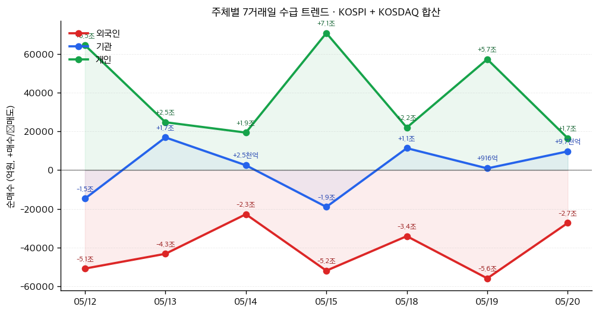

# 📊 모닝 브리핑 — 2026년 5월 21일 (목)

> **🟡 Risk-On/Off 혼조** — 미 증시 반등에도 매크로 불안 상존
> - **매크로**: 30년물 美 국채 5.20% (19년 최고), 원/달러 1,500원대 지속, 日 10년물 29년 최고
> - **리스크**: S&P 500 사상 최고치 근접 vs. 글로벌 금리 급등 / VIX 데이터 확인 요
> - **시그널**: ① FOMC 회의록 매파 확인 → 금리 인하 기대 후퇴 / ② BOJ 6월 인상 시사 → 엔 캐리 리스크 재부각

---

## 시장 스냅샷

### 주요 지수
| 지수 | 종가 | 등락 | 52주 위치 |
|------|------|------|----------|
| S&P 500 | 7,432.97 | +79.36 (+1.1%) | ███████████████████▎ 96% (5,803–7,501) |
| 나스닥 | 26,270.36 | +399.65 (+1.5%) | ███████████████████▏ 95% (18,737–26,635) |
| 다우존스 | 50,009.35 | +645.47 (+1.3%) | ███████████████████▋ 98% (41,603–50,188) |
| 코스피 | 7,271.66 | -244.38 (-3.3%) | █████████████████▍░░ 87% (2,592–7,981) |
| 코스닥 | 1,084.36 | -26.73 (-2.4%) | ██████████████▌░░░░░ 72% (716–1,226) |
| 닛케이 225 | 60,550.59 | -265.36 (-0.4%) | █████████████████▉░░ 90% (36,986–63,272) |

### 매크로/원자재/크립토
| 항목 | 값 | 변동 | 52주 위치 |
|------|-----|------|----------|
| 미국 10Y | 4.57% | -0.09%p | █████████████████▍░░ 87% (4–5) |
| 미국 2Y | 3.56% | -0.02%p | █▍░░░░░░░░░░░░░░░░░░ 7% (4–4) |
| DXY | 99.13 | -0.17 (-0.2%) | █████████████▌░░░░░░ 68% (96–101) |
| USD/KRW | 1,496.45 | +4.13 (+0.3%) | █████████████████▋░░ 88% (1,348–1,516) |
| USD/JPY | 158.86 | +0.00 (+0.0%) | ██████████████████▌░ 92% (142–160) |
| WTI 원유 | $98.94 | -8.2% | ███████████████▏░░░░ 76% (55–113) |
| 금 (Gold) | $4,536.30 | +0.7% | ████████████▍░░░░░░░ 62% (3,274–5,318) |
| 은 (Silver) | $75.65 | +1.1% | ██████████▍░░░░░░░░░ 52% (33–115) |
| BTC | $77,350 | +0.8% | ████▊░░░░░░░░░░░░░░░ 24% (62,702–124,753) |
| VIX | 17.44 | -0.62 (-3.4%) | ████▌░░░░░░░░░░░░░░░ 23% (13–31) |
| 10Y-2Y 스프레드 | 1.02%p | -0.08%p | — |

### 수급 동향 (최근 7 거래일, 05/12 ~ 05/20, KOSPI+KOSDAQ 합산)



**7일 누적**: 외국인 -28.6조 · 기관 +7,677억 · 개인 +27.5조

---
⚠️ 시장 스냅샷이 시스템에 의해 자동 삽입됩니다.

---

## 시장 센티먼트

<div style="background:#e0e0e0;border-radius:8px;overflow:hidden;margin:8px 0;font-size:0.9em">
  <div style="display:flex;border-radius:8px;overflow:hidden">
    <div style="background:#4CAF50;width:42%;padding:6px 10px;color:white;white-space:nowrap">🟢 Risk-On 42%</div>
    <div style="background:#FF9800;width:32%;padding:6px 10px;color:white;white-space:nowrap">🟡 중립 32%</div>
    <div style="background:#F44336;width:26%;padding:6px 10px;color:white;white-space:nowrap">🔴 Risk-Off 26%</div>
  </div>
</div>

**핵심 판독**: 미국 증시는 기업 실적 기대감(엔비디아 실적 예정)과 단기 국채금리 진정에 힘입어 반등하며 Risk-On으로 기울었으나, FOMC 회의록의 매파 재확인과 일본·유럽 중앙은행의 금리 인상 기조 강화로 글로벌 유동성 축소 우려가 동시에 진행 중입니다. S&P 500이 사상 최고치에 근접하는 낙관론과, 30년물 금리 5.20% 돌파라는 구조적 압력이 팽팽히 맞서는 이중 국면입니다.

**변곡 촉매**:
- 🔴 **다운**: 엔비디아 실적 쇼크 또는 가이던스 실망 → 기술주 밸류에이션 전반 재조정 트리거
- 🟢 **업**: 이번 주 美 PCE·PPI 데이터 예상 하회 → 금리 인하 기대 재점화, 위험 자산 반등

---

## 섹터별 센티먼트

| 섹터 | 센티먼트 | 한줄 평가 |
|------|---------|----------|
| AI·반도체 | 🟢 강세 | 엔비디아 실적 발표 임박 — 기대감이 시장 전체 리스크온 주도, 쇼크 시 낙폭도 대 |
| 일본 금융주 | 🟢 강세 | BOJ 6월 인상 시사 + 10년물 29년 최고 → 은행 이자마진 확대 수혜 |
| 미국 장기채 | 🔴 약세 | 30년물 5.20% (19년 최고) — 금리 추가 상승 시 채권 가격 추가 하락 경계 |
| 원화 자산(한국 증시) | 🔴 약세 | 외국인 순매도 8~9일 연속 + 원/달러 1500원대 고착 → 수급 공백 지속 |
| 에너지 | 🟡 혼조 | 중동 리스크로 유가 고공행진 → 에너지 기업 이익 ↑ vs. 인플레이션 재자극 우려 |
| 유럽 은행 | 🟡 혼조 | ECB 6월 인상 유력 → 이자마진 긍정, 경기 둔화 가속 시 대출 부실 리스크 상충 |
| 글로벌 부동산(리츠) | 🔴 약세 | 미·일·유럽 동반 장기금리 급등 → 리츠 할인율 상승, 가격 재평가 압박 |

---

## 오버나이트 핵심 이벤트

### 1. 美 30년물 국채금리 19년 만에 최고치 후 진정
- **요약**: 5월 19일 미국 30년물 국채금리가 5.20%까지 상승하며 19년 만에 최고치를 기록했고, 5월 20일 들어 일부 진정되며 증시 반등의 발판이 되었습니다.
- **So What**: 장기금리 급등은 단순한 채권 시장 이벤트가 아니라 전체 자산 가격의 분모(할인율) 상승을 의미합니다. 특히 30년물 5%대는 주식의 '위험 프리미엄(Equity Risk Premium)'을 압박하여 고PER 성장주에 직격탄이 됩니다. 하루 만에 진정되었다 해도 구조적 원인(재정적자, 인플레이션 재자극 우려)이 해소되지 않아 변동성은 이어질 가능성이 높습니다.
- **크로스 임팩트**: 미국 장기채 🔴, 글로벌 리츠 🔴, 달러화 자산 강세 → 신흥국 통화(원화 포함) 🔴

### 2. FOMC 회의록 — "인플레이션 지속 시 금리 인상 검토"
- **요약**: 5월 20일 공개된 4월 FOMC 회의록에서 일부 위원들이 인플레이션이 목표를 계속 상회할 경우 금리 인상을 재개할 수 있다는 매파적 입장을 명시했습니다.
- **So What**: 시장이 기대하던 '연내 금리 인하 경로'에 대한 신뢰가 추가로 훼손됩니다. 금리 동결을 넘어 인상 가능성이 공식 의사록에 등장했다는 것은 심리적으로 강력한 충격입니다. 에너지 가격 상승 → 인플레이션 재점화 → 연준 긴축 장기화라는 연쇄 시나리오의 현실화 가능성을 높여줍니다.
- **크로스 임팩트**: 금리 인하 수혜 섹터(성장주, 리츠, 소형주) 🔴 재평가, 달러 강세 → 원자재(달러 표시) 🟡

### 3. BOJ 우에다 총재 — "장기금리 매우 빠르게 상승, 면밀히 주시"
- **요약**: G7 회의에서 우에다 BOJ 총재가 일본 10년물 금리가 29년 만의 최고치로 빠르게 상승하고 있다고 경고하며, 시장 동향을 면밀히 주시하겠다고 발언했습니다.
- **So What**: BOJ가 6월 금리 인상을 시사하는 가운데 일본 장기금리 급등은 두 가지 경로로 글로벌 시장에 파장을 줍니다. ① 일본 투자자들의 해외 자산 환매(특히 미국채 매도) → 미국 장기금리 추가 상승 압력, ② 엔 캐리 트레이드 청산 촉진 → 글로벌 위험 자산 변동성 확대. 지난 7일 브리핑에서 엔 캐리 트레이드를 심층 분석했지만, 오늘 BOJ 발언은 그 리스크가 점점 현실에 가까워지고 있음을 재확인시킵니다.
- **크로스 임팩트**: 엔화 강세 전환 시 → 일본 수출주 🔴, 신흥국 주식 🔴, 미국 장기채 추가 압력 🔴

### 4. 한국 외국인 순매도 연속 + 원/달러 1500원대 고착
- **요약**: 한국 증시에서 외국인의 순매도가 8~9거래일 연속 이어졌으며, 원/달러 환율은 장중 1,513원까지 치솟으며 4거래일째 1,500원선을 유지했습니다.
- **So What**: 원화 약세는 단순히 환율 숫자의 문제가 아닙니다. 외국인 입장에서 원화 자산을 보유하면 환차손이 발생하므로, 원화 약세가 지속되는 한 외국인 순매도의 악순환이 끊기기 어렵습니다. 또한 수입 물가 상승 → 국내 인플레이션 재자극 → 한국은행 금리 인하 속도 제약이라는 경로도 열립니다.
- **크로스 임팩트**: 코스피·코스닥 전반 🔴, 수입 의존 내수 기업 🔴, 수출 기업(환율 수혜) 🟢 혼조

---

## 오늘의 일정

| 시간(한국) | 이벤트 | 중요도 | 관련 종목/섹터 |
|-----------|--------|--------|--------------|
| 오늘 오후 장마감 후 (미 동부 기준) | [[엔비디아(NVDA)]] 1분기 실적 발표 | ⭐⭐⭐⭐⭐ | [[엔비디아]], [[AMD]], [[TSMC]], [[SK하이닉스]], [[삼성전자]] |
| 오늘 밤 (미 동부 9:30) | 미국 주간 신규 실업수당 청구건수 | ⭐⭐⭐ | 전 종목 |
| 이번 주 내 | 미국 제조업·서비스업 PMI (플래시) | ⭐⭐⭐⭐ | 경기민감주, 채권 |
| 다음 주 | 미국 4월 PCE 물가 발표 | ⭐⭐⭐⭐⭐ | 전 종목, 특히 성장주·채권 |

> [!warning] ⭐⭐⭐⭐⭐ 엔비디아 실적 — 시나리오 분기
> - **어닝 비트 + 가이던스 상향**: AI 투자 사이클 재확인 → 반도체 전반 랠리, 코스피 HBM 수혜주 동반 강세
> - **컨센서스 부합 + 가이던스 유지**: 단기 "소문에 사고 뉴스에 팔기" 차익실현 가능성
> - **미스 또는 가이던스 하향**: 기술주 밸류에이션 전반 재조정, 시장 전체 Risk-Off 전환 가능

---

## 테마 시그널

> [!abstract] 오늘의 테마: **중앙은행 정책 차별화의 끝판왕 — "모두가 동시에 조이면 무슨 일이 벌어지는가"**
> 미국·유럽·일본이 동시에 긴축 기조를 유지하거나 강화하는 사상 초유의 국면. 이 구조적 변화가 글로벌 자금 흐름을 어떻게 재편하는지 짚는다.

### 왜 지금인가 — 시의성

2008년 금융위기 이후 약 15년간 글로벌 중앙은행들은 사실상 '공조 완화' 모드를 유지했습니다. 美 연준이 금리를 내리면 ECB도, BOJ도 따라가거나 이미 제로금리 상태였습니다. 그러나 지금 우리가 목격하는 것은 그 반대입니다.

- **Fed**: 기준금리 3.5~3.75% 동결, 일부 위원 인상 재개 가능성 시사
- **ECB**: 4월 동결, 6월 인상 유력 시사
- **BOJ**: 수십 년의 마이너스 금리 탈출을 넘어 6월 추가 인상 가능성, 10년물 29년 최고치
- **BOK(한국은행)**: 원화 약세 압력 속 금리 인하 속도 제약

이 네 개의 중앙은행이 '동시에 긴축적 or 덜 완화적' 스탠스를 취하는 것은 현대 금융사에서 매우 드문 사건입니다.

---

### 구조적 분석 — "정책 차별화"가 아니라 "동반 긴축"으로 진화 중

흔히 '중앙은행 정책 차별화'라고 하면, 어떤 나라는 내리고 어떤 나라는 올리는 식의 갈림길을 의미합니다. 그러나 2026년 현재 상황은 조금 다릅니다.

**글로벌 긴축의 3가지 엔진**:

| 요인 | 내용 | 주도 국가 |
|------|------|----------|
| 에너지 인플레이션 | 중동 전쟁 장기화 → 유가 고공행진 | 전 세계 공통 |
| 재정적자 확대 | 국채 공급 폭증 → 장기금리 구조적 상승 | 美·일본 |
| 임금 인플레이션 | 노동시장 타이트함 지속 | 美·유럽 |

이 세 엔진이 작동하는 한, 어떤 중앙은행도 공격적으로 금리를 내리기 어렵습니다. 설령 내리고 싶어도 자국 통화 약세와 자본 유출 압력이 발목을 잡습니다. 이것이 바로 **먼델-플레밍의 트릴레마(Mundell-Fleming Trilemma)** 의 현대적 재현입니다 — 자유로운 자본 이동 환경에서는 독립적인 통화정책과 환율 안정을 동시에 달성할 수 없습니다.

**한국의 딜레마**를 예시로 들면:

<div style="border-left:4px solid #FF9800;padding-left:12px;margin:8px 0">

**한국은행의 선택지 분석**

① **금리 인하 (성장 우선)**: 원/달러 추가 상승 → 외국인 자금 이탈 가속 → 주식·채권 동반 약세
② **금리 동결/인상 (환율 방어)**: 내수 경기 둔화 → 기업 실적 압박 → 증시 중기 부담
③ **외환시장 개입**: 외환보유고 소진 → 지속 불가능한 임시방편

결국 한국은행은 세 가지 목표(환율 안정 + 경기 부양 + 물가 안정) 중 하나를 포기해야 하는 구조에 놓여 있습니다.
</div>

---

### 역사적 유사 국면 — 1994년 '채권 학살(Bond Massacre)'

지금과 가장 닮은 역사적 사례는 1994년입니다.

| 구분 | 1994년 | 2026년 현재 |
|------|--------|------------|
| 연준 금리 방향 | 예상 밖 급격한 인상 | 인상 재개 가능성 시사 |
| 글로벌 채권 | 동반 급락 ("채권 학살") | 미·일·유럽 장기금리 동반 상승 |
| 이머징마켓 | 멕시코 페소 위기(1994~1995) | 한국 원화 1500원대, 신흥국 통화 압박 |
| 주식 시장 | S&P 500 연간 -1.5% (횡보) | 반등-조정 반복, 변동성 지속 |
| 촉발 요인 | 인플레이션 우려 + 재정 적자 | 동일 |

> [!warning] 1994년과의 차이
> 당시에는 Fed 혼자 긴축 드라이버를 잡았습니다. 지금은 Fed·ECB·BOJ가 **모두 동시에** 긴축적 스탠스입니다. 충격의 규모가 더 클 수 있습니다. 특히 BOJ의 정책 전환은 세계 최대 채권 보유국(일본 생명보험사·연기금)의 자산 재배분을 유발할 수 있습니다.

---

### 투자 함의 — 이 국면에서 살아남는 자산 배분

**글로벌 금리 동반 상승 국면의 자산 성과 역사**:

```
장기채      → 🔴 최악의 자산 (할인율 직격)
리츠/인프라 → 🔴 채권 대안 지위 훼손
성장주(고PER)→ 🟡 단기 변동성 크나, AI처럼 실질 성장 있으면 버팀
가치주/배당 → 🟢 상대적 강세 (현금흐름 즉각 발생)
단기채/MMF  → 🟢 금리 상승의 수혜 (빠른 리프라이싱)
원자재      → 🟢 인플레이션 헤지, 에너지 특히 강세
금          → 🟢 실질금리가 횡보하는 한 견조
```

<div style="display:flex;border-radius:8px;overflow:hidden;margin:8px 0;font-size:0.85em">
  <div style="background:#4CAF50;width:35%;padding:6px 8px;color:white">🟢 선호: 단기채·원자재·금 35%</div>
  <div style="background:#FF9800;width:40%;padding:6px 8px;color:white">🟡 중립: 가치주·AI성장주 40%</div>
  <div style="background:#F44336;width:25%;padding:6px 8px;color:white">🔴 비선호: 장기채·리츠 25%</div>
</div>

---

### 모니터링 포인트

1. **美 PCE 물가 (다음 주)**: 예상 상회 시 → FOMC 회의록의 '인상 재개 경고'가 현실화 경로 진입
2. **BOJ 6월 회의**: 실제 금리 인상 단행 여부 → 엔 캐리 청산의 트리거가 될 수 있음
3. **미·일 30년물 금리 동향**: 동반 5%+ 유지 시 → 글로벌 포트폴리오 리밸런싱 본격화
4. **달러 인덱스(DXY)**: 달러 강세가 신흥국 자금 이탈을 가속시키는 임계점

> [!tip] 핵심 인사이트
> 지금은 "어느 중앙은행이 먼저 피벗하느냐"의 게임이 아니라, "누가 가장 오래 긴축을 버티느냐"의 게임으로 바뀌었습니다. 투자 프레임 자체를 '피벗 기대' 에서 '긴축 생존'으로 전환할 시점입니다.

---

## 대가의 시선

> "Rates are high and they're going to stay high for longer than people expect. The era of free money is over, and the assets that were priced for free money need to be repriced."
> *(금리는 높고, 사람들의 예상보다 훨씬 오래 높은 수준을 유지할 것이다. 공짜 돈의 시대는 끝났으며, 공짜 돈을 전제로 가격이 매겨졌던 자산들은 재평가되어야 한다.)*
> — **레이 달리오(Ray Dalio)**, 브리지워터 어소시에이츠 창업자 [클래식 — 반복적으로 강조해온 구조적 전망]

**맥락**: 달리오가 2022~2023년 이후 지속적으로 강조해 온 '부채 사이클의 전환'에 관한 견해입니다. 그는 장기 부채 사이클(Long-term Debt Cycle)의 관점에서, 수십 년간 누적된 저금리 의존 구조가 인플레이션과 재정 압박으로 인해 근본적으로 바뀌고 있다고 주장합니다.

**투자 함의**: 오늘 브리핑의 핵심 테마인 '글로벌 동반 긴축'은 달리오의 이 프레임과 정확히 연결됩니다. '공짜 돈을 전제로 가격이 매겨진 자산'이란 ① 마이너스 실질금리 시대의 리츠, ② 무한 확장을 가정한 고PER 성장주, ③ 저금리 덕분에 굴러가던 좀비 기업들의 채권을 의미합니다. 지금이 바로 그 재평가가 진행되는 국면이라는 달리오의 경고는, 오늘 30년물 5.20%와 BOJ의 29년 만에 금리 최고치라는 데이터가 생생하게 뒷받침하고 있습니다.

---

## 투자 레슨

> [!abstract] 오늘의 레슨: **손실회피 편향(Loss Aversion) — "우리는 100을 버는 기쁨보다 100을 잃는 고통을 2.5배 더 크게 느낀다, 그리고 그것이 어떻게 투자 판단을 체계적으로 망가뜨리는가"**

### 본질: 왜 인간은 합리적으로 투자하지 못하는가

1979년 대니얼 카너먼(Daniel Kahneman)과 아모스 트버스키(Amos Tversky)는 *프로스펙트 이론(Prospect Theory)* 을 발표하며 투자 심리학에 혁명을 일으켰습니다. 핵심 발견은 단순하지만 충격적입니다.

> **인간은 같은 금액의 이득보다 손실을 약 2.5배 더 고통스럽게 느낀다.**

이것이 **손실회피(Loss Aversion)** 입니다. 그러나 이것이 단순히 "손실이 싫다"는 감정의 문제가 아닙니다. 이 편향은 투자자의 **의사결정 구조 자체를 왜곡**합니다.

---

### 손실회피가 만들어내는 4가지 투자 파괴 패턴

**패턴 1: 손절 불능(Cut Loss Paralysis)**

주가가 하락하면 "아직 팔지 않았으니 손실이 확정된 게 아니다"라는 심리로 버팁니다. 이것은 **회계상 허구**입니다. -30% 주식을 보유한 순간 이미 -30%의 경제적 현실이 존재합니다. '미실현 손실'과 '확정 손실'의 고통 차이는 재무적으로 아무 의미가 없지만, 심리적으로는 하늘과 땅 차이입니다.

**패턴 2: 너무 이른 매도(Premature Profit-Taking)**

반대로 수익 구간에 진입하면 빨리 확정하려 합니다. "오르던 것도 언젠가는 내린다"는 두려움이 '이미 번 돈을 잃는 것'에 대한 고통을 과장시키기 때문입니다. 이것이 처분 효과와 연결됩니다 (이미 지난 주에 다뤘지만, 손실회피는 처분 효과의 **근본 원인**입니다).

**패턴 3: 프레이밍에 의한 선택 역전**

같은 결과라도 어떻게 표현하느냐에 따라 다른 선택을 합니다. 카너먼·트버스키의 유명한 실험:

| 표현 방식 | 선택 결과 |
|-----------|----------|
| "600명 중 200명을 구한다" | 72%가 이 옵션 선택 (이득 프레임 → 확실성 선호) |
| "600명 중 400명이 사망한다" | 22%만 이 옵션 선택 (손실 프레임 → 확실성 기피) |

두 문장은 **수학적으로 동일**합니다. 그러나 투자자는 전혀 다른 선택을 합니다.

**패턴 4: 위험 감수의 비대칭성**

<div style="border-left:4px solid #F44336;padding-left:12px;margin:8px 0">

**손실 구간**: 이미 -30% 손해본 상태에서는 오히려 더 큰 위험을 감수합니다 — "어차피 잃었으니 한 방에 만회하자." 이것이 도박꾼의 손실 추격(Chasing Losses) 심리와 동일합니다.

**이익 구간**: 이미 +30% 수익 상태에서는 오히려 더 보수적이 됩니다 — "번 것을 지키자." 복리의 마법을 포기하고 조기 매도합니다.

**결과**: 손실 구간에서는 위험을 높이고, 이익 구간에서는 위험을 낮추는 **역방향** 리스크 관리가 발생합니다.
</div>

---

### 오늘 시장이 정확히 이 원칙을 실연하는 사례

**시나리오**: 지난 며칠간 코스피가 하락하고 외국인이 8~9일 연속 순매도 중입니다. 이 상황에서 손실회피 편향은 두 가지 정반대 방향의 실수를 만들어냅니다.

```
[실수 Type A — 손절 불능]
"조금만 더 기다리면 반등하겠지" 
→ 하락 추세 속에서 포지션 유지
→ 손실 -10% → -20% → -30%로 확대

[실수 Type B — 공포 투매]
"더 떨어지면 다 잃는다" 
→ 하락이 가속되는 순간 패닉 매도
→ 정확히 바닥 근처에서 손실 확정
```

두 실수 모두 손실회피에서 출발하지만 반대 방향으로 폭발합니다. 흥미롭게도, **현재 외국인의 연속 순매도** 역시 손실회피의 제도적 버전으로 볼 수 있습니다 — 원화 약세로 환차손이 발생하는 상황에서, 원화 자산 보유의 '손실 확정'을 피하려는 행동이 집단적으로 발생하는 것입니다.

---

### 프로스펙트 이론의 핵심 그래프 (언어로 표현)

```
         가치(V)
           ↑
           |      /이익 구간: 수익이 늘어도
           |    /           기쁨 증가는 체감
-----------+----------→ 결과(금액)
    손실  /|
    구간 / |
        /  |   손실 구간: 손실이 늘수록
       /   |              고통은 급격히 증가
```

이 비대칭적 S곡선이 손실회피의 본질입니다. 이득의 한계효용은 체감하고, 손실의 한계효용은 체증합니다.

---

### 전설적 투자자들은 이것을 어떻게 극복했는가

| 투자자 | 손실회피 극복 방식 |
|--------|-------------------|
| **폴 튜더 존스(PTJ)** | "매 포지션은 내일 새로 살 수 있는 것처럼 생각하라. 과거 매입가는 무관하다." |
| **레이 달리오** | 체계적 리스크 패리티로 감정 제거 — 규칙이 심리를 대체 |
| **조지 소로스** | "나는 틀렸을 때 빨리 손절한다. 이것이 내 강점이다." |
| **워런 버핏** | 반대 방향 — 단기 손실에 무감각해지기 위해 10년 보유 전제 매수 |

공통점: **"지금의 손실 고통"을 의사결정 과정에서 분리**하는 시스템이나 철학을 갖췄습니다.

---

### 오늘 실천 방법

<div style="background:#e0e0e0;border-radius:8px;overflow:hidden;margin:4px 0"><div style="background:#4CAF50;width:100%;padding:4px 8px;color:white;font-size:0.9em;white-space:nowrap">실천 1: "매입가를 지우고 현재가만 보라" — 지금 이 주식을 현재가에 처음 산다면, 살겠는가? 답이 No라면 보유 근거가 매입가에 있는 것이다.</div></div>

<div style="background:#e0e0e0;border-radius:8px;overflow:hidden;margin:4px 0"><div style="background:#FF9800;width:100%;padding:4px 8px;color:white;font-size:0.9em;white-space:nowrap">실천 2: 매수 전 "이 포지션을 언제, 어떤 조건에서 손절할 것인가"를 미리 문서화하라 — 공포가 닥치기 전에 규칙을 세워야 규칙이 작동한다.</div></div>

---

## 오늘 하나만 기억한다면

> [!verdict] 오늘 하나만 기억한다면
> **"美·유럽·일본이 동시에 금리를 올리거나 유지하는 세계에서, '피벗 기대'에 베팅하는 것은 가장 비싼 도박이다 — 지금은 '공짜 돈의 종말'을 전제로 포트폴리오를 재설계할 때다."**