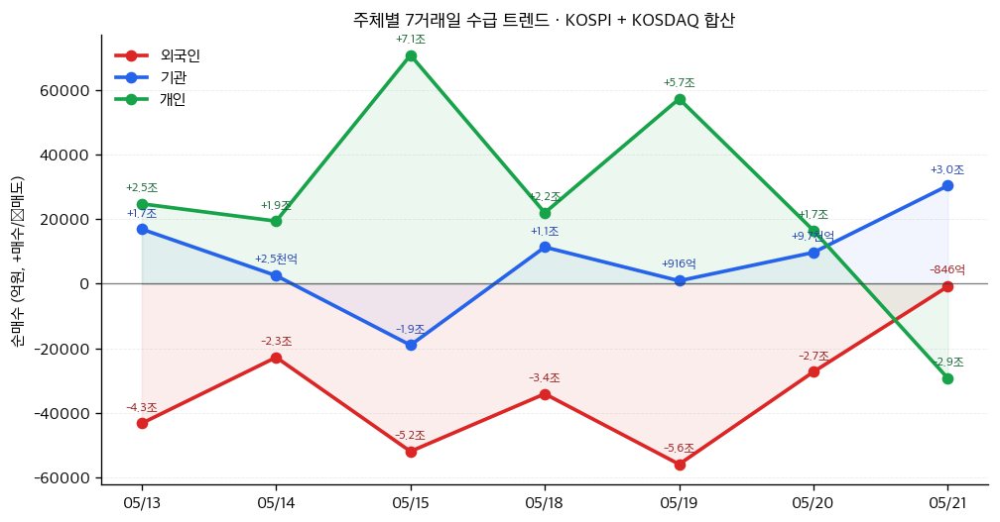

# 📊 모닝 브리핑 — 2026년 5월 22일 (금)

> **🔴 Risk-Off** — 매크로 불확실성 우위, 단 한국 시장은 이례적 디커플링
> - **매크로**: 원/달러 1,500원대 고변동성 유지, 유가 급락 후 재반등으로 변동성 확대
> - **리스크**: 미 증시 혼조 마감, 연준 4월 의사록 매파적 기조 재확인
> - **시그널**: KOSPI 급등 vs. 글로벌 Risk-Off 디커플링 — 지속성 검증이 핵심

---

## 시장 스냅샷

### 주요 지수
| 지수 | 종가 | 등락 | 52주 위치 |
|------|------|------|----------|
| S&P 500 | 7,445.72 | +12.75 (+0.2%) | ███████████████████▍ 97% (5,803–7,501) |
| 나스닥 | 26,293.10 | +22.74 (+0.1%) | ███████████████████▏ 96% (18,737–26,635) |
| 다우존스 | 50,285.66 | +276.31 (+0.6%) | ████████████████████ 100% (41,603–50,286) |
| 코스피 | 7,208.95 | -62.71 (-0.9%) | █████████████████▏░░ 86% (2,592–7,981) |
| 코스닥 | 1,056.07 | -28.29 (-2.6%) | █████████████▍░░░░░░ 67% (716–1,226) |
| 닛케이 225 | 59,804.41 | -746.18 (-1.2%) | █████████████████▍░░ 87% (36,986–63,272) |

### 매크로/원자재/크립토
| 항목 | 값 | 변동 | 52주 위치 |
|------|-----|------|----------|
| 미국 10Y | 4.59% | +0.01%p | █████████████████▊░░ 89% (4–5) |
| 미국 2Y | 3.58% | +0.03%p | ██░░░░░░░░░░░░░░░░░░ 10% (4–4) |
| DXY | 99.19 | +0.08 (+0.1%) | █████████████▉░░░░░░ 69% (96–101) |
| USD/KRW | 1,507.77 | -0.08 (-0.0%) | ███████████████████░ 95% (1,348–1,516) |
| USD/JPY | 159.00 | -0.03 (-0.0%) | ██████████████████▋░ 93% (142–160) |
| WTI 원유 | $97.52 | -0.8% | ██████████████▋░░░░░ 73% (55–113) |
| 금 (Gold) | $4,542.80 | +0.3% | ████████████▍░░░░░░░ 62% (3,274–5,318) |
| 은 (Silver) | $77.05 | +1.6% | ██████████▊░░░░░░░░░ 54% (33–115) |
| BTC | $77,621 | +0.2% | ████▊░░░░░░░░░░░░░░░ 24% (62,702–124,753) |
| VIX | 16.76 | -0.68 (-3.9%) | ███▊░░░░░░░░░░░░░░░░ 19% (13–31) |
| 10Y-2Y 스프레드 | 1.00%p | -0.01%p | — |

### 수급 동향 (최근 7 거래일, 05/13 ~ 05/21, KOSPI+KOSDAQ 합산)



**7일 누적**: 외국인 -23.6조 · 기관 +5.3조 · 개인 +18.2조

---
## 시장 센티먼트

<div style="background:#e0e0e0;border-radius:8px;overflow:hidden;margin:8px 0;font-size:0.9em">
  <div style="display:flex;border-radius:8px;overflow:hidden">
    <div style="background:#F44336;width:65%;padding:6px 12px;color:white;font-weight:bold">🔴 Risk-Off 65%</div>
    <div style="background:#4CAF50;width:35%;padding:6px 12px;color:white;font-weight:bold;text-align:right">🟢 Risk-On 35%</div>
  </div>
</div>

**핵심 판독**: 글로벌 시장은 미 국채 수익률 반등 우려와 유가 재상승이 맞물리며 Risk-Off가 지배적입니다. 연준 4월 의사록이 인플레이션 지속 시 추가 금리 인상 가능성을 열어놓음으로써, '금리 인하 기대'라는 시장의 핵심 내러티브가 흔들리고 있습니다. 반면 KOSPI는 삼성전자 노사 합의, 엔비디아 호실적 기대라는 기업 고유 재료로 독립적 랠리를 연출 중입니다.

**변곡 촉매**:
- 🔴 **다운**: 미 국채 30년물 수익률 추가 상승 → 성장주 밸류에이션 재압박
- 🟢 **업**: 미-이란 핵협상 타결 공식화 → 유가 급락 + 인플레이션 기대치 하향

---

## 섹터별 센티먼트

| 섹터 | 센티먼트 | 한줄 평가 |
|------|---------|----------|
| 반도체/AI | 🟢 강세 | 엔비디아 호실적 기대 + KOSPI 기관 순매수 주도, 수출 통제 리스크는 중장기 변수 |
| 에너지/정유 | 🟡 혼조 | 이란 협상 기대 → 유가 급락 후 재반등, 방향성 미결 |
| 방산/우주 | 🟢 강세 | 미 국방부 공급망 국산화 계약 확대, 지정학 긴장 구조화로 수혜 지속 |
| 희토류/핵심광물 | 🟢 강세 | 미국 대중 공급망 탈피 가속, 서방 대체 프로젝트 계약 체결 모멘텀 |
| 소비재/리테일 | 🔴 약세 | 인플레이션 고착 + 금리 인상 재개 우려로 소비 심리 압박 |
| 국채/채권 | 🔴 주의 | 연준 매파 의사록 + 유가 재상승으로 채권 약세 압력 지속 |
| 수출 제조업(한국) | 🟡 혼조 | 삼성전자 노사 합의 긍정적, 원/달러 1,500원대 고환율은 수익성 압박 |

---

## 오버나이트 핵심 이벤트

### 1. 연준 4월 의사록 — 매파 기조 재확인

- **요약**: 연준의 4월 FOMC 의사록이 인플레이션이 지속될 경우 금리 인상 가능성을 열어놓은 것으로 알려졌으며, 4월 미국 CPI·PPI 모두 최근 최고치 수준을 기록했습니다.
- **So What**: '금리 인하 기대'로 유지되던 성장주 멀티플 확장 내러티브에 직격타입니다. 인플레이션 재가속 + 매파 의사록의 조합은 시장이 가장 두려워하는 '노 랜딩'(No Landing) 시나리오로의 경로를 열어놓습니다. 특히 장기 국채 수익률 반등으로 이어질 경우, 고P/E 기술주부터 재평가 압력을 받습니다.
- **크로스 임팩트**: 빅테크([[NVDA]], [[MSFT]]), 성장주 전반, 미국 국채 ETF([[TLT]])

### 2. KOSPI 8% 이상 급등 — 삼성전자 합의 + 엔비디아 기대

- **요약**: 5월 21일 KOSPI가 삼성전자 노사 임금 협상 잠정 합의 및 엔비디아 호실적 발표 기대감에 기관 순매수 주도로 8% 이상 급등 마감했습니다.
- **So What**: 글로벌 Risk-Off 국면에서 나온 8% 급등은 이례적 디커플링으로, 억눌려 있던 기업 고유 재료(노사 리스크 해소 + AI 사이클 수혜 기대)가 한꺼번에 터진 결과입니다. 단, 글로벌 매크로 환경이 개선되지 않은 상태에서의 급등은 외국인 수급이 뒷받침되지 않으면 단기 과열로 되돌림 가능성이 있습니다.
- **크로스 임팩트**: [[삼성전자]], [[SK하이닉스]], KOSPI 관련 ETF([[EWY]])

### 3. 유가 변동성 확대 — 이란 협상 기대 후 재반등

- **요약**: 미-이란 평화 협상 기대감으로 유가가 5% 급락했다가 이후 재상승하며 5월 21일 미국 증시에 하방 압력으로 작용했습니다.
- **So What**: 유가의 방향성이 확정되지 않은 상태는 인플레이션 기대치의 불확실성을 높입니다. 유가가 다시 오르면 → CPI 전망치 상향 → 연준 긴축 내러티브 강화의 악순환이 반복됩니다. 이란 협상이 공식 타결되면 공급 증가로 유가가 구조적으로 하락할 수 있고, 그 경우 인플레이션 우려 해소의 가장 빠른 경로가 됩니다.
- **크로스 임팩트**: 에너지 섹터([[XOM]], [[CVX]]), 항공사([[UAL]], [[DAL]]), 원자재 인플레이션 관련 소비재

### 4. 미-중 반도체 수출 통제 — BIS 단속 강화

- **요약**: 미국 산업안보국(BIS)이 대중국 반도체 수출 단속을 강화하며 SMIC 관련 고액 벌금 부과 및 외국계 중국 반도체 공장 라이선스 허점을 폐쇄했습니다.
- **So What**: 단기적으로는 미국 반도체 장비업체([[AMAT]], [[LRCX]], [[KLAC]])의 중국향 매출에 압박이지만, 중장기적으로는 비중국 파운드리 생태계 강화를 가속합니다. 동시에 이번 정상회담에서 반도체 수출 통제 문제가 의제에 오르지 않았다는 것은 미국이 이 문제에서 협상 카드를 꺼낼 생각이 없다는 신호이기도 합니다.
- **크로스 임팩트**: 반도체 장비([[AMAT]], [[KLAC]], [[LRCX]]), 비중국 파운드리([[TSM]], [[삼성전자]])

---

## 오늘의 일정

| 시간(한국) | 이벤트 | 중요도 | 관련 종목 |
|-----------|--------|--------|----------|
| 오늘 밤 (미정) | 엔비디아 실적 발표 (FY2026 Q1) | ⭐⭐⭐⭐⭐ | [[NVDA]], [[SK하이닉스]], [[삼성전자]] |
| 오늘 밤 21:30 | 미국 주간 신규 실업수당 청구건수 | ⭐⭐⭐ | 전 종목 |
| 오늘 밤 23:00 | 미국 경기선행지수(LEI) 발표 | ⭐⭐ | 경기민감주 전반 |

> [!warning] ⭐⭐⭐⭐⭐ 엔비디아 실적 — 시나리오 분기
> - 🟢 **어닝 서프라이즈 + 강한 가이던스**: KOSPI 랠리 연장 + 글로벌 AI 섹터 재점화, HBM 수요 가시성 확대
> - 🔴 **컨센서스 하회 또는 가이던스 불투명**: AI 고평가 논란 재점화, 반도체 섹터 전반 급락 위험

---

## 테마 시그널

> [!abstract] 오늘의 테마: **미국의 "경제 나토(Economic NATO)" 구상 — 기술·광물·반도체를 묶는 동맹 경제의 투자 지형**

### 왜 지금인가 — 단순한 관세 전쟁이 아니다

지난 한 주의 뉴스를 나열해보면 얼핏 따로 노는 것처럼 보입니다. 미국 국방부가 희토류 자석 제조업체와 200만 달러 계약을 체결하고, BIS가 중국향 반도체 수출 허점을 막고, 그린란드 희토류 프로젝트가 서방 공급 계약을 맺고, 미-중 정상회담에서 반도체는 의제조차 되지 않았습니다.

이것들은 분산된 사건이 아닙니다. **하나의 구조적 아키텍처**입니다.

미국은 지금 "경제 나토(Economic NATO)"를 조용히 건축 중입니다. 군사 동맹처럼 '집단 안보'를 공식 선언하는 방식이 아니라, **공급망·기술 표준·수출 통제·조달 규정**이라는 네 개의 기둥으로 동맹국과 상호의존의 그물을 짜는 방식입니다.

---

### 구조 해부 — 네 개의 기둥

| 기둥 | 도구 | 최근 사례 |
|------|------|----------|
| **①공급망 국산화** | 국방 조달 계약, 보조금(IRA·CHIPS) | Advanced Magnet Lab 200만달러 계약 |
| **②프렌드쇼어링** | 동맹국 조달 우대, 원산지 규정 강화 | 그린란드 Tanbreez 희토류 서방 계약 |
| **③기술 봉쇄** | 수출 통제(EAR), BIS 단속 강화 | SMIC 제재, 라이선스 허점 폐쇄 |
| **④거래 레버리지** | 무역 합의, 농산물·항공기 빅딜 | 보잉 200대, 170억달러 농산물 합의 |

기둥 ①②는 '아군 강화'이고, 기둥 ③은 '적군 약화', 기둥 ④는 '중립국 포섭'입니다. 이 세 방향이 동시에 작동할 때 비로소 기술·자원 블록화가 완성됩니다.

---

### 투자 지형도 — 누가 이 구조의 수혜자이고 누가 피해자인가

<div style="border-left:4px solid #4CAF50;padding-left:12px;margin:8px 0">
<strong>🟢 구조적 수혜자</strong><br>
공급망 블록화의 물리적 인프라를 구축하는 기업들 — 비중국 희토류 채굴, 서방 파운드리, 미국 방산 소재, 동맹국 전력망 장비
</div>

<div style="border-left:4px solid #F44336;padding-left:12px;margin:8px 0">
<strong>🔴 구조적 피해자</strong><br>
중국 수출 의존도가 높은 반도체 장비·소재 기업 — 단기 매출 압박 + 장기 시장 접근 제한
</div>

| 포지션 | 수혜 테마 | 리스크 |
|--------|----------|--------|
| 🟢 미국 방산 소재 | 희토류 국산화 계약 지속 확대 | 예산 삭감 정치 리스크 |
| 🟢 비중국 파운드리 (TSMC, 삼성) | 서방 공급망 핵심 노드 | 지정학 교차 압력 |
| 🟢 서방 희토류 채굴·가공 | 2027년 미 국방 조달 규제 발효 전 계약 러시 | 개발 지연, 단가 경쟁력 |
| 🟡 반도체 장비 (AMAT, LRCX) | 서방 신규 팹 수혜 | 중국향 매출 구조적 감소 |
| 🔴 중국향 매출 의존 기업 | 단기 협상 해빙 모멘텀 | BIS 규제 강화 추세 불변 |

---

### 핵심 인사이트 — "협상"과 "구조 변화"를 분리해서 봐야 한다

> [!tip] 핵심 인사이트
> 미-중 무역 협상의 '해빙 뉴스'(관세 인하, 보잉 딜, 농산물 합의)는 **전술적 유화**입니다. 동시에 BIS 단속 강화, 국방 조달 국산화는 **전략적 봉쇄**입니다. 이 둘은 모순이 아니라 병행입니다. 투자자가 해빙 뉴스에 반응해 중국향 반도체 수출 기업을 매수할 때, 실제로는 구조적 봉쇄의 피해자를 사는 역설이 발생합니다.

미-중 정상회담에서 반도체 수출 통제가 의제에 오르지 않았다는 사실은 가장 강력한 신호입니다. 미국은 이 문제를 협상 테이블에 올릴 의향이 없다는 뜻입니다. **기술 봉쇄는 협상 불가 영역**으로 고착되고 있습니다.

반면 서방 희토류 대체 프로젝트의 2027년 미국 국방 조달 규정 발효 시점은 구체적인 투자 카탈리스트입니다. 그린란드, 호주, 캐나다의 희토류 개발 기업들에게는 명확한 수요처가 2년 앞에 놓여 있습니다.

---

### 모니터링 포인트

| 지표 | 의미 | 임계점 |
|------|------|--------|
| BIS 수출 허가 건수 (분기) | 기술 봉쇄 강도 | 추가 품목 확대 여부 |
| 미국 희토류 가공 설비 투자 발표 | 공급망 국산화 속도 | 2027년 전 생산 개시 여부 |
| 비중국 파운드리 수주 잔고 | 서방 공급망 완성도 | TSMC 애리조나·삼성 텍사스 가동률 |
| 미-중 기술 협의 공식화 여부 | 해빙 vs. 봉쇄 균형 | 반도체 수출 통제 협상 테이블 등장 시 |

---

## 대가의 시선

> "The tariff situation is evolving rapidly. What's permanent is the structural shift in where things are made."
> ("관세 상황은 빠르게 변하고 있습니다. 영구적인 것은 물건이 어디서 만들어지는가의 구조적 변화입니다.")
> — **팀 쿡 (Tim Cook)**, Apple CEO (실적 발표 컨퍼런스콜 발언, 2025년 5월) [클래식 맥락 활용]

> [!note] 클래식 맥락 활용
> 원본 데이터에 최근 적합한 발언이 없어, 오늘 테마와 가장 직결되는 검증된 발언을 활용했습니다.

**맥락**: 애플 실적 발표에서 인도 공장 이전 가속화, 관세 충격에 대한 질문을 받고 나온 발언입니다. 쿡은 분기 실적보다 더 긴 시간축의 구조 변화를 강조했습니다.

**투자 함의**: 오늘 우리가 분석한 '경제 나토' 테마와 정확히 맞닿아 있습니다. 관세율은 협상에 따라 오르내리지만, 공급망 재편의 방향성은 단기 외교 이벤트로 역전되지 않습니다. 뉴스 헤드라인의 '해빙'에 반응하는 투자는 전술이고, 공급망 블록화의 수혜·피해 구조를 포지셔닝하는 것은 전략입니다. 전술과 전략을 혼동하지 않는 것이 지금 시장에서 가장 중요합니다.

---

## 투자 레슨

> [!abstract] 오늘의 레슨: **확증 편향(Confirmation Bias) — "우리는 믿고 싶은 것을 지지하는 증거만 수집하고, 반박하는 증거는 보지 않는다"**

### 왜 이것이 모든 인지 편향의 어머니인가

확증 편향(Confirmation Bias)은 인간이 **이미 가진 믿음을 지지하는 정보를 우선적으로 탐색하고, 반박하는 정보는 무의식적으로 무시하거나 평가절하하는 체계적 오류**입니다. 1960년 피터 웨이슨(Peter Wason)의 '2-4-6 실험'에서 처음 실증적으로 입증된 이후, 수십 년의 연구가 이것이 인간 인지의 근본적 구조임을 확인했습니다.

투자에서 이것이 특히 위험한 이유는 **정보가 많을수록 오히려 더 심해지기 때문**입니다. 인터넷 이전 시대에는 정보가 부족했습니다. 지금은 정보가 넘칩니다. 넘치는 정보 중에서 인간은 자신의 포지션을 지지하는 것만 클릭합니다.

---

### 확증 편향의 3단계 작동 메커니즘

```
① 최초 포지션 형성
   → 주식 매수, 강세 전망 채택, 특정 테마 투자

② 선택적 정보 수집 (Selective Exposure)
   → 강세 근거 뉴스는 저장, 약세 신호는 "일시적"으로 해석

③ 해석의 왜곡 (Biased Interpretation)
   → 같은 데이터도 포지션 방향으로 해석
   → 예: 고용 증가 → "경제 강하다(강세)" or "인플레 우려(약세)"
      → 이미 포지션이 있는 사람은 자신에게 유리한 방향으로 읽음
```

---

### 역사적 사례 — 닷컴 버블의 집단적 확증 편향

2000년 닷컴 버블 직전, 기술주 강세론자들은 "P/E가 의미 없다, 이번엔 다르다(This Time Is Different)"는 새로운 패러다임 논리를 생산했습니다. 아마존이 수익을 내지 못해도 "성장 투자 중이다"로 해석했고, 닷컴 기업들의 현금 소진 속도를 "확장 비용"으로 처리했습니다.

버블 기간 동안 반박 증거(수익 없음, 비즈니스 모델 불투명, 밸류에이션 역사적 최고치)가 분명히 존재했습니다. 그러나 시장 참여자 대부분은 이를 "구시대적 사고"로 무시했습니다. 확증 편향이 집단화되면 이것이 **내러티브 버블(Narrative Bubble)**이 됩니다.

<div style="background:#e0e0e0;border-radius:8px;overflow:hidden;margin:8px 0">
  <div style="background:#F44336;width:90%;padding:4px 8px;color:white;font-size:0.9em;white-space:nowrap">닷컴 버블기 확증 편향 강도 90/100</div>
</div>
<div style="background:#e0e0e0;border-radius:8px;overflow:hidden;margin:4px 0">
  <div style="background:#FF9800;width:65%;padding:4px 8px;color:white;font-size:0.9em;white-space:nowrap">2008 서브프라임 직전 65/100</div>
</div>
<div style="background:#e0e0e0;border-radius:8px;overflow:hidden;margin:4px 0">
  <div style="background:#4CAF50;width:40%;padding:4px 8px;color:white;font-size:0.9em;white-space:nowrap">일반 강세 사이클 40/100</div>
</div>

---

### 오늘 시장이 정확히 이 편향의 작동 사례다

지금 시장에서 확증 편향이 가장 강하게 작동하는 지점은 두 곳입니다.

**사례 1: 미-중 무역 '해빙' 해석**

무역 해빙을 믿는 투자자 → 보잉 200대 계약, 170억달러 농산물 합의, 정상회담 분위기를 수집
→ BIS 단속 강화, 반도체 수출 통제 의제 불포함, 희토류 국산화 가속은 "일시적 노이즈"로 처리

무역 봉쇄를 믿는 투자자 → BIS 강화, SMIC 제재를 수집
→ 보잉 딜, 농산물 합의는 "표면적 외교"로 처리

같은 데이터, 반대 해석. 어느 쪽이 맞는가가 아니라, **내가 어느 쪽 정보를 더 많이 읽고 있는가**를 먼저 물어야 합니다.

**사례 2: AI·반도체 고평가 논란**

강세론자의 확증 편향 체계:
- 엔비디아 실적 서프라이즈 → "AI 사이클 계속된다"
- 수출 통제 강화 → "오히려 비중국 수요 집중"
- 고P/E → "성장 모멘텀이 정당화"

약세론자의 확증 편향 체계:
- 엔비디아 고가 → "이미 선반영"
- 수출 통제 강화 → "중국 매출 감소"
- 연준 매파 → "고평가 종목 조정"

> [!warning] 리스크 경고
> 오늘 밤 엔비디아 실적 발표 이후 반응을 보십시오. 숫자가 같아도, 강세 포지션 투자자는 긍정 요소를 크게 읽고, 약세 포지션 투자자는 부정 요소를 크게 읽을 것입니다. 이것이 확증 편향이 실시간으로 작동하는 순간입니다.

---

### 확증 편향을 줄이는 세 가지 실전 기법

| 기법 | 방법 | 효과 |
|------|------|------|
| **Pre-Mortem (사전 부검)** | 투자 전 "이 포지션이 망하는 시나리오"를 먼저 글로 작성 | 반박 증거 탐색 강제 |
| **반론 의무화** | 매수 근거 3개 작성 시, 반드시 매도 근거 3개도 작성 | 선택적 정보 수집 차단 |
| **소스 다양화** | 같은 포지션을 지지하는 매체/애널리스트만 읽지 않기 | 에코 체임버 탈출 |

특히 **Pre-Mortem**은 심리학자 게리 클라인(Gary Klein)이 제안한 기법으로, 실제 기업 의사결정에서 오류율을 30% 이상 줄이는 것으로 실증되었습니다. 투자에서의 적용은 단순합니다: 매수 버튼을 누르기 전에 "6개월 후 이 주식이 반토막이 난 이유는 무엇인가?"를 1페이지 작성하는 것입니다.

---

### 오늘 실천 방법

오늘 엔비디아 실적 발표 후, 내가 먼저 찾아보는 뉴스 헤드라인이 긍정적인 것인지 부정적인 것인지 스스로 관찰해 보세요. 그것이 당신의 현재 포지션 방향과 일치한다면, 지금 확증 편향이 작동 중입니다. 그 즉시 반대 방향의 애널리스트 레포트를 찾아 읽는 것이 오늘의 실천입니다.

---

## 오늘 하나만 기억한다면

> [!verdict] 오늘 하나만 기억한다면
> **"미-중 해빙 뉴스와 기술 봉쇄 심화는 모순이 아니라 병행이다 — 전술(관세 협상)과 전략(공급망 블록화)을 분리해서 보지 못하면, 해빙 뉴스에 흥분하며 구조적 피해자를 사는 역설에 빠진다."**