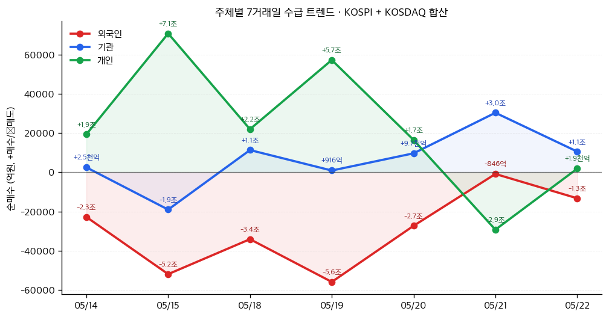
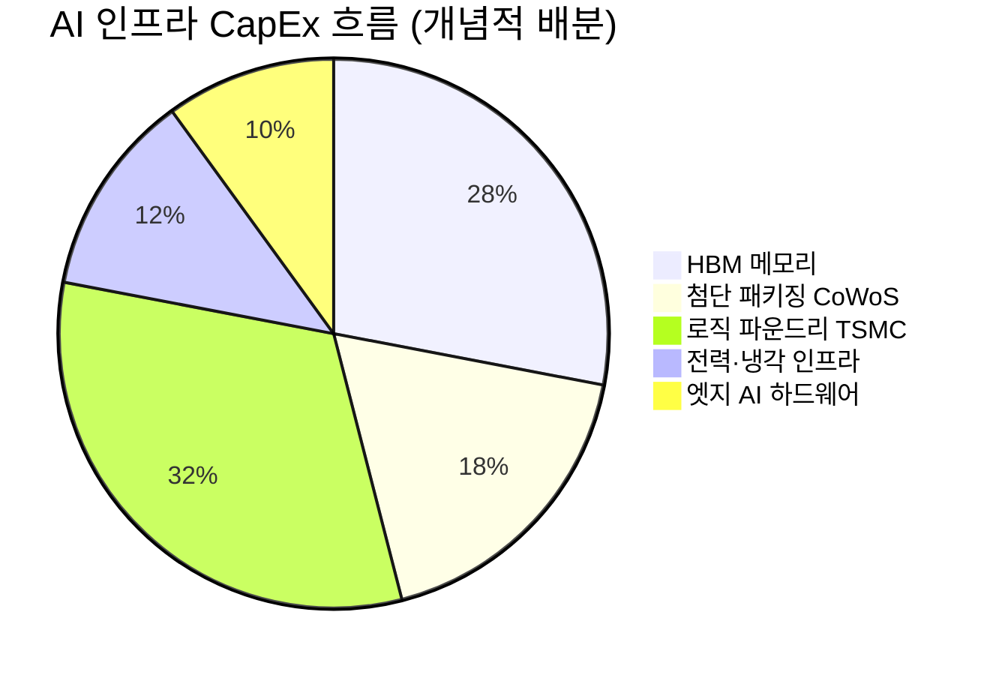

# 📊 모닝 브리핑 — 2026년 5월 24일 (일)

> **🟢 Risk-On** — 지정학 완화 기대 + 실적 서프라이즈가 만든 낙관론
> - **매크로**: 다우존스 사상 최고치 경신, S&P 500 8주 연속 주간 상승
> - **리스크**: 이란발 인플레이션 우려로 미국 가계 소비심리 사상 최저 — 실물 경기 균열 가능성
> - **시그널**: 지정학 리스크 프리미엄 축소 + AI 인프라 자본지출 사이클 가속화

---

## 시장 스냅샷

### 주요 지수
| 지수 | 종가 | 등락 | 52주 위치 |
|------|------|------|----------|
| S&P 500 | 7,473.47 | +27.75 (+0.4%) | ███████████████████▋ 98% (5,803–7,501) |
| 나스닥 | 26,343.97 | +50.87 (+0.2%) | ███████████████████▎ 96% (18,737–26,635) |
| 다우존스 | 50,579.70 | +294.04 (+0.6%) | ████████████████████ 100% (41,603–50,580) |
| 코스피 | 7,847.71 | +32.12 (+0.4%) | ███████████████████▌ 98% (2,592–7,981) |
| 코스닥 | 1,161.13 | +55.16 (+5.0%) | █████████████████▌░░ 87% (716–1,226) |
| 닛케이 225 | 63,339.07 | +1654.93 (+2.7%) | ████████████████████ 100% (36,986–63,339) |

### 매크로/원자재/크립토
| 항목 | 값 | 변동 | 52주 위치 |
|------|-----|------|----------|
| 미국 10Y | 4.56% | -0.03%p | █████████████████░░░ 85% (4–5) |
| 미국 2Y | 3.59% | +0.00%p | ██▏░░░░░░░░░░░░░░░░░ 10% (4–4) |
| DXY | 99.32 | +0.13 (+0.1%) | ██████████████▌░░░░░ 72% (96–101) |
| USD/KRW | 1,520.53 | +16.13 (+1.1%) | ████████████████████ 100% (1,348–1,521) |
| USD/JPY | 159.15 | +0.27 (+0.2%) | ██████████████████▊░ 94% (142–160) |
| WTI 원유 | $96.60 | +0.3% | ██████████████▍░░░░░ 72% (55–113) |
| 금 (Gold) | $4,521.00 | -0.4% | ████████████▎░░░░░░░ 61% (3,274–5,318) |
| 은 (Silver) | $75.89 | -0.7% | ██████████▌░░░░░░░░░ 52% (33–115) |
| BTC | $76,490 | +1.3% | ████▌░░░░░░░░░░░░░░░ 22% (62,702–124,753) |
| VIX | 16.70 | -0.06 (-0.4%) | ███▋░░░░░░░░░░░░░░░░ 18% (13–31) |
| 10Y-2Y 스프레드 | 0.97%p | -0.03%p | — |

### 수급 동향 (최근 7 거래일, 05/14 ~ 05/22, KOSPI+KOSDAQ 합산)



**7일 누적**: 외국인 -20.6조 · 기관 +4.6조 · 개인 +15.9조

---
## 시장 센티먼트

<div style="display:flex;border-radius:8px;overflow:hidden;margin:8px 0;font-size:0.85em"><div style="background:#4CAF50;width:68%;padding:6px 8px;color:white">🟢 Risk-On 68%</div><div style="background:#FF9800;width:20%;padding:6px 8px;color:white">🟡 중립 20%</div><div style="background:#F44336;width:12%;padding:6px 8px;color:white;white-space:nowrap">🔴 Risk-Off 12%</div></div>

**핵심 판독**: 미국-이란 종전 협상 낙관론이 지정학 리스크 프리미엄을 빠르게 축소시키며 위험자산 선호가 주도하는 국면. 다우 사상 최고치 + S&P 500 8주 연속 상승이라는 희귀한 모멘텀이 쌓이고 있다. 다만 실물 소비심리 지표가 사상 최저를 찍는 '주가-실물 괴리' 구조가 형성되고 있어, 낙관론의 지속 가능성에 대한 점검이 필요한 시점.

**변곡 촉매**:
- 🔴 **다운사이드**: 이란 협상 결렬 또는 재개된 지정학 긴장 → 유가 급등 + 인플레이션 재점화, 소비심리 위축의 실물 확산
- 🟢 **업사이드**: 케빈 워시 신임 Fed 의장의 완화적 신호 + AI 실적 시즌 연속 어닝 서프라이즈 → 멀티플 재확장

---

## 섹터별 센티먼트

| 섹터 | 센티먼트 | 한줄 평가 |
|------|----------|-----------|
| 반도체·AI 인프라 | 🟢 강세 | 하이퍼스케일러 CapEx 폭증 + HBM 슈퍼사이클 진입, 공급 병목이 오히려 가격 상방 압력 |
| 첨단 패키징(CoWoS) | 🟢 강세 | TSMC CoWoS 3세대 양산 시작, 연평균 90% CAGR 확장 — 공급 부족 국면 지속 |
| 엣지 AI·산업용 컴퓨팅 | 🟢 강세 | 클라우드→엣지 AI 전환 가속, 의료·제조·반도체 수직시장 수요 실체화 |
| 소비재·리테일 | 🟡 혼조 | Ross Stores 실적 서프라이즈 vs 가계 소비심리 사상 최저 — 고가/저가 양극화 구도 |
| SaaS·엔터프라이즈 SW | 🟢 강세 | Workday·Zoom 어닝 서프라이즈, AI 기능 탑재 → 고객 이탈 방어 + 단가 인상 효과 |
| 에너지·정유 | 🟡 중립 | 이란 협상 낙관론 → 공급 증가 우려로 유가 상방 제한, 지정학 재점화 시 급반전 리스크 |
| 금융·은행 | 🟡 관망 | 워시 신임 의장 정책 방향성 불확실, 금리 경로 재설정 전까지 방향 탐색 |

---

## 오버나이트 핵심 이벤트

### 1. 다우존스 사상 최고치 경신 — S&P 500 8주 연속 주간 상승

- **요약**: 5월 22일(금) 미국 증시는 강세 마감. 다우존스가 사상 최고치를 기록했고, S&P 500은 8주 연속 주간 상승이라는 드문 기록을 이어갔다.
- **So What**: 8주 연속 상승은 단순한 반등이 아니라 구조적 추세 전환을 시사하는 신호다. 지정학 완화 기대 + 실적 서프라이즈 + AI 내러티브가 세 겹으로 작용하며 매수 에너지가 유지되고 있다. 다만 이 수준에서의 상승은 미래 기대를 선반영하는 것이므로, 어닝 미스나 지정학 재점화 시 하락 탄력도 빠를 수 있다.
- **크로스 임팩트**: 글로벌 위험자산 전반(이머징 주식, 크레딧) 강세 동반 — 한국 수출주·반도체 섹터 수혜 기대

### 2. 미국-이란 종전 협상 낙관론 확산

- **요약**: 미-이란 간 종전 협상 진전에 대한 낙관론이 시장에 퍼지며 지정학적 리스크 프리미엄이 빠르게 축소됐다.
- **So What**: 이란 분쟁 완화는 유가 하방 압력으로 작용, 인플레이션 경로에 긍정적 변수가 된다. 그러나 동시에 같은 이란 분쟁이 현재 미국 가계 소비심리를 사상 최저로 끌어내린 원인이기도 하다 — 즉, 협상 타결은 소비 회복의 방아쇠가 될 수 있다. 협상이 결렬되면 에너지 가격 급등 + 소비 침체의 스태그플레이션 시나리오가 열린다.
- **크로스 임팩트**: 에너지 섹터(유가 하락 압력), 항공·소비재(원가 완화 수혜), 방산(긴장 완화로 상대적 약세)

### 3. Ross Stores·Workday·Zoom 어닝 서프라이즈 + 케빈 워시 Fed 의장 취임

- **요약**: 소비재(Ross Stores)·엔터프라이즈 SaaS(Workday)·화상회의(Zoom) 등 다양한 섹터에서 예상치를 상회하는 실적이 발표됐다. 동시에 케빈 워시가 신임 Fed 의장으로 취임했다.
- **So What**: 세 기업의 서프라이즈는 섹터를 가리지 않는 이익 개선이 진행 중임을 시사 — "선택적 강세"에서 "광범위한 강세"로의 전환 신호. 워시 의장 취임은 Fed 통신 스타일과 정책 기조에 변화 가능성을 내포하며, 첫 번째 공개 발언이 이번 주 가장 중요한 시장 촉매가 될 것이다.
- **크로스 임팩트**: SaaS·소비재 어닝 시즌 낙관론 확산, 워시 의장 발언 방향에 따라 금리 민감 자산(성장주·장기채) 변동성 확대 가능

---

## 오늘의 일정

| 시간(한국) | 이벤트 | 중요도 | 관련 종목/섹터 |
|-----------|--------|--------|--------------|
| 주중 미정 | 케빈 워시 신임 Fed 의장 첫 공개 발언 (예상) | ⭐⭐⭐⭐⭐ | 전 종목, 특히 성장주·장기채 |
| 주중 미정 | 미-이란 핵 협상 추가 라운드 동향 | ⭐⭐⭐⭐ | [[에너지]], [[방산]], [[소비재]] |
| 오늘~이번주 | AI 인프라 CapEx 관련 하이퍼스케일러 추가 발표 | ⭐⭐⭐ | [[반도체]], [[데이터센터]], [[HBM]] |

> [!warning] ⭐⭐⭐⭐⭐ 워시 의장 첫 발언 — 시나리오 분기
> - 🟢 **완화적 신호** (인플레 통제 확인 + 금리 인하 여지 언급): 성장주 멀티플 재확장, 나스닥 추가 상승
> - 🔴 **매파적 신호** (인플레 재점화 우려 + 긴축 유지 강조): 국채금리 상승 → 고PER 성장주 밸류에이션 압박
> - 🟡 **중립 (현상유지)**: 단기 방향성 탐색 국면 지속, 변동성 잔존

---

## 테마 시그널

> [!abstract] 오늘의 테마: **AI 자본지출 슈퍼사이클 — "하이퍼스케일러가 천문학적 돈을 쓰면, 반도체 생태계에서 진짜 돈을 버는 건 누구인가"**

### 왜 지금 이 테마인가?

지금 글로벌 기술 산업에서는 역사상 전례 없는 규모의 자본 배치가 이루어지고 있다. Meta는 올해 최대 1,350억 달러 지출을 계획했고, Microsoft의 자본지출은 전년 대비 66% 증가했다. Amazon, Alphabet, 그리고 신흥 AI 플레이어들까지 합치면 빅테크의 연간 AI 인프라 투자는 수천억 달러 규모에 달한다.

문제는 — **이 돈이 빅테크 자신의 주가에는 비용 압박으로 작용하지만, 그 돈을 '받는' 생태계에서는 사이클 전환점**이 형성된다는 것이다.

### 수요의 집중: HBM이 모든 것을 바꾸고 있다

AI 가속기(GPU/NPU)의 성능 병목은 이제 연산 속도가 아니라 **메모리 대역폭**이다. Nvidia H100/H200 한 장에 올라가는 HBM3/HBM3e는 일반 DRAM보다 **약 3배의 웨이퍼 용량**을 소모한다. 즉, 같은 팹에서 HBM을 만들면 일반 DRAM은 그만큼 덜 만들어진다.

TSMC는 매 분기 약 1,000만 개의 HBM 칩을 소비한다고 밝혔다. Micron은 2026년 전체 HBM 공급량을 이미 유리한 조건으로 사전 확보했고, SK 하이닉스와 삼성도 HBM 생산라인 전환에 대규모 CapEx를 투입하고 있다.

결과적으로 발생하는 구조적 변화:

| 구분 | Before (2022~2023) | After (2024~2026+) |
|------|--------------------|--------------------|
| 메모리 수요 드라이버 | PC·스마트폰 교체 사이클 | AI 데이터센터 |
| 수익성 드라이버 | 범용 DRAM 가격 | HBM 스프레드 (DRAM 대비 3~5배 ASP) |
| 공급 병목 | 팹 과잉 → 가격 폭락 | HBM 전환으로 범용 공급 축소 → 가격 상방 |
| 핵심 리스크 | 수요 침체 | 기술 전환 타이밍, 경쟁 심화 |

### 생태계 레이어별 투자 기회 지도



> [!tip] 핵심 인사이트: "삽 파는 회사" 논리의 현대적 버전
> 골드러시에서 금 캐는 사람이 아니라 삽 파는 사람이 돈을 벌었다. AI 슈퍼사이클에서 "삽"에 해당하는 것은 GPU 자체가 아니라, GPU를 만들기 위한 **HBM·첨단 패키징·특수 기판**이다. 빅테크가 아무리 많은 GPU를 사도, 그 GPU를 공급하는 레이어는 구조적으로 수요 독점에 가까운 위치를 차지한다.

### 가장 주목해야 할 레이어: 첨단 패키징 (CoWoS)

TSMC는 2022년부터 내년까지 CoWoS(Chip on Wafer on Substrate) 패키징 용량을 **연평균 90% CAGR**로 확장하고 있다. 3세대 CoWoS는 12개의 HBM 칩을 하나의 인터포저에 수용할 수 있어, 차세대 AI 가속기의 메모리 대역폭을 획기적으로 끌어올린다.

이 시장의 특징은 **진입장벽이 극도로 높다**는 것이다. CoWoS 설비는 TSMC 외에 사실상 양산 경쟁자가 없고, 설비 증설에는 2~3년의 리드타임이 필요하다. 즉, 지금 주문을 넣어도 2027년에나 공급이 늘어난다.

### 엣지 AI — 다음 파도의 진원지

Advantech의 사례가 시사하듯, AI 컴퓨팅의 무게중심이 클라우드 데이터센터에서 **엣지 디바이스**로 이동하기 시작했다. 드라이버는 세 가지다:

1. **데이터 주권/프라이버시**: 의료·금융 데이터를 클라우드로 보낼 수 없는 규제 환경
2. **실시간 레이턴시**: 자율주행·산업 자동화는 클라우드 왕복 레이턴시를 허용하지 않음
3. **비용 효율**: 대규모 데이터를 클라우드로 전송하는 비용 vs 엣지에서 처리하는 비용

최소 100 TOPS 성능의 엣지 AI 플랫폼이 표준화되면, 이를 구동하는 저전력 고성능 AI칩과 그 메모리 솔루션이 새로운 수요처로 부상한다.

### 투자 함의: 어디를 어떻게 볼 것인가

<div style="border-left:4px solid #4CAF50;padding-left:12px;margin:8px 0">
<b>핵심 프레임</b>: 하이퍼스케일러의 CapEx는 '그들의 비용'이지만 '생태계의 매출'이다. 빅테크 주가와 반도체 공급망 주가는 같은 이유로 움직이지 않는다 — 오히려 빅테크가 CapEx를 늘릴수록 수혜주는 그 돈을 받는 레이어다.
</div>

| 레이어 | 수혜 강도 | 핵심 체크포인트 |
|--------|----------|----------------|
| HBM 메모리 (SK하이닉스·Micron) | 🟢 최강 | HBM 사전 계약 물량·가격, DRAM 범용가 추이 |
| 첨단 패키징 (TSMC CoWoS) | 🟢 강 | CoWoS 증설 속도, 고객사 주문 백로그 |
| AI 가속기 GPU ([[NVDA]]) | 🟢 강 | 데이터센터 수주, 수출 규제 변화 |
| 파운드리 로직 (TSMC) | 🟡 중간 | 3nm/2nm 가동률, 지정학 리스크 |
| 엣지 AI 하드웨어 | 🟡 중간 | 채택 사이클 초기, 킬러앱 등장 여부 |
| 전력·냉각 인프라 | 🟢 강 | 데이터센터 전력 수요, 전력망 규제 |

### 모니터링 포인트

- **매분기 확인**: Meta·Microsoft·Amazon·Alphabet CapEx 가이던스 — 이것이 상향되면 HBM·CoWoS 수혜, 하향이면 반도체 전반 조정 신호
- **HBM 공급 타이트니스**: HBM3e 가격 및 리드타임 — 지금은 빡빡하지만, HBM4 전환 시점에 재고 조정 가능성 존재
- **Intel 반등 변수**: Apple과의 파운드리 딜이 성사되면 TSMC 의존도 분산 + Intel 파운드리 생태계 재건 가능성 → CoWoS 독점에 균열이 갈 수 있는 장기 변수
- **엣지 AI 채택 속도**: 산업용·의료용 AI 규제 완화 속도가 엣지 수요의 핵심 가늠자

---

## 대가의 시선

> "The more the business grows, the more it needs to spend on capex. The question is always: does the return on that capital justify the spend?"
> *(사업이 성장할수록 자본지출도 늘어난다. 핵심 질문은 언제나 하나다: 그 자본에 대한 수익률이 지출을 정당화하는가?)*
> — **워런 버핏**, Berkshire Hathaway 주주서한 (버크셔 연례서한, 반복 강조 원칙) [클래식]

**맥락**: 버핏이 수십 년간 주주서한과 주주총회에서 반복적으로 강조해온 자본 배분(Capital Allocation) 원칙. "얼마나 성장하느냐"가 아니라 "그 성장에 얼마를 쏟아붓느냐 대비 무엇을 얻느냐"를 묻는 질문이다.

**투자 함의**: 지금 메타가 최대 1,350억 달러, 마이크로소프트가 CapEx를 66% 늘리는 시대에 가장 중요한 질문은 "AI 투자가 맞다/틀리다"가 아니다. **"이 CapEx가 실제로 어떤 ROIC를 만들어내고 있는가"**가 핵심이다. 하이퍼스케일러들의 AI 투자 수익률이 확인되기 시작하면 주가는 한 단계 더 올라갈 것이고, 수익률이 기대에 미치지 못한다고 판명되면 CapEx 축소 → 반도체 수요 급감이라는 사이클 역전이 일어난다. 지금 AI 서프라이즈를 즐기되, 버핏의 질문을 항상 머릿속에 켜두어야 할 이유다.

---

## 투자 레슨

> [!abstract] 오늘의 레슨: **제본스 역설(Jevons Paradox) — "효율이 높아질수록 소비는 줄어드는 게 아니라 오히려 폭증한다"**

### 역설의 본질: 효율 = 절약이라는 직관이 틀린 이유

1865년 영국 경제학자 윌리엄 스탠리 제본스(William Stanley Jevons)는 증기기관의 역설적 현상을 발견했다. 와트(Watt)의 증기기관 개량으로 석탄 소비 효율이 획기적으로 올라갔음에도 불구하고, 영국 전체의 석탄 소비량은 오히려 급증했다. 이유는 단순했다: **효율이 높아지면 사용 단가가 낮아지고, 그 결과 수요가 폭발하여 총 소비량이 오히려 늘어난다.**

공식으로 정리하면:

<div style="border-left:4px solid #FF9800;padding-left:12px;margin:8px 0">
<b>제본스 역설</b>: 자원 사용 효율 ↑ → 단위당 비용 ↓ → 수요 폭증 → 총 소비량 ↑<br>
직관: "더 효율적으로 쓰면 덜 쓰겠지" → 현실: "더 싸지면 더 많이 쓴다"
</div>

이것은 단순한 역사적 이야기가 아니다. 지난 150년간 반복적으로 확인된 경제·기술의 구조적 법칙이다.

### 역사적 사례들

| 시대 | 효율 혁신 | 예상 결과 | 실제 결과 |
|------|-----------|-----------|-----------|
| 1860s | 증기기관 효율 2배 개선 | 석탄 소비 감소 | 영국 석탄 소비 10배 증가 |
| 1970s | 연비 개선 (CAFE 기준) | 석유 소비 감소 | SUV 수요 폭증, 총 소비 증가 |
| 1990s | 인터넷으로 종이 없는 사무실 예측 | 종이 소비 감소 | 레이저 프린터 보급 → 종이 소비 사상 최대 |
| 2000s | LED 조명 (전구 대비 전력 90% 절감) | 전력 소비 감소 | 조명 설치 폭증 → 총 전력 소비 증가 |
| 2010s | 클라우드 컴퓨팅 (서버 효율화) | 전력·서버 수요 감소 | 데이터센터 수·전력 소비 급증 |

### 오늘 시장이 바로 이 역설의 교과서적 사례다

지금 AI 반도체 슈퍼사이클을 제본스 역설로 해석하면 구조가 선명해진다.

**Nvidia H100/H200의 역설**:
- H100은 이전 세대 GPU보다 AI 연산 효율이 수십 배 높다
- "효율이 높아지면 필요한 GPU 수가 줄 것이다" — 이것이 직관적 예상
- 현실: 효율이 높아지자 더 크고 복잡한 모델을 훈련시키려는 수요가 폭증했고, 결과적으로 필요한 GPU 수는 오히려 수십 배로 늘었다

```
GPT-3 (2020): GPU 수천 개 × 수개월
GPT-4 (2023): GPU 수만 개 × 수개월
현재 프론티어 모델: GPU 수십만 개 × 지속 업데이트
```

이것이 왜 Meta가 1,350억 달러를 지출하면서도 "충분하지 않을 수 있다"고 말하는 이유다.

> [!tip] 제본스 역설의 투자 함의
> AI 칩이 더 효율적이 될수록 → AI 활용 범위가 넓어지고 → 총 수요는 더 커진다.
> 즉, **효율 혁신은 수요를 죽이는 게 아니라 시장을 창조한다.**
> 이것은 AI 인프라 수요가 "이미 정점"이라는 회의론을 정면으로 반박하는 구조적 논거다.

### 제본스 역설이 깨지는 조건 — 투자에서의 함정

그러나 이 역설이 영원히 지속되는 것은 아니다. 세 가지 조건 중 하나가 충족되면 역설이 멈춘다:

<div style="display:flex;border-radius:8px;overflow:hidden;margin:8px 0;font-size:0.85em"><div style="background:#F44336;width:35%;padding:6px 8px;color:white;white-space:nowrap">🔴 수요 포화 35%</div><div style="background:#FF9800;width:40%;padding:6px 8px;color:white;white-space:nowrap">🟡 대체재 등장 40%</div><div style="background:#4CAF50;width:25%;padding:6px 8px;color:white;white-space:nowrap">🟢 계속 25%</div></div>

1. **수요 포화**: 이미 원하는 모든 사람이 사용 중이어서 신규 수요가 없을 때
2. **급진적 대체**: 완전히 다른 기술이 등장해 기존 자원 자체가 불필요해질 때 (예: 스마트폰이 카메라 필름 수요를 소멸시킨 것)
3. **외부 제약**: 물리적 한계(전력망 용량, 냉각 기술)나 규제로 수요 증가가 차단될 때

**현재 AI 시장에서의 리스크 체크**:

| 리스크 | 현재 상태 | 신호 탐지 방법 |
|--------|-----------|----------------|
| 수요 포화 | 🟢 초기 단계 | 빅테크 CapEx 가이던스 하향 시 |
| 대체 기술 | 🟡 장기 모니터링 | 광 컴퓨팅, 양자컴퓨팅 상용화 타임라인 |
| 전력망 제약 | 🔴 현재 가장 긴박 | 데이터센터 전력 승인 지연, 전기료 급등 |

### 오늘 실천 방법

**포지션 점검 시**: AI 반도체 투자 논리를 "지금 잘 팔리니까"가 아니라 "제본스 역설이 아직 작동하고 있는가 — 수요 포화·대체 기술·전력 제약 중 어느 것도 아직 현실화되지 않았는가"로 체크하라. 이 세 가지 중 하나라도 현실화 신호가 보이면, 그것이 사이클 전환의 진짜 경고음이다.

---

## 오늘 하나만 기억한다면

> [!verdict] 오늘 하나만 기억한다면
> **"AI 칩이 더 효율적이 될수록 수요는 줄어드는 게 아니라 폭증한다 — 제본스 역설이 반도체 슈퍼사이클의 구조적 엔진이다. 단, 전력망 제약이 이 역설을 멈출 수 있는 가장 현실적 변수다."**