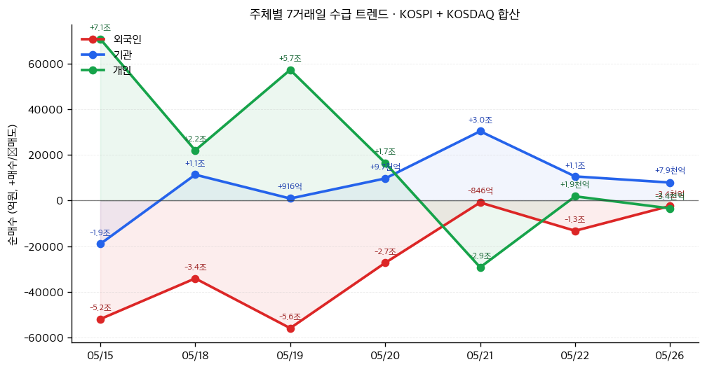

# 📊 모닝 브리핑 — 2026년 5월 27일 (수)

> **🟢 Risk-On** — AI 반도체 급등 + 코스피 8000 돌파, 역사적 이중 신기록 국면
> - **매크로**: 미 10년물 국채 4.49% / 이란 협상 기대감으로 유가 변동성 확대
> - **리스크**: 중동 긴장 재점화 + 소비자 심리 역대 최저 수준 / VIX 데이터 참조
> - **시그널**: ① [[마이크론]] AI 수요 서프라이즈 → 메모리 섹터 재평가 ② 코스피 8000 돌파 → 한국 시장 패러다임 전환

---

## 시장 스냅샷

### 주요 지수
| 지수 | 종가 | 등락 | 52주 위치 |
|------|------|------|----------|
| S&P 500 | 7,519.12 | +45.65 (+0.6%) | ████████████████████ 100% (5,889–7,519) |
| 나스닥 | 26,656.18 | +312.21 (+1.2%) | ████████████████████ 100% (19,101–26,656) |
| 다우존스 | 50,461.68 | -118.02 (-0.2%) | ███████████████████▊ 99% (42,099–50,580) |
| 코스피 | 7,847.71 | +32.12 (+0.4%) | ███████████████████▌ 97% (2,637–7,981) |
| 코스닥 | 1,161.13 | +55.16 (+5.0%) | █████████████████▍░░ 87% (725–1,226) |
| 닛케이 225 | 65,158.19 | +1819.12 (+2.9%) | ████████████████████ 100% (37,447–65,158) |

### 매크로/원자재/크립토
| 항목 | 값 | 변동 | 52주 위치 |
|------|-----|------|----------|
| 미국 10Y | 4.49% | -0.07%p | ███████████████▏░░░░ 76% (4–5) |
| 미국 2Y | 3.58% | -0.00%p | ██░░░░░░░░░░░░░░░░░░ 10% (4–4) |
| DXY | 99.14 | -0.18 (-0.2%) | █████████████▋░░░░░░ 68% (96–101) |
| USD/KRW | 1,507.81 | -5.02 (-0.3%) | ███████████████████░ 95% (1,348–1,516) |
| USD/JPY | 159.28 | +0.33 (+0.2%) | ██████████████████▉░ 95% (142–160) |
| WTI 원유 | $93.62 | -3.1% | █████████████▎░░░░░░ 66% (55–113) |
| 금 (Gold) | $4,509.30 | -0.3% | ████████████▏░░░░░░░ 60% (3,274–5,318) |
| 은 (Silver) | $77.43 | +2.0% | ██████████▉░░░░░░░░░ 54% (33–115) |
| BTC | $75,731 | -2.0% | ████▎░░░░░░░░░░░░░░░ 21% (62,702–124,753) |
| VIX | 17.01 | +0.42 (+2.5%) | ████░░░░░░░░░░░░░░░░ 20% (13–31) |
| 10Y-2Y 스프레드 | 0.91%p | -0.06%p | — |

### 수급 동향 (최근 7 거래일, 05/15 ~ 05/26, KOSPI+KOSDAQ 합산)



**7일 누적**: 외국인 -18.6조 · 기관 +5.2조 · 개인 +13.6조

---
⚠️ 시장 스냅샷은 시스템에 의해 자동 삽입됩니다.

---

## 시장 센티먼트

<div style="background:#e0e0e0;border-radius:8px;overflow:hidden;margin:8px 0;font-size:0.9em">
<div style="display:flex;border-radius:8px;overflow:hidden">
<div style="background:#4CAF50;width:72%;padding:6px 12px;color:white;font-weight:bold;white-space:nowrap">🟢 Risk-On 72%</div>
<div style="background:#F44336;width:28%;padding:6px 12px;color:white;font-weight:bold;white-space:nowrap;text-align:right">🔴 Risk-Off 28%</div>
</div>
</div>

**핵심 판독**: [[마이크론]]의 폭발적 급등이 AI 인프라 수요 내러티브를 단숨에 재확인시키며 S&P 500과 나스닥이 동시에 사상 최고치를 경신했습니다. 여기에 코스피 8000선 돌파까지 더해지며 글로벌 주식 시장은 전형적인 Risk-On 모드입니다. 다만 미국의 이란 공습이라는 지정학적 충격과 역대 최저 수준의 소비자 심리는 잠재적 취약성으로 남아 있어, '낙관론 위에 앉은 불안'이라는 이중적 국면입니다.

**변곡 촉매**:
- 🔴 **다운사이드**: 이란 보복 공습 → 호르무즈 해협 봉쇄 우려 재점화 → 유가 급등 → 인플레이션 기대치 상승 → 금리 인상 기대 재부상
- 🟢 **업사이드**: 미-이란 핵 협상 타결 공식화 → 유가 안정 → 인플레이션 완화 기대 → 연준 금리인하 경로 복원

---

## 섹터별 센티먼트

| 섹터 | 센티먼트 | 한줄 평가 |
|------|---------|----------|
| 반도체 / 메모리 | 🟢 강세 | [[마이크론]] 목표가 상향·AI 수요 확인 → HBM·DRAM 전체 밸류에이션 재레이팅 국면 |
| AI 인프라 | 🟢 강세 | 데이터센터 투자 사이클 가속, 메모리→서버→전력 순으로 수혜 연쇄 확산 |
| 한국 대형주 (코스피) | 🟢 강세 | 8000 돌파 후 기관·외국인 쌍끌이 매수, 글로벌 7위 시총 상승은 패시브 자금 추가 유입 압력 |
| 에너지 / 정유 | 🟡 혼조 | 이란 협상 기대(유가 하락 압력) vs 공습 긴장(상승 압력) — 방향성 결정 전 관망 |
| 방산 | 🟡 혼조 | 중동 긴장 고조 시 수혜이나 협상 타결 시 급랭 — 이벤트 방향성 확인 필요 |
| 핵심원자재 / 배터리 | 🟡 중립 | EU CRMA 시행으로 구조적 수요 확인, 단 단기 리튬 가격 약세가 투자 심리 억제 |
| 소비재 / 내수 | 🔴 약세 | 미국 소비자 신뢰 역대 최저권 — 중동발 인플레 우려가 실질 구매력 압박 |

---

## 오버나이트 핵심 이벤트

### 1. [[마이크론]] +20% 폭등 — AI 메모리 수퍼사이클 공식 선언

- **요약**: UBS가 마이크론 목표가를 대폭 상향 조정하며 AI 인프라 투자 확대에 따른 메모리 수요 급증을 근거로 제시. 주가는 하루 만에 20% 가까이 급등하며 시가총액 1조 달러 클럽에 진입했습니다.
- **So What**: 단순 종목 이슈가 아닙니다. 마이크론의 폭등은 AI 가속기(GPU/NPU) 옆에 반드시 대용량 HBM이 붙어야 한다는 시장의 재확인입니다. 1차적으로 [[삼성전자]], [[SK하이닉스]] 등 경쟁 메모리 업체에 대한 '동반 재평가' 압력이 강해집니다. 2차적으로 메모리 강세가 검증될수록 TSMC·ASML 등 파운드리·장비까지 AI 인프라 밸류체인 전반의 멀티플 확장이 이어집니다.
- **크로스 임팩트**: [[SK하이닉스]] / [[삼성전자]] / [[TSMC]] / AI 서버 섹터 직접 수혜

### 2. 코스피 사상 첫 8000선 돌파 — "8000 시대" 개막

- **요약**: 5월 26일 코스피가 장중 8100을 넘어 종가 8047.51로 사상 최고치를 경신. 한국 증시 시가총액이 세계 7위로 도약했으며 기관·외국인 동시 순매수가 상승을 주도했습니다.
- **So What**: 단순 수치 돌파 이상의 의미가 있습니다. 글로벌 패시브 ETF와 벤치마크 펀드는 시총 가중 방식으로 운용되므로, 한국 시장의 시총 급증은 MSCI 등 글로벌 지수 내 한국 비중 상향 압력으로 연결됩니다. 이는 다시 외국인 자금의 구조적 유입을 의미합니다. 2차 효과로 코스피 8000 레벨 안착이 확인될수록 기업들의 국내 자본조달 비용이 낮아져 M&A·투자 활성화 사이클이 뒤따를 수 있습니다.
- **크로스 임팩트**: [[삼성전자]] / [[SK하이닉스]] / 한국 대형주 전반 / 원화 강세 연동

### 3. 미국의 이란 공습 — 유가 변동성 급확대

- **요약**: 5월 25일 미국의 이란 공습으로 중동 긴장이 갑작스럽게 고조되었습니다. 직전까지 평화 협상 기대감으로 완화됐던 시장 심리가 반전되며 브렌트유가 급등락하는 양방향 변동성을 보였습니다.
- **So What**: 이란 지정학 리스크는 단순 유가 등락에 그치지 않습니다. 이란이 호르무즈 해협(글로벌 원유 공급의 약 20% 통과)을 봉쇄하거나 위협하는 시나리오가 현실화되면 WTI·브렌트유의 급등 → 인플레이션 기대치 재상승 → 연준 금리인하 지연 → 장기채 수익률 상승의 연쇄 압박이 발생합니다. 현재 소비자 심리가 이미 역대 최저권임을 감안하면 에너지 인플레의 타격은 더욱 증폭됩니다.
- **크로스 임팩트**: 에너지 섹터 / 항공·운송 / 채권금리 / 소비재 전반

---

## 오늘의 일정

| 시간(한국) | 이벤트 | 중요도 | 관련 종목 |
|-----------|--------|--------|----------|
| 오늘 장중 | 코스피 8000선 안착 여부 확인 | ⭐⭐⭐⭐ | [[삼성전자]] / [[SK하이닉스]] |
| 오늘 밤 | 미-이란 협상 동향 (외신 속보) | ⭐⭐⭐⭐ | 에너지 섹터 / 방산 |
| 이번 주 | 미국 개인소비지출(PCE) 물가 발표 | ⭐⭐⭐⭐⭐ | 전 종목 / 채권 |
| 이번 주 | 미국 1분기 GDP 수정치 | ⭐⭐⭐ | 소비재 / 리츠 |

> [!warning] ⭐⭐⭐⭐⭐ PCE 시나리오 분기
> **상회(인플레 우려)**: 연준 금리인하 기대 후퇴 → 나스닥 조정 + 달러 강세 압박
> **예상 부합**: 현재 랠리 지속, AI·반도체 주도 모멘텀 이어감
> **하회(완화 신호)**: 전 자산 Risk-On 강화, 성장주·이머징 동반 상승

---

## 테마 시그널

> [!abstract] 오늘의 테마: **글로벌 원자재 슈퍼사이클 — "AI·에너지전환·지정학이 동시에 당기는 원자재 수요, 이번엔 진짜 다른가"**

### 왜 지금인가 (시의성)

오늘 브리핑의 두 핵심 이벤트 — AI 반도체 폭등과 이란 공습발 유가 변동 — 은 표면적으로 달라 보이지만, 사실 같은 뿌리를 공유합니다. 바로 **원자재 구조적 수요 재편**입니다. 마이크론 +20% 급등 이면에는 HBM 제조에 필수적인 특수 화학물질·희토류 수요가 있고, EU 핵심원자재법(CRMA) 시행은 배터리·청정에너지 관련 광물 공급망을 국가 전략 의제로 격상시켰습니다. 여기에 중동 긴장으로 인한 에너지 원자재 불안까지 겹치면서, 원자재 슈퍼사이클 논의가 다시 수면 위로 올라오고 있습니다.

---

### 슈퍼사이클이란 무엇인가 — 구조와 역사

원자재 슈퍼사이클(Commodity Supercycle)은 수십 년에 걸친 장기 가격 상승 국면으로, 단순한 경기 순환과는 다릅니다. 역사적으로 네 차례의 명확한 슈퍼사이클이 있었습니다.

| 사이클 | 기간 | 핵심 드라이버 | 대표 원자재 |
|--------|------|-------------|-----------|
| 1차 | 1890~1910년대 | 미국 산업화·철도 팽창 | 철강, 석탄, 구리 |
| 2차 | 1930~1950년대 | 2차 세계대전 군수 수요 | 알루미늄, 철강, 유류 |
| 3차 | 1970년대 | 오일쇼크 + 브레튼우즈 붕괴 | 원유, 금 |
| 4차 | 2000~2010년대 | 중국 도시화·제조업 팽창 | 철광석, 구리, 원유, 석탄 |

슈퍼사이클의 공통 구조: **수요는 급격히 늘어나는데 공급(새 광산·유전 개발)은 7~15년 리드타임이 필요**합니다. 이 공급-수요 갭이 구조적 가격 상승을 만들어냅니다.

---

### 5차 슈퍼사이클 — 세 개의 엔진이 동시에 점화 중

현재 논의되는 5차 슈퍼사이클은 이전과 달리 **세 개의 독립적 수요 엔진**이 동시에 가동되고 있다는 점에서 구조적으로 다릅니다.

```
[엔진 1: AI·데이터센터]        [엔진 2: 에너지 전환]         [엔진 3: 지정학 재무장]
    ↓                              ↓                              ↓
구리·알루미늄(전력 인프라)      리튬·코발트·니켈(배터리)       우라늄·희토류·알루미늄
냉각소재·특수화학(HBM)          구리·은(태양광·풍력)           방산 소재·철강
희토류(AI 가속기)               망간·흑연(양극재·음극재)       니켈·티타늄(방산 제조)
```

**엔진 1: AI 인프라의 구리 먹는 속도**
하이퍼스케일 데이터센터 한 개가 소비하는 구리는 소형 도시 하나 수준입니다. 마이크론의 HBM 생산 확대는 단순히 DRAM 칩 문제가 아니라, 정밀 화학물질·특수가스·전력 인프라(= 구리) 수요를 연쇄 확대합니다. Goldman Sachs는 AI 관련 데이터센터가 2030년까지 구리 수요를 연간 수백만 톤 단위로 추가 창출할 것으로 분석하고 있습니다.

**엔진 2: 에너지전환의 '그린 역설'**
태양광, 풍력, 전기차는 화석연료보다 훨씬 많은 구리·리튬·코발트를 소비합니다. IEA에 따르면 전기차 한 대에는 내연기관차 대비 약 6배 많은 광물이 들어갑니다. EU CRMA(핵심원자재법)는 이를 국가 안보 의제로 설정, 리튬·망간·코발트·흑연 등 34개 원자재의 국내 조달·비축 목표를 법제화했습니다. 이는 광물 수요의 '바닥값'을 정책적으로 보증하는 구조를 만듭니다.

**엔진 3: 지정학 재무장의 우라늄·희토류**
러시아-우크라이나 전쟁 이후 NATO 회원국들의 국방비 증액이 가속화되고 있습니다. 방산 산업은 알루미늄·티타늄·니켈의 대형 소비자입니다. 더 중요한 것은 희토류: 중국이 글로벌 희토류 처리의 약 85%를 장악하고 있어, 미국·EU·한국 모두 희토류 공급망 다변화에 사활을 걸고 있습니다.

---

### 이번엔 다른가 — 공급 측 구조적 제약

<div style="background:#e0e0e0;border-radius:8px;overflow:hidden;margin:8px 0">
<div style="background:#F44336;width:75%;padding:6px 12px;color:white;font-size:0.9em;white-space:nowrap">📉 신규 광산 허가·개발 리드타임 평균 16년 (2000년대 대비 2배 이상 증가)</div>
</div>

<div style="background:#e0e0e0;border-radius:8px;overflow:hidden;margin:4px 0">
<div style="background:#FF9800;width:60%;padding:6px 12px;color:white;font-size:0.9em;white-space:nowrap">⚠️ ESG 규제 강화로 신규 채굴 프로젝트 승인율 하락 중</div>
</div>

<div style="background:#e0e0e0;border-radius:8px;overflow:hidden;margin:4px 0">
<div style="background:#4CAF50;width:40%;padding:6px 12px;color:white;font-size:0.9em;white-space:nowrap">🟢 재활용(Urban Mining) 기술 확대로 부분 보완</div>
</div>

과거 슈퍼사이클에서는 가격이 오르면 5~7년 내 대규모 공급이 쏟아져 나왔습니다. 그런데 지금은 **공급 반응 탄력성이 역사적으로 가장 낮은 수준**입니다. 환경 규제, 원주민 권리 보호, 물 부족 이슈가 겹치면서 신규 광산 프로젝트의 착공에서 생산까지 평균 15~16년이 걸립니다. 이는 설령 지금 당장 투자 결정을 해도 2040년 이전에는 충분한 공급 증가를 기대하기 어렵다는 뜻입니다.

---

### 투자 함의 — "원자재 직접 투자" vs "원자재 인프라 수혜"

> [!tip] 핵심 인사이트
> 슈퍼사이클의 진짜 수혜는 원자재 가격 자체보다 원자재를 **채굴·처리·수송하는 인프라**에 있는 경우가 많습니다. 과거 골드러시에서 가장 돈을 번 것은 금광 채굴자가 아니라 청바지(리바이스)와 삽을 판 상인이었습니다.

| 투자 접근 | 대표 수단 | 장점 | 리스크 |
|----------|----------|------|--------|
| 원자재 직접 | 원유 선물, 금 ETF, LME 구리 | 가격 상승 직접 향유 | 롤오버 비용, 변동성 극심 |
| 광산·채굴 주식 | 구리 메이저, 리튬 채굴 기업 | 레버리지 수익, 배당 | 국가 리스크, ESG 규제 |
| 원자재 인프라 | 파이프라인, 항만, 정련 설비 | 안정적 수수료 수입 | 장기 계약 구조, 금리 민감 |
| 소재 기술 기업 | 양극재, 전구체, 특수화학 | 원자재 부가가치 포획 | 기술 경쟁, 고객 협상력 |
| 재활용·어반마이닝 | 폐배터리 재처리, 희토류 회수 | ESG 프리미엄, 규제 지원 | 기술 성숙도, 수율 |

---

### 모니터링 포인트

> [!note] 슈퍼사이클 진행 여부를 확인할 핵심 지표 4가지

1. **구리 가격 ($4/lb 이상 유지 여부)**: 구리는 '닥터 코퍼(Dr. Copper)'라 불리며 글로벌 산업 수요의 선행 지표. AI 데이터센터 건설이 가속화할수록 구리 가격은 슈퍼사이클 진입의 신호탄이 됨.
2. **리튬 가격 반등 속도**: 현재 과잉 공급으로 바닥권이지만, EU CRMA 비축 수요와 EV 보급 가속이 맞물리면 V자 반등의 방아쇠가 당겨질 수 있음.
3. **희토류 공급망 다변화 속도**: 중국 외 호주, 캐나다, 그린란드 등의 희토류 프로젝트 진척 속도 — 지정학 리스크가 높아질수록 프리미엄이 확대됨.
4. **에너지 전환 정책 연속성**: 미국 IRA, EU CRMA, 한국 배터리 지원 정책의 지속성 — 정치 리스크로 정책이 반전되면 수요 기반이 흔들림.

---

## 대가의 시선

> "원자재는 가장 냉혹한 시장이다. 정치, 심리, 내러티브가 아닌 물리적 현실이 가격을 결정한다. 그리고 물리적 현실은 절대 거짓말을 하지 않는다."
> — **짐 로저스(Jim Rogers)**, 공동창업자/Rogers Holdings [클래식]

**맥락**: 로저스는 1970년대 조지 소로스와 함께 퀀텀 펀드를 운용하며 원자재 슈퍼사이클을 일찍 포착한 것으로 유명합니다. 그는 원자재 투자가 '펀더멘털로의 회귀'라는 철학을 일관되게 주장해 왔습니다.

**투자 함의**: 오늘 브리핑의 두 핵심 이벤트 — AI 반도체 수요 폭발과 이란 공습발 유가 급등락 — 는 모두 '물리적 현실'의 표현입니다. 반도체 HBM 수요는 데이터의 물리적 처리 한계에서 비롯되고, 유가는 중동의 지리적·군사적 현실에서 비롯됩니다. 내러티브와 감정이 주식 시장을 단기적으로 왜곡할 수 있지만, 원자재 시장은 결국 공급과 수요의 물리적 균형으로 수렴합니다. 지금처럼 AI·에너지전환·지정학이 동시에 구조적 수요를 창출하는 국면에서, 원자재 시장의 '물리적 현실'을 무시하는 것은 고비용의 실수일 수 있습니다.

---

## 투자 레슨

> [!abstract] 오늘의 레슨: **군중심리(Herding Behavior) — "마이크론이 20% 오르는 날, 당신의 뇌는 당신에게 거짓말을 한다"**

### 핵심 개념 — 군중을 따르려는 본능의 해부

군중심리(Herding Behavior)는 개인이 자신의 독립적 분석보다 타인의 행동을 정보로 사용하는 현상입니다. 진화적으로 이는 생존에 유리했습니다 — 무리를 따라 도망치는 것이 혼자 분석하다 사자에게 잡히는 것보다 안전했으니까요. 문제는 **금융 시장에서 군중을 따르는 것이 생물학적 본능임에도 불구하고, 체계적으로 나쁜 결과를 낳는다**는 점입니다.

행동경제학자 로버트 실러(Robert Shiller)는 이를 "내러티브 경제학(Narrative Economics)"으로 설명합니다. 어떤 스토리가 바이럴되면, 그 스토리의 진실 여부와 무관하게 사람들의 투자 행동을 바꾼다는 것입니다. 오늘 마이크론 +20%는 "AI 메모리 수요 폭발"이라는 내러티브를 시장 전체에 확산시켰고, 이 순간 많은 투자자들의 뇌에서는 위험 평가 회로가 아닌 **FOMO(Fear Of Missing Out) 회로**가 점화됩니다.

---

### 군중심리의 3단계 작동 메커니즘

```
[1단계: 신호 발생]           [2단계: 정보 폭포]           [3단계: 자기실현]
    ↓                              ↓                              ↓
마이크론 +20%              "메모리 슈퍼사이클 왔다"        삼성·SK하이닉스 매수
UBS 목표가 상향            유튜브·트위터 바이럴           → 실제로 주가 상승
                           "나만 모르는 거 아닐까"         → 군중심리 정당화
```

**정보 폭포(Information Cascade)**: 경제학자 비크찬다니·히르슐라이퍼·웰치의 1992년 연구에서 정의된 개념. 개인은 자신의 사적 정보를 무시하고 남들의 행동을 합리적이라고 간주하여 모방합니다. 이 때 시장은 실제 정보보다 훨씬 더 강한 신호처럼 보이는 '가짜 합의'를 형성합니다.

---

### 역사적 사례 — 군중심리는 항상 직전에 가장 설득력 있다

| 사례 | 내러티브 | 군중심리 피크 | 결과 |
|------|---------|-------------|------|
| 닷컴 버블 (1999-2000) | "인터넷이 모든 것을 바꾼다" | 나스닥 PER 200배 | -78% 폭락 |
| 중국 부동산 (2007-2021) | "중국 땅은 절대 안 떨어진다" | 헝다 레버리지 극대화 | 헝다 디폴트, 섹터 붕괴 |
| 암호화폐 (2021) | "디지털 금이 법정화폐를 대체" | 비트코인 $69,000 | -75% |
| 메모리 반도체 (2018) | "슈퍼사이클은 영원하다" | D램 가격 사상 최고 | 2019년 급락 사이클 |

**공통 패턴**: 군중심리 피크는 항상 그 내러티브가 가장 설득력 있어 보이는 순간입니다. "이번엔 다르다(This Time Is Different)"는 말이 가장 많이 나오는 순간이 위험의 정점입니다.

> [!warning] 오늘 시장에 적용하면
> 마이크론 +20%의 날, AI 메모리 슈퍼사이클 내러티브는 어느 때보다 설득력 있게 들립니다. 이 순간 군중심리 회로가 "나도 빨리 사야 한다"는 충동을 만들어냅니다. 역사가 가르치는 교훈은: 이 충동이 가장 강한 순간, 독립적 분석이 가장 필요합니다. 내러티브가 맞을 수도 있습니다. 하지만 '내러티브가 맞다'와 '지금 이 가격에 사는 것이 좋은 투자다'는 전혀 다른 명제입니다.

---

### 군중심리에서 벗어나는 체크리스트

아래 질문에 솔직하게 답해보세요. '예스'가 3개 이상이면 군중심리 회로가 작동 중일 가능성이 높습니다.

| 체크 | 질문 |
|------|------|
| ☐ | 오늘 이 종목을 처음 검색했는가? (= 뉴스가 나오기 전엔 몰랐던 종목) |
| ☐ | 주가가 이미 크게 오른 후에 사고 싶어졌는가? |
| ☐ | "왜 오르는지"보다 "얼마나 더 오를지"를 먼저 검색했는가? |
| ☐ | 주변 사람 또는 소셜미디어에서 이 종목 언급이 급증했는가? |
| ☐ | "지금 안 사면 기회를 놓친다"는 생각이 드는가? |

---

### 군중심리를 역이용하는 역발상 프레임워크

> [!tip] 버핏의 군중심리 활용법
> "다른 사람이 탐욕스러울 때 두려워하고, 두려워할 때 탐욕스러워지라." — 워런 버핏

이것은 단순한 격언이 아니라 **정보 우위 전략**입니다. 군중이 몰릴 때 가격은 내재가치에서 멀어지고, 군중이 떠날 때 가격은 내재가치에 가까워집니다. 따라서:

<div style="display:flex;border-radius:8px;overflow:hidden;margin:8px 0;font-size:0.85em">
<div style="background:#4CAF50;width:50%;padding:6px 8px;color:white">✅ 군중이 떠날 때: 내재가치 분석 집중 → 매수 기회 포착</div>
<div style="background:#F44336;width:50%;padding:6px 8px;color:white">⛔ 군중이 몰릴 때: 포지션 점검 → 리스크 재평가</div>
</div>

**실전 적용**: 마이크론이 +20% 오른 오늘, 역발상 투자자가 할 일은 "SK하이닉스도 사야 하나"가 아니라 다음 두 가지입니다:
1. **이미 보유한 메모리 관련 포지션의 '처음 샀을 때 논거'가 여전히 유효한가** 검토
2. **군중이 아직 몰리지 않은 원자재 슈퍼사이클의 2차 수혜(구리 인프라, 특수화학, 재활용)를 조용히 분석**

**오늘 실천 방법**: 오늘 매수 충동이 느껴지는 종목을 리스트에 적어두되, 48시간 후에 다시 꺼내 보세요. 그때도 같은 열정이 있다면 분석을 시작하세요. 군중심리의 반감기는 대부분 72시간 이내입니다.

---

## 오늘 하나만 기억한다면

> [!verdict] 오늘 하나만 기억한다면
> **"마이크론 +20%, 코스피 8000 — 내러티브가 가장 설득력 있는 날이 독립적 분석이 가장 필요한 날이다. 군중이 달려갈 때, 당신은 멈춰 서서 '내가 이 가격에 처음 사는 것이 맞는가'를 물어야 한다."**