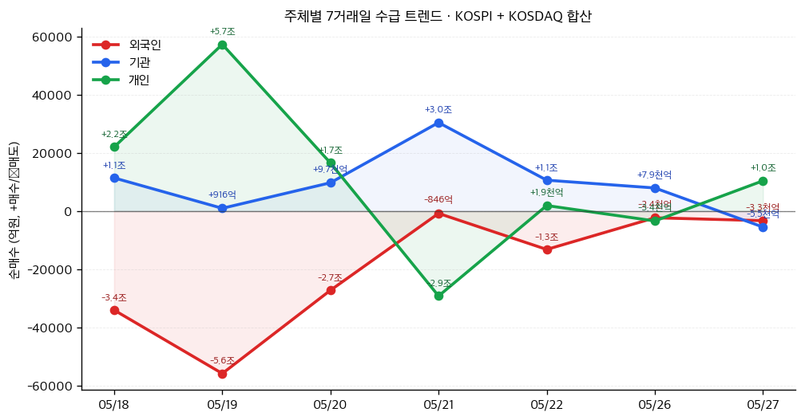

# 📊 모닝 브리핑 — 2026년 5월 28일 (목)

> **🟢 Risk-On (경계 혼재)** — 미국 증시 사상 최고치 경신, 그러나 30년 국채 금리 2007년 이후 최고치로 금리 부담 상존
> - **매크로**: 30년 美국채 금리 사상 최고 경계선 돌파 (📊 블록 확인), 유가 하락이 증시 상승 촉매
> - **리스크**: 이란 평화 협상 보도 진위 불확실, 백악관 "완전한 조작" 반박 — VIX 동향 체크 필수
> - **시그널**: ① 마이크론 19% 급등·시총 1조 달러 돌파로 AI 반도체 모멘텀 재점화 ② 30년 국채 5.20% → 고금리 장기화 vs. Risk-On 간 갈등 구조 심화

---

## 시장 스냅샷

### 주요 지수
| 지수 | 종가 | 등락 | 52주 위치 |
|------|------|------|----------|
| S&P 500 | 7,520.36 | +1.24 (+0.0%) | ████████████████████ 100% (5,889–7,520) |
| 나스닥 | 26,674.73 | +18.55 (+0.1%) | ████████████████████ 100% (19,101–26,675) |
| 다우존스 | 50,644.28 | +182.60 (+0.4%) | ████████████████████ 100% (42,099–50,644) |
| 코스피 | 8,047.51 | +199.80 (+2.5%) | ████████████████████ 100% (2,637–8,048) |
| 코스닥 | 1,172.52 | +11.39 (+1.0%) | █████████████████▉░░ 89% (727–1,226) |
| 닛케이 225 | 64,996.09 | -162.10 (-0.2%) | ███████████████████▉ 99% (37,447–65,158) |

### 매크로/원자재/크립토
| 항목 | 값 | 변동 | 52주 위치 |
|------|-----|------|----------|
| 미국 10Y | 4.48% | -0.01%p | ██████████████▊░░░░░ 74% (4–5) |
| 미국 2Y | 3.58% | +0.00%p | ██▏░░░░░░░░░░░░░░░░░ 10% (4–4) |
| DXY | 99.22 | +0.05 (+0.0%) | ██████████████░░░░░░ 70% (96–101) |
| USD/KRW | 1,500.33 | -14.46 (-1.0%) | ██████████████████▏░ 91% (1,348–1,516) |
| USD/JPY | 159.48 | +0.52 (+0.3%) | ███████████████████▏ 96% (142–160) |
| WTI 원유 | $89.60 | -4.6% | ███████████▉░░░░░░░░ 60% (55–113) |
| 금 (Gold) | $4,489.70 | -0.2% | ███████████▉░░░░░░░░ 59% (3,274–5,318) |
| 은 (Silver) | $75.02 | -1.7% | ██████████▎░░░░░░░░░ 51% (33–115) |
| BTC | $74,481 | -1.8% | ███▊░░░░░░░░░░░░░░░░ 19% (62,702–124,753) |
| VIX | 16.29 | -0.72 (-4.2%) | ███▎░░░░░░░░░░░░░░░░ 16% (13–31) |
| 10Y-2Y 스프레드 | 0.90%p | -0.01%p | — |

### 수급 동향 (최근 7 거래일, 05/18 ~ 05/27, KOSPI+KOSDAQ 합산)



**7일 누적**: 외국인 -13.7조 · 기관 +6.5조 · 개인 +7.5조

---
⚠️ 시장 스냅샷은 시스템에 의해 자동 삽입됩니다.

---

## 시장 센티먼트

<div style="background:#e0e0e0;border-radius:8px;overflow:hidden;margin:8px 0">
  <div style="display:flex;border-radius:8px;overflow:hidden;font-size:0.85em">
    <div style="background:#4CAF50;width:62%;padding:6px 10px;color:white">🟢 Risk-On 62%</div>
    <div style="background:#F44336;width:38%;padding:6px 10px;color:white;text-align:right">🔴 Risk-Off 38%</div>
  </div>
</div>

**핵심 판독**: S&P 500·나스닥·다우 트리플 사상 최고치는 명백한 Risk-On 시그널이지만, 그 배경이 된 이란 평화 협상 기대감을 백악관이 즉시 부인하면서 모멘텀의 신뢰성이 흔들립니다. 동시에 30년 국채 금리가 약 19년 만의 고점을 기록 중으로, "주가는 오르고 채권도 팔린다"는 이례적 긴장 국면이 이어지고 있습니다. 한국 기관 7거래일 연속 순매수, 외국인 순매도 축소는 국내 수급 개선 신호.

**변곡 촉매**:
- 🔴 **다운**: 이란 협상 보도가 완전 오보로 확인 시 → 유가 급반등 + 증시 되돌림 위험
- 🟢 **업**: 30년 국채 금리 안정화 + 연준 인사 비둘기 발언 → 밸류에이션 부담 완화, 추가 상승 여력

---

## 섹터별 센티먼트

| 섹터 | 센티먼트 | 한줄 평가 |
|------|---------|----------|
| 반도체·AI | 🟢 강세 | [[마이크론]] 19% 급등·시총 1조 달러 돌파, UBS 목표가 상향 + 트럼프 언급으로 AI 반도체 모멘텀 재점화 |
| 에너지 | 🟡 혼조 | 이란 협상 기대감에 유가 하락 → 에너지주 단기 약세, 그러나 협상 진위 불확실로 방향성 유보 |
| 장기채·금리 민감주 | 🔴 주의 | 30년 국채 5.20%대 — 유틸리티·리츠·배당주 등 금리 민감 섹터 밸류에이션 압박 지속 |
| 크립토·블록체인 | 🔴 약세 | 블랙록 IBIT 7거래일 연속 순유출 — 기관 BTC 수요 둔화 시그널, 단기 하락 압력 |
| 방산·지정학 | 🟡 관망 | 이란 관련 불확실성 지속, 협상 성사 시 방산주 조정 가능성 vs 불발 시 재부각 |
| 국내 대형주 (코스피) | 🟡 긍정 편향 | 외국인 순매도 대폭 축소 + 기관 7연속 순매수 → 수급 개선 진행 중, 글로벌 변수 종속 |
| 가치주·전통 산업 | 🟡 관망 | 버리·다이먼 AI 거품 경고 → 성장주→가치주 재배분 논의 부상, 본격 전환은 촉매 필요 |

---

## 오버나이트 핵심 이벤트

### 1. 미국 증시 트리플 사상 최고치 — 이란 협상 기대 + 유가 하락
- **요약**: S&P 500, 나스닥, 다우존스 3대 지수 모두 사상 최고치 경신. 이란 평화 협상 기대감과 유가 하락이 주요 촉매로 작용. 단, 백악관은 해당 보도를 "완전한 조작(fabrication)"이라 반박.
- **So What**: 지수 신고가는 강세 구조를 지속 확인해주지만, 상승의 근거가 된 이란 협상 뉴스가 부정되면서 모멘텀의 질(Quality of Rally)에 의문이 제기됩니다. 유가 하락이 실제로 지속된다면 에너지 비용 감소 → 기업 이익 개선 → 지수 추가 상승의 2차 연쇄가 가능하나, 이란 리스크가 재부상하면 유가 급등 + 증시 되돌림이 동시에 올 수 있습니다.
- **크로스 임팩트**: 에너지 섹터 약세, 소비재·항공·운송 수혜, 방산주 단기 조정 가능성

### 2. 마이크론 19% 급등 — 시가총액 1조 달러 돌파
- **요약**: UBS의 목표주가 상향과 트럼프 전 대통령의 긍정적 언급이 겹치며 [[마이크론]] 주가가 하루 19% 급등, 시가총액이 1조 달러를 돌파.
- **So What**: 단일 종목 19% 상승은 단순 개별 이벤트를 넘어 HBM(고대역폭메모리) 수요 사이클 전체에 대한 시장의 재평가 신호입니다. [[SK하이닉스]], [[삼성전자]] 메모리 반도체 섹터로 센티먼트가 전이될 가능성이 있으며, AI 인프라 투자 지속에 대한 시장의 확신을 재확인하는 사건입니다. 다만 하루 19% 상승은 단기 과열 신호이기도 하므로 차익실현 압력 모니터링 필요.
- **크로스 임팩트**: 반도체 장비주([[ASML]], [[램리서치]]), 국내 메모리 반도체([[SK하이닉스]], [[삼성전자]]), AI 인프라 ETF 긍정 파급

### 3. 30년 미국 국채 금리 5.20% — 2007년 이후 최고치
- **요약**: 30년 만기 미국 국채 금리가 5.20%까지 상승, 약 19년 만의 최고치를 기록. 연준의 추가 금리 인상 가능성 전망 확산.
- **So What**: "주가 신고가 + 장기금리 신고가"의 동시 발생은 역사적으로 불안정한 국면입니다. 장기금리 상승은 ① 주식 할인율 상승 → 성장주 밸류에이션 압박, ② 부동산·크레딧 시장 긴축 효과, ③ 신흥국 자금 이탈 압력이라는 세 갈래 리스크를 동시에 키웁니다. 특히 AI 고성장 기업의 DCF 가치는 금리 1%p 상승에 매우 민감하게 반응합니다.
- **크로스 임팩트**: 리츠([[VNQ]]), 유틸리티, 배당주 약세; 금융주(금리 수혜) 단기 강세; 달러 강세 → 원/달러 환율 상승 압력

### 4. 블랙록 IBIT 7거래일 연속 순유출 — 비트코인 하락 압력
- **요약**: 세계 최대 비트코인 현물 ETF인 블랙록 IBIT에서 7거래일 연속 대규모 자금 유출이 발생.
- **So What**: IBIT 연속 유출은 기관 투자자의 BTC 포지션 축소 신호로, 단기 BTC 가격 하방 압력의 핵심 메커니즘입니다. 다만 7거래일이 극단적 비관보다 "차익실현 + 리밸런싱" 성격일 수도 있으며, 유출 규모의 둔화 여부가 반등 타이밍을 가늠할 핵심 지표입니다.
- **크로스 임팩트**: BTC 연동 마이닝주, 크립토 거래소주 약세; 전통 자산(금, 채권) 상대적 매력 소폭 강화

---

## 오늘의 일정

| 시간(한국) | 이벤트 | 중요도 | 관련 종목 |
|-----------|--------|--------|----------|
| 오후 2시 (목, 28일) | 한국은행 기준금리 결정 | ⭐⭐⭐⭐ | [[은행주]], [[리츠]], [[국채ETF]], 전 종목 |
| 밤 9:30 (목, 28일) | 미국 1분기 GDP 수정치 | ⭐⭐⭐⭐ | [[S&P500]], [[나스닥]], 달러, 원/달러 |
| 밤 9:30 (목, 28일) | 미국 주간 신규 실업수당 청구건수 | ⭐⭐⭐ | 고용 민감 섹터, [[채권ETF]] |
| 금요일 밤 9:30 (29일) | 미국 4월 PCE 물가 발표 | ⭐⭐⭐⭐⭐ | 전 종목, [[채권]], 달러, [[금]] |

> [!warning] ⭐⭐⭐⭐⭐ 이벤트: 4월 PCE 물가 (한국 시간 29일 밤 9:30)
> **🟢 예상 하회 시**: 연준 금리 인하 기대 복원 → 성장주 랠리 + 채권 가격 반등, 30년 금리 상단 제한
> **🔴 예상 상회 시**: 고금리 장기화 재확인 → 성장주 밸류에이션 재압박, 나스닥 단기 조정 리스크
> 30년 금리 5.20%라는 민감한 수준에서 PCE가 나오는 만큼, 이번 주 가장 중요한 데이터 포인트.

---

## 테마 시그널

> [!abstract] 오늘의 테마: **기간 프리미엄(Term Premium)의 귀환 — "30년 국채 5.20%는 단순 금리 인상 공포가 아니다. 더 깊고 구조적인 이야기"**

### 왜 지금 이 테마인가

오늘 아침 가장 중요한 숫자는 마이크론의 19%가 아닙니다. **30년 미국 국채 금리 5.20%**입니다.

2007년 7월 이후 처음 보는 수준입니다. 그런데 많은 투자자가 이를 "연준이 더 올리겠구나"로만 해석합니다. 이 해석은 절반만 맞습니다. 장기금리를 제대로 분해해야 진짜 메시지가 보입니다.

---

### 장기금리의 해부학: 두 개의 엔진

장기금리(예: 30년 국채 수익률)는 사실 두 가지 요소의 합입니다:

```
장기금리 = 예상 단기금리 경로 + 기간 프리미엄(Term Premium)
```

| 구성요소 | 의미 | 2022~2023년 금리 급등의 주범 | 지금 5.20%의 주범 |
|---------|------|--------------------------|-----------------|
| **예상 단기금리 경로** | 앞으로 연준이 어떻게 움직일지에 대한 시장 기대 | 🟢 주도 — 연준 공격적 인상 | 🟡 일부 기여 |
| **기간 프리미엄 (Term Premium)** | 장기 불확실성에 대해 투자자가 요구하는 추가 보상 | 🟡 마이너스~제로 | 🔴 **주도** |

2022~2023년 금리 급등은 연준의 급격한 기준금리 인상이 원인이었습니다. 그때는 "연준이 얼마나 올릴까"의 싸움이었습니다. 그러나 **지금의 5.20%는 다릅니다.** 연준 기준금리가 크게 바뀌지 않은 상황에서 장기금리만 오르고 있다는 것은 기간 프리미엄이 팽창하고 있다는 신호입니다.

---

### 기간 프리미엄이 오르는 3가지 구조적 이유

<div style="border-left:4px solid #FF9800;padding-left:12px;margin:8px 0">

**① 재정 적자 + 국채 공급 폭발**
미국 연방 적자가 GDP의 6~7% 수준으로 고착화되면서 국채 발행량이 전례 없는 수준입니다. 수요는 한정적인데 공급이 넘치면 가격(채권 가격)이 내려가고 수익률(금리)이 올라갑니다. 단순한 수요-공급의 문제입니다.

**② 인플레이션 불확실성 프리미엄**
2021~2022년의 "인플레이션은 일시적" 실수를 학습한 채권 투자자들은 이제 장기 인플레이션 경로에 대해 더 큰 불확실성 보상을 요구합니다. 이란 지정학, AI의 구조적 성장 — 모두 인플레이션 경로를 복잡하게 만드는 변수입니다.

**③ 연준 QT(양적 긴축) + 외국 중앙은행의 미국채 보유 축소**
과거 연준과 외국 중앙은행(일본·중국·사우디)이 미국채의 핵심 구매자였습니다. 이 수요가 구조적으로 줄면서 "누가 이 국채를 살 것인가"에 대한 의문이 기간 프리미엄을 끌어올립니다.

</div>

---

### 역사적 비교: 기간 프리미엄이 높았던 시대

```
1980년대: 기간 프리미엄 4~5% → 고인플레이션 시대, 볼커의 충격 요법 시기
1990년대: 기간 프리미엄 2~3% → 재정 건전화 + 세계화 효과
2010~2019년: 기간 프리미엄 마이너스 → QE, 디플레이션 공포, 글로벌 저축 과잉
2022~현재: 기간 프리미엄 상승 전환 → 재정 확대, 지정학 분절, 탈세계화
```

<div style="background:#e0e0e0;border-radius:8px;overflow:hidden;margin:4px 0"><div style="background:#F44336;width:85%;padding:4px 8px;color:white;font-size:0.9em;white-space:nowrap">현재 기간 프리미엄 재팽창 국면 — 2010년대 마이너스 시대 완전 종료</div></div>

우리는 지금 **"기간 프리미엄이 마이너스였던 2010년대 예외적 시대"가 완전히 끝나고**, 새로운 구조적 균형을 찾아가는 과도기에 있습니다.

---

### 투자 함의: 자산별 체크포인트

| 자산 | 기간 프리미엄 상승의 영향 | 대응 방향 |
|-----|------------------------|---------|
| 성장주 (AI·기술) | 🔴 할인율 상승 → DCF 현재가치 하락 압력 | 이익 실현력(EPS 성장)이 밸류에이션 압박을 상쇄하는지 확인 |
| 장기채 ETF | 🔴 가격 하락 지속 위험 | 단기채·단기 SOFR 금리로 듀레이션 축소 |
| 부동산·리츠 | 🔴 조달금리 상승 → 캡레이트 상승 → 자산가치 하락 | 단기 비중 축소 |
| 금 (Gold) | 🟡 금리 상승은 부정적이나 인플레 헷지 수요 상충 | 실질금리 추세가 핵심 지표 |
| 달러 | 🟢 미국 금리 매력 상승 → 달러 강세 지속 | 신흥국·원화 환율 주시 |
| 금융주 (은행) | 🟢 순이자마진(NIM) 개선 | 단기 수혜, 단 경기 둔화 시 대출 부실 리스크 상충 |
| 단기채·MMF | 🟢 높은 금리 그대로 수혜 | 현금 대안으로 매력 유지 |

---

### 모니터링 포인트

> [!tip] 핵심 모니터링 지표
> 1. **뉴욕 연방준비은행 기간 프리미엄 모델 (ACM Term Premium)**: 월별 업데이트, 추세 확인
> 2. **30년 국채 옥션 결과**: 응찰률(Bid-to-Cover), 간접 입찰 비중 — 외국 수요 확인
> 3. **TIPS 실질금리**: 명목금리가 오르되 실질금리도 오르면 → 경제 펀더멘털 강세; 명목만 오르면 → 인플레 기대 반영
> 4. **PCE 물가 (내일 발표)**: 기간 프리미엄의 인플레 구성요소를 직접 확인하는 데이터

**핵심 질문**: "30년 5.20%는 미국 경제가 강해서인가, 아니면 재정 불안·공급 과잉 때문인가?" 전자라면 성장주도 버틸 수 있지만, 후자라면 주식-채권 동반 하락의 전형적인 재정 위기 전조 패턴입니다.

---

## 대가의 시선

> "AI stocks look like a bubble to me. Valuations have disconnected from fundamentals."
> *(AI 주식들은 내가 보기에 거품처럼 보인다. 밸류에이션이 펀더멘털과 괴리되었다.)*
> — **마이클 버리(Michael Burry)**, Scion Asset Management 창립자 [최근 발언, 2026년 5월]

**맥락**: 버리는 2008년 서브프라임 사태를 정확히 예측해 "빅숏(The Big Short)"의 실제 주인공이 된 인물입니다. 마이크론이 하루 19% 오르고 AI 지수가 사상 최고치를 기록하는 바로 이 시점에, 그는 현재의 AI 주식 붐을 과거 닷컴 버블과 유사한 패턴으로 경고했습니다. 제이미 다이먼(JP모건 CEO) 역시 유사한 입장을 표명한 것으로 알려졌습니다.

**투자 함의**: 버리의 경고가 반드시 옳다는 의미는 아닙니다. 그는 2015년에도 "시장이 고평가"라 경고했지만 S&P는 이후 수년간 상승했습니다. 그러나 이 발언이 중요한 이유는 **타이밍이 아니라 구조적 경고**이기 때문입니다. 오늘 마이크론 19% 상승과 30년 국채 5.20%가 동시에 발생하는 상황에서, 밸류에이션-펀더멘털 괴리 여부를 냉정하게 점검할 시점입니다. 버리가 틀렸더라도 질문 자체는 유효합니다.

---

## 투자 레슨

> [!abstract] 오늘의 레슨: **생존자 편향(Survivorship Bias) — "우리가 AI 붐을 낙관하는 이유의 절반은, 살아남지 못한 회사들을 보지 않기 때문이다"**

### 핵심 개념: 묘지는 조용하다

생존자 편향(Survivorship Bias)이란, 성공한 것·살아남은 것만 관찰하고 실패하여 사라진 것은 데이터에서 제외되는 인지적 오류입니다. 투자에서 이 편향은 교묘하게 작동합니다. 우리는 10배 오른 주식 이야기는 생생히 기억하지만, 상장폐지된 수천 개 기업의 이름은 기억하지 못합니다. 그 기업들은 데이터베이스에서, 인덱스에서, 우리 기억에서 조용히 사라졌기 때문입니다.

---

### 역사적 사례: 닷컴 버블이 준 교훈

2000년 닷컴 버블 당시를 생각해보세요. 생존자 편향이 없었다면 우리는 이런 질문을 해야 했습니다:

**"인터넷 기업 수천 개 중 몇 개가 10년 후에도 살아있었는가?"**

| 구분 | 실제 결과 |
|-----|---------|
| 나스닥 고점 대비 저점 하락폭 | 약 -78% (2000~2002년) |
| 고점 회복까지 걸린 시간 | 약 15년 (2015년 회복) |
| 살아남은 인터넷 기업 비율 | 극소수 — 아마존, 이베이 등 |
| 사라진 기업 | Pets.com, Webvan, Kozmo.com 등 수천 개 |

그런데 오늘날 우리가 "인터넷은 결국 세상을 바꿨다"고 말할 때, 우리는 **아마존과 구글만 보고 있습니다.** 수천 개의 파산한 인터넷 기업은 우리의 기억 속에 없습니다. 이것이 생존자 편향입니다.

> [!warning] 핵심 구분
> **"기술은 세상을 바꾼다" ✅ (맞다)**
> **"그 기술 기업들의 주가도 결국 오른다" ❌ (생존자 편향)**
> 기술의 성공 ≠ 특정 기업의 투자 수익

---

### 오늘 시장에서 작동하는 생존자 편향

마이크론이 오늘 19% 올랐습니다. AI 반도체가 "다음 시대의 석유"라는 내러티브가 강합니다. 이 국면에서 생존자 편향은 다음과 같이 작동합니다:

<div style="border-left:4px solid #F44336;padding-left:12px;margin:8px 0">

**우리가 보는 것**: 엔비디아, 마이크론, TSMC의 놀라운 성과
**우리가 보지 못하는 것**: AI 열풍 속에서 이미 조용히 사라진 수백 개의 AI 스타트업, 과도한 CapEx 집행 후 수익화 실패로 리스크에 처한 기업들의 사례

</div>

**3가지 구체적 발현**:

```
① AI 스타트업 생존율 착각
   → VC 포트폴리오의 "대박 1개"만 보도. 나머지 99개의 조용한 실패는 보도 안 됨
   
② 하이퍼스케일러 CapEx 수혜 착각
   → AI 인프라 투자가 모든 반도체 기업에 균등하게 흘러들어간다는 착각
     실제: 소수 대형 공급자 집중, 중소 업체 도태
     
③ "AI 기업 = 고성장" 착각
   → 우리가 아는 AI 기업들은 이미 살아남은 기업들
     아직 상장 전이거나 이미 망한 기업들의 실패는 데이터에 없음
```

---

### 생존자 편향을 교정하는 투자 프레임

| 질문 | 편향된 버전 | 교정된 버전 |
|-----|-----------|-----------|
| "이 기술이 성공할까?" | "AI는 무조건 성장한다" | "AI 중 어떤 세부 기술이 살아남을까?" |
| "이 기업이 수혜를 받을까?" | "AI 관련이면 다 오른다" | "이 기업의 경쟁 해자는 무엇이고, 5년 후에도 유효할까?" |
| "과거 성과를 보면 좋은 펀드 아닌가?" | "3년 평균 수익률 1위 펀드를 사겠다" | "3년 전 존재했던 펀드 중 몇 %가 살아남았나?" (폐쇄된 펀드 포함) |
| "이 섹터는 항상 좋았다" | "반도체는 항상 장기 우상향" | "반도체 사이클의 저점에서 어떤 기업들이 사라졌나?" |

---

### 실증 데이터: 뮤추얼펀드의 생존자 편향

학술 연구들은 뮤추얼펀드 성과 데이터에 심각한 생존자 편향이 존재함을 일관되게 보여줍니다:

<div style="background:#e0e0e0;border-radius:8px;overflow:hidden;margin:4px 0"><div style="background:#FF9800;width:70%;padding:4px 8px;color:white;font-size:0.9em;white-space:nowrap">10년 후에도 존재하는 뮤추얼펀드: 약 30~40% (나머지는 폐쇄·합병)</div></div>

살아남은 펀드만의 성과를 집계하면 평균이 크게 높아 보입니다. 사라진 펀드들의 부진한 성과는 통계에서 제거되기 때문입니다. 이것이 "액티브 펀드 평균이 인덱스를 이긴다"는 착각이 생기는 구조입니다.

---

### 오늘 실천 방법

> [!tip] 오늘 적용할 생존자 편향 체크
> **마이크론이 19% 오른 오늘, 이 두 가지를 동시에 생각하세요:**
> 1. "이 상승을 주도한 AI 반도체 수요 구조가 얼마나 오래, 얼마나 많은 기업에 지속될까?" — 살아남을 기업의 공통점을 찾기
> 2. "내가 낙관적인 이유가 실제 분석 때문인가, 아니면 지금까지 잘 된 것만 보이기 때문인가?" — 반대 사례(사라진 기업, 실패한 테마)를 의도적으로 찾기

---

## 오늘 하나만 기억한다면

> [!verdict] 오늘 하나만 기억한다면
> **"주가 신고가와 30년 국채 5.20%가 동시에 발생하는 것은 '좋은 세상'이 아니라 '불안정한 균형'의 신호다 — 기간 프리미엄의 구조적 상승은 AI 낙관론의 가장 조용하고 위험한 카운터파트너."**