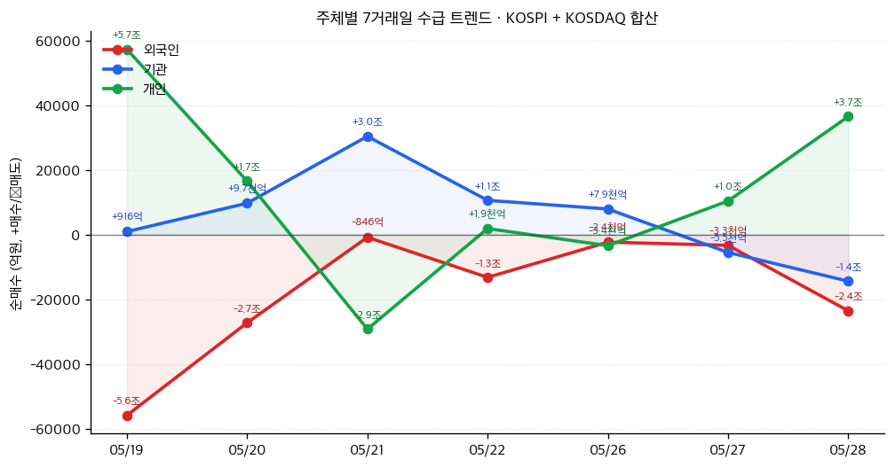

# 📊 모닝 브리핑 — 2026년 5월 29일 (금)

> **🟡 혼조 (Risk-On ↔ Risk-Off 충돌)** — AI 모멘텀과 지정학 리스크가 동시에 작동하는 이중 구조
> - **매크로**: 미-이란 긴장 고조로 유가 변동성 확대, 오늘 미국 PCE·GDP 발표 대기
> - **리스크**: 오버나이트 AI 랠리(마이크론 +19%↑) vs 중동 지정학 리스크 충돌
> - **시그널**: ① AI 반도체 실적 서프라이즈 사이클 진행 중 ② 중국 희토류 무기화 — 공급망 재편 속도 빨라짐

---

## 시장 스냅샷

### 주요 지수
| 지수 | 종가 | 등락 | 52주 위치 |
|------|------|------|----------|
| S&P 500 | 7,563.63 | +43.27 (+0.6%) | ████████████████████ 100% (5,912–7,564) |
| 나스닥 | 26,917.47 | +242.74 (+0.9%) | ████████████████████ 100% (19,114–26,917) |
| 다우존스 | 50,668.97 | +24.69 (+0.0%) | ████████████████████ 100% (42,172–50,669) |
| 코스피 | 8,228.70 | +181.19 (+2.3%) | ████████████████████ 100% (2,670–8,229) |
| 코스닥 | 1,133.13 | -39.39 (-3.4%) | ████████████████▎░░░ 81% (729–1,226) |
| 닛케이 225 | 64,999.41 | +3.32 (+0.0%) | ███████████████████▉ 99% (37,447–65,158) |

### 매크로/원자재/크립토
| 항목 | 값 | 변동 | 52주 위치 |
|------|-----|------|----------|
| 미국 10Y | 4.45% | -0.03%p | ██████████████░░░░░░ 70% (4–5) |
| 미국 2Y | 3.59% | +0.01%p | ██▎░░░░░░░░░░░░░░░░░ 11% (4–4) |
| DXY | 98.99 | -0.22 (-0.2%) | ████████████▉░░░░░░░ 65% (96–101) |
| USD/KRW | 1,493.69 | -11.75 (-0.8%) | █████████████████▍░░ 87% (1,348–1,516) |
| USD/JPY | 159.27 | +0.02 (+0.0%) | ██████████████████▉░ 95% (142–160) |
| WTI 원유 | $88.56 | -0.1% | ███████████▌░░░░░░░░ 58% (55–113) |
| 금 (Gold) | $4,523.70 | +1.7% | ████████████▎░░░░░░░ 61% (3,274–5,318) |
| 은 (Silver) | $75.91 | +1.8% | ██████████▌░░░░░░░░░ 52% (33–115) |
| BTC | $73,460 | -1.2% | ███▌░░░░░░░░░░░░░░░░ 17% (62,702–124,753) |
| VIX | 15.74 | -0.55 (-3.4%) | ██▋░░░░░░░░░░░░░░░░░ 13% (13–31) |
| 10Y-2Y 스프레드 | 0.86%p | -0.03%p | — |

### 수급 동향 (최근 7 거래일, 05/19 ~ 05/28, KOSPI+KOSDAQ 합산)



**7일 누적**: 외국인 -12.7조 · 기관 +4.0조 · 개인 +9.0조

---
## 시장 센티먼트

<div style="background:#e0e0e0;border-radius:8px;overflow:hidden;margin:8px 0">
  <div style="background:#4CAF50;width:55%;padding:6px 12px;color:white;font-size:0.9em;white-space:nowrap">🟢 Risk-On 55%</div>
</div>
<div style="background:#e0e0e0;border-radius:8px;overflow:hidden;margin:4px 0">
  <div style="background:#F44336;width:45%;padding:6px 12px;color:white;font-size:0.9em;white-space:nowrap">🔴 Risk-Off 45%</div>
</div>

**핵심 판독**: 마이크론 실적 서프라이즈와 스노우플레이크-AWS 파트너십이 AI 인프라 사이클의 건재함을 재확인하며 위험선호 무드를 유지하고 있다. 그러나 미-이란 긴장 고조로 유가 변동성이 확대되면서 인플레이션 재점화 우려가 맞불을 놓는 형국이다. 오늘 미국 4월 PCE 발표가 이 균형의 향방을 결정할 핵심 변수다.

**변곡 촉매**:
- 🔴 **다운사이드**: PCE가 예상치 상회 → Fed 인하 기대 후퇴 + 유가 추가 상승 겹치면 채권 매도·주식 혼조
- 🟢 **업사이드**: PCE 둔화 확인 + 중동 협상 진전 → 금리 인하 기대 회복으로 기술주·성장주 랠리 재개

---

## 섹터별 센티먼트

| 섹터 | 센티먼트 | 한줄 평가 |
|------|---------|----------|
| 반도체·HBM | 🟢 강세 | 마이크론 실적 서프라이즈로 AI 수요 사이클 재확인, HBM 공급 부족 지속 |
| 클라우드·AI 인프라 | 🟢 강세 | 스노우플레이크-AWS 60억 달러 파트너십, AI 지출 둔화 우려 해소 |
| 방산·IT서비스 | 🟢 강세 | 델 97억 달러 국방부 계약 + 지정학 리스크 확대로 방산 수혜 지속 |
| 에너지·정유 | 🟡 혼조 | 미-이란 긴장으로 유가 상방 압력, 그러나 협상 진전 시 되돌림 리스크 |
| 희토류·광물 | 🟡 혼조 | 중국 수출 통제 강화로 가격 상방 압력, 단 비중국 대안 부재로 단기 공급 해법 없음 |
| 금융·채권 민감주 | 🔴 주의 | PCE 발표 앞두고 금리 방향 불확실, 인플레 서프라이즈 시 즉각 타격 |
| 소비재·경기민감 | 🔴 약세 | 유가·인플레 우려가 실질소득 압박, 소비심리 회복 모멘텀 저해 |

---

## 오버나이트 핵심 이벤트

### 1. 마이크론, 어닝 서프라이즈로 시총 1조 달러 돌파
- **요약**: 마이크론이 시장 예상을 크게 웃도는 분기 실적을 발표하며 주가가 19% 이상 급등, 시가총액 1조 달러를 돌파했다.
- **So What**: AI 서버용 HBM(고대역폭 메모리) 수요가 실적으로 가시화된 최초의 대형 이정표다. 단순한 기대감이 아니라 실제 매출로 증명된 AI 인프라 사이클의 강도는 [[SK하이닉스]], [[삼성전자]] 등 한국 메모리 업체에 대한 시장의 기대치를 한 단계 높이는 촉매가 된다.
- **크로스 임팩트**: 반도체 장비([[ASML]], [[어플라이드 머티리얼즈]]), 메모리 소재, AI 서버 공급망 전반 긍정

### 2. 스노우플레이크-AWS, 60억 달러 AI 인프라 파트너십 체결
- **요약**: 스노우플레이크가 강력한 1분기 실적과 함께 AWS와 60억 달러 규모 클라우드·AI 인프라 파트너십을 발표하며 주가가 급등했다.
- **So What**: 하이퍼스케일러의 AI 투자가 단순 인프라 구축을 넘어 데이터·소프트웨어 레이어로 확장되고 있음을 확인하는 신호다. 이는 AI 자본지출 사이클의 다음 수혜 계층(데이터플랫폼·MLOps·분석 소프트웨어)에 대한 관심을 높인다.
- **크로스 임팩트**: 클라우드 데이터 플랫폼([[Snowflake]], [[Databricks]]), 기업 소프트웨어 섹터 긍정

### 3. 델 테크놀로지스, 미 국방부 97억 달러 계약 수주
- **요약**: 델 테크놀로지스가 미국 국방부로부터 97억 달러 규모의 소프트웨어 계약을 수주하며 프리마켓에서 4% 이상 상승했다.
- **So What**: 지정학 긴장 고조가 방산 IT 예산 확대로 연결되는 구조가 재확인됐다. AI·데이터 인프라 기업이 민간을 넘어 정부·방산 수요까지 흡수하는 복합 성장 내러티브는 밸류에이션 프리미엄을 정당화하는 추가 근거가 된다.
- **크로스 임팩트**: IT 인프라·방산 SW([[Dell]], [[Palantir]], [[Leidos]]), 사이버보안 섹터 긍정

### 4. 미-이란 긴장 고조 — 유가 변동성 확대
- **요약**: 최근 수 일간 미국과 이란 간의 긴장이 재고조되며 유가가 상승, 인플레이션 재점화 우려와 시장 불확실성이 함께 커졌다.
- **So What**: 중동 리스크는 원유 공급 차질 → 에너지 가격 상승 → PCE/CPI 상승 → Fed 인하 지연의 경로를 타고 전체 자산 가격에 영향을 미친다. 특히 오늘 PCE 발표와 맞물려, 유가 데이터가 예상보다 높게 나올 경우 시장의 금리 민감도가 폭발적으로 높아질 수 있다.
- **크로스 임팩트**: 정유·에너지 섹터 단기 수혜, 항공·물류 비용 상승, 채권 금리 상방 압력

---

## 오늘의 일정

| 시간(한국) | 이벤트 | 중요도 | 관련 종목 |
|-----------|--------|--------|----------|
| 오늘 밤 9:30 | 미국 1분기 GDP 2차 추정치 발표 | ⭐⭐⭐⭐ | 전 섹터 |
| 오늘 밤 9:30 | 미국 4월 개인소득·지출 + **PCE 물가지수** 발표 | ⭐⭐⭐⭐⭐ | [[국채]], [[달러]], 전 섹터 |
| 오늘 밤 11:00 | 미시간대 소비자심리지수 (최종) | ⭐⭐⭐ | 소비재, 리테일 |

> [!warning] ⭐⭐⭐⭐⭐ 오늘 밤 9:30 — 미국 4월 PCE 발표: 시나리오 분기
> - **🟢 PCE 예상 하회**: Fed 인하 기대 회복 → 기술주·성장주 랠리, 달러 약세, 채권 강세
> - **🟡 PCE 예상 부합**: 현 센티먼트 유지, 뚜렷한 방향성 없이 AI 개별 모멘텀 지속
> - **🔴 PCE 예상 상회**: 인플레 재점화 우려 → 금리 재상승, 성장주 매도, 달러 강세·이머징 약세

---

## 테마 시그널

> [!abstract] 오늘의 테마: **희토류의 무기화 — "중국이 마그넷 공급망을 틀어쥐는 순간, AI·방산·전기차의 미래가 베이징의 손에 쥐어진다"**

### 왜 지금인가 — 시의성

2026년 5월, 중국이 일본과 미국 양국에 동시에 희토류 수출 제한을 적용하고 있다는 보도가 잇따르고 있다. 2025년 12월부터 사실상 일본에 대한 중희토류(Heavy Rare Earths) 수출이 차단됐고, 미국에도 유사한 압박이 병행되고 있다. 단순한 양자 지렛대를 넘어, **다자간 광물 공급 무기화**라는 새로운 국면이 열린 것이다.

오늘 마이크론의 AI 반도체 호황과 델의 방산 계약을 동시에 읽는다면, 그 이면에 이 테마가 작동하고 있다는 사실을 놓쳐서는 안 된다.

---

### 구조 이해: 왜 희토류는 대체가 불가능한가

```
[광산 채굴] → [분리 정제] → [산화물 생산] → [합금·자석 제조] → [완성품]
  ↑                ↑                ↑                  ↑
 중국 60%+     중국 85%+       중국 90%+           중국 92%+
```

희토류는 17개 원소의 집합이지만, 투자자가 집중해야 할 병목은 **자석 중간재(마그넷 레이어)**다.

| 원소 | 용도 | 중국 지배력 |
|------|------|------------|
| 네오디뮴(Nd)·프라세오디뮴(Pr) | EV 모터, 풍력 발전기, 로봇 | 채굴 60%+, 정제 85%+ |
| 디스프로슘(Dy)·터븀(Tb) | 고온용 영구자석 강화재 | **사실상 독점 (90%+)** |
| 이트륨(Y) | LED, 레이저, 방산 광학 | 85%+ |

> [!warning] 실제 병목은 NdPr(네오디뮴-프라세오디뮴)이 아니다
> 미디어의 관심은 NdPr에 집중되지만, 진짜 공급 병목은 **디스프로슘과 터븀**이다. 중국 외 지역에서 상업적 규모의 Dy·Tb 생산이 사실상 불가능한 상황에서, 이 원소들이 없으면 전기차·방산 드론·로봇의 영구자석이 고온 환경에서 작동하지 않는다.

---

### 중국의 "Mine-to-Magnet Architecture" — 전략적 설계의 전모

중국의 희토류 통제는 단순히 광산을 많이 보유해서가 아니다. **채굴→분리→산화물→합금→자석**으로 이어지는 가치사슬 전체를 수직 통합하고, 각 단계에서 기술 표준과 국가 자본을 결합한 구조다. 이를 "Mine-to-Magnet Architecture"라 부른다.

<div style="border-left:4px solid #F44336;padding-left:12px;margin:8px 0">
이 구조가 무서운 이유: 서방이 광산을 개발해도 분리 정제 기술과 설비가 없으면 자석을 만들 수 없다. 분리 설비를 구축해도 자석 제조 기술이 없으면 완제품이 없다. 각 단계의 선행 투자와 기술 학습 시간이 최소 10~15년이기 때문에, "다각화"는 구호에 머무르기 쉽다.
</div>

2026년 현재 중국이 일본과 미국에 동시 제한을 가한 것은, 양자 협상 카드에서 **다자 전략 무기**로의 질적 전환을 의미한다. 동맹국들이 개별적으로 협상하는 방식으로는 대응이 불가능해지는 구조가 완성되고 있다.

---

### 투자 함의 — 누가 수혜를 받고, 누가 노출되어 있는가

**수혜 후보군**

| 카테고리 | 투자 논리 | 리스크 |
|---------|----------|--------|
| 비중국 희토류 광산 | MP Materials([[MP]]), Lynas(호주) — 중국 외 유일 규모 생산자 | 정제 레이어 미완성, 수익성 변동 큼 |
| 희토류 분리 정제 기술 | 서방 정부 보조금 수혜 기대, 희소 기술 프리미엄 | 상용화까지 5~10년 시간 리스크 |
| 영구자석 재활용 | 폐 EV·모터에서 Dy·Tb 회수 — 유일한 단기 대안 | 회수율 낮음, 규모화 미완 |
| 방산·드론 내재화 기업 | 공급 불안이 수직통합 국산화 유인 강화 | 정부 계약 의존도 |

**노출(Risk) 후보군**

<div style="display:flex;border-radius:8px;overflow:hidden;margin:8px 0;font-size:0.85em">
  <div style="background:#F44336;width:65%;padding:6px 8px;color:white">🔴 고노출: EV OEM, 로봇 제조, 방산 드론, 풍력터빈 65%</div>
  <div style="background:#FF9800;width:35%;padding:6px 8px;color:white">🟡 중노출: AI 서버 냉각·모터, 의료기기 35%</div>
</div>

> [!tip] 핵심 인사이트
> AI 반도체 호황(마이크론 +19%)과 희토류 무기화는 별개 테마가 아니다. AI 데이터센터의 냉각 시스템, 로봇 팔의 서보 모터, 방산 드론의 추진체 — 모두 영구자석이 필요하다. AI 인프라 사이클이 길어질수록, 희토류 공급망 리스크의 노출 강도도 함께 커진다.

---

### 모니터링 포인트

1. **중국의 수출 통제 확대 여부**: 현재 일본·미국 대상 → ASEAN·유럽으로 확대 시 글로벌 충격
2. **미국 국방수권법(NDAA) 내 광물 조항**: 방산 공급망 내재화 예산 배정 규모
3. **호주·캐나다 희토류 개발 타임라인**: Lynas의 미국 내 정제 설비 완공 일정 (현재 진행 중)
4. **Dy·Tb 가격 동향**: 디스프로슘·터븀 가격이 급등하면 실질적 공급 위기가 가시화된 신호

---

## 대가의 시선

> "The mineral resources of the future are not just commodities — they are geopolitical weapons."
> ("미래의 광물 자원은 단순한 원자재가 아니다 — 그것은 지정학적 무기다.")
> — **Henry Kissinger**, 전 미국 국무장관 [클래식]

**맥락**: 키신저는 냉전 시대 에너지·자원을 외교 협상의 핵심 레버리지로 이해한 전략가였다. 1970년대 오일쇼크 당시 사우디아라비아와 달러·석유 연계를 설계한 것이 그 대표적 예다.

**투자 함의**: 오늘 중국의 희토류 수출 통제는 키신저가 예견한 자원 무기화의 21세기 버전이다. 투자자는 "공급망 안보"를 단순한 ESG·지속가능성 이슈가 아니라, 국가 안보 예산이 몰리는 **구조적 투자 섹터**로 재분류해야 할 시점이다. 정부 보조금과 국방 계약이 결합된 비중국 광물 공급망 기업들의 밸류에이션 프리미엄은 단기 등락이 아닌 구조적 재평가 압력을 받고 있다.

---

## 투자 레슨

> [!abstract] 오늘의 레슨: **손실회피 편향(Loss Aversion) — "마이크론이 19% 폭등하는 날, 당신이 '그때 살걸'을 후회하는 감정은 투자 판단의 적이다"**

### 핵심 개념: 손실의 고통은 이득의 기쁨보다 2배 크다

행동경제학의 창시자 대니얼 카너먼(Daniel Kahneman)과 아모스 트버스키(Amos Tversky)는 1979년 **프로스펙트 이론(Prospect Theory)**을 통해 인간이 동일한 금액의 손실과 이득을 비대칭적으로 경험한다는 것을 증명했다.

<div style="background:#e0e0e0;border-radius:8px;overflow:hidden;margin:8px 0">
  <div style="background:#F44336;width:80%;padding:6px 12px;color:white;font-size:0.9em;white-space:nowrap">손실 -$100의 심리적 고통 지수: 약 80</div>
</div>
<div style="background:#e0e0e0;border-radius:8px;overflow:hidden;margin:4px 0">
  <div style="background:#4CAF50;width:40%;padding:6px 12px;color:white;font-size:0.9em;white-space:nowrap">이득 +$100의 심리적 기쁨 지수: 약 40</div>
</div>

즉, **손실의 심리적 무게는 동일 금액의 이득보다 약 2~2.5배 크다.** 이것이 손실회피 편향(Loss Aversion)의 핵심이다.

---

### 손실회피 편향이 만드는 4가지 치명적 투자 패턴

| 패턴 | 현상 | 실제 손실 경로 |
|------|------|---------------|
| **1. 공포 매도** | 주가 하락 시 "더 잃기 전에 팔자" | 저점 매도 후 반등 소외 |
| **2. 폭등 후 FOMO 추격** | "이걸 못 샀다는 손실감"에 고점 추격 | 고점 매수 후 조정 구간 편입 |
| **3. 손실 포지션 회피** | 마이너스 종목을 "팔면 확정되니까" 보유 | 기회비용 누적 (처분효과와 결합) |
| **4. 과도한 헤지** | 작은 손실 가능성에 과도한 비용 지불 | 헤지 비용이 수익 갉아먹음 |

---

### 오늘 시장이 정확히 그 사례다

마이크론이 19% 폭등한 오늘 아침, 많은 투자자들이 이런 생각을 할 것이다:

> *"그때 살걸. 실적 발표 전에 샀어야 했는데. 이제라도 사야 하나?"*

이 감정의 정체를 해부해보자:

**"그때 못 샀다"는 것은 실제 손실이 아니다.** 기회비용(Opportunity Cost)이다. 하지만 인간의 뇌는 기회비용을 실제 손실과 동일하게 처리한다. 이 허구의 손실감이 FOMO(Fear of Missing Out)를 만들고, FOMO가 19% 폭등 후 고점 추격 매수를 유발한다.

<div style="display:flex;border-radius:8px;overflow:hidden;margin:8px 0;font-size:0.85em">
  <div style="background:#4CAF50;width:30%;padding:6px 8px;color:white">🟢 이성적 판단 30%</div>
  <div style="background:#F44336;width:70%;padding:6px 8px;color:white">🔴 FOMO·손실회피 기반 감정 판단 70%</div>
</div>

연구에 따르면 개인 투자자의 주식 매수 결정 중 상당 부분이 **최근 급등 이후 추격** 패턴으로 나타나며, 이 경우의 평균 수익률은 매수 후 1개월 기준으로 시장 평균을 하회한다.

---

### 프레임워크: 손실회피 편향을 차단하는 3단계 체크리스트

> [!tip] 폭등 종목 앞에서 자문해야 할 3가지 질문

**Step 1 — 감정 출처 진단**
> "나는 지금 이 종목을 '투자 논거'로 사려는가, 아니면 '못 산 것 같은 느낌'으로 사려는가?"

**Step 2 — 현재 가격의 리스크-리워드 재계산**
> 19% 오른 오늘의 마이크론은 어제의 마이크론이 아니다. 오늘 가격 기준으로 DCF를 다시 돌려라. 내러티브가 아니라 숫자가 답해야 한다.

**Step 3 — 오르지 않은 종목 스캔**
> 폭등한 종목에 집중하는 동안, 시장은 동일한 테마에서 아직 반응하지 않은 2차 수혜주를 놔두고 있을 수 있다. 오늘 마이크론이 폭등했다면, 아직 안 오른 메모리 소재·장비 기업을 먼저 확인하라.

---

### 역사적 사례: 2000년 닷컴 버블의 손실회피 FOMO

2000년 3월 나스닥 정점 직전, 가장 많은 개인 투자자가 기술주를 매수한 시점은 **이미 200~300% 오른 이후**였다. "못 사면 손해"라는 손실회피 감정이 정점 매수를 유발했고, 나스닥은 이후 2년 반 동안 78% 하락했다.

흥미로운 것은, **정점에서 매수한 사람들은 하락 시에도 같은 편향으로 버텼다.** "팔면 손실이 확정된다"는 손실회피 편향이 손절을 막았고, 결국 78% 하락의 전 구간을 견뎌야 했다. 손실회피 편향은 매수와 매도 양쪽에서 동시에 작동하는 양방향 함정이다.

---

### 오늘 실천 방법

오늘 밤 마이크론·스노우플레이크 등 폭등 종목을 보며 "사야 하나"라는 충동이 올라온다면, 30초 동안 멈추고 자문하라: **"이 충동이 논거에서 오는가, 감정에서 오는가?"** 논거라면 Step 2(가격 재계산)를 하고, 감정이라면 Step 3(대안 스캔)으로 전환하라. 폭등 당일의 추격 매수는 통계적으로 당신에게 불리하다.

---

## 오늘 하나만 기억한다면

> [!verdict] 오늘 하나만 기억한다면
> **"마이크론 +19%에 오늘 아침 느끼는 '그때 살걸'은 손실이 아니라 감정이다 — 오늘 밤 PCE가 진짜 변수이고, 폭등 후 추격보다 아직 안 오른 2차 수혜주를 먼저 보는 것이 통계적으로 유리하다."**