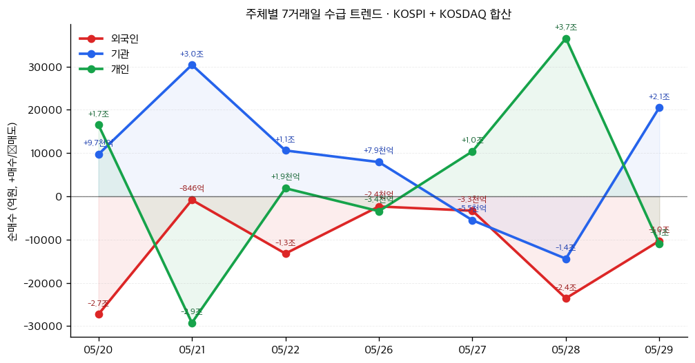

# 📊 모닝 브리핑 — 2026년 6월 1일 (월)

> **🟢 Risk-On** — AI 랠리 + 중동 휴전 기대감이 글로벌 증시를 사상 최고치로 끌어올렸으나, 인플레이션 재점화와 지정학 불확실성이 꼬리 리스크로 잔존
> - **매크로**: PCE 물가 상승 → 연준 금리 인하 기대 후퇴 / 한국은행 하반기 금리 인상 가능성 시사
> - **리스크**: 다우 51,000선 돌파·코스피 8,476 사상 최고치 / VIX 데이터 확인 필요
> - **시그널**: ① AI 인프라 투자 사이클 가속 (델 테크 어닝 서프라이즈) ② 중동 지정학 변동성 — 휴전 기대↔이란 긴장 재고조 반복 중

---

## 시장 스냅샷

### 주요 지수
| 지수 | 종가 | 등락 | 52주 위치 |
|------|------|------|----------|
| S&P 500 | 7,580.06 | +16.43 (+0.2%) | ████████████████████ 100% (5,912–7,580) |
| 나스닥 | 26,972.62 | +55.15 (+0.2%) | ████████████████████ 100% (19,114–26,973) |
| 다우존스 | 51,032.46 | +363.49 (+0.7%) | ████████████████████ 100% (42,172–51,032) |
| 코스피 | 8,476.15 | +290.86 (+3.6%) | ████████████████████ 100% (2,698–8,476) |
| 코스닥 | 1,074.80 | -29.56 (-2.7%) | █████████████▉░░░░░░ 69% (734–1,226) |
| 닛케이 225 | 66,329.50 | +1636.38 (+2.5%) | ████████████████████ 100% (37,447–66,330) |

### 매크로/원자재/크립토
| 항목 | 값 | 변동 | 52주 위치 |
|------|-----|------|----------|
| 미국 10Y | 4.45% | -0.00%p | ██████████████░░░░░░ 70% (4–5) |
| 미국 2Y | 3.59% | -0.00%p | ██▏░░░░░░░░░░░░░░░░░ 11% (4–4) |
| DXY | 98.99 | +0.07 (+0.1%) | ████████████▉░░░░░░░ 64% (96–101) |
| USD/KRW | 1,507.38 | +12.09 (+0.8%) | ███████████████████░ 95% (1,348–1,516) |
| USD/JPY | 159.39 | +0.12 (+0.1%) | ███████████████████░ 95% (142–160) |
| WTI 원유 | $89.64 | +2.6% | ███████████▉░░░░░░░░ 60% (55–113) |
| 금 (Gold) | $4,565.40 | +0.1% | ████████████▋░░░░░░░ 63% (3,274–5,318) |
| 은 (Silver) | $75.14 | -0.6% | ██████████▏░░░░░░░░░ 50% (35–115) |
| BTC | $73,800 | +0.1% | ███▋░░░░░░░░░░░░░░░░ 18% (62,702–124,753) |
| VIX | 15.32 | -0.42 (-2.7%) | ██▏░░░░░░░░░░░░░░░░░ 11% (13–31) |
| 10Y-2Y 스프레드 | 0.87%p | +0.00%p | — |

### 수급 동향 (최근 7 거래일, 05/20 ~ 05/29, KOSPI+KOSDAQ 합산)



**7일 누적**: 외국인 -8.1조 · 기관 +5.9조 · 개인 +2.2조

---
## 시장 센티먼트

<div style="background:#e0e0e0;border-radius:8px;overflow:hidden;margin:8px 0">
  <div style="display:flex;border-radius:8px;overflow:hidden;font-size:0.9em">
    <div style="background:#4CAF50;width:68%;padding:6px 12px;color:white">🟢 Risk-On 68%</div>
    <div style="background:#F44336;width:32%;padding:6px 12px;color:white">🔴 Risk-Off 32%</div>
  </div>
</div>

**핵심 판독**: 미국·한국 3대 지수 동반 사상 최고치 경신은 명확한 Risk-On 신호다. AI 인프라 수요가 실적으로 확인되면서 기술주 중심의 매수세가 글로벌로 확산되고 있다. 다만 4월 PCE 물가 상승으로 연준 피벗 기대가 후퇴하고, 중동 휴전 기대와 긴장 재고조가 반복되는 이중 구조가 변동성 하방을 지지하고 있다.

**변곡 촉매**:
- 🔴 **다운사이드**: 이란-미국 협상 결렬 + 유가 급등 재점화 → 인플레 기대 상승 → 연준 매파 전환 가속
- 🟢 **업사이드**: 중동 휴전 공식 서명 확인 + 연준 인사 비둘기 발언 → Risk-On 랠리 2차 파동

---

## 섹터별 센티먼트

| 섹터 | 센티먼트 | 한줄 평가 |
|------|---------|----------|
| AI 인프라·서버 | 🟢 강세 | 델 테크 어닝 서프라이즈로 수요 사이클 확인, 데이터센터 CapEx 확대 기대 지속 |
| 반도체 | 🟢 강세 | 젠슨 황 방한 + AI 서버 수요 → HBM·고대역폭 메모리 수혜 지속 |
| 에너지·원유 | 🟡 혼조 | 휴전 기대에 유가 급락→급반등 반복, 방향성 미정. 이란 협상 결과가 단기 변수 |
| 금·귀금속 | 🟡 혼조 | 휴전 기대에 금값 일시 하락, 인플레·지정학 불확실성이 하방 지지. 방향 분기점 |
| 방산 | 🟡 관망 | 중동 긴장 재고조는 우호적이나 휴전 협상 진행 시 단기 매도 압력 가능 |
| 소비재·경기민감주 | 🟡 중립 | PCE 상승으로 소비 여력 불확실, 금리 인하 후퇴가 밸류에이션 부담 |
| 금융·은행 | 🟢 긍정 | 한국은행 금리 인상 시사 → 국내 은행 NIM 개선 기대감 재부각 |

---

## 오버나이트 핵심 이벤트

### 1. 미국 3대 지수 사상 최고치 경신 — AI 랠리 주도
- **요약**: 다우존스가 51,000선을 돌파하며 미국 3대 지수 모두 사상 최고치를 기록했다. AI 인프라 수요 확인과 중동 휴전 기대감이 복합 작용했다.
- **So What**: 델 테크놀로지스의 어닝 서프라이즈가 AI 서버 수요가 단순 기대가 아닌 실적으로 구현되고 있음을 확인시켰다. 이는 AI 인프라 전체 밸류체인(서버→반도체→전력→냉각)에 대한 재평가 트리거로 작동한다. 지수 최고치 경신은 기관 패시브 자금의 추가 유입을 강제하는 구조적 매수 압력으로 이어진다.
- **크로스 임팩트**: [[엔비디아]], [[SK하이닉스]], [[삼성전자]] 등 AI 반도체·HBM 밸류체인 전반 / 데이터센터 전력·냉각 관련 섹터

### 2. 코스피 사상 최고치 8,476 — 젠슨 황 방한 기대감
- **요약**: 코스피가 장중·종가 기준 모두 사상 최고치 8,476.15를 기록했다. 엔비디아 CEO 젠슨 황의 방한 기대감과 기관 매수세가 맞물렸다.
- **So What**: 젠슨 황 방한이 단순 의전 방문에 그치지 않고 HBM 공급 확대 협의, 국내 AI 생태계 파트너십 발표로 이어질 경우 국내 반도체·AI 밸류체인 전반에 촉매로 작동할 수 있다. 코스피 사상 최고치는 외국인 자금 유입 지속 여부가 지속 가능성의 핵심 변수다.
- **크로스 임팩트**: [[삼성전자]], [[SK하이닉스]], [[한미반도체]] 등 반도체 밸류체인 / KOSPI200 추종 패시브 펀드

### 3. PCE 물가 상승 — 연준 피벗 기대 후퇴
- **요약**: 4월 미국 개인소비지출(PCE) 물가지수가 상승하며 연준의 금리 인하 기대가 후퇴했다. 한국은행도 하반기 금리 인상 가능성을 시사했다.
- **So What**: PCE는 연준이 가장 중시하는 인플레이션 지표다. 상승 지속 시 "Higher for Longer"가 재강화되며 장기채 금리 상승 → 고밸류에이션 기술주 할인율 압력으로 연결된다. 한국은행 금리 인상 시사는 국내 부동산·대출 민감 섹터에 직접적 하방 압력이다.
- **크로스 임팩트**: 미국 장기채([[TLT]]), 고PER 성장주 전반 / 국내 리츠([[KODEX 리츠]])·건설·금융 섹터

### 4. 중동 리스크 — 휴전 기대와 긴장 재고조의 반복
- **요약**: 미국-이란 휴전 협상 보도에 유가·금 가격이 급락했으나, 백악관 부인 후 유가가 급반등하며 긴장감이 재고조됐다.
- **So What**: 중동 지정학 리스크가 단일 방향이 아닌 뉴스 플로우에 따라 급등락하는 구조가 확인됐다. 이는 에너지 관련 포지션에서 헤지 비용을 높이고, 옵션 변동성 프리미엄을 구조적으로 높이는 효과를 낳는다. 휴전 공식 확인 전까지 에너지·방산 섹터의 방향성 베팅은 이벤트 드리븐 리스크를 수반한다.
- **크로스 임팩트**: 원유 관련 ETF([[KODEX WTI원유선물H]]), 방산주([[한화에어로스페이스]], [[LIG넥스원]]) / 항공·해운 섹터

---

## 오늘의 일정

| 시간(한국) | 이벤트 | 중요도 | 관련 종목/섹터 |
|-----------|--------|--------|---------------|
| 오전 중 | 엔비디아 젠슨 황 CEO 방한 관련 동향 | ⭐⭐⭐⭐ | [[삼성전자]], [[SK하이닉스]], [[한미반도체]] |
| 오전 중 | [[삼성전자]] 임원·주요주주 특정증권 소유상황 보고서 공시 | ⭐⭐ | [[삼성전자]] |
| 밤 9:30 (미동부 오전) | 미국 5월 ISM 제조업 PMI | ⭐⭐⭐ | 경기민감주 전반 |
| 이번 주 수요일 | 미국 ADP 민간 고용 | ⭐⭐⭐⭐ | 전 종목, 금리 민감주 |
| 이번 주 금요일 | 미국 5월 비농업 고용(NFP) | ⭐⭐⭐⭐⭐ | 전 종목 |

> [!warning] ⭐⭐⭐⭐⭐ 이벤트: 미국 5월 비농업 고용(NFP)
> - **강한 고용** (예상 상회): 연준 금리 인하 기대 추가 후퇴 → 달러 강세, 장기금리 상승, 성장주 밸류에이션 압박
> - **약한 고용** (예상 하회): 연준 피벗 기대 재부각 → Risk-On 재점화, 기술주·이머징 마켓 수혜
> - **PCE 상승 + 강한 고용** 동시 확인 시: 스태그플레이션 내러티브 부상 리스크

---

## 테마 시그널

> [!abstract] 오늘의 테마: **이머징 마켓의 구조적 기회 — "인도·베트남·중동이 동시에 열리는 이유, 그리고 투자자가 놓치는 것"**

### 왜 지금인가 — 세 가지 구조적 동시 작동

지금 이머징 마켓에서 동시에 일어나고 있는 일은 단순한 경기 사이클이 아니다. **공급망 재편(China+1), 에너지 전환, 인구 보너스**라는 세 가지 구조적 힘이 특정 국가들에 동시에 작동하고 있다. 오늘 삼성이 베트남에 반도체 테스트 공장 투자를 확대하고, 인도가 태양광으로 산업화를 가속하며, 사우디가 비석유 수익 비중을 45%까지 끌어올린 것은 모두 같은 구조적 전환의 표현이다.

---

### 세 개의 성장 엔진 비교

| 국가/지역 | 핵심 드라이버 | 현재 국면 | 투자 리스크 |
|----------|-------------|----------|------------|
| 🇮🇳 인도 | 인구 보너스 + 제조업 이전 + 태양광 산업화 | 🟢 가속기 (방산 수출 사상 최고치) | 인프라 병목, 관료주의, 루피 변동성 |
| 🇻🇳 베트남 | China+1 수혜 + 전자제품 조립 허브 | 🟢 확장기 (삼성·인텔 투자 확대) | 미-중 관계 재편 시 포지션 변화 가능성 |
| 🇸🇦 중동 (사우디·UAE) | 탈석유 다각화 + 오일머니 재투자 | 🟡 전환기 (UAE GDP 6.2% 성장) | 유가 의존도 여전, 지정학 변동성 |

---

### 인도: "태양광으로 산업화하는 최초의 대국"

> [!tip] 핵심 인사이트
> 인도는 주요 대국 중 **처음으로 화석연료 인프라를 거치지 않고 재생에너지로 직접 산업화하는 경로**를 밟고 있다. 이는 과거 아시아 산업화(한국·중국의 석탄→제조업 경로)와 근본적으로 다르다.

역사적으로 모든 산업화는 싸고 안정적인 전력을 먼저 깔고 그 위에 제조업을 얹었다. 한국은 원자력·화력, 중국은 석탄이 그 기반이었다. 인도는 다르다. **2030년까지 태양광 150GW 이상 달성 계획**을 기반으로, 전기 삼륜차·철도 전철화가 이미 세계 1위 수준으로 진행 중이다.

이것이 투자적으로 의미하는 것은 두 가지다.
1. **인도 전력 인프라 → 제조업 입지 비용 하락** 구조가 형성되면, IT 서비스에 편중된 인도 경제가 진짜 제조업 강국으로 전환하는 변곡점이 될 수 있다.
2. **방산 수출 38,424크로어 달성**은 인도가 단순 소비 시장이 아닌 글로벌 공급망의 핵심 생산자로 전환 중임을 실적으로 증명한다 (2014년 686크로어 대비 약 56배 성장).

---

### 베트남: 삼성이 선택한 이유

<div style="border-left:4px solid #4CAF50;padding-left:12px;margin:8px 0">
삼성전자가 베트남 북부에 반도체 테스트 공장 15억 달러 투자를 결정했다. 인텔도 코스타리카 라인을 베트남으로 이전 중이다. TSMC, Amkor도 투자를 확대하고 있다. 이건 단순한 비용 절감이 아니라, 지정학 리스크 헤지(중국 의존도 축소)와 미국의 공급망 우방국 선호가 맞물린 구조적 이동이다.
</div>

베트남이 단순 조립 기지에서 **반도체 테스트·패키징 허브**로 업그레이드되고 있다는 점이 중요하다. 이는 다음 단계인 칩 설계·팹리스까지 이어지는 산업 사다리 이동의 초입이다. 단기적으로는 베트남 내 전자제품 수입 급증(생산 확대에 필요한 부품 수입)이 확인되고 있으며, 이는 생산 증가의 선행 지표다.

---

### 중동: 무디스가 인정한 "탈석유" 진정성

무디스가 사우디아라비아의 Aa3 등급을 유지한 근거는 단순히 재정 건전성이 아니다. **비탄화수소 수익이 전체 수익의 약 45%에 달했다**는 구조적 다각화가 핵심이다. 호르무즈 해협이 봉쇄되는 극단적 시나리오에서도 등급을 유지할 수 있다는 신뢰는, 사우디 경제가 진짜로 달라지고 있음을 국제 신용기관이 인정한 것이다.

UAE의 경우 GDP 6.2% 성장이 확인됐다. 중동 오일머니가 더 이상 서방 채권에만 재투자되지 않고 자국 비석유 산업, 그리고 인도·베트남 같은 신흥국 인프라에 재투자되는 흐름이 강화되고 있다.

---

### 투자자가 놓치는 것 — "이머징 디스카운트"의 함정

> [!warning] 리스크 경고
> 이머징 마켓 구조적 성장 테마의 가장 큰 함정은 **"맞는 테마, 틀린 타이밍"**이다. 인도의 구조적 성장은 분명하지만, 인도 증시 밸류에이션은 이미 상당히 반영되어 있다. 베트남은 유동성과 시장 접근성 제약이 있다. 중동은 지정학 변동성이 언제든 구조적 내러티브를 덮을 수 있다.

이머징 마켓 투자의 핵심 원칙:

| 접근 방식 | 설명 | 적합한 상황 |
|----------|------|------------|
| **직접 주식** | 인도 NSE, 베트남 HOSE 개별주 | 현지 정보 우위가 있을 때 |
| **ETF (지역형)** | INDA, VNM 등 국가 ETF | 분산+유동성 필요 시 |
| **간접 수혜** | 인도·베트남에 투자/수출하는 한국 기업 | 국내 계좌로 접근할 때 |
| **원자재 연동** | 인도 성장 → 구리·철강 수요 → 원자재 ETF | 매크로 레벨 플레이 |

**모니터링 포인트**:
1. 인도 PMI 및 외국인 직접투자(FDI) 데이터 — 제조업 이전 속도 확인
2. 베트남 수출 데이터 (전자제품 비중 변화) — 단순 조립에서 고부가로의 전환 여부
3. 사우디 비석유 GDP 성장률 — 탈석유 다각화의 진정성 검증

---

## 대가의 시선

> "The biggest opportunity in the next decade is the industrialization of countries that are skipping the fossil fuel era entirely."
> ("향후 10년의 가장 큰 기회는 화석연료 시대를 통째로 건너뛰는 국가들의 산업화에 있다.")
> — **빌 게이츠 (Bill Gates)**, Breakthrough Energy 창립자 [클래식]

**맥락**: 청정에너지 투자 포럼에서 이머징 마켓의 에너지 전환 경로에 대한 질문에 답하며 반복적으로 강조해온 핵심 테제다. 오늘 인도의 태양광 산업화 데이터가 이 명제를 실증하는 사례로 부상하고 있다.

**투자 함의**: "기존 패턴대로 성장할 것"이라는 선형적 가정이 이머징 마켓 분석에서 가장 큰 실수다. 인도가 화석연료 인프라 없이 직접 재생에너지+전기 모빌리티로 산업화를 진행한다면, 기존 에너지 인프라 수출 기업은 수혜가 없고 태양광·전력망·전기차 밸류체인이 수혜를 입는다. 패러다임 전환 속도가 컨센서스보다 빠를 수 있다는 점을 항상 고려해야 한다.

---

## 투자 레슨

> [!abstract] 오늘의 레슨: **S-커브 채택(S-Curve Adoption) — "인도 방산 수출 56배, 베트남 반도체 허브, 코스피 사상 최고치. 이 모든 것에 숨어있는 하나의 패턴"**

### 핵심 개념: S-커브란 무엇인가

모든 기술과 산업은 채택(adoption) 과정에서 S자 형태의 성장 곡선을 그린다. 처음에는 느리게 시작하다가 (초기 채택기), 어느 임계점을 넘으면 폭발적으로 성장하고 (고성장기), 포화 상태에 이르면 다시 성장이 둔화된다 (성숙기). 투자자에게 이 S-커브가 중요한 이유는 단 하나다: **가장 큰 수익은 초기 채택기의 끝자락, 즉 곡선이 수직으로 꺾이기 직전에 포지션을 잡는 것에서 나온다.**

```
수직 성장
    │         ╭──────── 성숙기 (포화)
    │       ╭╯
    │     ╭╯  ← 이 구간이 "투자 황금 구간"
    │   ╭╯
    │ ╭╯
    │╯ 초기 채택기 (느린 성장)
    └────────────────────→ 시간
```

---

### S-커브의 세 가지 함정

투자자들이 S-커브에서 반복적으로 실수를 저지르는 패턴이 있다.

| 함정 | 설명 | 결과 |
|------|------|------|
| **너무 이른 진입** | 초기 채택기를 고성장기로 착각 | 자본이 수년간 묶임 |
| **너무 늦은 진입** | 고성장기가 이미 끝난 후 뒤늦게 진입 | 성숙기 수익 저조 |
| **S-커브 혼동** | 1차 S-커브 포화 후 2차 S-커브를 인식 못함 | 최대 성장 구간을 놓침 |

<div style="border-left:4px solid #FF9800;padding-left:12px;margin:8px 0">
가장 전형적인 사례: 스마트폰은 이미 성숙기. 그러나 스마트폰 위에서 작동하는 AI 앱은 초기 채택기에서 고성장기로 전환 중. 동일한 하드웨어 위에서 새로운 S-커브가 시작된다.
</div>

---

### 역사적 실증: S-커브를 읽은 투자자들

**사례 1: 인터넷 채택 곡선 (1995~2005)**
- 1995년 미국 인터넷 보급률: 9% → 1999년 42% → 2005년 68%
- 1995~1998년 인터넷 기업에 투자한 투자자는 닷컴 버블 붕괴(2000)에도 살아남았지만, 1999~2000년 진입한 투자자 대부분은 성숙기 진입 직전 고점에 물렸다
- **교훈**: S-커브의 어느 지점인지를 모르고 "좋은 테마"만 보면 타이밍 리스크가 크다

**사례 2: 전기차 채택 (2020~현재)**
- 전기차는 지금 1차 S-커브(내연기관 → 전기차)의 고성장기 진입 구간
- 그러나 배터리 셀 업체들의 수익성은 "수요는 맞는데 공급 과잉"이라는 S-커브 상의 위치 때문에 압박받는 중
- **교훈**: 테마가 맞아도 밸류체인의 어느 부분이 S-커브의 어느 단계인지가 수익을 결정한다

---

### 오늘 시장이 정확히 이 원칙이 작동하는 사례

오늘 데이터에서 S-커브 관점으로 읽어야 할 것들:

**① 인도 방산 수출: S-커브 초입~가속 구간**

<div style="background:#e0e0e0;border-radius:8px;overflow:hidden;margin:4px 0"><div style="background:#4CAF50;width:30%;padding:4px 8px;color:white;font-size:0.9em;white-space:nowrap">2014년: 686크로어 (기저)</div></div>
<div style="background:#e0e0e0;border-radius:8px;overflow:hidden;margin:4px 0"><div style="background:#4CAF50;width:95%;padding:4px 8px;color:white;font-size:0.9em;white-space:nowrap">2025-26: 38,424크로어 (56배)</div></div>

이 숫자가 S-커브의 초입인가, 중반인가? 인도 방산 수출이 80개국으로 확대되고 있고, 글로벌 방산 공급망에서 인도의 점유율은 아직 한 자릿수다. S-커브의 고성장기가 이제 시작됐을 가능성이 있다.

**② 베트남 반도체: S-커브 새로운 단계 진입**

베트남은 1차 S-커브(단순 의류·신발 조립)를 이미 소화했고, 2차 S-커브(전자제품 조립)가 성숙 단계에 있다. 지금 삼성·인텔이 반도체 테스트 공장을 짓는 것은 **3차 S-커브(반도체 패키징·테스트)의 시작점**이다. 이 S-커브가 설계·팹리스까지 이어질 경우 성장 궤도가 완전히 달라진다.

**③ AI 인프라: S-커브 어디에 있나?**

<div style="display:flex;border-radius:8px;overflow:hidden;margin:8px 0;font-size:0.85em"><div style="background:#4CAF50;width:25%;padding:6px 8px;color:white">🟢 초기 채택기</div><div style="background:#FF9800;width:50%;padding:6px 8px;color:white">🟡 고성장기 (현재)</div><div style="background:#F44336;width:25%;padding:6px 8px;color:white">🔴 성숙기</div></div>

AI 서버·데이터센터 투자는 현재 고성장기 구간. 델 어닝 서프라이즈는 이 사이클이 아직 성숙기로 진입하지 않았음을 확인시켜준다. 그러나 반드시 질문해야 한다: **AI 추론(inference) 수요는 S-커브의 어디에 있는가?** AI 학습(training) 수요가 성숙기로 이동하더라도, AI 추론 인프라 수요는 1~2년 차이를 두고 2차 S-커브를 그릴 수 있다.

---

### 실전 적용: S-커브 위치 판단 체크리스트

> [!tip] S-커브 포지셔닝 프레임워크

투자 전 5가지를 확인하라:

1. **현재 보급률은?** — 10% 미만이면 초기, 10~50%면 고성장기, 50% 이상이면 성숙기
2. **성장 가속화 여부** — 전년 대비 성장률 자체가 높아지고 있는가 (2차 미분이 양수인가)
3. **경쟁 심화 속도** — 플레이어 수가 급증하고 있다면 이미 고성장기 후반
4. **마진 트렌드** — 선도 기업의 마진이 확장 중이면 고성장기, 압박받기 시작하면 성숙기 초입
5. **2차 S-커브 씨앗** — 현재 산업 위에서 다음 S-커브를 만들 기술/서비스가 싹트고 있는가

**오늘 실천 방법**: 현재 관심 있는 종목이나 섹터를 하나 골라, 위 5가지 질문에 답해보라. "좋은 테마"와 "좋은 타이밍"은 다르다. 테마가 맞더라도 S-커브 어디에 있는지를 모르면 타이밍 리스크를 감수하는 것이다.

---

## 오늘 하나만 기억한다면

> [!verdict] 오늘 하나만 기억한다면
> **"코스피 사상 최고치·AI 랠리·이머징 마켓 구조 변화 — 모두 맞는 테마다. 그러나 S-커브의 어디에 있는지를 모르고 올라타면, 맞는 테마에서 돈을 잃는 전형적인 실수를 반복하게 된다."**