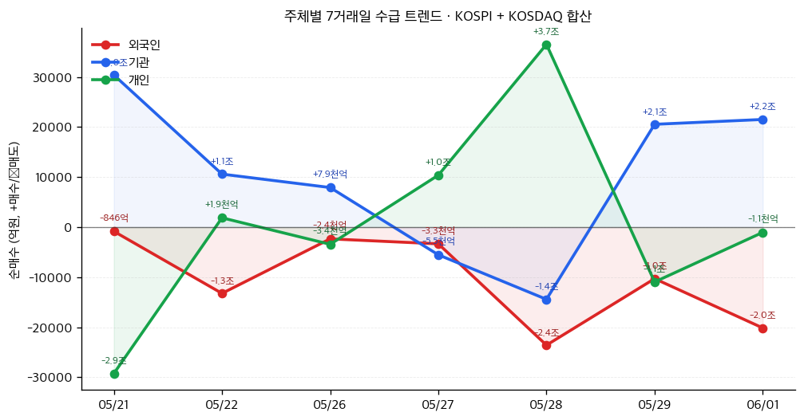
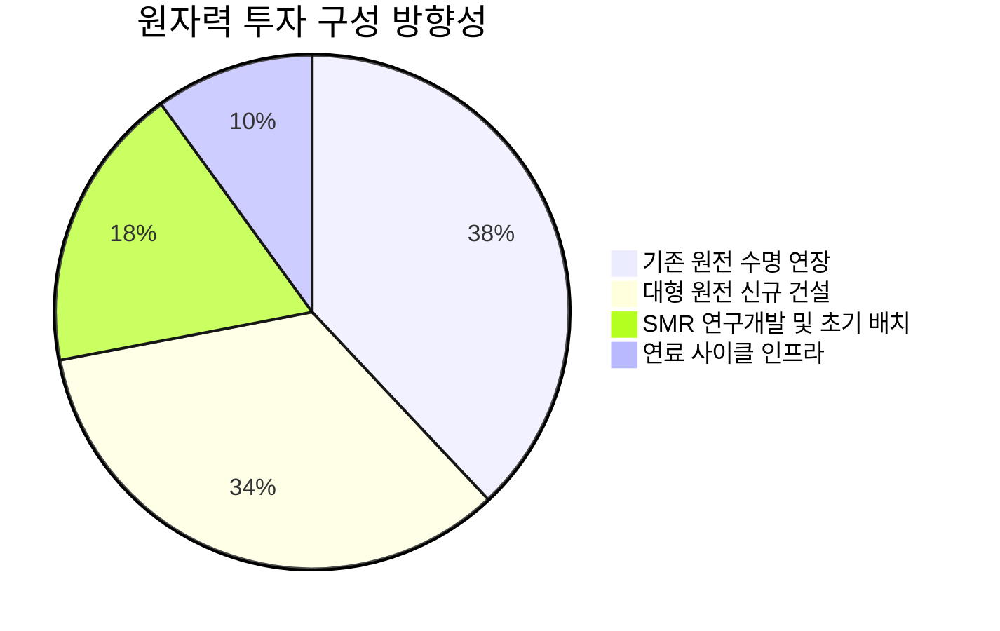

# 📊 모닝 브리핑 — 2026년 6월 2일 (화)

> **🟡 Risk-On with Caution** — 기술주 랠리 위에 채권 발 인플레이션 공포가 동시에 작동 중
> - **매크로**: 미국 10년물 국채 4.5% 돌파, 30년물 5% 상회 — 금리 상승 압력 지속
> - **리스크**: 이란-미국 협상 중단으로 지정학 불확실성 재부각, VIX 수치는 📊 블록 참조
> - **시그널**: ① 엔비디아 신칩 공개 + IBM 급등 → AI 인프라 투자 사이클 가속 ② 고금리 지속 우려로 성장주/채권 디커플링 심화

---

## 시장 스냅샷

### 주요 지수
| 지수 | 종가 | 등락 | 52주 위치 |
|------|------|------|----------|
| S&P 500 | 7,599.96 | +19.90 (+0.3%) | ████████████████████ 100% (5,936–7,600) |
| 나스닥 | 27,086.81 | +114.19 (+0.4%) | ████████████████████ 100% (19,243–27,087) |
| 다우존스 | 51,078.88 | +46.42 (+0.1%) | ████████████████████ 100% (42,172–51,079) |
| 코스피 | 8,476.15 | +290.86 (+3.6%) | ████████████████████ 100% (2,699–8,476) |
| 코스닥 | 1,074.80 | -29.56 (-2.7%) | █████████████▊░░░░░░ 69% (740–1,226) |
| 닛케이 225 | 66,329.50 | +1636.38 (+2.5%) | ████████████████████ 100% (37,447–66,330) |

### 매크로/원자재/크립토
| 항목 | 값 | 변동 | 52주 위치 |
|------|-----|------|----------|
| 미국 10Y | 4.47% | +0.02%p | ██████████████▋░░░░░ 73% (4–5) |
| 미국 2Y | 3.62% | +0.03%p | ███░░░░░░░░░░░░░░░░░ 15% (4–4) |
| DXY | 99.18 | +0.27 (+0.3%) | █████████████▊░░░░░░ 69% (96–101) |
| USD/KRW | 1,511.72 | +16.43 (+1.1%) | ███████████████████▌ 97% (1,348–1,516) |
| USD/JPY | 159.65 | +0.38 (+0.2%) | ███████████████████▍ 97% (142–160) |
| WTI 원유 | $92.26 | +5.6% | ████████████▉░░░░░░░ 64% (55–113) |
| 금 (Gold) | $4,512.10 | -1.1% | ████████████▏░░░░░░░ 61% (3,274–5,318) |
| 은 (Silver) | $75.03 | -0.8% | ██████████░░░░░░░░░░ 50% (35–115) |
| BTC | $71,139 | -3.3% | ██▊░░░░░░░░░░░░░░░░░ 14% (62,702–124,753) |
| VIX | 16.05 | +0.73 (+4.8%) | ██▉░░░░░░░░░░░░░░░░░ 15% (13–31) |
| 10Y-2Y 스프레드 | 0.85%p | -0.01%p | — |

### 수급 동향 (최근 7 거래일, 05/21 ~ 06/01, KOSPI+KOSDAQ 합산)



**7일 누적**: 외국인 -7.4조 · 기관 +7.1조 · 개인 +4,052억

---
⚠️ 시장 스냅샷은 시스템이 자동 삽입합니다.

---

## 시장 센티먼트

<div style="display:flex;border-radius:8px;overflow:hidden;margin:8px 0;font-size:0.85em">
  <div style="background:#4CAF50;width:55%;padding:6px 8px;color:white">🟢 Risk-On 55%</div>
  <div style="background:#FF9800;width:28%;padding:6px 8px;color:white">🟡 중립 28%</div>
  <div style="background:#F44336;width:17%;padding:6px 8px;color:white">🔴 Risk-Off 17%</div>
</div>

**핵심 판독**: 표면은 AI 랠리와 사상 최고치 경신이 주도하는 Risk-On이지만, 그 아래에서 채권 시장은 비명을 지르고 있다. 기술주와 채권이 서로 다른 방향으로 움직이는 "분열된 시장"이 현재 국면의 본질이다. 역사적으로 이 디커플링이 장기 지속되기는 어렵다 — 결국 채권이 주식을 끌어내리거나, 주식 랠리가 금리 상승을 압도하거나, 둘 중 하나가 수렴한다.

**변곡 촉매**:
- 🔴 **다운사이드**: 이란-미국 협상 완전 결렬 → 유가 재급등 → 인플레이션 기대 재상승 → Fed 매파 강도 증가
- 🟢 **업사이드**: 이번 주 발표될 미국 고용/물가 지표가 예상보다 완만 → 금리 급등세 진정 → 성장주 + 채권 동반 안정

---

## 섹터별 센티먼트

| 섹터 | 센티먼트 | 한줄 평가 |
|------|---------|----------|
| 반도체/AI | 🟢 강세 | 엔비디아 신칩(RTX Spark) 공개 + IBM 급등, AI 인프라 투자 사이클 새 구간 진입 |
| 원자력/에너지 | 🟢 강세 | AI 데이터센터 전력 수요 + 지정학 리스크가 에너지 독립성 수요를 동시에 자극 |
| 채권/장기국채 | 🔴 약세 | 10년물 4.5% 돌파, 30년물 5% 상회 — 인플레이션 구조적 지속 경고 속 매도 압력 |
| 빅테크/클라우드 | 🟢 강세 | AI 랠리 수혜 직접 수령, 사상 최고치 경신 행진 지속 — 금리 상승이 잠재적 밸류에이션 역풍 |
| 유가/에너지 원자재 | 🟡 혼조 | 이란 리스크로 상방 압력 + 글로벌 수요 둔화 우려 공존, 방향성 불명확 |
| 리츠(REITs)/부동산 | 🔴 약세 | 장기 금리 상승 직격 — 금리 민감 섹터 중 가장 즉각적인 피해 |
| 방산/항공우주 | 🟢 강세 | 중동 지정학 긴장 재부각 + 우주 경제 인프라 투자 확대 기조 지속 |

---

## 오버나이트 핵심 이벤트

### 1. 엔비디아 신규 칩 공개 + IBM 급등 — AI 랠리 새 국면

- **요약**: 엔비디아가 RTX Spark 신규 칩을 공개했고, IBM은 호실적로 급등하며 기술주 랠리를 이끌었다. 뉴욕 증시는 AI 투자 열풍에 힘입어 사상 최고치를 경신했다.
- **So What**: 단순 주가 상승을 넘어 AI 인프라 지출의 새 사이클이 시작됐다는 시그널이다. 엔비디아 신칩 공개는 데이터센터 CapEx 사이클의 다음 단계 — 더 고성능, 더 전력집약적 칩으로의 전환 — 를 공식화한다. 이는 전력 공급망(전력설비·원자력·냉각시스템)과 메모리(HBM) 수요를 추가로 자극하는 2차 효과로 연결된다.
- **크로스 임팩트**: [[엔비디아]], [[IBM]], [[TSMC]], [[SK하이닉스]] — 반도체/HBM/전력 인프라 섹터 전반

### 2. 이란-미국 협상 중단 — 지정학 리스크 재점화

- **요약**: 이란이 가자지구 공격 중단을 이유로 미국과의 핵 협상을 중단하겠다고 발표했다. 이에 따라 유가와 10년물 국채 금리가 동반 상승했다.
- **So What**: 협상 중단은 단기적으로 유가 상방 압력을 높이고, 이는 다시 인플레이션 기대를 자극한다. 문제는 타이밍이다 — Fed가 이미 인플레이션 구조적 지속 가능성을 경고하는 시점에서 지정학 충격이 겹치면 금리 인하 기대를 더 뒤로 미루는 "이중 역풍"이 된다.
- **크로스 임팩트**: 유가 관련 에너지주 ↑, 항공·해운 비용 ↑, 금리 인하 기대 ↓ — [[원유 ETF]], [[방산주]], 항공/소비재 섹터

### 3. 주요국 중앙은행 — "인플레이션은 구조적" 경고

- **요약**: 주요국 중앙은행 총재들이 중동 전쟁 지속과 AI 투자 확대가 인플레이션 압력을 구조적으로 지속시킬 수 있다고 경고하며 매파적 기조를 유지했다.
- **So What**: 이 발언의 핵심은 "AI가 인플레이션의 새 연료"라는 인식이 중앙은행 내부에서 형성되고 있다는 점이다. 데이터센터 건설 붐 → 전기 수요 폭증 → 에너지 가격 상승 → 생산 비용 전반 압박이라는 경로다. 동시에 AI가 장기적으로 디플레이션 요인이 될 수 있다는 반론도 있어, 중앙은행의 불확실성이 가장 큰 구간에 진입했다.
- **크로스 임팩트**: 장기 국채 수익률 지속 상승 압력, 성장주 밸류에이션 멀티플 압축 리스크 — [[TLT]], [[QQQ]], 금리 민감 섹터

### 4. 국채 금리 급등 — 10년물 4.5%, 30년물 5% 돌파

- **요약**: 미국 10년물 국채 금리가 4.5%를 넘어섰고 30년물도 5%를 상회하며 채권 시장에 극심한 매도 압력이 가해졌다.
- **So What**: 30년물 5% 돌파는 심리적 임계점을 넘은 것이다. 기관투자자의 장기 자산배분 모델에서 "무위험 수익률"이 5%라는 것은 주식의 기대수익률 허들이 그만큼 올라간다는 의미 — 고PER 성장주에 가장 직접적인 밸류에이션 압박이다. 동시에 미국 재정 이자 부담이 가속화되며 재정 지속가능성 논쟁도 재점화될 가능성이 있다.
- **크로스 임팩트**: 리츠, 유틸리티, 고PER 기술주에 역풍 — [[TLT]], [[VNQ]], 장기 성장주 전반

---

## 오늘의 일정

| 시간(한국) | 이벤트 | 중요도 | 관련 종목 |
|-----------|--------|--------|----------|
| 밤 9:45 | 미국 S&P 글로벌 서비스업 PMI (5월 확정) | ⭐⭐⭐ | [[SPY]], [[QQQ]] |
| 밤 10:00 | 미국 ISM 서비스업 지수 (5월) | ⭐⭐⭐⭐ | 전 종목, [[달러 인덱스]] |
| 밤 10:00 | 미국 공장주문 (4월) | ⭐⭐⭐ | [[산업재 ETF]], [[XLI]] |
| 수(6/3) 밤 | 미국 ADP 민간고용 (5월) | ⭐⭐⭐⭐ | 전 종목, [[금리 관련주]] |
| 금(6/5) 밤 9:30 | 미국 비농업고용지수·실업률 (5월) | ⭐⭐⭐⭐⭐ | 전 종목 |

> [!warning] ⭐⭐⭐⭐⭐ 금요일 고용보고서 시나리오 분기
> - **🟢 고용 둔화(예상 하회)**: 금리 인하 기대 재점화 → 채권 반등, 성장주 숨통
> - **🔴 고용 강세(예상 상회)**: "고금리 더 오래" 공포 강화 → 채권 추가 매도, 고PER주 조정 압력
> - **오늘 ISM 서비스업**이 금요일 고용 전망의 선행 지표 역할 — 55 이상이면 강한 고용 시사

---

## 테마 시그널

> [!abstract] 오늘의 테마: **핵에너지 르네상스 — "AI가 원자를 깨운다: 2026년은 '약속'이 '착공'으로 바뀌는 해"**

### 왜 지금인가? — 두 가지 수요가 동시에 충돌하다

2011년 후쿠시마 이후 원자력은 10년 넘게 퇴장의 시대였다. 독일은 마지막 원전을 껐고, 일본은 재가동을 멈췄으며, 미국에서는 건설 허가가 유명무실해졌다. 그런데 2024~2026년 사이, 그 흐름이 반전되기 시작했다.

**지금 두 가지 수요가 동시에 원자력을 향하고 있다:**

| 수요 드라이버 | 내용 | 시급성 |
|------------|------|-------|
| **AI 데이터센터 전력 수요** | ChatGPT 쿼리 1회는 구글 검색의 약 10배 전력 소모. 하이퍼스케일러들의 CapEx 급증이 그리드에 전례없는 부하를 가중 | 🔴 즉각적 |
| **에너지 지정학 독립** | 이란 협상 중단, 중동 불안 재발 — 수입 에너지 의존도를 낮추려는 각국 정부의 유인 강화 | 🟡 중기적 |
| **탈탄소 목표 압박** | RE100, 탄소중립 2050 공약 — 태양광·풍력만으로는 24/7 전력 공급 불가 | 🟡 중기적 |

> [!tip] 핵심 인사이트
> AI가 원자력 르네상스의 예상치 못한 가장 강력한 수요 창출자가 됐다. Microsoft, Google, Amazon이 이미 원전 회사들과 직접 전력 구매 계약(PPA)을 체결하거나 SMR 개발사에 투자했다. 빅테크의 RE100 공약과 전력 안정성 수요가 맞물리면서, 원자력은 처음으로 "민간 자본이 당기는" 에너지원이 되고 있다.

---

### 구조적 분석 — 르네상스의 세 층위

**① 기존 원전 재가동 및 수명 연장** (가장 빠른 공급 경로)
미국에서는 규제 완화와 정부 보조금을 바탕으로 이미 폐쇄됐거나 폐쇄 예정인 원전을 재가동하는 움직임이 나타나고 있다. 신규 건설보다 비용과 시간이 훨씬 적게 드는 "즉시 공급" 경로다. IEA 보고서에 따르면 2026년 핵에너지 투자는 약 800억 달러 수준이 유지될 전망이다.

**② 대형 원전 신규 건설** (한국·중국·중동 주도)
현실적으로 지난 10년간 건설을 시작한 원전의 94%는 중국과 러시아 원자로가 차지했다. 서방은 이 공백을 메우기 위해 한국(APR1400), 프랑스(EPR), 미국(AP1000)으로 다시 눈을 돌리고 있다. 한미글로벌의 미국 매출이 전년 대비 68% 성장하며 원전 분야로 영역을 확장하는 것은 이 흐름의 상징적 사례다.

**③ SMR(소형모듈원자로) — 게임체인저 혹은 과대평가?**
SMR은 원자력 투자 서사의 가장 뜨거운 키워드다. Oklo의 소형 원자로는 15~75 메가와트 출력으로 데이터센터 단일 캠퍼스에 직접 연결할 수 있다는 콘셉트다. OpenAI CEO 샘 알트만이 초기 투자자로 알려져 있으며, Meta·Equinix 등과 파트너십 논의가 진행 중이다. 잠재 고객 백로그는 14기가와트에 달한다고 알려졌다.



> [!warning] SMR의 현실적 리스크
> SMR은 아직 상업 운전에 성공한 서방 기업이 거의 없다. NuScale은 2023년 대표 프로젝트를 취소했다. 현재의 밸류에이션에는 "미래 기술이 예정대로 작동한다"는 전제가 깔려 있다. 핵에너지 르네상스의 성패는 기술 아이디어가 아니라 **예산 내, 일정 내 완공**이라는 지극히 평범한 실행 능력에 달려 있다는 사실을 잊지 말아야 한다.

---

### 투자 공급망 지도 — 원자력 르네상스의 수혜 레이어

<div style="border-left:4px solid #4CAF50;padding-left:12px;margin:8px 0">
원자력 투자는 "원전 기업 주가"가 오르는 단순한 이야기가 아니다. 공급망 전체가 움직인다.
</div>

| 레이어 | 내용 | 대표 플레이어 |
|--------|------|-------------|
| **1단계: 연료** | 우라늄 채굴·농축 수요 급증 | [[카메코(Cameco)]], [[우라늄 ETF]] |
| **2단계: 설계·시공** | 원전 PM, 기자재 제조, 엔지니어링 | 한국 두산에너빌리티, 비에이치아이 |
| **3단계: SMR 개발** | 소형 원자로 기술 상용화 | [[Oklo]], [[NuScale]], 나노 뉴클리어 에너지 |
| **4단계: 전력 인프라** | 원전 전력을 그리드에 연결하는 설비 | 변압기·전력망 관련주 |
| **5단계: 수요측 수혜** | 안정적 전력 확보하는 빅테크 데이터센터 | [[마이크로소프트]], [[알파벳]], [[아마존]] |

---

### 2026년은 왜 특별한가 — "현실화 원년"

2025년이 기대감이 주가를 끌어올린 해였다면, 2026년은 다음이 확인되는 해다:
- **수주 계약의 법적 구속력 발생** — LOI(의향서)에서 실제 EPC 계약으로
- **부지 허가 및 착공** — 실물 삽이 땅에 들어가는 순간
- **우라늄 장기 구매 계약** — 연료 수요가 현물에서 선물 계약으로

이 세 가지 이벤트가 하나씩 확인될 때마다 시장은 해당 레이어의 기업을 재평가한다. 반대로 지연이나 취소가 나오면 기대 프리미엄이 빠르게 소멸한다.

### 모니터링 포인트

<div style="background:#e0e0e0;border-radius:8px;overflow:hidden;margin:4px 0"><div style="background:#4CAF50;width:85%;padding:4px 8px;color:white;font-size:0.9em;white-space:nowrap">빅테크-원전사 직접 PPA 체결 발표 85 — 가장 강력한 수요 확인 시그널</div></div>

<div style="background:#e0e0e0;border-radius:8px;overflow:hidden;margin:4px 0"><div style="background:#FF9800;width:70%;padding:4px 8px;color:white;font-size:0.9em;white-space:nowrap">미국 NRC 허가 타임라인 준수 여부 70 — 규제 리스크의 핵심</div></div>

<div style="background:#e0e0e0;border-radius:8px;overflow:hidden;margin:4px 0"><div style="background:#FF9800;width:65%;padding:4px 8px;color:white;font-size:0.9em;white-space:nowrap">우라늄 현물 가격 추이 65 — 공급망 수요 선행 지표</div></div>

<div style="background:#e0e0e0;border-radius:8px;overflow:hidden;margin:4px 0"><div style="background:#F44336;width:45%;padding:4px 8px;color:white;font-size:0.9em;white-space:nowrap;min-width:60px">SMR 선도 프로젝트 완공 지연 45 — 기대 프리미엄 소멸 트리거</div></div>

---

## 대가의 시선

> "The stock market is a device to transfer money from the impatient to the patient."
> ("주식 시장은 조급한 자에게서 인내하는 자에게로 돈을 이전하는 장치다.")
> — **워런 버핏 (Warren Buffett)**, Berkshire Hathaway 회장 [클래식]

**맥락**: 원자력 르네상스 테마, 그리고 오늘 시장처럼 AI 랠리와 금리 공포가 동시에 작동하는 "분열된 시장"에서 투자자들의 심리 변동폭이 극대화되는 상황을 겨냥한 명언이다.

**투자 함의**: 핵에너지 SMR 관련주는 몇 년 안에 가시적 결과가 나오지 않는 구조다. 기술적으로 맞아도 일정이 지연되면 주가는 큰 폭의 조정을 받는다. 오늘처럼 AI 랠리에 올라탄 원전 관련주가 단기 급등했을 때, 주가 상승을 확신의 근거로 삼는 것이 가장 위험한 함정이다. 장기 수요 구조가 맞더라도 밸류에이션 진입점과 인내심이 수익률을 결정한다.

---

## 투자 레슨

> [!abstract] 오늘의 레슨: **켈리 공식(Kelly Criterion) — "당신은 얼마나 베팅해야 하는가? AI 랠리 시대, 확신이 강할수록 더 많이 살아야 할까?"**

### 핵심 개념: 베팅 크기는 승률만으로 결정되지 않는다

많은 투자자가 간과하는 사실이 있다. 좋은 아이디어를 찾는 것(What to buy)과, 그것에 얼마나 베팅할 것인가(How much to buy)는 완전히 다른 문제다. 켈리 공식(Kelly Criterion)은 1956년 벨 연구소의 수학자 존 켈리(John L. Kelly Jr.)가 장기적 자본 성장을 극대화하는 최적 베팅 비율을 계산하는 공식으로 개발했다.

### 공식의 본질

```
f* = (bp - q) / b

f* = 투자해야 할 자본 비율
b  = 성공 시 수익 배수 (예: 2배 수익이면 b=2)
p  = 이길 확률
q  = 질 확률 (= 1 - p)
```

쉽게 말하면: **"내가 옳을 확률과 옳았을 때 얼마나 버는지"를 모두 반영해 최적 베팅 비율을 계산한다.**

### 숫자로 이해하기

**예시 1 — AI 반도체 투자 판단:**

| 시나리오 | 수치 |
|---------|------|
| 성공 시 예상 수익 (b) | +100% (2배) |
| 성공 확률 (p) | 60% (0.6) |
| 실패 확률 (q) | 40% (0.4) |
| **켈리 최적 비율** | **(0.6×2 - 0.4) / 2 = 0.4 → 자본의 40%** |

만약 당신이 엔비디아에 "90% 확신한다"고 해도, **성공 시 수익이 크지 않다면 켈리 비율은 생각보다 작아진다.** 반대로 승률이 55%여도 성공 시 3배 수익이면 켈리 비율은 꽤 크다.

**예시 2 — 승률이 높아도 베팅을 줄여야 할 때:**

| 시나리오 | 수치 |
|---------|------|
| 성공 시 수익 (b) | +20% |
| 성공 확률 (p) | 70% |
| 실패 확률 (q) | 30% |
| **켈리 최적 비율** | **(0.7×0.2 - 0.3) / 0.2 = -0.5 → 베팅 금지** |

> [!warning] 가장 충격적인 결론
> 승률 70%에 수익률 20%라면, 켈리 공식은 "베팅하지 마라"고 말한다. 이기더라도 수익이 작고, 지면 큰 손해인 비대칭 구조이기 때문이다. 당신이 직관적으로 "이건 이길 것 같은데"라고 느끼는 수많은 투자가 여기에 해당한다.

---

### 실전에서의 함정 — "풀 켈리"의 위험성

수학적으로 켈리 공식은 장기 복리 성장을 극대화하지만, 실제 투자에서 **풀 켈리(Full Kelly)는 극도로 위험하다.**

이유는 두 가지다:
1. **확률 추정 오류**: p와 b를 정확히 아는 투자자는 없다. 확률을 조금만 틀려도 베팅 비율이 크게 달라진다.
2. **심리적 내성 부재**: 켈리 비율대로 베팅하면 자산이 일시적으로 반토막 나는 구간이 반드시 온다. 대부분의 투자자는 이 구간을 버티지 못한다.

이 때문에 전문 투자자들은 **하프 켈리(Half Kelly)** — 공식이 제시한 비율의 절반만 — 을 사용한다.

<div style="display:flex;border-radius:8px;overflow:hidden;margin:8px 0;font-size:0.85em">
  <div style="background:#4CAF50;width:50%;padding:6px 8px;color:white">🟢 하프 켈리 (권장)</div>
  <div style="background:#FF9800;width:30%;padding:6px 8px;color:white">🟡 풀 켈리 (이론적 최대)</div>
  <div style="background:#F44336;width:20%;padding:6px 8px;color:white">🔴 오버 켈리 (파산 리스크)</div>
</div>

---

### 오늘 시장에 적용하기 — AI 랠리의 포지션 사이징

엔비디아, IBM, AI 인프라주가 사상 최고치를 경신하는 오늘, 많은 투자자는 "이건 분명히 맞는 방향이야"라며 포지션을 키우고 싶은 충동을 느낀다. 바로 이 순간이 켈리 공식이 가장 필요한 순간이다.

**현재 AI 반도체 투자를 켈리 렌즈로 보면:**
- p (성공 확률): AI 수요 구조적 성장은 높은 확률로 지속될 것 → 높음
- b (성공 시 수익): 이미 수백 퍼센트 오른 주가에서 추가 수익 배수 → 제한적
- q × loss (실패 시 손실): 금리 상승, 밸류에이션 조정, 기술 실망감 → 상당히 큼

> [!tip] 핵심 인사이트
> 이미 많이 오른 자산은 "확신도"가 높더라도 켈리 비율이 낮을 수 있다. "맞을 것 같다"는 감정과 "얼마나 베팅해야 하는가"는 별개의 계산이다. AI 랠리 최고조에서 포지션을 키우는 것이 왜 수학적으로도 비합리적일 수 있는지, 켈리 공식은 명확하게 답한다.

**에지(Edge) = 확률 × 배수 — 이것을 먼저 계산하라.** 에지가 작으면 베팅도 작아야 한다. 오늘처럼 AI 종목이 연일 사상 최고치를 치고 있을 때, 확신이 높아지면서 포지션도 늘려야 한다는 직관은 켈리 관점에서 가장 위험한 착각이다.

### 오늘 실천 방법

1. 새로운 투자 아이디어가 생기면 **"b(성공 시 수익 배수)와 p(확률)"을 명시적으로 숫자로 적어보라.** 막연한 확신을 숫자로 강제하면 과도한 베팅의 70%는 스스로 억제된다.
2. 현재 포지션이 하프 켈리 수준인지 확인하라 — 단일 종목이 포트폴리오의 20%를 넘는다면, 당신의 확률 추정이 정확한지 다시 물어볼 시점이다.

---

## 오늘 하나만 기억한다면

> [!verdict] 오늘 하나만 기억한다면
> **"AI 랠리에 확신이 클수록, 베팅 크기는 수학적으로 계산하라 — 켈리 공식은 '맞을 것 같다'는 감정과 '얼마나 베팅할까'는 별개의 문제임을 증명한다."**