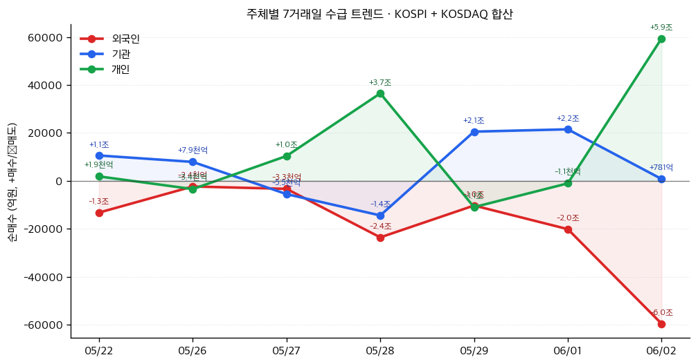

# 📊 모닝 브리핑 — 2026년 6월 4일 (목)

> **🔴 Risk-Off** — 중동 긴장 재고조 + Fed 금리 인상 우려 복합 압박
> - **매크로**: Fed 12월 금리 인상 확률 한 달 새 9.1% → 41.1%로 급등, 달러 강세 지속
> - **리스크**: 중동 무력 공방 재개 → 유가 상승 → 물가 압력 → 증시 하락 연쇄
> - **시그널**: ① 글로벌 중앙은행 통화정책 차별화 심화 ② 안전자산(달러·금) 선호 강화

---

## 시장 스냅샷

### 주요 지수
| 지수 | 종가 | 등락 | 52주 위치 |
|------|------|------|----------|
| S&P 500 | 7,553.68 | -56.10 (-0.7%) | ███████████████████▍ 97% (5,939–7,610) |
| 나스닥 | 26,853.98 | -239.92 (-0.9%) | ███████████████████▍ 97% (19,298–27,094) |
| 다우존스 | 50,687.07 | -620.72 (-1.2%) | ██████████████████▋░ 93% (42,172–51,308) |
| 코스피 | 8,801.49 | +13.11 (+0.1%) | ████████████████████ 100% (2,699–8,801) |
| 코스닥 | 1,026.03 | -24.00 (-2.3%) | ███████████▊░░░░░░░░ 59% (740–1,226) |
| 닛케이 225 | 66,734.24 | -200.09 (-0.3%) | ███████████████████▉ 99% (37,447–66,934) |

### 매크로/원자재/크립토
| 항목 | 값 | 변동 | 52주 위치 |
|------|-----|------|----------|
| 미국 10Y | 4.49% | +0.04%p | ███████████████▏░░░░ 75% (4–5) |
| 미국 2Y | 3.62% | +0.00%p | ███▏░░░░░░░░░░░░░░░░ 15% (4–4) |
| DXY | 99.55 | +0.33 (+0.3%) | ███████████████▌░░░░ 78% (96–101) |
| USD/KRW | 1,532.18 | +20.91 (+1.4%) | ████████████████████ 100% (1,348–1,532) |
| USD/JPY | 160.00 | +0.37 (+0.2%) | ███████████████████▊ 99% (142–160) |
| WTI 원유 | $95.81 | +2.2% | ██████████████░░░░░░ 70% (55–113) |
| 금 (Gold) | $4,456.50 | -0.7% | ███████████▋░░░░░░░░ 58% (3,274–5,318) |
| 은 (Silver) | $72.83 | -3.3% | █████████▌░░░░░░░░░░ 48% (35–115) |
| BTC | $65,125 | -2.4% | ▊░░░░░░░░░░░░░░░░░░░ 4% (62,702–124,753) |
| VIX | 16.06 | +0.29 (+1.8%) | ███░░░░░░░░░░░░░░░░░ 15% (13–31) |
| 10Y-2Y 스프레드 | 0.87%p | +0.03%p | — |

### 수급 동향 (최근 7 거래일, 05/22 ~ 06/02, KOSPI+KOSDAQ 합산)



**7일 누적**: 외국인 -13.3조 · 기관 +4.1조 · 개인 +9.3조

---
## 시장 센티먼트

<div style="display:flex;border-radius:8px;overflow:hidden;margin:8px 0;font-size:0.85em"><div style="background:#F44336;width:65%;padding:6px 8px;color:white">🔴 Risk-Off 65%</div><div style="background:#FF9800;width:25%;padding:6px 8px;color:white">🟡 중립 25%</div><div style="background:#4CAF50;width:10%;padding:6px 8px;color:white;min-width:60px">🟢 On 10%</div></div>

**핵심 판독**: 6/2(월) AI 낙관론으로 미 3대 지수가 사상 최고치를 경신했지만, 6/3(화) 중동 긴장 재고조가 분위기를 단번에 뒤집었다. 유가 상승 → 인플레이션 재점화 우려 → Fed 금리 인상 기대 재형성의 3단 압박이 Risk-Off를 주도하고 있으며, 고용 지표 호조(JOLTS·ADP)가 오히려 "Fed가 더 올릴 수 있다"는 명분을 강화하는 역설적 상황이다.

**변곡 촉매**:
- 🔴 **다운**: 중동 협상 완전 결렬 + 이란 핵 프로그램 재개 → 유가 추가 급등, 글로벌 Risk-Off 심화
- 🟢 **업**: 미·이란 협상 타결 신호 or 주말 OPEC+ 증산 합의 → 유가 급락 시 Fed 인상 기대 되감기

---

## 섹터별 센티먼트

| 섹터 | 센티먼트 | 한줄 평가 |
|------|---------|----------|
| 에너지 (석유·가스) | 🟢 강세 | 중동 긴장 + 지정학 리스크 프리미엄, 단기 유가 상승 수혜 |
| AI·빅테크 | 🟡 혼조 | HPE 호실적으로 AI 낙관론 유효하나, 금리 인상 우려 시 밸류에이션 부담 |
| 반도체 | 🟡 혼조 | AI 수요 모멘텀 견고하나 달러 강세 + 금리 재상승 시 멀티플 압박 |
| 방산·항공우주 | 🟢 강세 | 중동 무력 공방 재개 → 방산 지출 확대 기대, 지정학 리스크 직접 수혜 |
| 금융·은행 | 🟡 관망 | Fed 추가 인상 시 순이자마진 확대 기대 vs 경기 둔화 우려 상충 |
| 채권·리츠 | 🔴 약세 | 금리 인상 기대 재형성 → 장기 금리 상승 압력, 듀레이션 자산 전반 불리 |
| 소비재·경기민감 | 🔴 주의 | 유가 상승 → 소비자 실질 구매력 잠식, 하반기 소비 위축 선행 신호 |

---

## 오버나이트 핵심 이벤트

### 1. AI 낙관론 → 미 3대 지수 사상 최고치 (6/2)
- **요약**: HPE(휴렛팩커드 엔터프라이즈)의 호실적이 AI 인프라 수요를 재확인하며 기술주 중심으로 미 3대 지수가 사상 최고치를 경신했다.
- **So What**: AI 기업들의 실제 실적이 기대치를 뒷받침함으로써 "AI는 버블"이라는 회의론을 잠재웠다. 단, 이 랠리가 하루 만에 중동 이슈로 되돌려진 점은 — 지수가 고점 근처일수록 외부 충격에 취약하다는 사실을 상기시킨다.
- **크로스 임팩트**: [[NVIDIA]], [[AMD]], [[Broadcom]] 등 AI 반도체 및 데이터센터 인프라 섹터 단기 모멘텀 유지

### 2. 미국 고용 지표 쇼크 — JOLTS·ADP 동반 어닝 서프라이즈
- **요약**: 4월 JOLTS 구인 건수와 5월 ADP 민간 고용이 모두 시장 예상치를 상회하며 미국 노동시장의 견조함을 재확인했다.
- **So What**: 고용 호조는 본래 Risk-On 시그널이지만, 현재 국면에서는 "인플레이션 압력 유지 → Fed 금리 인하 지연 or 추가 인상"의 논리로 이어져 오히려 증시에 부담으로 작용했다. 6일(금) 발표될 5월 비농업 고용(NFP) 결과에 따라 이 압박이 더 강화될 수 있다.
- **크로스 임팩트**: 달러 강세 지속, 2년물 국채 금리 상승 → 성장주 밸류에이션 압박

### 3. 중동 긴장 재고조 — Fed 12월 금리 인상 확률 41%로 폭등
- **요약**: 미국·이란 협상 불확실성과 중동 무력 공방 재개로 국제유가가 상승했고, 이에 따른 물가 재상승 우려로 Fed 12월 금리 인상 확률이 한 달 전 9.1%에서 41.1%로 급등했다.
- **So What**: 시장이 올해 안에 Fed 금리 인하를 기대하던 컨센서스가 완전히 뒤집혔다. 금리 인상 확률 41%는 "인상 가능성을 배제할 수 없다"는 수준을 훌쩍 넘어서, 실제 인상이 현실적 시나리오가 됐음을 의미한다. 에너지 가격 상승 → 핵심 인플레이션 전이 → Fed 대응이라는 사이클이 가동될 경우, 시장이 상정하던 "소프트랜딩" 시나리오는 크게 훼손된다.
- **크로스 임팩트**: 전 자산군 재조정 — 주식(특히 성장주/리츠) 🔴, 달러·단기국채 🟢, 금 🟢, 원유 🟢

---

## 오늘의 일정

| 시간(한국) | 이벤트 | 중요도 | 관련 종목/섹터 |
|-----------|--------|--------|--------------|
| 오늘 밤 21:30 | 미국 5월 신규실업수당청구건수 | ⭐⭐⭐ | 전 종목, 달러, 채권 |
| 오늘 밤 23:00 | 미국 4월 공장주문 | ⭐⭐ | [[산업재]], [[소재]] 섹터 |
| 금(5일) 밤 21:30 | **미국 5월 비농업 고용(NFP) 발표** | ⭐⭐⭐⭐⭐ | 전 자산군 |
| 금(5일) 밤 21:30 | 미국 5월 실업률 발표 | ⭐⭐⭐⭐ | 전 자산군 |
| 수(11일) | ECB 통화정책회의 (금리 결정) | ⭐⭐⭐⭐⭐ | 유로화, 유럽 증시 |

> [!warning] ⭐⭐⭐⭐⭐ **내일(6/5) NFP — 이번 주 최대 변수**
> - **🟢 강한 고용 (예상 상회)**: "Fed 추가 인상" 베팅 강화 → 달러↑, 금리↑, 주식↓ (특히 성장주·나스닥)
> - **🔴 약한 고용 (예상 하회)**: Fed 인상 기대 되감기 → 증시 안도 랠리 가능, 달러↓
> - **🟡 부합**: 불확실성 유지 — 중동 변수가 다시 전면에

> [!note] ECB 6/11 — 25bp 인상 컨센서스 주목
> 로이터 설문에서 경제학자 대다수가 ECB의 25bp 인상을 예상. 유로존 5월 인플레이션이 2년 반 만에 최고치를 기록한 점이 배경. 유로화 강세 가능성 및 국내 수출주에 간접 영향.

---

## 테마 시그널

> [!abstract] 오늘의 테마: **중앙은행 정책 차별화(Policy Divergence) — "Fed는 멈추고, ECB·BOJ·한은은 올린다. 이 구도가 자산 가격을 어떻게 뒤트는가"**

### 왜 지금 이 테마인가?

2026년 6월, 글로벌 통화정책 지형도가 이례적인 '역전'을 맞이하고 있다.

2023~2024년만 해도 스크립트는 명확했다: **Fed가 선두에서 긴축 → 나머지 중앙은행이 따라간다.** 그런데 지금은 다르다. Fed는 3.50~3.75%에서 동결하며 인하 타이밍을 재고 있는 반면, ECB는 6월 인상을 눈앞에 뒀고, BOJ는 마이너스 금리 탈출 이후 추가 인상을 준비하며, 한국은행은 8연속 동결에도 "인상" 시그널을 내보내고 있다.

**이것이 단순한 각국 금리 뉴스가 아니라 구조적 테마인 이유**: 중앙은행 정책 차별화(Policy Divergence)는 환율, 자본 흐름, 자산 밸류에이션을 동시에 뒤흔드는 가장 강력한 매크로 변수 중 하나이기 때문이다.

---

### 지금의 구도: 4개 중앙은행 비교

| 중앙은행 | 현재 금리 | 방향 | 핵심 이유 | 시장 기대 |
|---------|---------|------|---------|---------|
| **Fed** | 3.50~3.75% | 🟡 동결→인상 전환 가능 | 유가 상승 인플레 재점화, 고용 견조 | 12월 인상 확률 41% |
| **ECB** | 2.00% | 🔴 인상 확실 | 유로존 CPI 2년반 최고, 에너지·서비스 가격 상승 | 6/11 25bp 인상 컨센서스 |
| **BOJ** | 0.25~0.50% 추정 | 🔴 인상 임박 | 에너지 인플레 지속, 위원 3명 반대표, 우에다 경고 | 6월 인상 확률 ~80% |
| **한국은행** | 2.50% | 🟡 동결→인상 전환 가능 | 중동발 유가·인플레 우려, 환율 변동성 | 위원 2명 25bp 인상 찬성 |

> [!tip] 핵심 인사이트
> **2024년까지는 "Fed 하이킹 → 글로벌 긴축"이었다면, 2026년은 "글로벌 유가 충격 → 각자도생 긴축"이다.** 드라이버가 동조화(synchronization)에서 차별화(divergence)로 바뀐 것이 핵심.

---

### 정책 차별화가 자산 가격에 미치는 5가지 채널

**① 환율 (가장 직접적)**

금리 격차 → 자본 이동 → 환율 변동의 경로는 교과서적이다. 현재 구도에서:
- ECB + BOJ 동시 인상 → 유로화(EUR)·엔화(JPY) 강세 압력
- 달러(USD)는 "Fed 동결" 국면에서 약세로 가야 하지만, 중동 지정학 리스크가 "안전자산 달러 수요"를 지지하며 상쇄
- 결과: 달러는 약세보다 **횡보~완만한 약세**가 가장 유력한 시나리오

**② 엔 캐리 트레이드 청산 리스크**

BOJ가 6월 인상을 단행하면, 수조 달러 규모로 추정되는 엔 캐리 포지션(엔화로 자금 조달 → 고수익 자산 투자)에 강제 청산 압력이 생긴다. 2024년 8월 BOJ 금리 인상 직후 일본 닛케이가 하루 만에 12% 폭락했던 사례를 기억하자. **규모는 작아도 방향성은 같다.**

<div style="border-left:4px solid #F44336;padding-left:12px;margin:8px 0">
⚠️ 엔 캐리 청산의 연쇄: JPY 강세 → 일본 수출주 타격 → 글로벌 위험자산 동반 매도 → 신흥국 자본 이탈 → 코스피·원화 동반 약세 가능
</div>

**③ 채권 시장 — 글로벌 금리 동조 상승**

미국과 유럽·일본이 각기 다른 이유로 금리를 올리거나 올릴 준비를 하면, 글로벌 채권 수익률 전반이 상승한다. 이는 "안전자산"으로서의 채권 매력을 역설적으로 약화시키고, **주식의 상대적 매력(Equity Risk Premium)을 압박**한다.

**④ 성장주 vs 가치주 로테이션**

금리 상승기에는 현금흐름이 미래에 집중된 성장주의 DCF 할인율이 높아져 밸류에이션이 압박받는다. AI·빅테크가 고점에서 흔들리는 6/3의 패턴이 이를 예고한다. 반면 에너지·방산·금융 등 가치주·시클리컬은 상대적 수혜.

**⑤ 신흥국 외환 압력**

달러가 강세를 유지하는 한, 신흥국 통화는 평가절하 압력을 받는다. 특히 외채 비중이 높거나 경상수지 적자인 국가들은 자본 유출과 환율 방어 딜레마에 직면한다. 한국은 경상수지 흑자 구조로 상대적으로 유리하지만, 원화 약세 시 외국인 이탈 속도가 빨라질 수 있다.

---

### 역사적 선례: 2015년 정책 차별화의 교훈

2015년에도 비슷한 구도가 있었다. **Fed는 12월 금리 인상 (9년 만의 첫 인상)**을 준비하던 반면, ECB는 양적완화를 확대하고 있었다. 결과:

- USD 약 25% 강세 (달러 인덱스 DXY 급등)
- 신흥국 통화 폭락 (브라질 헤알, 러시아 루블, 말레이시아 링깃 등)
- 원자재 가격 급락 (달러 강세 + 中 경기 둔화 복합)
- 신흥국 주식시장 대규모 자본 이탈

2026년의 차이점: 당시는 ECB가 완화, 지금은 ECB가 긴축. 즉, 달러 일방적 강세보다는 **유로·엔·달러의 3강 구도 → 신흥국 통화만 압박**받는 구조가 더 유사하다.

---

### 투자 함의 — 정책 차별화 시대의 포지셔닝

```
정책 차별화 심화 시나리오에서의 자산별 방향성:

🟢 수혜                    🔴 압박
━━━━━━━━━━━━━━━━━━━━━━━━━━━━━━━━━━━━━━
달러 현금 / 단기채           장기 국채 / 리츠
원유·에너지주               나스닥 성장주
방산 섹터                   신흥국 고금리채
엔 강세 수혜주 (수입 기업)   엔 캐리 포지션
금 (지정학 프리미엄)         레버리지 기업
```

> [!warning] 모니터링 포인트 3가지
> 1. **BOJ 6월 회의 결과** — 인상 시 엔 캐리 청산 속도와 규모가 핵심
> 2. **미·이란 협상 진전 여부** — 유가 방향이 "Fed 추가 인상 vs 동결"의 분기점
> 3. **ECB 6/11 인상 후 파월 발언** — "우리도 대응해야 하나" 시그널 포착이 중요

---

## 대가의 시선

> [클래식]
> "When interest rates change dramatically, the game changes. The discount rate is the gravitational pull on all asset values."
> *(금리가 극적으로 변할 때, 게임의 룰이 바뀐다. 할인율은 모든 자산 가치에 작용하는 중력이다.)*
> — **워런 버핏 (Warren Buffett)**, 버크셔 해서웨이 주주총회 발언 [클래식]

**맥락**: 버핏은 여러 주주총회와 인터뷰에서 금리가 자산 가격에 미치는 근본적 영향을 "중력"에 비유해왔다. 금리가 낮으면 모든 자산이 떠오르고, 금리가 높으면 중력이 강해져 자산이 내려앉는다는 단순하지만 강력한 원칙이다.

**투자 함의**: 오늘 시장이 정확히 이 원칙을 실시간으로 보여주고 있다. Fed 12월 인상 확률이 9.1%에서 41.1%로 뛰었다는 것은, 시장이 인식하는 "중력의 강도"가 한 달 만에 4배 이상 강해졌다는 의미다. 특히 미래 현금흐름에 의존하는 AI·성장주들은 이 중력 변화에 가장 민감하다. 고용 호조와 중동 유가가 겹쳐 금리 기대가 흔들리는 지금, "금리 방향"을 다시 한번 점검하고 자신의 포트폴리오가 어느 방향의 중력에 노출되어 있는지 확인해야 할 시점이다.

---

## 투자 레슨

> [!abstract] 오늘의 레슨: **평균 회귀(Mean Reversion) vs 체제 전환(Regime Change) — "Fed 금리 인상 확률 41%가 노이즈인가, 구조적 전환인가를 구별하는 법"**

### 왜 이것이 투자자에게 가장 어려운 문제인가?

투자 세계에서 가장 비용이 비싼 실수 두 가지는 정반대 방향에 있다:

- **실수 A**: 진짜 체제 전환(Regime Change)인데 "곧 평균으로 돌아오겠지"라며 무시한다.
- **실수 B**: 단순한 평균 회귀적 노이즈인데 "이번엔 다르다"며 과잉 반응한다.

2008년 금융위기 때 "부동산 가격은 결국 평균으로 회귀한다"며 서브프라임 위기를 무시한 것이 실수 A다. 반대로 2020년 코로나 폭락 때 "세상이 영원히 바뀐다"며 저점에서 전량 매도한 것이 실수 B다. **두 실수 모두 "현재 내가 보는 것이 노이즈인가, 신호인가"를 잘못 판단한 데서 비롯된다.**

---

### 평균 회귀의 기초: 무엇이 회귀하고 무엇이 회귀하지 않는가

**평균 회귀(Mean Reversion)**란 극단적으로 높거나 낮은 값이 시간이 지나면 역사적 평균 수준으로 돌아오는 경향을 말한다. 주가수익비율(PER), 이자율, 기업 이익률, 국가 간 성장률 격차 등 많은 금융 변수가 평균 회귀적 특성을 보인다.

그러나 **모든 것이 평균으로 회귀하지는 않는다.** 기술 혁신으로 인한 비용 구조 변화, 인구 구조 전환, 에너지 전환 등 구조적 변화는 "새로운 평균"을 만들어낸다. 과거 평균으로 회귀하지 않는 것이다.

| 구분 | 평균 회귀 가능성 높음 | 체제 전환 가능성 높음 |
|------|-------------------|--------------------|
| **특성** | 단기 충격, 외생적 요인 | 구조적 변화, 내생적 전환 |
| **시장 반응** | 과잉 반응 후 되돌림 | 초기 과소 반응, 점진적 조정 |
| **사례** | VIX 스파이크, 단기 유가 급등 | 장기금리 구조적 상승, AI 생산성 혁명 |
| **투자 전략** | 역발상 (contrarian) | 추세 추종 (trend following) |

---

### 오늘의 사례: Fed 금리 인상 확률 급등 — 노이즈인가 신호인가?

한 달 만에 9.1% → 41.1%로 뛴 Fed 12월 인상 확률. 이것을 어떻게 봐야 하는가? 아래 프레임워크를 적용해보자.

**📋 체크리스트: 평균 회귀 vs 체제 전환**

<div style="border-left:4px solid #FF9800;padding-left:12px;margin:8px 0">

**① 충격의 원인이 일시적인가, 구조적인가?**
- 중동 긴장 → 지정학은 단기적으로 해소될 수 있음 → 🟡 혼재
- 고용 강세(JOLTS·ADP) → 경제 구조에서 기인, 쉽게 꺾이지 않음 → 🔴 구조적

**② 인플레이션의 성격이 공급 충격인가, 수요 과잉인가?**
- 에너지 가격 상승 = 공급 충격 → Fed가 금리로 통제하기 어려움 → 🟡 딜레마
- 서비스 인플레이션 + 임금 상승 = 수요 측 요인 → Fed가 실제로 올릴 근거 → 🔴 인상 압력

**③ 선행 지표들이 같은 방향을 가리키는가?**
- ECB·BOJ·한은 모두 인상 방향 → 글로벌 금리 상승이 동조화되는 구조 → 🔴 체제 전환 신호

**④ 시장 가격에 이미 반영됐는가?**
- 한 달 전 9.1% → 아직 충분히 반영되지 않은 상태에서 갑자기 41%로 점프 → 🔴 추가 조정 여지

</div>

**결론**: 4가지 체크포인트 중 3개가 "구조적 전환" 방향을 가리킨다. 단순한 노이즈가 아닐 가능성이 높다.

---

### 역사적 사례: 1994년 Fed의 기습 인상

1993년 말, 시장 컨센서스는 "금리는 낮은 상태를 유지한다"였다. 그린스펀 의장이 이끄는 Fed는 경기가 탄탄하고 인플레이션 우려가 없다고 판단됐다. 그러나 1994년 2월, Fed는 기습적으로 금리를 올리기 시작해 1년 만에 300bp를 인상했다.

결과:
- 미국 10년물 국채 금리: 5.8% → 8.0% (230bp 상승)
- S&P 500: 연간 약 -1.5% (당시로선 이례적인 하락)
- 신흥국 채권 대학살 (멕시코 테킬라 위기 촉발)
- 오렌지 카운티 파산 (금리 상승에 베팅 실패한 지방정부)

당시 "금리는 평균으로 회귀한다"고 믿었던 투자자들이 당한 것이 바로 체제 전환을 노이즈로 착각한 실수다.

> [!warning] 오늘과의 유사점
> 1994년처럼 "완화적 환경의 관성"이 시장에 깊이 배어있는 상황에서, 복합적 인플레이션 압력(에너지+고용)이 갑작스럽게 금리 기대를 전환시키는 구조가 닮았다. 당시도 "설마 이 정도로 올리겠어"라는 낙관이 지배적이었다.

---

### 실전 적용: 체제 전환 확인 전까지의 포지션 관리

평균 회귀를 기대하다가 체제 전환을 맞이하는 최악의 시나리오를 피하려면:

```
Phase 1 (지금): 불확실성 국면
→ 듀레이션(duration) 축소 — 장기채 비중 줄이기
→ 현금 비중 일정 수준 유지
→ 섹터 로테이션: 성장주 비중 일부 → 에너지·방산·금융으로

Phase 2 (신호 확인 후): 체제 전환 확증 국면
→ NFP(6/5), CPI 결과를 보고 방향 확정
→ Fed가 실제로 인상 언급 시 — 본격적인 듀레이션 단축

Phase 3 (과잉 반응 확인 시): 역발상 기회
→ 금리 인상 공포가 극대화되어 우량 성장주가 과도하게 하락 시
→ 평균 회귀 관점에서 분할 매수 검토
```

**오늘 실천 방법**: 내일(6/5) NFP 발표 전, 본인 포트폴리오의 "금리 민감도"를 점검하라. 보유 종목 중 높은 밸류에이션에 미래 성장이 상당 부분 반영된 종목들의 비중이 과도하다면, 이것이 노이즈 vs 체제 전환 판단을 내리기 전에 일부 헤지하거나 비중을 조정하는 것이 현명하다. "확인 후 행동"이 아닌 **"불확실성 자체를 리스크로 인식하고 사전 대비"**하는 것이 평균 회귀와 체제 전환의 갈림길에서 취해야 할 자세다.

---

## 오늘 하나만 기억한다면

> [!verdict] 오늘 하나만 기억한다면
> **"Fed 금리 인상 확률이 한 달 만에 4배 뛰었다. 이것이 노이즈인지 체제 전환인지는 내일 NFP가 힌트를 준다 — 판단 전까지는 금리 민감도를 낮춰라."**