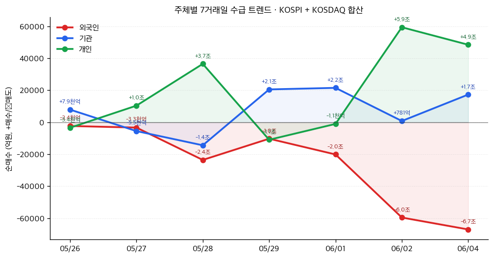

# 📊 모닝 브리핑 — 2026년 6월 5일 (금)

> **🔴 Risk-Off** — 기술주 주도 차익실현 + 중동 지정학 리스크 복합 작용
> - **매크로**: 10년물 국채금리 상승 압력 지속 / WTI 유가 상승 / 달러 강세
> - **리스크**: S&P 500 9거래일 연속 상승 종료 + VIX 반등 / 브로드컴 급락으로 나스닥 선물 약세
> - **시그널**: AI 차익실현 + 비기술 순환매 / 미-이란 긴장으로 에너지 섹터 상대적 강세

---

## 시장 스냅샷

### 주요 지수
| 지수 | 종가 | 등락 | 52주 위치 |
|------|------|------|----------|
| S&P 500 | 7,584.31 | +30.63 (+0.4%) | ███████████████████▊ 98% (5,939–7,610) |
| 나스닥 | 26,830.96 | -23.02 (-0.1%) | ███████████████████▍ 97% (19,298–27,094) |
| 다우존스 | 51,561.93 | +874.86 (+1.7%) | ████████████████████ 100% (42,172–51,562) |
| 코스피 | 8,801.49 | +13.11 (+0.1%) | ████████████████████ 100% (2,771–8,801) |
| 코스닥 | 1,026.03 | -24.00 (-2.3%) | ███████████▋░░░░░░░░ 58% (750–1,226) |
| 닛케이 225 | 68,402.13 | +1667.89 (+2.5%) | ████████████████████ 100% (37,554–68,402) |

### 매크로/원자재/크립토
| 항목 | 값 | 변동 | 52주 위치 |
|------|-----|------|----------|
| 미국 10Y | 4.48% | -0.01%p | ██████████████▋░░░░░ 73% (4–5) |
| 미국 2Y | 3.62% | -0.00%p | ███░░░░░░░░░░░░░░░░░ 15% (4–4) |
| DXY | 99.43 | -0.10 (-0.1%) | ███████████████░░░░░ 75% (96–101) |
| USD/KRW | 1,532.60 | +16.00 (+1.1%) | ████████████████████ 100% (1,348–1,533) |
| USD/JPY | 159.99 | +0.02 (+0.0%) | ███████████████████▊ 99% (143–160) |
| WTI 원유 | $92.75 | -3.4% | █████████████░░░░░░░ 65% (55–113) |
| 금 (Gold) | $4,506.10 | +1.6% | ████████████░░░░░░░░ 60% (3,274–5,318) |
| 은 (Silver) | $74.23 | +1.0% | █████████▉░░░░░░░░░░ 49% (35–115) |
| BTC | $63,235 | -1.2% | ▏░░░░░░░░░░░░░░░░░░░ 1% (62,702–124,753) |
| VIX | 15.40 | -0.66 (-4.1%) | ██▎░░░░░░░░░░░░░░░░░ 11% (13–31) |
| 10Y-2Y 스프레드 | 0.86%p | -0.01%p | — |

### 수급 동향 (최근 7 거래일, 05/26 ~ 06/04, KOSPI+KOSDAQ 합산)



**7일 누적**: 외국인 -18.6조 · 기관 +4.8조 · 개인 +13.9조

---
## 시장 센티먼트

<div style="display:flex;border-radius:8px;overflow:hidden;margin:8px 0;font-size:0.85em">
  <div style="background:#F44336;width:65%;padding:6px 8px;color:white">🔴 Risk-Off 65%</div>
  <div style="background:#FF9800;width:25%;padding:6px 8px;color:white">🟡 중립 25%</div>
  <div style="background:#4CAF50;width:10%;padding:6px 8px;color:white;min-width:60px">🟢 Risk-On 10%</div>
</div>

**핵심 판독**: S&P 500의 9연속 상승이 마침내 멈췄습니다. 브로드컴 실적 실망이 AI/반도체 고평가 우려를 촉발하며 기술주 차익실현의 빌미가 됐고, 여기에 미-이란 긴장 고조가 유가를 끌어올리며 인플레이션 재점화 우려까지 겹쳤습니다. 다만 완전한 패닉이라기보다는 과열된 기술주에서 에너지·방산 등 실물 자산으로의 순환매 성격이 강합니다.

**변곡 촉매**:
- 🔴 **다운**: 미-이란 군사 충돌 격화 → 유가 급등 → 인플레이션 우려 재부상 → Fed 금리 인하 기대 소멸
- 🟢 **업**: 오늘 실업수당 청구건수 예상치 하회(노동시장 연착륙 시그널) + 연은 총재의 비둘기파 발언

---

## 섹터별 센티먼트

| 섹터 | 센티먼트 | 한줄 평가 |
|------|---------|----------|
| AI·반도체 | 🔴 단기 약세 | 브로드컴 실적 미스로 고평가 재점검 국면, HBM 중심 차별화는 유효 |
| 에너지 | 🟢 강세 | 미-이란 긴장 + 유가 상승으로 단기 수혜, 지정학 리스크 프리미엄 내재 |
| 방산·우주 | 🟢 강세 | 하원 이란 군사권한 제한 결의 → 오히려 미 방산 예산 논의 격화 기대 |
| 금융 | 🔴 약세 | 신용카드 연체율 15년 최고 + 다이먼 금리 경고 → 크레딧 리스크 부각 |
| 부동산·PF | 🔴 주의 | 한은 하반기 금리 인상 가능성 + 2금융권 PF 리스크 동시 압박 |
| 소비재·유통 | 🟡 혼조 | 연체율 상승으로 소비 여력 둔화 우려, 미중 비민감 품목 관세 완화 기대 일부 상쇄 |
| 공급망·물류 | 🟡 관망 | USTR 비민감 품목 관세 완화 논의 착수 — 실현 시 글로벌 공급망 재편 속도 조절 |

---

## 오버나이트 핵심 이벤트

### 1. S&P 500, 9연속 상승 종료 — 브로드컴 실적 충격이 방아쇠

- **요약**: 6월 3일 뉴욕 증시는 미-이란 지정학적 긴장과 유가 상승 부담으로 하락 마감했으며, 6월 4일 브로드컴의 AI 칩 실적이 기대치를 밑돌면서 나스닥 선물 급락을 주도했습니다.
- **So What**: AI 랠리는 "기대가 현실보다 빠르게 달린 구간"에 진입했을 가능성이 있습니다. 브로드컴이 AI 인프라 수혜 최전선에 있음에도 시장 기대치를 충족하지 못했다는 사실은, 이미 주가에 낙관적 시나리오가 과도하게 반영됐다는 신호일 수 있습니다. 단기적으로 AI 섹터 전반에 '실적 검증 모드'가 작동하며 변동성이 높아질 수 있습니다.
- **크로스 임팩트**: [[반도체]] [[AI 인프라]] [[나스닥]] — 실적 프리미엄 재산정, [[엔비디아]] [[SK하이닉스]] 등 동반 약세 압력

### 2. 미 하원, 트럼프 이란 군사권한 제한 결의 통과

- **요약**: 미국 하원은 트럼프 대통령의 이란 군사 작전 지속 권한을 제한하는 결의안을 통과시켰습니다.
- **So What**: 이란과의 전면 군사 충돌 가능성을 의회가 제동을 건 것이지만, 역설적으로 중동 긴장이 '관리되지 않는 수준'에 근접했음을 시장에 상기시켰습니다. 단기적으로는 유가 변동성이 확대되고, 지정학 리스크 프리미엄이 에너지·방산에 추가로 붙을 수 있습니다.
- **크로스 임팩트**: [[WTI 원유]] [[에너지 섹터]] [[방산]] — 유가 상단 압력 지속, 항공·화학 등 에너지 비용 민감 섹터 부담

### 3. 제이미 다이먼, "금리 현재보다 훨씬 더 오를 수 있다" 경고

- **요약**: JP모건 회장 제이미 다이먼은 채권 금리 상승과 신용 스프레드 확대 가능성을 경고하며, 현재 금리 수준이 최종 종착점이 아닐 수 있다고 발언했습니다.
- **So What**: 다이먼의 발언은 단순한 경고가 아닙니다. 그가 이끄는 JP모건은 미국 신용카드 연체율이 15년 만에 최고치를 기록하는 것을 현장에서 직접 보고 있는 기관입니다. 고금리 장기화 + 소비자 신용 악화가 동시에 진행된다면, 내수 소비와 크레딧 시장 전반에 이중 압박이 될 수 있습니다.
- **크로스 임팩트**: [[미국 국채]] [[금융주]] [[부동산]] — 장기금리 상승 압력 재확인, 성장주 할인율 부담 재부상

---

## 오늘의 일정

| 시간(한국) | 이벤트 | 중요도 | 관련 종목 |
|-----------|--------|--------|----------|
| 밤 9:30 | 미국 주간 신규 실업수당 청구건수 발표 | ⭐⭐⭐⭐ | [[전 종목]] |
| 밤 9:30 | 미국 주간 연속 실업수당 청구건수 발표 | ⭐⭐⭐ | [[전 종목]] |
| 금일 중 | 리치몬드 연은 총재 연설 | ⭐⭐⭐ | [[미국 국채]] [[달러]] |
| 금일 중 | 샌프란시스코 연은 총재 연설 | ⭐⭐⭐ | [[미국 국채]] [[달러]] |

> [!warning] ⭐⭐⭐⭐ 핵심 이벤트 — 실업수당 청구건수 시나리오 분기
> - **예상치 하회** (신규 청구 감소): 노동시장 견고 → "연착륙" 내러티브 복원 → 위험자산 반등 유인
> - **예상치 부합/상회** (신규 청구 증가): 경기 둔화 시그널 → 금리 인하 기대 재부상하나, 동시에 성장 우려 → 혼조 반응 예상
> - 다이먼 경고와 연은 총재 발언 방향이 **같은 방향이면** 채권/달러 변동성 증폭 주의

---

## 테마 시그널

> [!abstract] 오늘의 테마: **"전략과 비전략의 분리(Bifurcation) — 미중 관리무역 시대, 투자자가 새로 읽어야 할 공급망 지도"**

### 왜 지금인가?

2026년 6월 현재, 미중 관계는 단순한 '무역 전쟁'도, 완전한 '디커플링'도 아닌 **제3의 구도**로 진입했습니다. USTR이 비민감 품목에 대한 관세 완화 논의를 공식화하고, 동시에 AI 반도체 수출 통제를 해외 자회사까지 확장하는 이 모순적 행보 — 이것은 모순이 아닙니다. **'전략적 분리(Strategic Decoupling)'와 '비전략적 관리무역(Managed Trade)'의 공존**이라는 새로운 패러다임이 구조화되는 과정입니다.

### 구조 분석: 두 개의 평행 트랙

```
┌─────────────────────────────────────────────────┐
│         미중 경제 관계의 이중 구조 (2026)         │
├────────────────────┬────────────────────────────┤
│  전략 트랙 (분리)   │  비전략 트랙 (관리무역)     │
├────────────────────┼────────────────────────────┤
│ AI 반도체          │ 일반 소비재                  │
│ HBM 고성능 메모리  │ 가전제품                     │
│ 첨단 패키징 장비   │ 섬유·의류                    │
│ 이중용도 소프트웨어│ 식품·농산물                  │
│ 핵심 광물 (일부)   │ 화학품 (비전략)              │
├────────────────────┼────────────────────────────┤
│ 방향: 강화·확장    │ 방향: 완화·조정 (~$300억)   │
│ 규제: 글로벌 확대  │ 규제: 완화 논의 착수          │
└────────────────────┴────────────────────────────┘
```

**핵심 메커니즘**: 미국은 중국과의 경제적 완전 분리가 불가능하다는 현실을 인정하되, '어디서 싸울 것인가'를 선택하고 있습니다. 반도체·AI·방산 관련 기술은 철저히 차단하면서, 비전략 품목에서는 오히려 교역을 확대해 양국 경제의 충격을 완화합니다. 이것이 트럼프 행정부가 추진하는 '관리무역(Managed Trade)' 개념입니다.

### 투자자가 놓치는 것: 중간 지대의 회색 리스크

> [!warning] 가장 위험한 곳은 '전략'과 '비전략'의 경계에 있는 기업들입니다.

미국의 수출 통제는 이제 **'본사 국적 기준 글로벌 규제'**를 적용합니다. 즉, 한국·대만·동남아에 있는 공장이라도 중국계 지배 구조에 포함되거나, AI 가속기·고성능 메모리를 취급한다면 허가 리스크가 새로 생깁니다.

**한국 반도체의 딜레마**:

| 구분 | 현황 | 리스크 |
|------|------|--------|
| 한국 기업 중국 공장 포괄 허가 | 2023년 부여, 조건부 갱신 | 🔴 갱신 조건 강화 가능성 |
| HBM 수출 | 현재 일부 허용 | 🟡 AI 군사 전용 우려 시 차단 |
| 패키징·테스트 공정 | 글로벌 분산 운영 | 🔴 중국계 지분 있으면 새 허가 필요 |
| 비전략 메모리 (레거시) | 규제 없음 | 🟢 단기 수혜 가능 |

2025년 엔비디아 H20 수출 차단이 선례를 남겼습니다. 한국 기업이 부여받은 포괄적 수출 허가는 정치적 변수에 따라 언제든 조건이 바뀔 수 있습니다.

### 수혜자 지도: 공급망 재편의 새로운 수익처

공급망 지역화가 가속화되면서 지리적으로 수혜를 받는 구도가 뚜렷해지고 있습니다:

<div style="border-left:4px solid #4CAF50;padding-left:12px;margin:8px 0">

**아세안(베트남·말레이시아·태국)**: 미국의 '차이나 플러스 원' 전략의 최대 수혜지. HSBC는 베트남을 아세안 구조조정 물결의 핵심 돌파구로 지목. 전자·섬유·반도체 패키징 공장이 빠르게 이전 중.

**일본**: 반도체 소재·장비 분야 전략적 재국산화. 미일 반도체 파트너십으로 일본 내 파운드리 투자 급증.

**인도**: 방위·전자 제조 허브화 추진. 애플 공급망 이전이 상징적 사례.

</div>

<div style="border-left:4px solid #F44336;padding-left:12px;margin:8px 0">

**중국 내 외국 기업**: 전략 품목 생산 공장은 이중 압박(미국 규제 + 중국 보복 리스크). 탈출 속도가 투자 판단의 핵심 변수.

</div>

### 투자 함의: 지금 어디를 봐야 하는가?

> [!tip] 핵심 인사이트
> "전략/비전략 분리"는 단순한 정치 이슈가 아닙니다. 기업 밸류에이션의 지정학적 할인율이 새로 생겨나는 과정입니다. 같은 반도체 기업이라도 중국 매출 비중, 허가 조건 민감도, 대체 공급망 구축 여부에 따라 멀티플이 달라지는 시대가 됩니다.

**모니터링 포인트** (이 뉴스가 나오면 즉시 재검토):

1. **USTR 비민감 품목 공청회 결과** — 어떤 품목이 완화 리스트에 올라가는지가 글로벌 소비재 기업 실적에 직접 영향
2. **한국 기업 포괄 수출 허가 갱신 조건 변경** — SK하이닉스·삼성전자 중국 공장 운영의 핵심 변수
3. **중국 상무부 보복 조치 범위** — 희토류·배터리 소재 공급 제한 여부
4. **베트남·말레이시아 반도체 패키징 투자 규모** — 글로벌 공급망 재편 속도의 바로미터

---

## 대가의 시선

[최근 발언]

> *"금리가 현재보다 훨씬 더 오를 수 있으며, 채권 금리 상승과 신용 스프레드 확대 가능성에 대비해야 한다."*
> — **제이미 다이먼 (Jamie Dimon)**, JP모건 체이스 회장 겸 CEO (최근 발언, Gemini 종합 데이터)

**맥락**: 미국 신용카드 연체율이 15년 만에 최고치를 기록하고 있는 시점에서 나온 발언으로, 소비자 신용 건전성과 거시 금리 경로에 대한 진단을 동시에 담고 있습니다. 월가 최대 은행의 수장이 금리 인하 기대에 찬물을 끼얹은 것입니다.

**투자 함의**: 다이먼의 경고는 두 가지 차원에서 읽어야 합니다. 첫째, **크레딧 사이클의 후반부**: 연체율 상승은 저금리 시대 과잉 차입의 청구서가 도착하기 시작했다는 신호입니다. 둘째, **금리 민감도 재조정**: 시장이 이미 금리 인하를 어느 정도 가격에 반영해뒀다면, 다이먼의 발언은 그 기대를 압박하는 카운터 내러티브입니다. 성장주·부동산·크레딧에 노출된 포지션에서 금리 시나리오별 스트레스를 다시 점검할 필요가 있습니다.

---

## 투자 레슨

> [!abstract] 오늘의 레슨: **생존자 편향(Survivorship Bias) — "브로드컴 쇼크가 드러낸 것: 우리는 왜 AI 승자만 기억하고, 실패한 기대치는 잊는가"**

### 왜 이 편향이 치명적인가

생존자 편향은 단순히 "성공한 사람만 본다"는 이야기가 아닙니다. 투자에서는 훨씬 더 교묘한 방식으로 작동합니다.

**본질적 정의**: 우리의 판단이 '살아남은 것'에만 집중하고, 사라지거나 실패한 것들은 데이터에서 빠져나갔기 때문에 세계를 체계적으로 왜곡해서 인식하는 현상입니다.

### 역사적 사례: 2차 세계대전 폭격기의 교훈

2차 세계대전 중 미군은 전투에서 귀환한 폭격기의 손상 부위를 분석해 장갑을 강화하려 했습니다. 분석 결과, 날개와 동체에 총알 구멍이 집중되어 있었습니다. 당연히 그 부분에 장갑을 추가하려 했습니다.

통계학자 에이브러햄 왈드(Abraham Wald)는 정반대 결론을 내렸습니다:

> *"총알이 집중된 곳이 아니라, 총알이 없는 곳에 장갑을 추가해야 합니다. 엔진에 맞은 비행기들은 돌아오지 못했기 때문에 우리 샘플에 없습니다."*

즉, **귀환하지 못한 비행기들의 데이터가 더 중요했습니다**. 우리 눈에 보이는 것은 이미 살아남은 것들뿐이었습니다.

### AI 투자에서 생존자 편향이 작동하는 방식

브로드컴 실적 충격을 오늘의 사례로 분석해보면 이 편향이 얼마나 정교하게 작동하는지 보입니다:

| 우리가 기억하는 것 (생존자) | 우리가 잊는 것 (비생존자) |
|--------------------------|-------------------------|
| 엔비디아 10배 상승 | AI 스타트업 수백 개의 조용한 폐업 |
| 클라우드 AI 매출 급증 | AI 도입 후 ROI 측정 실패 기업들 |
| 브로드컴의 AI 칩 수주 뉴스 | 기대치 대비 미달한 실제 수익화 속도 |
| AI 고객사의 투자 발표 | 실제 구현되지 않은 AI 프로젝트들 |

**브로드컴 케이스의 역설**: 시장은 AI 인프라 수혜 기업 중 가장 명확한 수혜자인 브로드컴을 고평가해왔습니다. 왜? 다른 AI 인프라 기업들이 수혜를 보는 것이 '보였기' 때문입니다. 그러나 실제로 AI 투자 효율화 논쟁이 현실화되면서, 기대치 대비 실제 실적이 드러나자 주가가 급락했습니다.

### 생존자 편향의 투자 적용 프레임워크

> [!tip] 생존자 편향을 깨는 3가지 질문

**질문 1: "지금 내가 보는 데이터에서 누가 빠져 있는가?"**
- AI 종목 상승률 분석 시 → 상장폐지·급락한 AI 테마 종목들은 지수에서 제외됨
- 성공한 VC 포트폴리오 사례 → 실패한 90%의 투자는 공개되지 않음

**질문 2: "이 섹터의 '비생존자'는 왜 살아남지 못했는가?"**
- 오늘 브로드컴 쇼크의 진짜 의미: AI 수혜가 '모든 기업에 균등하게' 분배되지 않는다는 현실 확인
- 칩 설계-제조-패키징-소프트웨어 중 어떤 레이어에서 실제 수익이 남는가를 새로 검증해야 함

**질문 3: "나의 확신은 생존자만 본 결과인가, 전체 분포를 본 결과인가?"**

```
[생존자 편향에 걸린 판단]          [편향을 보정한 판단]
"AI 칩 수요는 계속 폭발적이다"    "AI 칩 수요 중 실제 수익으로     
→ 근거: 상위 5개 기업 실적        연결되는 비율은 얼마인가?"
→ 빠진 것: 중소 AI기업 투자 실패  →근거: 전체 AI 투자 대비 실현 ROI"
```

### 투자 역사에서의 패턴 반복

생존자 편향이 버블을 만드는 공식은 일정합니다:

<div style="border-left:4px solid #FF9800;padding-left:12px;margin:8px 0">

**1999년 닷컴 버블**: 아마존·구글·이베이가 살아남아 보임 → 인터넷 기업 전체를 같은 눈으로 봄 → 사라진 수천 개 인터넷 기업은 역사책에 없음

**2021년 SPAC 버블**: 성공한 SPAC 상장 사례들이 뉴스를 채움 → 90% 이상이 상장가 하회 후 청산되는 현실은 가려짐

**2023~2025년 AI 버블 가능성**: 엔비디아·마이크로소프트의 AI 수혜가 전체 AI 투자의 '성과'처럼 인식됨 → 실제 AI 도입 기업의 ROI 미달, 할루시네이션으로 인한 비용, 인력 대체 실패 사례는 조용히 묻힘

</div>

### 오늘 실천 방법

오늘 AI/반도체 섹터 뉴스를 읽을 때 이 질문을 추가하세요:

**"이 기업의 AI 수혜 스토리에서, 아직 공개되지 않은 실패 데이터는 무엇인가?"**

구체적으로: 브로드컴의 AI 수주 파이프라인에서 실제 매출로 전환된 비율, 고객사가 공개한 AI 투자 대비 실현 효율, 경쟁사 대비 실질 마켓셰어 변화를 '선언'이 아닌 '실적'으로 확인하세요. 오늘 같은 실적 충격은 생존자만 보던 시장이 비생존자(미달 실적)를 처음 목격하는 순간입니다.

---

## 오늘 하나만 기억한다면

> [!verdict] 오늘 하나만 기억한다면
> **"AI 랠리가 9일 만에 멈춘 이유는 브로드컴 실적 한 줄 — 우리가 봐온 것은 승자만의 스토리였다. 오늘은 전체 분포를 보는 날이다."**