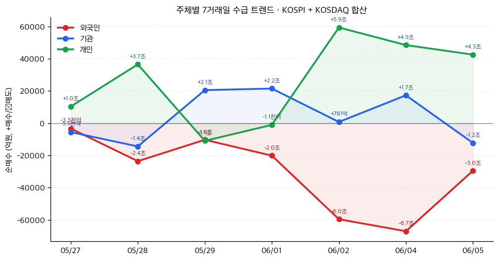

# 📊 모닝 브리핑 — 2026년 6월 7일 (일)

> **🔴 Risk-Off** — 고용 서프라이즈 + AI 반도체 급락, 더블 악재
> - **매크로**: 원/달러 1,548.9원 (금융위기 이후 최고치), 중동 지정학 완화로 유가 일부 하락
> - **리스크**: 나스닥 4.18% 급락, 필라델피아 반도체 지수 10%+ 폭락, 외국인 매도 지속
> - **시그널**: ① 강고용 → 연준 금리 인하 기대 후퇴 ② AI 수익화 격차 우려 본격화

---

## 시장 스냅샷

### 주요 지수
| 지수 | 종가 | 등락 | 52주 위치 |
|------|------|------|----------|
| S&P 500 | 7,383.74 | -200.57 (-2.6%) | █████████████████▎░░ 86% (5,968–7,610) |
| 나스닥 | 25,709.43 | -1121.53 (-4.2%) | ████████████████▍░░░ 82% (19,407–27,094) |
| 다우존스 | 50,866.78 | -695.15 (-1.3%) | ██████████████████▌░ 93% (42,172–51,562) |
| 코스피 | 8,160.59 | -478.82 (-5.5%) | █████████████████▉░░ 89% (2,812–8,801) |
| 코스닥 | 1,002.44 | -47.29 (-4.5%) | ██████████▌░░░░░░░░░ 52% (756–1,226) |
| 닛케이 225 | 66,588.12 | -882.57 (-1.3%) | ██████████████████▉░ 94% (37,554–68,402) |

### 매크로/원자재/크립토
| 항목 | 값 | 변동 | 52주 위치 |
|------|-----|------|----------|
| 미국 10Y | 4.54% | +0.06%p | ████████████████▍░░░ 82% (4–5) |
| 미국 2Y | 3.62% | +0.01%p | ███▏░░░░░░░░░░░░░░░░ 16% (4–4) |
| DXY | 100.07 | +0.66 (+0.7%) | ██████████████████░░ 90% (96–101) |
| USD/KRW | 1,558.84 | +25.77 (+1.7%) | ████████████████████ 100% (1,348–1,559) |
| USD/JPY | 160.29 | +0.35 (+0.2%) | ████████████████████ 100% (143–160) |
| WTI 원유 | $90.54 | -2.7% | ████████████▎░░░░░░░ 61% (55–113) |
| 금 (Gold) | $4,337.10 | -3.1% | ██████████▍░░░░░░░░░ 52% (3,274–5,318) |
| 은 (Silver) | $68.94 | -6.6% | ████████▍░░░░░░░░░░░ 42% (36–115) |
| BTC | $60,503 | -0.7% | ░░░░░░░░░░░░░░░░░░░░ 0% (60,503–124,753) |
| VIX | 21.51 | +6.11 (+39.7%) | █████████▏░░░░░░░░░░ 46% (13–31) |
| 10Y-2Y 스프레드 | 0.91%p | +0.05%p | — |

### 수급 동향 (최근 7 거래일, 05/27 ~ 06/05, KOSPI+KOSDAQ 합산)



**7일 누적**: 외국인 -21.4조 · 기관 +2.8조 · 개인 +18.5조

---
## 시장 센티먼트

<div style="display:flex;border-radius:8px;overflow:hidden;margin:8px 0;font-size:0.85em"><div style="background:#F44336;width:75%;padding:6px 8px;color:white">🔴 Risk-Off 75%</div><div style="background:#FF9800;width:15%;padding:6px 8px;color:white">🟡 중립 15%</div><div style="background:#4CAF50;width:10%;padding:6px 8px;color:white">🟢 On 10%</div></div>

**핵심 판독**: 5월 비농업 고용이 예상을 상회하며 연준의 조기 금리 인하 기대를 꺾었고, 브로드컴 가이던스 실망이 AI 반도체 전반의 매도 트리거가 되었다. 원/달러가 금융위기 이후 최고치를 경신하면서 외국인 자금이탈 압력까지 가중된 **다중 악재 동시 발화** 국면이다.

**변곡 촉매**:
- 🔴 다운: 연준 인사 매파 발언 추가 + 외국인 순매도 이어질 경우 환율 추가 급등 가능
- 🟢 업: 다음 주 CPI가 예상 하회 → 금리 인하 기대 부활 + AI 수요 재확인 이벤트

---

## 섹터별 센티먼트

| 섹터 | 센티먼트 | 한줄 평가 |
|------|---------|----------|
| 반도체·AI칩 | 🔴 약세 | 브로드컴 가이던스 실망 + 엔비디아 루머로 필라델피아 반도체 10%+ 폭락, 단기 추가 약세 경계 |
| AI 인프라·데이터센터 | 🟡 혼조 | 하이퍼스케일러 다년 투자 기조 유효하나 수익화 격차 우려로 단기 투자 심리 위축 |
| 에너지·유가 | 🟡 중립 | 이스라엘-레바논 휴전 합의로 지정학 리스크 프리미엄 축소, 유가 하향 압력 |
| 금융·은행 | 🟡 관망 | 강고용 → 고금리 장기화 수혜 기대 vs 경기 경착륙 우려 교차, 방향성 탐색 중 |
| 방산·지정학 | 🟡 혼조 | 중동 휴전으로 단기 수혜 소멸, 다만 글로벌 지정학 긴장 구조는 유지 |
| 외환·수출주 | 🔴 주의 | 원/달러 1,548.9원 금융위기 이후 최고치, 외국인 매도세 지속 — 환율 변동성이 수출주 밸류에이션 압박 |
| 성장·기술주 (국내) | 🔴 약세 | 나스닥 4.18% 급락 + 환율 급등의 이중 역풍, 외국인 순매도 확대 우려 |

---

## 오버나이트 핵심 이벤트

### 1. 미국 5월 고용 서프라이즈 — 금리 인하 기대에 찬물

- **요약**: 5월 비농업 일자리가 17.2만 개 증가해 예상치를 상회했으며, 실업률은 4.3%를 기록했다.
- **So What**: 노동시장이 예상보다 강건하다는 신호는 연준이 서두를 이유가 없다는 의미로 해석된다. 금리 인하 기대가 후퇴하면서 채권 금리가 오르고, 밸류에이션 부담이 높은 성장주·기술주에 직격탄이 됐다. 강달러 압력이 지속되어 원/달러 환율에도 상방 압력을 가중시키는 2차 효과까지 발생했다.
- **크로스 임팩트**: 전 섹터 (특히 금리 민감 성장주, 리츠, 원화 자산)

### 2. AI 반도체 급락 — 브로드컴 가이던스 실망 + 엔비디아 루머

- **요약**: 브로드컴의 가이던스가 시장 기대에 미치지 못했고, 엔비디아 관련 루머가 맞물려 필라델피아 반도체 지수가 10% 이상 급락했다.
- **So What**: AI 투자 사이클에 대한 시장의 신뢰가 균열되는 신호일 수 있다. "하이퍼스케일러가 계속 돈을 쓰는데 왜 반도체 기업 실적은 기대에 못 미치나"라는 질문이 부상하며, AI 공급망 내 수혜 분산(맞춤형 실리콘, 엣지 AI)으로 투자 프레임이 이동 중이다. 단기적으로는 국내 AI 관련주의 동반 약세 가능성이 높다.
- **크로스 임팩트**: [[엔비디아]], [[브로드컴]], 국내 HBM·패키징 밸류체인 전반

### 3. 원/달러 환율 금융위기 이후 최고치

- **요약**: 원/달러 환율이 1,548.9원을 기록하며 금융위기 이후 최고 수준까지 치솟았다.
- **So What**: 외국인의 국내 주식·채권 동반 매도세가 이 수준에서 환율을 끌어올렸다. 환율 급등은 수입 물가 상승 → 국내 인플레이션 압력 → 한국은행 금리 인하 여지 축소라는 연쇄 효과를 만든다. 동시에 외화 부채 비중이 높은 기업들의 이자 비용도 증가한다.
- **크로스 임팩트**: 외화 부채 보유 기업, 항공·정유 등 달러 비용 섹터, 수출 대형주 (단기 실적 환산 수혜 vs 수요 위축 리스크 교차)

### 4. 이스라엘-레바논 휴전 합의 — 지정학 프리미엄 부분 해소

- **요약**: 이스라엘과 레바논 간 휴전 합의가 이루어지며 중동 지정학 리스크가 일부 완화되었고, 국제 유가가 하락했다.
- **So What**: 단기적으로 에너지 가격 하락은 인플레이션 압력 완화에 긍정적이지만, 전반적인 Risk-Off 분위기를 되돌리기엔 역부족이다. 방산 관련주에는 단기 차익 실현 빌미가 될 수 있다.
- **크로스 임팩트**: 국제 유가, 항공주 (비용 절감 수혜), 에너지 섹터, 방산주

---

## 오늘의 일정

| 시간(한국) | 이벤트 | 중요도 | 관련 종목 |
|-----------|--------|--------|----------|
| 일요일 — 시장 휴장 | 미국·국내 증시 휴장 | — | — |
| 월(8일) 오전 | 코스피·코스닥 개장 — 금요일 급락 후 갭다운 여부 확인 | ⭐⭐⭐⭐ | [[삼성전자]], [[SK하이닉스]], 기술주 전반 |
| 월(8일) 중 | 외국인 순매도 지속 여부 + 환율 동향 | ⭐⭐⭐⭐ | 코스피 전반 |
| 수(10일) 밤 | 미국 5월 CPI 발표 | ⭐⭐⭐⭐⭐ | 전 종목 |
| 목(11일) 새벽 | FOMC 의사록 공개 (추가 단서 탐색) | ⭐⭐⭐⭐ | 금리 민감 섹터, [[채권]], 성장주 |

> [!warning] ⭐⭐⭐⭐⭐ 수요일 미국 5월 CPI — 이번 주 최대 분기점
> - **하회 시**: "강고용이지만 물가는 잡힌다" → 금리 인하 기대 부활, 기술주 반등 트리거 🟢
> - **상회 시**: 강고용 + 고물가 = 스태그플레이션 우려 재점화, 추가 매도세 가속 🔴
> - **인라인 시**: 불확실성 지속, 관망세 속 변동성 장세 🟡

---

## 테마 시그널

> [!abstract] 오늘의 테마: **AI 인프라 자본 지출 사이클 — "하이퍼스케일러는 계속 삽질하는데, 왜 반도체 주가는 폭락했나?"**

### 왜 지금 이 테마인가

어제 필라델피아 반도체 지수가 10% 이상 폭락했다. 그런데 이상하다. 마이크로소프트, 구글, 아마존, 메타는 올해 AI 데이터센터 투자를 전년 대비 대폭 늘리겠다고 공언했다. 수요처는 열려 있는데 공급자(반도체 기업)의 주가는 왜 무너지는가? 이 모순을 이해해야 앞으로의 AI 투자 사이클을 제대로 읽을 수 있다.

---

### 구조적 분석: AI Capex 사이클의 4개 층위

AI 인프라 투자를 단순히 "반도체 수요 = 반도체 주가 상승"으로 보는 것은 1차원적 프레임이다. 실제로는 **수요의 계층화**가 일어나고 있다.

| 층위 | 내용 | 수혜 집중도 | 현재 국면 |
|------|------|------------|----------|
| **1층: 클라우드·모델 레이어** | OpenAI, Anthropic 등 AI 모델 학습 | 🟢 매우 높음 | 투자 가속 중 |
| **2층: 하이퍼스케일러 인프라** | AWS, Azure, GCP 데이터센터 | 🟢 높음 | 다년간 Capex 확대 |
| **3층: 반도체 하드웨어** | GPU, HBM, 네트워킹 칩 | 🟡 혼조 | **수혜 분산 진행 중** |
| **4층: 소재·부품·장비** | 파운드리, EDA 소프트웨어, PCB | 🟡 탐색 중 | 투자 범위 확대 |

핵심은 **3층에서 균열**이 생기고 있다는 점이다.

<div style="border-left:4px solid #FF9800;padding-left:12px;margin:8px 0">
문제의 본질: 하이퍼스케일러들이 엔비디아 GPU에 대한 의존도를 낮추기 위해 자체 맞춤형 실리콘(Custom Silicon)을 급속히 개발·채택하고 있다. 구글 TPU, 아마존 트레이니움, 메타 MTIA — 이들이 엔비디아 GPU를 일부 대체하기 시작하면, 기존 AI 반도체 수혜 구도가 흔들린다.
</div>

---

### AI Capex는 진짜인가, 버블인가? — 수익화 격차가 핵심 변수

S&P Global은 최근 AI 투자 가속화 대비 **수익화 격차(Monetization Gap)** 우려를 제기했다. 이것이 브로드컴 쇼크의 진짜 배경이다.

```
[AI 투자 사이클의 시간 축]

  지금                      1~2년 후                3년 이상
  ─────────────────────────────────────────────────────
  Capex 집행 ▶▶▶▶▶         수익화 시작 ▷▷          ROI 검증
  (확실)                   (불확실)                 (미지)
  
  → 반도체 주가는 이미 "수익화 성공" 시나리오를 선반영했다
  → 브로드컴 가이던스 실망 = "수익화 타임라인이 예상보다 느리다"는 신호
```

**투자자들이 놓치는 포인트**: Capex가 늘어난다는 것은 비용이 먼저 나간다는 뜻이다. 하이퍼스케일러가 엔비디아에 돈을 쓰면 하이퍼스케일러 FCF(잉여현금흐름)는 단기 감소하고, 엔비디아 매출은 증가한다. 그런데 그 AI 인프라가 실제 수익을 만들어내는지가 입증되지 않으면, 시장은 언제든 "이게 다 낭비 아니냐"는 회의론으로 스위치를 바꿀 수 있다.

---

### 진짜 트렌드: 엣지 AI와 맞춤형 실리콘의 부상

<div style="border-left:4px solid #4CAF50;padding-left:12px;margin:8px 0">
구조적으로 주목해야 할 변화는 AI 컴퓨팅이 클라우드 데이터센터에서 엣지(스마트폰, 자동차, 산업 장비)로 점차 이동한다는 것이다. 이 구도에서는 기존 GPU 빅플레이어보다 저전력 맞춤형 칩 설계 역량을 가진 기업들이 새로운 수혜 구조를 형성한다.
</div>

| 트렌드 | 수혜 후보 | 리스크 |
|--------|----------|--------|
| 클라우드 AI 학습 | [[엔비디아]] (H100/B200), [[SK하이닉스]] HBM | 맞춤형 실리콘 대체 리스크 |
| 맞춤형 AI 칩 | [[TSMC]] (파운드리 수혜), ARM 기반 설계사 | 개발 기간 장기화, 성능 불확실 |
| 엣지 AI 추론 | 퀄컴, 미디어텍, 국내 NPU 업체 | 마진 압박, 단가 경쟁 |
| AI 인프라 소재·부품 | PCB, 기판 소재, 전력반도체 | 수요 가시성 낮음, 후발 수혜 |

---

### 투자 함의: 지금 AI 반도체 급락은 매수 기회인가, 추세 전환인가

> [!tip] 핵심 인사이트
> AI Capex 사이클 자체는 끝나지 않았다. 다년간 지속될 구조적 투자 기조는 유효하다. 단, **수혜 구조가 재편되고 있다**. 'AI = 엔비디아 = HBM' 단선 공식에서 벗어나, 공급망 전반(소재·부품·장비·맞춤형 실리콘)으로 수혜가 분산되는 2라운드 국면으로 진입 중이다.

**지금 이 국면을 판단하는 체크리스트**:
1. ☐ 하이퍼스케일러 분기 실적에서 Capex 가이던스를 직접 확인했는가?
2. ☐ 브로드컴 가이던스 실망의 원인이 수요 둔화인가, 제품 믹스 변화인가?
3. ☐ 맞춤형 실리콘 채택 속도가 예상보다 빠른가?
4. ☐ AI 관련 기업들의 ROI 발표(실제 비용 절감/매출 기여)가 증가하고 있는가?

**4번 질문이 가장 중요하다.** AI 수익화 사례가 누적될수록 투자 사이클이 정당화되고, 반대라면 브로드컴 쇼크가 더 큰 조정의 시작이 된다.

---

### 모니터링 포인트

<div style="background:#e0e0e0;border-radius:8px;overflow:hidden;margin:4px 0"><div style="background:#4CAF50;width:70%;padding:4px 8px;color:white;font-size:0.9em;white-space:nowrap">하이퍼스케일러 Capex 가이던스 유지 여부 70%+ → AI 사이클 지속 판단</div></div>
<div style="background:#e0e0e0;border-radius:8px;overflow:hidden;margin:4px 0"><div style="background:#FF9800;width:50%;padding:4px 8px;color:white;font-size:0.9em;white-space:nowrap">맞춤형 실리콘 채택 가속 → 엔비디아 점유율 잠식 신호</div></div>
<div style="background:#e0e0e0;border-radius:8px;overflow:hidden;margin:4px 0"><div style="background:#F44336;width:35%;padding:4px 8px;color:white;font-size:0.9em;white-space:nowrap;min-width:60px">AI 수익화 사례 부재 지속 → 버블 논란 재점화</div></div>

---

## 대가의 시선

> [!abstract] 오늘의 발언: [클래식]

> *"The stock market is a device for transferring money from the impatient to the patient."*
> *(주식 시장은 조급한 자에게서 인내심 있는 자에게로 돈을 이전하는 장치다.)*
> — **워런 버핏 (Warren Buffett)**, 버크셔 해서웨이 회장 [클래식]

**맥락**: 1990년대 버핏이 단기 투기 행태와 장기 투자의 차이를 설명하며 한 발언. 시장 급락기마다 반복적으로 인용되는 명언이다.

**투자 함의**: 어제 나스닥 4.18%, 필라델피아 반도체 10%+ 급락 속에서 공포에 매도한 투자자와 근거를 재검증하며 보유하는 투자자 중 누가 '인내심 있는 자'인지는 아직 판명되지 않았다. 브로드컴 가이던스가 AI 사이클의 끝을 의미하는지, 아니면 수혜 재편 속의 일시적 조정인지를 냉정하게 분석하는 것이 먼저다. 시장이 가장 요란할 때, 결론을 서두르는 것이 가장 위험하다.

---

## 투자 레슨

> [!abstract] 오늘의 레슨: **내러티브 편향(Narrative Bias) — "AI가 세상을 바꾼다는 스토리가 너무 강력할 때, 투자자의 판단력은 어떻게 마비되는가"**

### 개념의 본질: 인간은 숫자보다 이야기를 믿는다

행동경제학의 핵심 발견 중 하나는, 인간의 의사결정이 통계보다 **서사(narrative)**에 훨씬 더 강하게 반응한다는 것이다. 동일한 정보라도 "통계적으로 62%의 확률"보다 "이런 일이 일어난 사람의 생생한 이야기"가 판단을 더 강력하게 바꾼다.

투자에서 내러티브 편향은 이렇게 작동한다:

1. **강력한 스토리가 형성된다** — "AI가 모든 산업을 혁신한다"
2. **스토리에 맞는 증거만 눈에 띈다** — 확증 편향과 결합
3. **밸류에이션 검증이 생략된다** — "이건 전통 지표로 측정할 수 없다"
4. **집단 공유가 스토리를 강화한다** — 모두가 같은 이야기를 한다
5. **반대 증거가 나올 때 과도한 충격이 온다** — 브로드컴 쇼크

<div style="border-left:4px solid #F44336;padding-left:12px;margin:8px 0">
경고 신호: 어떤 투자 테마에 대해 "이번엔 다르다(This time is different)"라는 말이 자주 들린다면, 내러티브 편향이 극도로 강화된 시점이다. 이 문장은 금융사에서 가장 비싼 대가를 치른 4개 단어 중 하나다.
</div>

---

### 역사적 사례: 닷컴 버블과 AI 사이클의 구조적 유사성

2000년 닷컴 버블의 핵심 내러티브는 "인터넷이 모든 것을 바꾼다"였다. 이 서사는 **틀리지 않았다**. 실제로 인터넷은 모든 것을 바꿨다. 문제는 그 스토리가 당시 주가 수준을 정당화하지는 못했다는 점이다.

| 구분 | 닷컴 버블(1999~2000) | AI 사이클(2023~현재) |
|------|---------------------|---------------------|
| 핵심 내러티브 | "인터넷이 모든 산업을 혁신한다" | "AI가 모든 산업을 혁신한다" |
| 기술의 실제 변혁성 | 🟢 실제로 맞았음 | 🟢 실제로 진행 중 |
| 수익화 타임라인 | 🔴 과대 낙관 | 🟡 검증 진행 중 |
| 밸류에이션 근거 | 🔴 "트래픽이 곧 수익" | 🟡 "Capex가 곧 수익" |
| 반대 의견 | 🔴 "인터넷을 모른다"로 묵살 | 🟡 일부 제기되나 약세 |
| 결정적 차이 | AI 기업들은 실제 매출이 존재함 | 수익화 사례 누적 중 |

중요한 것은: **닷컴의 스토리는 맞았지만 투자자 대부분은 돈을 잃었다**. 아마존은 닷컴 버블 붕괴 후 고점 대비 95% 하락했다가 결국 세계 최대 기업이 됐다. 서사의 정확성과 특정 시점의 밸류에이션 적정성은 완전히 별개의 문제다.

---

### 오늘 시장에 적용: 브로드컴 쇼크가 드러낸 것

어제의 반도체 급락은 단순한 실적 실망이 아니다. 이것은 **AI 내러티브의 강도 조정**이다.

```
[AI 내러티브 사이클 — 지금 어디에 있는가]

  내러티브 강도
      ▲
  극강│         ★ 2025년 초~중반 (나스닥 고점)
      │       ╱   ╲
  강함│     ╱       ╲  ← 브로드컴 쇼크 = 여기
      │   ╱           ╲
  보통│ ╱               ╲
      │                   (앞으로?)
      └─────────────────────────────▶ 시간
                                    수익화 검증 구간
```

**내러티브 편향이 투자 판단을 흐리는 3가지 구체적 증상**:

| 증상 | 예시 (AI 사이클) | 교정 방법 |
|------|-----------------|----------|
| 스토리로 밸류에이션 대체 | "AI 시대엔 PER 100도 싸다" | 시나리오별 DCF로 재검증 |
| 반대 증거 무시 | "브로드컴 실망은 일시적" | 구체적 수익화 증거 요구 |
| 포지션 규모 과대 | "확신이 크니까 더 산다" | 켈리 공식으로 베팅 크기 제한 |

> [!warning] 내러티브 편향 자가 진단 체크리스트
> - ☐ 이 투자 테마를 반대하는 사람의 논리를 충분히 이해했는가?
> - ☐ "AI 기업이 실제로 비용을 얼마나 절감했나"는 데이터를 본 적 있는가?
> - ☐ 지금 이 주식의 가격에는 어떤 성장 시나리오가 내재되어 있는가?
> - ☐ 만약 AI 수익화 타임라인이 3년 더 늦어진다면 지금 가격은 정당한가?

---

### 오늘 실천 방법

보유 중인 AI 관련 포지션에 대해 딱 한 가지 질문만 던져 보자: **"내가 이 주식을 사는 이유가 스토리인가, 숫자인가?"** 스토리라면 그 스토리를 뒷받침하는 구체적 수익화 지표(AI 관련 매출 비중, ROI 사례 수, 하이퍼스케일러 Capex 유지 여부)를 하나라도 직접 확인하라. 내러티브를 버리는 것이 아니라, 내러티브가 숫자로 전환되고 있는지 검증하는 것이 이 국면에서 투자자의 할 일이다.

---

## 오늘 하나만 기억한다면

> [!verdict] 오늘 하나만 기억한다면
> **"AI 스토리가 끝난 게 아니라 수혜 구도가 바뀌고 있다 — 내러티브가 아닌 수익화 증거를 따라가라."**