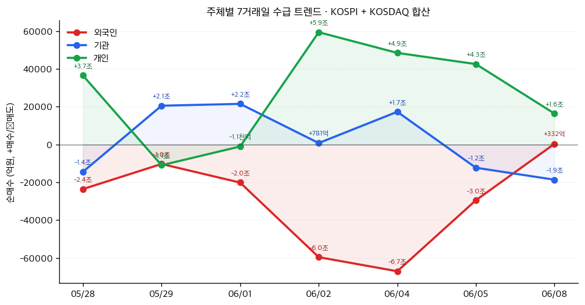

# 📊 모닝 브리핑 — 2026년 6월 9일 (화)

> **🟡 Risk-Neutral (경계)** — VIX 21.5로 상승, 금리 반등에 주의 필요
> - **매크로**: 미 10Y 국채 4.55%, 달러인덱스 120.08, 10Y 브레이크이븐 인플레이션 2.35%
> - **리스크**: VIX 21.51 (+6.11p 급등), HY 스프레드 2.76%로 소폭 확대
> - **시그널**: ① 2Y/10Y 스프레드 +38bp — 수익률 곡선 정상화 유지 ② 실업급여 청구 13,000 증가 — 고용 둔화 첫 신호

---

## 시장 스냅샷

### 주요 지수
| 지수 | 종가 | 등락 | 52주 위치 |
|------|------|------|----------|
| S&P 500 | 7,405.73 | +21.99 (+0.3%) | █████████████████▌░░ 88% (5,968–7,610) |
| 나스닥 | 25,929.66 | +220.23 (+0.9%) | █████████████████░░░ 85% (19,407–27,094) |
| 다우존스 | 50,786.01 | -80.77 (-0.2%) | ██████████████████▍░ 92% (42,172–51,562) |
| 코스피 | 8,160.59 | -478.82 (-5.5%) | █████████████████▉░░ 89% (2,856–8,801) |
| 코스닥 | 1,002.44 | -47.29 (-4.5%) | ██████████▍░░░░░░░░░ 52% (764–1,226) |
| 닛케이 225 | 66,588.12 | -882.57 (-1.3%) | ██████████████████▉░ 94% (37,834–68,402) |

### 매크로/원자재/크립토
| 항목 | 값 | 변동 | 52주 위치 |
|------|-----|------|----------|
| 미국 10Y | 4.55% | +0.02%p | ████████████████▊░░░ 84% (4–5) |
| 미국 2Y | 3.63% | +0.00%p | ███▎░░░░░░░░░░░░░░░░ 16% (4–4) |
| DXY | 100.00 | -0.07 (-0.1%) | █████████████████▋░░ 88% (96–101) |
| USD/KRW | 1,526.84 | -6.23 (-0.4%) | ███████████████████▍ 97% (1,348–1,533) |
| USD/JPY | 160.15 | +0.16 (+0.1%) | ███████████████████▉ 100% (143–160) |
| WTI 원유 | $91.42 | +1.0% | ████████████▌░░░░░░░ 63% (55–113) |
| 금 (Gold) | $4,348.30 | +0.3% | ██████████▌░░░░░░░░░ 53% (3,274–5,318) |
| 은 (Silver) | $68.20 | -1.1% | ████████▎░░░░░░░░░░░ 41% (36–115) |
| BTC | $63,309 | +0.1% | ▊░░░░░░░░░░░░░░░░░░░ 4% (60,867–124,753) |
| VIX | 18.92 | -2.59 (-12.0%) | ██████▎░░░░░░░░░░░░░ 31% (13–31) |
| 10Y-2Y 스프레드 | 0.92%p | +0.01%p | — |

### 수급 동향 (최근 7 거래일, 05/28 ~ 06/08, KOSPI+KOSDAQ 합산)



**7일 누적**: 외국인 -21.0조 · 기관 +1.5조 · 개인 +19.1조

---
⚠️ 시장 스냅샷은 시스템에 의해 자동 삽입됩니다.

---

## 시장 센티먼트

<div style="display:flex;border-radius:8px;overflow:hidden;margin:8px 0;font-size:0.85em"><div style="background:#4CAF50;width:35%;padding:6px 8px;color:white">🟢 Risk-On 35%</div><div style="background:#FF9800;width:40%;padding:6px 8px;color:white">🟡 중립 40%</div><div style="background:#F44336;width:25%;padding:6px 8px;color:white">🔴 Risk-Off 25%</div></div>

**핵심 판독**: VIX가 6p 이상 급등하며 21.5를 기록한 것은 단기 공포 심리가 유입됐음을 의미한다. 하지만 HY 스프레드 2.76%는 여전히 역사적 타이트 구간에 머물러 있어 신용 시장의 근본적 스트레스는 아직 없다. 수익률 곡선 정상화(+38bp)는 경기 침체 우려가 아닌 성장 기대를 반영하지만, 금리 반등(10Y 4.55%)이 밸류에이션 부담으로 작용하는 국면이다.

**변곡 촉매**:
- 🔴 **다운**: 이번 주 미국 CPI 서프라이즈 상방 → 금리 추가 상승 + VIX 가속 확대
- 🟢 **업**: 초기 실업급여 청구 증가 추세 확인 → 고용 냉각 → 금리 안정 + 리스크 자산 회복

---

## 섹터별 센티먼트

| 섹터 | 센티먼트 | 한줄 평가 |
|------|---------|----------|
| 국채·채권 | 🔴 주의 | 10Y 4.55%·2Y 4.17% 동반 상승, 금리 방향성 불확실 |
| 모기지·부동산(REITs) | 🟡 중립 | 30Y 모기지 6.48%로 소폭 하락했으나 여전히 부담 수준 |
| 고배당·유틸리티 | 🔴 약세 | 금리 상승 국면에서 배당 매력 상쇄, 듀레이션 부담 |
| 기술·성장주 | 🟡 혼조 | VIX 급등으로 멀티플 압박, 그러나 신용 스트레스는 제한적 |
| 경기소비재 | 🟡 관망 | 실업급여 청구 증가(+13K)는 소비 둔화 초기 신호, 추이 모니터링 필요 |
| 산업재·제조업 | 🟢 긍정 | 산업생산지수 102.5 개선, 실물 경기는 여전히 안정적 |
| 크레딧·하이일드 | 🟡 중립 | HY 스프레드 2.76%로 타이트 유지, 단기 확대 가능성 주시 |

---

## 오버나이트 핵심 이벤트

> [!abstract] 이번 브리핑의 핵심 이벤트는 모두 미국 매크로 데이터 발표에서 비롯됩니다. 개별 기업 이벤트보다 금리·고용 데이터가 시장을 주도하는 국면입니다.

### 1. 미국 국채 금리 급등 — 10Y 4.55%, 2Y 4.17%

- **요약**: 미국 2년물과 10년물 국채 금리가 각각 +12bp, +8bp 상승하며 단기간에 빠른 반등을 보였다.
- **So What**: 단기금리(2Y)가 장기금리(10Y)보다 더 빠르게 오른 것은 시장이 단기 인플레이션 재점화를 더 우려하고 있다는 신호다. 금리 상승은 성장주 밸류에이션(특히 고PER 기술주)을 직접 압박하며, 리파이낸싱 비용 부담도 증가시킨다.
- **크로스 임팩트**: 기술·성장주 (멀티플 압박), 리츠 (조달 비용↑), 달러 강세 (EM 자본 유출 압력)

### 2. VIX 6.11포인트 급등 — 21.51 기록

- **요약**: 변동성 지수(VIX)가 하루 만에 6.11p 급등하며 20 위를 돌파, 21.51을 기록했다.
- **So What**: VIX 20은 심리적·기술적 분기점으로, 이 수준 위에서는 옵션 시장의 헤지 수요 증가 → 마켓메이커의 델타 헤지가 현물 매도 압력을 증폭시키는 구조가 형성된다. 단기적으로 레버리지 전략(Risk Parity, 변동성 타겟 펀드)의 기계적 비중 축소가 나올 수 있다.
- **크로스 임팩트**: 전 자산군에 걸친 포지션 축소 압력, 특히 나스닥 선물·고베타 주식

### 3. 초기 실업급여 청구건수 13,000 증가 — 225,000건

- **요약**: 5월 30일 기준 주간 초기 실업급여 청구가 225,000건으로, 전주 대비 13,000건 증가했다.
- **So What**: 실업률 4.3%가 유지되는 가운데 주간 청구 증가는 고용 시장의 점진적 냉각을 나타낸다. 고용 둔화가 확인되면 Fed의 금리 인하 기대를 앞당길 수 있어 채권에는 호재, 소비 관련 주에는 양면적 신호다.
- **크로스 임팩트**: 국채(금리 하락 기대↑), 소비재(단기 매출 둔화 우려), Fed 정책 기대 경로

---

## 오늘의 일정

| 시간(한국) | 이벤트 | 중요도 | 관련 종목 |
|-----------|--------|--------|----------|
| 밤 9:30 | 미국 4월 도매재고 / 소비자신용 | ⭐⭐ | [[경기소비재]], [[소매유통]] |
| 수(10일) 밤 9:30 | 미국 5월 CPI 발표 | ⭐⭐⭐⭐⭐ | 전 자산군 |
| 수(10일) 밤 11:00 | 미국 5월 EIA 원유 재고 | ⭐⭐⭐ | [[에너지]], [[정유]] |
| 목(11일) 새벽 3:00 | Fed FOMC 회의록 공개 | ⭐⭐⭐⭐ | 전 자산군 |
| 목(11일) 밤 9:30 | 미국 주간 실업급여 청구 | ⭐⭐⭐ | [[경기소비재]], [[금융]] |

> [!warning] ⭐⭐⭐⭐⭐ 수요일 미국 5월 CPI — 시나리오 분기
> - **상방 서프라이즈 (CPI > 예상)**: 금리 추가 상승 → VIX 재확대 → 성장주 추가 조정, 달러 강세
> - **인라인 (예상치 부합)**: 현 금리 수준 유지, VIX 안정화, 시장 반등 시도 가능
> - **하방 서프라이즈 (CPI < 예상)**: 금리 하락 + 위험자산 랠리 트리거, Fed 인하 기대 재점화

---

## 테마 시그널: 달러 인덱스 120의 의미 — "강달러가 세상을 먹어치울 때 어디서 돈을 잃고, 어디서 기회가 생기는가"

> [!abstract] 달러 인덱스(DXY)가 120을 기록 중이다. 이 숫자가 단순한 환율 지표가 아닌 이유 — 강달러는 글로벌 자본 흐름의 중력 방향을 바꾸는 힘이다.

### 왜 지금 이 테마인가

달러 인덱스(DXY)가 120을 상회하고 있다. 역사적으로 DXY 120은 매우 드문 수준으로, 2001~2002년 닷컴 버블 붕괴 직후와 2022년 인플레이션 쇼크 당시에 근접했던 수준이다. 단순히 "원화나 유로화가 약하다"는 이야기가 아니다. 달러 강세는 달러 표시 부채를 가진 모든 국가, 기업, 개인에게 구조적 압박을 가한다.

### 달러 강세의 전달 경로 (Transmission Mechanism)

```
강달러 → 달러 부채 상환 부담↑ → EM 기업 실적 훼손
        → 원자재 가격(달러 표시) 하락 압박 → 산유국·광업국 수입 감소
        → 미국 다국적기업 해외 매출 환산 가치 하락 → S&P 500 이익 압박
        → 달러 외 자산의 미국 투자자 실질 수익률 하락 → 자본 환류
```

이 연쇄 고리가 작동하는 방식을 이해하면, 지금 EM 주식이 약하고 원자재가 압박받는 이유가 설명된다.

### 달러 강세가 자산군에 미치는 영향

| 자산/섹터 | 강달러 영향 | 메커니즘 |
|---------|-----------|---------|
| 이머징마켓(EM) 주식 | 🔴 강한 부정 | 자본 유출 + 달러 부채 부담 + 수출 경쟁력↓ |
| 원자재 (원유·금·구리) | 🔴 부정 | 달러 강세 = 원자재 달러 가격 하락 압력 |
| 미국 다국적기업 | 🟡 혼조 | 해외 매출 환산 손실 (특히 유럽·아시아 비중 高 기업) |
| 미국 내수·소형주 (Russell 2000) | 🟢 상대적 긍정 | 달러 노출 낮고 국내 소비 기반 |
| 미국 국채 (외국인 입장) | 🔴 복합 | 달러 강세로 미국 자산 매력↑이나 금리 상승이 가격↓ |
| 한국 수출주 | 🟡 양날의 검 | 원화 약세로 가격 경쟁력↑, 단 원자재 수입 비용↑ |
| 일본 수출주 | 🟢 수혜 | 엔화 약세 + 수출 가격 경쟁력 극대화 |

### 역사적 선례: 2014~2015년 슈퍼달러 사이클

2014년 6월~2015년 3월, DXY는 약 80에서 100으로 25% 급등했다. 이 9개월 동안 무슨 일이 일어났는가:

- **브라질 헤알**: -30% 절하 → 브라질 기업들의 달러 부채 상환 위기
- **원유 가격**: 배럴당 100달러 → 45달러로 폭락 (달러 강세가 수요·공급 외 추가 압박)
- **신흥국 외화 준비고**: 2조 달러 이상 감소 — 자본 방어를 위한 달러 매도 개입
- **미국 S&P 500 EPS**: 해외 매출 비중 높은 기업들 평균 5~8% 이익 감소 요인

반면 이 시기 수혜를 본 것은: 미국 내수 소비 기업, 달러 예금 보유자, 미국 방산·서비스 수출 기업.

### 지금 DXY 120의 특수성

2026년의 강달러는 단순한 미국 경제 우위가 아니라 복합적 요인이 겹친 결과다:
- **무역 정책 불확실성**: 관세 강화 → 무역 파트너 통화 약세 유도
- **미국 금리 상대 우위 유지**: FFR 3.63%는 다른 주요국 대비 여전히 높은 수준
- **안전자산 프리미엄**: 지정학 불안 시 달러는 여전히 글로벌 최후 피난처

> [!tip] 핵심 인사이트: DXY 120은 구조적 달러 패권의 재확인
> 달러 인덱스 120 수준은 단기 투기적 포지션만으로 설명되지 않는다. 이 수준에서 강달러가 장기화될 경우, EM 전반의 자산 가격 재평가가 불가피하다. 반면 달러 약세 전환 시그널(Fed 인하 가속, 미국 재정 우려 심화)은 EM과 원자재의 동시 반등 트리거가 된다.

### 모니터링 포인트

| 지표 | 현재 | 경계 수준 | 의미 |
|------|------|---------|------|
| DXY | 120.08 | 125↑ = 위기 임박 | EM 스트레스 가속화 |
| CNY/USD | 6.77 | 7.2↑ = 위안화 방어선 붕괴 | 중국 자본 통제 리스크 |
| HY 스프레드 | 2.76% | 4.0%↑ = 신용 위기 | 달러 부채 기업 디폴트↑ |
| 미국 10Y | 4.55% | 5.0%↑ = 달러 수요 피크 가능성 | 강달러 → 역설적 반전 트리거 |

---

## 대가의 시선

> "달러는 우리의 통화이지만, 당신들의 문제다."
> — **존 코널리 (John Connally)**, 미국 재무장관 (1971년, 닉슨 쇼크 직후 유럽 재무장관들에게) [클래식]

**맥락**: 1971년 닉슨 대통령이 금-달러 태환 정지를 선언한 직후, 충격받은 유럽 재무장관들이 미국에 책임을 물었을 때 코널리가 한 말이다. 달러의 패권적 지위를 가장 냉혹하게 표현한 발언으로 꼽힌다.

**투자 함의**: DXY 120이라는 지금의 숫자는, 이 발언이 반세기 후에도 여전히 유효함을 보여준다. 달러 강세가 EM에는 "당신들의 문제"가 되는 메커니즘은 변하지 않았다. 투자자로서 우리가 해야 할 질문은 "달러 강세가 언제 꺾이는가"가 아니라, "강달러가 지속되는 동안 어떤 자산이 그 압력을 비켜갈 수 있는가"다. 현재 미국 내수 중심 소형주, 에너지 수출국(달러 수익), 일본 수출 대기업이 상대적 안전지대로 거론된다.

---

## 투자 레슨: 수익률 곡선(Yield Curve) — "이 한 장의 차트가 경기 침체를 예고한 9번의 기록"

> [!abstract] 오늘의 레슨: **수익률 곡선의 역전과 정상화 — "스프레드 +38bp가 축하할 일인가, 경고 신호인가"**

### 핵심 개념: 수익률 곡선이란 무엇인가

수익률 곡선(Yield Curve)은 만기가 다른 국채의 금리를 이어 그린 선이다. 이 곡선의 기울기는 단순한 금리 지표가 아니라 **시장 참여자 수백만 명의 미래 경제 전망**이 응축된 신호다.

오늘 데이터: **10Y-2Y 스프레드 = +38bp (정상 우상향)**

얼핏 보면 안도할 만한 수치다. 스프레드가 플러스라는 것은 수익률 곡선이 역전에서 정상화됐다는 의미니까. 하지만 투자 역사가 말하는 것은 다르다 — **수익률 곡선의 역전이 아니라, 역전 이후 정상화(Re-steepening)가 더 위험한 시그널일 수 있다.**

### 왜 역전이 아니라 "정상화"가 문제인가

수익률 곡선 역전(2Y > 10Y)은 경기 침체의 선행 지표로 잘 알려져 있다. 그런데 실제 침체는 역전이 발생했을 때가 아니라, **역전이 해소되고 곡선이 다시 가팔라지는 시점에 더 자주 발생**했다.

역사적 패턴:

| 역전 시작 | 정상화 시점 | 침체 시작 | 정상화→침체 간격 |
|---------|-----------|---------|--------------|
| 1988년 | 1989년 12월 | 1990년 7월 | ~7개월 |
| 1998년 | 1999년 6월 | 2001년 3월 | ~21개월 |
| 2000년 | 2001년 1월 | 2001년 3월 | ~2개월 |
| 2006년 | 2007년 6월 | 2007년 12월 | ~6개월 |
| 2019년 | 2020년 2월 | 2020년 3월 | ~1개월 |
| 2022~2023년 역전 | 2024~2025년 정상화 中 | ? | 관찰 중 |

### 왜 이런 패턴이 나타나는가 — 메커니즘 분석

수익률 곡선이 정상화되는 경로는 두 가지다:

<div style="display:flex;border-radius:8px;overflow:hidden;margin:8px 0;font-size:0.85em"><div style="background:#4CAF50;width:50%;padding:6px 8px;color:white">🟢 Bull Steepening: 단기금리↓ (Fed 인하) → 경기 연착륙 시나리오</div><div style="background:#F44336;width:50%;padding:6px 8px;color:white">🔴 Bear Steepening: 장기금리↑ (인플레/재정 우려) → 스태그플레이션 경고</div></div>

**Bull Steepening**: 단기금리가 내려오면서 곡선이 정상화. Fed가 먼저 인하를 시작한다는 것은 경기 둔화를 인정한다는 의미 → 경기 연착륙이 기대되지만, 이미 늦은 대응일 수 있음.

**Bear Steepening**: 장기금리가 올라가면서 곡선이 정상화. **지금이 이 경로에 더 가깝다.** 오늘 데이터에서 10Y가 +8bp, 2Y가 +12bp 올랐지만 여전히 장기금리가 단기금리보다 높아 스프레드 유지. 이 경로는 인플레이션 재점화 우려나 재정 건전성 우려가 장기금리를 밀어 올릴 때 발생하며, 경기 침체보다는 스태그플레이션에 가까운 시나리오다.

### 오늘 시장 적용

현재 스프레드 +38bp는 2024~2025년 장기 역전 구간에서 탈출한 결과다. 핵심 질문:
- **어떤 경로로 정상화됐는가?** → 아직 진행 중이며, Bear Steepening 성격이 강함
- **Fed는 아직 인하 사이클 초입** (FFR 3.63%, 25bp씩 인하 중) → Bull Steepening으로 전환 가능성도 있음
- **수요일 CPI가 결정적**: 인플레 재점화 → Bear Steepening 가속 → 스태그 우려 / 인플레 안정 → Bull Steepening 전환 기대

> [!warning] 리스크 경고: 정상화는 끝이 아니라 시작일 수 있다
> 수익률 곡선이 정상화됐다고 해서 위험이 사라진 것이 아니다. 역사적 데이터는 오히려 정상화 이후 6~18개월이 경기 전환의 핵심 구간임을 보여준다. 현재 +38bp는 안도가 아니라 모니터링 강화의 신호다.

### 투자자를 위한 실전 프레임워크

```
수익률 곡선 스프레드 체크리스트:

① 스프레드 방향: 확대 중 vs 축소 중?
   → 지금은 역전에서 정상화 방향 (확대)

② 정상화 경로: Bull(단기↓) vs Bear(장기↑)?
   → 현재 Bear Steepening 성격 우세

③ 속도: 빠른 정상화 vs 느린 정상화?
   → 빠를수록 경기 충격 가능성 ↑

④ Fed와의 동기화: Fed 인하 사이클과 일치?
   → FFR 인하 중이나 장기 금리는 반등 → 신호 상충 중
```

### 오늘 실천 방법

수요일 CPI 발표 후 10Y-2Y 스프레드 변화를 관찰하라. CPI 서프라이즈 상방 → 스프레드 추가 확대(Bear Steepening 강화) → 성장주·리츠 익스포저 점검 타이밍. 반대로 인라인 혹은 하방이면 Bull Steepening 전환 기대 형성 → 채권 및 금리 민감 자산 관심도 높일 시점.

---

## 오늘 하나만 기억한다면

> [!verdict] 오늘 하나만 기억한다면
> **"수익률 곡선 정상화(+38bp)는 안도의 신호가 아니다 — 역사적으로 정상화 이후 6~18개월이 진짜 위험 구간이며, 수요일 CPI가 Bear Steepening인지 Bull Steepening인지를 결정할 것이다."**