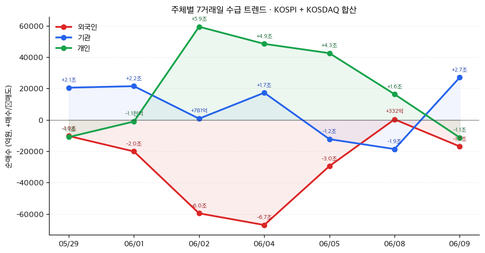

# 📊 모닝 브리핑 — 2026년 6월 10일 (수)

> **🟢 Risk-On (신중한 낙관)** — 변동성 안정 속 매크로 우호, 그러나 달러 강세와 관세 불확실성이 상단을 제한
> - **매크로**: 미국 10Y 국채 4.56%, 달러인덱스 120.08, 10Y-2Y 스프레드 +41bp (정상 곡선)
> - **리스크**: VIX 18.92 (-2.59), HY 스프레드 2.75% — 크레딧 시장 안정적
> - **시그널**: 수익률 곡선 정상화 완성 + 실업급여 청구 소폭 증가, 노동시장 모니터링 필요

---

## 시장 스냅샷

### 주요 지수
| 지수 | 종가 | 등락 | 52주 위치 |
|------|------|------|----------|
| S&P 500 | 7,386.65 | -19.08 (-0.3%) | █████████████████▎░░ 86% (5,968–7,610) |
| 나스닥 | 25,678.82 | -250.84 (-1.0%) | ████████████████▍░░░ 82% (19,407–27,094) |
| 다우존스 | 50,872.11 | +86.10 (+0.2%) | ██████████████████▌░ 93% (42,172–51,562) |
| 코스피 | 7,484.41 | -676.18 (-8.3%) | ███████████████▋░░░░ 78% (2,856–8,801) |
| 코스닥 | 911.39 | -91.05 (-9.1%) | ██████▍░░░░░░░░░░░░░ 32% (764–1,226) |
| 닛케이 225 | 64,024.60 | -2563.52 (-3.8%) | █████████████████▏░░ 86% (37,834–68,402) |

### 매크로/원자재/크립토
| 항목 | 값 | 변동 | 52주 위치 |
|------|-----|------|----------|
| 미국 10Y | 4.53% | -0.02%p | ████████████████▏░░░ 81% (4–5) |
| 미국 2Y | 3.63% | +0.01%p | ███▍░░░░░░░░░░░░░░░░ 17% (4–4) |
| DXY | 100.00 | -0.06 (-0.1%) | █████████████████▋░░ 88% (96–101) |
| USD/KRW | 1,527.22 | -27.26 (-1.8%) | █████████████████▍░░ 87% (1,348–1,554) |
| USD/JPY | 160.38 | +0.05 (+0.0%) | ████████████████████ 100% (143–160) |
| WTI 원유 | $88.82 | -2.7% | ███████████▋░░░░░░░░ 58% (55–113) |
| 금 (Gold) | $4,278.30 | -1.3% | █████████▉░░░░░░░░░░ 49% (3,274–5,318) |
| 은 (Silver) | $65.35 | -4.5% | ███████▌░░░░░░░░░░░░ 37% (36–115) |
| BTC | $61,893 | -1.9% | ▍░░░░░░░░░░░░░░░░░░░ 2% (60,867–124,753) |
| VIX | 19.87 | +0.95 (+5.0%) | ███████▎░░░░░░░░░░░░ 36% (13–31) |
| 10Y-2Y 스프레드 | 0.89%p | -0.03%p | — |

### 수급 동향 (최근 7 거래일, 05/29 ~ 06/09, KOSPI+KOSDAQ 합산)



**7일 누적**: 외국인 -20.3조 · 기관 +5.6조 · 개인 +14.4조

---
## 시장 센티먼트

<div style="display:flex;border-radius:8px;overflow:hidden;margin:8px 0;font-size:0.85em"><div style="background:#4CAF50;width:62%;padding:6px 8px;color:white">🟢 Risk-On 62%</div><div style="background:#FF9800;width:24%;padding:6px 8px;color:white">🟡 중립 24%</div><div style="background:#F44336;width:14%;padding:6px 8px;color:white">🔴 Risk-Off 14%</div></div>

**핵심 판독**: VIX가 18.92까지 하락하며 공포 구간을 완전히 벗어났고, HY 크레딧 스프레드 2.75%는 역사적으로 낮은 수준을 유지하고 있어 기관 투자자들의 위험자산 선호가 지속되고 있다. 다만 달러인덱스 120.08의 강세는 신흥국 자산과 원자재에 이중 압박으로 작용 중이다. 전형적인 "소프트랜딩 기대 + 달러 강세" 조합으로, 미국 중심의 자산 쏠림이 지속되는 구도.

**변곡 촉매**:
- 🔴 **다운사이드**: 초기 실업급여 청구 22.5만 건 이상 추세 고착화 → 노동시장 균열 신호로 해석 시 리스크오프 전환
- 🟢 **업사이드**: 미중 무역협상 추가 진전 또는 Fed 피벗 기대 재점화 → 달러 약세 전환과 위험자산 동반 랠리

---

## 섹터별 센티먼트

| 섹터 | 센티먼트 | 한줄 평가 |
|------|----------|----------|
| 반도체/HBM | 🟢 강세 | SK하이닉스 임원 지분 공시 러시 — 내부자 보유 지속, AI 수요 펀더멘털 이상 없음 |
| 금융/은행 | 🟢 강세 | 수익률 곡선 +41bp 정상화 완성, NIM 회복 기대 + HY 스프레드 안정으로 대출 손실 우려 감소 |
| 부동산/리츠 | 🟡 중립 | 10Y 4.56% 고착 + 모기지 6.48%로 거래량 부진, 금리 인하 기대 후퇴 시 압박 가중 |
| 에너지 | 🟡 중립 | 달러 강세가 유가 상단 제한, 글로벌 수요 둔화 우려와 공급 변수 공존 |
| 소비재(경기) | 🟡 중립 | 실업률 4.3% 고점 근접 + 실업급여 소폭 증가, 소비 심리 모멘텀 약화 주시 필요 |
| 미국 빅테크 | 🟢 강세 | VIX 안정 + 크레딧 양호, 달러 강세 수혜(해외매출 환산 효과) + AI 투자 사이클 지속 |
| 이머징마켓 | 🔴 약세 | 달러인덱스 120.08 강세 압박, CNY 6.77 유지로 중국發 디플레이션 수출 우려 상존 |

---

## 오버나이트 핵심 이벤트

### 1. SK하이닉스 임원·대주주 대량 지분 공시 러시
- **요약**: 2026년 6월 9일 하루에 SK하이닉스 임원·주요주주 특정증권 소유상황 보고서가 5건, 대량보유상황 보고서(약식) 1건 등 총 6건이 DART에 동시 접수됨.
- **So What**: 단일 종목 임원 공시가 하루에 6건 집중되는 것은 이례적이다. 통상 임원 지분 변동 보고는 취득·처분 등 실질 변화가 있을 때 의무적으로 제출된다. 다수 임원이 동시에 지분을 변동했다면 스톡옵션 행사, 우리사주 취득, 또는 기관 블록딜 연관 움직임일 가능성이 있다. 내부자 집단 취득이라면 긍정적 시그널이지만, 처분이라면 고점 인식 신호일 수 있어 공시 내용 방향성 확인이 필수다.
- **크로스 임팩트**: [[SK하이닉스]], 반도체 섹터 전반, 코스피 대형주 수급

### 2. 미국 수익률 곡선 완전 정상화 — 10Y-2Y +41bp
- **요약**: 10Y 국채 4.56%, 2Y 국채 4.15%로 스프레드가 +41bp를 기록하며 장단기 역전 해소를 넘어 정상 곡선이 완전히 확립됨.
- **So What**: 2022~2024년 장기간 지속된 역전 곡선(Inverted Yield Curve)이 완전히 해소된 것은 시장이 '경기침체 없는 연착륙'을 공식 가격에 반영했다는 신호다. 역사적으로 역전 해소 직후 6~12개월은 은행주와 금융주에 우호적 환경이 형성된다. 다만 동시에 인플레이션 기대(10Y 손익분기 2.33%)가 완화되지 않으면서 Fed의 추가 인하 여지를 제한한다는 이중 메시지가 내재되어 있다.
- **크로스 임팩트**: 미국 은행주, 리츠, 장기 국채, 달러 강세 지속 경로

### 3. 달러인덱스 120.08 — 강달러 구조 고착화
- **요약**: 달러 광의 지수(Broad Dollar Index)가 120.08을 기록하며 고수준을 유지. 전주 대비 +0.72 상승.
- **So What**: 달러 강세는 미국 경제 상대적 강함의 반증이지만, 글로벌 투자자 입장에서는 이머징 자산 약세·원자재 가격 상단 제한·미국 수출기업 실적 헤드윈드를 동시에 의미한다. CNY/USD 6.77 유지와 함께 중국發 디플레이션이 글로벌로 수출되는 경로도 주시해야 한다. 달러 강세가 Fed 인하를 더욱 늦추는 순환 구조(강달러 → 수입물가 하락 → 인플레 안정 → 인하 여유 없음)가 형성될 수 있다.
- **크로스 임팩트**: 원/달러 환율, 이머징마켓 ETF, 원자재 전반, [[삼성전자]]·[[SK하이닉스]] 수출 환차익

### 4. 초기 실업급여 청구 22만5천 건 — 노동시장 미세 균열 감지
- **요약**: 5월 30일 기준 주간 신규 실업급여 청구 건수가 22만5천 건으로 전주 대비 1만3천 건 증가.
- **So What**: 절대 수준은 여전히 역사적 건전 범위(20만~24만 건)이지만, 단주 증가폭 +1.3만 건은 무시하기 어렵다. 실업률도 4.3%로 사이클 고점 근처에서 정체 중이다. 추세가 2~3주 더 이어지면 Fed 의사결정에 영향을 줄 수 있다. 소비 주도 성장의 핵심 변수인 고용이 흔들리기 시작하면, 현재의 Risk-On 센티먼트에 가장 빠르게 충격을 줄 카드다.
- **크로스 임팩트**: 미국 소비재, 리테일, 경기민감 섹터, Fed 정책 경로

---

## 오늘의 일정

| 시간(한국) | 이벤트 | 중요도 | 관련 종목 |
|-----------|--------|--------|----------|
| 오늘 장중 | DART 공시 확인 — SK하이닉스 임원 지분 변동 방향성 파악 | ⭐⭐⭐⭐ | [[SK하이닉스]] |
| 목(11일) 밤 9:30 | 미국 5월 CPI 발표 | ⭐⭐⭐⭐⭐ | 전 종목, 채권, 달러 |
| 목(11일) 밤 9:30 | 미국 주간 신규 실업급여 청구 (업데이트) | ⭐⭐⭐ | 경기민감 섹터, 소비재 |
| 금(12일) 밤 11:00 | 미시간대 소비자심리지수 (예비치) | ⭐⭐⭐ | 소비재, 리테일 |

> [!warning] ⭐⭐⭐⭐⭐ 내일 밤 — 미국 5월 CPI, 시장 방향성 결정
> **시나리오 분기**:
> - 🟢 **CPI 예상치 하회** → Fed 인하 기대 재점화, 달러 약세 전환, 성장주·이머징 동반 상승
> - 🔴 **CPI 예상치 상회** → 강달러 추가 강화, 국채 금리 상승, 고밸류에이션 성장주 압박, VIX 반등 가능
> - 🟡 **예상치 부합** → 현재 "신중한 낙관" 국면 유지, 시장 큰 방향 변화 없음

---

## 테마 시그널 — "달러 패권의 역설: 달러인덱스 120이 미국 투자자에게는 축복이고, 나머지에겐 세금인 이유"

> [!abstract] 왜 지금 이 테마인가
> 달러인덱스가 120.08을 기록하며 강달러 구조가 고착화되고 있다. 단순히 "달러가 강하다"는 사실을 넘어, 강달러가 글로벌 금융 시스템 내에서 어떤 메커니즘으로 작동하는지를 이해하면 — 왜 이머징마켓이 무너지고, 원자재가 눌리고, 한국 수출주의 환차익이 생기는지 — 모든 자산군을 하나의 프레임으로 읽을 수 있다.

### 강달러의 구조적 메커니즘

달러 강세는 단순한 환율 문제가 아니라, **전 세계 부채·무역·원자재가 달러로 표시되어 있다는 구조적 사실**에서 출발한다.

**① 달러 부채 디레이버리징 압박**
전 세계 크로스보더 대출의 약 60%가 달러 표시다(BIS 데이터). 달러가 강해지면 달러 부채를 진 이머징국가·기업의 실질 부담이 자국 통화 기준으로 즉각 증가한다. 2022년 강달러 사이클에서 스리랑카, 파키스탄, 아르헨티나가 줄줄이 외채 위기를 겪은 것이 대표 사례다.

**② 원자재 가격 억제 효과**
원유, 구리, 금 등 대부분의 원자재는 달러로 거래된다. 달러가 강해지면 동일한 달러 가격이라도 다른 통화 기준으로 더 비싸지기 때문에, 수요가 자동으로 감소한다. 달러인덱스와 원자재 지수는 역의 상관관계를 갖는 것이 이 때문이다.

**③ 연준의 금리 정책을 글로벌로 수출하는 경로**
강달러 → 이머징 자본 유출 → 이머징 중앙은행 방어적 금리 인상 → 이머징 경기 둔화. 즉 연준이 금리를 높게 유지하는 것만으로도 신흥국에는 간접 긴축이 전파된다. 이른바 "달러 패권의 외부효과(Dollar Hegemony Externality)"다.

### 오늘 시장과의 연결: 120.08이 말하는 것

```
달러인덱스 120.08의 함의:
──────────────────────────────────────────────
수혜         : 미국 빅테크 (해외매출 달러 환산 이익 증가)
             : 한국 수출기업 (원화 약세 = 원화 환산 매출 증가)
             : 미국 내 소비자 (수입물가 하락 → 인플레 완화)

압박         : 이머징마켓 전반 (자본 유출 + 달러 부채 부담)
             : 원자재 (수요 둔화 효과)
             : 미국 수출 제조업 (가격 경쟁력 약화)
             : 중국 (대미 수출 가격 경쟁력 약화, CNY 방어 비용)
──────────────────────────────────────────────
```

특히 주목할 것은 **중국의 딜레마**다. CNY/USD 6.77은 인민은행이 달러 강세에 대해 적극적인 절하를 허용하지 않고 있음을 시사한다. 이는 중국이 수출 경쟁력 확보보다 **자본 유출 방지와 금융 안정**을 우선시하고 있다는 의미이기도 하다.

### 트리핀 딜레마와 달러의 구조적 긴장

달러 패권에는 내재된 모순이 있다. 전 세계가 달러를 기축통화로 사용하려면 미국은 지속적으로 경상수지 적자를 내야 한다(달러를 세계에 공급해야 하므로). 그런데 달러가 강해지면 미국의 무역적자는 더 확대되고, 이는 정치적으로 보호무역 압력을 높인다. 트럼프 행정부의 관세 정책이 구조적으로 반복될 수밖에 없는 이유가 여기에 있다.

> [!tip] 핵심 인사이트
> **강달러는 미국 금융자산에는 우호적이지만, 동시에 달러 패권을 약화시키는 씨앗을 스스로 심는다.** 달러인덱스 120이 지속될수록 이머징 국가들의 달러 이탈 유인(BRICS 결제통화 논의 등)이 커지는 역설이 발생한다.

### 투자자 모니터링 포인트

| 지표 | 현재 | 임계 시그널 |
|------|------|------------|
| 달러인덱스 | 120.08 | 125 돌파 시 → 이머징 크라이시스 경보 |
| CNY/USD | 6.77 | 7.20 이상 → 중국 자본 유출 가속 신호 |
| HY 스프레드 | 2.75% | 4% 이상 → 크레딧 스트레스 구간 |
| 10Y 브레이크이븐 | 2.33% | 2.6% 이상 → 인플레 재점화, 달러 추가 강세 |

---

## 대가의 시선

> "The dollar is our currency, but it's your problem."
> (달러는 우리의 통화지만, 그것은 당신들의 문제다.)
> — **존 코널리 (John Connally)**, 미국 재무장관, 1971년 로마 G10 재무장관 회의 [클래식]

**맥락**: 1971년 닉슨쇼크 직후, 달러의 금태환 정지에 항의하는 유럽 재무장관들에게 당시 미국 재무장관 코널리가 던진 말이다. 전 세계가 달러 기축통화 시스템의 피해를 호소할 때, 미국은 그것을 자국 이익의 도구로 활용한다는 솔직한 선언이었다.

**투자 함의**: 달러인덱스 120.08이라는 숫자는 단순한 환율 데이터가 아니다. 이 발언이 나온 지 55년이 지났지만 구조는 동일하다 — 달러 강세는 미국 입장에서 정책 수단이고, 나머지 세계 투자자 입장에서는 수익률에 직접 영향을 미치는 외생 변수다. 한국 투자자라면 원화 자산과 달러 자산의 비중을 단순한 "분산"이 아니라 **달러 사이클에 대한 능동적 포지션**으로 접근해야 한다.

---

## 투자 레슨

> [!abstract] 오늘의 레슨: **켈리 공식(Kelly Criterion) — "얼마나 베팅할 것인가"가 "무엇에 베팅할 것인가"보다 중요한 이유**

### 왜 천재들이 파산하는가

투자에서 가장 많이 논의되는 것은 "어떤 주식을 살 것인가"다. 그러나 수학적으로 더 결정적인 질문은 **"얼마나 살 것인가"**다. 올바른 방향으로 베팅하고도 포지션 크기를 잘못 설정하면 파산할 수 있다. 이것이 켈리 공식이 존재하는 이유다.

### 켈리 공식의 본질

1956년 벨 연구소의 수학자 존 켈리(John Kelly)가 제시한 공식:

```
f* = (bp - q) / b

f* = 최적 베팅 비율 (자본 대비)
b  = 수익 배수 (1달러 베팅 시 이길 경우 얼마를 버는가)
p  = 승리 확률
q  = 패배 확률 (= 1 - p)
```

**직관적 예시**:
- 어떤 종목이 60% 확률로 50% 상승, 40% 확률로 30% 하락한다면:
- f* = (0.5 × 0.6 - 0.4) / 0.5 = (0.30 - 0.40) / 0.5 = **-0.20**
- 켈리 공식이 음수(-20%)를 출력한다 → **매수하지 말라는 신호**

반대로 승산이 명확한 경우:
- 70% 확률로 100% 상승, 30% 확률로 50% 하락:
- f* = (1.0 × 0.7 - 0.3) / 1.0 = **0.40** → 자본의 40%를 투입

### 켈리 공식의 실전 적용: 왜 "하프 켈리"를 쓰는가

이론적으로 켈리 공식은 **장기적으로 자산 증가율을 극대화**한다. 그러나 실전 투자자들은 거의 예외 없이 **켈리 값의 절반(Half-Kelly)**을 사용한다. 이유는 세 가지다:

| 이유 | 설명 |
|------|------|
| **확률 추정 오류** | 투자자가 추정한 p와 b는 항상 불확실하다. 오버추정 시 켈리를 그대로 적용하면 과도한 베팅이 된다 |
| **변동성 감내** | 풀 켈리는 최대 드로우다운이 매우 크다. 심리적으로 견디기 어렵고, 실제로 망하지 않아도 투자를 포기하게 된다 |
| **비상관 자산 혼합** | 포트폴리오 내 여러 포지션이 있을 때 개별 켈리를 단순 합산하면 총 투자 비율이 100%를 초과할 수 있다 |

> [!tip] 핵심 인사이트
> **켈리 공식의 진짜 교훈은 '비율'이 아니라 '프레임'이다.** 투자 결정을 내릴 때 반드시 두 가지를 명시적으로 추정해야 한다: ① 내가 옳을 확률(p), ② 옳을 때와 틀릴 때의 손익 비율(b). 이 두 숫자를 구체적으로 쓰지 못한다면, 그 투자는 아직 충분히 분석되지 않은 것이다.

### 역사적 사례: 켈리 공식을 실전에 적용한 투자자들

**에드워드 소프(Edward Thorp)**: 블랙잭 카드 카운팅에서 출발해 켈리 공식을 금융 시장에 최초로 체계적으로 적용한 헤지펀드 매니저. 그의 Princeton Newport Partners는 1969~1988년 동안 연평균 15.1%(수수료 후) 수익률을 기록하며 단 한 해도 손실을 내지 않았다. 그는 자신이 시장에서 확실한 엣지(edge)를 가졌다고 확신할 때만, 그리고 오직 그 확신의 크기에 비례해서만 베팅했다.

**빌 밀러(Bill Miller)**: 켈리 방식의 집중 투자로 S&P500을 15년 연속 이긴 전설적 펀드매니저. 그러나 2008년 금융위기에서 **"확률 추정 오류"**로 베어스턴스, 리먼 등 금융주에 과도한 집중 베팅을 유지하다 펀드 자산의 65%를 잃었다. 켈리 공식을 쓰더라도, p(확률)의 추정이 틀리면 공식 자체가 독이 된다는 것을 보여주는 사례다.

### 오늘 시장 상황과의 연결

SK하이닉스 임원 6건의 공시가 하루에 쏟아졌다. 이 시점에 SK하이닉스 포지션 크기를 결정해야 한다면, 켈리 공식은 이렇게 묻는다:

```
① 공시 방향이 취득(긍정)인가, 처분(부정)인가?  → 아직 확인 중
② 취득이라면: AI/HBM 사이클 지속 하에서
   이 종목이 향후 1년간 시장을 이길 확률은?    → p 추정 필요
③ 이길 때 수익 vs 질 때 손실 비율은?           → b 추정 필요
④ 위 두 숫자를 켈리 공식에 대입               → 최적 비율 산출
⑤ 불확실성 감안, 하프 켈리 적용               → 실제 투자 비율
```

공시 내용을 확인하지 않은 상태에서 포지션을 무턱대고 늘리는 것은 **p와 b를 모른 채 베팅하는 것**이다. 켈리 공식이 가르치는 첫 번째 원칙은 "모르면 베팅하지 마라"가 아니라 **"확률과 손익비를 먼저 계산하라"**다.

### 오늘 실천 방법

보유 중인 어떤 포지션이든 하나를 골라 종이에 적어보세요: **"이 투자가 옳을 확률은 몇 %인가? 옳을 때 수익과 틀릴 때 손실의 비율은 얼마인가?"** 켈리 공식에 대입했을 때 현재 포지션 크기와 공식이 제안하는 크기가 크게 다르다면, 그 차이가 감정적 바이어스의 크기다.

---

## 오늘 하나만 기억한다면

> [!verdict] 오늘 하나만 기억한다면
> **"달러인덱스 120은 환율 숫자가 아니라 글로벌 자산 배분의 중력이다 — 내일 밤 CPI가 이 중력의 방향을 바꿀 수 있다."**