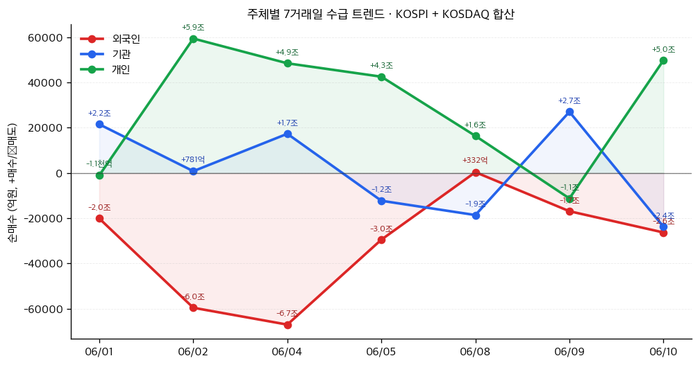
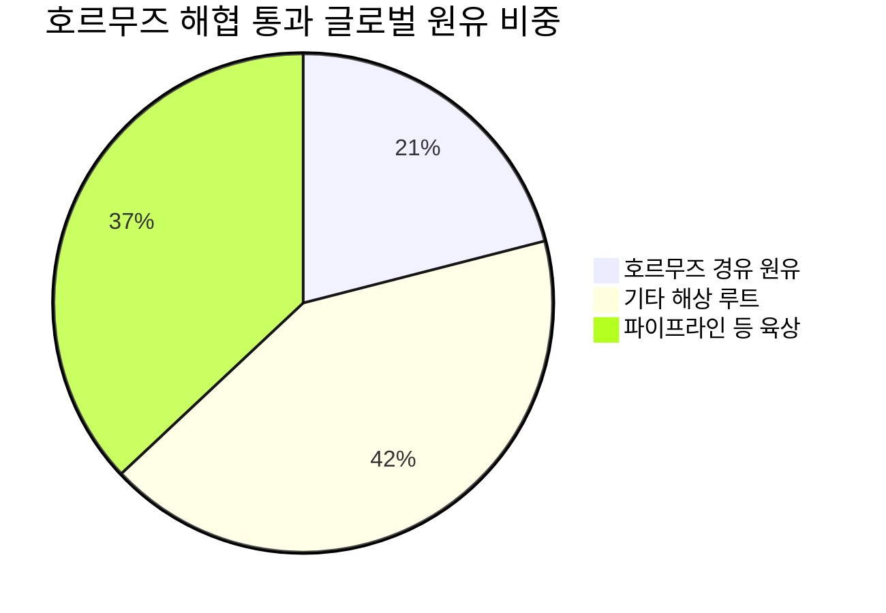

# 📊 모닝 브리핑 — 2026년 6월 11일 (목)

> **🔴 Risk-Off** — 중동 긴장 재확대 + 고인플레이션 + 기술주 변동성 삼중 압박
> - **매크로**: 美 10년물 금리 4.5%+ 돌파, 유가 상승 압력 지속
> - **리스크**: 코스피 -4.52% 급락 / 8,000선 재이탈, VIX 상승 기조
> - **시그널**: ① 5월 CPI 4.2% — Fed 금리 인상 경로 재가격화 진행 중 ② 미-이란 교전 — 에너지·방산 섹터 수급 이동

---

## 시장 스냅샷

### 주요 지수
| 지수 | 종가 | 등락 | 52주 위치 |
|------|------|------|----------|
| S&P 500 | 7,266.99 | -119.66 (-1.6%) | ███████████████▉░░░░ 79% (5,968–7,610) |
| 나스닥 | 25,169.50 | -509.32 (-2.0%) | ███████████████░░░░░ 75% (19,407–27,094) |
| 다우존스 | 49,918.78 | -953.33 (-1.9%) | ████████████████▌░░░ 83% (42,172–51,562) |
| 코스피 | 8,096.93 | +612.52 (+8.2%) | █████████████████▋░░ 88% (2,872–8,801) |
| 코스닥 | 967.81 | +56.42 (+6.2%) | ████████▊░░░░░░░░░░░ 44% (769–1,226) |
| 닛케이 225 | 65,416.63 | +1392.03 (+2.2%) | ██████████████████░░ 90% (37,834–68,402) |

### 매크로/원자재/크립토
| 항목 | 값 | 변동 | 52주 위치 |
|------|-----|------|----------|
| 미국 10Y | 4.54% | +0.01%p | ████████████████▌░░░ 82% (4–5) |
| 미국 2Y | 3.63% | -0.00%p | ███▍░░░░░░░░░░░░░░░░ 17% (4–4) |
| DXY | 100.08 | +0.17 (+0.2%) | ██████████████████░░ 90% (96–101) |
| USD/KRW | 1,520.54 | -8.34 (-0.5%) | ████████████████▊░░░ 84% (1,348–1,554) |
| USD/JPY | 160.53 | +0.36 (+0.2%) | ████████████████████ 100% (143–161) |
| WTI 원유 | $92.38 | +4.7% | ████████████▉░░░░░░░ 64% (55–113) |
| 금 (Gold) | $4,065.00 | -4.6% | ███████▊░░░░░░░░░░░░ 39% (3,274–5,318) |
| 은 (Silver) | $62.71 | -3.7% | ██████▊░░░░░░░░░░░░░ 34% (36–115) |
| BTC | $61,340 | -0.5% | ▏░░░░░░░░░░░░░░░░░░░ 1% (60,867–124,753) |
| VIX | 22.22 | +2.35 (+11.8%) | ██████████░░░░░░░░░░ 50% (13–31) |
| 10Y-2Y 스프레드 | 0.91%p | +0.01%p | — |

### 수급 동향 (최근 7 거래일, 06/01 ~ 06/10, KOSPI+KOSDAQ 합산)



**7일 누적**: 외국인 -21.9조 · 기관 +1.2조 · 개인 +20.4조

---
## 시장 센티먼트

<div style="display:flex;border-radius:8px;overflow:hidden;margin:8px 0;font-size:0.85em"><div style="background:#F44336;width:75%;padding:6px 8px;color:white">🔴 Risk-Off 75%</div><div style="background:#FF9800;width:15%;padding:6px 8px;color:white">🟡 중립 15%</div><div style="background:#4CAF50;width:10%;padding:6px 8px;color:white">🟢 On 10%</div></div>

**핵심 판독**: 미국 5월 CPI가 4.2%로 3년 만의 최고치를 기록하며 "이제 인하가 아니라 인상을 걱정해야 한다"는 시장 내러티브가 급속히 확산 중이다. 동시에 미-이란 교전 소식이 겹치며 지정학적 리스크 프리미엄이 재부과되고 있다. 코스피의 4.52% 급락은 이 두 가지 압력이 한국 시장에 동시에 충격을 준 결과다.

**변곡 촉매**:
- 🔴 **다운**: ECB 6월 11일 금리 인상 단행 확인 → 글로벌 금리 동반 상승 우려 심화
- 🟢 **업**: 미-이란 협상 재개 신호 또는 유가 급등 진정 → 인플레이션 기대치 완화

---

## 섹터별 센티먼트

| 섹터 | 센티먼트 | 한줄 평가 |
|------|---------|----------|
| 에너지/정유 | 🟢 강세 | 미-이란 교전으로 유가 상승 수혜, 단 지정학 해소 시 되돌림 리스크 |
| 방산 | 🟢 강세 | 중동 긴장 재확대로 수요 기대 상승, 중장기 지출 확대 구조 유효 |
| 반도체/AI | 🔴 약세 | SMCI 급락 + 과열 경고 지속, 금리 상승으로 밸류에이션 할인 압력 |
| 기술주(빅테크) | 🔴 약세 | 고금리 환경 장기화 우려 + 마이클 버리 과열 경고, 매도세 지속 |
| 은행/금융 | 🟡 혼조 | 금리 상승은 NIM 개선 재료이나, 신용 리스크 우려와 상쇄 |
| 소비재/리테일 | 🔴 약세 | CPI 4.2%로 실질 구매력 압박, 소비 둔화 우려 |
| 채권(국채) | 🔴 약세 | 10년물 4.5%+ 돌파, 추가 금리 인상 경로 반영 중 |
| 원자재/금 | 🟢 강세 | 인플레이션 헤지 수요 + 지정학 리스크 프리미엄 동반 상승 |

---

## 오버나이트 핵심 이벤트

### 1. 미국 5월 CPI 4.2% — 3년 만의 최고치

- **요약**: 5월 소비자물가지수가 전년 대비 4.2% 상승하며 시장 예상을 상회. 주식 시장에 즉각적인 매도 압력이 발생했다.
- **So What**: "인플레이션이 꺾였다"는 시장의 가정이 다시 흔들리면서 Fed의 12월 금리 인상 가능성이 선물 시장에 완전히 반영됐다. 1차 효과는 성장주·기술주의 밸류에이션 할인 (분모인 할인율 상승). 2차 효과는 소비자 실질 구매력 훼손 → 기업 매출 성장 둔화 우려 → 어닝 기대치 하향 조정 압력으로 이어진다.
- **크로스 임팩트**: 📉 성장주·기술주·소비재 / 📈 에너지·원자재·단기채 금리

### 2. 미군-이란군 교전 — 지정학 리스크 재점화

- **요약**: 미군과 이란군 사이 교전이 발생했으며, 트럼프 대통령의 강경 발언이 긴장을 추가로 고조시켰다.
- **So What**: 유가 상승은 직접적 인플레이션 압력으로 작용, CPI 쇼크와의 이중 악재 구도를 형성한다. 1차 효과는 에너지 가격 급등. 2차 효과는 이미 4.2%인 CPI에 에너지 비용이 추가로 반영될 경우 Fed가 인하는커녕 인상을 단행해야 하는 시나리오를 현실화시킨다.
- **크로스 임팩트**: 📈 유가·방산·금 / 📉 항공·물류·신흥국 증시

### 3. Super Micro Computer 자금 조달 발표 후 급락

- **요약**: SMCI가 자금 조달 계획을 발표한 이후 주가가 급락했으며, AI 및 반도체 관련 기술주 전반으로 매도세가 확산됐다.
- **So What**: AI 인프라 투자 사이클이 "돈이 무한정 쏟아지는 구간"에서 "자본 조달 비용을 따지는 구간"으로 넘어가고 있다는 시그널이다. 1차 효과는 SMCI 개별 주가 급락. 2차 효과는 고금리 환경에서 AI 하드웨어·서버 업체들의 자금 조달 프리미엄이 재평가되고, 관련 밸류에이션 버블 논쟁이 격화된다.
- **크로스 임팩트**: 📉 AI 서버·반도체 장비·데이터센터 리츠 / 🟡 소프트웨어(SaaS) 상대적 수혜 가능

### 4. 코스피 4.52% 급락 — 외국인·기관 대규모 순매도

- **요약**: 코스피가 하루 만에 4.52% 급락하며 8,000선을 재이탈. 외국인과 기관이 대규모 순매도를 단행했다.
- **So What**: 글로벌 Risk-Off 심화 국면에서 한국 시장은 환율 약세(원화 절하) + 외국인 자금 이탈이 동시에 나타나는 전형적인 이머징마켓 이중 압박을 받고 있다. 원화 약세는 수입 인플레이션 압력을 추가로 높여 한국은행의 정책 운신폭도 좁아진다.
- **크로스 임팩트**: 📉 코스피 전반·원화·외국인 비중 높은 대형주 / 📈 달러 자산·수출주(환율 수혜 일부)

---

## 오늘의 일정

| 시간(한국) | 이벤트 | 중요도 | 관련 자산/섹터 |
|-----------|--------|--------|--------------|
| 오늘 밤 (6/11) | **ECB 6월 통화정책회의 결과 발표** (25bp 인상 유력) | ⭐⭐⭐⭐⭐ | [[유로화]], [[유럽 국채]], [[EUR/USD]] |
| 이번 주 (6/16) | **BOJ 금리 결정 회의** (인상 강력 기대) | ⭐⭐⭐⭐ | [[엔화]], [[일본 국채]], [[USD/JPY]] |
| 오늘 오후 | **미-이란 긴장 관련 외교·군사 동향** (수시 업데이트) | ⭐⭐⭐⭐ | [[유가]], [[방산]], [[금]] |
| 수시 | **Fed 위원 발언 모니터링** (CPI 쇼크 후 인상 시그널 여부) | ⭐⭐⭐⭐ | [[미국 국채]], [[달러인덱스]] |

> [!warning] ⭐⭐⭐⭐⭐ ECB 금리 결정 — 시나리오 분기
> - **25bp 인상 확인 (기본)**: 유로존 인플레이션 방어 신뢰도 유지, EUR 단기 강세 → 하지만 글로벌 금리 동반 상승 우려로 증시엔 부정적
> - **동결 서프라이즈**: ECB 경기 우려 시그널로 해석 → EUR 약세, 유럽 증시 단기 반등 가능
> - **50bp 인상 (꼬리 리스크)**: 글로벌 채권 시장 패닉 → Risk-Off 극단 심화

---

## 테마 시그널

> [!abstract] 오늘의 테마: **에너지 지정학과 오일 인플레이션 루프 — "유가가 오르면 왜 인플레이션이 두 번 죽는가, 그리고 투자자는 어디서 찾아야 하는가"**

### 왜 지금 이 테마인가

오늘 시장을 움직인 두 가지 축 — CPI 4.2%와 미-이란 교전 — 은 사실 별개의 사건이 아니다. 유가는 CPI를 구성하는 직접 변수이자, 기업 비용 구조를 통해 '2차 인플레이션'을 만드는 증폭기다. 에너지 지정학이 재점화되는 지금, 단순히 "유가 오르니 에너지주 사자"를 넘어서는 구조적 이해가 필요하다.

---

### 오일 인플레이션 루프(Oil Inflation Loop)의 구조

에너지 가격 충격은 경제 시스템에서 **이중 파급 경로**를 통해 작동한다.

```
[1차 효과] 직접 가격 채널
유가 상승 → 휘발유·에너지 가격 → CPI 에너지 항목 직접 반영
                                         ↓
                               소비자 실질 구매력 감소

[2차 효과] 비용 전가(Cost Pass-Through) 채널
유가 상승 → 운송비·원자재비 상승 → 제조업 원가 증가
                                         ↓
                               기업들 → 판매가 인상 (Core CPI 상승)
                                         ↓
                               서비스업 → 에너지 비용 전가 지속
```

> [!tip] 핵심 인사이트
> 유가 충격의 진짜 위험은 **헤드라인 CPI**가 아니다. 에너지 비용이 **Core CPI로 스며드는 시차(2~6개월)**가 더 무섭다. 유가가 이미 내렸어도 코어 인플레이션은 계속 오를 수 있다.

---

### 역사적 사례: 세 번의 오일 쇼크와 정책 실수

| 시기 | 충격 원인 | 유가 상승폭 | Fed 대응 | 결과 |
|------|----------|-----------|---------|------|
| 1973년 1차 오일 쇼크 | OPEC 금수 조치 | 약 4배 | 초기 대응 늦음 | 스태그플레이션 10년 |
| 1979년 2차 오일 쇼크 | 이란혁명 | 2배 이상 | 볼커 급격 금리 인상(20%) | 1982년 깊은 침체 |
| 2022년 러-우 전쟁 | 공급 차질 | 약 80% (단기) | 급격한 인상 사이클 | 2023년 소프트랜딩 |
| **2026년 미-이란 교전** | 중동 직접 충돌 | **진행 중** | **인상 경로 재가격화** | **미정** |

<div style="border-left:4px solid #F44336;padding-left:12px;margin:8px 0">

**1979년 이란 위기와의 유사점**: 당시에도 미국-이란 갈등(이란혁명·인질 사태)이 에너지 쇼크와 겹쳤고, Fed는 결국 수십 년 만에 가장 공격적인 금리 인상으로 응답했다. 지금의 CPI 4.2%는 "1979년 플레이북이 반복될 수 있다"는 꼬리 리스크를 시장이 인식하게 만든다.

</div>

---

### 투자자가 놓치는 미묘한 구조: 호르무즈 해협의 물리적 의미

이란이 개입된 지정학 리스크가 다른 분쟁과 다른 이유는 **호르무즈 해협** 때문이다.



전 세계 원유의 약 21%, LNG의 약 20%가 이 단 하나의 해협을 통과한다. 이란이 실질적으로 해협을 봉쇄하거나 통행을 위협할 경우, 이는 단순한 유가 상승이 아니라 **글로벌 에너지 공급 시스템의 물리적 병목**이 된다. 이 시나리오는 2022년 러-우 전쟁보다 공급 충격의 집중도가 높다.

---

### 투자 함의: 단순 에너지주 매수를 넘어서

**지정학 리스크 하에서의 섹터별 투자 매트릭스**

| 섹터 | 유가 상승 수혜 | 2차 비용 압박 | 투자 시사점 |
|------|-------------|-------------|-----------|
| 통합 오일메이저 (엑손, 셰브론) | 🟢 직접 수혜 | 🟡 낮음 | 배당 안정 + 이익 레버리지 |
| 정제·화학 | 🟡 혼조 | 🔴 원료비 상승 | 정제마진 vs 원료비 스프레드 모니터 필요 |
| 방산 (레이시온, 록히드) | 🟢 수혜 (수요 증가) | 🟡 낮음 | 지정학 장기화 시 구조적 수혜 |
| 항공·물류 | 🔴 직접 피해 | 🔴 연료비 급등 | 헤지 비율과 연료 서차지 전가력이 관건 |
| 금 | 🟢 수혜 (인플레 헤지) | 🟢 해당 없음 | 실질 금리 하락 시 추가 상승 여력 |
| 한국 수출 대기업 | 🟡 혼조 | 🔴 원가 압박 | 원화 약세 수출 수혜 vs 에너지 비용 |

> [!warning] 함정 주의: "유가 오르면 에너지주" 단순 공식의 위험
> 지정학 리스크 트레이드는 **해소 속도**가 관건이다. 협상 타결이나 긴장 완화 뉴스가 나오는 순간 에너지주·방산주의 상승분은 하루 만에 반납될 수 있다. 지정학 테마 포지션은 반드시 **이벤트 드리븐 접근**으로 — 포지션 사이즈를 작게, 손절 기준을 명확하게.

---

### 모니터링 포인트

1. **호르무즈 해협 통항 상황**: 실질 봉쇄 위협이 구체화되면 유가 $10~20 추가 급등 가능
2. **미-이란 외교 채널**: 오만, 카타르 등 중재국의 대화 재개 여부 → 가장 빠른 Risk-On 전환 촉매
3. **Fed 발언 톤 변화**: CPI 4.2% + 유가 상승 조합에서 "인상 가능성"을 공식 인정하는 발언 나오면 금리 시장 급변
4. **Core CPI 경로**: 에너지 충격이 2~3개월 후 Core CPI에 반영되는 속도 — 7월·8월 CPI가 진짜 분기점

---

## 대가의 시선

> [!abstract] 오늘 시장 상황에 맞는 검증된 인사이트

> "The market is not a weighing machine, on which the value of each issue is recorded by an accurate scale; rather, it is a voting machine, whereon countless individuals register choices which are the product partly of reason and partly of emotion."
> *(시장은 각 종목의 가치를 정확하게 재는 저울이 아니다. 시장은 수많은 사람들이 이성과 감정이 뒤섞인 선택을 등록하는 투표 기계다.)*
> — **Benjamin Graham**, 《Security Analysis》 [클래식]

**맥락**: 그레이엄이 1930년대 대공황 이후 시장 폭락을 경험하며, 가격과 가치가 단기에 얼마나 극단적으로 괴리될 수 있는지를 설명한 맥락에서 나온 통찰.

**투자 함의**: 오늘 코스피 -4.52% 급락은 "저울"이 아니라 "투표 기계"의 전형적 작동이다. CPI 쇼크, 이란 교전, SMCI 급락이 겹치며 시장 참여자들의 감정적 매도가 이성적 가치 판단을 압도하고 있다. 그레이엄의 프레임으로 보면, 이런 날의 핵심 질문은 "왜 팔리고 있는가"가 아니라 "내재가치가 진짜 훼손되었는가, 아니면 감정적 투표가 과도한가"다. 단기 노이즈와 구조적 가치 훼손을 구분하는 능력이 위기 국면에서 가장 중요한 투자 역량이다.

---

## 투자 레슨

> [!abstract] 오늘의 레슨: **스태그플레이션(Stagflation)과 자산 배분 — "인플레이션도 잡고 성장도 죽이는 이 국면에서, 전통적 포트폴리오 이론은 왜 작동을 멈추는가"**

### 왜 스태그플레이션이 특별한가

투자자들이 가장 두려워하는 매크로 국면은 세 가지다: 경기 침체(Recession), 인플레이션(Inflation), 그리고 **스태그플레이션(Stagflation)**. 이 중 스태그플레이션이 가장 까다로운 이유는 단 하나 — **전통적인 포트폴리오 헤지가 모두 무너지기 때문이다**.

일반적으로 투자자는 "경기가 나쁘면 채권이 오른다, 인플레이션이 오면 주식이 헤지된다"고 배운다. 스태그플레이션은 이 두 가지 논리를 동시에 파괴한다.

---

### 전통 포트폴리오 이론이 무너지는 이유

**60/40 포트폴리오 (주식 60% + 채권 40%)의 기본 가정**:

| 국면 | 주식 | 채권 | 60/40 결과 |
|------|------|------|-----------|
| 인플레이션 | 🟡 기업 이익 증가 가능 | 🔴 금리 상승 → 채권 가격 하락 | 🟡 보통 |
| 경기침체 | 🔴 이익 감소 | 🟢 안전자산 수요 → 채권 상승 | 🟡 보통 |
| **스태그플레이션** | **🔴 이익 감소 + 할인율 상승 이중 타격** | **🔴 인플레 때문에 금리 상승 지속** | **🔴🔴 동시 손실** |

<div style="border-left:4px solid #F44336;padding-left:12px;margin:8px 0">

**1970년대 실증 데이터**: 미국 60/40 포트폴리오는 1973~1974년 스태그플레이션 구간에서 약 -40%를 기록했다. 주식도 채권도 동시에 폭락했다. 2022년에도 같은 현상이 재현됐다 — 당시 60/40은 약 -17%로 1937년 이후 최악의 성과를 냈다.

</div>

---

### 스태그플레이션을 '진단'하는 체크리스트

지금이 진짜 스태그플레이션인가, 아니면 일시적 인플레이션 쇼크인가를 구분하는 것이 핵심이다.

<div style="background:#e0e0e0;border-radius:8px;overflow:hidden;margin:4px 0"><div style="background:#F44336;width:70%;padding:4px 8px;color:white;font-size:0.9em;white-space:nowrap">스태그플레이션 신호 강도 70/100</div></div>

| 지표 | 스태그플레이션 신호 | 현재 상황 | 판정 |
|------|------------------|---------|------|
| CPI | 3% 이상 지속 | 4.2% (3년 최고) | 🔴 시그널 |
| 고용 | 증가하나 임금 상승률 < 인플레 | 강한 고용 + 고인플레 | 🟡 혼조 |
| GDP 성장률 | 0~1% 또는 마이너스 | 경기 견조 (아직) | 🟡 아직 아님 |
| 유가 | 공급 충격 기반 상승 | 지정학 충격 진행 중 | 🔴 시그널 |
| 기업 이익 마진 | 비용 상승으로 압박 | 압박 증가 추세 | 🔴 시그널 |

> [!question] 검토 필요
> 현재 GDP 성장이 아직 견조한 점을 감안하면, 완전한 스태그플레이션보다는 "스태그플레이션 전야" 또는 "고인플레 환경에서의 성장 둔화 초입" 국면으로 보는 것이 더 정확하다. 하지만 유가가 추가 급등하면 다음 분기 GDP 급락 경로로 빠르게 전환될 수 있다.

---

### 스태그플레이션에서 작동하는 자산 클래스

**역사적 실증에 기반한 스태그플레이션 헤지 자산**:

| 자산군 | 1970년대 스태그플레이션 성과 | 작동 원리 | 현재 접근법 |
|--------|--------------------------|---------|-----------|
| **금(Gold)** | 🟢 연 20%+ | 실질 금리 하락 + 안전자산 수요 | 인플레 지속 시 핵심 헤지 |
| **원자재(Commodities)** | 🟢 강세 (인플레 원인 자체) | 공급 충격 수혜 | 에너지·금속 직접 노출 |
| **TIPS (물가연동채권)** | 🟢 명목채권 대비 우위 | 원금이 CPI 연동 | 명목채 대신 TIPS로 대체 |
| **가치주(Value Stocks)** | 🟢 성장주 대비 크게 우위 | 낮은 듀레이션, 배당 현금흐름 | 에너지·금융·소재 섹터 |
| **성장주(Growth)** | 🔴 심각한 언더퍼폼 | 높은 듀레이션 + 이익 기반 할인 | 비중 축소 고려 |
| **명목 장기채** | 🔴 최악의 성과 | 인플레에 원금 실질 가치 잠식 | 최소화 |

<div style="display:flex;border-radius:8px;overflow:hidden;margin:8px 0;font-size:0.85em"><div style="background:#4CAF50;width:40%;padding:6px 8px;color:white">🟢 헤지 자산 40%</div><div style="background:#FF9800;width:35%;padding:6px 8px;color:white">🟡 가치주/배당 35%</div><div style="background:#F44336;width:25%;padding:6px 8px;color:white">🔴 회피 25%</div></div>

---

### 1970년대 대가들의 실수 vs 성공

**실수한 사람들**: 성장주·기술주 중심의 "Nifty Fifty" 포트폴리오를 들고 있던 투자자들. 코카콜라, IBM 등 우량주조차 60~70% 폭락했다. "좋은 회사는 언제나 좋다"는 논리가 스태그플레이션 앞에서 무너진 것이다.

**성공한 사람들**: 
- **짐 로저스 & 조지 소로스 (퀀텀펀드)**: 원자재 롱 + 달러 약세 플레이로 1970년대에 연 30%+ 수익
- **폴 볼커의 채권 공매도**: 금리가 결국 20%까지 오를 것을 예상하고 장기채를 공매도

<div style="border-left:4px solid #4CAF50;padding-left:12px;margin:8px 0">

**핵심 교훈**: 스태그플레이션에서 살아남은 투자자들의 공통점은 "안전자산이라고 부르는 자산에 안주하지 않은 것"이다. 국채는 스태그플레이션에서 안전자산이 아니다. 금과 원자재가 진짜 인플레이션 방어막이었다.

</div>

---

### 오늘 시장에 적용

오늘의 CPI 4.2% + 미-이란 교전 + 채권 금리 상승 동시 발생은 1970년대 스태그플레이션 초입의 패턴 중 일부를 재현하고 있다. 아직 GDP 성장이 견조하므로 완전한 스태그플레이션은 아니지만, **포트폴리오 구조를 지금 점검해야 할 이유**는 충분하다. 특히 "채권이 주식을 헤지해 줄 것"이라는 60/40 가정이 이미 깨지고 있는 시그널이 복수로 나타나고 있다.

---

### 오늘 실천 방법

1. **포트폴리오 내 명목 장기채 비중 점검**: 금리 추가 상승 시나리오에서 가장 취약한 자산. TIPS나 단기채로 일부 전환하는 것을 구체적으로 검토하라.
2. **금·원자재 헤지 비중 재검토**: 인플레이션이 일시적이 아니라 구조적으로 굳어지는 시나리오에서, 포트폴리오에 실물 자산 또는 원자재 ETF가 전혀 없다면 — 그것 자체가 리스크 포지션이다.

---

## 오늘 하나만 기억한다면

> [!verdict] 오늘 하나만 기억한다면
> **"CPI 4.2% + 유가 충격의 조합은 '전통적 60/40 포트폴리오'가 작동을 멈추는 국면의 신호다. 오늘 주가 하락보다 더 중요한 질문은 '내 채권 포지션이 진짜 헤지인가'다."**