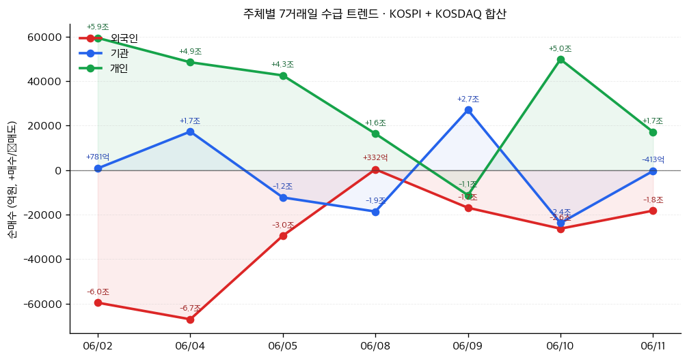
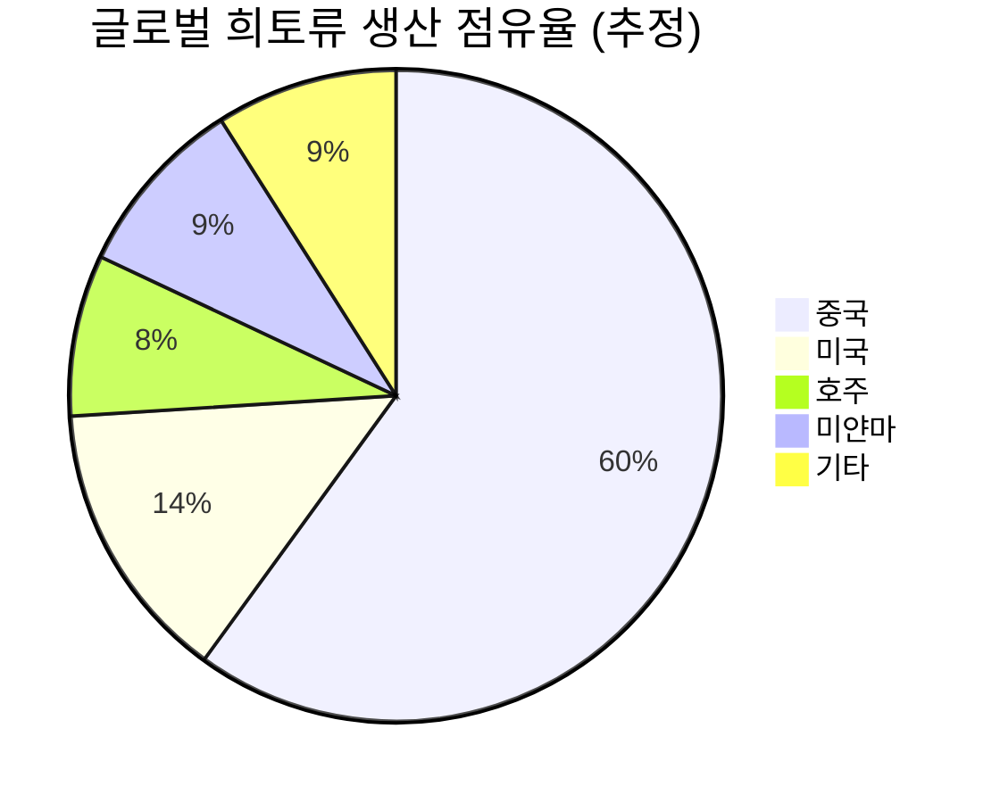

# 📊 모닝 브리핑 — 2026년 6월 12일 (금)

> **🟢 Risk-On (조건부)** — 중동 긴장 완화로 반등했으나, 인플레이션·ECB 긴축·기술주 변동성이 상단을 제한
> - **매크로**: 5월 미국 CPI YoY +4.2% (2023년 4월 이후 최고), ECB 3년 만에 금리 인상 단행
> - **리스크**: 3대 지수 반등 마감 / AI 기술주 변동성 확대 (오라클·슈퍼마이크로 급락)
> - **시그널**: ① 이란 리스크 프리미엄 해소 → 에너지·방산 단기 리레이팅 가능 ② 스페이스X 상장 → 기술주 유동성 일시 흡수 경계

---

## 시장 스냅샷

### 주요 지수
| 지수 | 종가 | 등락 | 52주 위치 |
|------|------|------|----------|
| S&P 500 | 7,394.30 | +127.31 (+1.8%) | █████████████████▍░░ 87% (5,968–7,610) |
| 나스닥 | 25,809.66 | +640.16 (+2.5%) | ████████████████▋░░░ 83% (19,407–27,094) |
| 다우존스 | 50,848.75 | +929.97 (+1.9%) | ██████████████████▌░ 92% (42,172–51,562) |
| 코스피 | 7,730.82 | -366.11 (-4.5%) | ████████████████▍░░░ 82% (2,895–8,801) |
| 코스닥 | 951.63 | -16.18 (-1.7%) | ████████░░░░░░░░░░░░ 40% (769–1,226) |
| 닛케이 225 | 64,179.27 | -1237.36 (-1.9%) | █████████████████▎░░ 86% (37,834–68,402) |

### 매크로/원자재/크립토
| 항목 | 값 | 변동 | 52주 위치 |
|------|-----|------|----------|
| 미국 10Y | 4.46% | -0.08%p | ██████████████▎░░░░░ 71% (4–5) |
| 미국 2Y | 3.62% | -0.01%p | ███▏░░░░░░░░░░░░░░░░ 15% (4–4) |
| DXY | 99.68 | -0.27 (-0.3%) | ████████████████▏░░░ 81% (96–101) |
| USD/KRW | 1,516.01 | -9.80 (-0.6%) | ████████████████▎░░░ 81% (1,348–1,554) |
| USD/JPY | 160.06 | -0.32 (-0.2%) | ███████████████████▋ 98% (143–160) |
| WTI 원유 | $85.68 | -4.8% | ██████████▌░░░░░░░░░ 53% (55–113) |
| 금 (Gold) | $4,230.30 | +3.0% | █████████▍░░░░░░░░░░ 47% (3,274–5,318) |
| 은 (Silver) | $67.47 | +4.4% | ████████░░░░░░░░░░░░ 40% (36–115) |
| BTC | $63,522 | +3.4% | ▉░░░░░░░░░░░░░░░░░░░ 4% (60,867–124,753) |
| VIX | 19.44 | -2.78 (-12.5%) | ██████▊░░░░░░░░░░░░░ 34% (13–31) |
| 10Y-2Y 스프레드 | 0.84%p | -0.07%p | — |

### 수급 동향 (최근 7 거래일, 06/02 ~ 06/11, KOSPI+KOSDAQ 합산)

**7일 누적**: 외국인 -21.7조 · 기관 -9,988억 · 개인 +22.3조

---
⚠️ 시장 스냅샷은 시스템에 의해 자동 삽입됩니다.

---

## 시장 센티먼트

  

    
🟢 Risk-On 52%

    
🔴 Risk-Off 48%

  

**핵심 판독**: 이란 폭격 위협 철회 소식이 오버나이트 가장 강한 촉매로 작용하며 3대 지수 반등을 이끌었다. 그러나 CPI 4.2% 서프라이즈와 ECB의 3년 만의 금리 인상은 '연준도 피벗 불가' 서사를 강화하고 있어, 이번 반등이 구조적 전환인지 베어마켓 랠리인지는 여전히 불분명하다. 기술주 내부에서는 AI 고평가 논란과 대규모 자금 조달 이슈로 종목 간 분화가 심화되고 있다.

**변곡 촉매**:
- 🔴 **다운**: 연준 6월 FOMC에서 추가 인상 신호 강화 → CPI 4.2% 확인 후 매파 전망 재점화
- 🟢 **업**: 미-이란 외교 협상 본격화 → 유가 안정 + 지정학 프리미엄 추가 해소

---

## 섹터별 센티먼트

| 섹터 | 센티먼트 | 한줄 평가 |
|------|---------|----------|
| 에너지 | 🟡 혼조 | 이란 긴장 완화로 유가 하방 압력, 단기 주가는 리스크 프리미엄 해소로 반등 가능 |
| 반도체/AI | 🟡 혼조 | HBM·AI 수요 장기 견조하나 오라클·슈퍼마이크로 급락이 섹터 전반 심리 위축 |
| 방산 | 🔴 단기 주의 | 중동 긴장 완화로 단기 모멘텀 약화, 구조적 수요는 유효 |
| 클라우드/엔터프라이즈 | 🔴 약세 | 오라클 200억 달러 증자 발표 → 대규모 희석 우려로 관련주 동반 하락 |
| 바이오/헬스케어 | 🟢 긍정 | 미국의 대중국 바이오 투자 규제 강화 → K바이오 반사수혜 기대감 부각 |
| 희토류/핵심광물 | 🟢 강세 | 일본 대중국 희토류 의존 탈피 가속, 공급망 다변화 수혜 기대 |
| 소비재/유통 | 🔴 약세 | CPI 4.2% 확인으로 실질 구매력 압박 지속, 경기 민감 소비 위축 우려 |
| 금융 | 🟡 중립 | ECB 금리 인상은 은행 NIM 개선 호재이나, 경기 침체 우려와 상쇄 |

---

## 오버나이트 핵심 이벤트

### 1. 트럼프 이란 폭격 위협 철회 → 3대 지수 일제 반등

- **요약**: 트럼프 대통령이 이란에 대한 군사적 위협 수위를 낮추며 중동 지정학 리스크가 완화되었고, 6월 11일(현지시간) 미국 3대 지수가 일제히 반등 마감했다.
- **So What**: 전일 시장에 누적되어 있던 지정학 리스크 프리미엄이 단번에 해소되며 광범위한 매수세를 촉발했다. 그러나 이는 구조적 상승 요인이 아닌 '리스크 해소'에 따른 기계적 반등으로, 펀더멘털(CPI·금리) 우려가 해결되지 않는 한 상승 지속력에는 한계가 있다.
- **크로스 임팩트**: 에너지 섹터(유가 하방), 방산주(단기 모멘텀 약화), 전체 지수(단기 Risk-On)

### 2. 5월 미국 CPI 전년 대비 +4.2% — 2023년 4월 이후 최고치

- **요약**: 6월 10일(현지시간) 발표된 5월 미국 CPI가 전년 대비 +4.2%를 기록하며 시장 예상치를 상회, 인플레이션 재가속 우려를 재점화했다.
- **So What**: 연준의 금리 인하 기대를 더욱 뒤로 미루는 동시에, 추가 인상 가능성까지 제기되는 환경이 조성됐다. 실질 금리 상승 압력은 장기 듀레이션 자산(고밸류에이션 기술주, 채권)에 구조적 역풍으로 작용하며, 특히 DCF 민감도가 높은 AI·성장주의 밸류에이션 재조정 압력을 높인다.
- **크로스 임팩트**: 국채금리 상승, 성장주 밸류에이션 압박, 달러 강세 지지, 금 약세 요인

### 3. 오라클 200억 달러 자금 조달 + 슈퍼마이크로 70억 달러 신주 발행 → 기술주 급락

- **요약**: [[오라클(ORCL)]]이 200억 달러 규모의 자금 조달을 발표하고, [[슈퍼마이크로컴퓨터(SMCI)]]가 70억 달러 규모의 신주 발행 계획을 공시하며 두 종목이 급락했다.
- **So What**: 대규모 증자는 단기적으로 주당 가치(EPS) 희석 우려를 촉발한다. 그러나 자금 조달의 목적이 AI 데이터센터 투자 확대라면, 이는 장기적으로 클라우드·AI 인프라 수요가 공급보다 빠르게 증가하고 있다는 방증이기도 하다. 시장이 단기 희석에 반응했다면, 투자자는 오히려 AI 인프라 사이클의 진행 단계를 재점검할 필요가 있다.
- **크로스 임팩트**: AI 서버/인프라 섹터 단기 약세, 데이터센터 수혜 장비주([[엔비디아]], [[AMD]]) 간접 영향

### 4. ECB, 3년 만에 기준금리 인상 단행

- **요약**: 유럽중앙은행(ECB)이 3년 만에 기준금리를 인상하며 전 세계 주요 중앙은행의 긴축 기조에 동참했다.
- **So What**: ECB의 금리 인상은 글로벌 유동성 긴축이 미국에 국한된 현상이 아님을 확인시켜 준다. 유로존 국채 금리 상승 → 글로벌 채권 금리 동반 상승 압력 → 위험자산 전반의 할인율 상승으로 이어지는 연쇄 효과가 나타날 수 있다. 특히 이머징마켓 채권과 통화에 달러 강세 + 유로 금리 상승의 이중 압박이 가해진다.
- **크로스 임팩트**: 유럽 금융주 단기 수혜, 유로존 성장주 압박, EM 통화·채권 약세 우려

---

## 오늘의 일정

| 시간(한국) | 이벤트 | 중요도 | 관련 섹터/종목 |
|-----------|--------|--------|--------------|
| 오늘 밤 (6/12) | [[스페이스X]] 상장 (시장 내 거래 개시 예정) | ⭐⭐⭐⭐ | 기술주·우주항공 전반, [[팔란티어]], [[로켓랩]] |
| 오늘 밤 (6/12) | 미국 6월 미시간대 소비자심리지수 (예비치) | ⭐⭐⭐ | 소비재, 전 종목 |
| 다음 주 (6/17~18) | FOMC 정례회의 | ⭐⭐⭐⭐⭐ | 전 종목, 채권, 달러 |

> [!warning] ⭐⭐⭐⭐⭐ FOMC 시나리오 분기
> - **동결 + 비둘기 신호**: 성장주 랠리 재개, 달러 약세, 금 반등 가능
> - **동결 + 매파 신호 유지**: CPI 4.2% 확인 → "Higher for Longer" 서사 강화, 기술주 재차 하락 압력
> - **인상 결정**: 저확률이나 발생 시 전 자산군 급락 트리거

---

## 테마 시그널

> [!abstract] 오늘의 테마: **희토류 지정학 — "중국이 스위치를 끄면 어떤 일이 벌어지는가: 희토류 무기화와 공급망 다변화의 투자 지도"**

### 왜 지금 이 테마인가

지난 일주일 사이 희토류 시장에서 교과서적인 지정학 시나리오가 현실로 나타났다. 중국이 대만 문제와 관련한 일본 총리 발언에 대한 보복으로 일본에 대한 희토류 수출을 **80% 이상** 삭감했다. 동시에 미국 국방부는 BYD·알리바바·바이두 등 약 20개 중국 기업을 군사 연계 명단에 추가했다. 희토류는 단순한 원자재가 아니다. F-35 전투기, 이지스 레이더, EV 구동 모터, MRI 기기, 스마트폰 — 현대 문명의 핵심 장치 대부분이 희토류 없이는 작동하지 않는다.

### 희토류란 무엇이고, 왜 중국이 독점하는가

희토류(Rare Earth Elements, REE)는 란타넘(La)부터 루테튬(Lu)까지 15개 원소에 스칸듐·이트륨을 더한 17개 원소군이다. '희귀하다'는 이름과 달리 지각에 비교적 풍부하게 존재하지만, **채산성 있는 농도로 분리·제련하는 것이 극도로 어렵고 환경 오염이 심각**하다.

더 중요한 것은 **채굴이 아니라 제련(Processing)의 독점**이다. 미국이 마운틴패스(Mountain Pass) 광산에서 희토류 원광을 채굴하더라도, 이를 분리·정제하는 공정의 약 85~90%가 중국에 집중되어 있다. 즉, 원광을 캐도 중국을 거치지 않으면 최종 소재로 만들 수 없는 구조다.

| 구분 | 중국의 통제력 | 대체 가능성 |
|------|------------|-----------|
| 채굴 | 🟡 60% 점유 (하락 중) | 🟢 호주·미국·브라질 확대 중 |
| 분리·정제 | 🔴 85~90% 독점 | 🔴 5~10년 이상 소요 |
| 합금·자석 제조 | 🔴 90%+ 독점 | 🔴 기술 장벽 높음 |
| 영구자석(NdFeB) | 🔴 중국이 시장 지배 | 🔴 일본 외 대안 부재 |

### 중국의 희토류 무기화 — 이번이 처음이 아니다

<strong>2010년 센카쿠(댜오위다오) 사태</strong>: 중국은 일본과의 영토 분쟁 과정에서 희토류 수출을 사실상 전면 중단했다. 당시 네오디뮴 가격은 6개월 만에 <strong>10배</strong> 폭등했고, 일본 제조업계는 공황 상태에 빠졌다.

<strong>2019년 미중 무역전쟁</strong>: 시진핑 주석이 희토류 생산 기지를 직접 방문하며 "희토류는 협상 카드"라는 메시지를 노골적으로 내비쳤다. 실제 수출 규제는 이뤄지지 않았으나 시장은 크게 요동쳤다.

<strong>2026년 현재</strong>: 일본에 대한 80% 이상 수출 삭감. 이번에는 실제 행동으로 옮겼다. 중국이 '시범 타격'을 단행한 것으로 해석할 수 있다.

### 탈중국 공급망 다변화의 현실 — "쉽다"와 "가능하다" 사이의 긴 거리

이번 위기에서 각국의 대응이 흥미롭다:

| 국가 | 대응 | 현실적 한계 |
|------|------|-----------|
| 🇯🇵 일본 | 신에쓰화학공업 후쿠이현 제련 설비 신규 건설, 호주·인도 다변화 | 풀가동까지 3~5년 필요 |
| 🇺🇸 미국 | 국내 제련 시설 투자, IRA 핵심광물 조항 | 제련 기술 인력 부족 |
| 🇧🇷 브라질 | 세계 2위 매장량 보유, 개발 추진 | 규제기관 예산 부족·인허가 지연 |
| 🇰🇷 한국 | 몽골과 CEPA 협상 재개, 핵심광물 협력 강화 | 자체 광산 없음, 의존도 높음 |
| 🇦🇺 호주 | 라이나스(Lynas) 미국 제련소 건설 | 규모 아직 중국 대비 미미 |

> [!warning] 핵심 패러독스
> "탈중국 희토류 공급망을 만들기 위해 필요한 장비와 소재 — 상당수가 중국산이다." 희토류 제련 장비, 특수 화학물질, 자석 제조 장비 등에서 중국 의존도가 높아 공급망 다변화 자체가 중국의 협조 없이는 어렵다는 아이러니가 존재한다.

### 투자 함의 — 어디서 기회를 찾을 것인가

희토류 공급망 위기는 **단기 트레이딩 이슈가 아니라 10년짜리 구조 변화**다. 그 투자 지도를 3개 레이어로 나눠 볼 수 있다:

**레이어 1: 광산/채굴 (가장 직접적, 가장 변동성 높음)**
- [[MP Materials]](미국 마운틴패스 광산 운영), [[Lynas Rare Earths]](호주 최대 희토류 기업)
- 특징: 원자재 가격에 직접 연동, 지정학 이벤트에 급등락

**레이어 2: 소재/가공 (진입장벽 높고 장기 수혜 명확)**
- [[신에쓰화학공업]](일본, 희토류 영구자석 세계 1위), [[TDK]], [[히타치 메탈]]
- 특징: 제련·가공 기술이 핵심 해자, 일본 기업들이 유일한 대안

**레이어 3: 응용/수혜 (간접 수혜, 공급 리스크 피할 기업)**
- EV 모터 제조사 중 비중국 자석 공급망 확보 기업
- 방산 전자장비 내재화 기업 (희토류 재활용 기술 보유 기업 포함)

단기 트레이딩: 광산주 30%

중기 구조 수혜: 소재·가공 50%

장기 테마: 재활용·대체 20%

### 모니터링 포인트

1. **중국의 수출 규제 범위 확대 여부**: 일본 → 한국·미국·EU로 확대 시 전혀 다른 국면 진입
2. **라이나스 미국 제련소 가동 일정**: 미국 내 비중국 제련 능력 확보의 분수령
3. **NdFeB 영구자석 현물 가격**: 공급 충격의 실물 전달 경로 선행 지표
4. **IRA 핵심광물 조항 이행 현황**: 미국 내 희토류 공급망 투자에 대한 세제 혜택 실행 여부

---

## 대가의 시선

> [클래식]
> "투자에서 가장 위험한 네 단어는 '이번에는 다르다'이다."
> — **존 템플턴 경(Sir John Templeton)**, 템플턴 펀드 창립자

**맥락**: 이번 희토류 공급망 위기와 CPI 재가속 국면에서 많은 투자자들이 "AI 때문에 이번 인플레이션은 다르다", "공급망 이슈는 기술로 해결된다"는 낙관론에 기대고 있는 상황에서 이 발언의 무게를 되새길 필요가 있다.

**투자 함의**: 1970년대 오일쇼크, 2010년 중국 희토류 수출 중단, 2022년 러시아 에너지 무기화 — 역사는 반복적으로 "핵심 자원의 지정학화"가 예상보다 심각하게, 예상보다 오래 지속됨을 보여줬다. "이번엔 빠르게 해결될 것"이라는 낙관적 서사에 경계심을 유지하고, 공급망 다변화가 실제로 완성되기까지의 긴 시간을 가격에 반영해야 한다.

---

## 투자 레슨

> [!abstract] 오늘의 레슨: **소로스의 재귀성 이론(Reflexivity) — "시장은 현실을 반영하는 거울이 아니라, 현실을 만들어내는 참여자다"**

### 핵심 개념: 거울이 아니라 행위자

전통 금융 이론은 시장이 '효율적'이라고 가정한다. 즉, 가격은 기업의 실제 가치(펀더멘털)를 정확히 반영한다는 것이다. 조지 소로스는 이 전제를 정면으로 거부했다.

소로스의 **재귀성 이론(Reflexivity Theory)**의 핵심 명제는 단 하나다:

<strong>"시장 참여자의 인식이 펀더멘털에 영향을 미치고, 변화된 펀더멘털이 다시 참여자의 인식을 바꾼다. 이 피드백 루프가 현실 자체를 변형시킨다."</strong>

다시 말하면, 가격은 **원인인 동시에 결과**다. 주가가 오르면 기업은 더 낮은 비용으로 자금을 조달할 수 있고, 인재를 끌어모으고, M&A를 통해 성장을 가속할 수 있다. 주가 상승이 실제로 기업 가치를 높이는 것이다. 반대로, 주가가 하락하면 신용등급이 떨어지고, 인재가 이탈하고, 비즈니스 파트너가 등을 돌린다. 하락이 또 다른 하락의 원인이 된다.

### 재귀성의 두 국면

소로스는 재귀성이 항상 같은 방향으로 작동하지 않는다고 설명했다. 시장은 **자기강화(Self-Reinforcing)** 국면과 **자기파괴(Self-Defeating)** 국면 사이를 오간다:

| 국면 | 메커니즘 | 대표 사례 |
|------|---------|---------|
| **자기강화 상승** | 낙관적 기대 → 주가 상승 → 펀더멘털 개선 → 기대 재강화 | 닷컴 버블, AI 랠리 초기 |
| **자기강화 하락** | 비관적 기대 → 주가 하락 → 실제 손상 → 비관 재강화 | 2008년 금융위기, SVB 뱅크런 |
| **자기파괴** | 추세가 너무 멀리 가면 펀더멘털과 괴리가 역방향 힘 생성 | 버블 붕괴, 패닉 저점 |

소로스는 이 구조를 이용해 트레이드한다. **"추세가 얼마나 잘못된 방향으로 가고 있는지"가 아니라, "그 잘못된 추세가 얼마나 더 지속될 수 있는지"를 묻는 것**이 그의 방법론이다.

### 역사적 사례: 영국 파운드 공매도와 태국 밧 위기

**1992년 파운드 공격**: ERM(유럽환율메커니즘)에서 파운드는 독일 마르크에 고정되어 있었다. 영국 경제는 고금리를 감당할 체력이 없었지만, 영국 정부는 "절대 평가절하 없다"고 선언했다. 소로스는 이 선언 자체가 재귀적으로 취약하다는 것을 간파했다.

소로스의 핵심 통찰: 정부의 '방어 의지'도 시장이 만들어낸 기대에 의해 시험받는다 85%

그는 100억 달러 이상을 파운드 공매도에 베팅했고, 시장은 영란은행의 방어 능력 자체를 소진시키며 파운드를 ERM에서 강제 이탈시켰다. "정부는 절대 할 수 없다"는 믿음이 재귀적으로 현실을 만든 것이다.

### 오늘 시장에 적용: 세 가지 재귀 루프

지금 시장에는 세 개의 강력한 재귀 루프가 작동하고 있다:

**루프 1: AI 투자 → 자금 조달 → AI 투자의 재귀 (현재 작동 중)**

오라클이 200억 달러, 슈퍼마이크로가 70억 달러를 조달한다. 시장은 이를 '희석'이라고 읽어 주가가 하락했다. 그런데 다시 생각해보자 — 이 기업들이 이 규모로 자금을 조달할 수 있다는 것 자체가 AI 인프라에 대한 시장의 믿음을 반영한다. 만약 AI 신화가 흔들린다면, 이런 규모의 자금 조달 자체가 불가능해진다. 지금은 아직 자기강화 국면이다.

**루프 2: 인플레이션 기대 → 실제 임금/가격 → 인플레이션 (위험 국면)**

CPI 4.2%가 발표되면, 소비자들은 더 빠르게 가격이 오를 것이라고 예상하고 지금 더 사려 한다. 기업들은 "어차피 오를 테니" 가격을 올린다. 인플레이션 기대가 인플레이션을 만들어내는 재귀 루프다. 연준이 이 루프를 끊기 위해 금리를 올리는 것이고, 그것이 시장의 최대 리스크다.

**루프 3: 중국 희토류 무기화 → 공급망 다변화 투자 → 중국 의존 약화 → 중국의 더 공격적 무기화**

중국이 희토류를 무기화할수록, 각국은 더 빠르게 자립화에 투자한다. 자립화가 진행될수록 중국의 협상 레버리지는 줄어든다. 이를 인지한 중국은 자립화가 완성되기 전에 더 강하게 압박한다. 이 루프의 어느 지점에 있느냐에 따라 희토류 관련주의 투자 가치가 달라진다.

### 재귀성 이론으로 투자 결정하기

> [!tip] 소로스 프레임워크: 세 가지 질문
> 1. **지금 어떤 재귀 루프가 작동하고 있는가?** (자기강화 상승/하락/전환점)
> 2. **시장의 지배적 편향(Prevailing Bias)은 무엇인가?** (시장이 믿고 있는 잘못된 가정)
> 3. **그 편향이 얼마나 더 갈 수 있는가?** (타이밍이 핵심 — 너무 일찍 역방향 베팅은 파산)

재귀성 이론의 가장 어려운 점은, "틀린 방향"을 알아도 **타이밍이 맞지 않으면 파산한다**는 것이다. 소로스 본인도 "나는 틀렸을 때를 빨리 인정하고 포지션을 청산하는 능력이 옳았을 때의 베팅 규모보다 더 중요했다"고 말했다.

**오늘 실천 방법**: 지금 보유한 포지션에 대해 "내가 기대하는 방향과 반대 방향의 재귀 루프는 없는가?"를 스스로에게 물어보라. CPI 4.2%를 보고 "인플레이션은 곧 잡힐 것"이라고 믿는다면, 그 믿음을 강화하는 데이터만 보고 있지 않은지 점검하라.

---

## 오늘 하나만 기억한다면

> [!verdict] 오늘 하나만 기억한다면
> **"반등은 지정학 프리미엄 해소일 뿐, CPI 4.2%와 ECB 인상이 만든 '고금리 더 오래' 현실은 바뀌지 않았다. 희토류 무기화가 증명하듯, 공급망 리스크는 해결이 아니라 관리의 대상이다."**