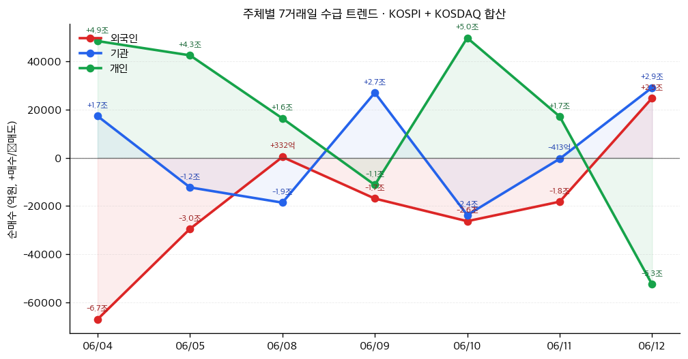
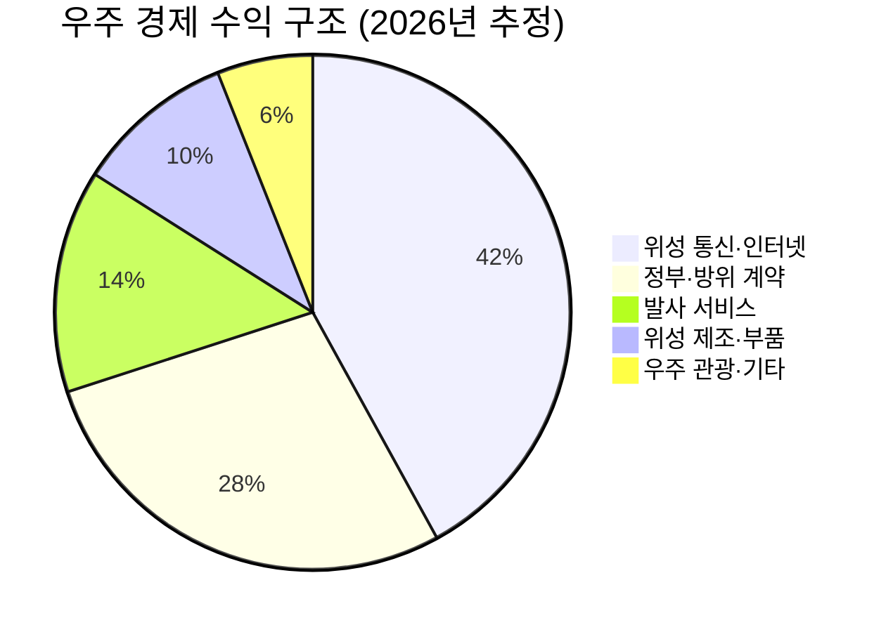

# 📊 모닝 브리핑 — 2026년 6월 15일 (월)

> **🟢 Risk-On** — 지정학 완화 기대 + 대형 IPO 호재가 만든 상승 개장
> - **매크로**: 미-이란 협상 기대에 유가 하락 압력, 연준 6월 FOMC 금리 동결 전망 유지
> - **리스크**: S&P 500 일부 종목 52주 신저가 기록, VIX 수준 점검 필요
> - **시그널**: SpaceX 사상 최대 IPO 성공 → 기술·우주 섹터 리레이팅 가능성 / AI 수혜주 매도 후 반등 지속 여부

---

## 시장 스냅샷

### 주요 지수
| 지수 | 종가 | 등락 | 52주 위치 |
|------|------|------|----------|
| S&P 500 | 7,431.46 | +37.16 (+0.5%) | █████████████████▉░░ 89% (5,968–7,610) |
| 나스닥 | 25,888.84 | +79.18 (+0.3%) | ████████████████▉░░░ 84% (19,407–27,094) |
| 다우존스 | 51,202.26 | +353.51 (+0.7%) | ███████████████████▎ 96% (42,172–51,562) |
| 코스피 | 8,123.62 | +359.67 (+4.6%) | █████████████████▊░░ 89% (2,895–8,801) |
| 코스닥 | 1,029.05 | +32.12 (+3.2%) | ███████████▍░░░░░░░░ 57% (769–1,226) |
| 닛케이 225 | 66,020.04 | +1802.77 (+2.8%) | ██████████████████▌░ 92% (37,834–68,402) |

### 매크로/원자재/크립토
| 항목 | 값 | 변동 | 52주 위치 |
|------|-----|------|----------|
| 미국 10Y | 4.49% | +0.02%p | ███████████████░░░░░ 75% (4–5) |
| 미국 2Y | 3.62% | -0.00%p | ███░░░░░░░░░░░░░░░░░ 15% (4–4) |
| DXY | 99.75 | -0.11 (-0.1%) | ████████████████▌░░░ 82% (96–101) |
| USD/KRW | 1,518.21 | +0.83 (+0.1%) | ████████████████▌░░░ 82% (1,348–1,554) |
| USD/JPY | 159.76 | -0.37 (-0.2%) | ███████████████████▏ 96% (143–161) |
| WTI 원유 | $84.88 | -3.2% | ██████████▎░░░░░░░░░ 51% (55–113) |
| 금 (Gold) | $4,238.80 | +3.6% | █████████▌░░░░░░░░░░ 47% (3,274–5,318) |
| 은 (Silver) | $67.97 | +6.4% | ████████▏░░░░░░░░░░░ 41% (36–115) |
| BTC | $65,434 | +1.6% | █▍░░░░░░░░░░░░░░░░░░ 7% (60,867–124,753) |
| VIX | 17.68 | -1.76 (-9.1%) | ████▊░░░░░░░░░░░░░░░ 24% (13–31) |
| 10Y-2Y 스프레드 | 0.87%p | +0.03%p | — |

### 수급 동향 (최근 7 거래일, 06/04 ~ 06/12, KOSPI+KOSDAQ 합산)



**7일 누적**: 외국인 -13.3조 · 기관 +1.8조 · 개인 +11.1조

---
## 시장 센티먼트

<div style="background:#e0e0e0;border-radius:8px;overflow:hidden;margin:8px 0">
  <div style="display:flex;border-radius:8px;overflow:hidden;font-size:0.9em">
    <div style="background:#4CAF50;width:65%;padding:6px 10px;color:white">🟢 Risk-On 65%</div>
    <div style="background:#F44336;width:35%;padding:6px 10px;color:white">🔴 Risk-Off 35%</div>
  </div>
</div>

**핵심 판독**: 미-이란 평화 협상 기대감이 에너지 가격 하락과 주식 시장 상승을 동시에 견인하는 전형적인 지정학 완화 랠리 국면이다. SpaceX 나스닥 상장 성공은 투자 심리의 '위험 감수 의지'가 살아있음을 보여주는 시그널이다. 단, 52주 신저가 종목 존재는 랠리의 저변이 좁을 수 있음을 시사한다.

**변곡 촉매**:
- 🔴 **다운**: 미-이란 협상 결렬 또는 중동 리스크 재부각 → 유가 급등 + Risk-Off 전환
- 🟢 **업**: 6월 17일 FOMC에서 향후 금리 인하 신호 확인 → 성장주 추가 상승

---

## 섹터별 센티먼트

| 섹터 | 센티먼트 | 한줄 평가 |
|------|---------|----------|
| 우주·항공 | 🟢 강세 | SpaceX IPO 성공으로 민간 우주 생태계 전반 리레이팅 기대, 단기 급등 후 차익 실현 주의 |
| 반도체·AI | 🟢 강세 | 6월 5일 매도세 소화 후 반등 국면, Marvell S&P 500 편입으로 패시브 자금 유입 |
| 에너지 | 🔴 약세 | 미-이란 협상 기대에 유가 하락 압력, 협상 결렬 시 단기 반등 가능성 병존 |
| 금융 | 🟡 중립 | FOMC 동결 전망으로 순이자마진 압박 지속, 소비자 심리 반등은 긍정적 |
| 소비재 | 🟡 중립 | 휘발유 가격 완화로 소비 심리 개선 시그널, 실질 소득 회복까지는 시간 필요 |
| 이머징마켓 | 🟢 강세 | AI 수혜 기업(TSMC·삼성·SK하이닉스) 주도로 MSCI EM 지수 상승세, 달러 방향성이 변수 |

---

## 오버나이트 핵심 이벤트

### 1. SpaceX, 사상 최대 규모 IPO 성공
- **요약**: 2026년 6월 12일 나스닥 상장, 주당 135달러로 약 750억 달러를 조달하며 미국 IPO 사상 최대 규모를 기록했다.
- **So What**: 기술주 전반에 '위험 감수 의지' 시그널을 보내며 투자 심리를 끌어올리는 역할을 했다. 민간 우주산업에 대한 밸류에이션 기준선을 새로 설정함에 따라 경쟁 기업들의 재평가 논의가 촉발될 수 있다. 대규모 자금 조달 성공은 향후 우주·방위 관련 공급망 기업들의 수주 기대감으로 이어질 수 있다.
- **크로스 임팩트**: 우주·항공 섹터 직접 수혜, 기술주 전반 투자 심리 개선, 나스닥 지수 긍정적

### 2. 미국-이란 평화 협상 기대감 확산
- **요약**: 미-이란 협상 타결 임박 기대감이 확산되며 유가 하락 및 글로벌 주식 시장 동반 상승에 기여했다.
- **So What**: 중동 지정학 리스크가 완화될 경우 에너지 공급 우려가 줄어들며 유가 하락이 구조적으로 이어질 수 있다. 유가 하락은 소비자 인플레이션 완화 → 연준 정책 여력 확대 → 성장주 밸류에이션 재확장의 연쇄 효과를 낳을 수 있다. 다만 협상이 결렬될 경우 반작용이 크다는 점에서 이 랠리의 신뢰도 점검이 필요하다.
- **크로스 임팩트**: 에너지 섹터 약세, 항공·소비재 수혜, 이머징마켓 위험선호 개선

### 3. AI 관련주, 변동성 소화 후 반등 + Marvell S&P 500 편입
- **요약**: 6월 5일 AI 관련주 매도세 이후 6월 8일 반등이 확인됐으며, [[Marvell Technology]]가 S&P 500 지수에 편입됐다.
- **So What**: 단기 과열 해소 후 재진입한 매수세는 AI 구조적 성장 내러티브가 훼손되지 않았음을 시사한다. Marvell의 S&P 500 편입은 인덱스 추종 패시브 펀드의 강제 매수를 유발해 단기 가격 지지력을 제공한다. 이는 AI 반도체·네트워킹 생태계 전반에 긍정적 모멘텀으로 작용할 수 있다.
- **크로스 임팩트**: 반도체·AI 인프라 섹터 직접 수혜, 나스닥 100 지수 지지

### 4. 연준 6월 FOMC 금리 동결 전망 (6월 17일)
- **요약**: 연준은 6월 17일 FOMC에서 금리를 동결할 것으로 시장이 광범위하게 예상하고 있다.
- **So What**: 동결 자체보다 파월 의장의 향후 인하 경로 힌트가 이번 주 시장의 핵심 변수다. 비둘기파적 신호가 나올 경우 성장주와 장기 국채 모두 수혜를 받을 수 있다. 반대로 "더 오래 높게(Higher for Longer)" 기조가 재확인되면 밸류에이션 부담이 있는 기술주에 단기 조정 압력이 생길 수 있다.
- **크로스 임팩트**: 금리 민감 성장주, 리츠(REITs), 장기 국채 ETF 직접 영향

---

## 오늘의 일정

| 시간(한국) | 이벤트 | 중요도 | 관련 자산/섹터 |
|-----------|--------|--------|--------------|
| 화(16일) 새벽 3:00 | 미국 6월 FOMC 금리 결정 + 파월 기자회견 | ⭐⭐⭐⭐⭐ | 전 자산군, [[기술주]], [[리츠]], [[장기국채]] |
| 화(16일) 밤 9:30 | 미국 5월 소매판매 발표 | ⭐⭐⭐⭐ | [[소비재]], [[리테일 섹터]] |
| 수(17일) 밤 9:30 | 미국 5월 주택착공·건축허가 | ⭐⭐⭐ | [[건설주]], [[리츠]] |

> [!warning] ⭐⭐⭐⭐⭐ FOMC — 시나리오 분기
> **비둘기파 (금리 인하 시사)**: 성장주·이머징마켓 추가 상승, 달러 약세 → 현재 Risk-On 기조 강화
> **매파 (Higher for Longer 재확인)**: 기술주 밸류에이션 압박, 장기금리 상승 → 단기 조정 가능성
> **중립 (동결 + 모호한 포워드 가이던스)**: 변동성 일시 확대 후 방향 탐색 국면

---

## 테마 시그널

> [!abstract] 오늘의 테마: **민간 우주 경제(New Space Economy) — "SpaceX IPO가 쏘아 올린 것은 로켓만이 아니다: 우주 산업 밸류에이션 빅뱅과 투자 지도"**

### 왜 지금 이 테마인가

SpaceX가 나스닥에 상장하며 약 750억 달러를 조달했다. 이것은 단순한 대형 IPO 뉴스가 아니다. **우주 산업이 더 이상 국가 프로젝트나 벤처 테마가 아닌, 공개 자본시장에서 정당한 밸류에이션을 받는 '산업'으로 전환되는 역사적 변곡점**이다.

비교하자면, 인터넷 산업이 넷스케이프 IPO(1995년) 이후 공개 시장에서 본격적으로 거래되기 시작한 것처럼, 우주 산업도 지금 그 임계점을 넘어서고 있다.

---

### 구조적 분석: 왜 '지금'이 특별한가

**New Space Economy의 3단계 진화**

```
1단계 (2000~2015): 국가 독점 → SpaceX·블루오리진 등 민간 진입
2단계 (2015~2025): 발사 비용 혁명 → 팰컨9 재사용으로 kg당 발사비 90% 절감
3단계 (2025~ ): 상업화 임계점 → 스타링크 수익화, 우주 경제 생태계 성숙
```

| 구분 | 과거 (2010년대) | 현재 (2026년) |
|------|--------------|--------------|
| 발사 주체 | NASA·각국 우주청 독점 | SpaceX·Rocket Lab 등 민간 주도 |
| 비즈니스 모델 | 정부 계약 의존 | B2C(스타링크), 상업 위성, 우주 관광 |
| 수익성 | 적자 지속, 장기 투자 | 스타링크 흑자 전환, 반복 수익 구조 |
| 투자 접근 | VC·PE를 통한 간접 투자만 가능 | 공개 시장 직접 투자 가능 |
| 밸류에이션 기준 | 없음 (비교군 부재) | SpaceX IPO가 기준점 설정 |

> [!tip] 핵심 인사이트
> SpaceX IPO의 가장 중요한 의미는 **'밸류에이션 앵커 설정'**이다. 공개 시장에 비교군이 생겼다는 것은, 이후 모든 우주 관련 기업의 가격이 이 기준점을 참조해 형성된다는 의미다. IPO 직후에는 과대평가 또는 과소평가 모두 가능하며, 이 불확실성이 곧 투자 기회다.

---

### 우주 경제 생태계 지도 (투자 레이어별 분류)



**투자 접근 방식 — 레이어별 리스크/리턴**

| 레이어 | 특징 | 리스크 | 리턴 잠재력 | 투자 예시 |
|--------|------|--------|------------|---------|
| **인프라 (발사체·위성버스)** | 자본집약, 기술 해자 | 🔴 높음 | 🟢 매우 높음 | SpaceX, [[Rocket Lab]] |
| **통신 서비스 (스타링크류)** | 반복 수익, 구독 모델 | 🟡 중간 | 🟢 높음 | SpaceX, AST SpaceMobile |
| **위성 데이터·분석** | 소프트웨어 마진, 확장성 | 🟡 중간 | 🟢 높음 | [[Planet Labs]], [[Spire Global]] |
| **지상 장비·부품 공급망** | 안정적 수요, 낮은 변동성 | 🟢 낮음 | 🟡 중간 | [[Garmin]], [[Trimble]] |
| **방위·정부 계약** | 예측 가능한 현금흐름 | 🟢 낮음 | 🟡 중간 | [[Northrop Grumman]], [[L3Harris]] |

---

### 투자 함의: 무엇을 조심해야 하는가

**① IPO 직후 흥분을 경계하라**

역사적으로 대형 기술 IPO 직후 6~12개월은 변동성이 극심하다. 넷플릭스(2002년 IPO) 후 첫 해 주가는 공모가 대비 -30% 구간을 통과했지만 장기 보유자는 수백 배 수익을 거뒀다. SpaceX도 비슷한 패턴이 예상된다.

**② 직접 투자 vs. 공급망 투자**

SpaceX 자체에 직접 투자하는 것이 어렵거나 밸류에이션이 부담스럽다면, **'삽을 파는 회사들'**에 주목하는 전략이 유효하다. 발사체 부품, 위성 안테나 소재, 지상 제어 소프트웨어 등 B2B 공급망 기업은 상대적으로 낮은 밸류에이션에서 우주 성장을 향유할 수 있다.

**③ 스타링크 수익성이 핵심 변수**

SpaceX 밸류에이션의 상당 부분은 스타링크 구독 사업의 성장 기대에 기반한다. 이 사업의 가입자 증가 속도와 ARPU(가입자당 평균 수익)가 밸류에이션 정당성의 핵심 KPI다.

> [!warning] 리스크 경고
> 우주 산업 투자의 구조적 리스크는 **기술 실패와 규제 불확실성**이다. 발사 실패 한 번이 기업 가치에 미치는 영향은 일반 제조업과 비교할 수 없을 만큼 크다. 또한 궤도 위성 증가로 인한 우주 쓰레기(Space Debris) 문제는 장기적으로 운영 비용을 높일 수 있는 숨겨진 변수다.

---

### 모니터링 포인트

1. **스타링크 월별 가입자 수 공시** — SpaceX가 분기별로 공개하는 가입자 지표가 밸류에이션 유지의 핵심
2. **경쟁사 IPO 파이프라인** — Blue Origin, RocketLab 후속 기업들의 상장 움직임이 섹터 밸류에이션 희석 여부 결정
3. **NASA·미 국방부 계약 수주 현황** — 정부 수입원이 수익 안정성의 바닥 역할
4. **Starship 상업 운용 일정** — 완전 재사용 대형 발사체 상용화 시점이 비용 구조를 근본적으로 바꿀 게임체인저

---

## 대가의 시선

> "The best investment you can make is in a business that has a durable competitive advantage."
> ("당신이 할 수 있는 최고의 투자는, 지속 가능한 경쟁 우위를 가진 비즈니스에 투자하는 것이다.")
> — **워런 버핏 (Warren Buffett)**, 버크셔 해서웨이 회장 [클래식]

**맥락**: 버핏이 반복적으로 강조해온 '경제적 해자(Economic Moat)' 개념의 핵심 표현으로, 특정 매체와 날짜를 특정하기 어려운 그의 보편적 투자 철학이다.

**투자 함의**: SpaceX IPO를 보며 흥분하기 전에, 이 기업의 '지속 가능한 경쟁 우위'가 무엇인지를 먼저 물어야 한다. 재사용 발사체 기술, 스타링크의 전 지구적 네트워크 효과, 수직 통합 제조 역량 — 이것들이 진짜 해자인지, 아니면 지금의 리드가 시간이 지나면 따라잡힐 기술 격차인지를 분석하는 것이 투자 전 선행되어야 할 질문이다. 흥분이 클수록, 해자의 내구성을 더 냉정하게 따져야 한다.

---

## 투자 레슨

> [!abstract] 오늘의 레슨: **생존자 편향(Survivorship Bias) — "당신이 보는 성공 스토리는, 실패한 99개의 사체 위에 서 있다"**

### 핵심 개념: 보이는 것만 보면 틀린다

생존자 편향이란, **결과적으로 살아남은 것들만 관찰 대상에 포함시킴으로써 실제보다 성공 확률을 과대 추정하는 인지 오류**다. 실패한 사례들은 사라지기 때문에 눈에 보이지 않는다. 우리는 무의식적으로 '존재하는 것들'만 가지고 세상을 판단한다.

이 개념을 처음 엄밀하게 분석한 사람은 통계학자 **에이브러햄 왈드(Abraham Wald)**였다. 2차 세계대전 당시 미 군부는 귀환한 전투기의 총탄 피해 부위를 분석해 그 부분을 보강하려 했다. 그러나 왈드는 반대로 생각했다.

> "귀환한 비행기에 총탄 구멍이 없는 부위를 보강해야 한다. 그곳에 맞은 비행기들은 돌아오지 못했으니까."

---

### 투자에서 생존자 편향이 작동하는 3가지 방식

**① 뮤추얼 펀드 성과 착시**

매년 시장 수익률을 밑도는 펀드들은 폐쇄되거나 합병된다. 펀드 데이터베이스에는 살아남은 펀드만 남는다. 그래서 "평균적인 액티브 펀드"의 성과는 실제보다 좋아 보인다. 연구에 따르면 생존자 편향을 제거하면 평균 액티브 펀드 수익률은 연 1~2%p 이상 낮아진다.

**② 성공한 투자자의 조언이 위험한 이유**

워런 버핏, 피터 린치, 조지 소로스의 전략을 따라 하면 성공할 것 같지만, 같은 전략을 쓰다 망한 수천 명의 투자자는 책을 쓰지 않았다. 우리는 성공한 사람의 방법론을 배우지만, 그것이 '탁월한 전략'인지 '운이 좋은 결과'인지 구별하기 어렵다.

**③ 기술주 IPO 흥분의 함정**

| 구분 | 보이는 것 (생존자) | 보이지 않는 것 (실패자) |
|------|------------------|----------------------|
| 기억하는 IPO | 구글, 아마존, 넷플릭스 | 수천 개의 닷컴 기업 |
| 기억하는 VC 투자 | 세쿼이아의 애플·구글 투자 | 실패한 99개 포트폴리오 |
| 기억하는 공매도 | 버리의 빅쇼트 | 타이밍 실패로 손실 본 공매도 |
| 기억하는 IPO 투자 | SpaceX 같은 대형 성공 | 같은 시기 상장 후 -80% 종목들 |

---

### 오늘 시장 상황에 적용: SpaceX IPO가 정확히 이 사례

오늘 SpaceX의 성공적인 IPO 뉴스는 투자자들에게 강렬한 FOMO(Fear of Missing Out)를 유발한다. "대형 기술 IPO에 참여해야 했는데"라는 감정이 생겨난다.

그러나 생존자 편향 렌즈로 보면 질문이 달라진다:

<div style="border-left:4px solid #FF9800;padding-left:12px;margin:8px 0">
"SpaceX 수준의 야망을 가졌지만 실패한 우주 스타트업은 몇 개였는가? 그 투자자들은 어디에 있는가? 우리가 기억하지 못하는 이유는 단지 그들이 실패했기 때문이다."
</div>

이것은 SpaceX 투자를 하지 말라는 뜻이 아니다. **"성공 사례를 보고 확률을 판단하지 말라"**는 뜻이다. SpaceX가 성공한 이유는 Elon Musk의 기술적 통찰, 수직 통합 전략, 정부 계약 획득 능력, 그리고 수십 번의 실패를 버텨낸 자본력의 복합 산물이다. 이 모든 조건이 갖춰지지 않은 유사 기업에 '우주 붐이니까'라는 이유로 투자하는 것은 생존자 편향의 고전적인 희생자가 되는 것이다.

---

### 생존자 편향을 극복하는 실전 프레임워크

| 단계 | 질문 |
|------|------|
| **1. 모수를 확인하라** | 이 전략/섹터에 참여한 전체 기업/투자자는 몇이었나? |
| **2. 실패자를 찾아라** | 같은 조건에서 실패한 사례들의 공통점은 무엇인가? |
| **3. 차별점을 검증하라** | 이 성공 사례가 다른 실패 사례와 구별되는 '구조적' 이유가 있는가? 아니면 운인가? |
| **4. 베이스레이트를 적용하라** | 이 유형의 투자에서 역사적 성공률은 실제로 얼마인가? |

> [!tip] 오늘 실천 방법
> SpaceX IPO 뉴스를 보고 우주 관련 종목 투자를 고민한다면, 먼저 지난 10년간 우주 섹터 SPAC 및 IPO 종목들의 평균 수익률을 검색해 보라. 성공 스토리만큼이나 실패 스토리가 많다는 것을 확인하는 것이 첫 번째 실천이다.

---

## 오늘 하나만 기억한다면

> [!verdict] 오늘 하나만 기억한다면
> **"SpaceX IPO는 우주 경제의 문을 열었지만, 문 앞에 모인 군중의 흥분 속에서 생존자 편향을 경계하는 투자자만이 그 문 너머의 진짜 기회를 냉정하게 고를 수 있다."**