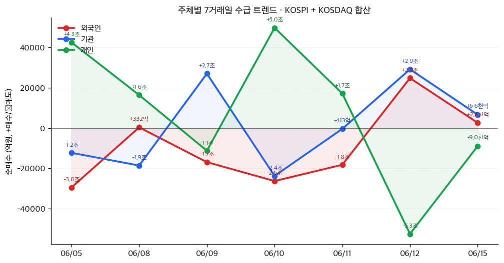
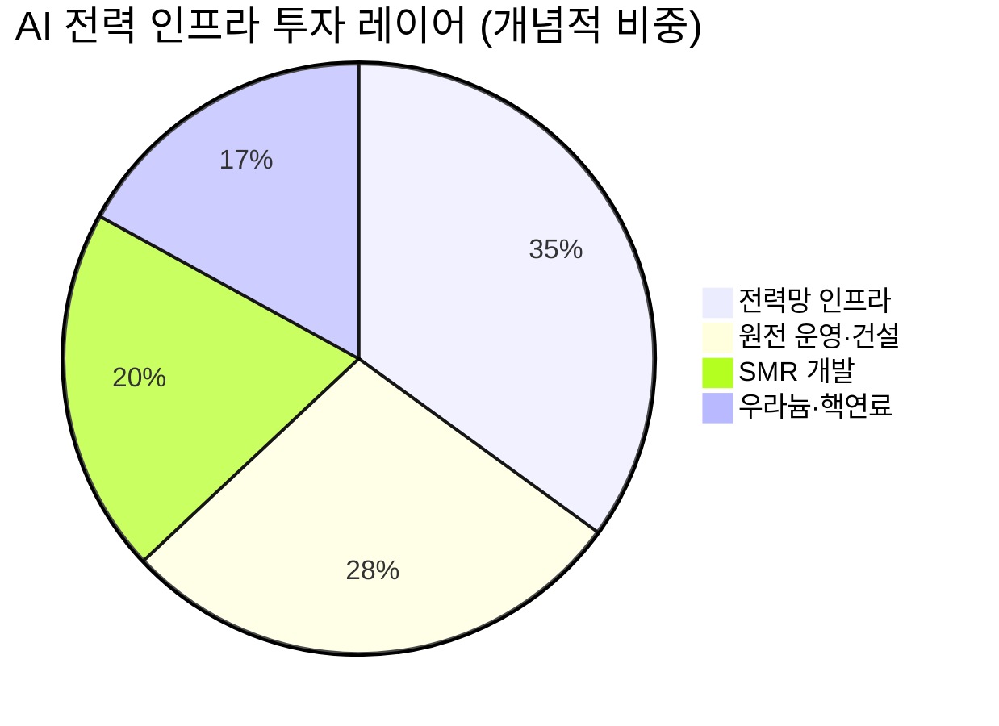

# 📊 모닝 브리핑 — 2026년 6월 16일 (화)

> **🟢 Risk-On** — 중동 평화 기대 + 대형 IPO 훈풍, 글로벌 위험선호 재점화
> - **매크로**: 미-이란 종전 협상 기대로 유가 하락, ECB 0.25%p 금리 인상 단행
> - **리스크**: 미국 5월 CPI +4.2% YoY — 인플레이션 재가속 우려 잠재
> - **시그널**: SpaceX 상장 첫날 ~20% 급등·시총 2조 달러 돌파 → 우주·AI 섹터 재점화; 코스피 5%대 급등 8,500선 회복

---

## 시장 스냅샷

### 주요 지수
| 지수 | 종가 | 등락 | 52주 위치 |
|------|------|------|----------|
| S&P 500 | 7,554.29 | +122.83 (+1.7%) | ███████████████████▍ 97% (5,968–7,610) |
| 나스닥 | 26,683.94 | +795.10 (+3.1%) | ██████████████████▉░ 95% (19,447–27,094) |
| 다우존스 | 51,671.03 | +468.77 (+0.9%) | ████████████████████ 100% (42,172–51,671) |
| 코스피 | 8,123.62 | +359.67 (+4.6%) | █████████████████▋░░ 88% (2,947–8,801) |
| 코스닥 | 1,029.05 | +32.12 (+3.2%) | ███████████▎░░░░░░░░ 57% (773–1,226) |
| 닛케이 225 | 66,020.04 | +1802.77 (+2.8%) | ██████████████████▍░ 92% (38,311–68,402) |

### 매크로/원자재/크립토
| 항목 | 값 | 변동 | 52주 위치 |
|------|-----|------|----------|
| 미국 10Y | 4.47% | -0.02%p | ██████████████▌░░░░░ 72% (4–5) |
| 미국 2Y | 3.62% | +0.00%p | ███░░░░░░░░░░░░░░░░░ 15% (4–4) |
| DXY | 99.67 | -0.08 (-0.1%) | ████████████████▏░░░ 80% (96–101) |
| USD/KRW | 1,513.94 | +4.44 (+0.3%) | ████████████████▏░░░ 80% (1,348–1,554) |
| USD/JPY | 160.29 | +0.16 (+0.1%) | ███████████████████▊ 99% (143–161) |
| WTI 원유 | $81.16 | -4.4% | █████████░░░░░░░░░░░ 45% (55–113) |
| 금 (Gold) | $4,331.00 | +2.8% | ██████████▍░░░░░░░░░ 52% (3,274–5,318) |
| 은 (Silver) | $70.06 | +3.2% | ████████▋░░░░░░░░░░░ 43% (36–115) |
| BTC | $66,415 | +1.1% | █▊░░░░░░░░░░░░░░░░░░ 9% (60,867–124,753) |
| VIX | 16.20 | -1.48 (-8.4%) | ███▏░░░░░░░░░░░░░░░░ 16% (13–31) |
| 10Y-2Y 스프레드 | 0.85%p | -0.02%p | — |

### 수급 동향 (최근 7 거래일, 06/05 ~ 06/15, KOSPI+KOSDAQ 합산)



**7일 누적**: 외국인 -6.3조 · 기관 +7,722억 · 개인 +5.3조

---
## 시장 센티먼트

<div style="background:#e0e0e0;border-radius:8px;overflow:hidden;margin:8px 0">
  <div style="display:flex;border-radius:8px;overflow:hidden;font-size:0.9em">
    <div style="background:#4CAF50;width:72%;padding:6px 12px;color:white;font-weight:bold">🟢 Risk-On 72%</div>
    <div style="background:#F44336;width:28%;padding:6px 12px;color:white;font-weight:bold;text-align:right">🔴 Risk-Off 28%</div>
  </div>
</div>

**핵심 판독**: 미-이란 종전 협상 기대감이 중동 리스크 프리미엄을 낮추면서 유가가 하락하고 위험자산 선호가 동시에 살아났다. SpaceX의 사상 최대 IPO 성공이 AI·우주 테마에 새로운 점화 재료를 제공하면서 코스피는 외국인·기관 동반 순매수에 힘입어 8,500선을 탈환했다. 다만 미국 5월 CPI +4.2%는 Fed 피벗 기대를 다시 후퇴시킬 수 있어 단기 Risk-On의 지속성은 인플레이션 경로에 달려 있다.

**변곡 촉매**:
- 🔴 **다운사이드**: 미국 CPI 재가속 + ECB 금리 인상 연속성 → 글로벌 긴축 재점화, 성장주 밸류에이션 재압박
- 🟢 **업사이드**: 미-이란 공식 휴전 합의 → 에너지 공급 안정 + 지정학 리스크 프리미엄 해소 → 전방위 Risk-On 가속

---

## 섹터별 센티먼트

| 섹터 | 센티먼트 | 한줄 평가 |
|------|---------|----------|
| 우주·방산 | 🟢 강세 | SpaceX IPO 훈풍으로 민간 우주 밸류에이션 리레이팅 시작, 발사체·위성 수혜 |
| AI·빅테크 | 🟢 강세 | SpaceX 수요 폭발이 AI 인프라 투자 확신으로 연결, 반도체·데이터센터 동반 강세 |
| 에너지(정유) | 🟡 혼조 | 미-이란 협상 기대로 유가 하락 압박, 단기 실적 우려 vs. 공급 안정화 긍정 |
| 원자력·전력 | 🟢 강세 | AI 전력 수요 구조적 확대, 핵에너지 재부각 — 정책 드라이버 가속 |
| 금융 | 🟡 관망 | ECB 금리 인상은 은행 NIM 개선 호재, 동시에 성장 둔화 리스크 상충 |
| 소비재·리테일 | 🔴 주의 | CPI +4.2% 재가속 시 실질 구매력 훼손, 하반기 소비 냉각 우려 |
| 로봇·자동화 | 🟡 관망 | 씨메스로보틱스 공급 계약 공시, 로봇 수요 실체화 신호 — 모멘텀 초기 단계 |

---

## 오버나이트 핵심 이벤트

### 1. 미-이란 평화 협상 기대감 — 유가 하락·글로벌 Risk-On 점화
- **요약**: 트럼프 대통령이 미-이란 평화 협상 타결 가능성을 언급, 호르무즈 해협 재개통 기대감이 확산되며 유가가 하락했다.
- **So What**: 유가 하락은 단기적으로 에너지 비용 절감 → 기업 마진 개선 기대로 연결된다. 동시에 지정학 리스크 프리미엄이 빠지면서 위험자산 전반으로 자금이 이동하는 전형적인 Risk-On 패턴이 발동됐다. 그러나 협상이 공식 합의로 이어지지 않으면 유가 반등 + 센티먼트 되돌림 변동성이 날카로울 수 있다.
- **크로스 임팩트**: 에너지 섹터 약세 / 항공·소비재·신흥국 채권 강세 / 달러 약세 압력

### 2. SpaceX 나스닥 상장 첫날 ~20% 급등 — 우주 경제 자본화 원년
- **요약**: SpaceX가 나스닥에 상장해 첫날 약 20% 급등, 시가총액 2조 달러를 돌파하며 역대급 IPO로 기록됐다.
- **So What**: 단순한 IPO 이벤트가 아니라 민간 우주 산업 전체에 '밸류에이션 앵커'가 생긴 것이다. SpaceX의 시총 참조 기준이 생기면서 발사체·위성·궤도 서비스 관련 비상장/상장 기업 전반의 재평가 요구가 커진다. 동시에 스타링크(위성 인터넷)·AI 데이터센터 사업 확장이 반도체·통신 인프라 수요의 또 다른 엔진으로 부각된다.
- **크로스 임팩트**: 우주 관련 ETF·스타트업 / 반도체(AI 칩) / 위성통신 강세; 국내 K-우주기업 관심 확대

### 3. ECB, G7 최초 금리 인상 단행
- **요약**: 유럽중앙은행이 예금금리를 0.25%p 인상하며 G7 중 처음으로 금리를 올렸다. 중동 분쟁 이후 에너지 가격 급등과 유로존 물가 상승이 배경이다.
- **So What**: ECB의 선제 긴축은 글로벌 금리 기대치를 전반적으로 높이는 신호로 작용한다. 유럽 은행주에는 NIM 개선 호재지만, 유럽 성장주·부동산에는 할인율 상승 압력이다. 더 중요하게는 "선진국 중앙은행이 인플레이션과 싸우기 위해 다시 긴축한다"는 내러티브가 Fed의 추가 인상 기대를 자극할 수 있다.
- **크로스 임팩트**: 유럽 금융주 강세 / 유로화 강세 가능성 / 달러 인덱스 변동성 / 글로벌 채권 금리 상방 압력

### 4. 미국 5월 CPI +4.2% — 인플레이션 재가속 경고등
- **요약**: 미국 5월 소비자물가(CPI)가 전년 대비 +4.2%, 근원 CPI +2.9%를 기록하며 2023년 초 이후 최고치를 나타냈다.
- **So What**: 시장이 기대하던 인플레이션 하향 안정 시나리오에 명백한 균열이 생겼다. Fed 피벗(금리 인하 전환) 기대가 뒤로 밀릴 수 있고, 높은 금리 장기화 가능성이 성장주 밸류에이션에 재압박 요인이 된다. 현재 Risk-On 분위기가 이 데이터를 충분히 소화했는지 점검이 필요하다.
- **크로스 임팩트**: 금(인플레이션 헤지 수요 강세) / 국채 금리 상방 / 성장주 밸류에이션 하방 압력 / 리츠(REIT) 약세

### 5. 코스피 5%대 급등, 8,500선 회복
- **요약**: 미-이란 종전 기대 + SpaceX 공모 자금 환불에 따른 수급 개선으로 코스피가 5%대 급등하며 8,500선을 회복했다. 외국인·기관이 동반 순매수했다.
- **So What**: SpaceX IPO 청약 자금이 환불되며 시중 유동성이 단기 회복된 점이 한국 시장에 직접적인 수급 개선 효과로 작용했다. 외국인 동반 순매수는 단순 반등이 아닌 글로벌 Risk-On 맥락에서의 이머징 재편입 신호일 수 있다. 다만 CPI 데이터 소화 이후 방향성 재확인이 필요하다.
- **크로스 임팩트**: [[삼성전자]] [[SK하이닉스]] 등 대형 수출주 / 코스닥 중소형 성장주 / 원/달러 환율 하락(원화 강세)

---

## 오늘의 일정

| 시간(한국) | 이벤트 | 중요도 | 관련 종목/섹터 |
|-----------|--------|--------|--------------|
| 오늘 장중 | 코스피·코스닥 외국인 수급 동향 확인 | ⭐⭐⭐ | [[삼성전자]] [[SK하이닉스]] 전 업종 |
| 오늘 장중 | 원/달러 환율 방향성 (Risk-On 지속 여부 바로미터) | ⭐⭐⭐ | 수출 대형주 전반 |
| 이번 주 | 미국 연준(Fed) 위원 발언 스케줄 (CPI +4.2% 이후 반응) | ⭐⭐⭐⭐ | 전 종목, 특히 성장주 |
| 이번 주 | 미-이란 협상 공식 발표 여부 (지정학 리스크 해소 분기점) | ⭐⭐⭐⭐ | 에너지 섹터, 항공, 소비재 |
| 이번 주 | ECB 후속 발언 (추가 긴축 시그널 여부) | ⭐⭐⭐ | 유럽 금융주, 달러 인덱스 |

> [!warning] ⭐⭐⭐⭐ 주목: Fed 위원 발언 (CPI 쇼크 이후)
> **시나리오 A (매파)**: "CPI +4.2%는 추가 인상 근거" → 국채금리 급등 + 성장주 급락
> **시나리오 B (중립)**: "일시적 요인 포함, 지켜볼 것" → 현재 Risk-On 유지
> 어느 발언이 나오느냐에 따라 오늘~내일 장의 방향이 결정된다.

---

## 테마 시그널

> [!abstract] 오늘의 테마: **AI 전력 수요와 핵에너지 르네상스 — "빅테크가 원자로를 사는 시대, 전력망은 새로운 반도체다"**

### 왜 지금 이 테마인가

SpaceX IPO가 AI 인프라 투자 사이클에 다시 점화를 걸었다. 스타링크 위성망 + AI 데이터센터를 동시에 운영하는 SpaceX의 비즈니스 모델은 "AI가 전력을 얼마나 먹는가"라는 질문을 더욱 선명하게 만든다. 이미 [[Microsoft]], [[Google]], [[Amazon]]은 원전 직접 구매 또는 장기 전력 구매 계약(PPA)에 나섰고, 각국 정부는 핵에너지 확대 정책을 경쟁적으로 발표하고 있다. 이 테마는 단순한 에너지 전환이 아니라 **AI 인프라 투자의 필연적 귀결**이다.

---

### 구조적 분석: AI가 만들어낸 전력 수요 블랙홀

**AI 추론(Inference)의 전력 소비는 훈련(Training)보다 누적 규모가 더 크다**는 점이 핵심이다. ChatGPT 한 번의 쿼리는 구글 검색의 약 10배 전력을 소비한다고 알려져 있다. 전 세계에서 하루 수십억 건의 AI 쿼리가 처리된다고 가정하면, 이는 중소 국가 하나의 전력 소비에 맞먹는 규모다.

```
AI 전력 수요 구조
─────────────────────────────────────────────
훈련(Training): 일회성, 대규모 → GPU 클러스터 집중
─────────────────────────────────────────────
추론(Inference): 24/365 상시 구동 → '기저 부하(Base Load)' 필요
─────────────────────────────────────────────
기저 부하의 특성: 안정적·지속적·예측 가능한 전력 공급 필수
     ↓
재생에너지(태양광·풍력)의 간헐성(Intermittency)과 구조적 불일치
     ↓
원자력 = 유일한 탄소 제로 기저 부하 솔루션
```

| 전원 유형 | 기저 부하 적합성 | 탄소 배출 | 설비 이용률 | AI 빅테크 채택 현황 |
|-----------|---------------|----------|-----------|-----------------|
| 원자력 | 🟢 최적 | 🟢 제로 수준 | ~90% | 🟢 계약 급증 |
| LNG 복합 | 🟡 가능 | 🟡 중간 | ~60% | 🟡 과도기 사용 |
| 태양광 | 🔴 부적합 | 🟢 제로 | ~20% | 🔴 보조 역할 |
| 풍력 | 🔴 부적합 | 🟢 제로 | ~35% | 🔴 보조 역할 |

---

### 투자 지도: 수혜 레이어 구조

이 테마의 투자 기회는 단일 섹터가 아닌 **레이어드(Layered) 구조**로 펼쳐진다.

**Layer 1 — 원전 운영사 및 유틸리티**
기존 원전을 보유하거나 신규 원전 허가를 받은 유틸리티는 장기 PPA 계약으로 안정적 현금흐름을 확보한다. AI 빅테크가 원전 전력을 직접 구매하는 계약이 늘어날수록 전력 가격 협상력이 유틸리티 측으로 이동한다.

**Layer 2 — 소형모듈원자로(SMR, Small Modular Reactor)**
기존 대형 원전(1,000MW+)은 건설에 10~15년이 걸린다. 빅테크는 더 빠른 솔루션이 필요하다. SMR(100~300MW급)은 모듈화로 공장에서 제작 → 현장 조립이 가능해 3~5년 내 가동이 목표다. [[NuScale Power]], [[TerraPower]], [[Oklo]] 등이 이 공간에서 경쟁한다.

**Layer 3 — 핵연료 및 우라늄**
원전 확대 → 우라늄 수요 증가는 선형 관계다. 그러나 우라늄 채굴·농축은 수요 증가에 비해 공급 반응이 극도로 느리다(신규 광산 가동까지 7~10년). 이 공급 경직성이 우라늄 가격의 구조적 상방 압력을 만든다.

**Layer 4 — 전력망 인프라(Hidden Winner)**
원전이 늘어도 전력을 AI 데이터센터까지 전달하는 **송배전망**이 병목이다. 미국·유럽·한국 모두 수십 년 된 노후 전력망을 AI 시대에 맞게 업그레이드해야 한다. 변압기, 케이블, 고압직류(HVDC) 설비 수요가 급증 중이다.



---

### 한국 맥락: 전력망이 산업 경쟁력이 되는 시대

한국은 반도체·AI 데이터센터 클러스터를 국가 전략으로 육성 중이다. 그런데 데이터센터 1GW는 원자력 발전소 1기가 공급하는 전력에 해당한다. 현재 한국의 전력망 및 원전 정책이 AI 인프라 유치의 선결조건이 되는 구조다.

> [!tip] 핵심 인사이트
> **AI 투자 테마의 진짜 병목은 GPU가 아니라 전력이다.** 엔비디아 칩을 사더라도 전력이 없으면 가동할 수 없다. "전력망은 새로운 반도체"라는 명제는 단순한 수사가 아니라 구조적 사실이다. 이 테마에서 수혜는 AI 기업보다 **전력·원전 인프라 공급망**에 더 오래, 더 안정적으로 남는다.

---

### 모니터링 포인트

| 지표 | 의미 | 주기 |
|------|------|------|
| 우라늄 현물 가격 (Cameco 기준) | 원전 확대 수요 선행 지표 | 주간 |
| 미국 SMR 허가 현황 (NRC) | 상업화 속도 가늠 | 월간 |
| 빅테크 전력 PPA 계약 규모 | AI 데이터센터 전력 수요 실체화 | 분기 |
| 한국 전력 수급 계획(KPX) | 국내 원전·전력망 투자 방향 | 분기 |
| 전력용 변압기 납기 | 전력망 인프라 병목 현황 | 분기 |

---

## 대가의 시선

> "The stock market is filled with individuals who know the price of everything, but the value of nothing."
> *(주식시장은 모든 것의 가격은 알지만 가치는 아무것도 모르는 사람들로 가득 차 있다.)*
> — **필립 피셔(Philip Fisher)**, 『Common Stocks and Uncommon Profits』 [클래식]

**맥락**: 피셔는 성장주 투자의 아버지로, 단기 주가 움직임보다 기업의 장기적 경쟁력과 수익 잠재력을 꿰뚫어 보는 '정성적 분석(Scuttlebutt Method)'을 강조했다.

**투자 함의**: 오늘 SpaceX가 첫날 ~20% 급등하며 시총 2조 달러를 돌파했다. 시장은 이 '가격'을 즉각 반영했지만, "2조 달러라는 가치가 정당한가"라는 질문은 전혀 다른 문제다. 스타링크의 수익화 속도, AI 데이터센터 사업의 실현 가능성, 재사용 발사체의 원가 경쟁력 — 이것들이 가치의 핵심이다. 우주 테마 훈풍을 타고 동반 급등하는 관련주를 볼 때, 지금 움직이는 것이 '가격'인지 '가치'인지 먼저 물어야 한다.

---

## 투자 레슨

> [!abstract] 오늘의 레슨: **앵커링 편향(Anchoring Bias) — "왜 투자자는 고점을 기억하고, 그 숫자에 발목 잡히는가"**

### 핵심 개념: 첫 숫자가 판단을 지배한다

1974년 심리학자 대니얼 카너먼(Daniel Kahneman)과 아모스 트버스키(Amos Tversky)는 실험 하나를 설계했다. 피실험자들에게 무작위로 돌린 룰렛 숫자(10 또는 65)를 보여준 뒤 "아프리카 국가가 UN에서 차지하는 비율(%)"을 물었다. 룰렛 숫자가 65를 보여준 그룹은 평균 45%를, 10을 보여준 그룹은 평균 25%를 답했다. 완전히 무관한 숫자가 판단을 왜곡한 것이다.

이것이 **앵커링(Anchoring)** — 맨 처음 접한 정보(앵커)가 이후의 모든 판단에 기준점이 되는 인지 오류다.

---

### 투자에서 앵커링이 작동하는 5가지 패턴

| 패턴 | 실제 사례 | 왜 위험한가 |
|------|---------|-----------|
| **52주 고점 앵커** | "전에 50만원이었으니 30만원은 싸다" | 현재 펀더멘털이 변했을 수 있음 |
| **매입가 앵커** | "본전 오면 팔겠다" | 매입가는 주가와 아무 관계 없음 |
| **IPO 공모가 앵커** | "공모가 아래니까 무조건 싸다" | 공모가 자체가 과대평가됐을 수 있음 |
| **목표주가 앵커** | 애널리스트 목표가가 기준점이 됨 | 목표가는 추정치, 현실과 다를 수 있음 |
| **역사적 PER 앵커** | "이 주식은 항상 PER 20에 거래됐다" | 산업 구조 변화로 적정 PER이 달라질 수 있음 |

---

### 오늘 시장이 정확히 이 사례

**SpaceX 공모가 앵커의 함정**이 지금 형성되고 있다. SpaceX가 첫날 ~20% 급등했다. 이 순간 투자자들의 머릿속에 두 개의 앵커가 동시에 박힌다:

1. **공모가 앵커**: "공모가 대비 이미 20% 올랐으니 비싸다"
2. **첫날 종가 앵커**: "지금 가격이 SpaceX의 기준 가격이다"

그리고 K-우주 기업들의 경우 "SpaceX 시총 2조 달러"가 섹터 전체의 밸류에이션 기준점이 된다. 이때 "국내 A사는 SpaceX의 1/100 규모니까 시총 200억 달러는 되어야 한다"는 식의 비율 앵커링이 발생한다.

> [!warning] 앵커링의 역설
> 앵커링이 무서운 이유는 우리가 스스로 앵커링 중이라는 것을 **거의 인식하지 못한다**는 점이다. 합리적으로 분석하고 있다고 느끼지만, 사실은 처음 본 숫자에서 상/하로 조정하는 작업을 하고 있다.

---

### 앵커링을 이기는 3단계 프레임

성공적인 투자자들이 앵커링을 극복하는 방법은 **앵커를 지우고 처음부터 다시 묻는 것**이다:

```
Step 1. 앵커 제거 질문
"이 주식이 오늘 처음 상장한다면, 
 현재 시총으로 살 것인가?"

Step 2. 독립적 가치 산정
"3년 후 예상 FCF는? 적정 배수는?
 역산하면 현재 가치는 얼마인가?"

Step 3. 앵커 비교 검증
"내 판단이 매입가/고점/공모가의
 영향을 받고 있지는 않은가?"
```

**실증 연구**: 브레이든 바버(Brad Barber)와 테런스 오딘(Terrance Odean)의 연구에 따르면, 개인 투자자들은 52주 고점에서 많이 떨어진 주식을 선호하는 경향이 있다. 그런데 이 전략의 수익률은 시장 평균을 **하회**한다. 고점 대비 하락이 '저평가'의 증거가 아니라 '추세 반전'의 증거일 때가 많기 때문이다.

---

### 코스피 급등 상황에 적용

오늘 코스피가 5%대 급등하며 8,500선을 회복했다. 이 순간 많은 투자자는 "8,500이 지지선이 됐으니 앞으로도 이 위에서 거래될 것"이라는 **레벨 앵커링**에 빠지기 쉽다. 또는 "이전에 코스피가 10,000이었으니 아직 싸다"는 **역사적 고점 앵커**가 작동한다.

급등 후 '레벨 앵커'는 손절/차익실현 판단을 흐린다. 8,500이라는 숫자 자체가 아닌, **그 수준을 지지하는 펀더멘털(기업이익, 환율, 외국인 자금 흐름)이 실제로 개선됐는가**를 물어야 한다.

---

### 오늘 실천 방법

> [!tip] 오늘 하루 앵커링 체크리스트
> 1. 보유 또는 관심 종목의 **매입가/고점을 머릿속에서 지우고**, "오늘 처음 이 주식을 보는 사람이라면 살까?"를 먼저 묻기.
> 2. SpaceX IPO 급등에 연동된 K-우주 관련주를 볼 때, "SpaceX 대비 몇 분의 1"이라는 **비율 앵커** 방식으로 평가하고 있지 않은지 점검하기.

---

## 오늘 하나만 기억한다면

> [!verdict] 오늘 하나만 기억한다면
> **"Risk-On 훈풍은 진짜다. 그러나 CPI +4.2%도 진짜다 — 지금 오르는 것이 가격인지 가치인지, 앵커 없이 다시 물어라."**