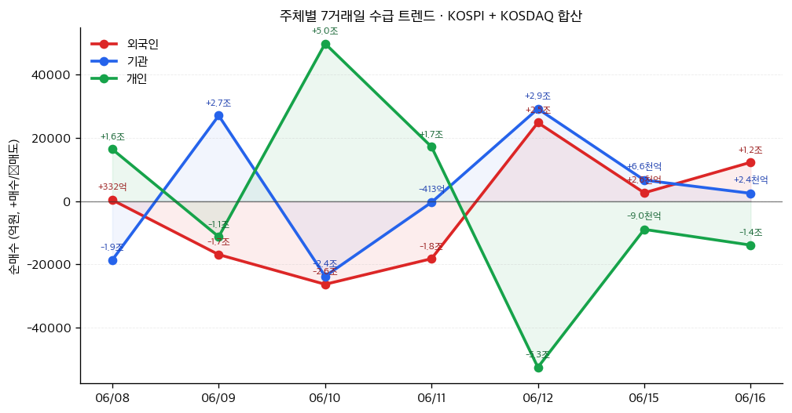

# 📊 모닝 브리핑 — 2026년 6월 17일 (수)

> **🟢 Risk-On** — 미-이란 종전 기대감이 지정학 프리미엄을 녹이고, 유가 하락이 인플레이션 우려를 덜어내며 전방위 위험 선호 국면
> - **매크로**: FOMC 금리 결정 대기, 유가 하락 기조, 원/달러 환율 흐름 확인 필요
> - **리스크**: 나스닥 3%대 급등 후 AI 과열 경계 + FOMC 매파 서프라이즈 가능성
> - **시그널**: ① 호르무즈 재개방 기대 → 에너지/방산 리밸런싱 ② 워시 신임 의장 첫 FOMC — 메시지 톤 주목

---

## 시장 스냅샷

### 주요 지수
| 지수 | 종가 | 등락 | 52주 위치 |
|------|------|------|----------|
| S&P 500 | 7,511.35 | -42.94 (-0.6%) | ██████████████████▊░ 94% (5,968–7,610) |
| 나스닥 | 26,376.34 | -307.60 (-1.2%) | ██████████████████▏░ 91% (19,447–27,094) |
| 다우존스 | 51,999.67 | +328.64 (+0.6%) | ████████████████████ 100% (42,172–52,000) |
| 코스피 | 8,545.98 | +422.36 (+5.2%) | ███████████████████▏ 96% (2,947–8,801) |
| 코스닥 | 1,034.03 | +4.98 (+0.5%) | ███████████▌░░░░░░░░ 58% (773–1,226) |
| 닛케이 225 | 69,317.50 | +3297.46 (+5.0%) | ████████████████████ 100% (38,311–69,318) |

### 매크로/원자재/크립토
| 항목 | 값 | 변동 | 52주 위치 |
|------|-----|------|----------|
| 미국 10Y | 4.43% | -0.06%p | █████████████▎░░░░░░ 67% (4–5) |
| 미국 2Y | 3.63% | +0.01%p | ███▎░░░░░░░░░░░░░░░░ 17% (4–4) |
| DXY | 99.55 | -0.08 (-0.1%) | ███████████████▌░░░░ 78% (96–101) |
| USD/KRW | 1,508.46 | -1.04 (-0.1%) | ███████████████▌░░░░ 78% (1,348–1,554) |
| USD/JPY | 160.40 | +0.44 (+0.3%) | ███████████████████▉ 99% (143–161) |
| WTI 원유 | $75.83 | -6.1% | ███████▏░░░░░░░░░░░░ 36% (55–113) |
| 금 (Gold) | $4,353.00 | +0.6% | ██████████▌░░░░░░░░░ 53% (3,274–5,318) |
| 은 (Silver) | $70.12 | +0.1% | ████████▋░░░░░░░░░░░ 43% (36–115) |
| BTC | $65,686 | -0.9% | █▌░░░░░░░░░░░░░░░░░░ 8% (60,867–124,753) |
| VIX | 16.41 | +0.21 (+1.3%) | ███▍░░░░░░░░░░░░░░░░ 17% (13–31) |
| 10Y-2Y 스프레드 | 0.80%p | -0.07%p | — |

### 수급 동향 (최근 7 거래일, 06/08 ~ 06/16, KOSPI+KOSDAQ 합산)



**7일 누적**: 외국인 -2.2조 · 기관 +2.2조 · 개인 -3,404억

---
## 시장 센티먼트

<div style="background:#e0e0e0;border-radius:8px;overflow:hidden;margin:8px 0">
<div style="display:flex;border-radius:8px;overflow:hidden;font-size:0.9em">
<div style="background:#4CAF50;width:72%;padding:6px 10px;color:white;white-space:nowrap">🟢 Risk-On 72%</div>
<div style="background:#F44336;width:28%;padding:6px 10px;color:white;white-space:nowrap;text-align:right">🔴 Risk-Off 28%</div>
</div>
</div>

**핵심 판독**: 미-이란 예비 합의 소식이 지정학 리스크 프리미엄을 빠르게 디스카운트하면서 다우 사상 최고치, 나스닥 3%대 급등이라는 전형적인 Risk-On 신호가 동시에 출현했다. 한국 증시도 코스피 8500선 회복과 외국인·기관 동반 순매수로 글로벌 랠리에 동참하는 모습이다. 다만 나스닥의 단기 급등폭과 버핏 인디케이터(Buffett Indicator) 고점 경고는 추가 상승의 지속 가능성에 물음표를 남긴다.

**변곡 촉매**:
- 🔴 **다운**: 케빈 워시 FOMC 첫 회의에서 예상보다 매파적 발언 → 금리 인하 기대 후퇴, AI 주식 밸류에이션 압박
- 🟢 **업**: 미-이란 협상 공식 타결 + 호르무즈 완전 재개방 → 유가 추가 하락, 글로벌 인플레이션 기대 급락

---

## 섹터별 센티먼트

| 섹터 | 센티먼트 | 한줄 평가 |
|------|---------|----------|
| AI/반도체 | 🟢 강세 | 나스닥 3%대 급등 견인, [[스페이스X]] 모멘텀 + AI 수요 내러티브 강화; 과열 경계는 여전 |
| 에너지(석유·가스) | 🔴 약세 | 미-이란 협상 기대에 유가 하락 압력, 호르무즈 재개방 시 공급 증가 우려 |
| 방산 | 🟡 혼조 | 중동 긴장 완화로 단기 차익실현 압력, 다만 글로벌 국방 예산 구조적 증가 기조 유지 |
| 항공·여행 | 🟢 강세 | 유가 하락 + 중동 리스크 완화 → 항공유 원가 개선, 지정학 노출 감소 동시 수혜 |
| 핵심 광물(구리·희토류) | 🟢 강세 | AI 데이터센터 수요 + 에너지 전환 드라이브로 구조적 공급 부족 심화 전망 |
| 은(Silver) | 🟡 중립 | 인도 태양광 수요가 중국 둔화 상쇄 가능성, 단기 방향성 불명확 |
| 한국 IT·반도체 | 🟢 강세 | [[SK하이닉스]] 공시 이슈 주목하되, 외국인·기관 동반 순매수로 수급 긍정적 |

---

## 오버나이트 핵심 이벤트

### 1. 미국-이란 잠정 평화 협상 타결 기대감
- **요약**: 미국과 이란이 중동 전쟁 종식 및 호르무즈 해협 재개방에 관한 예비 합의에 근접했다는 소식이 전해졌다.
- **So What**: 호르무즈 해협은 전 세계 원유 수송의 약 20%가 통과하는 전략 요충지로, 재개방 기대만으로도 유가 하락 압력이 즉각 작동했다. 유가 하락은 인플레이션 기대를 낮추고 연준의 금리 인하 여지를 넓히는 2차 효과로 연결되어 전체 위험자산 랠리의 핵심 촉매가 됐다.
- **크로스 임팩트**: 🟢 항공·여행·소비재 / 🔴 정유·방산 / 🟡 LNG(공급 경로 다변화 변수)

### 2. 미국 증시 강세 — 다우 사상 최고치, 나스닥 3%대 급등
- **요약**: 지정학 완화 기대와 AI·스페이스X 모멘텀이 겹치며 다우존스가 사상 최고치를, 나스닥은 3%대 급등을 기록했다.
- **So What**: 다우와 나스닥이 동시에 강하게 오른 것은 가치주(다우)와 성장주(나스닥) 양쪽에서 매수세가 유입됐다는 의미로, 특정 섹터 쏠림이 아닌 광범위한 위험 선호를 나타낸다. 다만 단기 급등 후 FOMC라는 확인 이벤트가 남아있어 차익실현 매물이 출현할 수 있는 구간이기도 하다.
- **크로스 임팩트**: 🟢 글로벌 증시 동반 상승 / 🟡 VIX 추가 하락 여부가 지속성 가늠자

### 3. FOMC 회의 개시 — 케빈 워시 신임 의장의 첫 시험대
- **요약**: 금리 동결이 컨센서스인 가운데, 케빈 워시 신임 Fed 의장의 첫 FOMC 회의가 시작됐다. 시장은 금리 결정보다 향후 정책 경로 메시지에 더 주목하고 있다.
- **So What**: 신임 의장의 첫 회의는 그의 정책 철학과 소통 스타일을 시장이 처음 캘리브레이션하는 자리다. 워시는 과거 구조적 개혁 선호 성향으로 알려져 있어, 만약 '인플레이션 재점화 경계' 메시지를 강조한다면 유가 하락으로 형성된 낙관론에 찬물을 끼얹는 역설적 상황이 연출될 수 있다.
- **크로스 임팩트**: 🟢/🔴 전 자산군 — 발언 톤에 따라 방향 즉각 전환 가능

### 4. SK하이닉스 풍문·보도 해명 공시
- **요약**: [[SK하이닉스]]가 특정 풍문 또는 보도에 대한 해명 공시를 DART에 제출했다.
- **So What**: 풍문 해명 공시는 시장에 퍼진 루머의 존재를 공식 확인하는 역설적 효과를 낳을 수 있다. 공시 내용의 방향(긍정적 루머 부인 vs 부정적 루머 해명)에 따라 주가 반응이 극명하게 갈린다. AI 반도체 수급 사이클의 핵심 플레이어인 만큼, 공시 원문 확인이 필수다.
- **크로스 임팩트**: 🟡 [[SK하이닉스]] 직접 영향, HBM 공급망 전반

---

## 오늘의 일정

| 시간(한국) | 이벤트 | 중요도 | 관련 종목/섹터 |
|-----------|--------|--------|--------------|
| 오늘 새벽 3시 (발표 예정) | 미국 FOMC 금리 결정 + 케빈 워시 기자회견 | ⭐⭐⭐⭐⭐ | [[전 종목]], [[채권]], [[달러]] |
| 이번 주 중 | 미-이란 협상 후속 진행 상황 | ⭐⭐⭐⭐ | [[에너지]], [[방산]], [[항공]] |
| 이번 주 중 | [[SK하이닉스]] 풍문 공시 원문 확인 | ⭐⭐⭐ | [[SK하이닉스]], [[반도체]] |

> [!warning] ⭐⭐⭐⭐⭐ FOMC 시나리오 분기
> - 🟢 **도비시 서프라이즈**: 워시 의장이 "인플레이션 통제 확인, 연내 인하 열어둔다" → 나스닥 추가 급등, 달러 약세, 금 강세
> - 🟡 **예상대로 동결 + 중립**: "데이터 의존, 열린 자세" → 시장 반응 제한적, 랠리 소화 국면
> - 🔴 **매파 서프라이즈**: "유가 하락에도 서비스 인플레이션 경계, 인하 없다" → 채권 매도, 성장주 급반락 가능

---

## 테마 시그널

> [!abstract] 오늘의 테마: **원자재 슈퍼사이클 2.0 — "AI가 구리를 먹고, 인도가 은을 삼킨다: 에너지 전환 금속의 구조적 공급 부족 투자 지도"**

### 왜 지금 이 테마인가

2026년 중반, 원자재 시장에는 과거 슈퍼사이클과 질적으로 다른 수요 충격이 동시에 밀려오고 있다. 과거 2000년대 슈퍼사이클이 '중국의 도시화·산업화'라는 단일 드라이버였다면, 이번 사이클은 **AI 데이터센터 폭발적 확장 + 에너지 전환(태양광·전기차) + 지정학적 공급망 재편**이라는 세 개의 엔진이 동시에 가동되는 구조다.

오늘 Gemini 데이터에 따르면 중국 5월 산업생산이 예상치를 상회했고, 원자재 가격 급등과 AI 수요가 맞물려 중국 생산자물가지수(PPI)가 약 4년 만에 최대 상승폭을 기록했다. 시장이 이란-호르무즈 뉴스에 집중하는 동안, 정작 더 구조적인 이야기는 구리·희토류·은의 공급 부족 심화다.

---

### 세 개의 엔진 분해

#### 엔진 1: AI 데이터센터 — "구리를 가장 많이 소비하는 새로운 산업"

| 항목 | 내용 |
|------|------|
| 핵심 수요 금속 | 구리(배선·냉각), 주석(납땜), 희토류(자석·모터) |
| 공급 특성 | 구리 광산 개발까지 10~15년, 단기 공급 탄력성 극히 낮음 |
| 병목 | 희토류와 주석은 공급 증가 여지 제한적; 구리도 동일 |
| 반사 수혜 | 구리 생산국(칠레, 페루, 잠비아), 구리 정련 설비 보유 기업 |

AI 데이터센터 하나를 건설하는 데 필요한 구리량은 일반 상업용 건물의 수십 배에 달한다. 서버 랙, 전력 분배 시스템, 냉각 파이프, 백본 케이블 전부 구리다. 빅테크가 수백억 달러를 데이터센터에 쏟아붓겠다고 선언할 때, 그 선언의 물리적 표현은 결국 '구리 수요 급증 계약서'다.

#### 엔진 2: 에너지 전환 — "인도가 은을 삼킨다"

중국 태양광 설치가 포화에 가까워지면서 은 산업 수요의 구조적 지지대가 흔들릴 것이라는 우려가 있었다. 그런데 오늘 데이터는 반전 시나리오를 제시한다. **인도의 공격적 태양광 확장 계획**이 중국 둔화를 상쇄하는 새로운 수요 풀로 부상하고 있다는 것이다.

태양광 패널 1GW 생산에 필요한 은은 약 50~70톤. 인도가 수백 GW 규모의 목표치를 유지한다면, 이는 수천 톤의 산업용 은 수요를 수년에 걸쳐 약속하는 것이다. 은은 금과 달리 공업용 소비가 전체 수요의 절반 이상을 차지하기 때문에, 이 에너지 전환 드라이버는 금 대비 은의 상대적 매력을 높이는 구조적 논리를 만든다.

#### 엔진 3: 지정학 재편 — "무역 지도가 바뀌면 프리미엄이 붙는다"

중국의 희토류 수출 통제, 미-중 기술 디커플링, 오늘의 미-이란 호르무즈 협상까지 — 지정학적 변화는 금속 시장의 **지역 프리미엄**을 재설정하고 있다. 서방 세계가 중국 의존 공급망을 탈피하려 할수록, 비중국 광산·정련 기업들은 지정학적 프리미엄을 가격에 전가할 수 있는 협상력을 얻는다.

---

### 공급 부족 구조: 왜 쉽게 해소되지 않는가

<div style="border-left:4px solid #FF9800;padding-left:12px;margin:8px 0">
광산 개발의 리드타임(Lead Time): 구리 광산의 경우 탐사→허가→개발→생산까지 평균 16~17년이 소요된다. 2020년대 초 저유가·저금속 가격 시대에 억제된 CAPEX는 2030년대 중반까지 공급 증가를 구조적으로 제한한다. 수요는 지금 급증하는데, 공급 반응은 10년 후에야 온다 — 이것이 원자재 슈퍼사이클의 가격 메커니즘이다.
</div>

| 금속 | 수요 드라이버 | 공급 탄력성 | 병목 핵심 |
|------|------------|-----------|----------|
| 구리 | AI 데이터센터, EV, 전력망 | 🔴 매우 낮음 | 광산 개발 리드타임 16년+ |
| 희토류 | AI 모터·자석, EV 구동계 | 🔴 낮음 | 중국 독점, 서방 대안 개발 중 |
| 주석 | AI 서버 납땜, 반도체 패키징 | 🔴 낮음 | 미얀마 생산 불안, 매장량 제한 |
| 은 | 태양광, EV 접점, 전자기기 | 🟡 중간 | 인도 수요 대체로 수급 균형 유지 |

---

### 투자 함의: 어떻게 포지셔닝할 것인가

> [!tip] 핵심 인사이트
> 에너지 전환 금속은 단순 경기 사이클 플레이가 아니다. AI CAPEX + 탄소중립 정책 + 지정학 프리미엄이 '구조적 바닥'을 높이는 새로운 수요 방정식이다. 따라서 경기 침체기에도 이전 사이클보다 가격 하단이 높게 유지될 가능성이 크다.

**투자 접근법 3가지**:

1. **업스트림 직접 노출**: 구리·희토류 생산 광산주 — 수요 성장의 1차 수혜, 단 원자재 가격 변동성과 지정학 리스크 내재
2. **장비·기술 간접 노출**: 광산 자동화 장비, 배터리 재활용 기술 — 가격 변동성 완충하면서 구조적 성장 참여
3. **ETF/펀드 분산**: 글로벌 원자재 ETF로 단일 금속 리스크 분산 — 진입 장벽 낮고 유동성 우수

**모니터링 포인트**:
- 중국 월간 산업생산 및 부동산 투자 지표 — 수요의 온도계
- 칠레·페루 광산 노사 협상 일정 — 구리 공급 충격의 선행 지표
- 인도 태양광 설치 목표 정책 업데이트 — 은 수요의 방향타
- 미-중 광물 무역 협상 — 희토류 지정학 프리미엄 변수

---

## 대가의 시선

> "The stock market is now more overvalued than at any time in history except the peak of the dot-com bubble."
> "주식 시장은 닷컴 버블 정점을 제외하면 역사상 그 어느 때보다 과대평가되어 있습니다."
> — **워렌 버핏 (Warren Buffett)**, 버크셔 해서웨이 회장 (Berkshire Hathaway) — 버핏 인디케이터 229.7% 기록 관련 맥락, Motley Fool 보도 인용 [클래식 맥락 재적용]

**맥락**: 버핏 인디케이터(미국 주식 시가총액/GDP 비율)가 229.7%를 기록했다는 데이터가 시장 분석 자료에 포함되어 있다. 버핏 자신의 이 발언은 2000년대 초 닷컴 버블 당시 유사 수준의 과열에 대한 경고로 사용됐으며, 오늘 시장 상황에 그대로 적용된다.

**투자 함의**: 나스닥이 하루에 3% 급등하고 다우가 사상 최고치를 기록하는 날, 가장 중요한 질문은 "무엇을 살까"가 아니라 "지금 밸류에이션이 어디 있는가"다. 버핏 인디케이터 229.7%는 역사적으로 향후 10~15년 평균 수익률이 낮아질 가능성이 높다는 신호다. 랠리에 올라타되, 전체 시장 익스포저를 늘리는 것과 알파를 추구하는 것을 구분하는 냉정함이 필요한 시점이다.

---

## 투자 레슨

> [!abstract] 오늘의 레슨: **평균회귀(Mean Reversion) — "시장이 역사상 가장 비쌀 때 투자자가 해야 할 질문은 '언제 돌아오는가'이다"**

### 개념의 본질: 평균회귀란 무엇인가

평균회귀(Mean Reversion)는 통계학의 핵심 개념이자 금융 시장에서 가장 강력하게 작동하는 중력 중 하나다. 어떤 변수가 장기 평균에서 크게 벗어났을 때, 시간이 지남에 따라 다시 평균으로 돌아오려는 경향을 말한다. 주식 시장에서 이 원리는 밸류에이션(P/E, CAPE, 버핏 인디케이터), 수익률, 섹터 순환, 기업 마진 등 거의 모든 영역에서 관찰된다.

중요한 것은 평균회귀가 '반드시 하락한다'는 뜻이 아니라는 점이다. 평균 자체가 높아질 수도 있고, 회귀는 즉각 일어나지 않고 수년에 걸쳐 서서히 진행될 수도 있다. 따라서 평균회귀는 **타이밍 도구가 아닌, 기대 수익률 조정 도구**로 사용해야 한다.

---

### 역사적 사례: CAPE 비율과 10년 수익률의 관계

예일대 로버트 실러(Robert Shiller)의 연구는 이를 가장 명확하게 입증한다. CAPE(Cyclically Adjusted P/E, 경기조정 주가수익비율)는 현재 주가를 최근 10년 평균 실질 이익으로 나눈 값으로, 단기 이익 변동성을 제거한 '중립적 밸류에이션 온도계'다.

| CAPE 수준 (진입 시점) | 이후 10년 연평균 실질 수익률 (역사적 평균) |
|---------------------|----------------------------------------|
| 10 이하 | 🟢 약 +10~15% |
| 10~20 | 🟢 약 +6~10% |
| 20~25 | 🟡 약 +3~6% |
| 25~30 | 🟡 약 +1~4% |
| 30 이상 | 🔴 약 -1~+2% (일부 10년 기간 음수) |

*※ 위 수치는 1881년 이후 장기 역사적 데이터 기반 추정 범위이며, 개별 시기마다 상이*

핵심은 CAPE가 높을 때 투자했다고 해서 즉각 손실이 나는 것이 아니라, **향후 장기 기대 수익률의 수학적 기댓값이 낮아진다**는 것이다. 닷컴 버블 정점(2000년)에서 S&P 500에 투자한 사람은 10년 후인 2010년에도 원금을 회복하지 못했다. 이것이 밸류에이션과 장기 수익률의 평균회귀가 만나는 지점이다.

---

### 오늘 시장에 적용: 버핏 인디케이터 229.7%가 말하는 것

오늘 브리핑 데이터에서 버핏 인디케이터(미국 주식 시총/GDP)가 229.7%를 기록했다는 정보가 확인됐다. 역사적 평균은 대략 80~100% 수준이며, 닷컴 버블 정점에서 약 150%대를 넘어섰던 것과 비교해도 현재 수준은 구조적으로 매우 높은 영역이다.

<div style="display:flex;border-radius:8px;overflow:hidden;margin:8px 0;font-size:0.85em">
<div style="background:#4CAF50;width:20%;padding:6px 8px;color:white;white-space:nowrap">역사 평균 ~100%</div>
<div style="background:#FF9800;width:30%;padding:6px 8px;color:white;white-space:nowrap">닷컴 버블 ~150%</div>
<div style="background:#F44336;width:50%;padding:6px 8px;color:white;white-space:nowrap">현재 229.7% — 역사적 최고 수준</div>
</div>

**그렇다면 지금 당장 팔아야 하는가?** 이것이 평균회귀를 오해하는 가장 흔한 실수다. 다음 세 가지를 구분해야 한다:

```
평균회귀의 세 가지 경로:
① 가격이 내려와서 회귀 — 하락 조정
② 이익(분모)이 올라와서 회귀 — 실적 따라잡기
③ 평균 자체가 구조적으로 올라가서 새 균형 형성 — 패러다임 이동
```

AI 혁명이 생산성을 구조적으로 높여 기업 이익을 10년에 걸쳐 끌어올린다면, ②번 경로가 일어날 수 있다. 하지만 투자자가 경계해야 할 것은 ③번을 확신하며 ①번의 위험을 무시하는 것이다. 닷컴 버블 때도 "인터넷은 세상을 바꿀 것"이라는 내러티브는 사실이었다. 그러나 당시 밸류에이션으로 진입했다면 그 사실이 맞는 것과 무관하게 10년간 수익이 없었다.

---

### 평균회귀를 활용한 포지셔닝 프레임워크

| 상황 | 행동 원칙 |
|------|----------|
| 밸류에이션이 역사적 고점 근처 | 신규 진입 규모 축소, 기대 수익률을 낮춰 계획 수립 |
| 랠리 중 새로운 포지션 추가 | 품질(Quality) 우선 — 고마진·고ROIC 기업은 하락 시 방어력 높음 |
| 섹터/스타일 로테이션 | 고밸류에이션 섹터 → 상대적 저밸류에이션 섹터로 일부 이동 |
| 현금 비중 | '과도하게 낮은' 기대 수익률을 감안해 현금 옵션 가치를 재평가 |

> [!warning] 평균회귀의 함정 — "언제"를 알 수 없다
> 평균회귀는 작동하지만, 그 타이밍은 예측 불가능하다. 1996년에 앨런 그린스펀이 "비이성적 과열"을 경고했지만 나스닥은 이후 3년간 200% 더 올랐다. 너무 일찍 쇼트를 친 투자자들은 결국 버티지 못하고 정점 근처에서 포지션을 청산했다. 평균회귀는 "지금 팔아라"가 아니라 "기대 수익률을 낮춰라, 리스크 관리를 강화해라"는 신호다.

**오늘 실천 방법**: 현재 보유 포지션의 평균 P/E 또는 CAPE를 확인해보라. 그 숫자가 역사적 분포의 상위 20%에 있다면, 새로운 매수 결정 시 '이 밸류에이션이 정당화되려면 어떤 성장이 필요한가'를 역산(Reverse DCF)해보는 습관을 들여라. 숫자가 현실적이지 않다면 그것이 이미 경고 신호다.

---

## 오늘 하나만 기억한다면

> [!verdict] 오늘 하나만 기억한다면
> **"나스닥이 하루에 3% 오른 날, 진짜 질문은 '무엇을 살까'가 아니라 '이 랠리의 기대 수익률이 밸류에이션을 정당화하는가'다. 시장이 흥분할 때 평균회귀를 기억하는 것이 포트폴리오의 장기 생존력을 결정한다."**