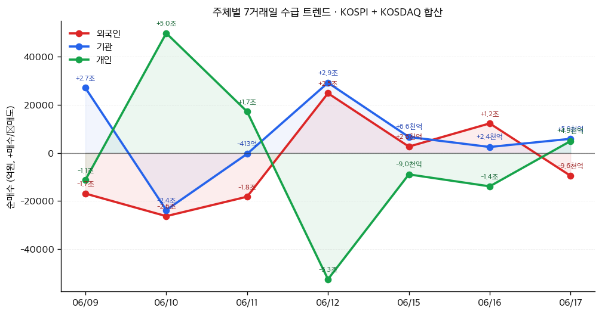

# 📊 모닝 브리핑 — 2026년 6월 18일 (목)

> **🔴 Risk-Off** — 연준 매파 전환 + 고평가 기술주 차익실현, 시장 전반 냉각
> - **매크로**: 10년물 국채금리 4.43% / WTI 유가 $65.52 / 달러인덱스 98.92
> - **리스크**: S&P500 -0.34%, NASDAQ -0.52% / VIX 18.19 (경계 구간 진입)
> - **시그널**: 연준 점도표 연내 인상 시사 → 채권 매도·달러 강세 압력 구조화; 중동 평화 기대 유가 급락 → 인플레 완화 vs 에너지주 역풍 교차

---

## 시장 스냅샷

### 주요 지수
| 지수 | 종가 | 등락 | 52주 위치 |
|------|------|------|----------|
| S&P 500 | 7,420.10 | -91.25 (-1.2%) | █████████████████▊░░ 88% (5,968–7,610) |
| 나스닥 | 26,021.66 | -354.68 (-1.3%) | █████████████████▎░░ 86% (19,447–27,094) |
| 다우존스 | 51,492.55 | -507.12 (-1.0%) | ███████████████████░ 95% (42,172–52,000) |
| 코스피 | 8,726.60 | +180.62 (+2.1%) | ███████████████████▊ 99% (2,950–8,801) |
| 코스닥 | 1,018.68 | -15.35 (-1.5%) | ██████████▉░░░░░░░░░ 54% (773–1,226) |
| 닛케이 225 | 69,404.50 | +87.00 (+0.1%) | ████████████████████ 100% (38,354–69,404) |

### 매크로/원자재/크립토
| 항목 | 값 | 변동 | 52주 위치 |
|------|-----|------|----------|
| 미국 10Y | 4.46% | -0.02%p | ██████████████▎░░░░░ 71% (4–5) |
| 미국 2Y | 3.65% | +0.03%p | ███▊░░░░░░░░░░░░░░░░ 19% (4–4) |
| DXY | 100.36 | +0.82 (+0.8%) | ███████████████████▍ 97% (96–101) |
| USD/KRW | 1,523.93 | +10.62 (+0.7%) | █████████████████░░░ 85% (1,348–1,554) |
| USD/JPY | 160.63 | +0.40 (+0.2%) | ████████████████████ 100% (143–161) |
| WTI 원유 | $75.01 | -1.4% | ██████▉░░░░░░░░░░░░░ 34% (55–113) |
| 금 (Gold) | $4,276.30 | -1.3% | █████████▊░░░░░░░░░░ 49% (3,274–5,318) |
| 은 (Silver) | $67.96 | -2.8% | ████████▏░░░░░░░░░░░ 41% (36–115) |
| BTC | $64,074 | -2.3% | █░░░░░░░░░░░░░░░░░░░ 5% (60,867–124,753) |
| VIX | 18.44 | +2.03 (+12.4%) | █████▋░░░░░░░░░░░░░░ 28% (13–31) |
| 10Y-2Y 스프레드 | 0.82%p | -0.05%p | — |

### 수급 동향 (최근 7 거래일, 06/09 ~ 06/17, KOSPI+KOSDAQ 합산)



**7일 누적**: 외국인 -3.1조 · 기관 +4.7조 · 개인 -1.5조

---
## 시장 센티먼트

<div style="display:flex;border-radius:8px;overflow:hidden;margin:8px 0;font-size:0.85em"><div style="background:#F44336;width:62%;padding:6px 8px;color:white">🔴 Risk-Off 62%</div><div style="background:#FF9800;width:25%;padding:6px 8px;color:white">🟡 중립 25%</div><div style="background:#4CAF50;width:13%;padding:6px 8px;color:white;min-width:60px">🟢 On 13%</div></div>

**핵심 판독**: 워시 체제 첫 FOMC에서 '포워드 가이던스 폐기 + 연내 인상 시사'라는 이중 충격이 시장을 흔들었다. 점도표 매파 전환은 '금리 인하 기대 랠리'의 근거를 정면으로 훼손하며 기술주 밸류에이션 재산정 압력을 가중시키고 있다. 유가 급락은 인플레 우려를 일부 희석시키지만, 에너지 섹터 이익 훼손이라는 반대급부가 공존한다.

**변곡 촉매**:
- 🔴 **다운**: 워시 의장 추가 매파 발언 or 점도표 상향 → 국채금리 급등·멀티플 압축 재가속
- 🟢 **업**: 중동 평화협정 공식 타결로 유가 추가 하락 → 인플레 우려 해소·소비 회복 기대

---

## 섹터별 센티먼트

| 섹터 | 센티먼트 | 한줄 평가 |
|------|---------|----------|
| 반도체 | 🔴 약세 | 전날 급등 후 차익실현 매물 출회, 고평가 부담·FOMC 금리 상승 시 멀티플 압축 직격 |
| 빅테크/성장주 | 🔴 약세 | 연준 인상 시사로 장기 DCF 할인율 상승 압력, 나스닥 선행 하락 |
| 에너지 | 🔴 약세 | 유가 80달러 하향 돌파로 이익 전망 하향, 중동 평화 기대 구조적 역풍 |
| 우주/방산 | 🟢 강세 | SpaceX 상장 후 강세 지속·아마존 시총 추월 화제, 뉴스페이스 밸류에이션 재평가 |
| 채권/금리 민감주 | 🔴 약세 | 매파 점도표에 국채 매도세, 리츠·유틸리티 등 고배당 섹터 동반 약세 |
| 금융 | 🟡 중립 | 금리 인상 시사는 NIM 개선 호재, 그러나 경기 둔화 신용 우려 상쇄 |
| 소비재/항공 | 🟢 강세 | 유가 급락 → 항공·물류 원가 절감 기대, 소비자 실질 구매력 개선 시나리오 |

---

## 오버나이트 핵심 이벤트

### 1. 연준 FOMC — 워시 체제의 첫 메시지: "금리는 아직 끝나지 않았다"
- **요약**: 케빈 워시 신임 의장의 첫 FOMC에서 기준금리 3.50~3.75%로 4연속 동결, 그러나 점도표를 통해 연내 최소 1회 인상 가능성을 시사하고 '포워드 가이던스' 폐기를 선언.
- **So What**: 시장이 기대했던 '연내 인하 피벗' 내러티브가 완전히 뒤집혔다. 포워드 가이던스 폐기는 연준의 소통 불확실성을 높여 매 회의마다 서프라이즈 리스크가 커진다는 의미다. 성장주·장기 채권 보유자 모두에게 밸류에이션 재산정이 요구된다.
- **크로스 임팩트**: [[나스닥]] [[국채ETF(TLT)]] 직격, [[달러인덱스]] 강세 압력, [[이머징마켓]] 자금 유출 위험

### 2. 브렌트유 80달러 하향 — 중동 평화 기대와 유가 급락의 이중 효과
- **요약**: 미국-이란 평화협정 타결 기대감으로 브렌트유가 배럴당 80달러 아래로 급락. 중동 지정학 리스크 프리미엄이 빠르게 해소되는 국면.
- **So What**: 유가 하락은 인플레이션 압력을 완화해 연준의 추가 인상 명분을 약화시키는 긍정적 역할을 할 수 있다. 그러나 에너지 기업 이익 전망 하향과 산유국 재정 악화라는 2차 효과가 동반된다. 진짜 평화 타결이냐, 기대 先반영이냐에 따라 되돌림 리스크 존재.
- **크로스 임팩트**: [[에너지섹터ETF(XLE)]] 약세, [[항공주]] [[물류주]] 수혜, [[인플레이션연동채권(TIPS)]] 프리미엄 축소

### 3. SpaceX — 상장 후 아마존 시총 추월, '뉴스페이스 밸류에이션 빅뱅' 현재진행형
- **요약**: IPO 이후 SpaceX 주가가 강세를 이어가며 한때 아마존 시가총액을 추월하는 상징적 이벤트 발생.
- **So What**: 단순한 개별 종목 이슈를 넘어, 민간 우주산업 전체 밸류에이션 기준점이 재설정되는 신호다. 스타링크 위성 인터넷 수익화 모델이 본격 가시화되면서 우주 산업을 '인프라 플레이'로 재해석하는 기관 자금이 유입되고 있다.
- **크로스 임팩트**: [[우주ETF(UFO)]] [[방산주]] 관련 섹터 동반 주목, [[아마존(AMZN)]] 상대적 모멘텀 약화 가능성

---

## 오늘의 일정

| 시간(한국) | 이벤트 | 중요도 | 관련 자산 |
|-----------|--------|--------|----------|
| 오늘 밤 21:30 | 미국 주간 신규 실업수당 청구건수 | ⭐⭐⭐ | [[S&P500]] [[달러]] |
| 오늘 밤 21:30 | 미국 6월 필라델피아 연준 제조업지수 | ⭐⭐⭐ | [[산업재ETF(XLI)]] [[국채]] |
| 이번 주 | 한국은행 7월 빅스텝(0.5%p) 인상 가능성 논의 본격화 | ⭐⭐⭐⭐ | [[원화]] [[코스피]] [[채권ETF]] |
| 이번 주 | ECB·BOJ 금리 인상 이후 주요국 통화정책 파급 점검 | ⭐⭐⭐ | [[이머징통화]] [[엔화]] |

> [!warning] ⭐⭐⭐⭐ 한국은행 7월 빅스텝 시나리오 분기
> - **인상 현실화**: 원화 단기 강세, 채권 급락, 부동산·가계부채 압박 가중
> - **동결 선택**: 원화 약세 지속·자금 유출 우려, 시장은 '뒤늦은 대응' 비판 가능성
> - **핵심 변수**: 6월 소비자물가 + 미 연준 추가 발언이 7월 결정의 방향타

---

## 테마 시그널

> [!abstract] 오늘의 테마: **중앙은행 정책 차별화(Central Bank Policy Divergence) — "연준은 올리고, ECB도 올리고, BOJ도 올린다: 동조화 시대의 종언과 글로벌 자금 대이동의 투자 지도"**

### 왜 지금인가 — 사상 초유의 '다(多)방향 인상' 국면

역사적으로 주요국 중앙은행들은 대체로 같은 방향으로 움직였다. 2008년 금융위기 이후엔 모두 함께 완화했고, 2022~2023년엔 모두 함께 긴축했다. 그런데 지금은 다르다. **연준·ECB·BOJ가 각기 다른 이유로, 다른 속도로, 다른 수준에서 금리를 움직이고 있다.** 이 '정책 차별화(Policy Divergence)' 국면은 단순한 금리 차이를 넘어, 글로벌 자금 흐름과 환율 체제 자체를 재편하는 구조적 전환점이다.

| 중앙은행 | 현재 금리 | 최근 결정 | 방향 | 핵심 이유 |
|---------|---------|---------|------|----------|
| 연준(Fed) | 3.50~3.75% | 4연속 동결, 연내 인상 시사 | 🟡 동결→인상 가능 | 고용 견조, 물가 재반등 우려 |
| ECB | 2.25% | 2년 9개월 만의 인상 단행 | 🔴 인상 | 중동발 에너지 인플레 재점화 |
| BOJ | 1.00% | 31년 만의 최고 수준 인상 | 🔴 인상 | 디플레 탈출 확인, 구조적 전환 |
| 한국은행 | (현재 수준) | 7월 빅스텝 가능성 부상 | 🔴 인상 압박 | 한미 금리역전 + 원화 약세 |
| PBOC | - | 정책금리 기준 변경 논의 | 🟡 완화 유지 | 내수 부양, 디플레 압력 |

### 구조적 분석 — 이번 차별화가 과거와 다른 이유

**1. 인플레이션의 기원이 다르다**
미국의 물가 상방 압력은 주로 서비스·주거비 중심의 구조적 요인이고, 유럽은 중동 전쟁으로 촉발된 에너지 가격 재급등이 핵심이다. 일본은 30년 디플레에서 막 탈출하는 국면이다. **같은 '인플레이션'이라는 단어를 쓰지만, 처방이 달라야 하는 세 가지 질병이다.**

**2. 통화 차별화 → 엔캐리 트레이드의 귀환 vs 청산 딜레마**

```
[전통적 엔캐리 구조]
BOJ 초저금리(0%) → 엔화 차입 → 고수익 자산(미 국채, 이머징, 주식) 투자
→ 엔 약세 + 글로벌 유동성 공급

[지금의 딜레마]
BOJ 금리 1.0%(31년 만의 최고) → 엔 차입 비용 상승
→ 캐리 청산 압력 vs 미-일 금리차 여전히 크다(약 2.5%p)
→ 당장 대규모 청산 가능성 낮으나, '트리거' 출현 시 급격한 되감기 리스크
```

**2024년 8월의 기억**: 단 0.25%p BOJ 인상 + 미국 고용 쇼크 하나에 전 세계 주식이 단 3일 만에 10% 이상 폭락했다. 현재 BOJ는 그때보다 훨씬 높은 1.0%까지 올라와 있다.

**3. 달러 강세의 역설 — "연준이 동결해도 달러가 강하다"**

<div style="border-left:4px solid #FF9800;padding-left:12px;margin:8px 0">
통상 연준이 금리를 올릴 때 달러가 강해진다. 그런데 지금은 ECB와 BOJ가 '뒤늦게' 올리면서도 달러인덱스가 강세를 유지하는 역설이 발생하고 있다. 이유는 미국 경제의 상대적 강건함(Resilience)과 연준의 '더 높게, 더 오래(Higher for Longer)' 스탠스가 맞물렸기 때문이다.
</div>

달러 강세는 이머징 마켓에 삼중고를 안긴다:
- 달러 표시 부채 상환 부담 증가
- 원자재 수입 비용 상승 (달러로 거래)
- 자국 통화 방어를 위한 외환보유고 소진

### 투자 함의 — 어떤 자산이 유불리인가

<div style="display:flex;border-radius:8px;overflow:hidden;margin:8px 0;font-size:0.85em"><div style="background:#4CAF50;width:40%;padding:6px 8px;color:white">🟢 수혜 자산 40%</div><div style="background:#FF9800;width:35%;padding:6px 8px;color:white">🟡 중립 35%</div><div style="background:#F44336;width:25%;padding:6px 8px;color:white">🔴 피해 자산 25%</div></div>

| 자산/전략 | 방향 | 이유 |
|----------|------|------|
| 달러 현금·단기 미국채 | 🟢 | 금리 상승기 현금 매력도 상승, 유동성 확보 |
| 일본 수출주 (엔 약세 수혜) | 🟢 | BOJ 인상해도 미-일 금리차 유지 시 엔 약세 연속 |
| 유럽 은행주 | 🟢 | ECB 인상 → NIM(순이자마진) 확대 수혜 |
| 금(Gold) | 🟡 | 달러 강세는 역풍, 지정학 불확실성은 순풍 |
| 이머징 채권·통화 | 🔴 | 달러 강세 + 자금 유출 이중 압박 |
| 장기 성장주 | 🔴 | 금리 상승 시 할인율 상승 → DCF 밸류 하락 |
| 부동산(리츠) | 🔴 | 금리 상승기 배당 매력 감소, 조달비용 증가 |

### 모니터링 포인트

> [!tip] 핵심 인사이트
> 정책 차별화 국면의 핵심 리스크는 **'어느 중앙은행이 실수를 하느냐'**다. BOJ가 너무 빠르게 올리면 엔캐리 청산; ECB가 에너지 쇼크를 과대평가해 오버킬하면 유럽 경기침체; 연준이 포워드 가이던스 없이 서프라이즈 인상을 하면 글로벌 변동성 폭발. 세 가지 실수 시나리오가 동시에 열려있다.

1. **BOJ 추가 인상 속도**: 우치다 부총재의 발언 + 일본 임금 상승률 데이터 추적
2. **달러인덱스 100선 공방**: 재돌파 여부가 이머징 자금 유출 속도 결정
3. **엔캐리 포지션 규모**: CFTC 투기적 포지션 보고서 (엔 숏 9년래 최고 수준 경고)
4. **한국은행 7월 결정**: 빅스텝 현실화 시 원화채권·코스피에 충격 흡수 국면

---

## 대가의 시선

> "The market can stay irrational longer than you can stay solvent. (시장은 당신이 지불 능력을 유지할 수 있는 것보다 더 오래 비이성적으로 머물 수 있다.)"
> — **존 메이너드 케인즈(John Maynard Keynes)**, 경제학자·투자자 [클래식]

**맥락**: 케인즈는 직접 투자자이기도 했다. 그는 킹스 칼리지 케임브리지의 기금을 운용하며 수차례 '명백히 잘못된 시장'에 역발상 베팅을 했다가 큰 손실을 경험했다. 이 발언은 단순한 격언이 아니라, 그가 시장에서 직접 깨달은 교훈이다.

**투자 함의**: 오늘 시장 상황이 정확히 이 명언의 무대다. 연준의 매파 전환, ECB·BOJ 동반 인상이라는 '금리 현실'은 성장주 밸류에이션이 비싸다는 분석을 정당화한다. 그러나 나스닥은 여전히 고점 부근에서 버텨왔다. '시장이 틀렸다'는 분석이 맞더라도, 그 조정이 오늘 오지 않을 수 있다. **포지션 사이징과 현금 확보가 확신보다 중요한 국면이다.** 시장의 비이성이 끝나는 타이밍은 아무도 모른다. 분석의 정확성과 포지션의 생존력은 별개의 문제다.

---

## 투자 레슨

> [!abstract] 오늘의 레슨: **플라자합의(Plaza Accord)와 환율 무기화 — "1985년 뉴욕 호텔 한 방에서, 달러는 하루아침에 40% 절하되었다: 국가가 환율을 무기로 쓸 때 투자자는 어디에 있어야 하는가"**

### 핵심 개념: 환율은 시장이 아니라 정치다

대부분의 투자자는 환율을 경제 펀더멘털(금리 차, 무역수지, 성장률)이 결정한다고 생각한다. 맞는 말이다 — **평시에는**. 그러나 역사는 반복적으로 증명해왔다. 주요국 정부가 합의만 하면, 수십 년의 시장 흐름을 단 하루 만에 뒤집을 수 있다. 플라자합의는 그 가장 극적인 사례다.

### 1985년 9월 22일 — 플라자 호텔에서 벌어진 일

**배경**: 레이건 정부의 재정 확장과 연준의 볼커 인상으로 달러가 1980~1985년 사이 50% 이상 급등했다. 미국 제조업은 초토화되고, 무역적자가 GDP의 3%를 넘어섰다. 정치적 폭발 직전이었다.

**합의**: 미국·영국·프랑스·서독·일본 재무장관이 뉴욕 플라자 호텔에 모여 **"달러 가치를 질서 있게 낮추겠다"** 고 선언. 각국 중앙은행의 협조 개입을 약속했다.

**결과**:

| 지표 | 합의 전 (1985년) | 합의 후 (1987년) | 변화율 |
|------|----------------|----------------|--------|
| 달러/엔 환율 | 약 260엔 | 약 150엔 | **엔화 42% 절상** |
| 달러/마르크 환율 | 약 2.9 | 약 1.8 | **마르크 38% 절상** |
| 달러인덱스 | ~165 | ~95 | **-42%** |
| 일본 주식(닛케이) | 기저 | 급등 시작 | 버블의 씨앗 |

### 플라자합의가 만든 연쇄 도미노

```
달러 절하 합의
    │
    ├─→ 일본: 엔 급등 → 수출 타격 우려 → BOJ 금리 인하
    │           → 부동산·주식 버블 형성 (1989~90년 붕괴)
    │
    ├─→ 미국: 제조업 경쟁력 일부 회복
    │           → 그러나 서비스업·금융으로 구조 이동 가속
    │
    └─→ 독일: 마르크 강세 → 통일 비용과 맞물려 유럽 통화 불안 씨앗
```

> [!warning] 리스크 경고
> 플라자합의의 가장 큰 교훈은 **"의도치 않은 결과"** 다. 달러를 낮추려 했는데, 일본 버블을 만들었고, 그 버블 붕괴는 '잃어버린 30년'의 원인이 됐다. 정책 개입은 항상 2차, 3차 효과가 의도를 압도한다.

### 오늘 시장과의 연결 — 2026년은 제2의 플라자합의 전야인가?

**놀랍도록 유사한 구조**:
- 1985년과 마찬가지로 달러 강세가 미국 제조업을 압박하고 무역 불균형이 정치 이슈화되어 있다
- 트럼프 행정부는 '관세'라는 다른 도구를 사용하고 있지만, 목표는 동일: 무역적자 축소
- 연준 워시 체제의 포워드 가이던스 폐기는 달러 변동성을 높이는 새로운 요인

**그러나 결정적으로 다른 점**:

| 항목 | 1985년 | 2026년 |
|------|--------|--------|
| 국제 협력 체제 | G5 조율 가능한 신뢰 기반 | 미-중 갈등, 다자체제 균열 |
| 달러 대안 | 사실상 없음 | 위안화, 디지털통화, 금 재평가 논의 |
| 일본의 입장 | 미국 동맹, 합의 수용 | BOJ 독자 인상 → 협상 포지션 달라짐 |
| 중국 변수 | 부재 | PBOC가 핵심 플레이어로 등장 |

### 투자자의 프레임워크: 환율 정책 리스크를 어떻게 다룰 것인가

<div style="border-left:4px solid #4CAF50;padding-left:12px;margin:8px 0">

**환율 정책 리스크의 3가지 시그널**
1. 무역적자가 정치적 의제가 되면 → 개입 가능성 상승
2. G7/G20 성명에서 '환율 변동성' 언급이 증가하면 → 협조 개입 논의 선행 신호
3. 엔/위안/유로 중 하나가 단기 급변하면 → 플라자형 합의 촉매될 수 있음

</div>

**자산별 대응**:
- **달러 자산 과집중** 투자자: 플라자합의형 달러 급락 시나리오를 헤지 자산(금, 비달러 통화 자산)으로 분산
- **일본 주식 투자자**: BOJ 인상 + 잠재적 엔 강세 → 엔 헤지 여부가 수익률을 결정하는 핵심 변수
- **한국 투자자**: 원화 약세가 지속되는 구간은 달러 자산 비중을 높일 기회이지만, 급반전 시 손실 위험 주의

**오늘 실천 방법**: 자신의 포트폴리오에서 '달러 자산 비중'이 얼마인지 체크하라. 달러인덱스 98.92인 지금, 비달러 자산(유럽, 일본, 금)이 아예 없다면 플라자합의형 달러 약세 시나리오에 완전히 무방비인 것이다. 전체 자산의 10~15%를 비달러 인플레이션 헤지 자산으로 배분하는 것을 고려하라.

---

## 오늘 하나만 기억한다면

> [!verdict] 오늘 하나만 기억한다면
> **"연준·ECB·BOJ가 동시에 인상하는 역사적 국면에서, 달러 강세와 엔캐리 청산 리스크는 공존한다 — 지금은 '옳은 분석'보다 '살아남는 포지션'이 더 중요하다."**