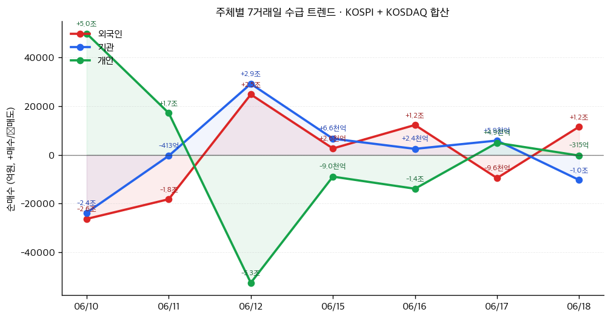

# 📊 모닝 브리핑 — 2026년 6월 19일 (금)

> **🟡 혼조세 (Risk-On 회복 시도)** — 연준 매파+이란 협정 충격이 교차하는 방향성 탐색 장
> - **매크로**: 연준 금리 동결 + 2026년 추가 인상 시사, ECB·BOJ 동시 인상, 이란 평화 협정으로 유가 급락
> - **리스크**: VIX 및 주요 지수 등락 → 📊 블록 참조
> - **시그널**: ① 지정학 완화(호르무즈 재개방)→ 에너지·운송 재편 / ② 연준 매파 전환→ 금리 민감 섹터 재평가

---

## 시장 스냅샷

### 주요 지수
| 지수 | 종가 | 등락 | 52주 위치 |
|------|------|------|----------|
| S&P 500 | 7,500.58 | +80.48 (+1.1%) | ██████████████████▋░ 93% (5,968–7,610) |
| 나스닥 | 26,517.93 | +496.27 (+1.9%) | ██████████████████▌░ 92% (19,447–27,094) |
| 다우존스 | 51,564.70 | +72.15 (+0.1%) | ███████████████████▏ 96% (42,207–52,000) |
| 코스피 | 8,864.24 | +137.64 (+1.6%) | ████████████████████ 100% (2,972–8,864) |
| 코스닥 | 1,031.96 | +13.28 (+1.3%) | ███████████▍░░░░░░░░ 57% (773–1,226) |
| 닛케이 225 | 69,902.25 | +497.75 (+0.7%) | ████████████████████ 100% (38,354–69,902) |

### 매크로/원자재/크립토
| 항목 | 값 | 변동 | 52주 위치 |
|------|-----|------|----------|
| 미국 10Y | 4.45% | -0.04%p | ██████████████░░░░░░ 70% (4–5) |
| 미국 2Y | 3.66% | +0.04%p | ████▏░░░░░░░░░░░░░░░ 20% (4–4) |
| DXY | 100.80 | +0.71 (+0.7%) | ████████████████████ 100% (96–101) |
| USD/KRW | 1,537.91 | +26.95 (+1.8%) | ██████████████████▍░ 92% (1,348–1,554) |
| USD/JPY | 161.41 | +0.99 (+0.6%) | ████████████████████ 100% (143–161) |
| WTI 원유 | $75.52 | -1.7% | ███████░░░░░░░░░░░░░ 35% (55–113) |
| 금 (Gold) | $4,227.90 | -3.0% | █████████▍░░░░░░░░░░ 47% (3,274–5,318) |
| 은 (Silver) | $65.78 | -7.0% | ███████▋░░░░░░░░░░░░ 38% (36–115) |
| BTC | $62,851 | -4.2% | ▋░░░░░░░░░░░░░░░░░░░ 3% (60,867–124,753) |
| VIX | 16.40 | -2.04 (-11.1%) | ███▍░░░░░░░░░░░░░░░░ 17% (13–31) |
| 10Y-2Y 스프레드 | 0.79%p | -0.08%p | — |

### 수급 동향 (최근 7 거래일, 06/10 ~ 06/18, KOSPI+KOSDAQ 합산)



**7일 누적**: 외국인 -2,907억 · 기관 +9,570억 · 개인 -3,902억

---
⚠️ 시장 스냅샷이 시스템에 의해 자동 삽입됩니다.

---

## 시장 센티먼트

<div style="background:#e0e0e0;border-radius:8px;overflow:hidden;margin:8px 0;font-size:0.85em">
  <div style="display:flex;border-radius:8px;overflow:hidden">
    <div style="background:#4CAF50;width:38%;padding:6px 10px;color:white">🟢 Risk-On 38%</div>
    <div style="background:#FF9800;width:32%;padding:6px 10px;color:white">🟡 혼조 32%</div>
    <div style="background:#F44336;width:30%;padding:6px 10px;color:white;text-align:right">🔴 Risk-Off 30%</div>
  </div>
</div>

**핵심 판독**: 이란 평화 협정이라는 지정학 이벤트가 에너지 비용 하락→기업 이익 개선 기대를 자극하며 프리마켓 분위기를 끌어올렸으나, 연준의 추가 인상 시사가 상단을 제한한다. 코스피 9,000선 돌파라는 역사적 이정표가 국내 센티먼트를 지지하되, 코스닥 1,000선 붕괴가 보여주듯 유동성은 대형 우량주에만 집중되고 있다.

**변곡 촉매**:
- 🔴 **다운사이드**: 워시 연준 의장의 추가 매파 발언 혹은 CPI 재상승 데이터 → 금리 인상 기대 조기 현실화
- 🟢 **업사이드**: 이란 협정 발효·호르무즈 정상화 공식 확인 → 유가 추가 하락·물류 비용 감소·디스인플레이션 가속

---

## 섹터별 센티먼트

| 섹터 | 센티먼트 | 한줄 평가 |
|------|---------|----------|
| 반도체 | 🟢 강세 | 코스피 9,000 돌파 견인, 인텔-애플 협력 기대감 + HBM 수요 구조적 강세 |
| 에너지 | 🔴 약세 | 이란 협정→호르무즈 재개방 기대로 유가 급락, 정유·E&P 수익성 단기 타격 |
| 해운·물류 | 🟡 중립 | 호르무즈 정상화 시 운임 하락 리스크 vs. 공급망 재편 물동량 증가 상쇄 |
| 방산 | 🔴 약세 | 중동 긴장 완화→방산 수주 기대감 후퇴, 단기 차익실현 압력 |
| 소재·광물 (희토류 대체) | 🟢 강세 | G7 핵심광물 공급망 다변화 액션플랜 + 미중 수출통제 확대→비중국 공급원 부각 |
| 금융·은행 | 🟡 중립 | ECB·BOJ 인상은 NIM 개선 호재이나, 연준 인상 시사→신용 리스크 우려 교차 |
| 소비재·리테일 | 🟡 중립 | 유가 하락→구매력 개선 기대, 그러나 고금리 장기화 시 소비 여력 제한 |

---

## 오버나이트 핵심 이벤트

### 1. 연준 금리 동결 + 매파적 포워드가이던스 (워시 체제 첫 신호)

- **요약**: 연방준비제도가 기준금리를 현 수준에서 동결했으나, 케빈 워시 신임 의장 체제에서 2026년 중 최소 1회 금리 인상 가능성을 시사하는 매파적 기조를 유지했다.
- **So What**: 시장이 기대하던 '연내 인하' 내러티브가 사실상 소멸하고 '더 오래 높게(Higher for Longer)' 국면이 재확인된 것. 성장주·고PER 자산의 할인율이 재상승 압력을 받으며, 연준 스탠스 변화에 둔감했던 섹터들이 재평가를 받을 수 있다. 워시 의장 특유의 인플레이션 강경론이 향후 FOMC 의사록 발표 때마다 변동성 촉매로 작용할 가능성이 높다.
- **크로스 임팩트**: 🔴 성장주/리츠/채권 가격 → 🟢 달러 강세·단기채 수익률·금융주 NIM

### 2. 미국-이란 잠정 평화 협정 체결, 국제유가 급락

- **요약**: 트럼프 대통령이 이란과 잠정 평화 협정을 체결했으며, 호르무즈 해협 재개방 기대로 국제유가가 급락했다.
- **So What**: 중동 긴장의 구조적 완화는 글로벌 에너지 공급 불안 프리미엄을 제거하는 1차 효과를 낳는다. 2차 효과로는 항공·화학·운송 등 에너지 비용 의존 섹터의 마진 개선 기대, 그리고 인플레이션 압력 완화로 연준의 추가 인상 명분이 약해지는 방향성이 동시에 작동한다. 다만 '잠정' 협정이라는 단서가 붙어 있어 협정 파기 리스크는 지속 모니터링 필요.
- **크로스 임팩트**: 🔴 에너지·방산 → 🟢 항공·화학·소비재·디스인플레이션 자산

### 3. ECB·BOJ 동시 금리 인상, 글로벌 긴축 사이클 재점화

- **요약**: 유럽중앙은행(ECB)과 일본은행(BOJ)이 중동발 인플레이션 및 장기 인플레이션 우려에 대응해 각각 기준금리를 인상했다.
- **So What**: 연준·ECB·BOJ가 동시에 긴축 기조를 유지하는 '글로벌 긴축 동조화' 국면이다. 이는 안전자산(달러, 엔)의 금리 매력을 동시에 높이는 구조인데, 특히 BOJ 인상은 엔 캐리트레이드 청산 가능성을 자극해 신흥국 자금 이탈과 원화 변동성 확대로 이어질 수 있다. 국내 수출 기업 입장에서는 환율 변동이 실적 변수로 재부상한다.
- **크로스 임팩트**: 🔴 신흥국 채권·엔 캐리 포지션 → 🟢 달러·유로 표시 단기 국채, 환헤지 수요

### 4. 인텔, 애플과 미국 내 칩 협력 기대감 — 프리마켓 +9.8%

- **요약**: 애플과의 미국 내 칩 설계 및 제조 파트너십 보도가 나오며 [[인텔]] 주가가 프리마켓에서 9.8% 급등했다.
- **So What**: 인텔에게 이 협력은 단순한 수주 이상이다 — '미국 내 제조'라는 리쇼어링 내러티브와 결합해, 미국 정부의 반도체 보조금(CHIPS Act) 수혜를 극대화하는 전략적 포지셔닝으로 해석된다. 애플 입장에서는 TSMC 대만 리스크 헤지 + 미국 생산 가점이라는 이중 이익. 미국 파운드리 생태계 전반에 긍정적 신호가 될 수 있다.
- **크로스 임팩트**: 🟢 [[인텔]], [[애플]], 미국 반도체 장비주 → 🟡 TSMC 대만 의존도 재평가

---

## 오늘의 일정

| 시간(한국) | 이벤트 | 중요도 | 관련 자산/섹터 |
|-----------|--------|--------|---------------|
| 오늘 장중 | 코스피 9,000선 안착 여부 확인 | ⭐⭐⭐⭐ | [[삼성전자]], [[SK하이닉스]] 등 반도체 대형주 |
| 오늘 밤 | 미국 3대 지수 정규장 — 연준 매파+이란 협정 재료 소화 | ⭐⭐⭐⭐ | 전 섹터 |
| 이번 주 중 | 이란-미국 잠정 협정 세부 조건 공개 여부 | ⭐⭐⭐⭐⭐ | 에너지, 방산, 해운 |
| 이번 주 중 | G7 핵심광물 공급망 액션플랜 세부 내용 공개 | ⭐⭐⭐ | 광물·소재, [[포스코홀딩스]] |
| 주말 전 | BOJ 인상 이후 엔/달러 환율 및 캐리트레이드 동향 | ⭐⭐⭐⭐ | 신흥국 통화, 원화 |

> [!warning] ⭐⭐⭐⭐⭐ 이란-미국 협정 세부 조건 공개
> **🟢 협정 발효 공식화**: 호르무즈 정상화 → 유가 추가 하락 → 디스인플레이션 → 연준 인상 명분 약화 → 위험자산 반등
> **🔴 협정 파기/지연**: 중동 긴장 재점화 → 유가 V반등 → 인플레이션 재가속 → 연준 인상 앞당겨 → Risk-Off 전환
> **🟡 현 상태 유지 (잠정 지속)**: 불확실성 프리미엄 존속 → 에너지·방산 혼조, 시장 방향성 부재

---

## 테마 시그널

> [!abstract] 오늘의 테마: **프렌드쇼어링(Friendshoring)의 실체 — "동맹국끼리만 거래하는 세계는 어떻게 생겼는가, 그리고 누가 가장 큰 수혜자인가"**

### 왜 지금 이 테마가 중요한가

오늘 브리핑에서 가장 많이 반복된 키워드들을 나열해보자: *수출 통제, 프렌드쇼어링, 핵심광물 공급망, G7 액션플랜, 리쇼어링, ASEAN 역내 집중.* 이것들은 모두 하나의 구조적 변화를 가리키는 다른 이름들이다 — **세계화의 종언, 그리고 '진영별 무역 블록화'의 시작.**

중국이 희토류 이상의 전략적 소재에 수출 통제를 확대하고, 미국이 해외 중국 자회사까지 반도체 수출 규제를 적용하며, G7이 핵심광물 표준화 로드맵을 발표하는 이 모든 사건들이 같은 주에 동시에 일어났다는 것은 우연이 아니다. 지금 우리는 **공급망의 물리적 재배치(physical rewiring of global supply chains)**가 가속화되는 역사적 분기점을 보고 있다.

---

### 프렌드쇼어링이란 무엇인가: 개념의 해부

**프렌드쇼어링(Friendshoring)**은 2022년 미국 재무장관 재닛 옐런이 처음 공식화한 개념으로, "신뢰할 수 있는 파트너 국가들과의 무역을 우선화함으로써 공급망 취약성을 줄인다"는 정책 철학이다. 이것은 단순한 무역 정책이 아니라 **지정학적 정렬(geopolitical alignment)을 기준으로 경제 관계를 재편하는 구조 전환**이다.

```
글로벌화 1.0 (1990~2008)     글로벌화 2.0 (2008~2020)     프렌드쇼어링 시대 (2022~)
──────────────────────────────────────────────────────────────────────────────
최저비용 원칙 극대화          효율성 + 약간의 리스크 인식   신뢰성 + 안보 > 비용 효율성
중국 = 세계의 공장            중국 집중 리스크 인식 시작    중국 = 전략적 디커플링 대상
단일 공급선 표준              일부 다변화 시도              진영별 이중 공급망 구축
WTO 다자무역 체계             양자 FTA 병행                 블록별 무역 협정 + 수출통제
```

---

### 구조적 분석: 세 층위의 변화

**① 원자재·광물 층위**: 중국이 전 세계 희토류 정제의 약 90%를 장악하고 있는 현실에서, 오늘 G7의 핵심광물 공급망 다변화 액션플랜은 선언이 아닌 **10년짜리 인프라 프로젝트**의 시작이다. 비중국 광물 공급원(캐나다, 호주, 아프리카, 남미)에 대한 대규모 자본 유입이 구조적으로 예정되어 있다.

**② 반도체·기술 층위**: 미국의 수출통제 → 중국의 역수출통제 → 양측 모두 자립 가속화. 이 '무역 전쟁의 역설'은 **양쪽 모두에서 반도체 설비투자(CapEx)를 폭발적으로 증가**시킨다. CHIPS Act(미국), 반도체 굴기(중국), EU 칩스법 등이 동시에 진행 중이다.

**③ 생산 기지 층위**: 중국에서 빠져나온 제조업이 어디로 갔는가?

<div style="display:flex;border-radius:8px;overflow:hidden;margin:8px 0;font-size:0.85em">
  <div style="background:#4CAF50;width:35%;padding:6px 10px;color:white">🟢 ASEAN 35%</div>
  <div style="background:#2196F3;width:25%;padding:6px 10px;color:white">🔵 인도 25%</div>
  <div style="background:#FF9800;width:20%;padding:6px 10px;color:white">🟡 멕시코 20%</div>
  <div style="background:#9C27B0;width:20%;padding:6px 10px;color:white;text-align:right">🟣 기타 20%</div>
</div>

ASEAN 기업의 56%가 지정학 리스크에도 불구하고 성장 기대를 보이는 것은, 이들이 단순히 생산기지를 유치하는 것이 아니라 **중간 공급망 허브로의 구조적 업그레이드**를 경험하고 있기 때문이다.

---

### 투자 함의: 프렌드쇼어링의 수혜자와 피해자 지도

| 포지션 | 대상 | 핵심 드라이버 | 리스크 |
|--------|------|--------------|--------|
| 🟢 수혜 | 비중국 광물 채굴·정제 | G7 자금 유입, 수요 독점화 | 개발 기간 10년+ 소요 |
| 🟢 수혜 | ASEAN 제조·물류 인프라 | 공장 이전 수요, 내수 성장 | 지정학 재편 시 재이전 리스크 |
| 🟢 수혜 | 미국·유럽 반도체 장비 | CHIPS Act + EU 칩스법 CapEx | 수요 집중→과잉 투자 사이클 |
| 🟢 수혜 | 리쇼어링 수혜 건설·EPC | 공장 신설 수요 폭증 | 인플레이션으로 원가 상승 |
| 🟡 혼조 | 글로벌 물류·해운 | 경로 다변화→효율 저하→운임 지지 | 이란 협정 등 지정학 완화 시 운임 하락 |
| 🔴 피해 | 중국 의존 글로벌 브랜드 | 공급망 이전 비용 급증 | 경쟁력 저하, 수익성 단기 악화 |
| 🔴 피해 | 중국 수출 기업 | 수출통제 타깃, 시장 접근 제한 | 자립 가속화로 중장기 부분 완화 |

---

### 핵심 통찰: 프렌드쇼어링은 비용이다, 그런데 누가 지불하는가

> [!tip] 핵심 인사이트
> 프렌드쇼어링의 진짜 비용은 **효율성 손실 → 구조적 인플레이션**이다. 최저비용 원칙을 포기하면 생산비용이 오른다. 이 비용은 결국 소비자·기업·정부 중 누군가가 부담해야 한다. 연준이 금리를 올려야 하는 이유 중 하나가 바로 이 **구조적 공급망 인플레이션**이다 — 이것은 수요 충격이 아니라 공급 구조 재편으로 인한 인플레이션이기 때문에 금리로 쉽게 잡히지 않는다.

이것이 오늘 연준의 매파적 스탠스와 공급망 재편 테마가 **하나의 연결된 이야기**인 이유다. 글로벌 공급망이 효율에서 안보로 이동하는 구조적 전환은, 향후 10년간 인플레이션의 하한선을 높이고, 중앙은행들이 더 높은 금리를 더 오래 유지해야 하는 구조적 배경이 된다.

---

### 모니터링 포인트

- **단기**: G7 핵심광물 액션플랜의 구체적 투자 국가·규모 공개 여부
- **중기**: 미국 CHIPS Act 2차 보조금 집행 현황, 인텔-애플 협력 공식 계약 여부
- **장기**: ASEAN 역내 무역 비중 추이 — 대중 무역 의존도가 실제로 감소하는지가 핵심

---

## 대가의 시선

> "Supply chains are now shaped not just by cost, demand, technology, and logistics, but by geopolitical strategy."
> ("공급망은 이제 비용, 수요, 기술, 물류뿐 아니라 지정학적 전략에 의해 형성된다.")
> — **Soumyatanu Mukherjee**, XLRI Delhi-NCR 교수, 공급망 전략 분석 (2026년 6월)

**맥락**: 이 발언은 오늘 테마 데이터에서 인용된 공급망 전략 분석에서 나온 것으로, 기업들이 관세·제재·수출통제·해상운송 불안정을 **비용 계획의 핵심 변수**로 반드시 포함해야 하는 새로운 시대를 진단한 맥락에서 나왔다.

**투자 함의**: 투자자들이 기업을 분석할 때 더 이상 비용구조와 마진만 보아서는 안 된다는 경고다. **"공급망이 어느 진영에 속해 있는가"**가 기업의 10년 후 경쟁력을 결정하는 변수가 되었다. 미국 공급망에 깊이 통합된 기업은 규제 혜택을, 중국 의존도가 높은 기업은 구조적 비용 상승 압력을 지속적으로 받을 것이다. 기업 실사(due diligence)에 공급망 지정학 리스크 체크리스트가 필수화되는 시대가 왔다.

---

## 투자 레슨

> [!abstract] 오늘의 레슨: **켈리 공식(Kelly Criterion) — "베팅 사이즈가 수익률을 결정한다: 왜 올바른 판단도 잘못된 포지션 사이즈 앞에서 파산하는가"**

### 도입: 당신이 놓치고 있는 가장 중요한 질문

대부분의 투자자는 "무엇을 살 것인가(What)"와 "언제 살 것인가(When)"에 집중한다. 그런데 전설적인 트레이더들이 공통적으로 꼽는 수익의 핵심 결정 요인은 **"얼마나 살 것인가(How Much)"**다. 종목 선택 적중률이 60%인 투자자가 파산하고, 적중률이 45%인 투자자가 부자가 되는 일은 실제로 일어난다. 그 차이는 바로 **포지션 사이징(Position Sizing)**에 있다.

---

### 켈리 공식의 본질

1956년 벨연구소의 수학자 **존 L. 켈리 Jr.(John L. Kelly Jr.)**가 정보 이론 연구 중 도출한 공식으로, 원래 노이즈가 있는 통신 채널에서 정보 전송률을 최대화하는 문제를 다뤘다. 이것이 도박과 투자의 세계로 이식된 것이다.

**켈리 공식의 핵심:**

$$f^* = \frac{bp - q}{b} = \frac{bp - (1-p)}{b}$$

- **f\***: 전체 자본 대비 최적 베팅 비율
- **p**: 이길 확률 (적중 확률)
- **q**: 질 확률 (= 1 - p)
- **b**: 승리 시 수익 배율 (리스크 대비 리턴)

**직관적으로**: **(우위 × 승률 - 패배 확률) ÷ 수익 배율**

---

### 숫자로 이해하는 켈리

| 시나리오 | 승률(p) | 수익 배율(b) | 켈리 비율(f\*) | 해석 |
|---------|---------|------------|--------------|------|
| 동전 던지기 (공정한 게임) | 50% | 1:1 | **0%** | 베팅하지 마라 |
| 약간의 우위 | 55% | 1:1 | **10%** | 자본의 10%만 |
| 강한 우위 | 60% | 2:1 | **40%** | 자본의 40% |
| 확실한 승리 | 100% | 1:1 | **100%** | 전부 베팅 |
| 불리한 게임 | 45% | 1:1 | **-10%** | 반대쪽에 베팅 |

> [!tip] 핵심 인사이트
> 켈리 공식이 0%를 권고하는 상황 — 공정한 동전 던지기 — 은 대부분의 투자자가 **가장 많이 베팅하는 상황**과 일치한다. "50대 50인데 수익이 나면 좋고"라는 심리가 켈리 기준에서는 **기대값 0의 도박**이다.

---

### 켈리 공식이 실제로 어떻게 작동하는가: 역사적 사례

**에드 소프(Ed Thorp)의 블랙잭→ 월스트리트 여정**

수학자 에드 소프는 1960년대 카드 카운팅으로 블랙잭에서 우위를 만들었을 때 켈리 공식을 적용해 체계적으로 자금을 불렸다. 이후 헤지펀드 Princeton-Newport Partners를 운용하며 1969~1988년 약 **20년간 연평균 15.1% 수익률**을 달성했고, 이 기간 단 한 해도 손실이 없었다. 그의 핵심 원칙은 "우위가 있을 때 적절한 크기로 베팅하고, 우위가 없을 때는 베팅하지 않는다"는 켈리 공식의 정확한 적용이었다.

**빌 그로스(Bill Gross)의 채권 운용**

핌코의 "채권왕" 빌 그로스 역시 포지션 사이즈를 컨빅션(확신도)에 비례하여 조절하는 원칙을 일관되게 적용했다. 그는 인터뷰에서 "내가 틀렸을 때 파산하지 않는 크기로만 베팅한다"고 말했는데, 이것이 켈리 공식의 실전 언어다.

---

### 켈리 공식의 실전 문제: 왜 풀 켈리는 위험한가

이론적으로 완벽한 켈리 공식에는 치명적 전제가 있다 — **당신의 확률 추정이 정확해야 한다.** 현실에서는 그렇지 않다.

<div style="border-left:4px solid #F44336;padding-left:12px;margin:8px 0">
풀 켈리(Full Kelly)의 위험: p와 b의 추정이 조금만 틀려도 실제 베팅 비율이 과도해진다. 예를 들어 당신이 70% 확률이라고 생각하지만 실제로 60%라면, 켈리 권고 비율보다 훨씬 많이 베팅하게 되어 자본이 절반으로 줄어드는 드로다운(drawdown)이 발생한다. 켈리는 장기 복리 성장률을 최대화하지만, 그 과정에서의 변동성은 대부분의 투자자가 감내하기 어렵다.
</div>

**그래서 프로들은 하프 켈리(Half Kelly)나 쿼터 켈리를 사용한다:**

```
풀 켈리  → 이론적 최적, 심리적으로 견디기 어려운 변동성
하프 켈리 → 수익률의 75%, 변동성은 50% — 대부분의 프로 선택
쿼터 켈리 → 수익률의 56%, 변동성은 25% — 보수적 투자자
```

<div style="background:#e0e0e0;border-radius:8px;overflow:hidden;margin:4px 0"><div style="background:#4CAF50;width:100%;padding:4px 8px;color:white;font-size:0.9em;white-space:nowrap">풀 켈리 수익률 기준 100%</div></div>
<div style="background:#e0e0e0;border-radius:8px;overflow:hidden;margin:4px 0"><div style="background:#FF9800;width:75%;padding:4px 8px;color:white;font-size:0.9em;white-space:nowrap">하프 켈리 수익률 75% (변동성 -50%)</div></div>
<div style="background:#e0e0e0;border-radius:8px;overflow:hidden;margin:4px 0"><div style="background:#2196F3;width:56%;padding:4px 8px;color:white;font-size:0.9em;white-space:nowrap">쿼터 켈리 수익률 56% (변동성 -75%)</div></div>

---

### 오늘 시장에 켈리를 적용한다면

오늘 시장의 가장 큰 포지션 사이징 함정은 **"이란 협정"이라는 이벤트에 대한 과잉 베팅**이다. 많은 트레이더가 유가 하락 수혜 종목(항공, 화학, 소비재)에 큰 포지션을 쌓고 싶을 것이다. 그런데 켈리 렌즈로 보면:

| 변수 | 현재 상태 |
|------|----------|
| 확률(p) 추정 | 불확실 — '잠정' 협정이며 파기 전례 있음 |
| 수익 배율(b) | 유가 추가 하락폭은 이미 상당 부분 반영 |
| 켈리 권고 | 확률 추정 불확실 → 작은 포지션이 수학적으로 옳다 |

> [!warning] 리스크 경고
> "좋은 뉴스 = 크게 베팅" 반사는 켈리 공식이 금지하는 행동이다. 불확실성이 높은 이벤트 직후, 즉 확률(p)의 추정 오차가 가장 클 때, 포지션을 키우는 것은 기대값이 마이너스인 베팅이다. 올바른 행동은 불확실성이 해소(협정 공식화)된 이후에 사이즈를 늘리는 것이다.

---

### 켈리 공식 실전 체크리스트

투자 전 스스로에게 묻는 3가지 질문:

1. **"내 우위(Edge)가 뭔가?"** — 남들이 모르는 정보나 분석이 있는가? 없다면 f\*=0에 수렴
2. **"내 확률 추정은 얼마나 정확한가?"** — 자신 있으면 하프 켈리, 불확실하면 쿼터 켈리
3. **"이 포지션이 틀렸을 때 버틸 수 있는가?"** — 버틸 수 없는 크기라면, 켈리가 아닌 공포에 의한 매도로 이어진다

**오늘 실천 방법**: 오늘 새로운 포지션을 고려하고 있다면, 사기 전에 "내 승률 추정이 맞다는 근거는 무엇인가"를 딱 한 문장으로 써보라. 쓰기 어렵다면 켈리 공식이 권고하는 포지션 크기는 0에 가깝다.

---

## 오늘 하나만 기억한다면

> [!verdict] 오늘 하나만 기억한다면
> **"공급망이 어느 진영에 속해 있는가가 기업의 10년 경쟁력을 결정하는 시대가 됐다 — 그리고 연준이 금리를 올리는 이유 중 하나가 바로 그 재편 비용의 인플레이션이다."**