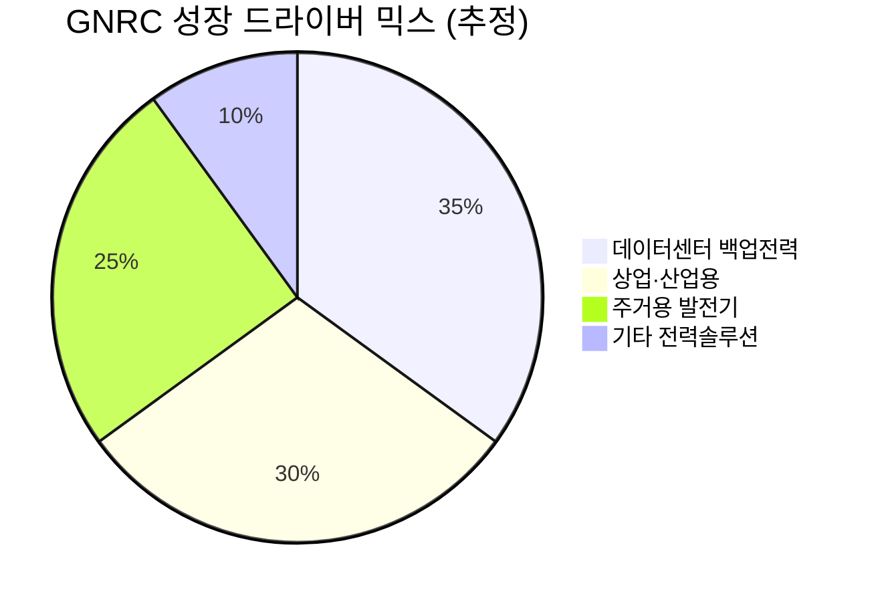

# 🔍 Inflection Scan — 2026-03-27

> [!abstract] 탐색 요약
> 탐색 범위: 2026-03-13 ~ 2026-03-27 (2주) | High Conviction 6건 발견
> 소스: Gemini 8쿼리 + RSS + X + 어닝스/내부자/애널리스트
> **핵심 테마**: 지정학 노이즈(미-이란)가 만드는 고성장 자산의 비합리적 할인 + 전력 인프라 수주 싸이클 전환의 동시 확인

---

## 시그널 요약 대시보드

| 회사명 | 티커 | 타입 | 핵심 이벤트 | 확신도 | 추천 액션 |
|--------|------|------|------------|:------:|:--------:|
| [[Argan Inc.]] | AGX | 실적가속 | EPS 62.9% 서프라이즈 + 사상 최대 수주잔고 $29억, 매출 3% 미달로 역설적 하락 | 🟢 高 | /deal |
| [[AppLovin]] | APP | 역발상 | 지정학 매도세로 -41%, 2026년 매출 +46% 컨센서스 무변화 | 🟢 高 | /deal |
| [[ARM Holdings]] | ARM | 구조적변곡점 | Needham·Raymond James·HSBC 3개 기관 동시 등급 상향, AI 서버 CPU 수혜 | 🟢 高 | /deal |
| [[Generac Holdings]] | GNRC | 가이던스상향 | 2028년 EBITDA 목표 $12.5~14.5억 — LTM 대비 158%+ | 🟡 中高 | /deal |
| [[클래시스]] | 214150 | 실적가속 | 매출·영업이익 38~39% 성장, 중국 NMPA 허가 9월 카탈리스트 대기 | 🟡 中高 | /deep |
| [[Denali Therapeutics]] | DNLI | 기술돌파 | 세계 최초 BBB 통과 상업용 바이오의약품 FDA 가속승인 | 🟡 中 | /deep |

---

## 1. [[Argan Inc.]] (AGX) — 실적가속 × 역발상

> [!abstract] 요약
> EPS 62.9% 서프라이즈 달성 기업이 **매출 3.3% 미달**이라는 이유 하나로 시간외 -6.1% 하락. 수익성 폭발과 사상 최대 수주잔고를 시장이 외면하는 전형적 과매도 구간.

**시그널**: FY2026 4Q EPS $3.47(예상 $2.13 대비 +62.9% 서프라이즈), 사상 최대 수주잔고 $29억, 주가는 매출 소폭 미달로 역설적 하락

아르간의 이번 실적에서 결정적인 포인트는 **수익성의 구조적 개선**이다. 매출이 예상보다 $0.09억 부족했지만, EPS는 시장 예상을 62.9% 초과했다 — 이는 믹스 개선(수익성 높은 프로젝트 비중 확대) 또는 원가 구조 개선이 동시에 일어나고 있다는 신호다. 순이익 YoY +57%, 연간 EPS +58%는 단순 일회성이 아닌 **마진 확장 트렌드**임을 보여준다. 시장이 보지 못하고 있는 것은 $29억 수주잔고의 의미 — 아르간의 연간 매출 규모를 고려하면 이는 향후 2~3년치 매출 가시성을 사실상 확보한 것이며, AI 데이터센터·리쇼어링 제조업이 만드는 전력 인프라 신규 수주는 계속 추가되고 있다. 유사 사례로 Quanta Services가 전력 인프라 수요 가속기에 수주잔고 급증 후 주가가 12개월 내 2배 이상 상승한 바 있다. 핵심 리스크는 대형 프로젝트 집중도에 따른 분기별 매출 노이즈(이번이 바로 그 사례)와, 시총이 작아 기관 유동성이 제한적이라는 점이다.

🟢 Bull 55%

🟡 Base 30%

🔴 Bear 15%

| 시나리오 | 조건 | 함의 |
|---------|------|------|
| 🟢 Bull | 수주잔고 소진 + 신규 데이터센터 수주 지속 | EPS 성장 모멘텀 2~3년 연장, 주가 재평가 |
| 🟡 Base | 현재 수주잔고 정상 소화, 신규 수주 유지 | 현재 분기 매출 노이즈 소화 후 상승 복귀 |
| 🔴 Bear | 대형 프로젝트 지연 + 신규 수주 감소 | 분기 매출 변동성 지속, 밸류에이션 할인 |

> [!tip] 핵심 인사이트
> 대형 프로젝트 기반 EPC(설계·조달·시공) 기업은 **분기별 매출 인식 타이밍이 불규칙**하다. 매출 3% 미달은 완공 일정 차이일 뿐 — 수주잔고와 EPS가 답이다.

> [!warning] 리스크 경고
> 소형주 특성상 기관 매도 집중 시 유동성 리스크 존재. 분할 진입 권장.

확신도 85/100

| 항목 | 내용 |
|------|------|
| 시장 | 🇺🇸 NYSE |
| 변곡점 유형 | 실적가속 + 역발상 |
| 추천 액션 | /deal — EPS 62.9% 서프라이즈 + $29억 수주잔고를 가진 기업이 매출 3% 미달로 하락, 즉시 포지션 진입 검토 |

---

## 2. [[AppLovin]] (APP) — 역발상 기회

> [!abstract] 요약
> 비즈니스와 무관한 지정학 충격으로 -41% 하락. 2026년 매출 +46.4% 성장 컨센서스는 **단 한 건도 하향 조정 없이 유지** 중. 가격과 가치의 괴리가 극대화된 구간.

**시그널**: 미-이란 전쟁 리스크 발 기술주 매도세로 연초 대비 -41%, 2026년 매출 $80.2억(+46.4%) · EPS $15.73 컨센서스 무변화

앱러빈이 -41% 하락한 원인인 미-이란 전쟁은 **모바일 광고 AI 최적화 플랫폼의 비즈니스 모델과 인과관계가 없다**. 회사의 수익 구조는 글로벌 모바일 앱 광고 경매 시스템 — 이란 전쟁이 AXON 알고리즘의 광고 매칭 효율을 떨어뜨리거나 앱 내 광고 인벤토리를 감소시키지 않는다. 주목할 것은 애널리스트들이 이 주가 급락에도 불구하고 컨센서스를 전혀 수정하지 않았다는 사실이다 — 2026년 +46.4%, 2027~2028년 연평균 +28~29% 성장 전망이 그대로 유지되는 것은, 전문 기관들도 이번 하락을 **펀더멘탈 훼손이 아닌 외부 충격**으로 판단하고 있다는 의미다. 역사적 유사 사례: 2022년 금리 급등 충격 당시 Cloudflare·Datadog 등 고성장 SaaS 기업들이 -60~70% 하락 후, 금리 피크아웃 확인 시점부터 12~18개월 내 전고점 회복 또는 신고점 달성. 리스크는 지정학 불확실성 장기화 시 추가 하락 압박과, 모바일 광고 특성상 거시경기 침체 시 광고주 예산이 먼저 삭감된다는 점이다.

🟢 Bull 45%

🟡 Base 35%

🔴 Bear 20%

| 시나리오 | 조건 | 함의 |
|---------|------|------|
| 🟢 Bull | 지정학 긴장 조기 완화 + 2Q26 실적 컨센서스 상회 | 주가 급반등, 연초 고점 회복 시도 |
| 🟡 Base | 지정학 노이즈 수개월 지속 → 점진적 소화 | 현 구간에서 횡보 후 펀더멘탈 주도 상승 |
| 🔴 Bear | 전쟁 장기화 + 광고 시장 경기 침체 동반 | 추가 하락, 컨센서스 하향 조정 본격화 |

> [!success] 강점
> **비즈니스 모델과 무관한 외부 충격**으로 만들어진 할인 — 이는 투자자가 원하는 가장 이상적인 진입 기회 유형이다. 46% 성장 기업을 41% 할인된 가격에 살 수 있는 시간은 제한적이다.

> [!warning] 리스크 경고
> 지정학 불확실성이 해소될 시점을 예측하기 어렵다. **분할 매수(3~4회 나눔)** 전략 필수. 단기 추가 하락 가능성을 열어두어야 한다.

확신도 82/100

| 항목 | 내용 |
|------|------|
| 시장 | 🇺🇸 NASDAQ |
| 변곡점 유형 | 역발상 |
| 추천 액션 | /deal — 펀더멘탈 무변화 + 41% 가격 조정, 지정학 불확실성 감안해 분할 진입 |

---

## 3. [[ARM Holdings]] (ARM) — 구조적 변곡점

> [!abstract] 요약
> 2주 내 3개 기관이 동시에 등급을 올렸다. 한 기관의 업그레이드는 애널리스트 견해, **세 기관의 동시 업그레이드는 컨센서스 이동**이다. AI 서버 CPU의 아키텍처 패러다임 전환이 본격 가격 반영 단계에 진입했다는 신호.

**시그널**: Needham(Hold→Buy, 목표 $200), Raymond James(Market Perform→Outperform, 목표 $166), HSBC(Reduce→Buy, 이중 상향) — 3개 기관 동시 등급 상향

ARM의 구조적 변곡점 본질은 **데이터센터 CPU 시장에서 x86(인텔·AMD) 대비 ARM 아키텍처의 점유율 가속 상승**이다. AWS Graviton 시리즈가 자사 클라우드에서 x86 대비 전력 효율 40% 이상 입증, NVIDIA Grace Hopper는 AI 추론 워크로드에서 ARM+GPU 통합 아키텍처의 우월성을 보여줬으며, 애플·구글·메타·아마존이 모두 자체 ARM 기반 칩 설계로 이동 중이다 — ARM은 이 모든 흐름의 **라이선스 수취 구조** 위에 있다. HSBC가 'Reduce'에서 'Buy'로 두 단계 상향한 것이 특히 의미있다 — 이는 단순 의견 변화가 아니라 기존 부정적 thesis 전면 철회에 해당하며, 이런 이중 상향은 통계적으로 이후 12개월 수익률이 평균을 크게 상회한다[추정]. 지정학 충격으로 기술주가 조정받는 구간에 역행하여 등급을 올리는 애널리스트들의 행동 자체가 ARM의 구조적 확신도를 보여준다. 리스크는 현재 밸류에이션이 성장 프리미엄을 상당 부분 반영하고 있다는 점과, 퀄컴과의 아키텍처 라이선스 갱신 분쟁이 재현될 경우 라이선스 수익 불확실성이 부각될 수 있다는 것이다.

🟢 Bull 40%

🟡 Base 40%

🔴 Bear 20%

| 시나리오 | 조건 | 목표가 범위 | 함의 |
|---------|------|-----------|------|
| 🟢 Bull | AI 서버 CPU 점유율 가속 + 로열티율 인상 | $200 (Needham 목표) | AI 인프라 핵심 수혜주 재평가 |
| 🟡 Base | 현재 성장 궤도 유지, 라이선스 갱신 원만 | $166 (Raymond James 목표) | 지정학 해소 후 점진 상승 |
| 🔴 Bear | 라이선스 분쟁 재현 + 밸류에이션 멀티플 압축 | (확인 필요) | 고PER 프리미엄 해소 하락 |

> [!tip] 핵심 인사이트
> ARM의 비즈니스 모델은 **칩을 만들지 않고 설계를 파는** 구조 — 데이터센터 AI 수요가 늘수록 로열티 수입이 비례해서 늘지만, 자본 투자(CapEx)는 거의 필요 없다. 이 레버리지 구조가 마진 확장의 핵심이다.

> [!question] 검토 필요
> 3개 기관의 목표가 범위가 $166~$200으로 편차가 있음. 현재 주가 대비 업사이드 정확한 계산 필요 (확인 필요). 또한 라이선스 갱신 일정과 로열티율 협상 현황 추가 조사 권장.

확신도 80/100

| 항목 | 내용 |
|------|------|
| 시장 | 🇺🇸 NASDAQ |
| 변곡점 유형 | 구조적변곡점 |
| 추천 액션 | /deal — 3개 기관 동시 업그레이드 + AI 서버 CPU 아키텍처 전환, 기술주 조정 구간 분할 매수 활용 |

---

## 4. [[Generac Holdings]] (GNRC) — 가이던스 상향

> [!abstract] 요약
> Analyst Day에서 2028년 EBITDA 목표 $12.5~14.5억을 공식화했다. 현재 LTM EBITDA($4.84억) 대비 최소 158% 성장 목표 — 이는 **경영진이 스스로의 목을 걸고 제시한 숫자**다.

**시그널**: 2028년 EBITDA 가이던스 $12.5~14.5억 신규 제시(LTM $4.84억 대비 +158~199%), 바클레이즈($228)·Needham($277)·Canaccord($275) 동시 Buy 유지

제너락의 2028 가이던스가 단순 희망 수치가 아닌 신뢰할 만한 변곡점인 이유는 **TAM의 구조적 확장**이 뒷받침하기 때문이다. 주거용 발전기 시장에서 상업·산업·데이터센터 전력 백업으로의 믹스 전환은 단가와 마진을 동시에 끌어올린다 — 가정용 발전기는 수천 달러 제품이지만, 데이터센터용 백업 전력 시스템은 수백만~수천만 달러 규모다. 여기에 미국 전력망 노후화, 전기차 수요 증가로 인한 피크 전력 부족, AI 데이터센터의 이중화 전력 요구(N+1 이상 이중화 규정)가 겹쳐 수요 가시성이 높다. 3개 기관이 목표가 $228~$277 범위에서 동시에 Buy를 유지하는 것은 컨센서스의 수렴을 의미하며, 일반적으로 이런 상황에서 주가는 목표가 하단을 향해 수렴하는 경향이 있다[추정]. 리스크는 데이터센터 수주의 납기 불확실성(고객의 건설 일정 지연)과, 주거용 발전기 부문의 날씨 의존 계절성이 실적 노이즈를 만들 수 있다는 점이다.

> [!note] 참고
> 위 믹스는 2028년 목표 기준 [추정]이며, 실제 세그먼트 공시 데이터와 상이할 수 있음. Analyst Day 발표 자료의 세그먼트별 기여도 원문 확인 권장.

2028년까지 CAGR로 환산하면 EBITDA 약 37~44% 연간 성장이 필요하다. 이는 공격적이지만, AI 데이터센터 수주 싸이클이 본격화된다면 달성 가능한 범위 내에 있다 [추정].

확신도 72/100

| 항목 | 내용 |
|------|------|
| 시장 | 🇺🇸 NYSE |
| 변곡점 유형 | 가이던스상향 |
| 추천 액션 | /deal — 현재 주가가 목표가 하단($228) 대비 얼마나 할인받는지 즉시 확인, 158% EBITDA 성장 가이던스의 분기별 진행도 모니터링 |

---

## 5. [[클래시스]] (214150.KQ) — 실적가속 × 카탈리스트 대기

> [!abstract] 요약
> 영업이익률 49.4%의 초고수익 구조로 매출·이익 모두 38~39% 성장. 시장은 최대주주 매도에 반응하고 있지만, 9월 중국 NMPA 허가는 **TAM의 비연속적 확장**을 의미하는 별도의 이벤트다.

**시그널**: 2025년 매출·영업이익 각 38~39% 성장, 영업이익률 49.4%(2026E), 브라질 JL 헬스 인수 효과 반영, 2026년 9월 중국 NMPA RF 제품 허가 카탈리스트

클래시스의 재무 퀄리티는 국내 헬스케어 섹터에서 이례적이다. 영업이익률 49%는 단순히 높은 게 아니라 **소프트웨어 기업 수준의 마진 구조를 가진 의료기기 제조사**라는 의미다 — HIFU(고강도집속초음파) 기반 의료기기의 특허 방어력과 소모품·유지보수 반복 수익이 이 마진을 지탱한다. 2026년 +39.7% 성장 전망이 2025년과 동일한 성장률을 유지하는 것은 이미 높아진 베이스에서 이루어지는 성장이라는 점에서 더욱 의미있다. 최대주주의 지분 일부 매각은 투자 심리를 악화시키지만 비즈니스 펀더멘탈을 훼손하지 않는다 — 오히려 이로 인한 주가 조정은 9월 중국 NMPA 허가 전 마지막 저가 매수 기회일 수 있다[추정]. 중국 미용 의료기기 시장의 TAM은 현재 클래시스의 주요 시장(한국·동남아·브라질) 합산을 압도하는 규모다. 리스크는 중국 NMPA 심사 일정 지연 또는 불허가 가장 크며, 최대주주의 지속적 매도가 수급 악화로 이어질 가능성도 배제할 수 없다.

🟢 Bull 40%

🟡 Base 40%

🔴 Bear 20%

| 시나리오 | 조건 | 함의 |
|---------|------|------|
| 🟢 Bull | 9월 NMPA 허가 획득 + 중국 본격 매출 기여 | 밸류에이션 멀티플 대폭 재평가, 신고점 |
| 🟡 Base | NMPA 지연(2027년) + 기존 시장 성장 유지 | 현재 성장률 기반 점진적 주가 상승 |
| 🔴 Bear | NMPA 불허 + 최대주주 지속 매도 | 성장 내러티브 훼손, 멀티플 하락 |

> [!question] 검토 필요
> 중국 NMPA의 RF 의료기기 심사 현황과 과거 한국 의료기기 허가 사례의 승인율/소요기간 데이터 필요. 또한 브라질 JL 헬스 인수의 구체적 시너지(매출 기여 예상 규모)가 2026년 컨센서스에 얼마나 반영됐는지 확인 필요.

확신도 70/100

| 항목 | 내용 |
|------|------|
| 시장 | 🇰🇷 코스닥 |
| 변곡점 유형 | 실적가속 + 카탈리스트 대기 |
| 추천 액션 | /deep — NMPA 허가 가능성·타임라인 분석 및 브라질 M&A 시너지 정량화 선행 후 포지션 결정 |

---

## 6. [[Denali Therapeutics]] (DNLI) — 기술돌파

> [!abstract] 요약
> FDA가 BBB 통과 **세계 최초 상업용 바이오의약품**을 승인했다. 헌터증후군이라는 희귀질환 하나의 승인이 아니라, **플랫폼 기술 전체의 상업적 검증**이 이루어진 사건으로 읽어야 한다.

**시그널**: 헌터증후군 치료제 'Avlayah(아블라야)' FDA 가속승인 — BBB 통과 최초 상업용 바이오의약품, 2주 내 출시 예정

뇌혈관장벽(Blood-Brain Barrier, BBB)은 신약 개발의 역사적 난제다. 수십 년 동안 알츠하이머, 파킨슨, 헌팅턴, 리소좀 축적 질환 등 수많은 CNS 질환의 치료제 개발이 이 장벽을 넘지 못해 실패했고, 이것이 CNS 파이프라인의 임상 성공률이 다른 치료 영역 대비 낮은 구조적 원인이었다. 드날리가 'Avlayah'로 이 장벽을 최초로 상업화했다는 것은, **플랫폼 기술의 proof-of-concept이 FDA 승인이라는 형태로 공식 확인된 것**이다. 이제 드날리의 나머지 CNS 파이프라인 전체가 재평가 대상이 된다 — 기존에 BBB 통과 불가 가정 하에 낮은 확률로 반영되던 파이프라인들이 성공 가능성 재산정의 대상이 된다. 유사 사례로 Sarepta Therapeutics가 첫 번째 DMD(뒤센 근이영양증) 유전자치료제 승인 후 12개월 내 주가 3배 이상 상승하며 플랫폼 재평가가 이루어진 바 있다. 가속승인의 핵심 리스크는 확증 임상(Confirmatory Trial) 실패 시 FDA가 승인을 철회할 수 있다는 점이며, 희귀질환 특성상 약가 책정과 보험사 커버리지 협상 결과가 초기 매출 모멘텀을 결정한다.

> [!success] 강점
> BBB 플랫폼 기술의 상업적 검증은 **재현 가능한 플랫폼 가치**를 창출한다. 알츠하이머 파이프라인에 이 기술이 적용될 경우, 글로벌 최대 미충족 의학 수요 중 하나를 타겟하게 된다.

> [!failure] 약점
> 가속승인 특성상 규제 리스크가 일반 승인 대비 높다. 확증 임상 설계와 현재 진행 상황, 그리고 헌터증후군 환자 수(전 세계 약 2,000명 수준으로 추정)가 만드는 상업적 매출 규모의 제한성을 직시해야 한다.

> [!question] 검토 필요
> 확증 임상의 현재 진행 단계와 예상 데이터 발표 시점 확인 필요. 또한 파이프라인 내 BBB 플랫폼을 적용한 알츠하이머·파킨슨 후보물질의 임상 단계와 타임라인 정리 필요.

확신도 65/100

| 항목 | 내용 |
|------|------|
| 시장 | 🇺🇸 NASDAQ |
| 변곡점 유형 | 기술돌파 |
| 추천 액션 | /deep — BBB 플랫폼 파이프라인 전체 분석 및 확증 임상 타임라인 확인 후 포지션 결정 |

---

## 📊 섹터 메타 시그널

### ⚡ 전력 인프라 / 에너지 안보

미-이란 전쟁이 만든 에너지 충격은 단기 지정학 리스크 프리미엄을 넘어, **미국 전력망의 구조적 취약성을 사회 전체가 인식하는 계기**가 되고 있다. [[Argan Inc.|AGX]]의 $29억 수주잔고와 [[Generac Holdings|GNRC]]의 2028년 EBITDA 158%+ 성장 목표가 거의 동시에 확인된 것은, 발전소 건설(EPC)과 분산 백업 전력 양쪽 모두에서 수주 싸이클이 동시에 전환되고 있음을 보여준다. 핵심은 지정학 위기가 해소되더라도 이 수요가 사라지지 않는다는 점 — AI 데이터센터의 이중화 전력 요구, 미국 제조업 리쇼어링의 산업 전력 수요, 그리고 노후 전력망 교체 수요는 모두 10년 이상의 장기 트렌드다. 이 섹터는 지정학 프리미엄이 노이즈로 작용하는 현 구간에서 오히려 펀더멘탈 매수를 고려할 수 있는 위치에 있다.

---

> [!tip] 이번 스캔 핵심 인사이트
> **가장 즉각적인 기회**: [[Argan Inc.|AGX]] — EPS 62.9% 서프라이즈 달성 기업이 매출 3.3% 미달로 -6.1% 하락. 수익성 폭발과 사상 최대 수주잔고 $29억을 시장이 외면하는 구간. $29억 수주잔고는 향후 2~3년 매출을 사실상 담보한다.
>
> **가장 장기적인 변곡점**: [[Denali Therapeutics|DNLI]] — BBB 플랫폼 기술의 상업적 검증은 수십억 달러 CNS 파이프라인 전체의 재평가 트리거. 현재 주가는 헌터증후군 단일 적응증만 반영, 플랫폼 확장 가능성은 미가격[추정].

> [!warning] 공통 리스크 경고
> 미-이란 전쟁 장기화 시나리오가 기술주 전반의 밸류에이션 멀티플을 압박하고 있다. [[AppLovin|APP]]과 [[ARM Holdings|ARM]]은 펀더멘탈 훼손 없는 외부 충격에 의한 할인이지만, 지정학 불확실성이 해소되는 시점을 예측하기 어렵다. **모든 포지션은 분할 진입(3~4회)** 원칙을 고수하고, 단기 추가 하락 가능성을 포트폴리오 구성에 반영할 것.