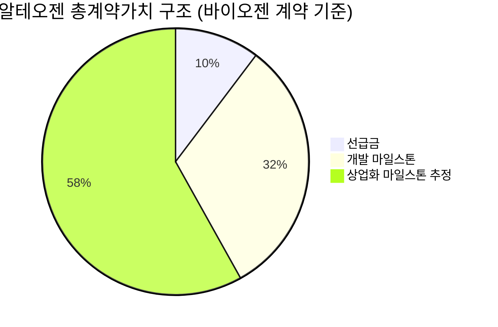
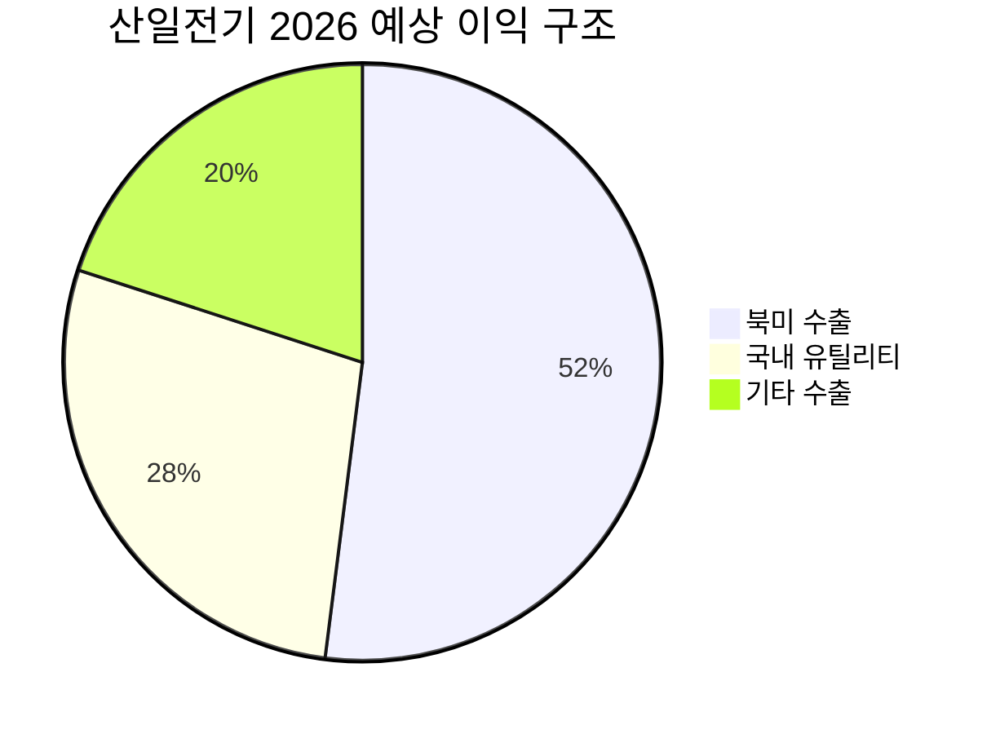

# 🔍 Inflection Scan — 2026-03-28

> [!abstract] 탐색 요약
> 탐색 범위: 2026-03-28 기준 최근 2주 | High Conviction 7건 발견
> 소스: Gemini 8쿼리 + RSS + X + 어닝스/내부자/애널리스트
> **핵심 테마**: 이란發 매크로 혼란 속 AI 인프라·방산·크루즈의 펀더멘탈 vs 시장심리 괴리 — 구조적 공급망 재편의 변곡점을 역발상으로 선점할 타이밍

---

## 시그널 요약 대시보드

| 회사명 | 티커 | 타입 | 핵심 이벤트 | 확신도 | 추천 액션 |
|--------|------|------|------------|:------:|:--------:|
| [[루멘텀 홀딩스]] | LITE | 기술돌파 | 엔비디아 20억 달러 직접투자 + 다년 구매계약 | 🟢 高 | /deep |
| [[알테오젠]] | 196170.KQ | 사업변곡점 | 바이오젠 5.79억 달러 SC 플랫폼 계약, 선급금 595억 원 | 🟢 高 | /deal |
| [[카니발 코퍼레이션]] | CCL | 실적가속 | FY26 Q1 사상최대 실적, 연간 가이던스 1.5억 달러 상향 | 🟡 中高 | /deal |
| [[오토루스 테라퓨틱스]] | AUTL | 가이던스상향 | 2026 가이던스 1.2~1.35억 달러, YoY +61~82% 성장 예고 | 🟡 中高 | /deep |
| [[산일전기]] | 127120.KQ | 실적가속 | 4Q25 OPM 38.7%, 2026 매출+33%·영업이익+38% 전망 | 🟢 高 | /deep |
| [[M-트론인더스트리스]] | MPTI | 선행지표 | 수주잔고 62% 급증(7,640만 달러), 방산 장기 프로그램 수주 | 🟡 中高 | /deep |
| [[삼성SDI]] | 006400.KS | 사업변곡점 | ESS LFP 계약 누적 약 5조 원, 북미 탈중국 공백 선점 | 🟢 高 | /deal |

---

## 1. [[루멘텀 홀딩스]] (LITE) — 기술돌파

**시그널**: 엔비디아가 루멘텀 EML 레이저 칩에 20억 달러 직접 투자 + 다년 우선 구매계약 체결 (2026년 3월 2일)

> [!abstract] 핵심 요약
> 엔비디아가 공급망을 '잠근' 것은 단순 전략적 파트너십이 아니다 — AI 데이터센터 상호연결이 칩 문제에서 광학 부품 문제로 이동했음을 엔비디아 스스로 공식 확인한 사건이다.

엔비디아의 이번 투자는 AI 인프라의 병목이 GPU 연산력에서 **광 인터커넥트(Optical Interconnect)** 로 이동했다는 사실을 시장에서 가장 잘 아는 플레이어가 공급망을 직접 잠근 행위다. 루멘텀이 보유한 인듐인(InP) 기반 EML(전계흡수 변조 레이저, Electro-absorption Modulated Laser) 칩은 800G/1.6T 광 모듈의 핵심 소재로, 경쟁사가 단기간 추격하기 어려운 소재·공정 장벽이 존재한다. 투자 약정 규모인 20억 달러는 루멘텀의 연간 매출 규모(약 20억 달러)와 맞먹어, 이 계약 하나가 기존 매출 가시성 전체를 교체하는 수준의 수주 확보를 의미한다. 단, 계약 세부 조건 — take-or-pay(최소 구매 보장) 여부와 가격 조정 조항 — 에 따라 실제 매출 반영 시점과 규모가 달라지며, Coherent(II-VI)의 추격과 AI CapEx 사이클 둔화 리스크는 현재 유가 급등 환경에서 무시할 수 없다. 유사 사례로 2016년 애플이 Finisar에 3억 9천만 달러 선급 투자 후 해당 기업의 멀티플이 재평가된 선례를 참고할 때, 전략적 투자자에 의한 공급망 편입은 단기 주가 이벤트가 아닌 구조적 리레이팅의 출발점이다.

🟢 Bull 35%

🟡 Base 45%

🔴 Bear 20%

| 시나리오 | 조건 | 투자 함의 |
|----------|------|-----------|
| 🟢 Bull | Take-or-pay 조항 확인, AI CapEx 유지 | 다년 매출 가시성 확보 → 멀티플 재평가 |
| 🟡 Base | 조건 일부 미확인, 생산 램프업 지연 | 현재 주가 수준에서 완만한 상승 |
| 🔴 Bear | AI CapEx 둔화, Coherent 추격 가속 | 계약 규모 축소 → 주가 재조정 |

> [!warning] 리스크 경고
> 유가 WTI $114 환경에서 데이터센터 전기료 급등 → 하이퍼스케일러의 CapEx 속도 조절 가능성. 또한 계약 세부 조건이 공개되지 않은 상태에서 투자 규모만으로 매출 기여를 추정하는 것은 [추정] 수준임을 주의.

> [!tip] 핵심 인사이트
> **공급망을 잠근다(lock-in)**는 것은 경쟁자 배제를 의미한다. 엔비디아가 돈을 투자해 루멘텀의 생산 우선권을 확보했다면, 그것은 곧 Coherent와 기타 경쟁자에게 이 공급을 닫은 것과 같다.

| 항목 | 내용 |
|------|------|
| 시장 | 🇺🇸 NASDAQ |
| 변곡점 유형 | 기술돌파 / 구조적 공급망 재편 |
| 추천 액션 | /deep — take-or-pay 조건·최소 구매 보장액·분기 가이던스 반영 수준 심층 검토 |

---

## 2. [[알테오젠]] (196170.KQ) — 사업변곡점

**시그널**: 바이오젠 자회사와 SC 제형 전환 플랫폼(ALT-B4) 독점 라이선스 계약 — 총 5.79억 달러, 선급금 최대 595억 원

> [!abstract] 핵심 요약
> 첫 빅파마(머크) 계약이 플랫폼 검증이었다면, 두 번째 계약(바이오젠)은 플라이휠의 가속을 의미한다. 선급금 595억 원은 2024년 매출의 39%에 해당하는 즉각적 현금 유입이다.

알테오젠의 히알루로니다제 플랫폼 ALT-B4는 정맥주사(IV) 바이오의약품을 피하주사(SC) 제형으로 전환하는 기술로, 이번 바이오젠 계약은 플랫폼의 재현 가능성(reproducibility)을 확인하는 두 번째 데이터포인트다. 시장이 첫 번째 머크 계약의 로열티율 2%에 실망하며 주가를 조정시킨 것과 달리, 이번 계약에서는 더 높은 로열티율 협상 가능성이 존재하고 — 바이오젠의 협상 포지션이 머크보다 약하기 때문이다(머크는 최초 레퍼런스 계약을 가져간 대신 낮은 로열티를 취한 구조). 결정적으로 바이오젠이 계약한 약물이 **임상 3상 단계**로, 상업화까지 통상적인 임상 2상 이후 계약보다 훨씬 짧은 시간이 소요된다는 점이 매출 실체화 속도를 앞당긴다. 플랫폼 비즈니스의 특성상 첫 계약 이후 추가 계약의 협상 속도는 기하급수적으로 빨라지는 '플라이휠 효과'가 작동하며, 4월 AACR 학회는 이 모멘텀을 재점화할 추가 촉매다. 핵심 리스크는 바이오젠 계약의 로열티율이 시장 기대(4~6%) 수준에 못 미칠 경우 재차 실망 매물이 출회될 가능성이며, 임상 3상 약물의 최종 FDA 승인 불확실성도 상존한다.

> [!success] 강점
> - 플랫폼 재사용 모델: 한 번 구축한 SC 전환 기술을 다수 약물에 반복 적용 → 고정비 대비 한계 수익 급증
> - 대상 약물이 임상 3상 단계 → 상업화 리드타임 단축
> - 선급금 595억 원의 즉각적 현금 확보 → 재무 안전성 강화

> [!warning] 리스크 경고
> 로열티율 공개 시 시장 기대(4~6%) 하회 가능성. 머크 계약(2%)이 '레퍼런스 프라이싱'으로 작용해 후속 계약의 협상력을 제약할 수 있다는 점은 [추정] 수준이나 반드시 검토 필요.

| 항목 | 내용 |
|------|------|
| 시장 | 🇰🇷 코스닥 |
| 변곡점 유형 | 사업변곡점 / 플랫폼 재사용 라이선스 가속 |
| 추천 액션 | /deal — 바이오젠 계약 로열티율·마일스톤 구조 확인 후 포지션 판단, 4월 AACR 전 체크포인트 |

---

## 3. [[카니발 코퍼레이션]] (CCL) — 실적가속

**시그널**: FY2026 Q1 매출 62억 달러·조정 EPS 0.20달러(YoY +50%) 사상 최대 실적, 연간 가이던스 1.5억 달러 상향

> [!abstract] 핵심 요약
> 단순 실적 호조가 아니라 팬데믹 부채 상환 완료 후 이익 레버리지가 극대화되는 구조 전환 구간에 진입했다. 유가 상승이 오히려 육상 해외여행 대비 크루즈의 상대적 매력을 높이는 역설적 수혜도 존재한다.

카니발의 이번 실적이 단순한 수요 호조를 넘어 **구조적 이익 레버리지** 확대 국면임을 보여주는 핵심 지표는, 매출 성장(YoY 성장률 확인 필요)보다 조정 EPS가 YoY +50% 성장했다는 사실이다 — 이는 매출 증가가 운영 레버리지를 통해 이익으로 전환되는 속도가 가속됨을 의미한다. 팬데믹 이후 대규모 부채 상환이 마무리 단계에 접어들며 이자비용 감소가 순이익을 추가로 끌어올리는 이중 레버리지 구조가 형성됐다. 크루즈 산업의 객실 공급은 단기간 대규모 증설이 불가능한 반면 수요가 공급을 초과하는 상태가 지속되어 평균 객단가(ASP) 인상 지속 가능성이 높으며, '막바지 수요(Late Booking Demand)'가 강력하다는 경영진 발언은 수요 가시성의 질적 신호다. 역설적으로 이란 전쟁으로 중동·유럽 육상 여행의 불확실성이 높아진 환경에서, 항로 변경이 상대적으로 유연한 크루즈가 대안 여행 수요를 흡수할 가능성도 존재한다[추정]. 핵심 리스크는 연료비(Fuel Cost)로 WTI $114 수준에서 연료 헤징 커버 비율과 미헤징 노출이 결정적이며, 중동 분쟁 장기화 시 특정 항로 취소에 따른 용선율(Occupancy Rate) 하락 가능성이 있다.

🟢 Bull 30%

🟡 Base 50%

🔴 Bear 20%

| 시나리오 | 조건 | 투자 함의 |
|----------|------|-----------|
| 🟢 Bull | 유가 안정화 + 수요 초과 지속 + PROPEL 실행 | EPS 재가속 → 멀티플 재평가 |
| 🟡 Base | 유가 $100~$115 유지, 헤징으로 일부 방어 | 가이던스 달성, 완만한 주가 상승 |
| 🔴 Bear | 유가 $130+ 지속 + 항로 취소 확대 | 연료비 급증으로 EPS 가이던스 하향 |

> [!tip] 핵심 인사이트
> PROPEL 장기 계획(2029년 목표)이 의미하는 것은 경영진이 현재의 수요 사이클을 일시적 반등이 아닌 구조적 성장으로 보고 있다는 자신감의 표현이다. 가이던스 상향이 PROPEL 발표와 동시에 나온 것은 우연이 아니다.

| 항목 | 내용 |
|------|------|
| 시장 | 🇺🇸 NYSE |
| 변곡점 유형 | 실적가속 / 부채 디레버리지 완료 후 이익 레버리지 극대화 |
| 추천 액션 | /deal — 연료 헤징 커버리지 비율·2026년 전체 용선율 데이터 확인 후 역발상 진입 검토 |

---

## 4. [[오토루스 테라퓨틱스]] (AUTL) — 가이던스 상향

**시그널**: 2026년 매출 가이던스 1.2억~1.35억 달러 — 2025년 실적(7,430만 달러) 대비 YoY +61~82% 성장 예고

> [!abstract] 핵심 요약
> 규제 승인 이후 매출이 S커브 초입에 진입한 CAR-T 치료제의 상업화 가속 — 가이던스 제시 자체가 수요 가시성에 대한 경영진 확신의 신호다.

오토루스의 AUCATZYL(aubaquenem)은 B세포 급성 림프모구성 백혈병(B-cell ALL)을 적응증으로 승인받은 CAR-T 치료제로, 2025년 첫 상업화 연도에 7,430만 달러를 달성한 후 2026년에 최소 61% 성장을 가이던스로 제시했다는 것은 주요 암센터의 치료 프로토콜 편입(Protocol Adoption)이 본격화됨을 의미한다. CAR-T 치료제 상업화의 가장 큰 채택 장벽은 제조 복잡성(환자 맞춤형 생산)과 보험 적용 범위인데, 61% 이상의 성장 가이던스는 이 두 가지 장벽 모두에서 어느 정도 가시적인 해결이 진행됨을 시사한다. 주목할 점은 이 성장률이 소수의 대형 암센터에서 시작된 처방이 중견 병원으로 확산되는 '티핑포인트(Tipping Point)' 구간의 특성을 보인다는 것이다[추정] — 초기 채택 이후 처방 성장이 선형이 아닌 기하급수적으로 가속되는 패턴. 기존 경쟁 치료제(Novartis의 Kymriah, Gilead/Kite의 Yescarta) 대비 임상적 우위가 확인된 경우 처방 전환이 빠르게 진행될 수 있으나, 이 세 제품 모두 성숙 시장에서 경쟁하는 만큼 처방 점유율 확대는 공격적인 MSL(의학과학연구원) 활동과 연동된다.

확신도 68/100 — 가이던스 달성 가능성은 높으나 분기별 처방 데이터 검증 필요

> [!question] 검토 필요
> - AUCATZYL의 분기별 Rx(처방 건수) 추이가 선형 증가인지 가속 증가인지가 핵심
> - 주요 암센터(MSK, MD Anderson, Mayo Clinic 등) 채택 현황 확인 필요
> - 보험 적용(Coverage) 확대 속도: 메디케어/메디케이드 커버리지 결정 현황

> [!warning] 리스크 경고
> CAR-T 치료제는 환자 1인당 생산(Autologous 방식)으로 제조 병목이 발생할 경우 매출 인식 지연이 발생한다. 제조 COGS와 생산 용량 확장 계획을 반드시 확인할 것.

| 항목 | 내용 |
|------|------|
| 시장 | 🇺🇸 NASDAQ |
| 변곡점 유형 | 가이던스상향 / 상업화 S커브 초입 가속 |
| 추천 액션 | /deep — 분기별 처방 성장 추이·암센터 채택 현황·보험 커버리지 확대 속도 심층 분석 |

---

## 5. [[산일전기]] (127120.KQ) — 실적가속

**시그널**: 4Q25 영업이익률 38.7% 달성, 2026년 매출 6,687억(+33%)·영업이익 2,476억(+38%) 전망, 복수 증권사 목표주가 상향

> [!abstract] 핵심 요약
> 변압기 제조업에서 38.7% OPM은 단순 사이클 수혜가 아닌 가격 결정권을 보유한 공급자 우위를 증명한다. 154kV 초고압 변압기 진입은 TAM의 질적 업그레이드다.

변압기 제조업의 통상적 OPM이 10~20% 수준임을 감안하면 산일전기의 38.7% OPM은 **가격 결정권(Pricing Power)** 을 가진 기업만이 달성할 수 있는 수준이다 — 이는 현재 미국 유틸리티 시장에서 초고압 변압기 공급이 수요를 구조적으로 따라가지 못하는 공급 부족 상황의 직접적 반영이다. KB증권이 제시한 2026년 전망(매출 +33%, 영업이익 +38%)에서 이익 성장률이 매출 성장률을 상회한다는 것은 영업 레버리지와 제품 믹스 개선(더 고마진인 154kV 초고압 제품 비중 확대)이 동시에 작동하고 있음을 의미한다. AI 데이터센터의 전력 수요가 가파르게 증가하는 구조 — 하이퍼스케일러 1개 시설이 소도시 수준의 전력을 소비 — 는 미국 전력망 업그레이드 투자를 향후 5년 이상 지속시킬 구조적 수요를 만들고 있으며, 한국 중소형 변압기 기업 중 북미 수출 레퍼런스를 가진 기업은 극히 제한적이다. 단, 이 높은 마진이 지속 가능하려면 후발주자(국내외)의 진입 장벽 — 인증 취득 기간(UL·IEEE 인증 통상 2~3년), 레퍼런스 부재 — 이 유지되어야 하며, 단일 고객사 집중도가 높을 경우 재계약 협상에서 가격 압박을 받을 리스크가 있다.

> [!note] 참고
> 위 파이차트의 수치는 공개 세그먼트 분류 데이터가 없어 [추정] 수치입니다. 실제 IR 자료 확인이 필요합니다.

확신도 82/100 — OPM 38.7% 실현 + 복수 증권사 상향이 실체화 확인

> [!success] 강점
> - 38.7% OPM: 변압기 업계 평균 대비 2배 수준 → 구조적 가격 결정권 증거
> - 154kV 초고압 제품 진입: TAM 질적 확장, 마진 추가 개선 여지
> - 북미 인증 보유: 경쟁사 진입 시 2~3년 인증 공백 활용 가능
> - 이익 성장률(+38%) > 매출 성장률(+33%): 영업 레버리지 작동 확인

> [!warning] 리스크 경고
> 수주잔고 규모가 공개되지 않아 2026년 가이던스의 실현 가능성 검증이 (확인 필요) 상태. 북미 전력 인프라 투자 지연 또는 단일 대형 고객사 이탈 시 OPM 급락 가능성 있음.

| 항목 | 내용 |
|------|------|
| 시장 | 🇰🇷 코스닥 |
| 변곡점 유형 | 실적가속 / 구조적 마진 개선 + TAM 업그레이드 |
| 추천 액션 | /deep — 2026년 수주잔고 규모·북미 고객사 현황·154kV 제품 마진 프로파일 심층 분석 |

---

## 6. [[M-트론인더스트리스]] (MPTI) — 선행지표

**시그널**: 4Q 수주잔고 62% 급증 (7,640만 달러), 방산 장기 프로그램 수주 확대

> [!abstract] 핵심 요약
> 소형주이지만 수주잔고 62% 급증은 향후 4~6분기 매출의 가시성이 근본적으로 바뀌었음을 의미한다. 지정학 리스크가 오히려 이 기업의 수요 기반을 강화한다.

M-트론인더스트리스는 군사용 GPS·통신·항법 시스템에 사용되는 주파수 제어 부품(크리스털 오실레이터, OCXO 등)을 공급하는 방산 특화 소부장 기업으로, 분기 매출 규모(약 1,420만 달러)에 비해 수주잔고 7,640만 달러는 약 1.35년치 매출에 해당하는 가시성을 확보한 것이다. 방산 조달의 특성상 장기 고정가 계약이 포함될 경우 매출 인식이 안정적으로 분산되며, 이란 전쟁과 우크라이나 분쟁으로 각국 국방부의 '기술 우선 조달' 사이클이 가속화되는 것은 정밀 주파수 제어 부품 수요를 구조적으로 끌어올린다. 글로벌 기관투자자의 레이더에 잡히지 않는 시가총액 소형주의 특성상 수주잔고 급증이 주가에 반영되는 속도가 느리다는 점은 역발상 진입 기회이자 동시에 유동성 리스크다 — 소형주 유동성 제한으로 대규모 포지션 구축 시 슬리피지가 크게 발생할 수 있다. 수주잔고의 장기 고정가 계약 비율과 주요 고객 프로그램(예: 특정 무기체계 프로그램 연계 여부)이 이 시그널의 신뢰도를 결정한다.

확신도 65/100 — 수주잔고 실체 확인되나 계약 구조 미검증

> [!question] 검토 필요
> - 수주잔고의 계약 유형: 장기 고정가(FFP) vs 단기 수시 계약(IDIQ) 비율
> - 수주잔고 납품 시기: 1년 내 인식 vs 다년 분산 인식
> - 주요 고객 프로그램명 및 예산 확보 여부 (방산 조달 예산 삭감 리스크)

| 항목 | 내용 |
|------|------|
| 시장 | 🇺🇸 NYSE American |
| 변곡점 유형 | 선행지표 / 방산 수주잔고 급증 |
| 추천 액션 | /deep — 수주잔고 계약 구조·납품 타이밍·고객 다변화·마진 추이 검토 필요 |

---

## 7. [[삼성SDI]] (006400.KS) — 사업변곡점

**시그널**: ESS용 LFP 배터리 계약 누적 약 5조 원(2주 내 연속 체결) — 북미 FEOC 규정으로 만들어진 공백 선점

> [!abstract] 핵심 요약
> '선언'에서 '실행'으로 전환됐다. ESS LFP 계약 5조 원은 전기차 의존에서 벗어나는 포트폴리오 전환의 구체적 실체화이며, FEOC 규정이 만든 구조적 공백은 삼성SDI의 北美 진입 타이밍을 최적화한다.

삼성SDI가 2주 안에 연속으로 체결한 LFP 배터리 계약들(엘앤에프 1.6조, 미국 대형 에너지기업 2조, 추가 1.5조)의 누적 합산이 5조 원을 넘어섰다는 것은 단순 사업 다각화 발표가 아닌 수주 실체화의 확인이다. 핵심 드라이버는 미국 FEOC(금지외국기관, Foreign Entity of Concern) 규정으로, CATL·BYD 등 중국 배터리 기업의 미국 ESS 시장 참여가 제한됨에 따라 생긴 대규모 공급 공백을 비중국 배터리 기업들이 채워야 하는 구조적 전환이다. 삼성SDI가 스텔란티스와의 합작법인(StarPlus Energy)을 LFP 생산 플랫폼으로 활용함으로써 미국 현지 생산 요건을 충족할 수 있는 것은 단순 가격 경쟁이 아닌 **규정 준수 경쟁력**이라는 진입 장벽이다. 현재 주가는 전기차 배터리 수요 둔화(EV 슬로다운)가 반영된 밸류에이션 수준으로 거래되고 있어, ESS 사업의 구조적 성장 가치가 주가에 충분히 반영되지 않은 이중 디스카운트 상태일 가능성이 높다[추정]. 핵심 리스크는 LFP 원가 경쟁력에서 CATL이 여전히 30~40% 저렴한 수준이라는 점과, 미국 정치 환경 변화에 따른 FEOC 규정 완화 또는 적용 유예 가능성이다.

FEOC 구조적 수혜 60%

원가·정책 리스크 40%

| 비교 항목 | 삼성SDI (LFP) | CATL | 비고 |
|-----------|:-------------:|:----:|------|
| 미국 FEOC 적합성 | 🟢 충족 | 🔴 미충족 | 결정적 진입 장벽 |
| LFP 원가 경쟁력 | 🟡 열위 (추정) | 🟢 우위 | CATL 대비 (확인 필요) |
| 현지 생산 역량 | 🟢 StarPlus 활용 | 🔴 제한적 | IRA 요건 충족 |
| ESS 수주 실적 | 🟢 5조 원 확보 | 🟡 미국 진입 제한 | 2주 내 연속 계약 |

> [!tip] 핵심 인사이트
> FEOC 규정이 지속될수록 삼성SDI의 북미 ESS 포지션은 규제 보호 아래 성장한다. 반대로 규정이 완화되면 CATL의 재진입이 가능해져 경쟁 구도가 급변한다. 따라서 미국 에너지부(DOE)의 FEOC 시행 현황이 이 시그널의 핵심 모니터링 변수다.

> [!warning] 리스크 경고
> 계약 체결과 실제 납품·매출 인식 사이의 시차(Lead Time)가 ESS 프로젝트 특성상 1~2년 이상일 수 있다. 5조 원 계약이 언제부터 P&L에 반영되는지 확인이 필수적이다.

| 항목 | 내용 |
|------|------|
| 시장 | 🇰🇷 코스피 |
| 변곡점 유형 | 사업변곡점 / FEOC 구조적 공백 선점 + 포트폴리오 전환 실체화 |
| 추천 액션 | /deal — ESS 매출 인식 시점·LFP 원가 경쟁력 vs CATL·FEOC 시행 현황 확인 |

---

## 📊 섹터 메타 시그널

### AI 데이터센터 광학 인프라

> [!note] 섹터 메타 시그널
> 엔비디아의 [[루멘텀 홀딩스]] 20억 달러 직접 투자는 AI 데이터센터 상호연결(Interconnect) 병목이 칩 설계 문제에서 **광학 부품 공급** 문제로 이동했음을 공급망 최상위 플레이어가 공식 확인한 사건이다. 800G/1.6T 전환 및 CPO(Co-Packaged Optics)/LPO(Linear-drive Pluggable Optics) 전환 사이클은 2026~2028년 가속화될 것으로 예상되며, 루멘텀 외에도 Coherent(II-VI), Fabrinet(위탁생산), Marvell 산하 Inphi 등 광학 공급망 전체가 재평가 구간에 진입할 수 있다. 단, 유가 급등으로 인한 데이터센터 전기료 부담이 하이퍼스케일러의 CapEx 속도를 제약할 경우 이 사이클의 속도가 달라질 수 있다.

### 전력 인프라 (변압기 / 전력기기)

> [!note] 섹터 메타 시그널
> [[산일전기]]의 38.7% OPM 달성과 복수 증권사 목표주가 상향은 한국 중소형 전력기기주 전반의 재평가 국면을 시사하는 선행 데이터포인트다. AI 데이터센터의 전력 수요 급증(하이퍼스케일러 단일 캠퍼스가 수백 MW 소비)이 미국·유럽의 전력망 업그레이드 투자를 수년간 지속시키는 구조에서, 초고압 변압기·배전기기 분야의 공급 부족은 2027년까지 이어질 가능성이 높다. IRA와 CHIPS Act 후속 전력 수요, 유럽 재무장 관련 인프라 투자가 맞물리며 이 섹터의 수요 기반은 단일 사이클이 아닌 복수의 독립적 드라이버를 가진 구조임에 주목해야 한다.

---

> [!warning] 매크로 리스크 경고 — 전체 포지션 관리
> 이란 전쟁에 따른 WTI $114, 나스닥 -10% 조정이 진행 중인 환경에서 위 7개 시그널은 펀더멘탈 근거가 충분하나 **매크로 리스크 해소 전까지 포지션 규모를 보수적으로 유지**해야 한다. 특히 루멘텀·산일전기 등 AI CapEx 연동 종목은 유가 상승에 따른 데이터센터 전기료 급등이 AI 인프라 투자 속도를 늦출 수 있다는 시나리오를 리스크 매트릭스에 반드시 포함할 것.

> [!note] 참고 — 미포함 종목
> MU(마이크론)는 제외 목록에 포함되어 별도 시그널로 추출하지 않았으나, FY2026 Q2 실적(매출 238.6억 달러 YoY +196%, EPS 12.20달러 컨센서스 +38% 상회, 차기분기 GPM 가이던스 81%)은 역대급이며, 현재 주가 하락은 펀더멘탈 훼손이 아닌 매크로 매도세 성격임을 참고. WDC(샌디스크)의 EPS 서프라이즈 77.65% 후 주가 -8%는 역발상 후보이나 추가 데이터 확인 후 판단 권고.