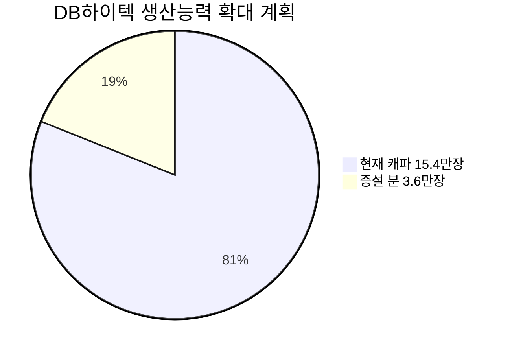

# 🔍 Inflection Scan — 2026-03-31

> [!abstract] 탐색 요약
> 탐색 범위: 2026-03-31 기준 최근 2주 | High Conviction 7건 발견
> 소스: Gemini 8쿼리 + RSS + X + 어닝스/내부자/애널리스트
> **핵심 테마**: 이란발 매크로 충격이 AI 인프라 슈퍼사이클 & 바이오 구조 변곡점 기업들의 가격을 왜곡 중 — 펀더멘탈 괴리가 역발상 진입 창을 열고 있다

---

## 시그널 요약 대시보드

| 회사명 | 티커 | 타입 | 핵심 이벤트 | 확신도 | 추천 액션 |
|--------|------|------|------------|:------:|:--------:|
| [[삼천당제약]] | 000250.KS | 사업변곡점 | 미국 경구 GLP-1 제네릭 독점 계약, 마일스톤 1,509억 + 10년 순이익 90% | ⭐⭐⭐⭐⭐ | /deep |
| [[셀트리온]] | 068270.KS | 실적가속 | CMO 수주잔고 1조원 돌파, 영업이익 1.8조 가이던스 + 자사주 소각 | ⭐⭐⭐⭐⭐ | /deal |
| [[대한전선]] | 001440.KS | 선행지표 | 수주잔고 3.6조 역대 최대(YoY +30%), 4Q 영업이익 +99.1% | ⭐⭐⭐⭐ | /deep |
| [[DB하이텍]] | 000990.KS | 선행지표 | 8인치 팹 가동률 98%, ASP 5~20% 인상 + 증설 20% 계획 | ⭐⭐⭐⭐⭐ | /deal |
| [[마이크론 테크놀로지]] | MU | 역발상/실적가속 | FY2Q26 매출 YoY +196% 역대 최고치 vs 주가 -30% 괴리 | ⭐⭐⭐⭐⭐ | /deal |
| [[트랜스다임 그룹]] | TDG | 가이던스상향 | FY2026 매출 가이던스 10.4% 상향, 상용 OEM 17% 성장 | ⭐⭐⭐⭐ | /deal |
| [[덴티움]] | 145720.KS | 역발상 | 3개 증권사 7일 내 동시 Hold→Buy 상향, 시장 미반영 | ⭐⭐⭐ | /deep |

---

## 1. [[삼천당제약]] (000250.KS) — 사업변곡점

**시그널**: 자체 기술 S-PASS로 특허 회피한 경구 세마글루티드 제네릭, 마일스톤 1,509억원 + 10년간 파트너사 순이익 90% 수취 계약 체결

> [!tip] 핵심 인사이트
> 이 계약의 가치는 마일스톤 숫자가 아니다. 연간 100조원 시장(미국 80조원)에서 **향후 10년간 경쟁사 진입 차단** 상태로 순이익의 90%를 수취하는 비대칭 구조 — 제네릭 승인 한 건이 기업 전체를 재정의할 수 있는 0→1 변곡점이다.

삼천당제약은 노보노디스크의 흡수 촉진제 특허를 S-PASS 플랫폼으로 회피함으로써, 특허 만료 이후에도 경쟁사들이 동일한 기술을 쓰지 못하는 구간에서 독점적 지위를 확보했다. 세마글루티드 경구제(Rybelsus)의 글로벌 시장은 연간 약 100조원 규모이며, 미국만으로도 80조원에 달하는데, 이 시장의 극히 일부만 점유해도 삼천당제약의 현재 시가총액을 압도하는 캐시플로우가 발생하는 구조다. 계약 구조에서 '파트너사 순이익의 90%'라는 조건은 일반적인 로열티(3~10% 수준)와 질적으로 다른 파트너십으로, 삼천당제약이 사실상 미국 사업의 수익 대부분을 수취하는 형태다. 유사 사례로 Teva의 Copaxone 제네릭 독점 구간(2014~2017년)을 참조할 수 있으나, 세마글루티드의 시장 규모는 비교 자체가 불공평할 만큼 크다. 핵심 리스크는 ① FDA ANDA 심사 타임라인 불확실성(통상 3~5년), ② 노보노디스크의 특허 소송 역공, ③ 파트너사의 미국 영업망 실행 역량이며, 세 가지 모두 /deep 단계에서 정밀 검증이 필요하다.

🟢 Bull 35%

🟡 Base 45%

🔴 Bear 20%

| 시나리오 | 조건 | 의미 |
|---------|------|------|
| 🟢 Bull | FDA 승인 + 소송 방어 성공 + 파트너 판매 실행 | 기업 가치 비선형 재평가 |
| 🟡 Base | FDA 승인, 노보 소송 지연 → 제한적 점유율 | 마일스톤 수령 + 제한적 로열티 |
| 🔴 Bear | 특허 소송 패소 or FDA 거절 | 계약 조건 무력화, 원위치 |

> [!warning] 리스크 경고
> FDA ANDA 심사는 통상 36~60개월 소요. 노보노디스크는 자사 핵심 자산 방어를 위해 공격적 특허 소송을 제기할 가능성이 높다. S-PASS의 특허 회피 견고성에 대한 독립적 IP 실사가 선행되어야 한다.

| 항목 | 내용 |
|------|------|
| 시장 | 🇰🇷 코스피 |
| 변곡점 유형 | 사업변곡점 |
| 추천 액션 | /deep — FDA 타임라인·S-PASS IP 견고성·파트너사 신용도 3가지 검증 후 /deal 전환 판단 |

---

## 2. [[셀트리온]] (068270.KS) — 실적가속

**시그널**: Q1 2026 CMO 수주잔고 1조원 돌파(일라이 릴리 6,787억 + 추가 최대 3,754억), 영업이익 1.8조 가이던스 + 911만주 자사주 소각 동시 발표

> [!tip] 핵심 인사이트
> 세 개의 독립 트리거(CMO 수주 급가속 + 오너 직접 복귀 + 자사주 소각)가 동일 분기에 발생했다. 각각 따로여도 의미 있는데, 이 세 가지가 동시에 터진 것은 경영진이 현 주가를 저평가로 판단하고 있음을 행동으로 증명하는 것이다.

셀트리온의 구조적 변화는 수익원의 성격이 달라지고 있다는 점에서 주목할 만하다. 기존 바이오시밀러 사업은 승인된 의약품의 시장 점유율 경쟁이었지만, CMO 사업은 글로벌 제약사의 생산을 수탁하는 것으로 **고객사가 셀트리온의 설비와 역량에 종속**되는 구조적으로 더 안정적인 수익 모델이다. 일라이 릴리와의 6,787억원 계약은 세계 최대 제약사 중 하나가 셀트리온의 CMO 역량을 검증했다는 신뢰 증서이며, 이후 연속 수주(최대 3,754억)는 이것이 일회성이 아님을 보여준다. 수주잔고는 통상 1.5~2년 내에 매출로 인식되므로, 2027~2028년 실적은 현재 수주잔고만으로도 상당 부분 예측 가능하다. 서정진 회장 복귀 후 영업이익 1.8조 가이던스는 증권사 컨센서스를 상회하는 수준으로, 이 수치가 달성되면 현재 밸류에이션에서 의미 있는 멀티플 재평가가 발생한다. 핵심 리스크는 바이오시밀러 가격 경쟁 심화(특히 미국 시장)와 비만치료제 파이프라인의 임상 지연이다.

확신도 85/100 — 트리거 3중 동시 발생

| 카탈리스트 | 내용 | 실적 반영 시점 |
|-----------|------|--------------|
| 🟢 CMO 수주잔고 1조+ | 일라이 릴리 6,787억 + 추가 최대 3,754억 | 2027~2028년 매출 확정 |
| 🟢 영업이익 가이던스 | 1.8조원 (컨센서스 상회) | 2026년 연간 |
| 🟢 자사주 소각 | 911만주 소각 | 즉시 EPS 개선 |
| 🟢 오너 복귀 | 서정진 회장 직접 경영 | 의사결정 속도 개선 |
| 🟡 비만치료제 | 4세대 파이프라인 개발 중 | 중장기 (확인 필요) |

> [!success] 강점
> 수주잔고 기반 실적 가시성이 높아 CMO 사업은 단기 매크로 변동에 상대적으로 둔감하다. 이미 계약된 물량은 이란 전쟁이나 환율 변동과 무관하게 실행된다.

| 항목 | 내용 |
|------|------|
| 시장 | 🇰🇷 코스피 |
| 변곡점 유형 | 실적가속 + 구조적 전환 |
| 추천 액션 | /deal — Q1 트리거 3중 동시 발생. 현재 매크로 조정 구간이 진입 타이밍 |

---

## 3. [[대한전선]] (001440.KS) — 선행지표

**시그널**: 2025년 4분기 수주잔고 3조 6,633억원(YoY +30%) 역대 최대, 4Q 영업이익 YoY +99.1%

> [!abstract] 요약
> 수주잔고는 미래 실적의 예고편이다. 역대 최대 수주잔고 + 믹스 개선(초고압·해저 비중 확대)이 결합되면 2026~2027년은 매출과 이익이 동시에 성장하는 구간이 된다.

대한전선의 수주잔고 30% 급증은 단순한 외형 성장이 아니라 **수익성이 다른 제품군으로의 믹스 전환**을 동반한다는 점에서 중요하다. 일반 배전선과 달리 초고압·해저 케이블은 진입장벽이 높고 마진이 구조적으로 더 두텁다. 4Q 영업이익이 전년 대비 99.1% 증가한 것은 이 믹스 개선 효과가 이미 P&L에 반영되기 시작했음을 의미하며, 수주잔고가 매출로 전환되는 향후 2년간 이 트렌드는 지속될 가능성이 높다. 글로벌 AI 데이터센터 전력 인프라 투자 확대와 미국의 탈중국 공급망 재편은 고난도 케이블 수요의 구조적 배경을 제공한다. 다만 /deep에서 반드시 확인할 사항은 수주잔고의 정확한 구성(초고압·해저 vs 일반 비중)과 프로젝트별 매출 인식 스케줄이다 — 수주잔고가 크더라도 고마진 프로젝트의 비중과 실제 인식 시점에 따라 이익 예측이 크게 달라진다. 이란 전쟁으로 인한 중동 프로젝트 발주 지연과 원자재(구리) 가격 상승은 단기 리스크 요인이다.

🟢 Bull 40%

🟡 Base 45%

🔴 Bear 15%

> [!question] 검토 필요
> 수주잔고 3.6조원 중 초고압·해저케이블이 차지하는 비중이 핵심 변수다. 고마진 프로젝트 비중이 높을수록 이익 레버리지가 크게 작동한다. 사업보고서/IR 자료에서 세그먼트별 수주 현황 확인 필수.

| 항목 | 내용 |
|------|------|
| 시장 | 🇰🇷 코스피 |
| 변곡점 유형 | 선행지표 (수주→실적 전환 구간) |
| 추천 액션 | /deep — 수주잔고 구성 및 매출 인식 스케줄 확인 후 /deal 전환 |

---

## 4. [[DB하이텍]] (000990.KS) — 선행지표

**시그널**: AI 전력반도체 수요로 8인치 팹 가동률 98% 도달, ASP 5~20% 인상 가능성 + 생산능력 15.4만→19만장 확대

> [!tip] 핵심 인사이트
> 가동률 98% + ASP 인상 + 물량 증설은 각각 독립적인 이익 성장 동인이다. 이 세 가지가 동시에 작동하면 이익 증가율이 매출 증가율을 구조적으로 상회하는 레버리지 구간에 진입한다.

DB하이텍의 8인치 파운드리 사업에서 결정적인 구조적 특성은 **신규 공급이 사실상 차단되어 있다**는 점이다. 8인치 팹은 12인치 대비 경제성이 낮아 신규 투자가 거의 없고, 기존 캐파는 PMIC, 아날로그 반도체 등 AI 인프라 전력 관련 수요로 이미 포화 상태다. 이 공급 경직성 속에서 가동률이 98%에 달하면, 추가 ASP 협상에서 고객은 대안이 없어 가격 인상을 수용할 수밖에 없는 구조다. ASP 5~20% 인상이 실현될 경우, 고정비가 이미 분산된 풀가동 상태에서의 가격 인상은 거의 100%가 이익으로 직행한다. 여기에 생산능력 23.4% 확대(15.4만→19만장)가 더해지면 2027년은 단가와 물량이 동시에 성장하는 드문 국면이 된다. 2025년 3분기부터 풀캐파를 유지해왔다면 2026년 2분기 단가 협상이 가장 가까운 실적 확인 포인트다.

| 이익 레버리지 분석 | 내용 |
|-----------------|------|
| 🟢 ASP +5% 시 | 풀가동 기준 매출 5% 상승, 이익 증가폭은 매출 증가폭 상회 |
| 🟢 ASP +20% 시 | 구조적 마진 재평가 트리거 — 업종 평균 PER 상향 가능 |
| 🟢 캐파 +23% 시 | 물량 성장이 더해지며 복합 성장 |
| 🔴 중국산 8인치 | 중국 파운드리 공급 증가 시 ASP 인상 제한 |

> [!warning] 리스크 경고
> 중국의 8인치 파운드리 증설이 공급 과잉을 유발할 경우 ASP 인상 시나리오가 희석된다. 중국 SMIC·화홍 8인치 캐파 동향을 병행 모니터링해야 한다.

| 항목 | 내용 |
|------|------|
| 시장 | 🇰🇷 코스피 |
| 변곡점 유형 | 선행지표 → 실적가속 (이익 레버리지 구간 진입) |
| 추천 액션 | /deal — 풀가동 + ASP 인상 + 증설 3중 트리거. 2Q26 단가 협상 결과 확인하며 분할 접근 |

---

## 5. [[마이크론 테크놀로지]] (MU) — 역발상 / 실적가속

**시그널**: FY2Q26 매출 238.6억 달러(YoY +196%), 컨센서스 18.9% 상회, GM 75% 사상 최고 — 발표 후 주가 약 -30% 급락

> [!abstract] 요약
> 분기 실적은 역대 최고이고, 경영진은 HBM4를 포함해 내년치까지 완판이라 했다. 그런데 주가는 30% 내렸다. 이 괴리를 어떻게 해석하느냐가 투자의 핵심이다.

마이크론의 FY2Q26은 숫자 자체보다 **경영진 발언의 밀도**에 주목해야 한다. CEO가 HBM4 포함 내년도 전체 공급이 완판이라고 했고, CBO가 고객들이 원하는 물량의 100%를 받지 못하고 있다고 확인했다 — 이것은 수요 전망이 아니라 현재 진행형의 공급 부족 확인이다. 매출총이익률 75%는 메모리 반도체 역사상 거의 보기 드문 수준으로, HBM 비중이 확대될수록 믹스 효과로 GM이 더 올라가는 구조다. 주가가 -30% 하락한 배경은 소비자 DRAM 가격 우려와 이란 전쟁 지정학 리스크이지만, HBM과 소비자 DRAM은 고객군·수요 구조·가격 결정 메커니즘이 완전히 다른 시장이다. 주가 하락이 이 두 시장을 구분하지 않고 일괄 적용한 결과라면, 이는 전형적인 가격 왜곡이다. 유사 사례: 2023년 3분기 엔비디아가 실적 발표 후 단기 급락했다가 HBM 수요 가시성이 확인되며 3개월 내 신고가를 경신한 패턴과 구조가 유사하다.

🟢 Bull 45%

🟡 Base 35%

🔴 Bear 20%

| 시나리오 | 조건 | 시사점 |
|---------|------|-------|
| 🟢 Bull | HBM 비중 가속 확대 + 소비자 DRAM 바닥 확인 | GM 추가 확대, 주가 갭업 복귀 |
| 🟡 Base | HBM 완판 유지, 소비자 DRAM 횡보 | 현재 GM 유지, 점진적 주가 회복 |
| 🔴 Bear | 중국 수출 제한 확대 + 데이터센터 투자 지연 | 수요 가시성 훼손, 추가 하락 |

> [!success] 강점
> GM 75%는 삼성·SK하이닉스 대비 HBM 믹스 효과가 가장 극명하게 나타나는 구조다. HBM 비중이 계속 확대되면 75%는 플로어가 될 수 있다.

> [!warning] 리스크 경고
> 중국 수출 제한이 추가 확대될 경우 마이크론은 삼성·SK하이닉스보다 중국 매출 비중이 낮아 상대적으로 덜 타격받지만, 글로벌 수요 심리 위축은 피할 수 없다. 분할 매수로 리스크를 분산할 것.

| 항목 | 내용 |
|------|------|
| 시장 | 🇺🇸 NASDAQ |
| 변곡점 유형 | 역발상 + 실적가속 |
| 추천 액션 | /deal — 펀더멘탈 사상 최고 vs 주가 -30% 괴리. FY3Q 가이던스 확인하며 분할 매수 |

---

## 6. [[트랜스다임 그룹]] (TDG) — 가이던스 상향

**시그널**: FY2026 매출 가이던스 기존 대비 10.4% 상향(중간값 99.4억 달러), 상용 OEM 매출 17% 성장

> [!abstract] 요약
> 독점 공급 항공우주 부품 + 보잉·에어버스 생산 정상화 + 방산 수요 증가. 트랜스다임은 시장 사이클을 타지 않는 비즈니스 모델로 10%+ 가이던스 상향이 의미하는 바가 일반 기업과 다르다.

트랜스다임의 비즈니스 모델은 항공기에 한 번 장착된 부품은 FAA 인증으로 인해 대체재로 교체할 수 없다는 구조적 독점(sole-source)에 기반한다. 이 특성으로 TDG는 연간 5~10%의 부품 가격 인상을 거의 자동적으로 관철시켜왔고, 이것이 10년 이상 S&P 500 아웃퍼폼의 근거다. 이번 가이던스 상향의 핵심 동인은 보잉·에어버스의 생산 재개로 상용 OEM 매출이 17% 성장한 것인데, 이는 2022~2024년 공급망 중단으로 억눌렸던 수요가 본격 분출되는 시점임을 의미한다. 이란 전쟁 국면에서 방산 수요 증가는 애프터마켓(군용 유지보수) 매출의 추가 상승 요인이다. 애널리스트 12명의 평균 목표주가가 현 주가 대비 39.6% 업사이드를 제시하고 있으며, 이 수준의 컨센서스는 단순 낙관론이 아니라 가이던스 상향 수치에 기반한다. 핵심 리스크는 보잉의 생산 재정상화가 예상보다 느릴 경우와 고유가로 인한 항공 여행 수요 감소다.

확신도 82/100 — 가이던스 상향 + 구조적 독점 + 방산 모멘텀

| 성장 동인 | 상태 | 지속성 |
|---------|------|-------|
| 🟢 상용 OEM +17% | 보잉·에어버스 재가동 | 2~3년 지속 [추정] |
| 🟢 애프터마켓 가격 인상 | 연 5~10% 관철 중 | 구조적 (sole-source) |
| 🟢 방산 수요 증가 | 이란 전쟁 국면 | 단기~중기 |
| 🟡 가이던스 달성 여부 | 중간값 99.4억 달러 | 보잉 생산속도 연동 |

> [!note] 참고
> 트랜스다임은 S&P 500 내에서 독점적 가격 결정력을 가장 순수한 형태로 보유한 기업 중 하나로 평가받는다. 매크로 충격기에 오히려 상대적 강점이 부각되는 방어적 성장주의 특성을 갖는다.

| 항목 | 내용 |
|------|------|
| 시장 | 🇺🇸 NYSE |
| 변곡점 유형 | 가이던스 상향 + 억눌린 수요 분출 |
| 추천 액션 | /deal — 매크로 조정 시 매수. 방산 모멘텀 추가로 현재 환경에서 방어적 포지션으로도 유효 |

---

## 7. [[덴티움]] (145720.KS) — 역발상 기회

**시그널**: DB증권·미래에셋·키움증권 3사가 7일 내 동시 Hold→Buy 상향 (3월 4일~11일), 이란 전쟁 노이즈로 시장 미반영

> [!abstract] 요약
> 복수 증권사의 동시 컨센서스 이동은 개별 리포트보다 강한 시그널이다. 다만 매크로 충격으로 주가에 반영되지 않아 기회 구간이 형성됐을 가능성이 있다 — 실적 수치 확인이 전제다.

덴티움의 경우, 단일 증권사가 아닌 3개 증권사가 7일 이내에 동일한 방향으로 투자의견을 전환했다는 사실 자체가 강한 시그널이다. 컨센서스 전환은 통상 하나의 촉매(실적 서프라이즈, 구체적 사업 계기)가 있어야 복수 기관이 동시에 움직이는데, 이 촉매가 무엇인지 확인하는 것이 /deep의 핵심 과제다. 중국 임플란트 시장은 2023~2024년 정책 변화로 억눌렸던 구간이 있었고, 회복 시 국내 업체들 중 중국 시장 노출도가 높은 덴티움이 가장 큰 수혜를 받을 수 있다. 현재 이란 전쟁 충격으로 코스피 중소형 의료기기주 전반이 하락 압력을 받고 있어, 펀더멘탈 개선 시그널이 주가에 반영되지 않은 상태라면 매수 기회 구간이 될 수 있다. 그러나 구체적 실적 수치(매출 성장률, OPM 추이, 중국 매출 비중 변화)는 현재 데이터에서 확인되지 않아 직접 검증이 반드시 필요하다.

> [!question] 검토 필요
> 3개 증권사 동시 상향의 직접 근거가 되는 실적 수치와 목표주가가 확인되지 않음. /deep 단계에서 ① 2025년 연간 실적 및 2026년 가이던스, ② 중국 매출 회복 속도, ③ 현재 주가 대비 애널리스트 목표가 평균 괴리를 반드시 확인할 것.

확신도 62/100 — 컨센서스 이동은 확인, 실적 수치 미검증

| 항목 | 내용 |
|------|------|
| 시장 | 🇰🇷 코스피 |
| 변곡점 유형 | 역발상 + 애널리스트 컨센서스 전환 |
| 추천 액션 | /deep — 3사 상향의 실적 근거 확인 후 목표가 괴리 분석 필요. 확인 전 포지션 구성 자제 |

---

## 📊 섹터 메타 시그널

### AI 메모리 & 전력 인프라 — 구조적 슈퍼사이클 진입

> [!tip] 핵심 인사이트
> 마이크론의 HBM 완판 확인, DB하이텍의 8인치 팹 풀가동, 대한전선의 수주잔고 역대 최대는 각각 독립적인 데이터포인트가 아니다. 이것들은 AI 인프라 수요가 공급의 물리적 한계에 부딪힌 하나의 현상을 서로 다른 밸류체인 위치에서 동시에 확인하고 있는 것이다.

마이크론의 HBM 공급이 2027년까지 완판이라는 경영진 직접 확인, DB하이텍의 8인치 팹 가동률 98%, 대한전선의 수주잔고 역대 최대는 AI 인프라 수요 밸류체인의 메모리→전력반도체→전력 케이블 전 구간에서 동시다발적으로 공급 병목이 발생하고 있음을 의미한다. 단기 이란 전쟁 노이즈는 이 사이클의 본질인 AI 데이터센터 투자 필요성과 무관하며, 오히려 지정학 불안이 디지털 인프라 자체 구축 수요를 가속시키는 역설적 효과도 있다. 이 사이클에서 가장 위험한 투자 실수는 단기 매크로 충격을 구조적 수요 둔화로 혼동하는 것이다.

| 밸류체인 위치 | 기업 | 핵심 지표 | 상태 |
|------------|------|---------|------|
| 🟢 AI 메모리 | [[마이크론 테크놀로지]] | HBM 완판, GM 75% | 역대 최고 |
| 🟢 전력반도체 파운드리 | [[DB하이텍]] | 가동률 98%, ASP 인상 임박 | 풀가동 |
| 🟢 전력 케이블 인프라 | [[대한전선]] | 수주잔고 +30% 역대 최대 | 실적 전환 진행 중 |
| 🟢 고대역폭 메모리 선두 | [[SK하이닉스]] | (별도 분석 필요) | 참조 |

---

> [!warning] 공통 리스크 — 이란 전쟁 매크로 환경
> S&P 500 -7.4%, 원/달러 1,520원, 유가 100달러 돌파 환경에서 모든 시그널의 단기 주가 변동성은 확대된다. 위 7개 시그널 모두 **펀더멘탈 변곡점은 명확하나, 매크로 노이즈가 진입 타이밍을 어렵게 만드는 구간**이다. 포지션 크기를 줄이고 분할 접근하되, 변곡점 자체의 방향성을 의심할 근거는 없다.