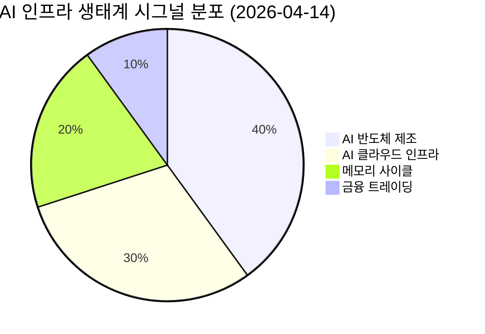

# 🔍 Inflection Scan — 2026-04-14

> [!abstract] 탐색 요약
> 탐색 범위: 2026-04-14 기준 최근 2주 | High Conviction 5건 발견
> 소스: Gemini 8쿼리 + RSS + X + 어닝스/내부자/애널리스트
> **핵심 테마**: AI 수요가 '투기적 선투자'에서 '실제 워크로드 기반 수요'로 전환되며 반도체·AI 인프라 실적이 동시에 검증 국면에 진입

---

## 시그널 요약 대시보드

| 회사명 | 티커 | 타입 | 핵심 이벤트 | 확신도 | 추천 액션 |
|--------|------|------|------------|:------:|:--------:|
| [[삼성전자]] | 005930.KS | 실적가속 | Q1 2026 영업이익 57.2조원, OPM 43% — 컨센서스 40%+ 상회 | ⭐⭐⭐⭐⭐ | /deep |
| [[CoreWeave]] | CRWV | 선행지표 | 메타와 총 352억 달러 백로그 확보, Vera Rubin 초기 상업 배포 포함 | ⭐⭐⭐⭐ | /deep |
| [[TSMC]] | TSM | 실적가속 | 4월 16일 실적 발표 — 매출 YoY +40%, EPS +55% 컨센서스, AI 칩 수요 구조적 가속 | ⭐⭐⭐⭐ | /deal |
| [[SanDisk]] | SNDK | 사업변곡점 | NAND 가격 +234% 전망, Nasdaq-100 편입, Citi 목표가 875→980달러 상향 | ⭐⭐⭐ | /deep |
| [[Goldman Sachs]] | GS | 실적가속 | Q1 2026 주식 트레이딩 53.3억 달러 역대 최고, EPS 컨센서스 7.4% 상회 | ⭐⭐⭐⭐ | /deal |

---

## 1. [[삼성전자]] (005930.KS) — 실적가속

**시그널**: Q1 2026 영업이익 57.2조원, OPM 43%로 분기 사상 최고치 — 컨센서스 대비 최소 32%, 최대 50% 상회

> [!abstract] 요약
> 단순 업황 회복이 아닌 HBM 매출 비중 확대에 따른 수익 구조의 구조적 변화. Q4 2025 OPM 21% → Q1 2026 OPM 43%의 22%p 도약은 분기 단위에서 유례가 없다.

Q1 2026 영업이익 57.2조원은 시장 컨센서스(38~43조원)를 최소 32%에서 최대 50% 상회하는 슈퍼 서프라이즈로, OPM이 단 한 분기 만에 21%→43%로 두 배 이상 개선된 것이 핵심이다 [출처: 회사 IR 2026.4.7, 005930.KS 잠정 실적 공시]. 이 마진 도약은 단순 DRAM·NAND 가격 반등만으로는 설명되지 않으며, 엔비디아·구글·AMD 향 HBM(고대역폭메모리) 공급 계약이 매출 믹스를 고수익 제품 중심으로 구조적으로 재편했기 때문이다. 가트너가 2026년 DRAM 가격 +125%, NAND 가격 +234%를 전망하고 있어 이 마진 수준이 일회성 버블이 아닌 다분기 지속 가능성이 있음을 지지한다. EPS 컨센서스가 지난주 26,367원에서 36,119원으로 37% 급상향됐고, 다수 증권사가 목표주가를 36만~40만원대로 올렸으나 현 주가 대비 여전히 괴리가 남아 있어 추가 상향 여지가 존재한다. 핵심 리스크는 중국향 HBM 판매 제한 유지와 미-이란 지정학 긴장에 따른 수출 규제 재확대이며, 2분기 경영진 가이던스에서 HBM 매출 비중과 ASP(평균판매단가) 추세를 확인하는 것이 추가 포지셔닝의 핵심 관문이다. 유사 사례로는 2017년 반도체 슈퍼사이클 당시 SK하이닉스가 분기 서프라이즈 직후 6개월간 80%+ 상승한 패턴이 있다.

### 분기 실적 비교

| 지표 | Q4 2025 | Q1 2026 | QoQ 변화 |
|------|---------|---------|---------|
| 매출 | 93.8조원 | 133조원 | 🟢 +41.7% |
| 영업이익 | 20.1조원 | 57.2조원 | 🟢 +185% |
| OPM | 21.4% | 43.0% | 🟢 +21.6%p |
| EPS 컨센서스 | — | 36,119원 | 🟢 전주比 +37% 상향 |

### 시나리오

🟢 Bull 55% — HBM 점유율 확대, NAND 가격 급등 지속

🟡 Base 30% — 현 수준 유지

🔴 Bear 15% — 수출규제

| 시나리오 | 핵심 가정 | 목표주가 [추정] |
|---------|---------|--------------|
| 🟢 Bull | HBM 2분기도 OPM 40%+, NAND ASP 반등 가속 | 40만~45만원 |
| 🟡 Base | OPM 35~40% 유지, DRAM 가격 완만한 상승 | 34만~38만원 |
| 🔴 Bear | 미국 수출규제 재확대, HBM 납품 지연 | 24만~27만원 |

### 점수

실적 서프라이즈 강도 92/100 — 컨센서스 50% 상회 이례적

마진 지속 가능성 80/100 — 가트너 DRAM +125% 전망 지지

지정학 리스크 62/100 — 중국 HBM 규제 미해소

> [!warning] 리스크 경고
> 중국향 HBM 판매 제한이 유지되는 한, 삼성전자는 엔비디아·구글·AMD 납품 물량 중심으로 성장할 수밖에 없어 고객 집중 리스크가 내재한다. 미국 수출 규제 재강화 시 OPM 43% 수준은 유지 불가.

| 항목 | 내용 |
|------|------|
| 시장 | 🇰🇷 코스피 |
| 변곡점 유형 | 실적가속 |
| 추천 액션 | /deep — OPM 43% 구조의 지속 가능성과 2분기 HBM 가이던스 확인이 핵심 |

---

## 2. [[CoreWeave]] (CRWV) — 선행지표

**시그널**: 메타와 210억 달러 추가 계약 체결, 누적 352억 달러 백로그 확보 — Nvidia Vera Rubin 플랫폼 초기 상업 배포 파트너 지위 획득

> [!abstract] 요약
> 단순 클라우드 임대 사업자가 아닌 Nvidia 차세대 플랫폼의 독점적 초기 배포 파트너로서의 지위 확보. 352억 달러 백로그는 IPO 직후 종목으로서는 이례적인 수익 가시성이다.

CoreWeave는 2026년 4월 9일 메타와 2032년 12월까지 210억 달러 규모의 AI 클라우드 용량 공급 계약을 추가로 체결했으며 [출처: CoreWeave 보도자료 2026.4.9], 2025년 9월의 142억 달러 계약에 더해 양사 간 총 협력 규모가 352억 달러에 달한다. 이는 CoreWeave의 현재 연간 매출 대비 수년치에 해당하는 가시성을 확보한 것으로, 통상적인 클라우드 계약에서 찾아보기 어려운 수준의 장기 약정이다. 더욱 중요한 것은 이 계약이 Nvidia 차세대 Vera Rubin 플랫폼의 초기 대규모 상업 배포를 포함한다는 점으로, CoreWeave가 단순 인프라 임대업자가 아닌 Nvidia 생태계의 핵심 상업화 파트너임을 의미한다. DA Davidson은 이를 반영해 목표주가를 125달러에서 175달러로 40% 상향했다 [출처: DA Davidson 리포트 2026.4]. 리스크는 CapEx 집약적 사업 모델에서 비롯되는 높은 재무 레버리지와 IPO 직후 종목 특유의 주가 변동성, 그리고 Azure·GCP가 동급 AI 인프라를 빠르게 구축할 경우의 경쟁 심화 우려다. 유사 사례로는 2019~2020년 Equinix가 클라우드 장기 계약을 연속 확보한 이후 주가가 2배 상승한 패턴이 있다.

### 백로그 구성

| 계약 상대 | 규모 | 기간 | 상태 |
|----------|------|------|------|
| Meta (2025.09) | 142억 달러 | ~2032.12 | 🟢 기확보 |
| Meta (2026.04) | 210억 달러 | ~2032.12 | 🟢 신규 추가 |
| Anthropic | (확인 필요) | — | 🟡 추가 협의 |
| **합계** | **352억 달러+** | | 🟢 누적 백로그 |

### 시나리오

🟢 Bull 40% — Vera Rubin 독점 + Anthropic 추가 계약

🟡 Base 40% — 백로그 실행 정상화

🔴 Bear 20% — 레버리지 우려

| 시나리오 | 핵심 가정 | 목표주가 [추정] |
|---------|---------|--------------|
| 🟢 Bull | Anthropic 등 추가 계약, Vera Rubin 독점 장기화, 마진 개선 | 175달러+ (DA Davidson 상향 목표) |
| 🟡 Base | 기존 352억 달러 백로그 순조로운 실행, 마진 안정 | 120~150달러 |
| 🔴 Bear | CapEx 과부하, 하이퍼스케일러 자체 구축 가속, 레버리지 위기 | 70달러 이하 |

### 점수

백로그 확신도 78/100 — 계약서 공시 확인됨

재무 레버리지 리스크 55/100 — 독립 CapEx 구조 검증 필요

생태계 파트너 지위 85/100 — Vera Rubin 초기 배포 독점성

> [!tip] 핵심 인사이트
> Nvidia Vera Rubin 플랫폼의 **초기 대규모 상업 배포 파트너**가 CoreWeave라는 사실은 AWS·Azure·GCP와 차별화되는 구조적 해자(moat)다. 하이퍼스케일러는 자체 칩 개발(TPU, Trainium)로 Nvidia 의존도를 줄이는 방향이지만, CoreWeave는 반대로 Nvidia 생태계에 깊이 연동됨으로써 차세대 GPU 클러스터의 최우선 공급창구가 되고 있다.

| 항목 | 내용 |
|------|------|
| 시장 | 🇺🇸 NASDAQ |
| 변곡점 유형 | 선행지표 |
| 추천 액션 | /deep — 352억 달러 백로그의 마진 구조, 레버리지 비율, Vera Rubin 공급 독점성 지속 기간 검증 필요 |

---

## 3. [[TSMC]] (TSM) — 실적가속

**시그널**: 4월 16일 Q1 2026 실적 발표 임박 — 매출 YoY +40%, EPS YoY +55% 컨센서스, 회사 자체 2026년 전체 매출 30% 성장 가이던스 기제시

> [!abstract] 요약
> AI 칩 수요가 분기 단위 가속에서 연간 가이던스 확정 단계로 진입. 4월 16일 실적 발표가 CoWoS 패키징 독점 수혜와 N2 공정 양산 진척을 확인하는 결정적 이벤트.

TSMC는 2026년 4월 16일 Q1 2026 실적을 발표한다. 시장 컨센서스는 매출 YoY +40%, EPS YoY +55%로, 이는 전분기 매출 성장률(YoY ~39%) 대비 소폭 가속화된 수치다. 의미 있는 것은 TSMC 자체가 2026년 전체 매출 30% 성장을 공식 가이던스로 제시했다는 점이며 [출처: TSMC IR 2026.1 실적 컨퍼런스콜], 이는 글로벌 반도체 수요 지수가 Q1 2026에 전분기 대비 13.1% 급증(최소 5년 만의 최고 월별 증가율)한 외부 데이터와 정합성을 보인다. AI 칩 수요를 주도하는 Nvidia·Apple·AMD의 N3, N2 공정 선주문이 TSMC 생산 능력을 수년간 선점하고 있으며, 특히 CoWoS(Chip-on-Wafer-on-Substrate) 첨단 패키징은 단기간 내 대체 공급자가 존재하지 않아 구조적 독점 수혜가 지속된다. 핵심 리스크는 중국 지정학적 위험(대만 해협 긴장)과 인텔 18A 공정이 예상보다 빠르게 주요 고객을 확보할 경우의 시장점유율 희석이며, 반도체 슈퍼사이클 초기(2021년) TSMC ADR이 컨센서스 상회 실적 이후 3개월 내 30% 추가 상승한 패턴이 유사 사례다. 4월 16일 실적 발표에서 AI 칩 비중 수치와 CoWoS 가동률 코멘트가 단기 주가의 핵심 변수가 될 것이다.

### 분기 실적 추이 및 전망

| 지표 | Q4 2025 실적 | Q1 2026 컨센서스 | 평가 |
|------|------------|----------------|------|
| 매출 YoY 성장 | ~+39% | ~+40% | 🟢 가속 추세 |
| EPS YoY 성장 | (확인 필요) | ~+55% | 🟢 강세 |
| AI 칩 비중 | ~35% | ~40%+ [추정] | 🟢 믹스 개선 |
| 2026년 연간 가이던스 | — | +30% (회사 공식) | 🟢 확정적 |

### 시나리오

🟢 Bull 60% — AI 가속 지속, CoWoS 독점 수혜 확대

🟡 Base 25% — 가이던스 충족

🔴 Bear 15% — 지정학 충격

| 시나리오 | 핵심 가정 | 목표주가 [추정] |
|---------|---------|--------------|
| 🟢 Bull | AI 칩 비중 45%+ 돌파, N2 양산 가속, CoWoS 가동률 95%+ | 220~250달러 (ADR) |
| 🟡 Base | 30% 매출 성장 가이던스 유지, AI 칩 비중 40% 안정 | 185~210달러 (ADR) |
| 🔴 Bear | 대만 해협 긴장 고조, 인텔 18A 경쟁 현실화 | 130달러 이하 (ADR) |

### 점수

AI 수요 가시성 88/100 — 회사 공식 30% 성장 가이던스

기술 독점성 82/100 — CoWoS·N2 단기 대체 불가

지정학 리스크 68/100 — 대만 해협 긴장 구조적 미해소

> [!success] 강점
> CoWoS 첨단 패키징에서 TSMC의 독점적 지위는 단기간 내 대체 불가능하다. Nvidia Blackwell 및 Vera Rubin 아키텍처 모두 TSMC N3/N2 공정에 독점 의존하고 있어, AI 칩 수요가 지속되는 한 TSMC의 가격 결정력(pricing power)은 유지된다.

> [!question] 검토 필요
> 4월 16일 실적 컨퍼런스콜에서 경영진의 **CoWoS 가동률**과 **N2 양산 수율** 코멘트를 반드시 확인할 것. 이 두 수치가 2026년 하반기 마진 방향을 결정한다.

| 항목 | 내용 |
|------|------|
| 시장 | 🇺🇸 NYSE (ADR) |
| 변곡점 유형 | 실적가속 |
| 추천 액션 | /deal — 실적 발표 전 포지셔닝 검토, 4월 16일 가이던스 재확인 후 /deep 심화 분석 |

---

## 4. [[SanDisk]] (SNDK) — 사업변곡점

**시그널**: NAND 메모리 가격 사이클 반전 본격화 — 가트너 2026년 NAND 가격 +234% 전망, Nasdaq-100 편입, Citigroup 목표주가 875→980달러 상향

> [!abstract] 요약
> Western Digital에서 분사한 순수 NAND 플레이어 SanDisk가 DRAM 혼합 포트폴리오 보유사보다 NAND 가격 반등 수혜를 집중적으로 받는 구조. Nasdaq-100 편입에 따른 패시브 자금 유입이 단기 촉매로 작용 중.

SanDisk는 Western Digital에서 분사된 순수 NAND 플래시 전문 기업으로, 가트너가 2026년 NAND 가격 234% 상승을 예측함에 따라 삼성전자·SK하이닉스보다 더 집중적인 가격 반등 수혜가 기대된다. Citigroup은 목표주가를 875달러에서 980달러로 상향했고 [출처: Citigroup 리포트 2026.4], Nasdaq-100 편입이 확정되어 인덱스 추종 패시브 자금의 강제 매수 수요가 발생하고 있다. 특히 AI 데이터센터에서 스토리지 수요가 구조적으로 증가하면서 기업용(엔터프라이즈) SSD 사이클이 소비자용보다 먼저 반전되는 패턴이 확인되고 있으며, 이는 SanDisk의 수익 믹스를 고수익 엔터프라이즈 제품 위주로 재편하는 동력이 된다. Reddit 30일 트렌드가 1,004% 급증하고 주간 주가 상승률이 21%를 기록했음에도, NAND 가격 정상화 시 실질적인 OPM 개선 폭이 아직 주가에 충분히 반영되지 않았다는 분석이 있다. 핵심 리스크는 중국 YMTC 등의 가격 덤핑 재개 가능성과 분사 이후 독립 법인으로서의 재무 구조(부채 비율, CapEx 계획)가 아직 초기 단계라는 점이다. 유사 사례로는 2016년 NAND 사이클 전환 당시 순수 플레이어들이 혼합 포트폴리오 대비 2~3배 수익률을 기록한 패턴이 있다.

### 주요 촉매 검증

| 촉매 | 내용 | 신뢰도 |
|-----|------|-------|
| NAND 가격 전망 | 가트너 2026년 +234% YoY | 🟢 기관 공식 예측 |
| 목표주가 상향 | Citigroup 875→980달러 | 🟢 확인됨 |
| 인덱스 편입 | Nasdaq-100 편입 | 🟢 확인됨 |
| 주간 수익률 | +21% | 🟢 확인됨 |
| Reddit 트렌드 | 30일 +1,004% | 🟡 선행/모멘텀 신호 |
| 분사 후 재무구조 | 독립 법인 첫 발표 시점 | 🔴 확인 필요 |

### 시나리오

🟢 Bull 45% — NAND ASP 급등 + 엔터프라이즈 SSD 수요 폭발

🟡 Base 35% — 가격 완만 반등, 믹스 개선

🔴 Bear 20% — YMTC 덤핑 재개

| 시나리오 | 핵심 가정 | 목표주가 [추정] |
|---------|---------|--------------|
| 🟢 Bull | NAND ASP 가트너 전망치 절반 이상 실현, 엔터프라이즈 비중 60%+ | 1,100달러+ |
| 🟡 Base | NAND ASP +80~120% 실현, 마진 점진적 개선 | 900~1,000달러 (Citi 기준) |
| 🔴 Bear | YMTC 덤핑 재개, 분사 후 부채 부담 현실화 | 600달러 이하 |

### 점수

NAND 사이클 반전 확신도 72/100

독립 법인 재무 안정성 58/100 — 부채 구조 검증 미완

패시브 자금 유입 모멘텀 80/100 — Nasdaq-100 편입 확정

> [!question] 검토 필요
> SanDisk 분사 후 독립 재무제표 첫 발표 시점을 반드시 확인해야 한다. 부채 비율과 CapEx 계획이 NAND 가격 반등 수혜의 OPM 전환 속도를 결정하는 핵심 변수이며, 이것이 확인되기 전까지 포지션 규모는 제한적으로 관리하는 것이 적절하다.

| 항목 | 내용 |
|------|------|
| 시장 | 🇺🇸 NASDAQ |
| 변곡점 유형 | 사업변곡점 |
| 추천 액션 | /deep — NAND ASP 반등 속도, 엔터프라이즈 SSD 비중, 분사 후 부채 구조 집중 분석 필요 |

---

## 5. [[Goldman Sachs]] (GS) — 실적가속

**시그널**: Q1 2026 주식 트레이딩(Equities Trading) 수익 53.3억 달러로 역대 최고 경신 — IB 수수료 YoY +48%, EPS 17.55달러로 컨센서스 7.4% 상회

> [!abstract] 요약
> 단순 변동성 수혜가 아닌 기관 고객 기반과 플랫폼 경쟁력의 구조적 개선 확인. IB 파이프라인 회복과 자사주 매수 가속화 가능성이 추가 업사이드의 열쇠.

Goldman Sachs Q1 2026 주식 트레이딩 수익 53.3억 달러는 직전 최고 기록(Q4 2025 43.1억 달러)을 23.7% 상회하는 역대 최고치다 [출처: Goldman Sachs Q1 2026 실적 발표 2026.4]. 이는 지정학적 불확실성(미-이란 긴장, 관세 리스크)이 고조된 환경에서 기관들이 대규모 헤징과 포트폴리오 재구성을 진행했고, Goldman의 주식 트레이딩 플랫폼이 그 수혜를 집중적으로 흡수했음을 의미한다 — 이것이 운(luck)이 아닌 구조적 강점이라는 것은 연속적인 최고치 경신 패턴으로 확인된다. IB 수수료 YoY +48%는 딜 파이프라인이 살아나고 있음을 시사하며, FCF 가이던스가 기존 대비 10억 달러 상향된 것은 자사주 매수(buyback) 여력 확대를 의미한다. KBW CEO가 "은행 바이백이 투자자들을 서프라이즈할 수 있다"고 언급해 주주환원 가속화 가능성을 추가로 시사했다. 핵심 리스크는 지정학 리스크 해소 시 변동성 축소로 트레이딩 수익이 정상화되는 사이클 역전과, 고금리 장기화로 IB 딜 파이프라인이 재위축되는 시나리오다. 유사 사례로는 2020년 팬데믹 변동성 급증 시 Goldman 주식 트레이딩이 역대 최고를 기록한 후 6개월간 주가 40% 상승한 패턴이 있다.

### Q1 2026 실적 요약

| 부문 | Q1 2026 실적 | 전기比/YoY | 평가 |
|-----|------------|----------|------|
| 주식 트레이딩 | 53.3억 달러 | +23.7% QoQ, 역대 최고 | 🟢 |
| IB 수수료 | (확인 필요) | YoY +48% | 🟢 |
| EPS | 17.55달러 | 컨센서스 대비 +7.4% | 🟢 |
| FCF 가이던스 | 기존 대비 +10억 달러 상향 | — | 🟢 |

### 시나리오

🟢 Bull 45% — 지정학 지속+딜 회복+바이백 가속

🟡 Base 40% — 트레이딩 완만한 정상화

🔴 Bear 15% — 경기침체 우려

| 시나리오 | 핵심 가정 | 목표주가 [추정] |
|---------|---------|--------------|
| 🟢 Bull | 변동성 지속 + 딜 파이프라인 회복 + 대규모 자사주 매수 발표 | 650달러+ |
| 🟡 Base | 트레이딩 수익 45~50억 달러 수준으로 정상화, IB 소폭 성장 | 540~590달러 |
| 🔴 Bear | 지정학 해소 → 변동성 급락, IB 딜 취소 확대, 경기 침체 | 420달러 이하 |

### 점수

실적 서프라이즈 확신도 85/100 — 역대 최고 + EPS 상회

트레이딩 수익 지속성 65/100 — 변동성 환경 의존적

주주환원 모멘텀 78/100 — FCF 상향 + 바이백 시사

> [!tip] 핵심 인사이트
> 지정학적 불확실성이 고조되는 환경에서 Goldman의 주식 트레이딩 수익이 역대 최고를 연속 경신하는 것은 단순 운이 아닌 기관 고객 기반과 플랫폼 경쟁력의 구조적 개선을 반영한다. 변동성이 지속되는 한 이 수익원은 유지될 가능성이 높으며, FCF 가이던스 상향에 따른 자사주 매수 가속화가 주가의 하방을 지지하는 역할을 한다.

> [!warning] 리스크 경고
> Goldman의 주식 트레이딩 수익 53.3억 달러는 지정학 리스크가 해소될 경우 즉각적으로 정상화(30~40억 달러 수준)될 수 있는 구조다. 변동성 축소 신호(VIX 하락 추세)가 나타나기 시작하면 포지션 재검토가 필요하다.

| 항목 | 내용 |
|------|------|
| 시장 | 🇺🇸 NYSE |
| 변곡점 유형 | 실적가속 |
| 추천 액션 | /deal — 실적 발표 완료, 현 주가 대비 업사이드와 자사주 매수 규모의 빠른 검토 후 포지셔닝 |

---

## 📊 섹터 메타 시그널

### AI 인프라 / 클라우드 컴퓨팅

> [!note] 섹터 변곡점 관찰
> 2026년 Q1, AI 인프라 투자 사이클이 '투기적 선투자' 우려 국면에서 '실제 수요 검증' 국면으로 전환되고 있다는 복수의 데이터 포인트가 동시에 확인되고 있다.

CoreWeave의 352억 달러 백로그, TSMC의 2026년 30% 매출 성장 가이던스, 삼성전자 Q1 OPM 43% 달성이 동시에 나타나는 것은 AI 수요가 단순 CapEx 선행 투자가 아닌 실제 워크로드에 기반한 구조적 수요로 전환됐음을 강력하게 시사한다. 특히 Nvidia Vera Rubin 플랫폼의 초기 상업 배포가 CoreWeave를 통해 시작되는 시점은, AI 인프라 공급망의 다음 레이어(전력망 인프라, 액침냉각, 광케이블, AI 네트워킹)로 수요가 파생되는 섹터 전반의 변곡점이 될 수 있다. 이번 스캔의 5개 시그널 중 3개(삼성전자, CoreWeave, TSMC)가 AI 인프라 생태계에 직접 연결된다는 사실 자체가 섹터 로테이션의 방향을 명확히 가리키고 있다.

<strong>핵심 관찰</strong>: 삼성전자(HBM) → TSMC(파운드리) → CoreWeave(클라우드 배포)로 이어지는 AI 칩 공급망 전체가 동시에 수익 가속화를 확인하고 있다. 이는 수요 사이클의 초입부가 아닌 본격 성장 구간 진입을 의미한다.

> [!verdict] 판단
> AI 인프라 섹터는 2026년 Q1 기준으로 '실적 확인 단계'에 진입했다. 다음 관전 포인트는 ① 4월 16일 TSMC 실적 발표, ② 삼성전자 2분기 가이던스, ③ CoreWeave Vera Rubin 배포 규모 공시의 세 가지다. 이 세 이벤트가 모두 긍정적으로 확인된다면 AI 인프라 공급망 전반에 대한 비중 확대가 정당화된다.