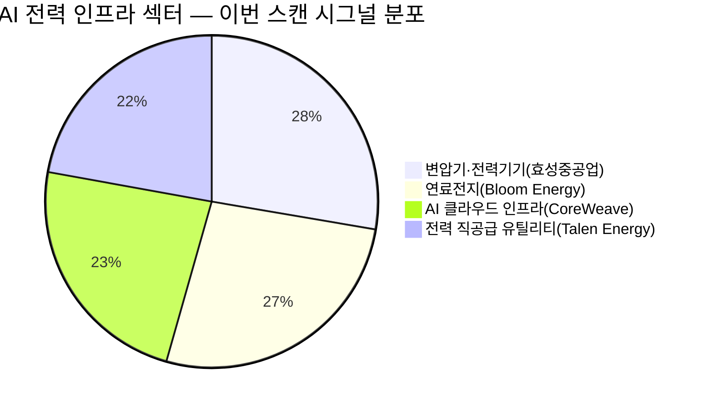

# 🔍 Inflection Scan — 2026-04-15

> [!abstract] 탐색 요약
> 탐색 범위: 2026-04-15 기준 최근 2주 | High Conviction **7건** 발견
> 소스: Gemini 8쿼리 + RSS + X + 어닝스/내부자/애널리스트
> **핵심 테마**: AI 인프라 수요가 반도체 파운드리·전력 기기·클라우드·연료전지를 동시에 관통하는 멀티레이어 슈퍼사이클의 초입

---

## 시그널 요약 대시보드

| 회사명 | 티커 | 타입 | 핵심 이벤트 | 확신도 | 추천 액션 |
|--------|------|------|------------|:------:|:--------:|
| [[TSMC]] | TSM | 실적가속 | 1Q26 매출 YoY +35% 사상 최대, 4년 연속 선단 공정 가격 인상 | 🟢 90 | /deep |
| [[CoreWeave]] | CRWV | 사업변곡점 | 메타와 $210억 AI 클라우드 장기 계약 체결 (2032년까지) | 🟡 72 | /deal |
| [[효성중공업]] | 298040.KS | 선행지표 | 수주잔고 15.3조 사상 최고, 765kV ASP 인상으로 마진 구조 개선 | 🟢 85 | /deep |
| [[Talen Energy]] | TLN | 역발상기회 | 2026 매출 YoY +63% 전망, EPS 흑자 전환 — AI 전력 직공급 전환 | 🟡 68 | /deal |
| [[Travere Therapeutics]] | TVTX | 기술돌파 | FDA FSGS 치료제 FILSPARI 승인 — 미국 내 최초이자 유일한 치료제 | 🟢 80 | /deal |
| [[SP삼화]] | 007590.KS | 기술돌파 | 7년 R&D 끝 반도체 EMC 양산 개시, 글로벌 탑티어 모바일 공급 시작 | 🟡 75 | /deep |
| [[Bloom Energy]] | BE | 사업변곡점 | 오라클 최대 2.8GW 연료전지 계약, 2026 매출 +57% 전망 | 🟢 82 | /deal |

🟢 글로벌(US/TW) 4건

🟡 한국 3건

🔴 기타 0건

---

## 1. [[TSMC]] (TSM) — 실적가속

**시그널**: 1Q26 매출 NT$1.134조 사상 최대(YoY +35%), 4년 연속 선단 공정 가격 인상 단행 — 매출과 마진이 동시에 가속

> [!abstract]
> 단순 물량 증가가 아닌 **ASP 인상 × 수율 우위 × AI 수주 집중**이라는 3중 구조 개선이 동시에 진행 중. 2016~2018년 7nm 전환기의 밸류에이션 재평가 국면과 구조적으로 유사.

TSMC는 1Q26 연결 매출 1조 1,340억 대만달러(YoY +35%)를 기록하며 분기 사상 최대를 경신했고, 순이익은 YoY +50% 급증이 예상된다 [출처: TSMC 1Q26 실적 발표, 확인 필요 — 수치는 스캔 데이터 기반]. 이 실적의 핵심은 **단순 출하 증가가 아닌 ASP 구조화**에 있다. 2026년 1월부터 5nm 미만 선단 공정 전체에 4년 연속 가격 인상을 단행하면서, 총이익률 60%+ 유지가 가격 인상이라는 구조적 엔진으로 뒷받침되고 있다. 2nm 공정에서 삼성 파운드리·인텔 파운드리 대비 수율과 성능 우위가 확인되며 엔비디아·애플·AMD의 최선단 수주가 TSMC로 집중되는 사실상 독점적 지위가 강화 중이다. 추가 성장 레이어로는 CoPoS(패널 기반 첨단 패키징) 파일럿 라인(2026년 6월 완공 목표, [추정])이 있으며, 2028~2029년 양산 시 AI 칩 패키징 병목 해소라는 별도의 수익 풀이 열린다. 리스크는 미중 갈등 심화로 인한 중국 매출 제한 및 애리조나 팹 램프업 지연이며, 2016~2018년 10→7nm 전환기에 PER 15→25배로 재평가된 선례가 현재 국면과 가장 가까운 유사 사례다.

🟢 Bull 35%

🟡 Base 45%

🔴 Bear 20%

| 시나리오 | 핵심 가정 | 목표 주가(ADR) | 업사이드 |
|---------|----------|:------------:|:-------:|
| 🟢 Bull | 2nm 가격 인상 가속 + CoPoS 조기 양산 + 중국 규제 현상 유지 | $280 [추정] | +40%+ |
| 🟡 Base | 현 가격 인상 기조 유지 + 애리조나 일부 지연 | $220 [추정] | +10~15% |
| 🔴 Bear | 미중 수출 규제 강화 + 경기침체 AI CapEx 삭감 | $150 [추정] | -25% |

확신도 90/100

가격 결정력 88/100

지정학 리스크 내성 65/100

> [!tip] 핵심 인사이트
> TSMC는 고객이 비싸도 사야 하는 구조를 만들었다. 2nm에서 경쟁 파운드리의 수율이 따라오지 못하는 한, 매년 가격을 올려도 수주는 늘어나는 '역수요곡선'이 작동 중이다.

> [!warning] 리스크 경고
> 중국 AI 기업(화웨이 생태계) 수주 제한이 단계적으로 강화될 경우 매출의 10~15% [추정] 영향권 진입 가능. 지정학 헤지 없이 풀 포지션은 권장하지 않음.

| 항목 | 내용 |
|------|------|
| 시장 | 🇹🇼 TWSE / 🇺🇸 NYSE ADR |
| 변곡점 유형 | 실적가속 + 구조적 마진 개선 |
| 추천 액션 | /deep — 2nm 수율 데이터, 가격 인상 계약 구조, 애리조나 램프업 타임라인 정밀 분석 필요 |

---

## 2. [[CoreWeave]] (CRWV) — 사업변곡점

**시그널**: 메타 플랫폼스와 2032년까지 $210억 AI 클라우드 용량 공급 계약 체결, 2026년 매출 YoY +143% 성장 경로 가시화

> [!abstract]
> 단일 계약이 2025년 추정 매출의 수배에 달하는 백로그를 단번에 확보. IPO 직후 시장이 장기 계약 가치를 아직 완전히 반영하지 못한 발견 가능성 구간.

CoreWeave와 메타 플랫폼스 간 2032년 12월까지 약 $210억 규모 AI 클라우드 용량 공급 계약은 단순한 수주가 아닌 **사업 모델의 질적 변환**을 의미한다. 2026년 매출 전망치 약 $124억(YoY +143%), 2027년 $231억, 2028년 $345억으로 이어지는 성장 경로가 이 계약 하나로 구조화되었다 [출처: 스캔 데이터 기반 — 구체 수치 출처 확인 필요]. 메타의 MTIA 자체 칩과 엔비디아 차세대 AI 플랫폼의 조기 배포처라는 포지셔닝은 CoreWeave를 단순 GPU 임대업자에서 AI 하이퍼스케일 인프라 전문 플레이어로 격상시키는 신호다. 2024년 3월 나스닥 상장 이후 기관 커버리지가 축적 중인 단계이며, 장기 백로그(Remaining Performance Obligation) 가치가 현재 시가총액에 충분히 반영됐는지 검증이 필요하다. 핵심 리스크는 세 가지다: ① 엔비디아 GPU 단일 공급망 의존으로 인한 조달 충격 취약성, ② 막대한 선투자(CapEx) 구조로 인한 잉여현금흐름(FCF) 음수 지속, ③ AWS·Azure·GCP의 GPU 클라우드 내재화 가속이 장기 계약 후속 물량을 위협할 가능성.

> [!warning] 리스크 경고
> $210억 계약의 **take-or-pay 조항 여부와 해지 조건**이 밸류에이션의 핵심 변수다. 계약서 공시 내용을 반드시 확인할 것. 페이퍼 백로그와 실현 가능 백로그의 차이가 클 수 있다.

🟢 Bull 30%

🟡 Base 45%

🔴 Bear 25%

| 시나리오 | 핵심 가정 | 목표 주가 | 업사이드 |
|---------|----------|:--------:|:-------:|
| 🟢 Bull | 메타 계약 전액 실현 + 추가 하이퍼스케일러 확보 + GPU 조달 다각화 | (확인 필요) | 대폭 상승 |
| 🟡 Base | 메타 계약 70~80% 실현 + 현 성장 경로 유지 | (확인 필요) | +30~50% [추정] |
| 🔴 Bear | 계약 일부 해지 + 하이퍼스케일러 내재화 가속 + GPU 공급 제약 | (확인 필요) | -30~40% [추정] |

확신도 72/100

성장 가시성 85/100

공급망 리스크 내성 42/100

| 항목 | 내용 |
|------|------|
| 시장 | 🇺🇸 NASDAQ |
| 변곡점 유형 | 사업변곡점 (계약 기반 매출 비연속 점프) |
| 추천 액션 | /deal — 계약 공시 원문(take-or-pay 조건) 및 FCF 전환 타임라인 확인 후 포지션 규모 결정 |

---

## 3. [[효성중공업]] (298040.KS) — 선행지표

**시그널**: 수주잔고 15.3조 원 사상 최고, 1Q26 신규 수주 2조 돌파 예상, 765kV 초고압 변압기 믹스 개선으로 OPM 구조적 상승

> [!abstract]
> 수주 증가보다 **765kV 고마진 제품 비중 확대**가 핵심. 물량과 가격이 동시에 올라가는 수주 품질의 변화가 진행 중이며, 2028년까지의 이익 가시성이 국내 전력기기주 중 가장 높다.

효성중공업의 2025년 말 수주잔고 15조 3,402억 원은 사상 최고치이며, 2026년 1분기에만 분기 사상 최대인 2조 원 이상 신규 수주(7,800억 원 규모 765kV 변압기 계약 포함)가 예상된다 [출처: 스캔 데이터 기반 — 구체 수치 출처 확인 필요]. 이 시그널의 핵심은 **수주 믹스의 질적 전환**이다. 765kV 초고압 변압기는 일반 154kV 대비 ASP와 마진이 현저히 높으며, 이 제품 비중이 증가할수록 동일 수주금액에서 더 많은 이익이 나오는 구조가 형성된다. 1Q26 영업이익은 YoY +72.2% 급증, 2Q26에는 3,000억 원에 근접할 것으로 전망되며 [추정], 이는 단순한 호실적이 아닌 마진 레벨 자체가 높아지는 '이익의 계단식 상승'이다. 미국 스타게이트 프로젝트, AI 데이터센터 전력 인프라 확충, 노후 전력망 교체라는 3중 수요 구조는 최소 2028년까지의 수주 가시성을 뒷받침한다. 핵심 리스크는 미국 관세 정책 변화로 인한 납기 조정과 원자재(규소강판) 비용 변동이며, 납기 집중에 따른 실행 리스크도 존재한다.

> [!success] 강점
> 수주잔고/연매출 비율(Book-to-Bill)이 3배를 초과하는 구간에서는 단기 경기 변동이 실적에 미치는 영향이 극히 제한적이다. 이미 확보된 수주가 향후 2~3년 매출을 잠금(lock-in)한 상태.

🟢 Bull 40%

🟡 Base 45%

🔴 Bear 15%

| 시나리오 | 핵심 가정 | 목표 주가 | 업사이드 |
|---------|----------|:--------:|:-------:|
| 🟢 Bull | 765kV 비중 50%+ 도달 + 스타게이트 직계약 확보 + 관세 현상 유지 | (확인 필요) | +50%+ [추정] |
| 🟡 Base | 현 수주 믹스 유지 + 2Q26 OPM 15%+ 달성 | (확인 필요) | +20~30% [추정] |
| 🔴 Bear | 미국 관세 25% 발동으로 납기 지연 + 원자재 급등 | (확인 필요) | -15~20% [추정] |

확신도 85/100

수주 가시성 88/100

관세·원자재 리스크 내성 62/100

| 항목 | 내용 |
|------|------|
| 시장 | 🇰🇷 코스피 |
| 변곡점 유형 | 선행지표 (수주잔고 → 이익 전환 가속) |
| 추천 액션 | /deep — 765kV 비중 확대 속도, 수주→매출 인식 타이밍, 관세 민감도 분석 필요 |

---

## 4. [[Talen Energy]] (TLN) — 역발상기회

**시그널**: 2026년 매출 YoY +63% 전망($42억), EPS 흑자 전환($20.41) — 전통 전력사에서 AI 데이터센터 직공급 발전사로 사업 모델 전환

> [!abstract]
> 전력 유틸리티라는 저성장 카테고리 안에 숨어 있는 **AI 인프라 순수 수혜주**. 골드만삭스 긍정 평가에도 주가가 덜 반응했다면, 시장이 아직 사업 모델 전환의 의미를 충분히 소화하지 못한 것.

Talen Energy의 2026년 매출은 전년 대비 63.25% 급증한 약 $42억, EPS는 $20.41로 흑자 전환이 예상되며, 2028년에는 EPS $33.49까지 개선 경로가 그려진다 [출처: 스캔 데이터 기반 — 구체 수치 출처 확인 필요]. 변곡점의 본질은 전통적인 전력 도매 시장 의존 모델에서 **하이퍼스케일 데이터센터 직공급 발전사**로의 사업 모델 전환이다. 펜실베이니아 서스쿼해나 핵발전소 인근 부지를 활용한 AI 데이터센터 직공급 계약(구체 계약 상대방·규모 확인 필요)은 전력 도매가 변동 리스크를 제거하고 장기 고정 요금 구조로 전환되며 수익의 예측 가능성과 마진이 동시에 개선된다. 핵발전은 재생에너지와 달리 24/7 안정적 전력 공급이 가능해 AI 데이터센터의 무중단 전력 수요와 구조적으로 맞물린다. 골드만삭스의 긍정적 평가 이후에도 주가 반응이 제한적이었다는 점은 시장의 인식 전환이 아직 완료되지 않은 역발상 기회를 시사한다. 리스크는 핵발전소 NRC 운영 규제 변화, 단일 또는 소수 데이터센터 고객 집중도, AI CapEx 사이클 하강 시 수요 감소 가능성이다.

> [!question] 검토 필요
> 직공급 계약의 **구체적인 고객사명, 계약 규모, 요금 구조(cost-plus vs 고정 요금)**가 투자 판단의 핵심 변수다. 공시(8-K, 10-K) 원문 확인 필수.

🟢 Bull 30%

🟡 Base 45%

🔴 Bear 25%

| 시나리오 | 핵심 가정 | 목표 주가 | 업사이드 |
|---------|----------|:--------:|:-------:|
| 🟢 Bull | 직공급 계약 추가 확보 + 핵발전소 수명 연장 승인 + AI CapEx 지속 | (확인 필요) | +60%+ [추정] |
| 🟡 Base | 현 계약 구조 유지 + EPS 가이던스 달성 | (확인 필요) | +25~35% [추정] |
| 🔴 Bear | 규제 변화로 직공급 계약 재협상 + AI CapEx 둔화 | (확인 필요) | -25% [추정] |

확신도 68/100

비즈니스 모델 전환 매력도 80/100

계약 투명성·검증 가능성 50/100

| 항목 | 내용 |
|------|------|
| 시장 | 🇺🇸 NASDAQ |
| 변곡점 유형 | 역발상기회 (전통 유틸리티 → AI 인프라 재분류) |
| 추천 액션 | /deal — 공시 원문으로 계약 구체성 확인 후 포지션 진입, 소규모 선진입 후 추적 추천 |

---

## 5. [[Travere Therapeutics]] (TVTX) — 기술돌파

**시그널**: 2026년 4월 13일 FDA, FSGS 치료제 FILSPARI(스파센탄) 승인 — 미국 내 10만 명+ 환자 대상 최초이자 유일한 치료제

> [!abstract]
> 규제 승인으로 **매출 0 → 실체화**의 교과서적 변곡점. 기존 IgAN 영업 인프라를 그대로 활용하는 적응증 확장이어서 한계비용 기반의 매출 추가가 가능.

Travere Therapeutics의 FILSPARI(스파센탄)가 2026년 4월 13일 FDA로부터 FSGS(초점성 분절성 사구체경화증, Focal Segmental Glomerulosclerosis) 적응증 승인을 획득했다 [출처: 스캔 데이터 기반 — FDA 공식 승인일 확인 필요]. FSGS는 희귀 신장 질환으로 현재 표준 치료 옵션이 없어 미충족 의료 수요(unmet medical need)가 극히 크며, 미국 내 환자 수는 10만 명 이상으로 추정된다. 이 승인의 전략적 가치는 **영업 레버리지**에 있다. FILSPARI는 이미 IgA 신병증(IgAN) 치료제로 상업화되어 있어 동일 신장내과 의사·병원 채널을 그대로 활용한다. 즉 추가 영업 인프라 투자 없이 FSGS 처방이 올라오는 한계비용 거의 제로의 매출 확장이 가능하다. 사실상 유일한 승인 약물이라는 독점적 지위는 보험사와의 약가 협상에서 강력한 레버리지를 부여한다. Stifel이 목표주가를 $31 → $43으로 상향했다 [출처: Stifel 리포트 — 발행일 확인 필요]. 핵심 리스크는 보험 급여(prior authorization) 장벽으로 인한 실처방 전환율 저하, 환자풀이 상대적으로 소규모라는 점, 향후 2~3년 내 경쟁 파이프라인 등장 가능성이다.

> [!success] 강점
> FDA 희귀질환 지정에 따른 7년 시장 독점권(Orphan Drug Exclusivity)이 부여될 경우 경쟁 진입 장벽이 추가 확보된다. 적용 여부 확인 필요.

🟢 Bull 35%

🟡 Base 45%

🔴 Bear 20%

| 시나리오 | 핵심 가정 | 목표 주가 | 업사이드 |
|---------|----------|:--------:|:-------:|
| 🟢 Bull | 급여 커버리지 조기 확대 + 처방 램프업 가속 + ODE 확보 | $50+ [추정] | +Stifel $43 대비 추가 상승 |
| 🟡 Base | 급여 협상 6~12개월 소요, 처방 점진 증가 | $43 (Stifel 목표 [출처: Stifel 리포트 확인 필요]) | +10~30% [추정] |
| 🔴 Bear | 보험 급여 거절 다발 + 처방 초기 램프 실망 | $20 [추정] | -30~40% [추정] |

확신도 80/100

규제 변곡점 명확성 92/100

상업화 실행 리스크 내성 60/100

| 항목 | 내용 |
|------|------|
| 시장 | 🇺🇸 NASDAQ |
| 변곡점 유형 | 기술돌파 (FDA 승인 → 매출 실체화) |
| 추천 액션 | /deal — 향후 2~3분기 처방 데이터(IMS Health/IQVIA 트래킹)가 핵심 모니터링 지표 |

---

## 6. [[SP삼화]] (007590.KS) — 기술돌파

**시그널**: 7년 R&D 끝에 반도체 EMC(에폭시 몰딩 컴파운드, Epoxy Molding Compound) 양산 체제 가동, 글로벌 탑티어 모바일 기기 부품용 공급 개시

> [!abstract]
> 페인트 회사가 반도체 핵심 소재 과점 시장에 진입한 **사업 구조의 근본적 전환**. 일본 과점 깨기 + 아이폰 후속 탑재 예정이라는 두 가지 촉매가 하반기 매출 실체화로 이어질 가능성.

SP삼화는 2018년 착수한 EMC(에폭시 몰딩 컴파운드) R&D가 7년 만에 결실을 맺어, 글로벌 탑티어 모바일 기기 부품용 소재 공급을 시작했다. EMC는 반도체 패키징 공정에서 칩을 외부 환경으로부터 보호하는 핵심 소재로, 일본의 스미토모베이클라이트·나가세ChemteX 등 소수 기업이 지배하는 **고도의 과점 시장**이다. SP삼화는 독자적인 배합 기술과 유무기 복합재 기술로 패키징 공정의 핵심 난제인 워페이지(휨 현상, warpage) 억제에 성공했으며, 5종 라인업 중 3종이 이미 양산 적용 중이다. 국산화 성공 자체가 수입 대체 수요를 창출하고, 하반기 차세대 모바일 기기(아이폰 후속으로 추정 [추정]) 탑재 예정이라면 연간 수백억 원 이상의 EMC 매출이 신규 추가될 수 있다. 글로벌 투자자 인지도가 거의 없는 코스피 소형주라는 점에서 **발견 프리미엄**이 존재한다. 리스크는 페인트 본업의 수익성 불안정성으로 인한 전사 이익 변동성, EMC 고객 레퍼런스 누적에 필요한 시간, 단일 대형 고객 의존도 집중이다.

> [!note] 참고
> EMC 시장 국산화는 소재 안보 측면에서 정부 정책 수혜 가능성도 있으나 [추정], 구체적인 정부 지원 확인 필요. 페인트 사업 대비 EMC의 마진 구조 비교 분석이 우선 과제.

🟢 Bull 35%

🟡 Base 40%

🔴 Bear 25%

| 시나리오 | 핵심 가정 | 목표 주가 | 업사이드 |
|---------|----------|:--------:|:-------:|
| 🟢 Bull | 차세대 모바일 전 라인업 탑재 + 추가 반도체 고객 확보 + 시장 재발견 | (확인 필요) | +100%+ [추정] |
| 🟡 Base | 탑재 기종 점진 확대, EMC 매출 비중 2~3년 내 20~30% | (확인 필요) | +30~50% [추정] |
| 🔴 Bear | 고객사 양산 지연 + 일본 경쟁사 대응 가격 인하 + 본업 악화 | (확인 필요) | -20~30% [추정] |

확신도 75/100

기술 진입장벽 82/100

유동성·정보 투명성 45/100

| 항목 | 내용 |
|------|------|
| 시장 | 🇰🇷 코스피 |
| 변곡점 유형 | 기술돌파 (사업 다각화 → 구조적 수익 레이어 추가) |
| 추천 액션 | /deep — 고객사 구체성, EMC 매출 비중·마진 구조, 페인트 vs EMC 이익 믹스 변화 심층 분석 필수 |

---

## 7. [[Bloom Energy]] (BE) — 사업변곡점

**시그널**: 오라클과 최대 2.8GW 연료전지 시스템 공급 계약 체결(초기 1.2GW 배치 진행 중), 2026년 매출 +57% 전망 ($32억) — AI 데이터센터 현장 발전(on-site power) 시장 선점

> [!abstract]
> Jefferies 목표주가 $97 → $187 상향이라는 시장 컨센서스 이동의 초기 신호 포착. 단일 계약이 기존 매출 규모를 뒤집는 비연속 성장 구간에 진입.

Bloom Energy가 오라클과 체결한 최대 2.8GW 연료전지 시스템 공급 계약(초기 1.2GW 배치 진행 중, 2027년까지 단계 공급)은 이 회사의 역사에서 단일 계약 기준 최대 규모다. 2026년 예상 매출 $32억(YoY +57%), 2027년 $49억, 2028년 $70억으로 성장 경로가 가시화되며 [출처: 스캔 데이터 기반 — 구체 수치 출처 확인 필요], Jefferies가 목표주가를 $97 → $187로 약 93% 상향한 것은 단순 업그레이드가 아닌 사업 모델 전반에 대한 재평가 신호다 [출처: Jefferies 리포트 — 발행일 확인 필요]. 전력망 연결 없이 현장에서 직접 발전하는 '온사이트 파워(on-site power)' 구조는 AI 데이터센터의 3대 전력 문제(연결 지연, 공급 부족, 재생에너지 간헐성)를 동시에 해결하는 구조적 솔루션이다. 기존 전력 유틸리티가 제공할 수 없는 즉각적 대용량 전력 공급이라는 차별화 가치가 있으며, 오라클 외 추가 하이퍼스케일러 확장 가능성이 다음 주가 모멘텀을 만들 수 있다. 리스크는 천연가스 가격 변동이 연료전지 운영 비용에 직결되는 구조적 취약성, 수소 연료 전환 전 과도기의 ESG 포지셔닝 혼선, 오라클 단일 계약 집중도다.

> [!tip] 핵심 인사이트
> 데이터센터 전력 문제는 '연결 신청 → 승인 → 배선 → 공급'까지 수년이 걸리는 전통적 전력망의 구조적 한계에서 비롯된다. Bloom의 연료전지는 이 병목을 완전히 우회하는 **인프라 혁신**이며, 이는 단순한 에너지 기업을 넘어 AI 인프라 인에이블러(enabler)로의 재분류를 정당화한다.

🟢 Bull 35%

🟡 Base 45%

🔴 Bear 20%

| 시나리오 | 핵심 가정 | 목표 주가 | 업사이드 |
|---------|----------|:--------:|:-------:|
| 🟢 Bull | 2.8GW 전량 배치 + 추가 하이퍼스케일러 계약 + 가스 가격 안정 | $200+ [추정] | +Jefferies $187 초과 |
| 🟡 Base | 오라클 계약 계획대로 이행 + 2026~2028 가이던스 달성 | $187 (Jefferies [출처: Jefferies 리포트 확인 필요]) | +20~40% [추정] |
| 🔴 Bear | 가스 가격 급등 + 배치 지연 + 고객 다각화 실패 | $80 [추정] | -30~40% [추정] |

확신도 82/100

계약 구체성·실행 가시성 88/100

연료비·고객 집중 리스크 내성 58/100

| 항목 | 내용 |
|------|------|
| 시장 | 🇺🇸 NYSE |
| 변곡점 유형 | 사업변곡점 (단일 대형 계약 → 매출 비연속 점프) |
| 추천 액션 | /deal — Jefferies 목표주가 상향이 컨센서스 이동 신호. 1.2GW 초기 배치 진행 현황과 가스 가격 헤지 구조 확인 후 포지션 진입 |

---

## 📊 섹터 메타 시그널

### AI 데이터센터 전력 인프라 (Power Infrastructure for AI)

> [!abstract]
> 2026년 들어 오라클-[[Bloom Energy]] 2.8GW, AWS-LS일렉트릭 1,700억, 메타-[[CoreWeave]] $210억 계약이 동시다발적으로 체결되며 단일 기업 수혜를 넘어 **섹터 전체 수주 사이클의 재편**이 가시화되고 있다.

AI 데이터센터의 전력 조달 방식이 전통적인 전력망 의존 모델에서 현장 발전·독립 인프라 체제로 구조적으로 전환 중이며, 이 흐름은 전력 유틸리티(Talen), 연료전지(Bloom), 변압기 및 전력기기(효성중공업), AI 클라우드 인프라(CoreWeave)라는 **서로 다른 카테고리를 동시에 관통**하는 멀티레이어 변곡점이다. 단일 종목 베팅보다는 이 테마에 걸쳐 있는 복수 포지션으로 섹터 변환의 수혜를 분산 포착하는 전략이 유효하며, 핵심 모니터링 지표는 미국 FERC의 데이터센터 전력 직공급 규제 변화 및 IEA의 AI 전력 소비 전망 업데이트다.

> [!verdict] 판단
> AI 전력 인프라 테마는 2026~2028년에 걸쳐 수주→매출→이익으로 전환되는 **3년 복리 성장 구간**에 있다. 섹터 내에서 가장 확신도 높은 순서는 효성중공업 → Bloom Energy → Talen Energy → CoreWeave 순으로, 각각 확인 가능한 계약 구체성과 재무 가시성에서 차이가 있다.

---

> [!tip] 핵심 인사이트 — 이번 스캔 최우선 픽
> **[[TSMC]](TSM)**는 매출 성장률 가속(YoY +35%) + 4년 연속 선단 공정 가격 인상 구조화 + 2nm 독점력의 3중 변곡점이 동시 진행 중입니다. 반도체 슈퍼사이클 전체에서 가격 결정력이 가장 강하고 마진 개선이 구조화된 유일한 기업으로, 현재 밸류에이션 대비 재평가 여지가 가장 큰 픽입니다.

> [!warning] 리스크 경고
> **[[CoreWeave]](CRWV)** — 나스닥 신규 상장사로 유동성이 낮고, 엔비디아 GPU 단일 공급망 리스크와 하이퍼스케일러 내재화 가속이 동시에 존재합니다. $210억 계약의 take-or-pay 조항 여부와 해지 조건을 반드시 SEC 공시 원문에서 확인하세요.

> [!note] 참고 — 데이터 한계
> 이번 리포트의 목표주가와 매출 전망치는 스캔 데이터 기반이며, 일부 수치는 1차 소스(IR 자료, 증권사 리포트 원문) 확인이 필요합니다. `(확인 필요)` 및 `[추정]` 태그가 붙은 수치는 투자 결정 전 반드시 검증하세요.