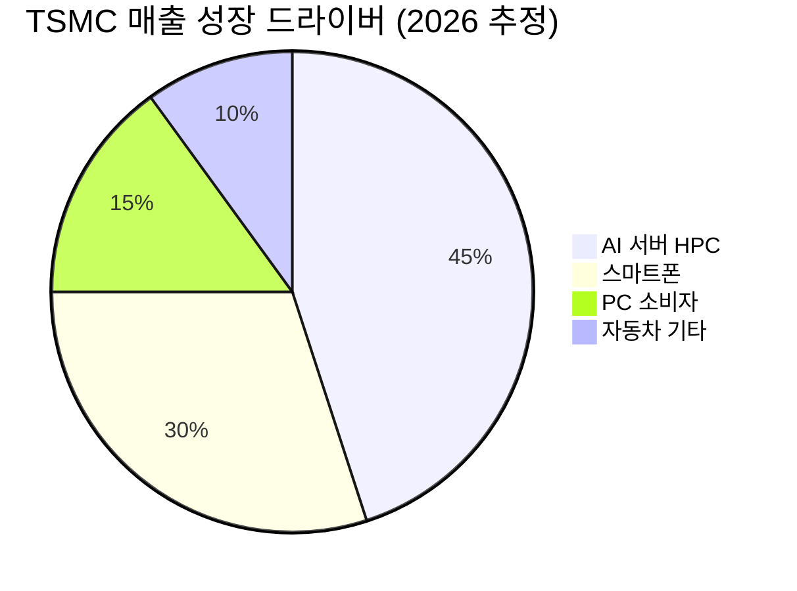
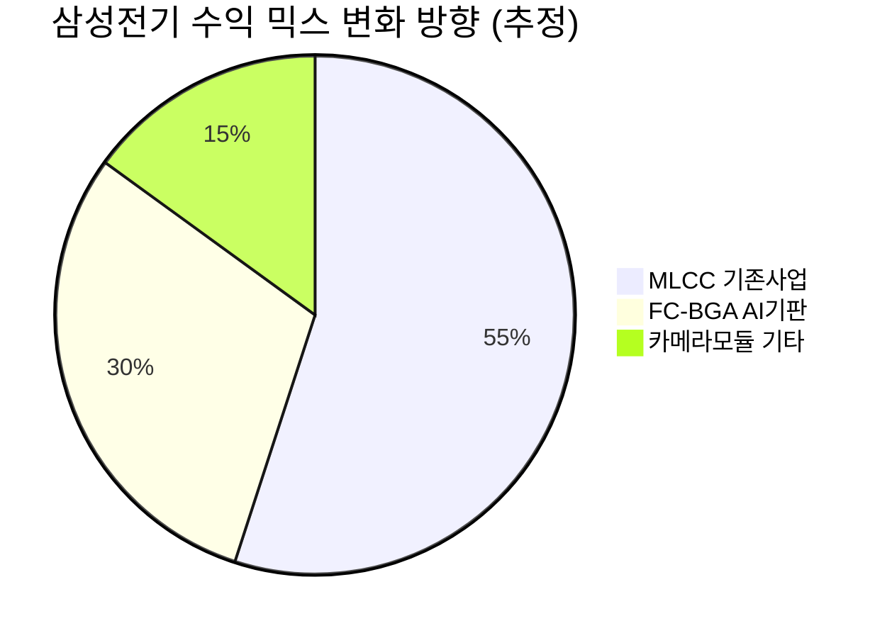

# 🔍 Inflection Scan — 2026-04-16

> [!abstract] 탐색 요약
> 탐색 범위: 2026-04-16 기준 최근 2주 | High Conviction 7건 발견
> 소스: Gemini 8쿼리 + RSS + X + 어닝스/내부자/애널리스트
> **핵심 테마**: AI CapEx 불연속 성장이 반도체·기판·전력 인프라 전 섹터 비수기 계절성을 동시에 붕괴시키며 슈퍼사이클 2차 가속 국면 진입 확인

---

## 시그널 요약 대시보드

| 회사명 | 티커 | 타입 | 핵심 이벤트 | 확신도 | 추천 액션 |
|--------|------|------|------------|:------:|:--------:|
| [[GE 에어로스페이스]] | GE | 가이던스상향 | 2026E EPS ~15% 대폭 상향, 수주잔고 1,900억 달러 | 🟢 82 | /deal |
| [[코어위브]] | CRWV | 사업변곡점 | Jane Street+Meta 합계 $270억 AI 클라우드 계약 체결 | 🟡 68 | /deep |
| [[TSMC]] | TSM | 실적가속 | 1Q26 매출 YoY +35%, 비수기 계절성 완전 붕괴 | 🟢 79 | /deal |
| [[에이피알]] | 278470.KS | 실적가속 | 1Q26 매출 +119%·영업이익 +163%, 유럽 TAM 확장 | 🟢 80 | /deep |
| [[삼성전기]] | 009150.KS | 선행지표 | FC-BGA 베트남 1.8조 CapEx 확정, 2Q26 양산 전환 | 🟡 73 | /deep |
| [[ImmunityBio]] | IBRX | 실적가속 | 1Q26 매출 +168%, Anktiva 판매량 +750% S커브 진입 | 🟡 70 | /deep |
| [[효성중공업]] | 298040.KS | 선행지표 | 1Q26 수주 분기 최대 2조원+765kV ASP 질적 개선 | 🟢 78 | /deal |

---

## 1. [[GE 에어로스페이스]] (GE) — 가이던스 상향

**시그널**: 2026년 EPS 가이던스 중간점 기준 ~15% 대폭 상향 — 항공 엔진 슈퍼사이클의 구조적 수익 가속

> [!abstract] 핵심 요약
> 분사 후 첫 본격 사이클에서 EPS 가이던스를 $7.10~$7.40으로 ~15% 상향. 수주잔고 $1,900억(연매출의 6배+)이 2028년까지 EPS 복리 15%+의 시계를 제공.

GE 에어로스페이스는 2026년 EPS 가이던스를 $7.10~$7.40(종전 대비 ~15% 상향), 영업이익 $98.5억~$102.5억 달러로 대폭 끌어올렸다. 이 상향의 본질은 단순 실적 호조가 아니라 **수익 구조의 레벨업**에 있다: 항공기 기재 사이클 후반으로 갈수록 엔진 판매보다 수익성이 훨씬 높은 애프터마켓 서비스(MRO, Maintenance/Repair/Overhaul) 비중이 급증하는 구조이며, LEAP 엔진 납품이 2025년 대비 28% 증가하면서 향후 10~15년의 서비스 수익 기반이 두터워지고 있다. $1,900억 달러의 수주잔고는 연간 매출 $300억 달러 대비 6배 이상으로, 적어도 2028년까지 두 자릿수 EPS 복리 성장의 가시성을 제공하며 이는 컨센서스 재설정의 구조적 근거가 된다. 유사 사례로 롤스로이스(RR.L)가 2023년 분사 후 구조조정으로 주가 3배를 기록한 패턴과 유사하나, GE는 이미 흑자 구조이므로 재무 리스크 프로파일이 낮다. 핵심 리스크는 중동 지정학적 긴장이 상업 항공 수요를 훼손하거나 항공사 재무 압박으로 MRO 지연이 발생하는 시나리오다.

| 지표 | 수치 | 의미 |
|---|---|---|
| 2026E EPS 가이던스 | $7.10~$7.40 | 종전 대비 ~15% 상향 🟢 |
| 영업이익 가이던스 | $98.5억~$102.5억 | 기록적 수준 🟢 |
| 수주잔고 | $1,900억 | 연매출의 6배+ 🟢 |
| LEAP 납품 성장 | +28% (2025년 대비) | 서비스 수익 기반 확장 🟢 |
| EPS 복리 전망 | 15%+/년 (2028년까지) [추정] | 컨센서스 상향 드라이버 🟢 |

🟢 Bull 35%: MRO 가속+LEAP 수요↑ → EPS $8+

🟡 Base 45%: 가이던스 달성 → 목표가 $350 수준

🔴 Bear 20%: 중동 확전+MRO 지연

| 시나리오 | 핵심 가정 | 목표가 수준 | 업사이드 |
|---|---|---|---|
| 🟢 Bull | LEAP MRO 가속, 항공 수요 견조 | $380+ [추정] | +40%+ |
| 🟡 Base | 가이던스 달성, 컨센서스 점진 상향 | $350 [추정] | ~+30% |
| 🔴 Bear | 항공사 MRO 지연, 유가 급등 | $250 [추정] | -8%~ |

확신도 82/100

수주 가시성 88/100

지정학 리스크 헤지 65/100

> [!warning] 핵심 리스크
> 중동 확전 시 상업 항공 수요 타격, 이란 분쟁 장기화 시 유가 급등 → 항공사 재무 압박 → MRO 연기 가능성. 단, 수주잔고 구조상 단기 충격 흡수 능력은 높음.

| 항목 | 내용 |
|------|------|
| 시장 | 🇺🇸 NYSE |
| 변곡점 유형 | 가이던스상향 + 구조적 수익 믹스 전환 |
| 추천 액션 | /deal — 가이던스 15% 상향 + 수주잔고 6배 + EPS 복리 15%+ 3중 근거 |

---

## 2. [[코어위브]] (CRWV) — 사업 변곡점

**시그널**: Jane Street $60억 + Meta $210억 = 총 $270억 규모의 초대형 AI 클라우드 계약 체결로 매출 구조 비연속적 도약

> [!abstract] 핵심 요약
> 2주 사이에 $270억 규모 AI 클라우드 계약 연속 체결. 비즈니스 모델의 외삽이 아닌 수직적 매출 점프 — 단, 계약 매출 인식 타임라인 검증이 선행되어야 한다.

코어위브는 Jane Street($60억, 10년 계약 + $10억 전략적 지분투자 주당 $109)와 Meta($210억, ~2032년)로부터 합계 $270억 규모의 AI 클라우드 컴퓨팅 계약을 2주 내에 연속 체결했다. Jane Street가 거래 계약과 동시에 $10억 규모의 전략적 지분투자를 집행한 것은 단순 SaaS 거래가 아닌 **전략적 파트너십의 잠금(lock-in)** 확인이며, 상업적 관계의 장기화 의지를 명시한 것이다. NVIDIA 베라 루빈(Vera Rubin) GPU를 포함한 최첨단 컴퓨팅 인프라를 독점 공급하는 포지션은 hyperscaler들이 자체 CapEx 없이 GPU 용량을 확보하는 유일한 대안 채널로서의 역할을 고착화하고 있다. 핵심 불확실성은 $270억이 실적에 인식되는 타임라인이다: 장기 계약 특성상 분기별 수익 인식이 평탄하게 분산될 가능성이 있으며, 이 구조를 파악하지 않고 현재 밸류에이션을 판단하는 것은 위험하다. 상장 초기 기업으로서 고객 집중도(Meta 단일 고객이 전체 계약의 77%), AWS/Azure와의 경쟁 심화, AI CapEx 사이클 둔화 시 계약 물량 축소 가능성이 핵심 리스크다.

| 계약 상대 | 규모 | 기간 | 성격 |
|---|---|---|---|
| Jane Street | $60억 | 10년 | AI 클라우드 컴퓨팅 🟢 |
| Jane Street | $10억 | — | 전략적 지분투자 (주당 $109) 🟢 |
| Meta | $210억 | ~2032년 | AI 클라우드 용량 🟢 |
| Anthropic | (확인 필요) | — | 데이터센터 임대 🟡 |

🟢 Bull 25%: 계약 조기 인식+추가 수주

🟡 Base 50%: 계약 분산 인식, 점진적 매출 성장

🔴 Bear 25%: AI CapEx 둔화+고객 집중 리스크

| 시나리오 | 핵심 가정 | 방향성 |
|---|---|---|
| 🟢 Bull | 계약 빠른 인식 + 추가 hyperscaler 계약 | 주가 $200+ [추정] |
| 🟡 Base | 계약 분산 인식, NVIDIA 관계 지속 | 현재 수준 점진 상향 |
| 🔴 Bear | AI CapEx 사이클 둔화 + Meta 물량 축소 | 주가 급락 가능 |

확신도 68/100 — 계약 규모 확실, 인식 타임라인 불확실

계약 규모 임팩트 90/100

고객 집중 리스크 40/100

> [!warning] 핵심 리스크
> Meta 단일 계약이 전체의 77%. 상장 초기 기업으로 수익성 미검증. 계약 매출 인식 구조 불투명. AWS/Azure 자체 GPU 인프라 확장 경쟁.

> [!question] 검토 필요
> $270억 계약의 분기별 매출 인식 방식(선불/분할/사용량 기반)이 핵심. 이를 확인하지 않으면 현재 밸류에이션 판단 불가. /deep 투자자는 S-1/10-Q의 계약 인식 정책 조항 필독 필수.

| 항목 | 내용 |
|------|------|
| 시장 | 🇺🇸 NASDAQ |
| 변곡점 유형 | 사업변곡점 — 비연속적 계약 규모 점프 |
| 추천 액션 | /deep — 계약 매출 인식 타임라인 + 수익성 구조 심층 검증 선행 필수 |

---

## 3. [[TSMC]] (TSM) — 실적 가속

**시그널**: 2026년 1Q 매출 YoY +35% 성장 확인 — AI 서버 수요가 전통 계절성 완전 무력화

> [!abstract] 핵심 요약
> 반도체 산업 전통 비수기인 1Q에 35% YoY 성장. 성장률 수치보다 계절성 붕괴 자체가 진짜 시그널 — AI 인프라 수요가 이미 계절적 패턴을 이탈한 구조적 수준에 도달했음을 방증.

TSMC의 2026년 1분기 매출이 전년 대비 35% 성장을 기록했다. 이것이 변곡점인 이유는 성장률 수치 자체보다 **계절성 붕괴(seasonality collapse)** 라는 구조적 신호 때문이다: 전통적으로 1분기는 스마트폰·PC 교체 수요 비수기로 반도체 업계 매출이 전분기 대비 감소하는 것이 관행이었으나, AI 서버 투자 가속화가 이 패턴을 완전히 무력화했다. TSMC는 2나노 공정 양산과 CoWoS(Chip on Wafer on Substrate) 등 첨단 패키징 수요 급증으로 공급 병목이 지속되고 있으며, 이 병목은 단기에 해소될 구조가 아니다 — CoWoS 캐파 확장에만 18~24개월의 리드타임이 필요하다. TSMC 실적은 엔비디아·애플·퀄컴의 선주문을 가장 직접적으로 반영하는 선행 지표이며, 35% YoY 성장이 2분기에도 유지된다면 [추정] 2026년 연간 EPS는 전년 대비 30%+ 상향 압력을 받을 것이다. 리스크는 미중 반도체 수출 통제 격화, 대만 지정학적 리스크, 그리고 엔비디아 Blackwell 이후 차세대 칩(Rubin) 전환기의 일시적 주문 공백 가능성이다. 밸류에이션은 AI 인프라 수혜주 중 상대적으로 낮은 편이어서 리스크/리워드 비율이 유리하다.

🟢 Bull 40%: AI CapEx 2H 가속 → 40%+ 성장

🟡 Base 40%: 30~35% 성장 유지

🔴 Bear 20%: 지정학 리스크 현실화

| 시나리오 | 핵심 가정 | 목표가 (ADR 기준) |
|---|---|---|
| 🟢 Bull | AI CapEx 2H 추가 가속 + 2nm 수율 개선 | $240+ [추정] |
| 🟡 Base | 연간 30~35% 성장 유지, 컨센서스 점진 상향 | $200 수준 [추정] |
| 🔴 Bear | 미중 갈등 격화 + 대만 지정학 프리미엄 확대 | $140 [추정] |

확신도 79/100

AI 인프라 사이클 수혜 직접성 85/100

지정학 리스크 45/100 (낮을수록 위험)

> [!success] 강점
> AI 인프라 사이클의 최소저항선 수혜주. 엔비디아·애플 선주문을 선행적으로 반영하는 가장 신뢰도 높은 반도체 선행 지표이며, 비수기 계절성 붕괴가 구조적 수요 전환의 증거.

> [!warning] 리스크 경고
> 대만 지정학 리스크는 언제나 존재하는 꼬리 리스크(tail risk). 미중 반도체 수출 통제 추가 강화 시 엔비디아 주문 감소 가능성. 헤지 없이 단일 포지션으로 집중 보유 시 주의.

| 항목 | 내용 |
|------|------|
| 시장 | 🇹🇼 TSE (ADR: 🇺🇸 NYSE) |
| 변곡점 유형 | 실적가속 + 계절성 구조 붕괴 |
| 추천 액션 | /deal — AI 인프라 사이클 직접 수혜, 상대적 밸류에이션 낮음 |

---

## 4. [[에이피알]] (278470.KS) — 실적 가속

**시그널**: 1Q26 매출 YoY +119%, 영업이익 +163% 컨센서스 — 미국 넘어 유럽 신성장축 부상으로 성장 궤도 재가속

> [!abstract] 핵심 요약
> 성장이 가속(119% → 163% OPM 증가)되면서 동시에 TAM이 미국 단일 → 미국+유럽으로 확장되는 이중 가속 구조. 17개 증권사 전원 목표가 상향은 컨센서스 자체의 재설정을 의미.

에이피알의 2026년 1분기 추정치가 매출 5,838억원(YoY +119%), 영업이익 1,434억원(YoY +163%)으로 수렴하고 있으며, 17개 커버 증권사 전원이 목표가를 상향했다(출처: 연합인포맥스, 신영증권 등 11개 증권사 컨센서스 기준). 이것이 단순 성장 지속이 아닌 변곡점인 이유는 **TAM이 두 단계 동시 확장**되기 때문이다: 미국 아마존 '빅 스프링 세일' 및 얼타뷰티 오프라인 확장이 기존 성장축을 유지하는 동시에, 영국·독일 아마존 직진출과 틱톡샵 유럽 채널이 예상보다 빠른 속도로 새로운 수요를 창출하고 있다. 영업이익 성장률(+163%)이 매출 성장률(+119%)을 크게 상회하는 것은 레버리지가 작동하고 있음을 의미하며 — 유럽 초기 진입 비용이 아직 본격 반영되지 않은 상태에서도 마진이 개선되고 있다는 점이 주목할 만하다. 리스크는 미국 관세 정책 변화로 인한 한국산 원자재 비용 상승, 유럽 코스메틱 성분 규제(EU 화장품 규정), 그리고 잇따르는 경쟁 K뷰티 브랜드의 유럽 동반 진입에 따른 채널 단가 압박이다.

| 지표 | 4Q25 (추정) | 1Q26 컨센서스 | 방향 |
|---|---|---|---|
| 매출 YoY 성장률 | ~80% [추정] | +119% | 🟢 가속 |
| 영업이익 YoY | ~120% [추정] | +163% | 🟢 가속 (OPM 레버리지) |
| 커버 증권사 목표가 | — | 17개 전원 상향 | 🟢 컨센서스 재설정 |
| 미국 채널 | 아마존+얼타 | 아마존 빅스프링+얼타 확장 | 🟢 유지 |
| 유럽 채널 | 0 | 영국·독일 아마존+틱톡샵 | 🟢 TAM 신규 확장 |

🟢 Bull 35%: 유럽 채널 빠른 침투+마진 유지

🟡 Base 45%: 성장 지속, 유럽 투자비용 일부 반영

🔴 Bear 20%: 관세+EU 규제+채널 경쟁

| 시나리오 | 핵심 가정 | 목표가 |
|---|---|---|
| 🟢 Bull | 유럽 채널 조기 흑자화 + 미국 관세 영향 제한적 | (확인 필요) |
| 🟡 Base | 2026년 연간 매출 성장 100%+, OPM 25%+ 유지 | (확인 필요) |
| 🔴 Bear | EU 규제 강화 + 관세 원가 상승 + 경쟁 격화 | (확인 필요) |

확신도 80/100

성장 가속 신뢰도 85/100

유럽 지속가능성 60/100 — 초기 단계

> [!tip] 핵심 인사이트
> 성장 가속 + TAM 확장이 동시에 발생하는 패턴은 소비재 성장주에서 가장 강력한 리레이팅 트리거다. OPM이 매출 성장률을 상회하는 레버리지 구조 확인이 관건 — 유럽 채널 비용이 본격 반영되는 2Q~3Q에 마진 방어 여부를 검증해야 한다.

| 항목 | 내용 |
|------|------|
| 시장 | 🇰🇷 코스피 |
| 변곡점 유형 | 실적가속 + TAM 구조 확장 |
| 추천 액션 | /deep — 유럽 성장 초기 단계, 마진 구조 지속성 심층 검증 필요 |

---

## 5. [[삼성전기]] (009150.KS) — 선행 지표

**시그널**: 베트남 FC-BGA 생산라인 1조 8천억원 CapEx 확정 — 엔비디아 차세대 AI칩 기판 공급 2Q26 양산 전환

> [!abstract] 핵심 요약
> FC-BGA 수요가 생산능력의 150%를 초과하는 병목 상황에서 1.8조원 증설 확정. 이 투자는 수익 믹스가 MLCC(범용) → AI 서버 기판(고마진)으로 레벨업하는 구조 전환의 CapEx 확인 시그널이다.

삼성전기가 베트남 법인에 1조 8천억원(약 12억 달러)을 투자해 AI 반도체용 FC-BGA(Flip Chip Ball Grid Array, 플립칩 볼그리드어레이) 기판 생산라인을 대규모 증설한다. 현재 FC-BGA 수요가 생산능력의 150% 이상을 초과하는 수급 병목 상태이며, 엔비디아 차세대 AI 가속기용 FC-BGA가 2분기 양산에 돌입한다는 점이 이 투자의 즉각적 촉매다. 이 CapEx의 전략적 의미는 삼성전기의 수익 믹스 전환에 있다: 기존 MLCC(다층세라믹커패시터) 중심의 수익 구조에서 ASP가 현저히 높은 AI 서버용 반도체 기판으로 무게중심이 이동하면, [추정] OPM이 구조적으로 3~5%p 레벨업할 가능성이 있다. CapEx 규모가 2013년 베트남 법인 설립 초기 자본금과 동일한 수준이라는 점은 경영진이 이 사이클을 단기 호황이 아닌 구조적 수요 전환으로 판단하고 있음을 시사한다. 업사이드 타이밍은 2Q26 양산 → 3Q26 실적 반영 순서이며, 리스크는 엔비디아 로드맵 변경, 삼성전자 파운드리 수주 공백 시 연쇄 위축, 그리고 CapEx 회수 기간이 길다는 점이다.

🟢 Bull 35%: 2Q 양산+마진 레벨업 확인

🟡 Base 40%: 3Q 점진 반영, 연간 이익 개선

🔴 Bear 25%: 엔비디아 로드맵 변경+파운드리 공백

| 시나리오 | 핵심 가정 | 목표가 |
|---|---|---|
| 🟢 Bull | FC-BGA 양산 순조 + AI 서버 수요 지속 | (확인 필요) |
| 🟡 Base | 3Q~4Q 점진적 매출 기여, MLCC 안정적 | (확인 필요) |
| 🔴 Bear | 엔비디아 칩 설계 변경 + CapEx 매몰 | (확인 필요) |

확신도 73/100 — CapEx 확정 명확, 매출 인식 시차 존재

CapEx 의지·규모 신뢰도 88/100

단기 실적 반영 속도 62/100

> [!note] 선행 지표 해석
> CapEx 1.8조원은 향후 2~3년 매출로 전환될 선행 투자. 현재 수급이 타이트한 FC-BGA 시장에서 2Q26 양산 시작이 즉각적 실적 개선 트리거. 2Q26 실적에서 FC-BGA 매출 비중 공시 여부가 핵심 확인 포인트.

| 항목 | 내용 |
|------|------|
| 시장 | 🇰🇷 코스피 |
| 변곡점 유형 | 선행지표 — CapEx 확정 + 수익 믹스 구조 전환 |
| 추천 액션 | /deep — 2Q26 실적에서 FC-BGA 매출 비중 확인 후 포지션 구축 판단 |

---

## 6. [[ImmunityBio]] (IBRX) — 실적 가속

**시그널**: 1Q26 매출 YoY +168%, Anktiva 판매량 +750% — FDA 승인 후 상업화 초기 S커브 진입 확인

> [!abstract] 핵심 요약
> Anktiva(방광암 면역치료제) 판매량 750% 급증은 FDA 승인 후 상업화 S커브의 전형적 초기 가속 패턴. 의사 채택률·보험 커버리지·재주문이 동시 가속되는 구간이나, 바이오 리스크 프로파일 면밀 검토 선행 필수.

ImmunityBio의 2026년 1분기 실적이 전년 대비 매출 +168%, Anktiva(BCG 불응성 비침습성 방광암 치료제) 판매량 +750% 급증을 기록했다. 이것이 고강도 변곡점인 이유는 FDA 승인 후 상업화의 **S커브 초입부**이기 때문이다: 의사 채택률 확산(physician adoption), 보험사 커버리지 확대, 재주문 사이클이 동시에 가속되는 이 구간에서 분기 성장률이 폭발적으로 나타나는 것은 성공적인 신약 상업화의 전형 패턴으로, Keytruda나 Opdivo의 초기 상업화 궤적과 유사하다. Anktiva는 BCG 불응성 비침습성 방광암(NMIBC)에서 기존 치료 옵션이 사실상 방광 절제술뿐인 언충족 의학 수요(unmet medical need)를 파고든 first-mover 포지션을 확보했으며, 이는 처방 단가와 보험 급여율 모두에서 유리한 출발점이다. 그러나 바이오 기업 특성상 자본 조달 구조(지속적 자금 소요 가능성), 경쟁 치료제 파이프라인(시스플라틴 병용요법 업데이트, pembrolizumab 조합 등), 보험사 커버리지 협상 속도가 성장의 지속성을 결정한다. 시장이 소형 바이오라는 이유로 과소평가하고 있을 가능성이 있지만, 주가 당일 +7.02% 반응은 이미 일부 반영이 시작됐음을 보여준다.

| 지표 | 수치 | 해석 |
|---|---|---|
| 1Q26 매출 YoY | +168% | 🟢 FDA 승인 후 S커브 가속 |
| Anktiva 판매량 YoY | +750% | 🟢 의사 채택률·보험 급여 동시 확산 |
| 주가 당일 반응 | +7.02% | 🟡 일부 반영, 아직 완전 반영 아님 |
| 시장 침투율 | 초기 단계 | 🟢 추가 업사이드 여지 |
| 경쟁 파이프라인 | 진행 중 | 🟡 중기 리스크 |

🟢 Bull 30%: 침투율 가속+보험 급여 확대

🟡 Base 45%: S커브 계속, 분기별 성장 유지

🔴 Bear 25%: 경쟁 치료제+자금 조달 리스크

| 시나리오 | 핵심 가정 | 방향성 |
|---|---|---|
| 🟢 Bull | 보험 급여 확대 + 추가 적응증 확장 | 주가 멀티배거 가능 [추정] |
| 🟡 Base | Anktiva 시장 침투 지속, 성장률 점차 정상화 | 점진적 주가 상승 |
| 🔴 Bear | 경쟁 치료제 급부상 + 추가 주식 발행 희석 | 주가 급락 |

확신도 70/100 — 성장 수치 강렬, 바이오 리스크 복잡

상업화 모멘텀 강도 82/100

바이오 구조 리스크 45/100 (낮을수록 위험)

> [!warning] 리스크 경고
> 소형 바이오 기업의 구조적 위험: 지속적 자본 조달 필요 가능성, 주식 희석 위험. 경쟁 치료제 임상 결과에 따라 시장 지위가 급변할 수 있음. 포지션 사이징 시 바이오 특성 반드시 반영.

| 항목 | 내용 |
|------|------|
| 시장 | 🇺🇸 NASDAQ |
| 변곡점 유형 | 실적가속 — FDA 승인 후 상업화 S커브 진입 |
| 추천 액션 | /deep — 상업화 트랙 레코드 2~3분기 확인 후 포지션. 바이오 리스크 프로파일 상세 분석 필수 |

---

## 7. [[효성중공업]] (298040.KS) — 선행 지표

**시그널**: 1Q26 신규 수주 분기 사상 최대 2조원 돌파 + 765kV 초고압 변압기 ASP 상승 — 양적·질적 동시 개선

> [!abstract] 핵심 요약
> 수주 '분기 최대' + '765kV 고마진 제품 믹스 상승'이 동시 발생 — 숫자만 커진 게 아니라 수익성 구조가 바뀌고 있다. 2Q26 영업이익 3,000억원 근접 전망이 주가 리레이팅의 결정적 촉매.

효성중공업의 2026년 1분기 신규 수주가 분기 사상 최대치인 2조원을 돌파했으며, 동시에 765kV 초고압 변압기 비중 확대로 ASP(Average Selling Price)까지 상승하고 있다(출처: 경제타임스 보도). 이것이 단순 수주 증가가 아닌 구조적 변곡점인 이유는 **수주의 질적 개선**이 동반되기 때문이다: 765kV 초고압 변압기는 345kV 대비 마진이 현저히 높으며, 북미 전력망 현대화(grid modernization) 수요가 AI 데이터센터 전력 수요와 중첩되면서 고사양 제품 믹스가 구조적으로 우상향하는 수급 구조가 형성됐다. 1분기 실적의 일시 부진은 매출 인식 타이밍 차이(장기 프로젝트 특성상 수주→매출 인식 시차)에 따른 것이며, 이미 확보된 수주를 바탕으로 2분기 영업이익이 3,000억원에 근접할 것으로 시장이 전망하고 있다 [추정]. 리스크는 북미 전력망 인허가 지연(NERC/FERC 규제 절차), 전기강판·구리 등 원자재 가격 급등, 그리고 HD현대일렉트릭 등 경쟁사 증설에 따른 변압기 과점 구도 완화 가능성이다. 그러나 765kV 변압기를 제조할 수 있는 글로벌 업체 수가 매우 제한적이라는 점이 핵심 해자(moat)다.

| 지표 | 수치 | 의미 |
|---|---|---|
| 1Q26 신규 수주 | 2조원+ (분기 사상 최대) | 🟢 양적 최대 |
| 765kV 변압기 ASP | 상승 중 | 🟢 질적 개선 |
| 2Q26 영업이익 전망 | ~3,000억원 근접 [추정] | 🟢 레벨업 |
| 1Q26 실적 | 일시 부진 | 🟡 회계 타이밍 차이 |
| 경쟁 업체 수 | 극소수 (765kV 기준) | 🟢 공급 제한성 |

🟢 Bull 40%: 수주 2조↑+ASP상승+2Q 영업이익 3000억 달성

🟡 Base 40%: 2Q 실적 일부 이월, 성장 지속

🔴 Bear 20%: 원자재↑+인허가 지연

| 시나리오 | 핵심 가정 | 목표가 |
|---|---|---|
| 🟢 Bull | 765kV 수주 지속 + 원자재 안정 + 인허가 적시 | (확인 필요) |
| 🟡 Base | 수주 모멘텀 유지, 매출 인식 2Q 집중 | (확인 필요) |
| 🔴 Bear | 원자재 급등 + 미국 인허가 대규모 지연 | (확인 필요) |

확신도 78/100

수주 질적 개선 신뢰도 84/100

원자재·인허가 리스크 헤지 63/100

> [!tip] 핵심 인사이트
> 수주 '양적 최대' + '질적 개선(765kV ASP 상승)' 동시 달성은 섹터 내 희소 시그널. 765kV 변압기 제조 가능 업체가 글로벌로도 손에 꼽는다는 공급 희소성이 지속적 가격 결정력의 근거. 2Q26 실적 발표가 주가 리레이팅의 결정적 촉매.

| 항목 | 내용 |
|------|------|
| 시장 | 🇰🇷 코스피 |
| 변곡점 유형 | 선행지표 — 수주 분기 최대 + 수익 믹스 질적 전환 |
| 추천 액션 | /deal — 2Q26 실적 레벨업 가시적, 수주 믹스 개선이 마진 구조 재평가 근거 충분 |

---

## 📊 섹터 메타 시그널

### AI 인프라 / 전력 인프라 이중 슈퍼사이클 — 비수기 계절성 동시 붕괴

> [!note] 메타 시그널 분석
> 이번 스캔에서 포착된 가장 중요한 관통 메시지는 단일 종목의 실적이 아니라, **반도체(TSMC 1Q +35% YoY) → 기판(삼성전기 FC-BGA 150% 초과 수요) → 전력(효성중공업 수주 분기 최대)** 전 밸류체인에 걸쳐 1분기 전통 비수기 계절성이 동시에 붕괴됐다는 사실이다. 이는 AI CapEx가 이미 단순 IT 투자 사이클을 벗어나 에너지 인프라와 융합된 **불연속적 성장 단계**에 진입했음을 복수의 독립적 데이터가 동시에 가리키는 신호다. GE 에어로스페이스의 수주잔고 $1,900억과 코어위브의 $270억 계약까지 포함하면, 이 구조적 수요는 2~3년의 가시성을 갖고 있다는 판단이 가능하다 — 단기 트레이딩보다 이 구조의 지속성에 베팅하는 중장기 포지션의 근거가 이번 스캔에서 가장 강하게 강화됐다.

| 밸류체인 단계 | 대표 종목 | 시그널 | 강도 |
|---|---|---|---|
| AI 연산 인프라 | [[TSMC]], [[코어위브]] | 1Q 비수기 35% 성장 / $270억 계약 | 🟢🟢 |
| 반도체 기판 | [[삼성전기]] | FC-BGA 150% 초과 수요 / 1.8조 CapEx | 🟢 |
| 전력 인프라 | [[효성중공업]] | 765kV 수주 분기 최대 / ASP 상승 | 🟢 |
| 항공 MRO | [[GE 에어로스페이스]] | 가이던스 15% 상향 / 수주잔고 6배 | 🟢 |
| K뷰티 소비재 | [[에이피알]] | 1Q +119% / 유럽 TAM 확장 | 🟢 |
| 신약 상업화 | [[ImmunityBio]] | Anktiva +750% / S커브 초입 | 🟡 |

> [!verdict] 스캔 종합 판단
> **AI 인프라 + 전력 인프라 이중 슈퍼사이클은 비수기를 무력화할 만큼 강력하며, 이 사이클에서 공급 병목을 보유한 기업(TSMC CoWoS, 효성중공업 765kV, 삼성전기 FC-BGA)의 가격 결정력이 핵심 알파 소스다.** K뷰티(에이피알)와 바이오(ImmunityBio)는 AI와 무관한 독립 모멘텀이지만 각각 고유한 S커브 진입 시그널을 보유하고 있어 포트폴리오 다각화 측면에서 병행 검토 가치가 있다.

---

*본 리포트는 투자 참고용이며 투자 결정의 최종 책임은 투자자 본인에게 있습니다. 수치 중 [추정] 표기된 항목은 공식 데이터 미확인 추정치입니다.*