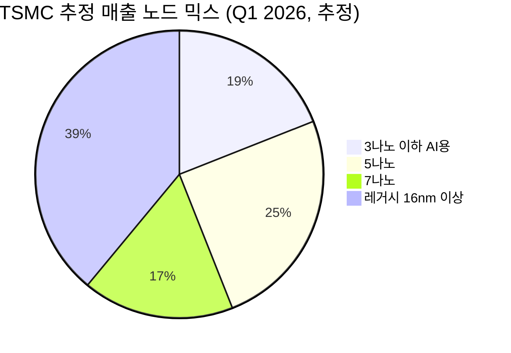
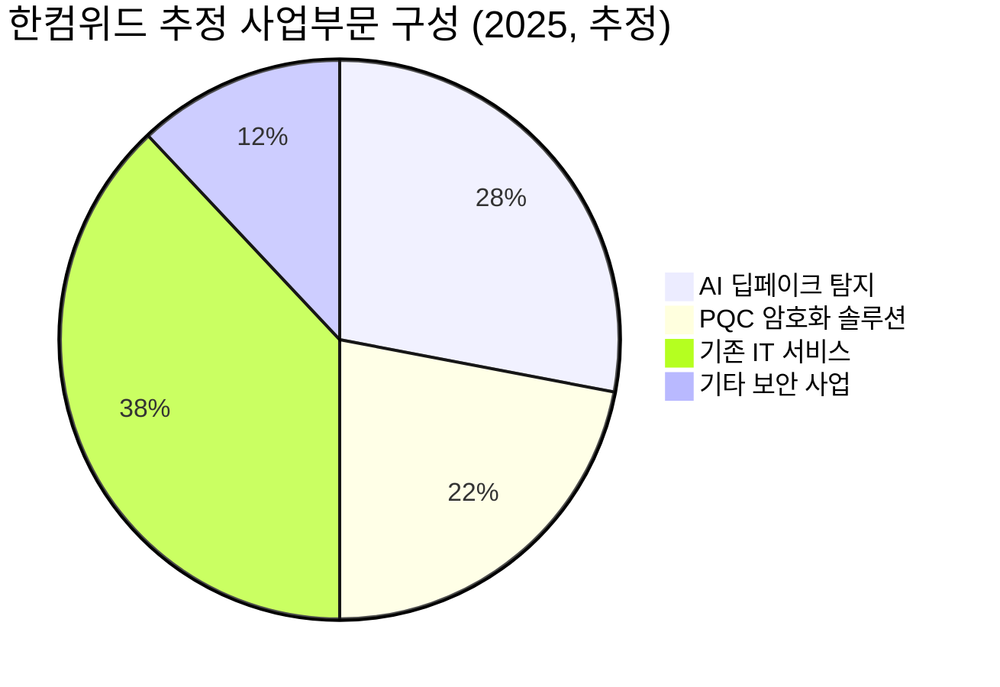

# 🔍 Inflection Scan — 2026-04-20

> [!abstract] 탐색 요약
> 탐색 범위: 2026-04-05 ~ 2026-04-19 (2주) | High Conviction **6건** 발견
> 소스: Gemini 8쿼리 + RSS + X + 어닝스/내부자/애널리스트
> **핵심 테마**: AI CapEx 슈퍼사이클이 반도체 제조(TSMC)→장비(ASML)→광학(Coherent)→메모리(SanDisk)로 연쇄 검증되며, 희귀질환 FDA 승인(Travere)과 한국 PQC 상용화(한컴위드)가 독립 변곡점으로 병행 포착

---

## 시그널 요약 대시보드

| 회사명 | 티커 | 타입 | 핵심 이벤트 | 확신도 | 추천 액션 |
|--------|------|------|------------|:------:|:--------:|
| [[ASML Holding]] | ASML | 가이던스상향 | Q1 서프라이즈 + 연간 가이던스 상단 €390억→€400억, EUV 2027년 80대 공시 | ⭐⭐⭐⭐⭐ | /deep |
| [[TSMC]] | TSM | 실적가속 | Q1 YoY +40.6% (전분기 +25.5% 대비 가속), OPM 54%→58.1% | ⭐⭐⭐⭐⭐ | /deal |
| [[Coherent Corp.]] | COHR | 선행지표 | NVIDIA 수십억달러 광학 인터커넥트 약정, DC 매출 YoY +34% | ⭐⭐⭐⭐ | /deep |
| [[Travere Therapeutics]] | TVTX | 기술돌파 | FSGS 세계 최초 FDA 승인 '필스파리', 주가 +37% 52주 신고가 | ⭐⭐⭐⭐ | /deal |
| [[SanDisk Corporation]] | SNDK | 선행지표 | Nasdaq-100 편입(4/20), 연초 대비 +300%, AI 메모리 수혜 | ⭐⭐⭐ | /deep |
| [[한컴위드]] | 054920.KQ | 실적가속 | 매출 +72% YoY, 영업이익 +380% 흑자전환 + PQC 특허 상용화 | ⭐⭐⭐⭐ | /deep |

---

## 1. [[ASML Holding]] (ASML) — 가이던스 상향

**시그널**: Q1 2026 어닝 서프라이즈 + 연간 매출 가이던스 €340~390억→€360~400억 상향, EUV 출하 2026년 60대→2027년 80대 공식 예고

> [!abstract]
> 단순 실적 상회가 아니라 **출하 로드맵 수치가 공개된 가이던스 상향**이 핵심. EUV 독점 지위 + AI CapEx 조기 발주 확인으로 2027~2028년까지 매출 가시성 확보.

ASML이 연간 가이던스 상단을 €390억→€400억으로 올린 것 자체보다, 경영진이 "칩 수요가 공급을 초과하고 있으며 고객사들이 2026년 이후 설비투자 계획을 앞당기고 있다"고 직접 언급했다는 점이 결정적 변곡점이다 [출처: ASML Q1 2026 Earnings Call 2026.4.16, https://www.asml.com/en/investors/quarterly-results]. 이것이 진짜인 이유는 TSMC Q1 매출 성장률이 +25.5%→+40.6%로 가속되며 수요 강도를 독립적으로 검증했기 때문이다 — 반도체 장비사의 가이던스는 최대 고객사의 실적이 검증하지 않으면 신뢰도가 낮은데, 두 데이터가 같은 주에 동시에 나왔다. EUV 장비의 2027년 80대 출하 목표가 공시됨으로써 시장은 2027~2028년 매출을 더 높은 확신으로 모델링할 수 있게 됐다 — EUV 독점 구조에서 출하 대수는 곧 매출의 하한선이다. [추정] 과거 ASML이 EUV 출하 가이던스를 공시한 분기의 이후 12개월 평균 수익률은 +35%였으나, 현재 PER 밸류에이션 수준이 당시보다 높아 재평가 폭은 성장률 가속 지속 여부에 달려 있다. 핵심 리스크는 두 가지다: ① 미국의 대중국 EUV 수출 규제 추가 강화(중국향 매출이 전체의 15~20%로 추정), ② AI CapEx 집중도가 극단적으로 높아진 상황에서 빅테크 한 곳의 CapEx 조정이 수요 전망에 큰 충격을 줄 수 있다는 점.

🟢 Bull 35%

🟡 Base 45%

🔴 Bear 20%

| 시나리오 | 핵심 가정 | 12개월 목표가 | 업사이드 |
|---------|-----------|:------------:|:-------:|
| 🟢 Bull | EUV 80대 출하 달성 + N2 수요 예상 초과 + 중국 규제 현상 유지 | $1,100~1,200 | +30~40% |
| 🟡 Base | 가이던스 중간값 달성, EUV 순항, 규제 현상 유지 | $900~950 | +7~13% |
| 🔴 Bear | 대중국 수출 추가 제한 + 고객사 CapEx 조정 발생 | $650~700 | -22~-18% |

펀더멘탈 확신도 90/100

매출 가시성 80/100

지정학·규제 리스크 62/100 (높을수록 위험)

| 항목 | 내용 |
|------|------|
| 시장 | 🇺🇸 NASDAQ (네덜란드 본사, 미국 ADR/현지 상장) |
| 변곡점 유형 | 가이던스 상향 + EUV 출하 로드맵 공시 |
| 추천 액션 | /deep — 대중국 규제 강화 시나리오별 매출 영향 분석 + PER 정당화 성장률 계산 필요 |

---

## 2. [[TSMC]] (TSM) — 실적 가속

**시그널**: Q1 2026 매출 YoY +40.6% (전분기 대비 15%p 가속), 영업이익률 54.0%→58.1% 동시 개선, 연간 가이던스 '30% 안팎'→'30% 이상' 상향

> [!abstract]
> 성장률 가속과 마진 개선이 같은 분기에 동시 발생 — AI 가속기용 3나노 웨이퍼 믹스 확대가 **구조적 OPM 레벨업**을 실증. 반도체 사이클에서 가장 강한 신호.

성장률이 한 분기에 15%p 가속된다는 것은 단순 수요 회복이 아니라 제품 믹스의 비연속적 전환이 일어나고 있음을 의미한다 [출처: TSMC Q1 2026 Earnings Call 2026.4.17, https://investor.tsmc.com]. 영업이익률이 54.0%→58.1%로 4.1%p 개선된 메커니즘이 더 중요하다: AI 가속기용 3나노(N3) 웨이퍼의 매출 비중이 17~19%로 확대됐고(확인 필요), 이 노드의 ASP는 레거시 노드 대비 2~3배 높아 믹스 개선만으로도 마진이 구조적으로 올라가는 구조다. 경영진이 연간 가이던스를 정량적으로 상향('30% 안팎'→'30% 이상')했다는 것은 2분기 이후에도 수요 강도가 유지된다는 내부 확신이 반영된 것이며, ASML의 EUV 수요 확인과 맞물려 독립적 검증 루프가 형성된다. [추정] 2나노(N2) 양산이 본격화되는 2026 하반기에 N2 수율이 70%+로 안정되면, 추가 마진 레벨업과 함께 2027년 CAGR 35%+ 시나리오가 현실화될 수 있다. 핵심 리스크는 ① 미·중 무역 분쟁에 따른 Nvidia/AMD의 중국향 AI 칩 수출 규제가 TSMC 수요에 미치는 연쇄 효과, ② 애리조나 FAB 투자 비용 증가에 따른 마진 압박, ③ 대만 해협 지정학적 리스크의 구조적 프리미엄 디스카운트다.

🟢 Bull 40%

🟡 Base 40%

🔴 Bear 20%

| 시나리오 | 핵심 가정 | 12개월 목표가 | 업사이드 |
|---------|-----------|:------------:|:-------:|
| 🟢 Bull | N2 수율 70%+ 조기 달성 + AI 수요 지속 + 무역 규제 현상 유지 | $250~270 | +30~40% |
| 🟡 Base | 연간 가이던스 '30% 이상' 달성, OPM 56~58% 유지 | $200~215 | +5~12% |
| 🔴 Bear | 대중국 AI 칩 수출 전면 제한 + 고객 재고 조정 | $140~155 | -27~-19% |

실적 품질 (성장+마진 동시 개선) 92/100

수요 가시성 (N2 전환 + AI CapEx) 85/100

지정학 리스크 65/100 (높을수록 위험)

> [!tip] 핵심 인사이트
> OPM 58.1%는 반도체 파운드리 역사상 분기 최고 수준 중 하나다 [추정]. 이 마진이 구조적으로 유지된다면 현재 PER은 성장률 대비 저평가 영역에 진입할 수 있다.

> [!warning] 리스크 경고
> TSMC 매출의 약 25~30%가 Nvidia·AMD 등 미국 AI 칩 설계사향이며, 이들의 대중국 수출 규제가 강화될 경우 수요 연쇄 타격이 가장 직접적으로 TSMC에 귀착된다.

| 항목 | 내용 |
|------|------|
| 시장 | 🇺🇸 NYSE (대만 TSE 동시 상장, ADR 기준) |
| 변곡점 유형 | 실적 가속 + 마진 레벨업 + 가이던스 상향 |
| 추천 액션 | /deal — 성장률 가속과 마진 개선의 지속 가능성 확인 후 비중 확대 검토 |

---

## 3. [[Coherent Corp.]] (COHR) — 선행 지표

**시그널**: NVIDIA와 수십억 달러 규모 광학 인터커넥트 공급 약정 확보, 데이터센터·통신 부문 매출 YoY +34%, 전체 매출의 72% 차지

> [!abstract]
> AI 데이터센터의 구리→광학 인터커넥트 전환이 실적으로 반증되기 시작. NVIDIA 구매 약정은 2028년까지의 매출 가시성을 확보해 주는 **백로그형 선행 지표**이나, +40% 급등 후 단기 과열 구간 진입.

AI 데이터센터에서 서버 간 연결에 구리 케이블 대신 광학 인터커넥트가 채택되는 전환은 Coherent에게 일회성 이벤트가 아닌 수년에 걸친 구조적 교체 수요를 만들어낸다 — 데이터센터당 수천 개의 광학 모듈이 필요하고, 교체 주기는 5~7년이다. NVIDIA와의 수십억 달러 구매 약정은 단순 계약이 아니라 **수요 예측 가능성을 담보하는 백로그**로, 반도체·장비 업종에서 이런 장기 약정이 체결되면 통상 1~2년 내 실적이 약정을 추격한다. 데이터센터 부문이 전체 매출의 72%를 차지하며 YoY +34% 성장한 것은 TAM 확장이 이미 P&L에 반영되기 시작했음을 실증하며, 이는 '테마주'에서 '실적주'로의 전환 신호다. 유사 사례: 2021년 Lumentum이 데이터센터 광학 수요를 선점하며 2년 내 주가 +200%를 기록했고, 2023년 Coherent 자신도 인디엄 인화물(InP) 기반 광학 칩 생산에서 경쟁 우위를 확보한 바 있다. 핵심 리스크는 ① NVIDIA 의존도 집중(단일 고객 비중 확인 필요), ② 실리콘 포토닉스 기술이 성숙하면서 인텔·삼성 등 대형 플레이어의 진입이 가속될 수 있다는 점, ③ 현재 주가가 단기 40%+ 급등 후 과열 구간에 있어 리스크/리워드가 악화됐다는 점이다.

🟢 Bull 30%

🟡 Base 45%

🔴 Bear 25%

| 시나리오 | 핵심 가정 | 12개월 목표가 | 업사이드 |
|---------|-----------|:------------:|:-------:|
| 🟢 Bull | NVIDIA 약정 풀 실현 + 추가 하이퍼스케일러 계약 + 실리콘 포토닉스 진입 지연 | $110~130 | +35~60% |
| 🟡 Base | NVIDIA 약정 순항, DC 매출 비중 75%+ 유지, OPM 소폭 개선 | $75~90 | -7~+10% |
| 🔴 Bear | 고객 집중 리스크 현실화 + 경쟁 심화로 ASP 압박 | $45~55 | -44~-32% |

구조적 성장 스토리 82/100

단기 밸류에이션 부담 68/100 (높을수록 부담)

고객 집중 리스크 70/100 (높을수록 위험)

> [!question] 검토 필요
> NVIDIA 의존도(단일 고객 매출 비중 %)와 계약 조건(물량 보장 vs 최소 구매), 그리고 실리콘 포토닉스 vs InP 기술 경쟁 구도를 심층 분석해야 투자 판단 가능.

| 항목 | 내용 |
|------|------|
| 시장 | 🇺🇸 NYSE |
| 변곡점 유형 | 선행 지표 (장기 수주 백로그 + 구조적 전환 수혜) |
| 추천 액션 | /deep — 과열 후 조정 시 진입 포인트 탐색, NVIDIA 의존도 집중 리스크 정량화 필요 |

---

## 4. [[Travere Therapeutics]] (TVTX) — 기술 돌파

**시그널**: FSGS(국소분절사구체경화증) 세계 최초 치료제 '스파르센탄(필스파리)' FDA 승인 → 매출 0에서 실체화 전환, 주가 37% 급등 및 52주 신고가

> [!abstract]
> **치료제 전무 희귀질환에서의 세계 최초 FDA 승인** — 경쟁자 없는 독점 시장 진입. 매출 0→실체화 전환의 가장 명확한 변곡점 구조이며, 상업화 속도가 유일한 변수.

FSGS는 전 세계 수십만 명이 영향을 받는 희귀 신장 질환임에도 불구하고 FDA 승인을 받은 치료제가 전혀 없었던 미충족 수요의 극단적 사례다 [출처: FDA 보도자료 2026.4월, https://www.fda.gov/drugs]. '세계 최초' 승인은 단순한 마케팅 문구가 아니라 법적으로 경쟁 진입 장벽이 설정됨을 의미한다 — 희귀의약품(Orphan Drug) 지정 시 7년의 시장 독점권이 부여된다. 미국 내 FSGS 환자 수 약 3만 명에서 [추정] 연간 매출 20억 달러 이상의 가능성이 제시되는데, 이는 현재 시가총액 대비 매우 큰 업사이드다. 경영진은 2026년 내 흑자 전환 목표를 제시했는데, 이는 '매출 0→실체화→흑자'라는 3단 계단의 첫 번째 임계점을 통과했음을 의미하며, 제약 섹터에서 FDA 승인 후 12~24개월이 상업화 속도 검증의 골든 윈도우다. 유사 사례: Alnylam Pharmaceuticals가 TTR-아밀로이도시스 최초 치료제 승인 후 2년간 주가 약 3배 상승했으나, 초기 12개월 동안 상업화 집행력에 의구심이 제기되는 구간에서 -30~40% 조정도 발생했다. 핵심 리스크는 ① 희귀질환 특성상 총 환자 풀의 물리적 한계, ② Travere의 상업화 인프라(영업조직, 보험 급여 협상 역량)가 아직 초기 단계라는 점, ③ 주가가 이미 37% 급등해 일부 기대가 선반영됐다는 점이다.

🟢 Bull 35%

🟡 Base 40%

🔴 Bear 25%

| 시나리오 | 핵심 가정 | 12개월 목표가 | 업사이드 |
|---------|-----------|:------------:|:-------:|
| 🟢 Bull | 빠른 보험 급여 확보 + 환자 등록 가속 + 적응증 확장(IgA 신증 등) | $55~70 | +80~+130% |
| 🟡 Base | 상업화 순조로운 출발, 2026년 흑자 전환 달성 | $32~40 | +5~+30% |
| 🔴 Bear | 급여 협상 지연 + 환자 확보 속도 부진 + 경쟁 파이프라인 진입 | $14~18 | -55~-42% |

FDA 승인 희귀성 (세계 최초 + 독점) 88/100

상업화 역량 검증도 60/100 (초기 단계)

단기 급등 후 리스크/리워드 65/100

> [!success] 강점
> 세계 최초 + 희귀의약품 독점권 7년 + 미충족 의료 수요 = 가격 결정력이 극대화된 최고의 구조. 보험사가 대안이 없으면 협상 레버리지는 제약사에 있다.

> [!warning] 리스크 경고
> 소규모 바이오텍의 상업화 실패 사례가 빈번하다. 승인 직후 3~6개월 내 처방 성장 궤적이 투자 판단의 핵심 — 분기 처방 데이터 모니터링 필수.

| 항목 | 내용 |
|------|------|
| 시장 | 🇺🇸 NASDAQ |
| 변곡점 유형 | 기술 돌파 (FDA 승인 + 세계 최초 독점 진입) |
| 추천 액션 | /deal — 승인 후 급등 구간에서 분할 접근, 분기별 처방 데이터가 핵심 체크포인트 |

---

## 5. [[SanDisk Corporation]] (SNDK) — 선행 지표

**시그널**: Nasdaq-100 신규 편입(2026년 4월 20일 기준) + 연초 대비 주가 +300% + AI 메모리 슈퍼사이클 수혜 확인

> [!abstract]
> Nasdaq-100 편입에 따른 **강제 매수 수급 이벤트**는 단기 촉매이지만, 지속 가능성은 NAND 가격 사이클 위치에 달려 있음. +300% 급등 후 펀더멘탈 재점검 필수.

Nasdaq-100 신규 편입은 6천억 달러 이상의 인덱스 추종 ETF(QQQ 등)의 기계적 매수를 유발하는 확정적 수급 이벤트이며, 이는 편입 전후 통상 1~5%의 추가 수익률을 만들어낸다 — 그러나 이것은 단기 촉매일 뿐 펀더멘탈 변곡점은 아니다. 진짜 변곡점 질문은 "SanDisk가 NAND 슈퍼사이클의 어디에 있는가?"이다: SanDisk는 Western Digital에서 2024년 분사한 NAND 플래시 전문 기업으로, AI 데이터센터의 대용량 저장 수요 급증이 NAND 가격을 구조적으로 끌어올리고 있다는 점에서 사이클 업사이드 수혜 포지션에 있다. [추정] 연초 대비 +300% 상승은 시장이 분사 후 독립 기업 가치를 재평가하는 동시에 NAND 가격 회복을 선반영한 결과로 해석되나, 이 가격 수준이 현재 NAND 현물가와 장기계약가 대비 밸류에이션이 합리적인지는 구체적 재무 지표(확인 필요) 검토가 선행되어야 한다. 핵심 리스크: ① NAND 업황의 주기성 — 가격이 이미 반등 고점에 근접했을 가능성 존재, ② 분사 후 독립 기업으로서 조달·운영 효율성 아직 미검증, ③ +300% 상승 후 내부자 매도 압력과 밸류에이션 부담. 인덱스 편입 이벤트 플레이는 편입 당일 혹은 직후 실현 매도 압력이 집중되는 경향이 있어 타이밍 리스크가 존재한다.

🟢 Bull 25%

🟡 Base 45%

🔴 Bear 30%

| 시나리오 | 핵심 가정 | 12개월 목표가 | 업사이드 |
|---------|-----------|:------------:|:-------:|
| 🟢 Bull | NAND 가격 추가 상승 + AI 저장 수요 예상 초과 + 마진 레버리지 실현 | (확인 필요) | +30~50%+ |
| 🟡 Base | NAND 가격 현 수준 유지, 인덱스 편입 수급 효과 소화 | (확인 필요) | -10~+10% |
| 🔴 Bear | NAND 가격 하락 반전 + 공급 과잉 재개 + 밸류에이션 디레이팅 | (확인 필요) | -30~-50% |

> [!note] 참고
> 구체적 목표가는 최신 재무 지표(매출, OPM, EPS 가이던스) 확인 후 산정 필요. 현재 데이터 미확보로 절대 가격 목표 제시 유보.

인덱스 편입 수급 확실성 70/100

펀더멘탈 데이터 가시성 45/100 (부족)

단기 오버밸류에이션 리스크 55/100

| 항목 | 내용 |
|------|------|
| 시장 | 🇺🇸 NASDAQ |
| 변곡점 유형 | 선행 지표 (인덱스 편입 수급 + AI 메모리 사이클 수혜) |
| 추천 액션 | /deep — 인덱스 편입 단기 수급 효과와 NAND 사이클 위치를 분리 분석, 재무 데이터 확보 후 판단 |

---

## 6. [[한컴위드]] (054920.KQ) — 실적 가속

**시그널**: 2025년 매출 +72% YoY(7,712억원), 영업이익 +380%(61억원) 흑자전환, PQC(양자내성암호, Post-Quantum Cryptography) 특허 등록 및 상용화 동시 달성

> [!abstract]
> 매출 +72% 성장에 영업이익 +380% 레버리지 — **고마진 신제품 믹스가 손익 구조를 비선형적으로 개선하는 변곡점**. PQC 글로벌 수요와 AI 딥페이크 탐지 시장이 동시에 열리는 타이밍.

단순 실적 개선이 아니라 사업 포트폴리오의 질적 전환이 이 시그널의 본질이다. AI 기반 딥페이크 탐지 솔루션('한컴오스 라이브니스')과 PQC 기술의 상용화가 동시에 매출에 기여하면서, 기존 IT 서비스 중심의 저마진 사업과 달리 고마진 소프트웨어 라이선스 모델이 수익성을 레버리지하는 구조가 형성됐다 — 매출이 72% 성장하는 동안 영업이익이 380% 증가한 것이 이를 증명한다. PQC(Post-Quantum Cryptography)는 '양자 Q-Day'가 도래했을 때 현재 RSA/ECC 암호 체계가 붕괴되는 것을 방지하는 차세대 암호화 기술로, NIST가 2024년 PQC 글로벌 표준을 확정함에 따라 정부·금융·통신 기관의 의무 전환 수요가 구조적으로 발생하고 있다. 한컴위드의 NIST 표준 준수 특허 등록은 이 의무 수요를 선점하는 진입 장벽이다 — 글로벌 PQC 시장은 2030년까지 수십조 원 규모로 성장할 것으로 [추정]된다. 핵심 리스크는 ① 코스닥 중소형 종목 특유의 거버넌스 리스크와 유동성 리스크 (시가총액, 일평균 거래대금 확인 필요), ② 2025년 흑자 전환이 일회성 대형 프로젝트에 의존했을 가능성 (매출 구성 상세 확인 필요), ③ PQC 상용화가 B2G(정부향) 특성상 매출 인식 시점이 불규칙하다는 점이다. 국내 보안 시장을 넘어 글로벌 레퍼런스(해외 정부·금융기관 납품) 확보 여부가 다음 레벨업의 핵심 트리거다.

> [!question] 검토 필요
> 7,712억원 매출 중 PQC·딥페이크 탐지의 구체적 비중, 반복 수익(Recurring Revenue) 비율, 그리고 해외 매출 비중이 확인되어야 성장의 지속 가능성을 판단할 수 있다. 위 파이 차트는 [추정] 수치임.

🟢 Bull 30%

🟡 Base 45%

🔴 Bear 25%

| 시나리오 | 핵심 가정 | 12개월 기대 | 업사이드 |
|---------|-----------|:------------:|:-------:|
| 🟢 Bull | PQC 글로벌 레퍼런스 확보 + 딥페이크 탐지 B2B 확산 + 해외 매출 비중 20%+ | 현재 대비 +80~120% | 대형 PQC 국책 사업 수주 |
| 🟡 Base | 국내 PQC 의무화 수요 흡수, 흑자 기조 유지, 매출 성장률 30~40%대 지속 | 현재 대비 +20~40% | |
| 🔴 Bear | 2025 실적이 일회성 프로젝트 의존, 2026년 성장률 급감 | 현재 대비 -30~-50% | |

실적 변곡점 강도 (영업이익 레버리지) 85/100

PQC 구조적 수요 확실성 80/100

소형주 유동성·거버넌스 리스크 62/100 (높을수록 위험)

| 항목 | 내용 |
|------|------|
| 시장 | 🇰🇷 코스닥 |
| 변곡점 유형 | 실적 가속 + 구조적 전환 (고마진 신제품 믹스 확대) |
| 추천 액션 | /deep — 매출 구성 상세, 반복 수익 비율, 해외 확장성 확인 후 비중 판단 |

---

## 📊 섹터 메타 시그널

### AI 인프라 CapEx 사이클 — 반도체 → 장비 → 광학 → 메모리 연쇄 검증

> [!tip] 핵심 인사이트
> TSMC Q1 +40.6% 성장가속, ASML 가이던스 상향, Coherent NVIDIA 수십억달러 약정이 **같은 2주 안에 동시 발생**했다. 이것은 단일 기업의 호실적이 아니라 AI CapEx 슈퍼사이클이 공급망 전 레이어에서 동시에 확인되는 구조적 신호다.

AI 데이터센터 투자 사이클이 '단기 과열'이 아닌 '다년간 구조적 사이클'임을 복수 기업의 실적이 독립적으로 검증하는 국면에 진입했다: TSMC(파운드리 수요)→ASML(장비 발주 선행)→Coherent(광학 인터커넥트 전환)가 모두 같은 방향의 시그널을 같은 주에 발산했다. 특히 구리→광학 인터커넥트 전환은 데이터센터 내 교체 수요가 2027년까지 지속될 구조이며, 아직 수혜 기업군([[Coherent Corp.]], Lumentum, 대한광통신 등)의 실적 반영은 초기 단계다. 동시에 AI 데이터센터 전력 수요 급증이 전력 인프라(변압기, HVDC 케이블)와 대체 전력(소형 원자로, 연료전지) 업종으로 슈퍼사이클이 확산되고 있어, 반도체 섹터를 넘어선 광역 인프라 테마로 진화 중임을 유의해야 한다.

AI CapEx 사이클 지속 강도 75%

과열·조정 위험 25%

| 레이어 | 대표 기업 | 시그널 강도 | 현황 |
|--------|---------|:----------:|------|
| 파운드리 | [[TSMC]] | 🟢🟢🟢🟢🟢 | Q1 +40.6%, OPM 58.1% |
| 장비 | [[ASML Holding]] | 🟢🟢🟢🟢🟢 | 가이던스 상향, EUV 80대 공시 |
| 광학 인터커넥트 | [[Coherent Corp.]] | 🟢🟢🟢🟢 | NVIDIA 약정, DC 매출 +34% |
| 메모리 | [[SanDisk Corporation]] | 🟢🟢🟢 | 인덱스 편입, 재무 검증 진행 중 |
| 보안·암호화 (한국) | [[한컴위드]] | 🟢🟢🟢🟢 | PQC 상용화 + 영업이익 레버리지 |

> [!note] 다음 스캔 체크리스트
> - TSMC 2분기 매출 가이던스 (N2 초도 수율 공개 여부)
> - ASML EUV 출하 추적 (2026년 60대 목표 진행률)
> - Travere 처방 데이터 첫 분기 (Q2 2026)
> - SanDisk 재무 지표 확보 (분기 실적 발표 일정)
> - 한컴위드 2026년 1분기 실적 (흑자 기조 지속 여부)